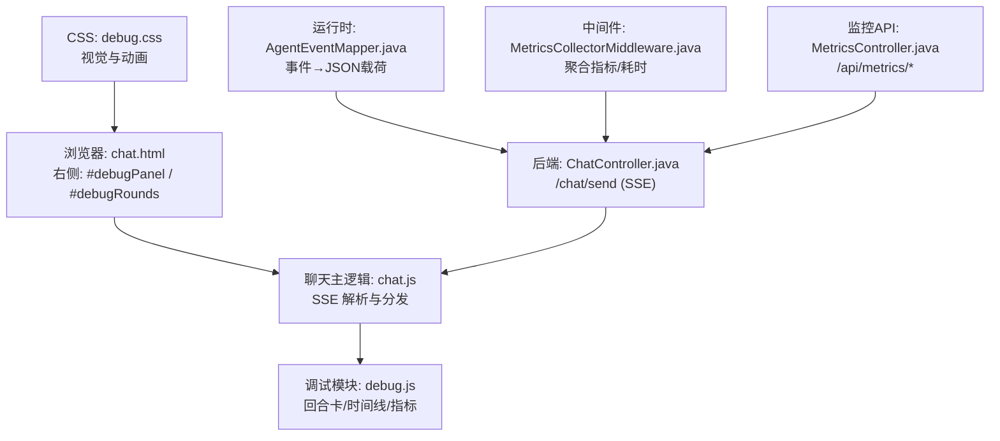
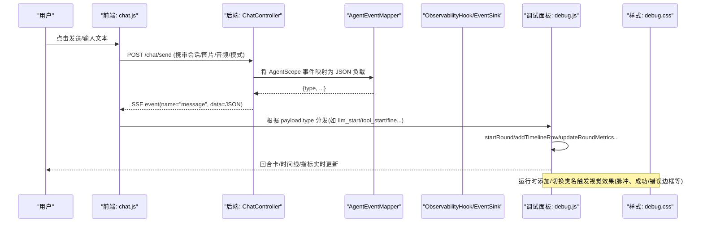
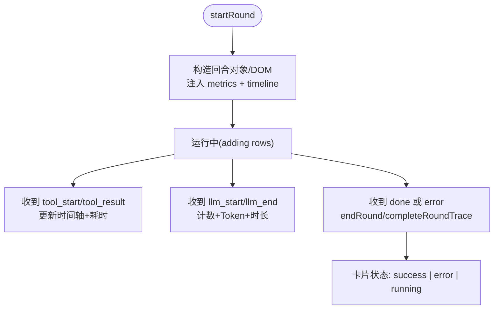
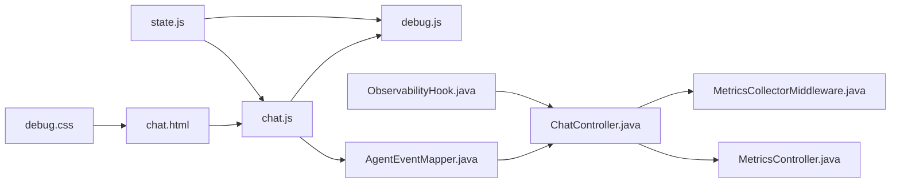

# 前端调试面板

<cite>
**本文引用的文件**
- [ChatController.java](file://src/main/java/com/skloda/agentscope/controller/ChatController.java)
- [AgentEventMapper.java](file://src/main/java/com/skloda/agentscope/runtime/AgentEventMapper.java)
- [MetricsCollectorMiddleware.java](file://src/main/java/com/skloda/agentscope/middleware/MetricsCollectorMiddleware.java)
- [ObservabilityHook.java](file://src/main/java/com/skloda/agentscope/hook/ObservabilityHook.java)
- [MetricsController.java](file://src/main/java/com/skloda/agentscope/controller/MetricsController.java)
- [chat.html](file://src/main/resources/templates/chat.html)
- [debug.js](file://src/main/resources/static/scripts/modules/debug.js)
- [ui.js](file://src/main/resources/static/scripts/modules/ui.js)
- [chat.js](file://src/main/resources/static/scripts/chat.js)
- [state.js](file://src/main/resources/static/scripts/state.js)
- [debug.css](file://src/main/resources/static/styles/modules/debug.css)
- [2026-04-12-debug-panel-observability-design.md](file://docs/superpowers/specs/2026-04-12-debug-panel-observability-design.md)
</cite>

## 目录
1. [简介](#简介)
2. [项目结构](#项目结构)
3. [核心组件](#核心组件)
4. [架构总览](#架构总览)
5. [详细组件分析](#详细组件分析)
6. [依赖分析](#依赖分析)
7. [性能考量](#性能考量)
8. [故障排查指南](#故障排查指南)
9. [结论](#结论)
10. [附录](#附录)

## 简介
本章节面向使用 AgentScope Demo 的前端调试面板，详细说明如何启用与关闭调试面板、观看实时事件流与分析性能指标。文档从“用户操作”到“数据流实现”逐层解释：SSE 事件解析、时间戳记录、模型调用追踪、Token 统计，以及多智能体协作（路由、流水线、会谈、任务等）的可视化。同时给出定位慢调用、识别工具调用瓶颈和分析多智能体流程的最佳实践，并覆盖常见问题修复方法。

## 项目结构
调试面板在右侧侧边栏内渲染，核心由三部分组成：
- 页面容器：chat.html 提供调试区域 HTML 节点与切换按钮。
- 样式与脚本：debug.css 定义圆角卡片、运行中的脉冲动画、清理按钮等；debug.js 负责回合（round）创建、状态管理与时间线绘制。
- 事件驱动：chat.js 作为主 SSE 解析器，分发各种事件类型到 debug.js；AgentEventMapper 将后端 AgentScope 事件映射为统一 JSON 载荷；MetricsCollectorMiddleware 收集全局性能指标，可通过 MetricsController 暴露查询/重置接口。

图表来源
- [chat.html:79-90](file://src/main/resources/templates/chat.html#L79-L90)
- [chat.js:129-178](file://src/main/resources/static/scripts/chat.js#L129-L178)
- [debug.js:5-61](file://src/main/resources/static/scripts/modules/debug.js#LL5-L61)
- [AgentEventMapper.java:64-105](file://src/main/java/com/skloda/agentscope/runtime/AgentEventMapper.java#L64-L105)
- [MetricsCollectorMiddleware.java:31-91](file://src/main/java/com/skloda/agentscope/middleware/MetricsCollectorMiddleware.java#L31-L91)
- [MetricsController.java:15-57](file://src/main/java/com/skloda/agentscope/controller/MetricsController.java#L15-L57)

小节来源
- [chat.html:79-90](file://src/main/resources/templates/chat.html#L79-L90)
- [debug.css:1-173](file://src/main/resources/static/styles/modules/debug.css#L1-L173)

## 核心组件
- 回合卡（Round Card）：每个对话回合生成一张卡片，显示消息摘要、模型名称、Token 与耗时统计、工具调用数、状态标识（运行中/成功/错误）。支持折叠展开详情。
- 时间线视图（Timeline）：卡片内部按步骤顺序追加行，表示 agent_start、thinking/text 块、工具调用起止、循环/路由/流水线/会谈/黑版更新等多智能体事件，含连接符、图标、标签、度量与状态。
- 指标摘要：卡片顶部或展开区汇总输入/输出 Token、LLM 耗时、工具耗时、速度（tokens/s）、累计 LLM/工具调用次数。
- Token 统计：依据 llm_end 事件的 inputTokens/outputTokens/totalTokens 累积计算。
- 模型调用追踪：llm_start → llm_end 构成一次模型调用，用于时长与 Token 维度分析。

小节来源
- [debug.js:5-172](file://src/main/resources/static/scripts/modules/debug.js#L5-L172)
- [chat.js:178-260](file://src/main/resources/static/scripts/chat.js#L178-L260)
- [AgentEventMapper.java:158-170](file://src/main/java/com/skloda/agentscope/runtime/AgentEventMapper.java#L158-L170)

## 架构总览
以下序列图展示了从前端发送消息到后端事件流、再到调试面板渲染的完整链路。

图表来源
- [chat.js:24-111](file://src/main/resources/static/scripts/chat.js#L24-L111)
- [ChatController.java:122-153](file://src/main/java/com/skloda/agentscope/controller/ChatController.java#L122-L153)
- [AgentEventMapper.java:64-105](file://src/main/java/com/skloda/agentscope/runtime/AgentEventMapper.java#L64-L105)
- [ObservabilityHook.java:45-67](file://src/main/java/com/skloda/agentscope/hook/ObservabilityHook.java#L45-L67)
- [debug.js:5-172](file://src/main/resources/static/scripts/modules/debug.js#L5-L172)
- [debug.css:138-173](file://src/main/resources/static/styles/modules/debug.css#L138-L173)

## 详细组件分析

### 1) 启动与关闭调试面板、查看事件流、分析指标
- 打开/关闭：页面加载后，右侧已存在 #debugPanel，通过 header 中的切换按钮即可折叠/展开。
- 进入调试模式：无需额外开关；开始一次对话（点击 SEND），调试面板自动记录回合与事件流。
- 实时事件流：左侧聊天区展示可见内容（思考区/正文/工具开始/审批提示等），右侧调试面板呈现更细粒度的时序（agent_start、thinking/text 分片、tool_start/tool_result、loop/routing/pipeline、黑版更新等）。
- 指标分析：每次 llm_end 更新 Token 与 LLM 耗时；tool_start/tool_result 配合时间戳更新工具调用耗时；done 时最终收敛卡片状态。

小节来源
- [chat.html:79-90](file://src/main/resources/templates/chat.html#L79-L90)
- [chat.js:178-260](file://src/main/resources/static/scripts/chat.js#L178-L260)
- [debug.js:113-154](file://src/main/resources/static/scripts/modules/debug.js#L113-L154)

### 2) 回合卡片（Round Cards）
- 创建：startRound 接收用户消息、当前轮次、当前 Agent 及 Agents 列表，生成回合对象与 DOM 节点，标记 running，初始化时间线容器与指标区。
- 更新：addTimelineRow/ForRound 追加行至时间线；updateRoundMetrics/ForRound 基于 inputTokens/outputTokens/llmTime/toolCallCount 计算速度并刷新摘要与详情。
- 结束：endRound 设置 endTime 与状态，清空运行中标记行，completeRoundTrace 根据 success/error 更换卡片边框与高亮。

图表来源
- [debug.js:5-111](file://src/main/resources/static/scripts/modules/debug.js#L5-L111)
- [debug.js:174-200](file://src/main/resources/static/scripts/modules/debug.js#L174-L200)
- [debug.js:113-154](file://src/main/resources/static/scripts/modules/debug.js#L113-L154)

小节来源
- [debug.js:5-172](file://src/main/resources/static/scripts/modules/debug.js#L5-L172)

### 3) 时间线视图（Timeline）
- 数据结构：每行包含 connector（连接线）、icon（图标）、label（动作/工具名）、metrics（度量信息）、status（状态文案）。
- 事件映射：
  - agent_start：阶段入口
  - thinking/text：分片推进（文本以流式拼接）
  - tool_start/tool_result：工具调用起止，含 id/name、duration_ms 等
  - loop_start/iteration/result/end、pipeline_*、routing、handoff、roundtable、blackboard patch、task delegate/start/end/aggregation
  - llm_start/llm_end：LLM 调用边界与用量
  - pending_approval：HITL 审批暂停点

小技巧：当首次可见内容到达前，聊天区域保留打字指示器；调试面板的时间线提前展示调度过程，避免“无响应真空期”。

小节来源
- [chat.js:178-260](file://src/main/resources/static/scripts/chat.js#L178-L260)
- [AgentEventMapper.java:107-200](file://src/main/java/com/skloda/agentscope/runtime/AgentEventMapper.java#L107-L200)

### 4) 指标摘要与 Token 统计
- 摘要来源：每轮维护 inputTokens/outputTokens/llmTime/toolTime/toolCallCount/llmCallCount 等。
- 计算方法：
  - Token：累加每次 llm_end 返回的 tokens。
  - Speed：outputTokens / llmTime（当 llmTime > 0）。
  - 工具耗时：tool_result 的时间戳与对应 tool_start 时间差。
- 展示：Summary 一行显示总量、LLM 耗时与工具调用数；Details 折叠显示更多字段。

小节来源
- [debug.js:113-154](file://src/main/resources/static/scripts/modules/debug.js#L113-L154)
- [AgentEventMapper.java:158-170](file://src/main/java/com/skloda/agentscope/runtime/AgentEventMapper.java#L158-L170)

### 5) 模型调用追踪
- 起始与结束：llm_start/llm_end 成对出现，用于计算单次 LLM 调用耗时。
- 用量来源：ModelCallEndEvent 携带 usage，提取 input/output/totalTokens。

小节来源
- [AgentEventMapper.java:158-170](file://src/main/java/com/skloda/agentscope/runtime/AgentEventMapper.java#L158-L170)

### 6) 调试数据收集机制（SSE 解析、时间戳、性能指标）
- SSE 解析：chat.js 使用 TextDecoder + 自定义 createSSEParser 读取流，解析 name/data，转发给 switch(type) 分支。
- 时间戳记录：
  - 后端：onActing/onReasoning 捕获 ToolUseBlock 开始时间并在完成时计算耗时；可选地通过 ObservabilityHook 发射多智能体事件；MetricsCollectorMiddleware 在 onAgent/...onComplete 中记录 Agent 级耗时与错误率等。
  - 前端：tool_call/tool_result 携带时间戳以便前端计算耗时；llm_start/llm_end 形成调用区间。
- 性能指标：
  - 中间层（MetricsCollectorMiddleware）聚合工具/Agent 维度耗时、Token 总数、错误数与估算成本，并提供控制台输出和 API 查询（见下一节）。

小节来源
- [chat.js:129-178](file://src/main/resources/static/scripts/chat.js#L129-L178)
- [MetricsCollectorMiddleware.java:50-162](file://src/main/java/com/skloda/agentscope/middleware/MetricsCollectorMiddleware.java#L50-L162)
- [ObservabilityHook.java:45-67](file://src/main/java/com/skloda/agentscope/hook/ObservabilityHook.java#L45-L67)

### 7) 指标与监控 API
- 控制台打印：POST /api/metrics/print
- 重置指标：POST /api/metrics/reset
- 指标概览：GET /api/metrics/status

可结合上述 API 快速验证服务侧的指标采集是否正确。

小节来源
- [MetricsController.java:15-57](file://src/main/java/com/skloda/agentscope/controller/MetricsController.java#L15-L57)

### 8) 最佳实践：定位慢调用、识别瓶颈、分析多智能体协作
- 定位慢调用
  - 优先观察 llm_end 的 totalTokens 与耗时分布，若单个 LLM 调用过长，检查对应模型的 streaming 与上下文长度。
  - 工具耗时集中在某些 tool_name，查看 tool_start→tool_result 的行间距与状态，必要时增加服务端日志或降低参数规模。
- 识别工具调用瓶颈
  - 关注 tool_result 的 duration_ms 与 status。
  - 对高频重复的工具调用，考虑批量处理、缓存或异步化。
- 分析多智能体协作
  - 流水线：检查 pipeline step 的起止与耗时，定位哪个 Step 阻塞。
  - 路由与会谈：关注 routing 决策与 roundtable summary，确认专家选择是否合理。
  - 黑版（Blackboard）：观察 patch 事件频次与大小，避免过度写入导致网络抖动。
- Token 控制
  - 控制 prompt 长度、减少冗余历史、合理使用 compaction/memory。

小节来源
- [debug.js:113-154](file://src/main/resources/static/scripts/modules/debug.js#L113-L154)
- [AgentEventMapper.java:172-200](file://src/main/java/com/skloda/agentscope/runtime/AgentEventMapper.java#L172-L200)
- [ObservabilityHook.java:45-67](file://src/main/java/com/skloda/agentscope/hook/ObservabilityHook.java#L45-L67)
- [MetricsCollectorMiddleware.java:187-205](file://src/main/java/com/skloda/agentscope/middleware/MetricsCollectorMiddleware.java#L187-L205)

## 依赖分析
调试面板的前端状态与交互强耦合于 chat.js 的事件分发能力与 debug.js 的状态管理。后端依赖 AgentEventMapper 的一致性映射与 ObservabilityHook 的多智能体事件补充；中间件提供系统级指标，控制器暴露运维接口。

图表来源
- [chat.html:79-90](file://src/main/resources/templates/chat.html#L79-L90)
- [chat.js:129-178](file://src/main/resources/static/scripts/chat.js#L129-L178)
- [debug.js:5-172](file://src/main/resources/static/scripts/modules/debug.js#L5-L172)
- [AgentEventMapper.java:64-105](file://src/main/java/com/skloda/agentscope/runtime/AgentEventMapper.java#L64-L105)
- [ChatController.java:122-153](file://src/main/java/com/skloda/agentscope/controller/ChatController.java#L122-L153)
- [MetricsCollectorMiddleware.java:31-91](file://src/main/java/com/skloda/agentscope/middleware/MetricsCollectorMiddleware.java#L31-L91)
- [MetricsController.java:15-57](file://src/main/java/com/skloda/agentscope/controller/MetricsController.java#L15-L57)
- [ObservabilityHook.java:45-67](file://src/main/java/com/skloda/agentscope/hook/ObservabilityHook.java#L45-L67)
- [state.js:38-164](file://src/main/resources/static/scripts/state.js#L38-L164)

小节来源
- [chat.js:129-178](file://src/main/resources/static/scripts/chat.js#L129-L178)
- [debug.js:5-172](file://src/main/resources/static/scripts/modules/debug.js#L5-L172)
- [AgentEventMapper.java:64-105](file://src/main/java/com/skloda/agentscope/runtime/AgentEventMapper.java#L64-L105)
- [MetricsCollectorMiddleware.java:31-91](file://src/main/java/com/skloda/agentscope/middleware/MetricsCollectorMiddleware.java#L31-L91)
- [MetricsController.java:15-57](file://src/main/java/com/skloda/agentscope/controller/MetricsController.java#L15-L57)

## 性能考量
- SSE 流控：避免在同一窗口内开启过多并行会话造成事件堆积；必要时使用 sessionType 区分上下文。
- Token 压缩：合理使用内存压缩与历史合并，减少 prompt 尺寸以降低 LLM 延迟。
- 工具优化：将大文件解析（PDF/DOCX/XLSX）置于后台或批量化，避免阻塞主线程。
- 中间层开销：MetricsCollectorMiddleware 会增加少量 CPU/内存开销，生产环境可按需降级或仅采样上报。

## 故障排查指南
- 调试面板不显示
  - 检查页面右侧是否存在 #debugPanel 节点；若被 CSS 隐藏（collapsed），点击切换按钮恢复宽度。
  - 确认未主动移除 DOM；如遇 DOM 丢失，刷新页面可重建。
- 数据不完整/错乱
  - 确认 chat.js 的 SSE 解析正常（浏览器 Network 面板可查看 /chat/send 的分块响应）。
  - 核对后端 AgentEventMapper 是否将必要事件映射为 JSON 载荷；如有空事件或异常，面板可能停滞。
  - 遇到 “No round to end!”：说明 startRound 未正确建立 currentRound；可在 sendMessage 入口处检查，并确保一轮结束后 clear currentRound。
- 刷新后丢失
  - 前端调试状态驻留在内存（window.rounds/currentRound），刷新即清空属正常行为；如需持久化可在未来扩展 localStorage。
- 性能抖动
  - 若时间线过快增长导致卡顿，可在达到一定行数后进行裁剪或分页展示；或将大工具结果转为摘要。
- 指标不更新
  - 调用 GET /api/metrics/status 确认接口可用；如需复位，POST /api/metrics/reset。

小节来源
- [debug.js:63-111](file://src/main/resources/static/scripts/modules/debug.js#L63-L111)
- [chat.js:129-178](file://src/main/resources/static/scripts/chat.js#L129-L178)
- [AgentEventMapper.java:64-105](file://src/main/java/com/skloda/agentscope/runtime/AgentEventMapper.java#L64-L105)
- [MetricsController.java:15-57](file://src/main/java/com/skloda/agentscope/controller/MetricsController.java#L15-L57)

## 结论
本项目的调试面板通过 SSE 将 AgentScope 事件流转化为可观测的前端 UI：回合卡组织每轮对话、时间线还原完整执行顺序、指标摘要与 Token 统计帮助快速定位瓶颈。结合后端指标中间件与监控 API，既能做局部排障也能做整体性能审计。建议在生产环境下适度关闭调试面板以提升体验，仅在开发/诊断场景打开。

## 附录
- 设计参考：[2026-04-12-debug-panel-observability-design.md](file://docs/superpowers/specs/2026-04-12-debug-panel-observability-design.md)