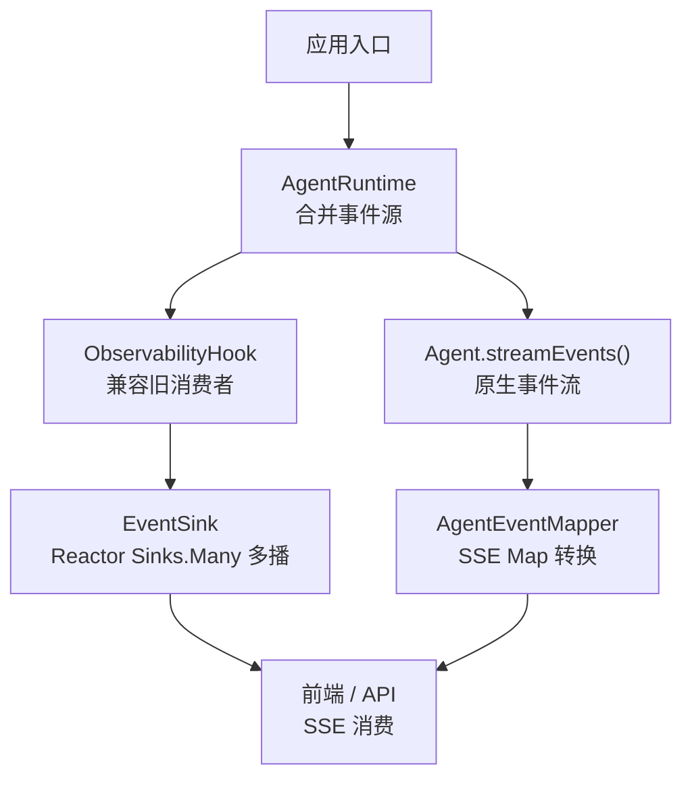
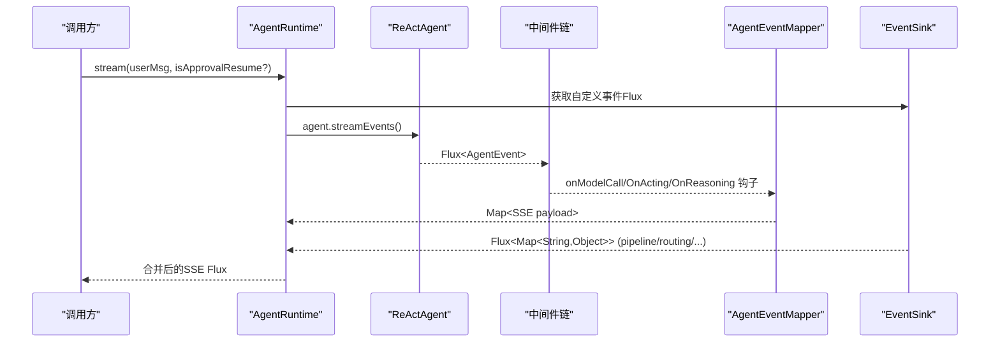
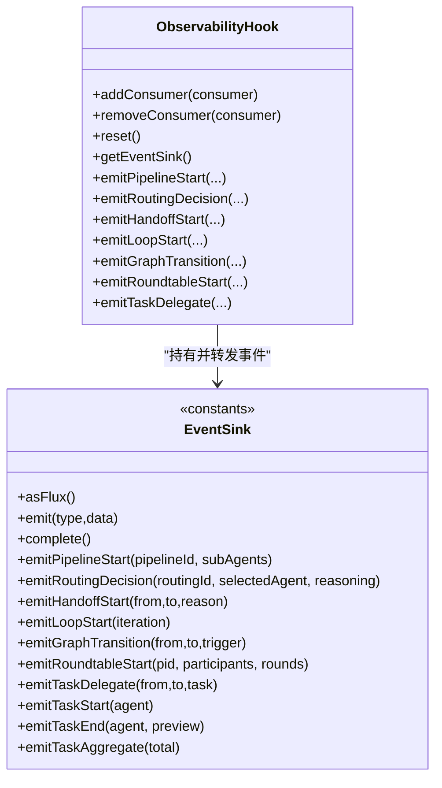
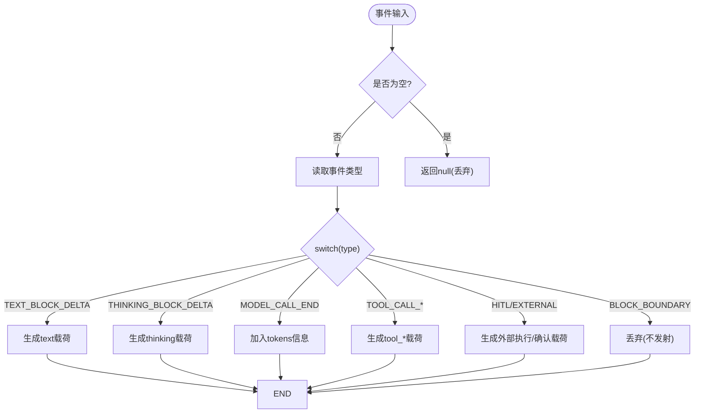
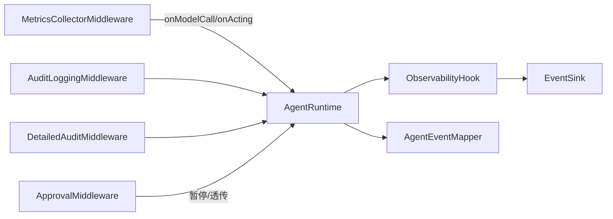

# 后端可观测性

<cite>
**本文引用的文件**
- [ObservabilityHook.java](file://src/main/java/com/skloda/agentscope/hook/ObservabilityHook.java)
- [EventSink.java](file://src/main/java/com/skloda/agentscope/runtime/EventSink.java)
- [AgentRuntime.java](file://src/main/java/com/skloda/agentscope/runtime/AgentRuntime.java)
- [AgentEventMapper.java](file://src/main/java/com/skloda/agentscope/runtime/AgentEventMapper.java)
- [MetricsCollectorMiddleware.java](file://src/main/java/com/skloda/agentscope/middleware/MetricsCollectorMiddleware.java)
- [AuditLoggingMiddleware.java](file://src/main/java/com/skloda/agentscope/middleware/AuditLoggingMiddleware.java)
- [DetailedAuditMiddleware.java](file://src/main/java/com/skloda/agentscope/middleware/DetailedAuditMiddleware.java)
- [ApprovalMiddleware.java](file://src/main/java/com/skloda/agentscope/middleware/ApprovalMiddleware.java)
- [application.yml](file://src/main/resources/application.yml)
</cite>

## 目录
1. [引言](#引言)
2. [项目结构（与可观测性相关）](#项目结构与可观测性相关)
3. [核心组件总览](#核心组件总览)
4. [架构概览](#架构概览)
5. [详细组件分析](#详细组件分析)
6. [依赖关系分析](#依赖关系分析)
7. [性能与并发特性](#性能与并发特性)
8. [监控与告警配置指南](#监控与告警配置指南)
9. [故障诊断方法](#故障诊断方法)
10. [结论](#结论)

## 引言
本文件系统性地梳理 AgentScope 演示工程的“后端可观测性”体系，重点覆盖：
- ObservabilityHook 的桥接设计与 EventSink 机制（事件总线、生命周期）
- AgentEventMapper 的事件转换（30+ 事件类型映射、序列化策略、错误兜底）
- 中间件的可观测性功能（指标收集、审计日志、审批跟踪）
- 监控配置指南（日志级别、指标导出位置、告警建议）
- 故障诊断方法（日志分析、性能定位、内存泄漏排查、并发问题定位）

## 项目结构（与可观测性相关）
与可观测性密切相关的代码位于以下包：
- hook：提供对旧式 Hook 消费端的兼容与多 Agent 事件发射桥接
- runtime：运行时串流入口、事件转换器及事件 sink
- middleware：实现横切的审计、度量与审批等能力
- resources/application.yml：全局日志级别与模型/工具开关

图表来源
- [ObservabilityHook.java:11-67](file://src/main/java/com/skloda/agentscope/hook/ObservabilityHook.java#L11-L67)
- [EventSink.java:11-151](file://src/main/java/com/skloda/agentscope/runtime/EventSink.java#L11-L151)
- [AgentRuntime.java:67-95](file://src/main/java/com/skloda/agentscope/runtime/AgentRuntime.java#L67-L95)
- [AgentEventMapper.java:39-104](file://src/main/java/com/skloda/agentscope/runtime/AgentEventMapper.java#L39-L104)

小节来源
- [ObservabilityHook.java:11-67](file://src/main/java/com/skloda/agentscope/hook/ObservabilityHook.java#L11-L67)
- [EventSink.java:11-151](file://src/main/java/com/skloda/agentscope/runtime/EventSink.java#L11-L151)
- [AgentRuntime.java:67-95](file://src/main/java/com/skloda/agentscope/runtime/AgentRuntime.java#L67-L95)
- [AgentEventMapper.java:39-104](file://src/main/java/com/skloda/agentscope/runtime/AgentEventMapper.java#L39-L104)

## 核心组件总览
- EventSink：基于 Reactor Sinks.Many 的多播事件总线，提供统一的事件类型常量与便捷方法，供多 Agent 编排阶段（流水线、路由、交接、循环、回合、任务）发射事件。
- ObservabilityHook：对外暴露 addConsumer 给历史 Hook 消费者订阅；内部转发至 EventSink；并提供 emitXxx 系列方法用于人工触发多 Agent 事件。
- AgentRuntime：组装两条事件源——来自 agent.streamEvents() 的原生事件流，以及 EventSink 的自定义事件流，并合并为 Flux<Map<String,Object>> 推送至前端/SSE。
- AgentEventMapper：将 AgentScope 2.0 的 AgentEvent 转换为 SSE 友好 JSON（Map），覆盖 30+ AgentEventType，空边界事件不发射，异常时回退到 error 事件。
- Middleware：
  - MetricsCollectorMiddleware：收集工具执行耗时、调用次数、错误数、Token 用量与成本估算，并在完成或错误时输出汇总。
  - AuditLoggingMiddleware：记录每个阶段的起止与工具参数摘要，便于审计追踪。
  - DetailedAuditMiddleware：增强审计，带 Trace ID、推理轮次统计、文本/思考块聚合、错误堆栈输出。
  - ApprovalMiddleware：在敏感工具调用前暂停执行，支持按工具名单或 Agent 级审批开关，产出待审批事件给上层处理。

小节来源
- [EventSink.java:11-151](file://src/main/java/com/skloda/agentscope/runtime/EventSink.java#L11-L151)
- [ObservabilityHook.java:11-67](file://src/main/java/com/skloda/agentscope/hook/ObservabilityHook.java#L11-L67)
- [AgentRuntime.java:67-95](file://src/main/java/com/skloda/agentscope/runtime/AgentRuntime.java#L67-L95)
- [AgentEventMapper.java:39-104](file://src/main/java/com/skloda/agentscope/runtime/AgentEventMapper.java#L39-L104)
- [MetricsCollectorMiddleware.java:21-203](file://src/main/java/com/skloda/agentscope/middleware/MetricsCollectorMiddleware.java#L21-L203)
- [AuditLoggingMiddleware.java:15-68](file://src/main/java/com/skloda/agentscope/middleware/AuditLoggingMiddleware.java#L15-L68)
- [DetailedAuditMiddleware.java:28-206](file://src/main/java/com/skloda/agentscope/middleware/DetailedAuditMiddleware.java#L28-L206)
- [ApprovalMiddleware.java:22-124](file://src/main/java/com/skloda/agentscope/middleware/ApprovalMiddleware.java#L22-L124)

## 架构概览

图表来源
- [AgentRuntime.java:67-95](file://src/main/java/com/skloda/agentscope/runtime/AgentRuntime.java#L67-L95)
- [AgentEventMapper.java:64-104](file://src/main/java/com/skloda/agentscope/runtime/AgentEventMapper.java#L64-L104)
- [EventSink.java:19-33](file://src/main/java/com/skloda/agentscope/runtime/EventSink.java#L19-L33)

小节来源
- [AgentRuntime.java:67-95](file://src/main/java/com/skloda/agentscope/runtime/AgentRuntime.java#L67-L95)
- [EventSink.java:19-33](file://src/main/java/com/skloda/agentscope/runtime/EventSink.java#L19-L33)
- [AgentEventMapper.java:64-104](file://src/main/java/com/skloda/agentscope/runtime/AgentEventMapper.java#L64-L104)

## 详细组件分析

### EventSink 事件总线与 ObservabilityHook 桥接
- EventSink 使用 Sinks.many().multicast() 进行背压缓冲多播；所有 emitXxx 方法封装为标准 Map 载荷，包含 type 字段与业务字段，默认附带 timestamp。
- ObservabilityHook 通过 asFlux().subscribe(...) 提供 addConsumer/removeConsumer/reset 以适配旧 Hook 模式；同时暴露 emitPipelineStart/.../emitTaskAggregate 等方法以便在多 Agent 流程中主动推发事件。
- 关键约束：EventSink 是轻量不可变负载（每次新 Map），且 removeConsumer 不实际移除订阅（基于 Flux 的被动消费语义）。

图表来源
- [EventSink.java:15-151](file://src/main/java/com/skloda/agentscope/runtime/EventSink.java#L15-L151)
- [ObservabilityHook.java:11-67](file://src/main/java/com/skloda/agentscope/hook/ObservabilityHook.java#L11-L67)

小节来源
- [EventSink.java:15-151](file://src/main/java/com/skloda/agentscope/runtime/EventSink.java#L15-L151)
- [ObservabilityHook.java:11-67](file://src/main/java/com/skloda/agentscope/hook/ObservabilityHook.java#L11-L67)

### AgentEventMapper 事件转换与错误处理
- 支持 30+ AgentEventType（包括文本/思考块增量、智能体起止、模型调用起止、工具调用起止与结果、数据块、超出最大迭代、外部执行、用户确认、提示块、子代理暴露、全部工具拒绝、自定义事件等）。
- 转换策略：
  - 仅发射 UI 需要渲染的有效内容，如 text/thinking/agent_start/llm_start/llm_end/tool_* 等
  - TEXT_BLOCK_START/END 等“块边界”事件返回 null（不发射）
  - 模型结束事件中若携带 Usage，会注入 inputTokens/outputTokens/totalTokens
  - 工具开始事件中保留 name 与 toolCallId，兼容前端读取
- 错误处理：try-catch 包裹整个映射逻辑，捕获后统一转为 type=error 的 payload，避免上游崩溃

图表来源
- [AgentEventMapper.java:64-104](file://src/main/java/com/skloda/agentscope/runtime/AgentEventMapper.java#L64-L104)
- [AgentEventMapper.java:109-200](file://src/main/java/com/skloda/agentscope/runtime/AgentEventMapper.java#L109-L200)

小节来源
- [AgentEventMapper.java:39-104](file://src/main/java/com/skloda/agentscope/runtime/AgentEventMapper.java#L39-L104)
- [AgentEventMapper.java:109-200](file://src/main/java/com/skloda/agentscope/runtime/AgentEventMapper.java#L109-L200)

### 中间件系统的可观测性功能

#### MetricsCollectorMiddleware（指标收集）
- 指标维度：
  - Agent 级：调用次数、总耗时、最小/最大耗时
  - 工具级：调用次数、总耗时、错误次数、平均耗时
  - Token 与成本估算：累计 TotalTokens，按单价估计费用
  - 全局：总调用数、总 Token、错误总数
- 拦截点：onAgent、onReasoning、onActing、onModelCall
- 线程安全：使用 ThreadLocal 保存当前请求上下文；ConcurrentHashMap/AtomicLong 保证并发安全
- 输出：控制台与专用 METRICS 日志

小节来源
- [MetricsCollectorMiddleware.java:21-203](file://src/main/java/com/skloda/agentscope/middleware/MetricsCollectorMiddleware.java#L21-L203)

#### AuditLoggingMiddleware（审计日志）
- 记录 Agent 启动/完成时长、推理阶段消息数量、工具调用参数摘要
- 适用于合规审计与基础排障

小节来源
- [AuditLoggingMiddleware.java:15-68](file://src/main/java/com/skloda/agentscope/middleware/AuditLoggingMiddleware.java#L15-L68)

#### DetailedAuditMiddleware（增强审计）
- 增加 Trace ID、每轮推理日志、工具输入/输出片段、Thinking/Text 聚合输出
- 记录成功/失败状态与错误堆栈，适合复杂链路排查

小节来源
- [DetailedAuditMiddleware.java:28-206](file://src/main/java/com/skloda/agentscope/middleware/DetailedAuditMiddleware.java#L28-L206)

#### ApprovalMiddleware（审批跟踪）
- 根据 Agent 开关或工具白名单决定是否暂停执行
- 触发时清空后续 ToolResult，使 Agent 自然结束，交由上层发出 pending_approval 事件
- 暴露获取待审批工具的 API（含 id/name/input 等字段）

小节来源
- [ApprovalMiddleware.java:22-124](file://src/main/java/com/skloda/agentscope/middleware/ApprovalMiddleware.java#L22-L124)

### 运行时串联与生命周期管理
- AgentRuntime 合并 EventSink 与 agent.streamEvents() 两路 Flux，提供给前端/SSE。
- ObservabilityHook 的生命周期与 Agent 实例绑定；其 EventSink 作为共享多播总线，任何 emitXxx 调用均会被已订阅消费者收到。
- 建议在 Application 启动时创建 ObservabilityHook，并在 Agent 关闭回调中清理资源（例如停止外部集成接收器）。

小节来源
- [AgentRuntime.java:36-95](file://src/main/java/com/skloda/agentscope/runtime/AgentRuntime.java#L36-L95)
- [ObservabilityHook.java:20-43](file://src/main/java/com/skloda/agentscope/hook/ObservabilityHook.java#L20-L43)
- [EventSink.java:19-37](file://src/main/java/com/skloda/agentscope/runtime/EventSink.java#L19-L37)

## 依赖关系分析

图表来源
- [ObservabilityHook.java:11-67](file://src/main/java/com/skloda/agentscope/hook/ObservabilityHook.java#L11-L67)
- [AgentRuntime.java:36-95](file://src/main/java/com/skloda/agentscope/runtime/AgentRuntime.java#L36-L95)
- [AgentEventMapper.java:39-104](file://src/main/java/com/skloda/agentscope/runtime/AgentEventMapper.java#L39-L104)
- [MetricsCollectorMiddleware.java:21-203](file://src/main/java/com/skloda/agentscope/middleware/MetricsCollectorMiddleware.java#L21-L203)
- [AuditLoggingMiddleware.java:15-68](file://src/main/java/com/skloda/agentscope/middleware/AuditLoggingMiddleware.java#L15-L68)
- [DetailedAuditMiddleware.java:28-206](file://src/main/java/com/skloda/agentscope/middleware/DetailedAuditMiddleware.java#L28-L206)
- [ApprovalMiddleware.java:22-124](file://src/main/java/com/skloda/agentscope/middleware/ApprovalMiddleware.java#L22-L124)

## 性能与并发特性
- EventSink 基于 Reactor Sinks.Many.multicast()，背压策略为 onBackpressureBuffer，适合高吞吐事件广播；消费者应保证尽快消费，避免积压。
- 指标中间件采用 ThreadLocal + 并发原子计数，避免锁竞争；最小/最大更新通过 CAS 保证正确性。
- AgentEventMapper 为纯函数式映射，无外部 I/O，异常时降级为 error 事件，不影响主流程。
- 建议在生产开启适当的日志级别，并考虑对 METRICS 日志独立输出或转存到监控系统。

小节来源
- [EventSink.java:19-33](file://src/main/java/com/skloda/agentscope/runtime/EventSink.java#L19-L33)
- [MetricsCollectorMiddleware.java:36-90](file://src/main/java/com/skloda/agentscope/middleware/MetricsCollectorMiddleware.java#L36-L90)
- [AgentEventMapper.java:64-104](file://src/main/java/com/skloda/agentscope/runtime/AgentEventMapper.java#L64-L104)

## 监控与告警配置指南
- 日志级别与输出：
  - root/io.agentscope/com.msxf.agentscope 默认 INFO；METRICS 专属日志可用于指标采集或对接第三方
  - 可分别调低 io.agentscope 以获取更多调试细节
- 令牌与成本：
  - 通过指标中间件收集 TotalTokens 并估算费用，建议在业务侧定时拉取聚合结果
- 告警建议（概念性）：
  - 错误率：当 Agent 错误数突增时可设置阈值告警
  - 延迟：工具/模型调用耗时分位数超限时告警
  - Token 使用：单会话 Token 激增时提醒成本控制

小节来源
- [application.yml:82-89](file://src/main/resources/application.yml#L82-L89)
- [MetricsCollectorMiddleware.java:46-90](file://src/main/java/com/skloda/agentscope/middleware/MetricsCollectorMiddleware.java#L46-L90)

## 故障诊断方法
- 日志分析方法
  - 观察 AUDIT/DETAILED-AUDIT 日志确定请求范围、推理轮次与工具调用详情
  - 结合 Trace ID 关联一次完整调用的前后日志
- 性能问题定位
  - 关注 Metrics 中的工具平均耗时与峰值，识别热点工具
  - 关注 Agent 层最小/最大耗时，判断是否偶发慢调用
- 内存泄漏检测
  - 检查 EventSink 订阅者是否及时释放（当前 removeConsumer 为空操作，需确保下游消费及时）
  - 审核 ThreadLocal 使用是否正确 in finally 或 doFinally 清理（当前中间件在 onComplete/doOnError 清理）
- 并发问题分析
  - 利用 Concurrent* 变量与 CAS 更新的最小/最大值推断是否出现乱序写入
  - 通过审计日志的时间戳与持续时间定位慢路径
- 审批相关问题
  - 若工具被阻止执行，查看 ApprovalMiddleware 的状态与方法以定位触发条件

小节来源
- [AuditLoggingMiddleware.java:15-68](file://src/main/java/com/skloda/agentscope/middleware/AuditLoggingMiddleware.java#L15-L68)
- [DetailedAuditMiddleware.java:28-206](file://src/main/java/com/skloda/agentscope/middleware/DetailedAuditMiddleware.java#L28-L206)
- [MetricsCollectorMiddleware.java:36-182](file://src/main/java/com/skloda/agentscope/middleware/MetricsCollectorMiddleware.java#L36-L182)
- [ObservabilityHook.java:30-43](file://src/main/java/com/skloda/agentscope/hook/ObservabilityHook.java#L30-L43)
- [ApprovalMiddleware.java:44-124](file://src/main/java/com/skloda/agentscope/middleware/ApprovalMiddleware.java#L44-L124)

## 结论
该工程将“可观测性”内嵌于运行时与中间件层：通过 EventSink 与 ObservabilityHook 将多 Agent 编排事件标准化并以 Flux 推送；借助 AgentEventMapper 将底层事件稳定地映射为 SSE JSON，支撑前端可视化；通过多层中间件实现指标采集、审计与审批控制，兼顾性能与可维护性。生产上建议完善告警接入、长期指标存储与日志归档，并结合上述诊断方法快速定位问题。