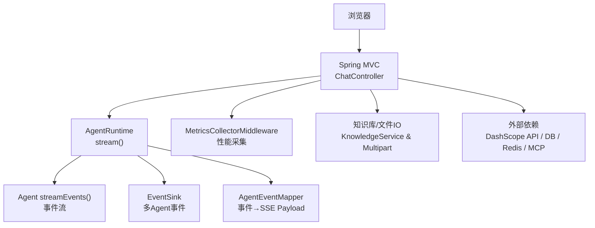
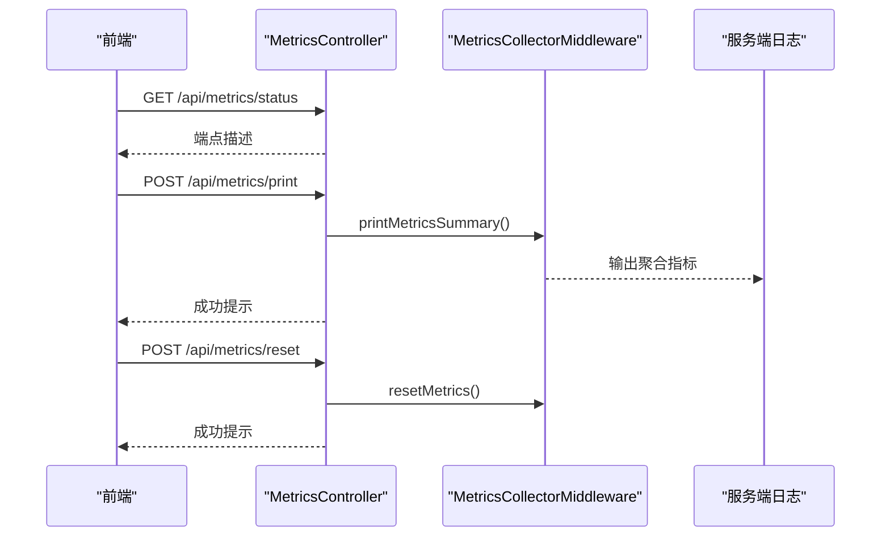

# 故障排除指南

<cite>
**本文引用的文件列表**
- [application.yml](file://src/main/resources/application.yml)
- [AgentScopeDemoApplication.java](file://src/main/java/com/skloda/agentscope/AgentScopeDemoApplication.java)
- [ChatController.java](file://src/main/java/com/skloda/agentscope/controller/ChatController.java)
- [MetricsController.java](file://src/main/java/com/skloda/agentscope/controller/MetricsController.java)
- [ObservabilityHook.java](file://src/main/java/com/skloda/agentscope/hook/ObservabilityHook.java)
- [AgentRuntime.java](file://src/main/java/com/skloda/agentscope/runtime/AgentRuntime.java)
- [AgentEventMapper.java](file://src/main/java/com/skloda/agentscope/runtime/AgentEventMapper.java)
- [MetricsCollectorMiddleware.java](file://src/main/java/com/skloda/agentscope/middleware/MetricsCollectorMiddleware.java)
- [KnowledgeService.java](file://src/main/java/com/skloda/agentscope/service/KnowledgeService.java)
- [JarEnvironmentDiagnostic.java](file://src/main/java/com/skloda/agentscope/config/JarEnvironmentDiagnostic.java)
- [application-mysql.yml](file://src/main/resources/application-mysql.yml)
- [application-redis.yml](file://src/main/resources/application-redis.yml)
- [agents.yml](file://src/main/resources/config/agents.yml)
- [pom.xml](file://pom.xml)
</cite>

## 目录
1. [引言](#引言)
2. [项目结构与关键入口](#项目结构与关键入口)
3. [常见问题诊断与处理](#常见问题诊断与处理)
   - [应用启动失败](#应用启动失败)
   - [网络连接问题](#网络连接问题)
   - [模型API调用错误](#模型api调用错误)
   - [文件上传失败](#文件上传失败)
4. [性能问题诊断与优化](#性能问题诊断与优化)
5. [集成问题排查](#集成问题排查)
6. [工具使用指南](#工具使用指南)
7. [日志分析与调试信息收集](#日志分析与调试信息收集)
8. [结论](#结论)

## 引言
本指南面向在本地或生产环境部署 AgentScope Demo 服务后遇到的实际问题，涵盖从启动、网络、模型调用、文件上传到性能调优和第三方集成的系统化排查方法。文中所有操作步骤均基于工程现有配置、控制器、运行时组件与诊断能力进行说明，帮助快速定位问题根因并提供可执行的修复方案。

## 项目结构与关键入口
应用为 Spring Boot Web 服务，暴露聊天、指标与健康查询等接口；通过 SSE（Server-Sent Events）向后端事件流式传输前端。核心路径：
- 启动类定义并打印运行端口，便于确认服务监听地址与端口。
- 聊天控制器实现消息发送的 SSE 响应、文件上传/下载、HITL 审批流程恢复。
- 运行时层将底层 Agent 事件映射为统一的事件 JSON，供前端渲染。
- 指标收集中间件对 Agent 调用时长、工具执行、模型 token 用量与成本进行聚合。
- 知识库服务负责本地 RAG 知识文件的后台扫描与索引。
- 多种数据源与环境诊断能力支持数据库、缓存与 JAR 资源访问诊断。

图表来源
- [AgentScopeDemoApplication.java:19-33](file://src/main/java/com/skloda/agentscope/AgentScopeDemoApplication.java#L19-L33)
- [ChatController.java:122-153](file://src/main/java/com/skloda/agentscope/controller/ChatController.java#L122-L153)
- [AgentRuntime.java:68-142](file://src/main/java/com/skloda/agentscope/runtime/AgentRuntime.java#L68-L142)
- [AgentEventMapper.java:60-104](file://src/main/java/com/skloda/agentscope/runtime/AgentEventMapper.java#L60-L104)
- [MetricsCollectorMiddleware.java:50-91](file://src/main/java/com/skloda/agentscope/middleware/MetricsCollectorMiddleware.java#L50-L91)

章节来源
- [AgentScopeDemoApplication.java:15-33](file://src/main/java/com/skloda/agentscope/AgentScopeDemoApplication.java#L15-L33)
- [ChatController.java:47-153](file://src/main/java/com/skloda/agentscope/controller/ChatController.java#L47-L153)
- [AgentRuntime.java:26-142](file://src/main/java/com/skloda/agentscope/runtime/AgentRuntime.java#L26-L142)
- [AgentEventMapper.java:39-104](file://src/main/java/com/skloda/agentscope/runtime/AgentEventMapper.java#L39-L104)
- [MetricsCollectorMiddleware.java:21-91](file://src/main/java/com/skloda/agentscope/middleware/MetricsCollectorMiddleware.java#L21-L91)

## 常见问题诊断与处理

### 应用启动失败
常见现象
- 端口占用导致无法启动
- 依赖的数据源未就绪（MySQL/Redis）而启用了对应 profile
- 环境变量缺失导致模型初始化异常
- 类路径资源不可用（打包后 skills/模板读取失败）

诊断步骤
1. 检查应用启动日志中的端口监听信息和进程状态
2. 检查是否启用了数据库/缓存 profile，若启用需确保对应服务已运行且连接参数正确
3. 核查必要的环境变量是否设置（如模型密钥）
4. 若在 JAR 中运行，使用内置的诊断 Profile 验证资源加载

定位依据
- 应用启动类会监听 Web 服务就绪事件并输出当前端口
- 默认配置关闭了 DataSource 自动装配，避免无库环境无法启动；特定 profile 下按需启用
- MySQL/Redis 配置文件提供连接 URL、用户名、密码及 session 类型切换
- 提供 JAR 环境诊断组件，可判断是否以 JAR 方式运行并探测 resource path、Filesystem、ClasspathSkillRepository

操作建议
- 修改监听端口或在系统层面释放占用端口后重启
- 仅激活所需 profile（如 mysql 或 redis），并通过环境变量传入正确的连接信息
- 将密钥作为环境变量注入，避免硬编码
- 以 JAR 运行时使用诊断 Profile 快速定位资源查找失败原因

章节来源
- [AgentScopeDemoApplication.java:19-33](file://src/main/java/com/skloda/agentscope/AgentScopeDemoApplication.java#L19-L33)
- [application.yml:13-23](file://src/main/resources/application.yml#L13-L23)
- [application-mysql.yml:1-18](file://src/main/resources/application-mysql.yml#L1-L18)
- [application-redis.yml:1-16](file://src/main/resources/application-redis.yml#L1-L16)
- [JarEnvironmentDiagnostic.java:19-79](file://src/main/java/com/skloda/agentscope/config/JarEnvironmentDiagnostic.java#L19-L79)

### 网络连接问题
常见现象
- 无法连接到外部 DashScope 模型服务
- 代理/防火墙/域名解析导致握手或请求失败
- SSE 流中断导致前端“永远转圈”或“只能聊一次”

诊断步骤
1. 检查日志中是否存在 HTTP/网络相关错误（含超时、DNS 解析失败）
2. 确认网络可达性（curl/wget/nslookup）和代理配置
3. 观察 SSE 是否在完成阶段正常下发结束事件
4. 通过指标端点触发指标摘要打印，辅助识别调用失败位置

解决思路
- 配置合理的超时与重试策略（由底层 SDK 提供）
- 如需代理，按平台规范设置代理
- 关注运行时对 EventSink 的生命周期管理与“悬挂流”的修复逻辑，确认完成事件能到达前端

章节来源
- [AgentRuntime.java:112-142](file://src/main/java/com/skloda/agentscope/runtime/AgentRuntime.java#L112-L142)
- [MetricsController.java:15-57](file://src/main/java/com/skloda/agentscope/controller/MetricsController.java#L15-L57)

### 模型API调用错误
常见现象
- 提示 API key 无效或限流
- 返回为空、乱码或结构化输出不符合预期
- 思考模式或 token 预算设置不当导致结果不稳定

诊断步骤
1. 校验环境变量是否正确注入
2. 核对模型名称与当前可用实例
3. 降低并发/减少输入长度或关闭思考模式进行测试
4. 通过 Metrics 输出查看 token 用量与成本估算

定位依据
- 模型 provider、API key 与 model-name 在默认配置中定义，支持环境变量覆盖
- agents.yml 中定义了不同 agent 的模型名与功能开关，可用于对比测试
- 指标中间件统计模型调用次数、token 总数与估算费用

操作建议
- 使用最小化 prompt 和默认单测 agent 先复现或验证模型连通性
- 若出现限流或额度耗尽，请检查账号配额和速率限制
- 对于复杂任务，逐步启用增强能力（思考模式、RAG、工具调用）

章节来源
- [application.yml:25-42](file://src/main/resources/application.yml#L25-L42)
- [agents.yml:1-12](file://src/main/resources/config/agents.yml#L1-L12)
- [MetricsCollectorMiddleware.java:46-91](file://src/main/java/com/skloda/agentscope/middleware/MetricsCollectorMiddleware.java#L46-L91)

### 文件上传失败
常见现象
- 上传提示文件过大或被拒绝
- 上传成功但后续文档解析失败
- 银行发票生成所需的 skill 文件在 JAR 中找不到

诊断步骤
1. 确认最大文件大小和单次请求大小的配置上限
2. 检查临时目录的写入权限与磁盘空间
3. 校验上传文件的扩展名是否为受支持的类型
4. 若涉及 RAG 或技能文件，使用知识库索引状态或 JAR 诊断来定位

定位依据
- 应用默认开启 multipart 限制
- 聊天控制器接收文件并通过会话/工具链路流转
- 知识库服务包含上传文件的检测、索引状态跟踪和异常处理
- JAR 环境诊断可验证类路径下 skills 子目录的可读性与内容枚举

修复建议
- 调整文件大小限制以满足业务需求
- 对非法文件或超大文件进行前置校验并返回明确错误
- 针对 JAR 部署，确认资源打包结构正确并使用诊断 Profile 确认路径解析策略

章节来源
- [application.yml:6-12](file://src/main/resources/application.yml#L6-L12)
- [ChatController.java:47-71](file://src/main/java/com/skloda/agentscope/controller/ChatController.java#L47-L71)
- [KnowledgeService.java:143-178](file://src/main/java/com/skloda/agentscope/service/KnowledgeService.java#L143-L178)
- [JarEnvironmentDiagnostic.java:53-79](file://src/main/java/com/skloda/agentscope/config/JarEnvironmentDiagnostic.java#L53-L79)

## 性能问题诊断与优化

### 响应时间过长
可能原因
- LLM 推理耗时、工具调用链过长、并发过高、上下文过大
- 后台 RAG 索引阻塞主线程或内存压力增大

定位方法
- 通过 /api/metrics 相关端点打印指标摘要，观察单次 Agent 调用总时长、工具调用次数、token 总量
- 结合日志中的 agent name 与工具名称，定位慢步骤
- 评估 agent 配置中的 context/window/rag 检索数量是否合理

优化建议
- 合理设置 autoContext 阈值与保留比例，控制上下文大小
- 批量/合并工具调用，减少往返次数
- 对长文档分块索引、限制 RAG 召回条目数
- 使用并发度控制和退避重试，防止雪崩

章节来源
- [MetricsCollectorMiddleware.java:50-91](file://src/main/java/com/skloda/agentscope/middleware/MetricsCollectorMiddleware.java#L50-L91)
- [agents.yml:13-21](file://src/main/resources/config/agents.yml#L13-L21)
- [KnowledgeService.java:91-125](file://src/main/java/com/skloda/agentscope/service/KnowledgeService.java#L91-L125)

### 内存使用异常
可能原因
- RAG 向量存储与文档对象膨胀
- 历史对话累积导致上下文持续增长
- 大文件解析/处理过程中未释放资源

定位方法
- 监控 JVM 堆使用率与 GC 行为
- 检查 KnowledgeService 的背景索引线程是否频繁提交任务
- 审查 SSE 流中一次性推送的数据体量

优化建议
- 限制 InMemoryStore 维度和分块大小
- 调整历史消息的最大条数与压缩策略
- 避免在单事件中承载过大 payload，采用分页/增量更新

章节来源
- [KnowledgeService.java:60-90](file://src/main/java/com/skloda/agentscope/service/KnowledgeService.java#L60-L90)
- [application.yml:44-49](file://src/main/resources/application.yml#L44-L49)

### CPU占用过高
可能原因
- 频繁的文件解析与嵌入计算
- 工具调用链中包含大量串行 I/O
- 事件映射与序列化开销集中

定位方法
- 利用 metrics 汇总工具级耗时，识别热点工具
- 对长时间运行的工具进行独立压测与剖析
- 分析 agent 工作流是否存在过多循环/重试

优化建议
- 并行化可并发的 I/O，加池化连接与限流
- 降级非必要的实时能力（如取消思考模式）
- 使用缓存（本地/分布式）减少重复计算

章节来源
- [MetricsCollectorMiddleware.java:108-142](file://src/main/java/com/skloda/agentscope/middleware/MetricsCollectorMiddleware.java#L108-L142)
- [AgentEventMapper.java:172-200](file://src/main/java/com/skloda/agentscope/runtime/AgentEventMapper.java#L172-L200)

## 集成问题排查

### 数据库连接失败
症状
- 启用 mysql profile 后无法启动或会话持久化失败

步骤
1. 使用 application-mysql.yml 提供的 URL/账号/密码占位符，确保外部 MySQL 可访问
2. 创建所需数据库 schema（如 agentscope_state）
3. 将 mysql profile 加入到启动参数
4. 观察日志中的驱动加载与建表/连接失败错误

章节来源
- [application-mysql.yml:1-18](file://src/main/resources/application-mysql.yml#L1-L18)

### 缓存服务不可用
症状
- 启用 redis profile 后无法获取/保存 AgentStateStore

步骤
1. 确认 Redis 服务在线并可被应用所在主机访问
2. 配置 REDIS_URL 或其他需要的参数
3. 将 redis profile 加入启动参数
4. 验证键前缀与命名空间是否冲突

章节来源
- [application-redis.yml:1-16](file://src/main/resources/application-redis.yml#L1-L16)

### 外部API超时
症状
- 向 DashScope 发起的请求超时无响应或频繁报错

步骤
1. 检查网络连通性与 DNS 解析
2. 核对 api-key 与 model-name
3. 观察日志与 metrics 中的调用次数与错误计数
4. 适当调整请求体大小或并发度

章节来源
- [application.yml:25-42](file://src/main/resources/application.yml#L25-L42)
- [MetricsCollectorMiddleware.java:144-162](file://src/main/java/com/skloda/agentscope/middleware/MetricsCollectorMiddleware.java#L144-L162)

## 工具使用指南

### 浏览器开发者工具
- 使用 Network 面板过滤 event-stream，逐条查看 SSE 事件类型（文本、工具调用、结束等）
- 使用 Console 观察前端是否有 JSON 解析错误或空数据
- 对于长会话，定期截屏保存关键事件片段，方便回归比对

### Spring Boot Actuator 替代：自定义指标与健康查询
本项目未直接启用标准 Actuator，可通过自定义控制器访问指标能力：
- GET /api/metrics/status：返回可用的指标端点描述
- POST /api/metrics/print：在服务端控制台打印聚合指标（工具耗时、token 用量、错误数）
- POST /api/metrics/reset：重置聚合指标以便隔离观测某次请求

图表来源
- [MetricsController.java:15-57](file://src/main/java/com/skloda/agentscope/controller/MetricsController.java#L15-L57)
- [MetricsCollectorMiddleware.java:184-206](file://src/main/java/com/skloda/agentscope/middleware/MetricsCollectorMiddleware.java#L184-L206)

### 日志聚合分析
- 关注 root 日志级别以及 io.agentscope 下的日志
- 对性能问题重点查看 “METRICS” 日志分类的汇总输出
- 使用关键字搜索：error、exception、timeout、denied、pending_approval

章节来源
- [application.yml:81-90](file://src/main/resources/application.yml#L81-L90)
- [MetricsCollectorMiddleware.java:33-35](file://src/main/java/com/skloda/agentscope/middleware/MetricsCollectorMiddleware.java#L33-L35)

## 日志分析与调试信息收集

### 日志分析技巧
- 首次启动时记录全部 INFO 及以上日志，用于基线对比
- 问题复现时将根日志提高至 DEBUG，但注意对 IO/吞吐的影响
- 对 SSE 客户端侧配合网络抓包，定位断流位置（如未收到 done 事件）

### 调试信息收集清单
- 应用版本与运行环境（Java/Spring Boot/OS）
- 配置文件差异（profiles、环境变量）
- 网络连通性测试结果（ping/curl/dig）
- 完整日志文件（包含启动、错误与指标摘要）
- 前端页面截图或录制（体现卡住的具体时间点）

定位参考
- 启动完成提示输出端口，便于确认服务可用性
- Runtime 层对事件流错误与取消做了保护，可据此判断是上游错误还是下游消费者（前端）问题
- 指标与事件映射器将关键阶段暴露为可观测事件，利于端到端定位

章节来源
- [AgentScopeDemoApplication.java:19-33](file://src/main/java/com/skloda/agentscope/AgentScopeDemoApplication.java#L19-L33)
- [AgentRuntime.java:128-142](file://src/main/java/com/skloda/agentscope/runtime/AgentRuntime.java#L128-L142)
- [AgentEventMapper.java:60-104](file://src/main/java/com/skloda/agentscope/runtime/AgentEventMapper.java#L60-L104)

## 结论
通过对启动、网络、模型调用、文件上传、性能与第三方集成的系统性排查，并结合本项目的指标端点、日志与运行时代码提供的内建诊断能力，可以高效定位绝大多数故障与瓶颈。建议在上线前做好 profile 管理、环境变量管控、依赖服务健康检查和基础压测；在日常运维中坚持指标沉淀与日志归档，形成稳定的问题定位闭环。