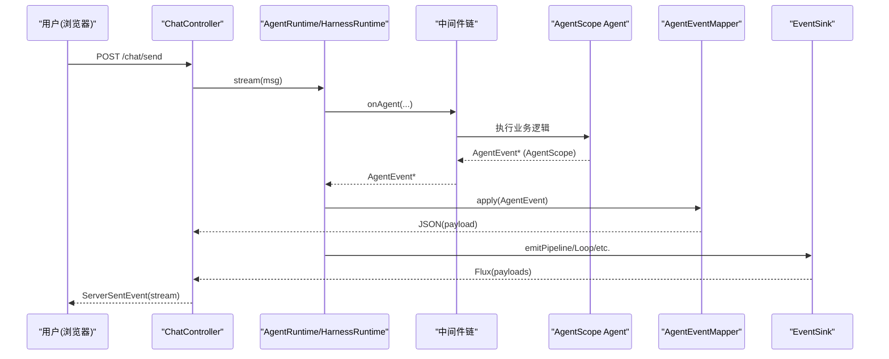

# 调试与诊断

<cite>
**本文引用的文件列表**
- [ObservabilityHook.java](file://src/main/java/com/skloda/agentscope/hook/ObservabilityHook.java)
- [EventSink.java](file://src/main/java/com/skloda/agentscope/runtime/EventSink.java)
- [AgentEventMapper.java](file://src/main/java/com/skloda/agentscope/runtime/AgentEventMapper.java)
- [MetricsCollectorMiddleware.java](file://src/main/java/com/skloda/agentscope/middleware/MetricsCollectorMiddleware.java)
- [AuditLoggingMiddleware.java](file://src/main/java/com/skloda/agentscope/middleware/AuditLoggingMiddleware.java)
- [MetricsController.java](file://src/main/java/com/skloda/agentscope/controller/MetricsController.java)
- [chat.js](file://src/main/resources/static/scripts/chat.js)
- [debug.js](file://src/main/resources/static/scripts/modules/debug.js)
- [debug.css](file://src/main/resources/static/styles/modules/debug.css)
- [state.js](file://src/main/resources/static/scripts/state.js)
- [application.yml](file://src/main/resources/application.yml)
- [application-test.yml](file://src/test/resources/application-test.yml)
- [ObservabilityHookLifecycleTest.java](file://src/test/java/com/skloda/agentscope/hook/ObservabilityHookLifecycleTest.java)
</cite>

## 目录
1. [简介](#简介)
2. [项目结构与调试入口](#项目结构与调试入口)
3. [核心组件总览](#核心组件总览)
4. [系统架构概览](#系统架构概览)
5. [前端调试面板详解](#前端调试面板详解)
6. [后端日志与事件流分析](#后端日志与事件流分析)
7. [依赖关系与数据流向](#依赖关系与数据流向)
8. [性能与监控实践](#性能与监控实践)
9. [常见问题排查指南](#常见问题排查指南)
10. [测试调试技巧](#测试调试技巧)
11. [堆栈跟踪、内存与并发诊断](#堆栈跟踪、内存与并发诊断)
12. [结论与建议](#结论与建议)

## 简介
本指南面向开发者和运维人员，聚焦 AgentScope 演示应用的调试与诊断能力。内容覆盖：
- 前端调试面板的事件追踪、性能指标和实时调试方法
- 后端的 SSE 事件映射、中间件审计与性能度量
- 常见问题定位（启动失败、连接问题、性能瓶颈）
- 单元测试、集成测试、端到端测试的调试手段
- 堆栈跟踪、内存泄漏检测和并发问题的分析方法
- 监控系统使用方法和告警配置建议

## 项目结构与调试入口
- 前端通过 SSE 订阅服务器返回的 Agent/工具/模型调用事件，渲染对话区与右侧“调试面板”（轮次卡片、时间线、指标）。
- 后端由 Spring 控制器暴露 `/chat/send` SSE 接口；中间层将 AgentEvent 映射为 UI 可消费的 JSON；观测与度量由中间件统一采集。
- 关键调试入口：
  - 浏览器控制台：查看 `[SSE]` 日志、JSON 事件载荷
  - 侧边调试面板：查看每一轮的 LLM、工具、Token、时延等指标
  - 服务端日志：观察 `[AUDIT-LOGGING]`、`[METRICS-COLLECTOR]`、`[EventSink]` 输出
  - 指标 API：`/api/metrics/status`、`/api/metrics/print`、`/api/metrics/reset`

**章节来源**
- [chat.js:106-178](file://src/main/resources/static/scripts/chat.js#L106-L178)
- [application.yml:3-12](file://src/main/resources/application.yml#L3-L12)

## 核心组件总览
- ObservabilityHook：兼容旧 Hook 到新的 EventSink 的事件桥，用于多 Agent 流水线/路由/交接/循环/圆桌/任务等事件的统一下发。
- EventSink：轻量事件总线，封装 Reactor Sinks 提供多线程安全的多播；定义多 Agent 相关事件常量与便捷发射方法。
- AgentEventMapper：将 AgentScope 2.0 的 AgentEvent 转换为 SSE JSON payload，涵盖文本、思考、模型调用、工具调用等全部常用事件类型。
- MetricsCollectorMiddleware：拦截 Agent/Reasoning/Acting/ModelCall，收集调用次数、时延、错误数、Token、成本估算等指标。
- AuditLoggingMiddleware：审计 Agent 各阶段执行开始/结束与工具参数。
- MetricsController：暴露指标状态查看与重置接口。

```mermaid
graph TB
  UI["浏览器前端<br/>chat.js / debug.js"]
  SSE["SSE 接口<br/>/chat/send"]
  MAP["AgentEventMapper"]
  MSW["中间件链<br/>MetricsCollector / AuditLogging"]
  AE["AgentScope Agent"]
  HOOK["ObservabilityHook"]
  SINK["EventSink"]

  UI -->|HTTP + SSE| SSE
  SSE --> MSW
  MSW --> AE
  AE -->|AgentEvent| MAP
  MAP -->|JSON payloads| SSE
  UI <-- SSE |
  HOOK -->|多 Agent 事件| SINK
  SINK -->|Flux| SSE
```

**图表来源**
- [ObservabilityHook.java:16-67](file://src/main/java/com/skloda/agentscope/hook/ObservabilityHook.java#L16-L67)
- [EventSink.java:15-152](file://src/main/java/com/skloda/agentscope/runtime/EventSink.java#L15-L152)
- [AgentEventMapper.java:56-105](file://src/main/java/com/skloda/agentscope/runtime/AgentEventMapper.java#L56-L105)
- [MetricsCollectorMiddleware.java:31-162](file://src/main/java/com/skloda/agentscope/middleware/MetricsCollectorMiddleware.java#L31-L162)
- [AuditLoggingMiddleware.java:15-68](file://src/main/java/com/skloda/agentscope/middleware/AuditLoggingMiddleware.java#L15-L68)

**章节来源**
- [ObservabilityHook.java:1-67](file://src/main/java/com/skloda/agentscope/hook/ObservabilityHook.java#L1-L67)
- [EventSink.java:1-152](file://src/main/java/com/skloda/agentscope/runtime/EventSink.java#L1-L152)
- [AgentEventMapper.java:56-105](file://src/main/java/com/skloda/agentscope/runtime/AgentEventMapper.java#L56-L105)
- [MetricsCollectorMiddleware.java:1-162](file://src/main/java/com/skloda/agentscope/middleware/MetricsCollectorMiddleware.java#L1-L162)
- [AuditLoggingMiddleware.java:1-68](file://src/main/java/com/skloda/agentscope/middleware/AuditLoggingMiddleware.java#L1-L68)

## 系统架构概览
- 前端使用 SSE 接收两类事件：
  1) 由 AgentEventMapper 生成的 Agent 行为事件（文本、思考、LLM/工具起止与用量）
  2) 由 EventSink 广播的多 Agent 业务事件（流水线、路由、交接、循环、状态图、圆桌、任务）
- 指标收集贯穿中间件层，不阻塞主流程；审计日志便于问题复现。
- 指标查询通过专用 Controller 提供 HTTP 接口。



**图表来源**
- [chat.js:106-220](file://src/main/resources/static/scripts/chat.js#L106-L220)
- [AgentEventMapper.java:64-105](file://src/main/java/com/skloda/agentscope/runtime/AgentEventMapper.java#L64-L105)
- [EventSink.java:19-33](file://src/main/java/com/skloda/agentscope/runtime/EventSink.java#L19-L33)
- [MetricsCollectorMiddleware.java:50-91](file://src/main/java/com/skloda/agentscope/middleware/MetricsCollectorMiddleware.java#L50-L91)

## 前端调试面板详解
- 功能模块：
  - 每轮对话卡片：显示摘要 Token、LLM 时长、工具调用次数、速度等指标
  - 可视化时间线：按阶段展示 agent_start、thinking/text/tool_* 等关键事件，标记运行中/成功/失败状态
  - 指标详情：折叠展开查看各子项详情（模型名、输入/输出 Token、调用次数）
  - 实时开关：可隐藏/展开调试面板以观察真实界面
- 事件触发点：
  - chat.js 解析 SSE 事件并调用 debug.js 中的 update/addTimelineRow 等方法
  - 首次内容事件（如 thinking/reasoning_text/text/tool_start/done/error/pending_approval）会清除“正在输入”动画
- 样式：
  - debug.css 定义面板收起/展开、滚动区域、卡片运行态脉冲动画、成功/失败边框色等
  - state.js 维护全局状态，包含当前轮次、消息计数、媒体信息等

实操要点：
- 打开浏览器开发者工具 → Console，过滤 `SSE` 关键字，定位具体事件
- 在右侧“调试面板”点击每轮卡片的 “Metrics” 展开详细信息
- 通过窗口全局对象访问 round/radius/timeline 结构，结合断点观察事件处理路径

**章节来源**
- [debug.js:1-200](file://src/main/resources/static/scripts/modules/debug.js#L1-L200)
- [chat.js:129-220](file://src/main/resources/static/scripts/chat.js#L129-L220)
- [debug.css:1-200](file://src/main/resources/static/styles/modules/debug.css#L1-L200)
- [state.js:1-165](file://src/main/resources/static/scripts/state.js#L1-L165)

## 后端日志与事件流分析
### AgentEvent → SSE 事件映射
- AgentEventMapper 将所有事件分派到对应处理器：
  - 文本/思考增量：生成 text/thinking 类型
  - 生命周期：agent_start/agent_end、request_stop
  - LLM：llm_start/llm_end（含输入/输出/总 Token）
  - 工具：tool_start/tool_call_delta/tool_result_*（含 toolName、toolCallId、content）
  - 结构化数据：data_block_delta、外部执行结果、拒绝/确认事件（保留占位以便后续迁移）
- 映射异常会被捕获并返回 error 类型，避免中断流。

### 多 Agent 事件（EventSink）
- ObservabilityHook 提供 pipeline/routing/handoff/loop/graph/roundtable/task 等方法，统一转为带 type 的 Map 并通过 EventSink 发射
- EventSink 内部基于 Reactor Sinks.Many.multicast 广播，支持 backpressure 缓冲

### 审计与指标
- AuditLoggingMiddleware：记录 Agent/Reasoning/Acting 阶段的起止耗时与工具入参预览
- MetricsCollectorMiddleware：
  - Agent 级：调用次数、总时延、最小/最大耗时、Token、估算成本
  - Tool 级：每个工具的调用次数、时延均值、错误率、最小/最大耗时
  - 全局：累计 Token、调用、错误数
  - 提供 printMetricsSummary() 输出汇总日志

```mermaid
flowchart TD
    Start(["接收到 AgentEvent"]) --> T{"event.getType()"}
    T -->|"TEXT_BLOCK_DELTA"| TextDelta["映射 text"]
    T -->|"THINKING_BLOCK_DELTA"| ThinkDelta["映射 thinking"]
    T -->|"AGENT_START/END"|"REQUEST_STOP"| Life["映射生命周期/停止"]
    T -->|"MODEL_CALL_START/END"| Model["映射 llm_start/end<br/>统计 token"]
    T -->|"TOOL_CALL_*"|"TOOL_RESULT_*"| Tool["映射 tool_start/call_delta/result_*"]
    T -->|"DATA_BLOCK_DELTA"| Data["映射 data_block_delta"]
    T -->|"EXCEED_MAX_ITERS"| Exceed["映射 exceeding"]
    T -->|"REQUIRE_USER_CONFIRM"|"USER_CONFIRM_RESULT"| HITL["预留 HITL 占位事件"]
    T -->|"HINT_BLOCK"|"SUBAGENT_EXPOSED"|"ALL_TOOLS_DENIED"|"CUSTOM"| Others["映射辅助/自定义事件"]
    T -->|"块边界"| Drop["丢弃(无需UI显示)"]
    TextDelta --> End(["输出 JSON Payload"])
    ThinkDelta --> End
    Life --> End
    Model --> End
    Tool --> End
    Data --> End
    Exceed --> End
    HITL --> End
    Others --> End
    Drop --> End
```

**图表来源**
- [AgentEventMapper.java:64-105](file://src/main/java/com/skloda/agentscope/runtime/AgentEventMapper.java#L64-L105)

**章节来源**
- [AgentEventMapper.java:56-105](file://src/main/java/com/skloda/agentscope/runtime/AgentEventMapper.java#L56-L105)
- [ObservabilityHook.java:16-67](file://src/main/java/com/skloda/agentscope/hook/ObservabilityHook.java#L16-L67)
- [EventSink.java:15-62](file://src/main/java/com/skloda/agentscope/runtime/EventSink.java#L15-L62)
- [MetricsCollectorMiddleware.java:187-206](file://src/main/java/com/skloda/agentscope/middleware/MetricsCollectorMiddleware.java#L187-L206)
- [AuditLoggingMiddleware.java:15-68](file://src/main/java/com/skloda/agentscope/middleware/AuditLoggingMiddleware.java#L15-L68)

## 依赖关系与数据流向
- 数据从 AgentScope 引擎产生事件 → 中间件收集指标/审计 → AgentEventMapper 标准化 → 控制器写出 SSE → 前端解析渲染与构建调试信息
- 多 Agent 业务事件经 ObservabilityHook → EventSink → SSE → 前端独立事件分支处理

```mermaid
classDiagram
    class ObservabilityHook {
        +getEventSink()
        +addConsumer(consumer)
        +emitPipeline*()
        +emitRouting*()
        +emitHandoff*()
        +emitLoop*()
        +emitGraph*()
        +emitRoundtable*()
        +emitTask*()
    }
    class EventSink {
        +asFlux()
        +emit(type, data)
        +complete()
        <<constants>>
    }
    class AgentEventMapper {
        +apply(event) Map~String,Object~
        -textDelta()
        -thinkingDelta()
        -modelCallStart()
        -modelCallEnd()
        -toolStart()
        -toolCallDelta()
    }
    class MetricsCollectorMiddleware {
        +onAgent(...)
        +onReasoning(...)
        +onActing(...)
        +onModelCall(...)
        +printMetricsSummary()
    }
    class AuditLoggingMiddleware {
        +onAgent(...)
        +onReasoning(...)
        +onActing(...)
    }
    ObservabilityHook --> EventSink : "委托事件发射"
    MetricsCollectorMiddleware --> "指标统计"
    AuditLoggingMiddleware --> "审计日志"
```

**图表来源**
- [ObservabilityHook.java:16-67](file://src/main/java/com/skloda/agentscope/hook/ObservabilityHook.java#L16-L67)
- [EventSink.java:15-152](file://src/main/java/com/skloda/agentscope/runtime/EventSink.java#L15-L152)
- [AgentEventMapper.java:56-105](file://src/main/java/com/skloda/agentscope/runtime/AgentEventMapper.java#L56-L105)
- [MetricsCollectorMiddleware.java:31-162](file://src/main/java/com/skloda/agentscope/middleware/MetricsCollectorMiddleware.java#L31-L162)
- [AuditLoggingMiddleware.java:15-68](file://src/main/java/com/skloda/agentscope/middleware/AuditLoggingMiddleware.java#L15-L68)

**章节来源**
- [MetricsController.java:1-57](file://src/main/java/com/skloda/agentscope/controller/MetricsController.java#L1-L57)

## 性能与监控实践
- 指标收集
  - 启动或运行期间，关注控制台输出的 `[METRICS-COLLECTOR]` 行，包含 Agent/Tool/Token/成本
  - 可通过 API 打印/重置指标：POST /api/metrics/print、POST /api/metrics/reset、GET /api/metrics/status
- 性能定位思路
  - 工具调用慢：检查工具日志与 AgentEventMapper 产生的 tool_* 事件顺序与时序，结合前端 timeline 判定热点
  - LLM 延迟高：结合 llm_start/llm_end 与 model usage，评估模型响应与首字延迟
  - 频繁重试/超限：关注 exceed_max_iters、错误事件与指标中的 error 计数
- 成本估算
  - 基于 token 用量与定价系数计算近似成本，便于对比不同 Agent/模型的性价比
- 审计线索
  - AuditLoggingMiddleware 的工具入参预览、阶段耗时可用于还原执行过程

**章节来源**
- [MetricsCollectorMiddleware.java:31-162](file://src/main/java/com/skloda/agentscope/middleware/MetricsCollectorMiddleware.java#L31-L162)
- [MetricsController.java:15-57](file://src/main/java/com/skloda/agentscope/controller/MetricsController.java#L15-L57)
- [AuditLoggingMiddleware.java:15-68](file://src/main/java/com/skloda/agentscope/middleware/AuditLoggingMiddleware.java#L15-L68)

## 常见问题排查指南
- 启动失败
  - 检查端口占用、API Key 配置；默认端口 8081
  - DataSource 已默认排除，如需持久化需启用对应 profile
  - 参考应用配置与日志级别设置
- 连接/卡住
  - 前端未收到首个内容事件会导致“输入中”一直存在；确保第一条聊天内容类事件能抵达
  - SSE 被代理层阻断时可抓包核对 server-sent-events 头与编码
- 无调试数据
  - 确认 AgentEventMapper 映射未抛出异常；EventSink 正常发射
  - 浏览器控制台可见 `[SSE] Received ...` 日志
- 指标不准确
  - 确认中间件已注册且链路生效；可通过 /api/metrics/reset 清零后重测
- 前端 UI 错乱
  - 检查 debug.js/dom 节点是否被第三方脚本干扰；必要时清空 localStorage/sessionStorage 重置状态

**章节来源**
- [application.yml:3-12](file://src/main/resources/application.yml#L3-L12)
- [application.yml:25-89](file://src/main/resources/application.yml#L25-L89)
- [chat.js:152-178](file://src/main/resources/static/scripts/chat.js#L152-L178)
- [MetricsController.java:22-57](file://src/main/java/com/skloda/agentscope/controller/MetricsController.java#L22-L57)

## 测试调试技巧
- 单元测试
  - ObservabilityHook 事件契约：校验 pipeline/routing/handoff/loop/graph/roundtable/task 事件序列
  - 可在 IDE 中直接运行对应 Test 类；观察断言与输出事件数组
- 端到端与集成
  - 结合 `/chat/send` 模拟 SSE 消费；验证事件种类、顺序、字段齐全性
  - 配合 `test` profile（禁用 MCP），减少非必要依赖，提高 CI 稳定性
- 调试建议
  - 在 key 路径添加 console.log，输出事件类型与关键数据
  - 通过 /api/metrics/reset 重置后再跑用例，便于对比差异

**章节来源**
- [ObservabilityHookLifecycleTest.java:1-116](file://src/test/java/com/skloda/agentscope/hook/ObservabilityHookLifecycleTest.java#L1-L116)
- [application-test.yml:1-8](file://src/test/resources/application-test.yml#L1-L8)

## 堆栈跟踪、内存与并发诊断
- 堆栈跟踪
  - 当事件映射或工具执行失败时，框架记录异常日志；可在控制台或日志文件中检索 trace
  - 对长耗时步骤打点（或使用指标中间件）辅助定位
- 内存泄漏检测
  - 观察 JVM heap（JVisualVM/JFR），重点检查大对象常驻：消息累积、附件缓存、Map/集合无界增长
  - 关闭不必要的中间件或降低 history size
- 并发问题
  - 指标中间件使用线程局部上下文与并发原语，注意排查跨线程共享可变状态的风险
  - EventSink 基于 Reactor Sinks 保证并发安全；若下游消费慢，关注背压提示与队列积压

[本节为通用指导，不包含特定源码片段]

## 结论与建议
- 推荐日常流程
  - 先通过前端调试面板确认事件流是否正常
  - 再用后端日志与指标快速定位瓶颈（工具或 LLM）
  - 使用审计日志复现复杂场景
- 建议配置
  - 生产环境降低日志级别，仅开启必要审计；定期拉取指标并设置告警阈值
  - 针对高频 Agent 建立基线，对比回归
- 持续改进
  - 扩展事件字段以满足更细粒度排障
  - 对接集中式日志/指标平台，完善看板与告警策略

[本节为总结性内容，不包含特定源码引用]