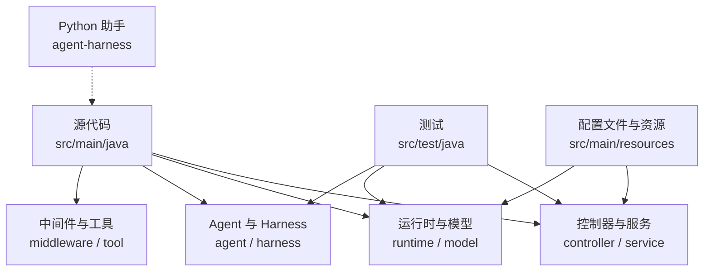
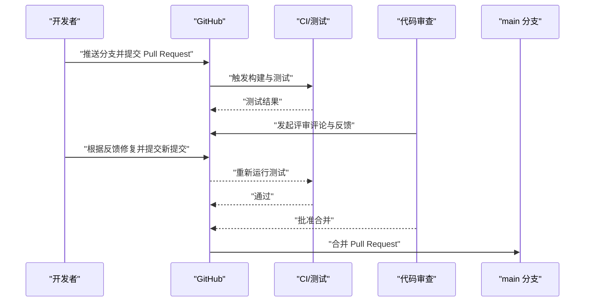
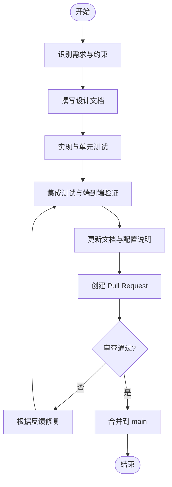

# 贡献指南

<cite>
**本文引用的文件**   
- [README.md](file://README.md)
- [AGENTS.md](file://AGENTS.md)
- [CLAUDE.md](file://CLAUDE.md)
- [ROADMAP.md](file://ROADMAP.md)
- [pom.xml](file://pom.xml)
- [.gitignore](file://.gitignore)
- [src/test/resources/application-test.yml](file://src/test/resources/application-test.yml)
- [src/test/java/com/skloda/agentscope/controller/ChatControllerSamplePromptTest.java](file://src/test/java/com/skloda/agentscope/controller/ChatControllerSamplePromptTest.java)
</cite>

## 目录
1. 引言
2. 项目结构概览
3. 核心开发流程规范
4. 提交与合并（Pull Request）流程
5. 代码风格、静态检查与格式化
6. 新功能开发指南
7. 问题报告规范（Bug 模板）
8. 社区行为准则与协作约定
9. 结语

## 引言
本贡献指南面向希望参与 AgentScope Demo 项目的开发者，目标是统一 Fork 分支、提交流程、代码审查标准、文档与测试要求，并明确代码风格工具链与协作约定，确保每次合并都能通过自动化与人工验证。

本项目基于 Spring Boot + Java 17，采用 Maven 构建与测试，提供多种 AI Agent 演示能力，包括单智能体、多智能体协作、RAG 知识库、文件上传、SSE 流式交互等。

**章节来源**
- [README.md:1-50](file://README.md#L1-L50)

## 项目结构概览
仓库采用标准的 Maven 多模块组织思想（以单模块为主），核心 Java 源码位于 src/main/java，测试位于 src/test，资源配置位于 src/main/resources；另有 Python 辅助 harness 工具 agent-harness/cli_anything。顶层包含 README、AGENTS、CLAUDE、ROADMAP 等文档，便于理解架构与演进路线。

**图表来源**
- [AGENTS.md:106-164](file://AGENTS.md#L106-L164)

**章节来源**
- [AGENTS.md:25-44](file://AGENTS.md#L25-L44)
- [AGENTS.md:106-164](file://AGENTS.md#L106-L164)
- [CLAUDE.md:25-47](file://CLAUDE.md#L25-L47)
- [pom.xml:190-200](file://pom.xml#L190-L200)

## 核心开发流程规范
为保证开发与交付一致性与可追溯性，请遵循以下流程：
- 克隆与分支策略
  - 从远端 fork 项目并在本地创建功能分支，分支命名建议为 feat/<描述>、fix/<描述>、docs/<描述>、chore/<描述>。
  - 保持 main 始终为可发布状态。
- 开发环境准备
  - 安装 Java 17+ 与 Maven 3.9+，配置环境变量 DASHSCOPE_API_KEY。
  - 使用 mvn spring-boot:run 启动应用，访问 http://localhost:8080 预览 UI。
- 编写实现与测试
  - 新增或修改功能需配套单元测试，必要时添加集成测试。
  - 对于 SSE/流式接口改动，确保前端兼容事件结构变化。
- 提交与推送
  - 每次提交应原子且含义清晰，commit message 建议以中文动词开头。
  - 在推送到远端前，先拉取最新 main 并解决冲突后再提交。
- 提交信息规范
  - 简短摘要 + 影响范围；若关联 issue/PR，请在消息中引用编号。
- 版本与依赖
  - 修改依赖需评估兼容性，记录在变更说明中；尽量复用现有版本，避免无谓升级。

**章节来源**
- [README.md:63-85](file://README.md#L63-L85)
- [AGENTS.md:9-23](file://AGENTS.md#L9-L23)
- [pom.xml:20-26](file://pom.xml#L20-L26)

## 提交与合并（Pull Request）流程
### 何时创建 PR
- 完成一个独立的功能或修复后
- 完成重构但保证用例全部通过
- 更新重要文档或配置后

### 内容要求
- 代码变更最小化、逻辑清晰、命名统一
- 必须附带测试：覆盖关键路径与边界条件
- 更新相关文档：README/设计文档/API 文档/配置说明
- 若涉及事件结构或协议变更，同步更新前端适配说明

### 审查清单
- 是否符合职责分离与分层原则
- 是否正确使用响应式流与事件模型
- 是否处理错误路径与异常恢复
- 是否带来性能/内存隐患（如未关闭资源）
- 对安全与权限的影响评估
- 跨模块依赖变更是否合理

### 合前必须满足的条件
- mvn test 全绿
- 与 main 合并无冲突
- 代码审查至少一次通过（主库维护者或指定 reviewer）
- 已更新必要文档与变更记录
- 如涉及配置，已在示例中更新或备注

（该图为通用流程图，不直接映射具体文件）

**章节来源**
- [ROADMAP.md:5-6](file://ROADMAP.md#L5-L6)
- [src/test/resources/application-test.yml:1-8](file://src/test/resources/application-test.yml#L1-L8)

## 代码风格、静态检查与格式化
本项目当前未配置强制的代码格式化工具与静态检查插件，建议在本地统一如下约定以提升一致性：
- 语言与环境
  - Java 17，Maven 作为构建工具
- 命名与结构
  - 包名小写，类名大驼峰，方法/变量小驼峰
  - 控制器/服务/工厂/运行时等按层次组织
- 代码可读性
  - 控制行长度与方法长度；拆分复杂逻辑为私有方法
  - 日志使用恰当级别，关键链路输出结构化信息
- 提交前自检
  - mvn test 通过
  - IDE 开启默认检查与提示，修复警告
  - 若团队未来引入 Spotless/Checkstyle/SpotBugs，请优先遵循规则

注意：如需引入新的工具链，请新增相应配置并通过 ci 验证，避免破坏既有构建。

**章节来源**
- [pom.xml:20-26](file://pom.xml#L20-L26)
- [pom.xml:190-200](file://pom.xml#L190-L200)

## 新功能开发指南
### 需求讨论
- 在 Issue 或团队沟通中明确目标与约束（性能、可靠性、安全性）
- 评估与现有 Agent/Harness/Middleware 的耦合关系，优先考虑可组合方案
- 如涉及外部系统（数据库、消息、MCP/A2A/AG-UI/Channel），确认接入方式与账号/配置项

### 设计文档
- 针对复杂逻辑，产出设计文档到 docs/superpowers/specs，描述：背景、架构要点、接口定义、数据流、异常处理、扩展点
- 对于多智能体协作模式（顺序/并行/路由/交接/循环/图状态/子任务），参考现有 runtime 思路进行扩展

### 实现计划
- 拆分为可独立验证的小任务，每个任务附带测试
- 优先保证核心路径正确性，再补齐监控、可观测与用户体验
- 对响应式 API 变更（如 SSE 事件类型/字段），同步检查前端消费逻辑

（该图为概念性流程图，不直接映射具体文件）

## 问题报告规范（Bug 模板）
请按以下模板提交 Issue，便于快速定位与复现：
- 问题标题：简明扼要，包含组件与现象
- 环境与版本：Java/Maven/依赖版本、操作系统、浏览器（如适用）
- 复现步骤：
  1. 操作步骤（精确到点击/接口调用）
  2. 输入数据/参数（脱敏处理敏感信息）
  3. 期望行为：详细描述应有的结果或响应
  4. 实际行为：描述出现的具体错误、日志片段、截图链接
- 可能原因与影响面：是否与特定 Agent/Runtime/Middleware 相关
- 最小复现场景：能否通过某组 API 或 Agent 配置稳定复现
- 附加材料：配置、日志、线程 Dump（如有）、相关文件改动差异

补充要求：
- 若涉及并发/异步/SSE 事件，提供完整请求上下文与时间线
- 若涉及文件上传/知识库索引，提供样本文件及期望解析结果

**章节来源**
- [README.md:169-197](file://README.md#L169-L197)
- [CLAUDE.md:136-150](file://CLAUDE.md#L136-L150)

## 社区行为准则与协作约定
为确保高效协作与健康社区氛围，请参考如下约定：
- 尊重与包容：使用专业、友好的语言进行沟通
- 聚焦问题：Issue/PR 讨论围绕技术事实与解决方案
- 透明公开：变更目的、影响范围与决策过程应在 Issue/PR/文档中体现
- 责任与跟进：负责人应持续跟踪，及时回复评审意见
- 质量优先：宁慢勿差，宁可延迟也不牺牲稳定性
- 文档驱动：公共接口、配置项、事件契约必须同步更新文档
- 版本管理：谨慎选择版本升级时机，重大变更需灰度与回滚方案
- 安全合规：生产级能力需考虑鉴权、限流、审计与可追踪性

以上约定适用于贡献代码、文档、设计、问题讨论与维护流程。

（本节为通用社区准则，不直接分析具体文件）

## 结语
感谢你的贡献！请按本指南的流程和规范参与开发，确保每次提交都可靠、可审、可回溯。如果你对项目协作有建议，欢迎通过 Issue 或讨论区提出，我们会积极采纳优化。