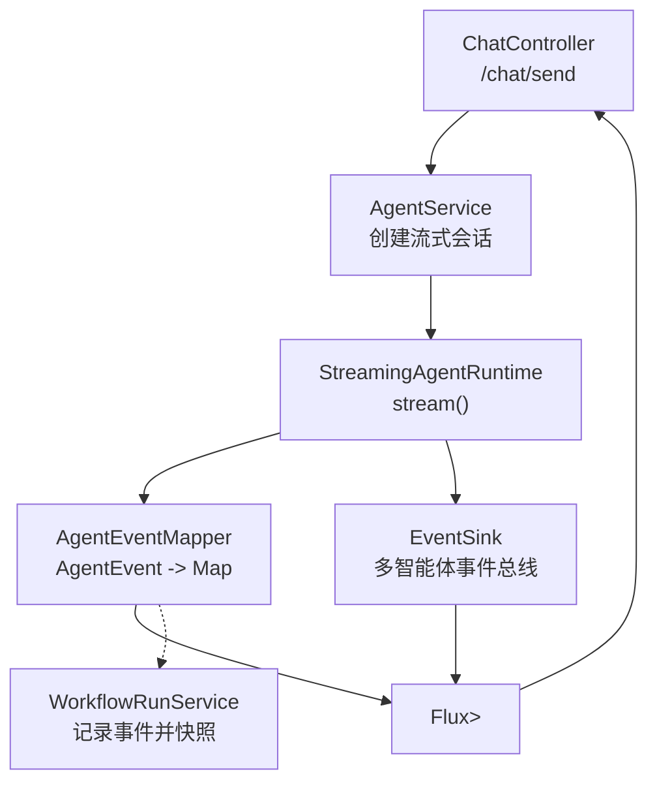
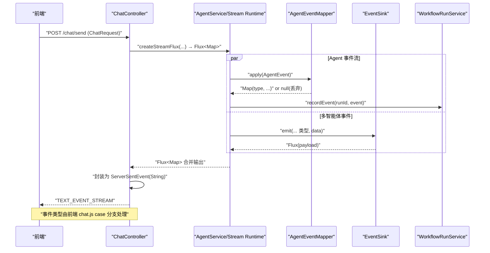
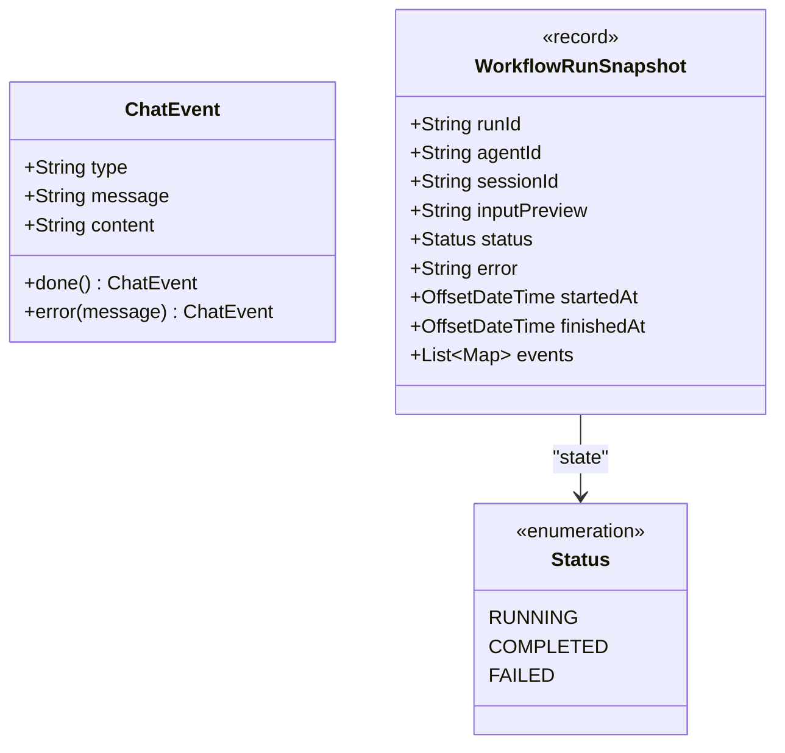
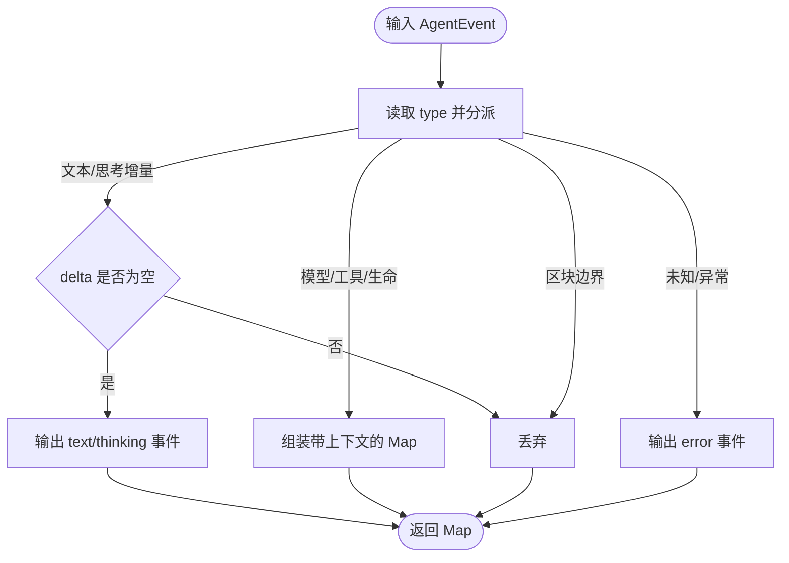
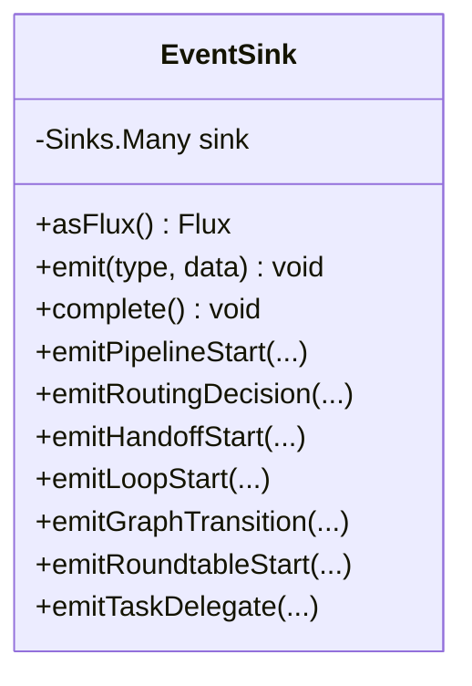
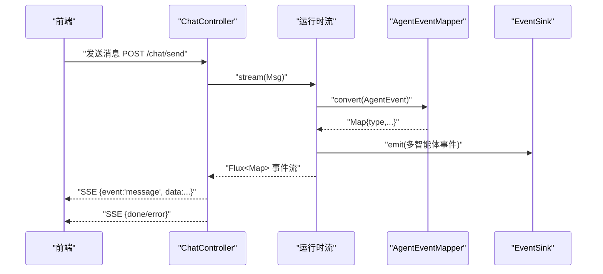
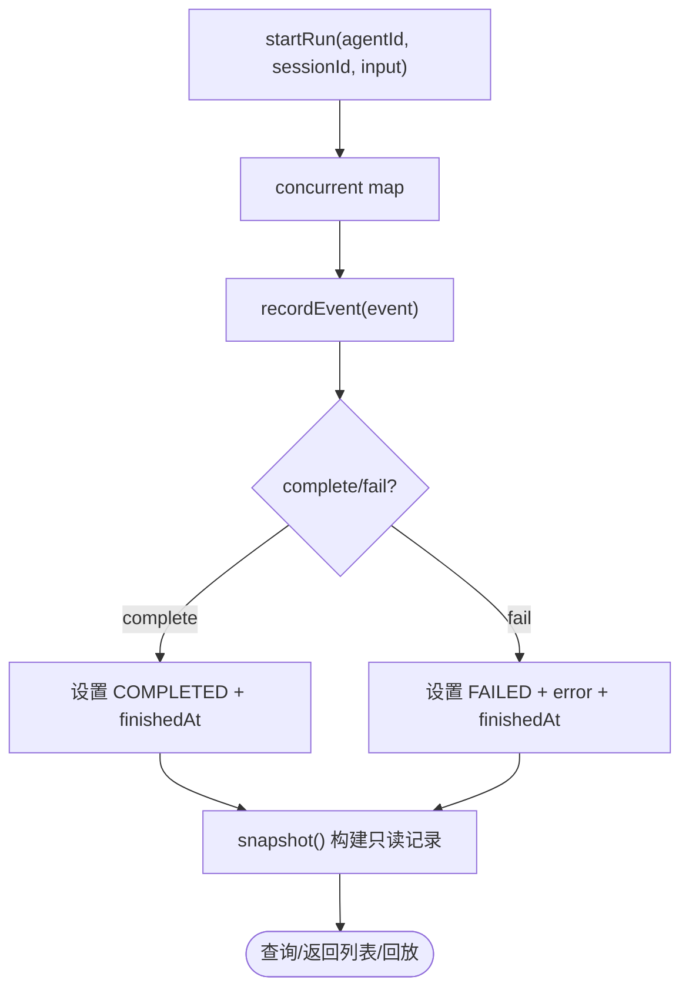
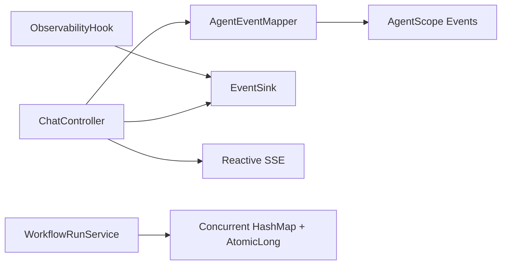

# 事件流模型

<cite>
**本文引用的文件列表**
- [ChatEvent.java](file://src/main/java/com/skloda/agentscope/model/ChatEvent.java)
- [WorkflowRunSnapshot.java](file://src/main/java/com/skloda/agentscope/model/WorkflowRunSnapshot.java)
- [AgentEventMapper.java](file://src/main/java/com/skloda/agentscope/runtime/AgentEventMapper.java)
- [EventSink.java](file://src/main/java/com/skloda/agentscope/runtime/EventSink.java)
- [ObservabilityHook.java](file://src/main/java/com/skloda/agentscope/hook/ObservabilityHook.java)
- [StreamingAgentRuntime.java](file://src/main/java/com/skloda/agentscope/runtime/StreamingAgentRuntime.java)
- [ChatController.java](file://src/main/java/com/skloda/agentscope/controller/ChatController.java)
- [WorkflowRunService.java](file://src/main/java/com/skloda/agentscope/service/WorkflowRunService.java)
- [chat.js](file://src/main/resources/static/scripts/chat.js)
</cite>

## 目录
1. 引言
2. 项目结构
3. 核心组件
4. 架构总览
5. 详细组件分析
6. 依赖关系分析
7. 性能考虑
8. 故障排查指南
9. 结论
10. 附录

## 引言
本文件面向事件驱动架构中的“事件流模型”，重点阐述：
- 聊天事件与工作流运行快照的数据模型设计与用途
- Agent 事件到 SSE 事件的数据流转机制、事件类型映射规则与优先级
- 实时通信协议（SSE）在控制器与前端之间的协作方式
- 自定义事件的扩展方法、序列化与传输优化
- 事件监控、调试工具与问题排查最佳实践

目标是帮助读者从整体到细节理解并安全地扩展该系统的事件能力。

## 项目结构
围绕事件流的相关模块包括：
- 模型层：统一 SSE 负载 ChatEvent，工作流运行快照 WorkflowRunSnapshot
- 运行时层：Agent 事件转换 AgentEventMapper，通用事件总线 EventSink，以及流式运行时接口 StreamingAgentRuntime
- 可观测性桥接：ObservabilityHook 将历史消费点迁移到 EventSink
- 控制层：ChatController 提供 SSE 端点并将事件流序列化为 ServerSentEvent
- 持久化与会话：WorkflowRunService 记录并回放运行快照
- 前端消费：static/scripts/chat.js 解析多种事件类型并渲染界面

图表来源
- [ChatController.java:117-153](file://src/main/java/com/skloda/agentscope/controller/ChatController.java#L117-L153)
- [StreamingAgentRuntime.java:12-19](file://src/main/java/com/skloda/agentscope/runtime/StreamingAgentRuntime.java#L12-L19)
- [AgentEventMapper.java:60-105](file://src/main/java/com/skloda/agentscope/runtime/AgentEventMapper.java#L60-L105)
- [EventSink.java:19-37](file://src/main/java/com/skloda/agentscope/runtime/EventSink.java#L19-L37)
- [WorkflowRunService.java:42-66](file://src/main/java/com/skloda/agentscope/service/WorkflowRunService.java#L42-L66)

章节来源
- [ChatController.java:117-153](file://src/main/java/com/skloda/agentscope/controller/ChatController.java#L117-L153)
- [StreamingAgentRuntime.java:12-19](file://src/main/java/com/skloda/agentscope/runtime/StreamingAgentRuntime.java#L12-L19)
- [AgentEventMapper.java:60-105](file://src/main/java/com/skloda/agentscope/runtime/AgentEventMapper.java#L60-L105)
- [EventSink.java:19-152](file://src/main/java/com/skloda/agentscope/runtime/EventSink.java#L19-L152)
- [WorkflowRunService.java:17-73](file://src/main/java/com/skloda/agentscope/service/WorkflowRunService.java#L17-L73)
- [chat.js:1-100](file://src/main/resources/static/scripts/chat.js#L1-L100)

## 核心组件
- ChatEvent：统一 SSE 结束与错误事件载体，采用非空忽略策略，简化前端处理
- WorkflowRunSnapshot：单次工作流运行的不可变快照，包含运行元数据、状态、时间戳与聚合事件数组
- AgentEventMapper：将 AgentScope 原生 AgentEvent 转换为前端消费的 Map（以 type 作为主键），覆盖 30+ 事件类型；对不需要 UI 的区块边界事件返回 null 表示丢弃
- EventSink：基于 Project Reactor Sinks.Many 的多播事件总线，提供多类型管道、路由、交接、循环、图、圆桌、任务等事件常量和便捷 emit 方法
- ObservabilityHook：保留旧有消费者兼容，内部委托给 EventSink
- StreamingAgentRuntime：统一流式契约，对外暴露 stream(Msg) 返回 Flux<Map>
- ChatController：将后端 Map/SSE 事件转为 Spring ServerSentEvent 并通过 /chat/send 推送，负责完成/错误信号
- WorkflowRunService：维护并发运行上下文，累积事件并生成只读快照供查询或回放

章节来源
- [ChatEvent.java:1-39](file://src/main/java/com/skloda/agentscope/model/ChatEvent.java#L1-L39)
- [WorkflowRunSnapshot.java:1-29](file://src/main/java/com/skloda/agentscope/model/WorkflowRunSnapshot.java#L1-L29)
- [AgentEventMapper.java:39-105](file://src/main/java/com/skloda/agentscope/runtime/AgentEventMapper.java#L39-L105)
- [EventSink.java:11-152](file://src/main/java/com/skloda/agentscope/runtime/EventSink.java#L11-L152)
- [ObservabilityHook.java:11-67](file://src/main/java/com/skloda/agentscope/hook/ObservabilityHook.java#L11-L67)
- [StreamingAgentRuntime.java:9-19](file://src/main/java/com/skloda/agentscope/runtime/StreamingAgentRuntime.java#L9-L19)
- [ChatController.java:44-153](file://src/main/java/com/skloda/agentscope/controller/ChatController.java#L44-L153)
- [WorkflowRunService.java:17-73](file://src/main/java/com/skloda/agentscope/service/WorkflowRunService.java#L17-L73)

## 架构总览
下图展示了一次用户请求到前端的完整事件流，包括 Agent 原生事件、多智能体事件、运行时映射和最终 SSE 响应。

图表来源
- [ChatController.java:117-153](file://src/main/java/com/skloda/agentscope/controller/ChatController.java#L117-L153)
- [AgentEventMapper.java:60-105](file://src/main/java/com/skloda/agentscope/runtime/AgentEventMapper.java#L60-L105)
- [EventSink.java:21-37](file://src/main/java/com/skloda/agentscope/runtime/EventSink.java#L21-L37)
- [WorkflowRunService.java:42-66](file://src/main/java/com/skloda/agentscope/service/WorkflowRunService.java#L42-L66)
- [chat.js:1-100](file://src/main/resources/static/scripts/chat.js#L1-L100)

## 详细组件分析

### 数据模型：ChatEvent 与 WorkflowRunSnapshot
- ChatEvent
  - 设计意图：统一表示“done”、“error”两类控制型事件
  - 字段：type、message、content（按需出现）
  - 用法：控制器在异常/完成路径下发，确保前端稳定收尾
- WorkflowRunSnapshot
  - 字段：runId、agentId、sessionId、inputPreview、status、error、startedAt、finishedAt、events
  - 状态枚举：RUNNING、COMPLETED、FAILED
  - 作用：一次性运行全量事件的只读快照，便于回顾与调试
  - 构建：通过 WorkflowRunService 内部可变对象 MutableWorkflowRun 累积 events 并在 complete/fail 时冻结为不可变快照

图表来源
- [ChatEvent.java:6-39](file://src/main/java/com/skloda/agentscope/model/ChatEvent.java#L6-L39)
- [WorkflowRunSnapshot.java:1-29](file://src/main/java/com/skloda/agentscope/model/WorkflowRunSnapshot.java#L1-L29)

章节来源
- [ChatEvent.java:6-39](file://src/main/java/com/skloda/agentscope/model/ChatEvent.java#L6-L39)
- [WorkflowRunSnapshot.java:10-29](file://src/main/java/com/skloda/agentscope/model/WorkflowRunSnapshot.java#L10-L29)
- [WorkflowRunService.java:98-152](file://src/main/java/com/skloda/agentscope/service/WorkflowRunService.java#L98-L152)

### Agent 事件到 SSE 事件映射（AgentEventMapper）
- 职责：将 AgentScope 2.0 的原生 AgentEvent 映射为前端可消费的 JSON 对象（Map）
- 映射原则
  - 每种 AgentEventType 均有对应的分支处理，返回标准 Map<{@code type}, payload>
  - 区块边界事件（如 TEXT_BLOCK_START/END 等）返回 null 表示丢弃
  - 异常时捕获错误并回退为 error 事件，保证流不中断
- 覆盖范围：包含文本块增量、思考块增量、Agent 生命周期、模型调用起止、工具调用全链路与结果增量、外部执行/确认、Hint、子 Agent 暴露、全部工具被拒绝、自定义事件等（合计超过 30 种）
- 关键语义
  - 文本/思考增量仅当 delta 非空才下发
  - 工具调用携带 toolName/toolCallId/name 便于时间线关联
  - LLM 结束事件附带 Token 用量统计（input/output/total）
  - HITL 占位（REQUIRE_USER_CONFIRM / USER_CONFIRM_RESULT）预留未来权限系统迁移通道，并可在前端渲染

图表来源
- [AgentEventMapper.java:60-105](file://src/main/java/com/skloda/agentscope/runtime/AgentEventMapper.java#L60-L105)
- [AgentEventMapper.java:107-216](file://src/main/java/com/skloda/agentscope/runtime/AgentEventMapper.java#L107-L216)

章节来源
- [AgentEventMapper.java:39-105](file://src/main/java/com/skloda/agentscope/runtime/AgentEventMapper.java#L39-L105)
- [AgentEventMapper.java:107-216](file://src/main/java/com/skloda/agentscope/runtime/AgentEventMapper.java#L107-L216)

### 多智能体事件总线（EventSink）
- 设计目标：为多智能体协作场景提供统一的事件广播源，替换过去的分散 emit() 逻辑
- 实现要点
  - 使用 Reactor Sinks.Many 进行背压缓冲的多播
  - 定义一系列领域常量：pipeline/routing/handoff/loop/graph/roundtable/task 等
  - 提供 typed emitXxx 便捷方法，自动附带 timestamp
- 适用场景：Pipeline 步骤开始/结束、路由决策、Handoff 交接、循环迭代、状态图转移、会议轮询、任务分发与汇总等

图表来源
- [EventSink.java:19-152](file://src/main/java/com/skloda/agentscope/runtime/EventSink.java#L19-L152)

章节来源
- [EventSink.java:11-152](file://src/main/java/com/skloda/agentscope/runtime/EventSink.java#L11-L152)
- [ObservabilityHook.java:11-67](file://src/main/java/com/skloda/agentscope/hook/ObservabilityHook.java#L11-L67)

### 控制器与 SSE 协议（ChatController）
- 职责：接收 ChatRequest，建立流式会话，将 Map/SSE 事件转成 ServerSentEvent 推送到前端
- 关键点
  - /chat/send 返回 Flux<ServerSentEvent<String>>
  - sseEvent/onErrorResume 统一封装完成/错误事件
  - takeUntil("done") 保障前端正常断开连接
  - /chat/approve 支持人机协同审批恢复流式执行
- 前端交互：chat.js 建立 SSE 解析，依据 type 分发到对应 UI/Debug 模块处理

图表来源
- [ChatController.java:77-153](file://src/main/java/com/skloda/agentscope/controller/ChatController.java#L77-L153)
- [chat.js:1-100](file://src/main/resources/static/scripts/chat.js#L1-L100)

章节来源
- [ChatController.java:44-199](file://src/main/java/com/skloda/agentscope/controller/ChatController.java#L44-L199)
- [chat.js:1-100](file://src/main/resources/static/scripts/chat.js#L1-L100)

### 工作流快照服务（WorkflowRunService）
- 职责：维护会话内的运行记录，累计事件并产出只读快照
- 特性
  - 线程安全的内存缓存，按序列排序与裁剪最大数量
  - 支持 recordEvent/complete/fail/getRun/listRuns
  - 将事件列表复制到不可变 List 中进入 Snapshot
- 典型流程：
  - startRun 生成 runId 并初始化运行
  - 中间步骤通过 recordEvent 累积
  - 结束时 complete/fail 写入时间与状态，可通过 getRun 取快照

图表来源
- [WorkflowRunService.java:17-73](file://src/main/java/com/skloda/agentscope/service/WorkflowRunService.java#L17-L73)
- [WorkflowRunService.java:98-152](file://src/main/java/com/skloda/agentscope/service/WorkflowRunService.java#L98-L152)

章节来源
- [WorkflowRunService.java:17-73](file://src/main/java/com/skloda/agentscope/service/WorkflowRunService.java#L17-L73)
- [WorkflowRunService.java:98-152](file://src/main/java/com/skloda/agentscope/service/WorkflowRunService.java#L98-L152)

## 依赖关系分析
- AgentEventMapper 依赖 AgentScope 的事件类型与消息类型，但不耦合具体 Agent 实现
- EventSink 依赖 Reactor，为上层运行时和中间件提供标准化事件源
- ObservabilityHook 作为适配器，向后兼容旧 Hook 使用者并转至 EventSink
- ChatController 依赖 ObjectMApper 与 Spring Web Reactive API 进行 SSE 编解码
- WorkflowRunService 无外部持久化耦合，适合作为轻量级本地观察窗口
- 前端 chat.js 依赖 type 契约，通过模块化脚本组织不同事件的 UI/调试逻辑

图表来源
- [AgentEventMapper.java:39-105](file://src/main/java/com/skloda/agentscope/runtime/AgentEventMapper.java#L39-L105)
- [EventSink.java:19-37](file://src/main/java/com/skloda/agentscope/runtime/EventSink.java#L19-L37)
- [ObservabilityHook.java:20-35](file://src/main/java/com/skloda/agentscope/hook/ObservabilityHook.java#L20-L35)
- [ChatController.java:77-153](file://src/main/java/com/skloda/agentscope/controller/ChatController.java#L77-L153)
- [WorkflowRunService.java:23-26](file://src/main/java/com/skloda/agentscope/service/WorkflowRunService.java#L23-L26)

章节来源
- [AgentEventMapper.java:39-105](file://src/main/java/com/skloda/agentscope/runtime/AgentEventMapper.java#L39-L105)
- [EventSink.java:11-62](file://src/main/java/com/skloda/agentscope/runtime/EventSink.java#L11-L62)
- [ObservabilityHook.java:20-35](file://src/main/java/com/skloda/agentscope/hook/ObservabilityHook.java#L20-L35)
- [ChatController.java:77-153](file://src/main/java/com/skloda/agentscope/controller/ChatController.java#L77-L153)
- [WorkflowRunService.java:23-26](file://src/main/java/com/skloda/agentscope/service/WorkflowRunService.java#L23-L26)

## 性能考虑
- 事件过滤与丢弃：Block 边界事件在 mapper 中直接丢弃，避免无效网络传输
- 增量推送：文本/思考/工具结果使用 delta 增量，降低吞吐压力
- 背压与并发：EventSink 使用 onBackpressureBuffer，合理保护下游订阅者
- 内存限制：WorkflowRunService 维护有限大小的内存表，超阈值后按序列裁剪
- 序列化：控制器侧统一 ObjectMapper 包装失败路径，避免阻塞流
- 建议
  - 对高频事件（文本增量）在前端做节流/批处理
  - 在大对象上谨慎使用 deep clone，优先浅拷贝
  - 对长会话开启适当的 backoff 与重连策略

[本节为通用性能指导，不直接分析具体文件]

## 故障排查指南
- 现象：SSE 流提前终止
  - 检查 isDoneEvent 判断逻辑与 onErrorResume 处理是否正确发出 done/error
  - 确认前端是否误拦截了事件流或关闭了连接
- 现象：部分事件未显示
  - 核对 AgentEventMapper 对应类型是否返回 null（可能被丢弃）
  - 检查 EventSink 相关 emitXxx 是否真正被调用
- 现象：大负载导致卡顿
  - 查看日志中的背压失败告警，评估是否需要增大缓冲或降级事件
- 现象：无法回放或快照不一致
  - 核查 workflow runId 是否一致，recordEvent/complete/fail 调用链路是否完整
- 现象：自定义事件不生效
  - 确认 type 命名唯一且未被覆盖
  - 检查事件是否在 mapper 或 runtime 中被正确处理转发
- 常用日志定位
  - 关注 AgentEventMapper 的映射错误日志
  - 关注 Controller 的序列化异常
  - 关注 EventSink 的 emit 失败警告

章节来源
- [AgentEventMapper.java:101-105](file://src/main/java/com/skloda/agentscope/runtime/AgentEventMapper.java#L101-L105)
- [EventSink.java:25-37](file://src/main/java/com/skloda/agentscope/runtime/EventSink.java#L25-L37)
- [ChatController.java:77-113](file://src/main/java/com/skloda/agentscope/controller/ChatController.java#L77-L113)
- [WorkflowRunService.java:42-66](file://src/main/java/com/skloda/agentscope/service/WorkflowRunService.java#L42-L66)

## 结论
该事件流模型以“类型驱动的 Map 负载 + Reactor 流式传输”为核心：
- AgentEventMapper 将丰富的底层事件标准化为少量前端可识别的类型
- EventSink 提供一致的多智能体协作事件广播
- ChatController 承担 SSE 协议编排与健壮性保障
- WorkflowRunService 提供轻量级的运行回溯能力
遵循该设计，可扩展新的事件类型、接入更多运行时模式，并保持前后端契约稳定。

[本节总结概念，无需来源]

## 附录

### 自定义事件开发指南
- 结构设计
  - 若为新语义的事件（不在现有 EventSink 常量内），建议在业务运行时中构造 Map 并通过 EventSink.emit(type, data) 注入
  - 推荐在 EventSink 中新增常量与 emitXxx 便捷方法，以保持命名一致性与类型安全
- 序列化格式
  - 所有事件都以 {"type": "...", ...} 的形式下发，请保持 type 唯一
  - 对大数据建议使用增量字段或分页/拉取链接模式
- 传输优化
  - 避免在高频事件中包含大对象
  - 对于复杂可视化，可先发精简标识，再由前端按需异步加载详情
- 前端适配
  - 在 chat.js 或 modules/debug.js 中增加对应 type 的处理分支
  - 提供默认分支处理未知类型，避免中断渲染

章节来源
- [EventSink.java:39-152](file://src/main/java/com/skloda/agentscope/runtime/EventSink.java#L39-L152)
- [chat.js:1-100](file://src/main/resources/static/scripts/chat.js#L1-L100)

### 实时监控与调试面板
- 指标维度：Token 用量、工具耗时、错误率、成本估算、Agent 汇总
- 数据来源：EventSink 的多智能体事件 + AgentEventMapper 的 LLM/工具事件
- 调试面板位置：前端右侧调试区域，可按 Pipeline/Routing/Handoff/Loop 等维度可视化
- 推荐操作
  - 启用框架日志级别 DEBUG 以便更细粒度的追踪
  - 通过 WorkflowRunService.listRuns 导出最近运行进行离线分析

章节来源
- [MetricsCollectorMiddleware.java:21-50](file://src/main/java/com/skloda/agentscope/middleware/MetricsCollectorMiddleware.java#L21-L50)
- [WorkflowRunService.java:68-73](file://src/main/java/com/skloda/agentscope/service/WorkflowRunService.java#L68-L73)