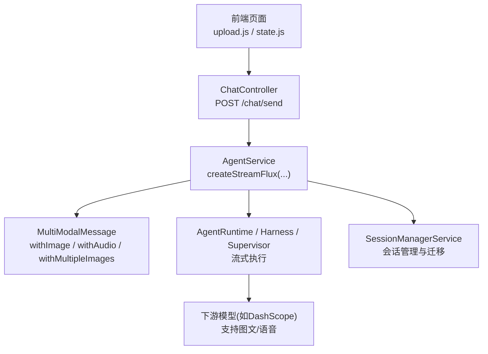
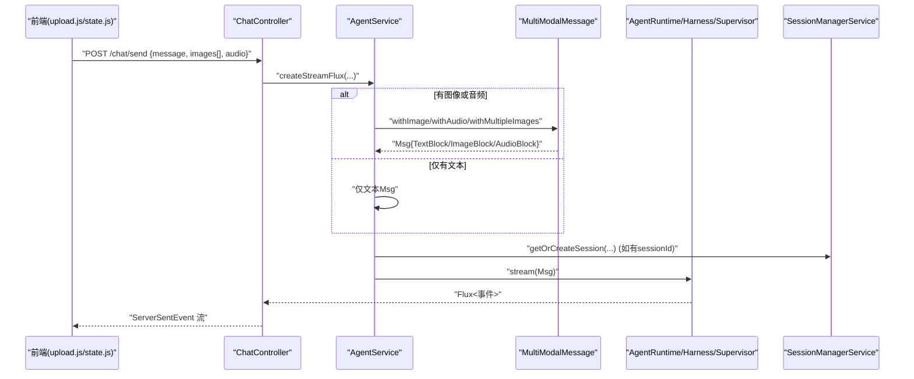
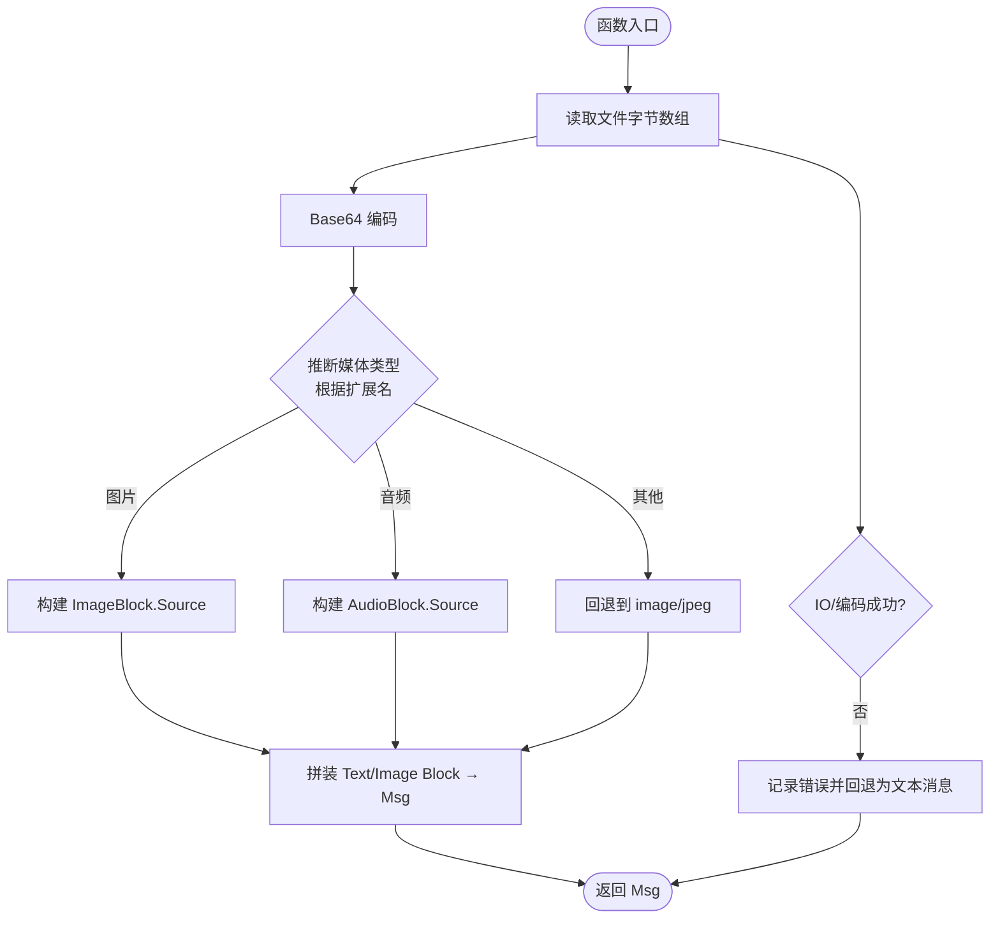
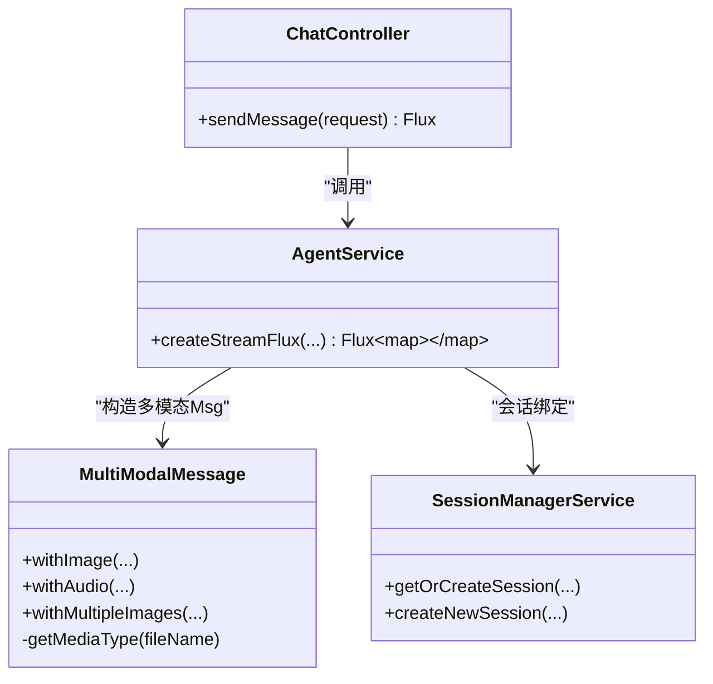
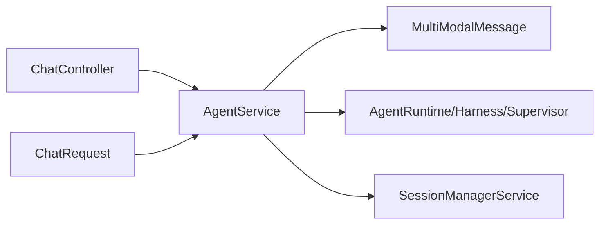

# 多模态数据模型

<cite>
**本文引用的文件**
- [MultiModalMessage.java](file://src/main/java/com/skloda/agentscope/model/MultiModalMessage.java)
- [MultiModalMessageTest.java](file://src/test/java/com/skloda/agentscope/model/MultiModalMessageTest.java)
- [ChatController.java](file://src/main/java/com/skloda/agentscope/controller/ChatController.java)
- [AgentService.java](file://src/main/java/com/skloda/agentscope/service/AgentService.java)
- [SessionManagerService.java](file://src/main/java/com/skloda/agentscope/service/SessionManagerService.java)
- [ChatRequest.java](file://src/main/java/com/skloda/agentscope/model/ChatRequest.java)
- [upload.js](file://src/main/resources/static/scripts/modules/upload.js)
- [state.js](file://src/main/resources/static/scripts/state.js)
- [application.yml](file://src/main/resources/application.yml)
</cite>

## 目录
1. [引言](#引言)
2. [项目结构](#项目结构)
3. [核心组件](#核心组件)
4. [架构总览](#架构总览)
5. [详细组件分析](#详细组件分析)
6. [依赖关系分析](#依赖关系分析)
7. [性能与存储策略](#性能与存储策略)
8. [故障排查与异常恢复](#故障排查与异常恢复)
9. [结论](#结论)

## 引言
本项目在多模态场景下对文本、图片与音频进行统一建模与传输，核心围绕 MultiModalMessage 构建以 Base64 编码、媒体类型识别（MIME）和路径文件读取为主线的数据处理流。请求入口 ChatController 接收前端上传的文件与会话上下文，AgentService 负责构造 Msg 对象并路由到具体运行时执行；SessionManagerService 提供会话级状态与持久化能力，配合前端 upload.js/state.js 完成图片/音频上传状态管理。该文档面向读者说明：
- 文本/图片/音频的统一消息表示及编解码机制
- 媒体类型识别、文件路径处理与内存管理策略
- 图片上传、音频处理、多图片消息构建的完整流程
- 数据存储、缓存与性能优化方案
- 错误处理、降级与异常恢复指南

## 项目结构
与多模态相关的代码分布在 model、controller、service 以及前端脚本中：
- model: 定义消息模型、请求体与多模态封装（MultiModalMessage、ChatRequest）
- controller: 暴露聊天端点、解析入参并返回 SSE 流（ChatController）
- service: 编排多模态消息构造、会话与 Agent 运行时（AgentService、SessionManagerService）
- 前端脚本: 负责文件上传、状态同步与向 /chat/send 发送多模态数据（upload.js、state.js）

图表来源
- [ChatController.java:122-153](file://src/main/java/com/skloda/agentscope/controller/ChatController.java#L122-L153)
- [AgentService.java:120-177](file://src/main/java/com/skloda/agentscope/service/AgentService.java#L120-L177)
- [MultiModalMessage.java:31-158](file://src/main/java/com/skloda/agentscope/model/MultiModalMessage.java#L31-L158)
- [SessionManagerService.java:75-145](file://src/main/java/com/skloda/agentscope/service/SessionManagerService.java#L75-L145)

章节来源
- [ChatController.java:122-153](file://src/main/java/com/skloda/agentscope/controller/ChatController.java#L122-L153)
- [AgentService.java:120-177](file://src/main/java/com/skloda/agentscope/service/AgentService.java#L120-L177)
- [MultiModalMessage.java:31-158](file://src/main/java/com/skloda/agentscope/model/MultiModalMessage.java#L31-L158)
- [SessionManagerService.java:75-145](file://src/main/java/com/skloda/agentscope/service/SessionManagerService.java#L75-L145)

## 核心组件
- MultiModalMessage: 将本地文件路径对应的二进制内容读入内存，转为 Base64，推断媒体类型，构造 TextBlock/ImageBlock/AudioBlock，最终组装为 AgentScope 的 Msg 对象。
- ChatRequest: 承载用户输入 message、单个主附件 filePath/filename，以及多模态 images[] 与 audio。包含 ImageFile 与 AudioFile 两个嵌套类。
- ChatController: 接收 POST /chat/send，校验入参（允许空文本当存在图片/音频），转发给 AgentService.createStreamFlux。
- AgentService: 组合多模态消息、路由到 Harness/Supervisor/普通 Agent 运行时的 stream 调用，同时记录工作流与历史。
- SessionManagerService: 维护会话上下文（含 AgentStateStore、创建/迁移），当前使用内存模式，可配置持久化路径（在初始化日志中有体现）。
- 前端 upload.js/state.js: 完成前端文件上传、状态保持（uploadedFile, uploadedImages, uploadedAudio），并在发送消息时携带上述字段。

章节来源
- [MultiModalMessage.java:31-171](file://src/main/java/com/skloda/agentscope/model/MultiModalMessage.java#L31-L171)
- [ChatRequest.java:6-143](file://src/main/java/com/skloda/agentscope/model/ChatRequest.java#L6-L143)
- [ChatController.java:122-153](file://src/main/java/com/skloda/agentscope/controller/ChatController.java#L122-L153)
- [AgentService.java:120-177](file://src/main/java/com/skloda/agentscope/service/AgentService.java#L120-L177)
- [SessionManagerService.java:23-145](file://src/main/java/com/skloda/agentscope/service/SessionManagerService.java#L23-L145)
- [upload.js](file://src/main/resources/static/scripts/modules/upload.js)
- [state.js:1-95](file://src/main/resources/static/scripts/state.js#L1-L95)

## 架构总览
多模态交互从前端到后端的端到端流程如下：

图表来源
- [ChatController.java:122-153](file://src/main/java/com/skloda/agentscope/controller/ChatController.java#L122-L153)
- [AgentService.java:120-177](file://src/main/java/com/skloda/agentscope/service/AgentService.java#L120-L177)
- [MultiModalMessage.java:31-132](file://src/main/java/com/skloda/agentscope/model/MultiModalMessage.java#L31-L132)
- [SessionManagerService.java:75-145](file://src/main/java/com/skloda/agentscope/service/SessionManagerService.java#L75-L145)

## 详细组件分析

### 多模态消息构建（MultiModalMessage）
- 文本+图片：读取本地图片字节 → Base64 编码 → 根据文件名推断 MIME → 附加至 ImageBlock.Source(Base64Source) → 与 TextBlock 组成 List<ContentBlock> 构造 Msg。
- 文本+音频：类似流程，生成 AudioBlock，附带推断的 MIME。
- 文本+多图片：循环读取多个图片文件，逐个转换为 ImageBlock。
- 媒体类型识别：按扩展名判断 image/png, image/jpeg, image/gif, image/webp, audio/wav/mp3/m4a/mp4；未知时默认 image/jpeg。
- 降级处理：任何 IO/编码异常会记录错误并回退为纯文本消息，提示相应失败原因。

图表来源
- [MultiModalMessage.java:31-158](file://src/main/java/com/skloda/agentscope/model/MultiModalMessage.java#L31-L158)

章节来源
- [MultiModalMessage.java:31-171](file://src/main/java/com/skloda/agentscope/model/MultiModalMessage.java#L31-L171)

### 请求体与接口契约（ChatRequest）
- 顶层字段：agentId、message、filePath、fileName、sessionId、userId、executionMode、permissionMode、sessionType
- 多模态字段：images: List<ImageFile>；audio: AudioFile（含 path、fileName）
- 约束：服务端在入口处允许空 message，当存在 images 或 audio 时仍视为有效输入。

章节来源
- [ChatRequest.java:6-143](file://src/main/java/com/skloda/agentscope/model/ChatRequest.java#L6-L143)
- [ChatController.java:122-153](file://src/main/java/com/skloda/agentscope/controller/ChatController.java#L122-L153)

### 控制器与服务编排（ChatController + AgentService）
- ChatController.sendMessage 校验入参并将多模态参数透传到 AgentService.createStreamFlux。
- AgentService.buildUserMessage（内部实现）基于传入的文本、主附件和多模态集合构建 Msg；随后按 Agent 类型路由到不同 runtime（普通/Harness/Supervisor）。
- SSE 输出：Controller 将流事件转换为 ServerSentEvent 推送到前端。

图表来源
- [ChatController.java:122-153](file://src/main/java/com/skloda/agentscope/controller/ChatController.java#L122-L153)
- [AgentService.java:120-177](file://src/main/java/com/skloda/agentscope/service/AgentService.java#L120-L177)
- [MultiModalMessage.java:31-158](file://src/main/java/com/skloda/agentscope/model/MultiModalMessage.java#L31-L158)
- [SessionManagerService.java:75-145](file://src/main/java/com/skloda/agentscope/service/SessionManagerService.java#L75-L145)

章节来源
- [ChatController.java:122-153](file://src/main/java/com/skloda/agentscope/controller/ChatController.java#L122-L153)
- [AgentService.java:120-177](file://src/main/java/com/skloda/agentscope/service/AgentService.java#L120-L177)

### 前端上传与发送流程
- 前端在 upload.js 中将文件上传至后端，获得 fileId/fileName/filePath 后存入 state.js 的 uploadedImages/uploadedAudio 等状态。
- 发送消息时，将 message、filePath（单主附件）以及 images[]、audio 一并提交到 /chat/send。

章节来源
- [upload.js](file://src/main/resources/static/scripts/modules/upload.js)
- [state.js:1-95](file://src/main/resources/static/scripts/state.js#L1-L95)
- [ChatController.java:122-153](file://src/main/java/com/skloda/agentscope/controller/ChatController.java#L122-L153)

### 测试与正确性验证（单元测试）
- 覆盖“图片+文本”、“单音频”、“多图片”的块数量与类型断言。
- 覆盖缺失文件时回退为带有失败提示的文本消息行为。

章节来源
- [MultiModalMessageTest.java:25-79](file://src/test/java/com/skloda/agentscope/model/MultiModalMessageTest.java#L25-L79)

## 依赖关系分析
- 对外部 AgentScope 类型依赖：io.agentscope.core.message 包下的 ContentBlock、TextBlock、ImageBlock、AudioBlock、Base64Source、Msg、MsgRole。
- Spring 相关：Controller 层的 @PostMapping、@ResponseBody，Reactive Flux、ServerSentEvent。
- 会话与会话类型：SessionManagerService 依据配置或请求参数决定 AgentStateStore 类型，并在必要时迁移会话。

图表来源
- [AgentService.java:120-177](file://src/main/java/com/skloda/agentscope/service/AgentService.java#L120-L177)
- [ChatController.java:122-153](file://src/main/java/com/skloda/agentscope/controller/ChatController.java#L122-L153)
- [SessionManagerService.java:75-145](file://src/main/java/com/skloda/agentscope/service/SessionManagerService.java#L75-L145)

章节来源
- [AgentService.java:120-177](file://src/main/java/com/skloda/agentscope/service/AgentService.java#L120-L177)
- [ChatController.java:122-153](file://src/main/java/com/skloda/agentscope/controller/ChatController.java#L122-L153)
- [SessionManagerService.java:75-145](file://src/main/java/com/skloda/agentscope/service/SessionManagerService.java#L75-L145)

## 性能与存储策略
- 内存占压
  - 图片/音频通过 Files.readAllBytes 全量载入内存，再由 Base64.getEncoder 编码产生新的 String 副本，意味着同一资源在 JVM 内存在原始字节串与 Base64 字符串两份开销；对于大体积资源需要注意 OOM 风险。
  - 建议：对超大资源考虑分块上传或流式处理；限制单次最大文件大小（例如由应用配置 spring.servlet.multipart.max-file-size）；或在业务层增加尺寸阈值判断拒绝过大资源。
- 媒体类型识别
  - 基于文件扩展名的静态匹配快速但不可信；若上游文件名可控性差，可在边界加入文件头魔术数检测以提升鲁棒性（属于可选增强）。
- 会话与状态存储
  - SessionManagerService 使用内存 ConcurrentHashMap 管理活跃会话，当前启动日志表明使用“in-memory”模式；可通过配置项 agentscope.session.storage-path 切换到更持久的底层（当前实现仅在日志中打印路径，实际持久化需结合外部配置/Provider）。
- SSE 流式响应
  - Controller 直接返回 Flux<ServerSentEvent<String>>，事件序列化失败时会捕获异常并以错误事件替代，保障流不中断。

章节来源
- [MultiModalMessage.java:31-158](file://src/main/java/com/skloda/agentscope/model/MultiModalMessage.java#L31-L158)
- [SessionManagerService.java:23-43](file://src/main/java/com/skloda/agentscope/service/SessionManagerService.java#L23-L43)
- [ChatController.java:77-113](file://src/main/java/com/skloda/agentscope/controller/ChatController.java#L77-L113)
- [application.yml](file://src/main/resources/application.yml)

## 故障排查与异常恢复
- 图片/音频加载失败
  - 表现：返回的消息文本包含失败提示（如“[图片加载失败: xxx]”）。
  - 排查：确认传入的 filePath 是否存在且可读；检查文件名后缀与 getMediaType 分支是否匹配；检查磁盘空间与权限。
  - 依据：MultiModalMessage.withImage/withAudio 在 try/catch 失败时回退为文本消息。
- SSE 序列化异常
  - 表现：SSE 推送中出现 “Serialization error” 的错误事件。
  - 排查：关注 ChatController.sseEvent/toJsonString 的异常路径，检查消息体是否可被 Jackson 序列化。
- 会话相关问题
  - 表现：跨请求会话丢失或不生效。
  - 排查：确认 sessionId 是否正确传递；查看 SessionManagerService 的 getOrCreateSession 与迁移逻辑；核对 agentscope.session.storage-path 是否有效。

章节来源
- [MultiModalMessage.java:54-93](file://src/main/java/com/skloda/agentscope/model/MultiModalMessage.java#L54-L93)
- [MultiModalMessage.java:125-131](file://src/main/java/com/skloda/agentscope/model/MultiModalMessage.java#L125-L131)
- [ChatController.java:77-113](file://src/main/java/com/skloda/agentscope/controller/ChatController.java#L77-L113)
- [SessionManagerService.java:75-145](file://src/main/java/com/skloda/agentscope/service/SessionManagerService.java#L75-L145)
- [MultiModalMessageTest.java:42-47](file://src/test/java/com/skloda/agentscope/model/MultiModalMessageTest.java#L42-L47)

## 结论
本仓库在多模态方面的设计以轻量、清晰为优先：通过 MultiModalMessage 集中封装图片/音频的 Base64 化与 MIME 推断，ChatController/AgentService 完成入参与路由，SessionManagerService 负责会话生命周期。测试覆盖了正常路径与关键降级路径。针对性能与稳定性，建议：
- 引入资源大小校验与上限控制，避免大文件导致内存压力
- 在安全敏感场景增强媒体类型校验（如文件头检测）
- 按需启用持久化会话存储，保证长任务或高可用场景下的状态一致性
- 继续完善前端上传与批量图片体验（限制并发、合并上传）