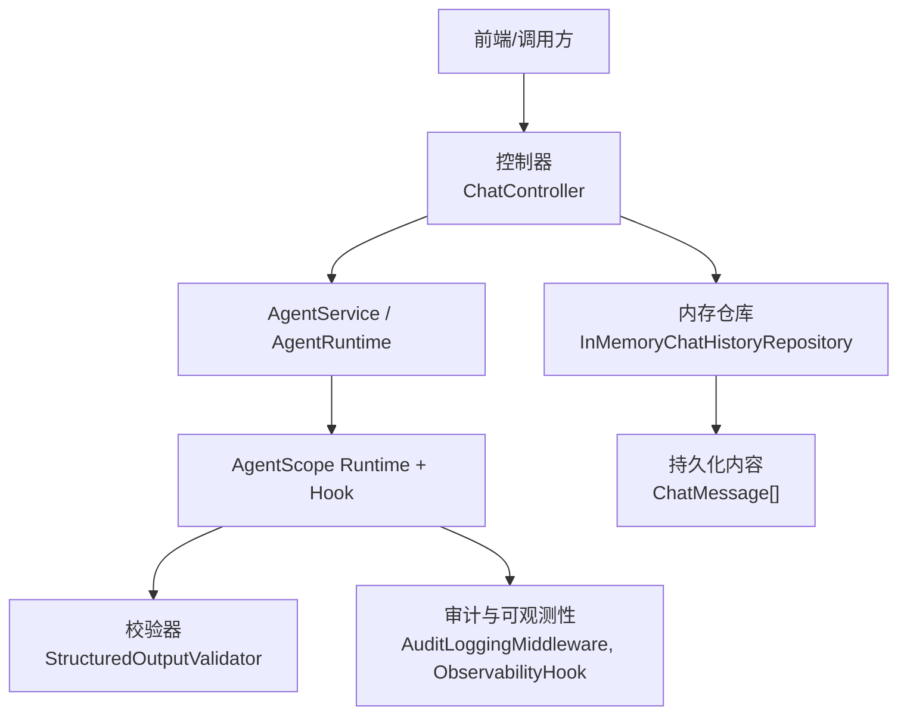
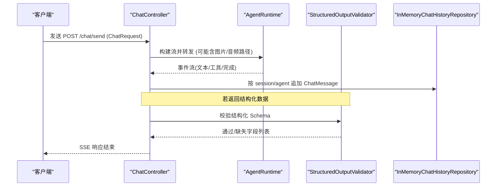
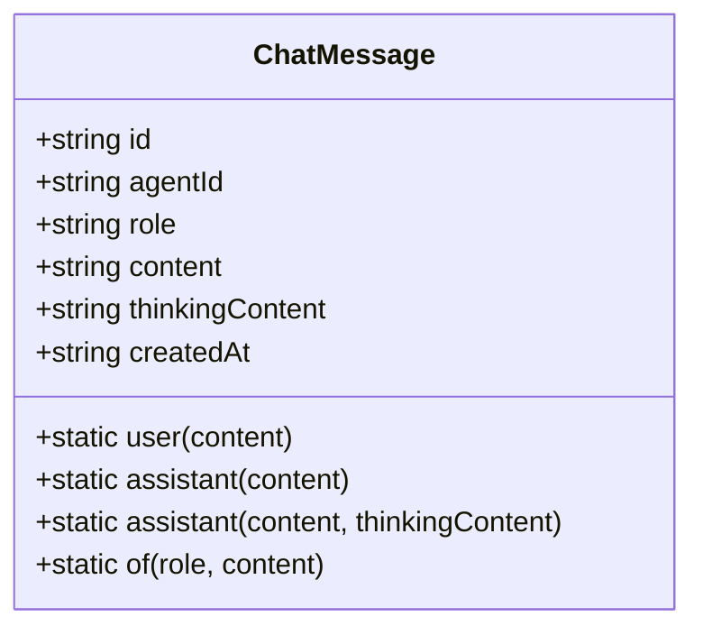
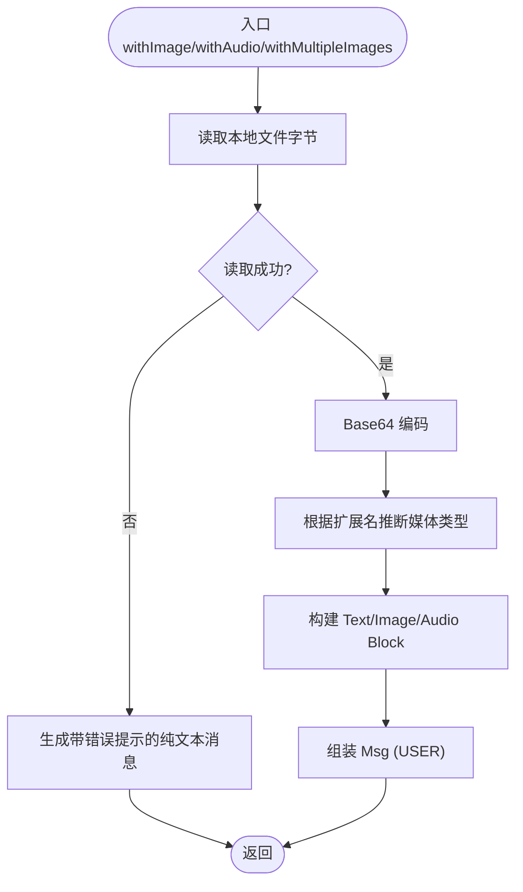
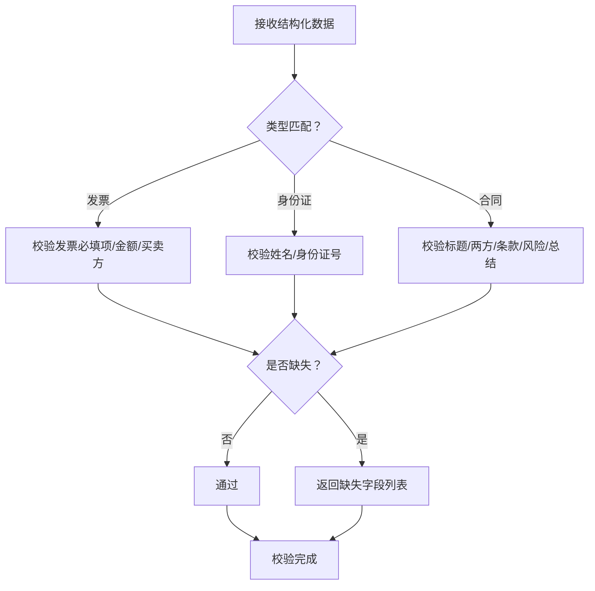
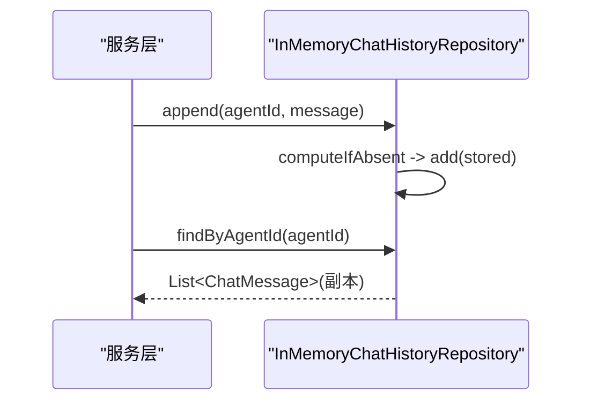
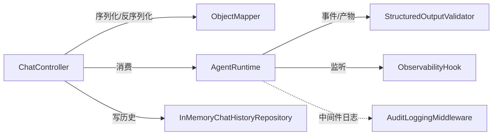

# 数据模型

<cite>
**本文引用的文件**
- [SessionInfo.java](file://src/main/java/com/skloda/agentscope/model/SessionInfo.java)
- [ChatMessage.java](file://src/main/java/com/skloda/agentscope/model/ChatMessage.java)
- [MultiModalMessage.java](file://src/main/java/com/skloda/agentscope/model/MultiModalMessage.java)
- [ChatRequest.java](file://src/main/java/com/skloda/agentscope/model/ChatRequest.java)
- [InvoiceData.java](file://src/main/java/com/skloda/agentscope/schema/InvoiceData.java)
- [IDCardData.java](file://src/main/java/com/skloda/agentscope/schema/IDCardData.java)
- [ContractMetadata.java](file://src/main/java/com/skloda/agentscope/schema/ContractMetadata.java)
- [InMemoryChatHistoryRepository.java](file://src/main/java/com/skloda/agentscope/service/InMemoryChatHistoryRepository.java)
- [StructuredOutputValidator.java](file://src/main/java/com/skloda/agentscope/runtime/StructuredOutputValidator.java)
- [ObservabilityHook.java](file://src/main/java/com/skloda/agentscope/hook/ObservabilityHook.java)
- [AuditLoggingMiddleware.java](file://src/main/java/com/skloda/agentscope/middleware/AuditLoggingMiddleware.java)
- [application.yml](file://src/main/resources/application.yml)
- [ChatController.java](file://src/main/java/com/skloda/agentscope/controller/ChatController.java)
</cite>

## 目录
1. [简介](#简介)
2. [项目结构与数据层定位](#项目结构与数据层定位)
3. [核心数据实体](#核心数据实体)
4. [架构总览](#架构总览)
5. [详细组件分析](#详细组件分析)
6. [依赖关系分析](#依赖关系分析)
7. [性能考虑](#性能考虑)
8. [故障诊断与排错](#故障诊断与排错)
9. [结论](#结论)
10. [附录：迁移与兼容性、安全与隐私、版本管理](#附录：迁移与兼容性、安全与隐私、版本管理)

## 简介
本文聚焦于本项目的数据模型设计与实现，覆盖会话信息（SessionInfo）、聊天消息（ChatMessage）、多模态消息（MultiModalMessage）的结构与约束，结构化输出 Schema（发票、身份证、合同元数据）的定义与验证、序列化机制，并结合内存持久化与会话上下文给出可落地的迁移方案、兼容策略与性能优化建议。同时提供安全性、隐私保护与访问控制实现要点，便于后续扩展为数据库持久化与强一致性版本治理。

## 项目结构与数据层定位
- 数据模型位于 model 包：面向接口与UI的轻量数据结构体与消息体。
- 业务数据对象与Schema在 schema 包中定义，并由 runtime 层进行结构化输出校验。
- 会话历史存储通过 service 包的 InMemoryChatHistoryRepository 以内存集合暂存 ChatMessage 序列。
- 控制器 controller.ChatController 接收 HTTP 请求（含多模态文件信息）并触发流式事件推送。
- 配置 application.yml 暴露了 AgentScope 会话、记忆、分片等选项；当前默认未启用外部数据库自动装配。

图表来源
- [ChatController.java:122-153](file://src/main/java/com/skloda/agentscope/controller/ChatController.java#L122-L153)
- [InMemoryChatHistoryRepository.java:11-46](file://src/main/java/com/skloda/agentscope/service/InMemoryChatHistoryRepository.java#L11-L46)
- [StructuredOutputValidator.java:16-98](file://src/main/java/com/skloda/agentscope/runtime/StructuredOutputValidator.java#L16-L98)
- [ObservabilityHook.java:16-67](file://src/main/java/com/skloda/agentscope/hook/ObservabilityHook.java#L16-L67)

小节来源
- [application.yml:1-90](file://src/main/resources/application.yml#L1-L90)

## 核心数据实体
本节概述三大核心实体的职责、字段含义与约束。

- SessionInfo（会话信息列表项）
  - 作用：用于会话清单展示与快速预览。
  - 关键字段：会话ID、Agent ID、Agent 名称、消息数、创建时间、最后访问时间、预览文本。
  - 约束：字符串型ID与时间戳、整型计数；为空时可能需在前端降级处理。

- ChatMessage（聊天记录条目）
  - 作用：对话记录的基础单元，包含发送者角色与内容片段，支持“思维链”内容。
  - 关键字段：消息ID（随机UUID）、Agent ID、角色（user/assistant）、内容、思考过程、时间戳。
  - 约束：每条独立自增ID；role/content 非空通常由上层保证；createdAt 使用 Instant 字符串形式。

- MultiModalMessage（多模态消息构建器）
  - 作用：基于本地文件路径将图片/音频转 Base64 并以 AgentScope Msg 结构组合成多模态内容。
  - 行为：根据扩展名推断媒体类型；失败时回退为文本提示。
  - 约束：需要运行时能读取目标文件路径；大文件会显著增加网络与存储负载。

小节来源
- [SessionInfo.java:9-21](file://src/main/java/com/skloda/agentscope/model/SessionInfo.java#L9-L21)
- [ChatMessage.java:9-100](file://src/main/java/com/skloda/agentscope/model/ChatMessage.java#L9-L100)
- [MultiModalMessage.java:23-171](file://src/main/java/com/skloda/agentscope/model/MultiModalMessage.java#L23-L171)

## 架构总览
从数据角度梳理关键流程：用户发起聊天 → 控制器校验输入 → 构建 Agent Scope 消息（可含多模态块）→ 执行并获取事件流 → 持久化 ChatMessage（可选）→ 对结构化输出进行校验。

图表来源
- [ChatController.java:122-153](file://src/main/java/com/skloda/agentscope/controller/ChatController.java#L122-L153)
- [InMemoryChatHistoryRepository.java:28-37](file://src/main/java/com/skloda/agentscope/service/InMemoryChatHistoryRepository.java#L28-L37)
- [StructuredOutputValidator.java:16-98](file://src/main/java/com/skloda/agentscope/runtime/StructuredOutputValidator.java#L16-L98)

## 详细组件分析

### 会话信息 SessionInfo
- 语义：只读DTO，用于会话列表页渲染和摘要展示。
- 典型用法：结合 AgentService 或 SessionManagerService 聚合会话指标，形成列表视图。
- 注意事项：
  - preview 字段应限制长度以避免影响列表渲染性能。
  - lastAccessedAt 应由上层逻辑在服务层维护更新。

小节来源
- [SessionInfo.java:11-21](file://src/main/java/com/skloda/agentscope/model/SessionInfo.java#L11-L21)

### 聊天消息 ChatMessage
- 语义：不可变风格的重建复制构造器保障并发安全；静态工厂方法便捷生成 user/assistant 消息。
- 业务规则：
  - id：每条消息唯一标识，用于去重或引用。
  - role：限定角色，服务端可在写入前校验。
  - content/thinkingContent：content 为对外展示文本，thinkingContent 可为调试/审计留痕。
  - createdAt：标准化时间格式，建议统一为 UTC ISO 8601。

图表来源
- [ChatMessage.java:9-51](file://src/main/java/com/skloda/agentscope/model/ChatMessage.java#L9-L51)

小节来源
- [ChatMessage.java:30-100](file://src/main/java/com/skloda/agentscope/model/ChatMessage.java#L30-L100)

### 多模态消息 MultiModalMessage
- 语义：封装图像/音频的 Base64 化与媒体类型识别，组装为 AgentScope 的多模态 Msg。
- 关键能力：
  - withImage：文本+单图组合。
  - withAudio：文本或纯音频组合。
  - withMultipleImages：文本+多图组合。
  - getMediaType：根据扩展名映射MIME类型。
- 健壮性：文件读取异常时回退为带错误信息的纯文本消息，避免中断整体链路。
- 性能注意：Base64 编码会增加载荷体积；建议对上传文件做大小限制与压缩策略。

图表来源
- [MultiModalMessage.java:31-131](file://src/main/java/com/skloda/agentscope/model/MultiModalMessage.java#L31-L131)
- [MultiModalMessage.java:137-158](file://src/main/java/com/skloda/agentscope/model/MultiModalMessage.java#L137-L158)

小节来源
- [MultiModalMessage.java:23-171](file://src/main/java/com/skloda/agentscope/model/MultiModalMessage.java#L23-L171)

### 结构化输出 Schema 与验证
- 支持的 Schema：
  - InvoiceData：发票信息抽取（含明细行）。
  - IDCardData：身份证件信息抽取。
  - ContractMetadata：合同元数据抽取（含条款与风险）。
- 校验规则（StructuredOutputValidator）：
  - 必填文本字段空则判缺。
  - 数值字段为空则判缺。
  - 集合字段必须非空且至少一项。
  - 返回 ValidationResult 描述通过或缺失字段。
- 适用场景：当模型输出 JSON/结构化结果进入系统后，先经该验证器把关再下游消费。

图表来源
- [StructuredOutputValidator.java:16-98](file://src/main/java/com/skloda/agentscope/runtime/StructuredOutputValidator.java#L16-L98)

小节来源
- [InvoiceData.java:8-37](file://src/main/java/com/skloda/agentscope/schema/InvoiceData.java#L8-L37)
- [IDCardData.java:6-19](file://src/main/java/com/skloda/agentscope/schema/IDCardData.java#L6-L19)
- [ContractMetadata.java:8-43](file://src/main/java/com/skloda/agentscope/schema/ContractMetadata.java#L8-L43)
- [StructuredOutputValidator.java:16-98](file://src/main/java/com/skloda/agentscope/runtime/StructuredOutputValidator.java#L16-L98)

### 会话历史持久化（内存实现）
- 设计：以 ConcurrentMap<AgentId, CopyOnWriteArrayList<ChatMessage>> 保存每个 Agent 的消息序列，查询时深拷贝并赋值 agentId。
- 特性：线程安全追加与遍历；clear 支持按 Agent 清理；为空参数时的防御性返回。
- 迁移点：当前为内存实现，未来可替换为 DB 持久化（见附录）。

图表来源
- [InMemoryChatHistoryRepository.java:14-37](file://src/main/java/com/skloda/agentscope/service/InMemoryChatHistoryRepository.java#L14-L37)
- [InMemoryChatHistoryRepository.java:17-25](file://src/main/java/com/skloda/agentscope/service/InMemoryChatHistoryRepository.java#L17-L25)

小节来源
- [InMemoryChatHistoryRepository.java:11-46](file://src/main/java/com/skloda/agentscope/service/InMemoryChatHistoryRepository.java#L11-L46)

### 输入与传输契约 ChatRequest
- 作用：POST /chat/send 的请求体，承载消息正文、附件（图片/音频路径与文件名）、会话上下文（sessionId）、执行与权限模式开关等。
- 多模态字段：images、audio（内部嵌套 ImageFile/AudioFile，包含 path 与 fileName）。
- 边界处理：控制器允许空消息但需至少提供图片/音频之一；否则返回错误事件。

小节来源
- [ChatRequest.java:6-143](file://src/main/java/com/skloda/agentscope/model/ChatRequest.java#L6-L143)
- [ChatController.java:122-153](file://src/main/java/com/skloda/agentscope/controller/ChatController.java#L122-L153)

## 依赖关系分析

图表来源
- [ChatController.java:44-153](file://src/main/java/com/skloda/agentscope/controller/ChatController.java#L44-L153)
- [ObservabilityHook.java:16-67](file://src/main/java/com/skloda/agentscope/hook/ObservabilityHook.java#L16-L67)
- [AuditLoggingMiddleware.java:15-68](file://src/main/java/com/skloda/agentscope/middleware/AuditLoggingMiddleware.java#L15-L68)

小节来源
- [application.yml:25-90](file://src/main/resources/application.yml#L25-L90)

## 性能考虑
- 多模态消息体积
  - Base64 会使有效载荷增长约 33%；大图/大音频会导致内存峰值和网络带宽占用上升。
  - 建议：服务端限流文件大小（配置已暴露 multipart 上限），客户端可先行压缩；必要时引入对象存储并仅传输引用。
- 事件流与内存占用
  - 流式（Flux）逐条事件可降低峰值内存；注意对长会话开启压缩/截断策略。
- 批量写入
  - 当前历史写入为逐条追加，高并发下可考虑批处理（配合数据库事务）以减少写放大。
- CPU/IO
  - 图片/音频 Base64 编码在CPU上有一定开销，若频繁操作建议缓存编码器实例或利用零拷贝策略。

[本节为通用指导，不直接分析具体代码文件]

## 故障诊断与排错
- 多模态文件加载失败
  - 现象：无法读取本地文件路径。
  - 处理：MultiModalMessage 会回退为带错误提示的纯文本消息，确保会话不被阻断。
  - 排查：检查路径合法性、进程可读权限、磁盘状态。
  小节来源
  - [MultiModalMessage.java:54-93](file://src/main/java/com/skloda/agentscope/model/MultiModalMessage.java#L54-L93)
- 结构化输出缺失字段
  - 现象：下游 Schema 校验失败并返回缺失字段列表。
  - 处理：上游调整提示词/解析模板，或在业务侧补齐默认值。
  小节来源
  - [StructuredOutputValidator.java:32-66](file://src/main/java/com/skloda/agentscope/runtime/StructuredOutputValidator.java#L32-L66)
- 审计与可观测性
  - 现象：定位慢请求/工具调用瓶颈。
  - 处理：结合 AuditLoggingMiddleware 的输出统计与耗时；通过 ObservabilityHook 订阅自定义事件（如流水线步骤开始/结束）。
  小节来源
  - [AuditLoggingMiddleware.java:19-68](file://src/main/java/com/skloda/agentscope/middleware/AuditLoggingMiddleware.java#L19-L68)
  - [ObservabilityHook.java:30-67](file://src/main/java/com/skloda/agentscope/hook/ObservabilityHook.java#L30-L67)

## 结论
本项目围绕“会话—消息—多模态—结构化输出”的核心链路，提供了轻量而可扩展的数据模型与处理组件。当前以内存作为历史存储，并通过 Validator 保障结构化输出的可靠性。下一步可通过持久化替换、约束增强与性能调优进一步提升企业可用性。

[本节为总结性内容，不直接分析具体代码文件]

## 附录：迁移与兼容性、安全与隐私、版本管理

### 数据库迁移方案（演进规划）
- 现状
  - 使用内存仓库存放 ChatMessage 列表；无外部数据源自动装配。
- 推荐表结构
  - sessions(session_id PK, agent_id, agent_name, message_count, created_at, last_accessed_at, preview)
  - messages(msg_id PK, session_id FK, agent_id, role, content, thinking_content, created_at, seq_no)
  - structured_output(output_id PK, session_id FK, type, raw_json, validated_at, status)
- 版本管理
  - 采用 Flyway/Liquibase 管理脚本版本；所有变更以增量脚本体现，保留向后兼容字段。
  - 新增列采用默认值或 Nullable；删除/重命名列需经过废弃周期。
- 读写策略
  - 先双写（内存+DB），灰度切换读源；确认稳定性后关闭旧路径。
  - 针对大文本/多模态元数据，考虑单独文件/对象存储，表中仅存引用。

[本节为概念性规划说明，不直接分析具体代码文件]

### 版本兼容性管理
- 字段演进
  - 新字段默认 Nullable/默认值，旧客户端忽略未知字段。
  - 旧字段标注废弃但不立即删除。
- API 版本
  - 对外暴露 /v1,/v2 路径分离；通过请求头协商或路径前缀路由。
- Schema 校验升级
  - StructuredOutputValidator 逐步收紧校验规则，旧版保持宽松兼容；通过 Feature Flag 控制。

[本节为概念性规划说明，不直接分析具体代码文件]

### 性能优化策略
- 多模态资源瘦身
  - 上传阶段强制压缩（图片转 WebP/尺寸缩放，音频比特率下调）。
  - 缓存 Base64 编码结果，重复读取时复用。
- 会话历史裁剪
  - 基于 max-history（已在配置项中暴露）进行滑动窗口；对长会话进行摘要压缩。
- 批量入库
  - 合并小写为大事务批次；合理设置索引（如 session_id、created_at）。
- 流式缓冲
  - 控制 SSE 发送速率，避免阻塞 Agent 运行。

[本节为通用指导，不直接分析具体代码文件]

### 安全性、隐私保护与访问控制
- 输入校验
  - 文件路径白名单与后缀过滤；拒绝 path traversal。
  - ChatRequest 字段长度/空值校验，非法即拒接。
  小节来源
  - [ChatController.java:122-153](file://src/main/java/com/skloda/agentscope/controller/ChatController.java#L122-L153)
- 敏感数据最小化
  - 仅在必要范围传递 PII（如身份证号码）；对 logging 中的富参数进行脱敏。
  小节来源
  - [AuditLoggingMiddleware.java:54-59](file://src/main/java/com/skloda/agentscope/middleware/AuditLoggingMiddleware.java#L54-L59)
- 访问控制
  - 通过 userId/sessionId 隔离数据；建议在网关或会话管理器内强制执行。
  - 结合 Middleware 注册审批/限速策略（ApprovalMiddleware、RateLimitMiddleware）。

[本节部分小节来源于以上具体代码文件]

### 配置项与默认行为
- 端口：8081；文件上传上限：50MB；默认会话/知识/MCP 功能开启方式详见配置中心。
- 记忆策略：默认 in-memory；max-history 可配；会话存储路径可配置。

小节来源
- [application.yml:3-12](file://src/main/resources/application.yml#L3-L12)
- [application.yml:44-79](file://src/main/resources/application.yml#L44-L79)