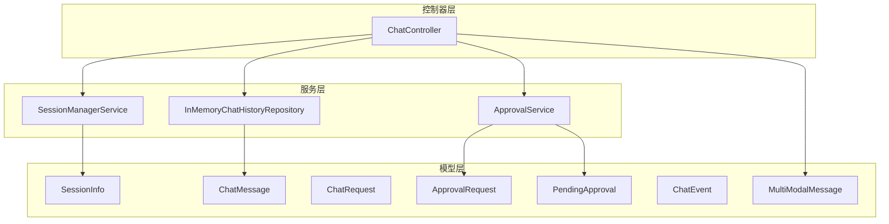
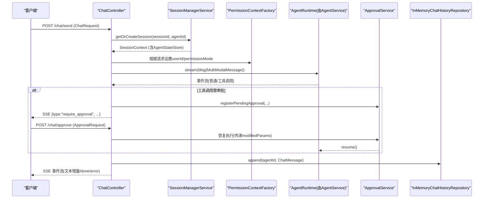
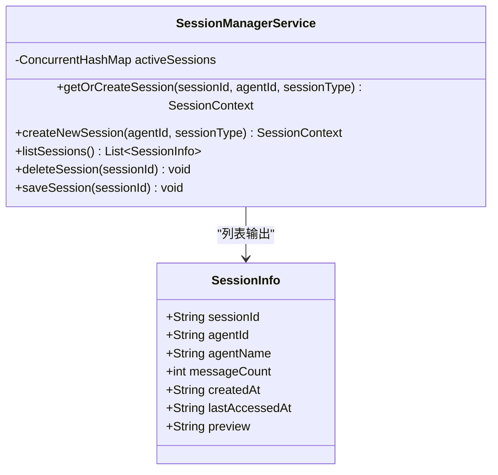
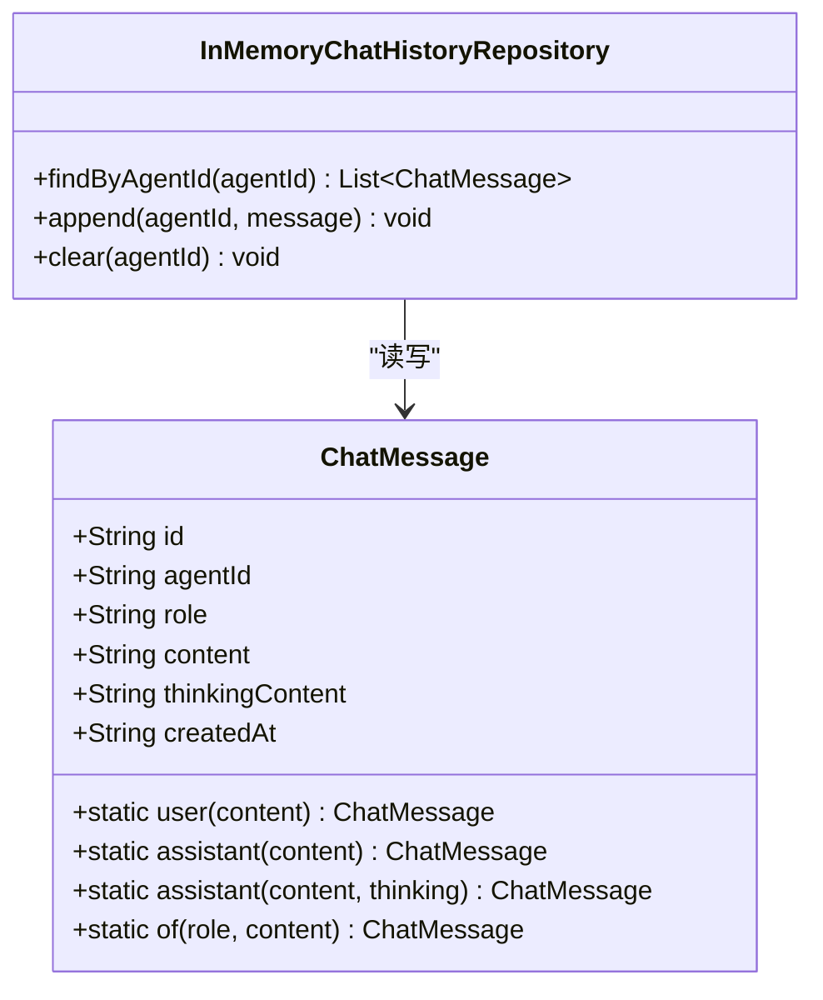
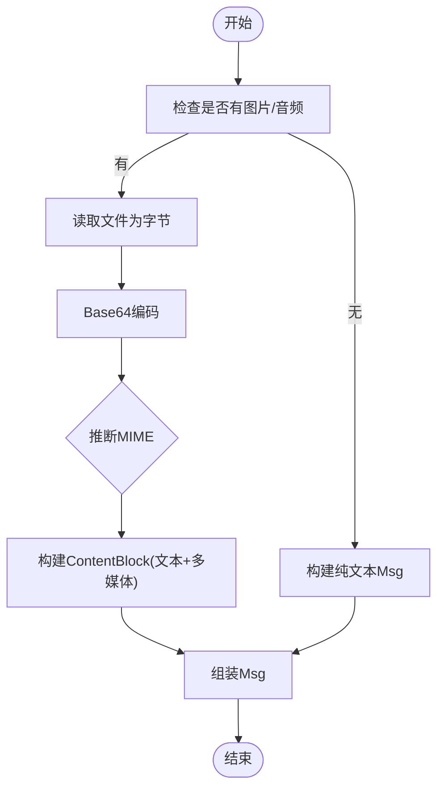
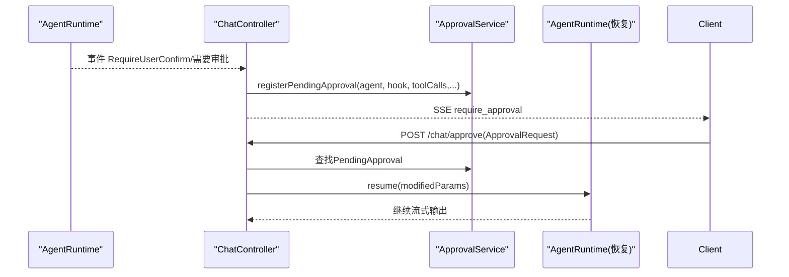
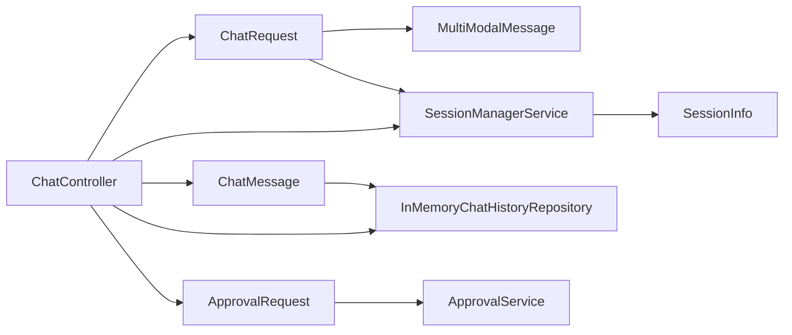

# 核心实体模型

<cite>
**本文引用的文件**
- [SessionInfo.java](file://src/main/java/com/skloda/agentscope/model/SessionInfo.java)
- [ChatMessage.java](file://src/main/java/com/skloda/agentscope/model/ChatMessage.java)
- [ChatRequest.java](file://src/main/java/com/skloda/agentscope/model/ChatRequest.java)
- [ApprovalRequest.java](file://src/main/java/com/skloda/agentscope/model/ApprovalRequest.java)
- [PendingApproval.java](file://src/main/java/com/skloda/agentscope/model/PendingApproval.java)
- [ChatEvent.java](file://src/main/java/com/skloda/agentscope/model/ChatEvent.java)
- [MultiModalMessage.java](file://src/main/java/com/skloda/agentscope/model/MultiModalMessage.java)
- [SessionManagerService.java](file://src/main/java/com/skloda/agentscope/service/SessionManagerService.java)
- [ApprovalService.java](file://src/main/java/com/skloda/agentscope/service/ApprovalService.java)
- [InMemoryChatHistoryRepository.java](file://src/main/java/com/skloda/agentscope/service/InMemoryChatHistoryRepository.java)
- [ChatController.java](file://src/main/java/com/skloda/agentscope/controller/ChatController.java)
- [AgentScopeDemoApplication$StartupListener.class](file://target/classes/com/skloda/agentscope/AgentScopeDemoApplication$StartupListener.class)
</cite>

## 目录
1. [简介](#简介)
2. [项目结构](#项目结构)
3. [核心组件](#核心组件)
4. [架构总览](#架构总览)
5. [详细组件分析](#详细组件分析)
6. [依赖关系分析](#依赖关系分析)
7. [性能考虑](#性能考虑)
8. [故障排查指南](#故障排查指南)
9. [结论](#结论)
10. [附录](#附录)

## 简介
本章节面向需要理解与使用系统基础数据模型的读者，聚焦如下核心实体：会话信息 SessionInfo、聊天消息 ChatMessage、聊天请求 ChatRequest、审批请求 ApprovalRequest 以及与之紧密相关的 PendingApproval 和事件 ChatEvent。文档将从字段定义、类型约束、业务规则、关联关系、数据流、会话生命周期管理、消息持久化策略、权限控制、异常处理及性能优化等方面展开，提供代码级可视化图与实际使用路径参考，便于扩展新的核心实体类型。

## 项目结构
本项目采用分层架构：
- 模型层（model）：定义领域数据传输对象（DTO）与轻量实体（SessionInfo、ChatMessage、ChatRequest、ApprovalRequest、PendingApproval、ChatEvent）。
- 服务层（service）：实现会话管理、审批流程、聊天历史持久化等能力。
- 控制器层（controller）：暴露 HTTP/SSE 接口，将客户端请求转换为内部命令并驱动业务流程。
- 运行时与工具（runtime/tool 等）：执行 Agent 逻辑、构建多模态消息等。

图表来源
- [ChatController.java](file://src/main/java/com/skloda/agentscope/controller/ChatController.java#L1-L150)
- [SessionManagerService.java](file://src/main/java/com/skloda/agentscope/service/SessionManagerService.java#L23-L197)
- [ApprovalService.java](file://src/main/java/com/skloda/agentscope/service/ApprovalService.java#L21-L76)
- [InMemoryChatHistoryRepository.java](file://src/main/java/com/skloda/agentscope/service/InMemoryChatHistoryRepository.java#L11-L46)

章节来源
- [ChatController.java:44-100](file://src/main/java/com/skloda/agentscope/controller/ChatController.java#L44-L100)
- [SessionManagerService.java:23-93](file://src/main/java/com/skloda/agentscope/service/SessionManagerService.java#L23-L93)
- [ApprovalService.java:17-76](file://src/main/java/com/skloda/agentscope/service/ApprovalService.java#L17-L76)
- [InMemoryChatHistoryRepository.java:11-46](file://src/main/java/com/skloda/agentscope/service/InMemoryChatHistoryRepository.java#L11-L46)

## 核心组件
- SessionInfo：会话列表展示用轻量 DTO，包含会话标识、所属智能体、消息数量、时间戳与预览内容。
- ChatMessage：UI 端对话条目模型，用于记录并呈现用户与智能体的对话。
- ChatRequest：/chat/send 请求体，承载文本、附件路径、会话上下文与模式标志，支持多模态输入。
- ApprovalRequest：/chat/approve 审批响应体，携带审批决策与附加参数，支持会话关联。
- PendingApproval：内存中的待审批状态缓存，关联暂停的智能体实例与待调用工具集。
- ChatEvent：统一 SSE 事件载荷，用于“完成”“错误”等通用事件。
- MultiModalMessage：辅助类，负责从文件系统读取图片/音频字节并构建 Agent 可消费的多模态 Msg。

章节来源
- [SessionInfo.java:6-20](file://src/main/java/com/skloda/agentscope/model/SessionInfo.java#L6-L20)
- [ChatMessage.java:6-50](file://src/main/java/com/skloda/agentscope/model/ChatMessage.java#L6-L50)
- [ChatRequest.java:3-143](file://src/main/java/com/skloda/agentscope/model/ChatRequest.java#L3-L143)
- [ApprovalRequest.java:6-20](file://src/main/java/com/skloda/agentscope/model/ApprovalRequest.java#L6-L20)
- [PendingApproval.java:13-39](file://src/main/java/com/skloda/agentscope/model/PendingApproval.java#L13-L39)
- [ChatEvent.java:6-39](file://src/main/java/com/skloda/agentscope/model/ChatEvent.java#L6-L39)
- [MultiModalMessage.java:20-172](file://src/main/java/com/skloda/agentscope/model/MultiModalMessage.java#L20-L172)

## 架构总览
下图展示一次典型的聊天请求到响应的整体数据流，涵盖会话获取、消息持久化、审批拦截、SSE 事件推送等关键环节。

图表来源
- [ChatController.java:44-150](file://src/main/java/com/skloda/agentscope/controller/ChatController.java#L44-L150)
- [SessionManagerService.java:75-145](file://src/main/java/com/skloda/agentscope/service/SessionManagerService.java#L75-L145)
- [ApprovalService.java:29-46](file://src/main/java/com/skloda/agentscope/service/ApprovalService.java#L29-L46)
- [MultiModalMessage.java:31-94](file://src/main/java/com/skloda/agentscope/model/MultiModalMessage.java#L31-L94)
- [InMemoryChatHistoryRepository.java:17-37](file://src/main/java/com/skloda/agentscope/service/InMemoryChatHistoryRepository.java#L17-L37)

## 详细组件分析

### 会话信息与生命周期管理（SessionInfo + SessionManagerService）
- SessionInfo
  - 字段：sessionId、agentId、agentName、messageCount、createdAt、lastAccessedAt、preview。
  - 用途：会话列表 API 的响应载体；不包含完整上下文，适合前端分页展示。
- 会话创建与获取
  - getOrCreateSession：优先复用已有 sessionId 且校验 sessionType 一致性；若配置变化则迁移到新 StateStore。
  - createNewSession：随机生成短 ID，装配 ReActAgent 与 AgentStateStore 并存入内存表 activeSessions。
  - listSessions：按最近访问时间排序，填充 agentName，并返回 SessionInfo 列表。
  - deleteSession/saveSession：清理或触碰活动时间。
- 会话迁移
  - migrateSession：当 sessionType 变更时，重建 AgentStateStore 与 ReActAgent，替换上下文映射。
- 时间格式化：统一以本地时区格式化输出。

图表来源
- [SessionInfo.java:6-20](file://src/main/java/com/skloda/agentscope/model/SessionInfo.java#L6-L20)
- [SessionManagerService.java:23-197](file://src/main/java/com/skloda/agentscope/service/SessionManagerService.java#L23-L197)

章节来源
- [SessionManagerService.java:75-197](file://src/main/java/com/skloda/agentscope/service/SessionManagerService.java#L75-L197)
- [SessionInfo.java:6-20](file://src/main/java/com/skloda/agentscope/model/SessionInfo.java#L6-L20)

### 聊天消息与历史持久化（ChatMessage + InMemoryChatHistoryRepository）
- ChatMessage
  - 字段：id、agentId、role、content、thinkingContent、createdAt。
  - 构造器：提供 user()/assistant()/of() 快速创建，内置 UUID 与 ISO 时间戳。
- 持久化策略
  - 在内存中以 agentId 为键聚合消息队列；写入时会深拷贝以避免外部引用污染。
  - 查询会返回副本，保障线程安全。
- 适用场景：演示与低负载环境；生产环境可替换为数据库实现（通过接口隔离）。

图表来源
- [ChatMessage.java:6-50](file://src/main/java/com/skloda/agentscope/model/ChatMessage.java#L6-L50)
- [InMemoryChatHistoryRepository.java:11-46](file://src/main/java/com/skloda/agentscope/service/InMemoryChatHistoryRepository.java#L11-L46)

章节来源
- [ChatMessage.java:6-99](file://src/main/java/com/skloda/agentscope/model/ChatMessage.java#L6-L99)
- [InMemoryChatHistoryRepository.java:17-37](file://src/main/java/com/skloda/agentscope/service/InMemoryChatHistoryRepository.java#L17-L37)

### 聊天请求与多模态消息（ChatRequest + MultiModalMessage）
- ChatRequest
  - 关键字段：agentId（默认"chat.basic"）、message、filePath、fileName、sessionId、userId、executionMode、permissionMode、sessionType。
  - 多模态：images（List<ImageFile>）、audio（AudioFile），内部嵌套类包含 path 与 fileName。
  - 业务含义：
    - executionMode：控制执行模式（如计划/任务列表等，具体由上层策略决定）。
    - permissionMode：访问控制上下文（后续由权限上下文装配）。
    - sessionType：会话存储策略（memory/distributed 等）。
- MultiModalMessage
  - 方法：withImage/withAudio/withMultipleImages，负责从文件系统读取文件字节，转为 Base64 与对应 MIME 类型，构建 Agent 可消费的 Msg。
  - 容错：文件读取失败时降级为纯文本提示，保证流式处理不中断。

图表来源
- [ChatRequest.java:3-143](file://src/main/java/com/skloda/agentscope/model/ChatRequest.java#L3-L143)
- [MultiModalMessage.java:31-157](file://src/main/java/com/skloda/agentscope/model/MultiModalMessage.java#L31-L157)

章节来源
- [ChatRequest.java:3-143](file://src/main/java/com/skloda/agentscope/model/ChatRequest.java#L3-L143)
- [MultiModalMessage.java:31-157](file://src/main/java/com/skloda/agentscope/model/MultiModalMessage.java#L31-L157)

### 审批流程与会话暂停/恢复（ApprovalRequest + PendingApproval + ApprovalService）
- ApprovalRequest
  - 字段：approvalId、approved、reason、modifiedParams、sessionId。
  - 语义：用户对工具的调用进行人工审核，approve=true 时允许继续执行，必要时可通过 modifiedParams 调整入参。
- PendingApproval
  - 字段：approvalId、agentId、sessionId、agent、hook、pendingToolCalls、createdAt。
  - 职责：保存被中断的 Agent 实例与待调用工具列表，便于恢复后继续执行。
- ApprovalService
  - registerPendingApproval：注册等待审批的状态，生成 approvalId，存入内存 Map。
  - cleanupExpired：定时清理超时未处理的待审批项（默认 5 分钟）。
  - get/removePendingApproval：查询与移除。

图表来源
- [ApprovalRequest.java:6-20](file://src/main/java/com/skloda/agentscope/model/ApprovalRequest.java#L6-L20)
- [PendingApproval.java:13-39](file://src/main/java/com/skloda/agentscope/model/PendingApproval.java#L13-L39)
- [ApprovalService.java:21-76](file://src/main/java/com/skloda/agentscope/service/ApprovalService.java#L21-L76)
- [ChatController.java:44-150](file://src/main/java/com/skloda/agentscope/controller/ChatController.java#L44-L150)

章节来源
- [ApprovalRequest.java:6-20](file://src/main/java/com/skloda/agentscope/model/ApprovalRequest.java#L6-L20)
- [ApprovalService.java:21-76](file://src/main/java/com/skloda/agentscope/service/ApprovalService.java#L21-L76)
- [PendingApproval.java:13-39](file://src/main/java/com/skloda/agentscope/model/PendingApproval.java#L13-L39)

### 事件与序列化容错（ChatEvent）
- ChatEvent：统一的 SSE 事件封装，支持 done/error 两种常用事件，其他字段按需填充。
- 序列化保护：当 JSON 序列化失败时，控制器会回退到安全字符串表示并发送错误事件，避免连接中断。

章节来源
- [ChatEvent.java:6-39](file://src/main/java/com/skloda/agentscope/model/ChatEvent.java#L6-L39)
- [ChatController.java:77-100](file://src/main/java/com/skloda/agentscope/controller/ChatController.java#L77-L100)

## 依赖关系分析
- ChatRequest → MultiModalMessage：请求携带多媒体文件路径，服务层将其转换为 Agent 可读的 Msg。
- ChatRequest → SessionManagerService：解析/创建会话并返回 SessionContext。
- ChatMessage → InMemoryChatHistoryRepository：消息写入历史库，供后续检索或 UI 渲染。
- ApprovalRequest → ApprovalService：审批通过后，恢复已挂起的 Agent 运行。
- SessionInfo ← SessionManagerService：从内存会话表中派生。
- 控制器层耦合点：ChatController 整合以上组件，协调数据流转。

图表来源
- [ChatController.java:44-150](file://src/main/java/com/skloda/agentscope/controller/ChatController.java#L44-L150)
- [SessionManagerService.java:75-197](file://src/main/java/com/skloda/agentscope/service/SessionManagerService.java#L75-L197)
- [ApprovalService.java:21-76](file://src/main/java/com/skloda/agentscope/service/ApprovalService.java#L21-L76)
- [InMemoryChatHistoryRepository.java:11-46](file://src/main/java/com/skloda/agentscope/service/InMemoryChatHistoryRepository.java#L11-L46)

章节来源
- [ChatController.java:44-150](file://src/main/java/com/skloda/agentscope/controller/ChatController.java#L44-L150)

## 性能考虑
- 会话缓存
  - 使用 ConcurrentHashMap 维护 activeSessions，减少并发读写的锁开销。
  - 会话迁移成本较高，应在切换 sessionType 前评估影响。
- 消息持久化
  - CopyOnWriteArrayList 适合读多写少的聊天历史；在高并发写入场景建议替换为阻塞队列或数据库。
- 文件上传/多模态
  - 大图/音频会导致 Base64 膨胀，应限制单文件大小并在后端压缩或转存对象存储。
  - 文件读取异常会降级为纯文本，确保服务健壮性；但会丢失媒体信息。
- SSE 序列化
  - 事件序列化失败时降级为错误事件；建议对高频事件进行精简以减少序列化开销。
- 审批过期清理
  - 定期清理 PendingApproval 释放内存；可根据业务调优过期时间与清理频率。

[本节为通用性能建议，不直接分析特定文件]

## 故障排查指南
- 会话问题
  - 症状：重复创建/无法获取会话；排查是否传入了冲突的 sessionId 或 sessionType 变更导致迁移失败。
  - 定位：SessionManagerService.getOrCreateSession/migrateSession。
- 文件/多模态失败
  - 症状：图片/音频不显示或提示加载失败；检查文件路径、权限与 MIME 判断分支。
  - 定位：MultiModalMessage.with* 方法及 getMediaType。
- 审批未恢复
  - 症状：工具调用卡住或前端持续显示“等待审批”；检查 PendingApproval 是否存在且未被清理，ApprovalRequest 是否正确携带 approvalId。
  - 定位：ApprovalService.registerPendingApproval/cleanupExpired。
- 消息丢失
  - 症状：历史为空或不全；确认 append 是否被调用、agentId 是否为空、并发写入是否被阻塞。
  - 定位：InMemoryChatHistoryRepository.append/find。
- SSE 连接中断
  - 症状：前端断开连接；关注序列化错误与异常堆栈，使用 ChatEvent.error 追踪。
  - 定位：ChatController.sseEvent/toJsonString。

章节来源
- [SessionManagerService.java:75-197](file://src/main/java/com/skloda/agentscope/service/SessionManagerService.java#L75-L197)
- [MultiModalMessage.java:31-157](file://src/main/java/com/skloda/agentscope/model/MultiModalMessage.java#L31-L157)
- [ApprovalService.java:21-76](file://src/main/java/com/skloda/agentscope/service/ApprovalService.java#L21-L76)
- [InMemoryChatHistoryRepository.java:17-37](file://src/main/java/com/skloda/agentscope/service/InMemoryChatHistoryRepository.java#L17-L37)
- [ChatController.java:77-100](file://src/main/java/com/skloda/agentscope/controller/ChatController.java#L77-L100)

## 结论
本项目的核心实体围绕“会话—消息—审批”的主线组织：
- ChatRequest 是入口，结合 MultiModalMessage 将输入转为 Agent 可消费的消息。
- SessionManagerService 保障会话一致性与生命周期。
- ChatMessage 经 InMemoryChatHistoryRepository 持久化以供回放。
- ApprovalService 配合 PendingApproval 与 ApprovalRequest 完成人机协同的关键控制点。
- ChatEvent 作为统一的事件抽象，提升前后端交互的稳定性和可扩展性。

通过上述分层与职责划分，系统在功能解耦、错误回退、可观测性方面具备良好基础，也易于在不破坏现有接口的前提下扩展新的实体类型或集成更稳定的持久化实现。

[本节为总结性内容，不直接分析特定文件]

## 附录

### 实体字段一览与约束说明
- SessionInfo
  - 字段：sessionId、agentId、agentName、messageCount、createdAt、lastAccessedAt、preview。
  - 约束：均为可读展示字段，无需强校验；messageCount 当前固定为 0。
- ChatMessage
  - 字段：id(UUID)、agentId、role(user/assistant)、content、thinkingContent、createdAt(ISO时间)。
  - 约束：role/content 必填语义上应由上层控制；创建时会自动赋值 id/createdAt。
- ChatRequest
  - 字段：agentId(默认"chat.basic")、message、filePath、fileName、sessionId、userId、executionMode、permissionMode、sessionType、images(audio)。
  - 约束：非空业务意义不同；多模态需确保路径存在且受访问控制。
- ApprovalRequest
  - 字段：approvalId、approved、reason、modifiedParams、sessionId。
  - 约束：approvalId 需匹配 PendingApproval 登记项；recommended 在 approved=false 时填写 reason。
- PendingApproval
  - 字段：approvalId、agentId、sessionId、agent、hook、pendingToolCalls、createdAt。
  - 作用：保存被暂停的 Agent 与待执行工具，用于恢复。
- ChatEvent
  - 字段：type、message、content。
  - 用途：SSE 通用事件封装，done/error 为关键类型。

章节来源
- [SessionInfo.java:6-20](file://src/main/java/com/skloda/agentscope/model/SessionInfo.java#L6-L20)
- [ChatMessage.java:6-50](file://src/main/java/com/skloda/agentscope/model/ChatMessage.java#L6-L50)
- [ChatRequest.java:3-143](file://src/main/java/com/skloda/agentscope/model/ChatRequest.java#L3-L143)
- [ApprovalRequest.java:6-20](file://src/main/java/com/skloda/agentscope/model/ApprovalRequest.java#L6-L20)
- [PendingApproval.java:13-39](file://src/main/java/com/skloda/agentscope/model/PendingApproval.java#L13-L39)
- [ChatEvent.java:6-39](file://src/main/java/com/skloda/agentscope/model/ChatEvent.java#L6-L39)

### 典型用法路径参考
- 发起聊天并附带图片/音频：
  - 调用入口：POST /chat/send
  - 关键依赖：MultiModalMessage.with*、SessionManagerService、AgentRuntime、ApprovalService、InMemoryChatHistoryRepository
  - 参考路径：[ChatController.java](file://src/main/java/com/skloda/agentscope/controller/ChatController.java#L44-L150)
- 人工审批工具调用：
  - 上游触发：Agent 工具调用触发 require_user_confirm
  - 客户端提交：POST /chat/approve
  - 参考路径：[ApprovalService.java](file://src/main/java/com/skloda/agentscope/service/ApprovalService.java#L21-L76), [ApprovalRequest.java](file://src/main/java/com/skloda/agentscope/model/ApprovalRequest.java#L6-L20)
- 列举会话：
  - 返回 SessionInfo 列表
  - 参考路径：[SessionManagerService.listSessions](file://src/main/java/com/skloda/agentscope/service/SessionManagerService.java#L164-L183)

章节来源
- [ChatController.java:44-150](file://src/main/java/com/skloda/agentscope/controller/ChatController.java#L44-L150)
- [ApprovalService.java:21-76](file://src/main/java/com/skloda/agentscope/service/ApprovalService.java#L21-L76)
- [ApprovalRequest.java:6-20](file://src/main/java/com/skloda/agentscope/model/ApprovalRequest.java#L6-L20)
- [SessionManagerService.java:164-183](file://src/main/java/com/skloda/agentscope/service/SessionManagerService.java#L164-L183)