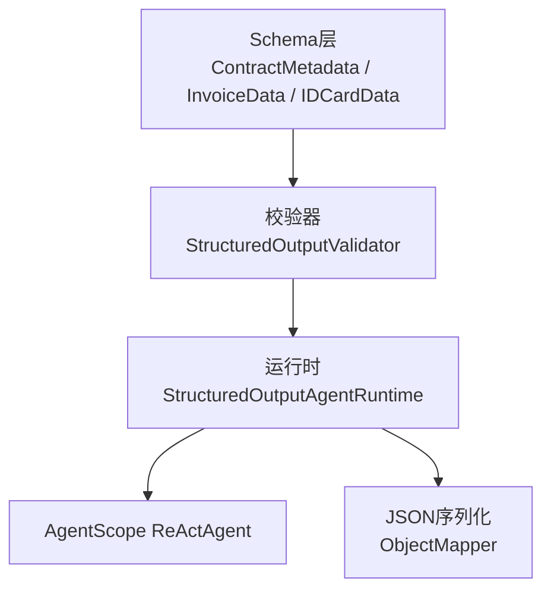
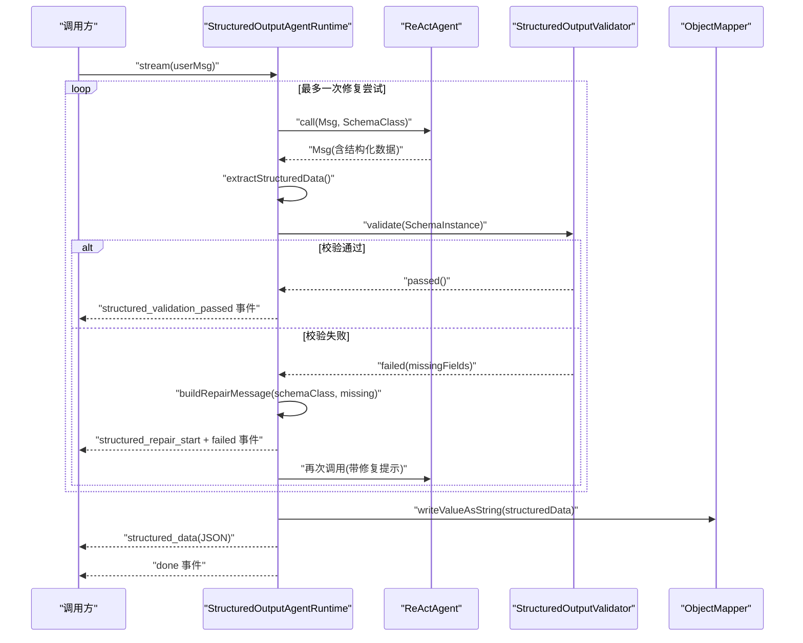
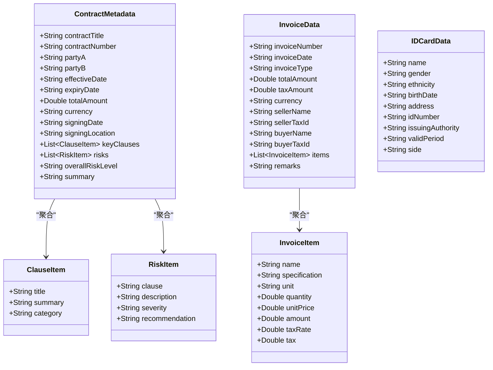
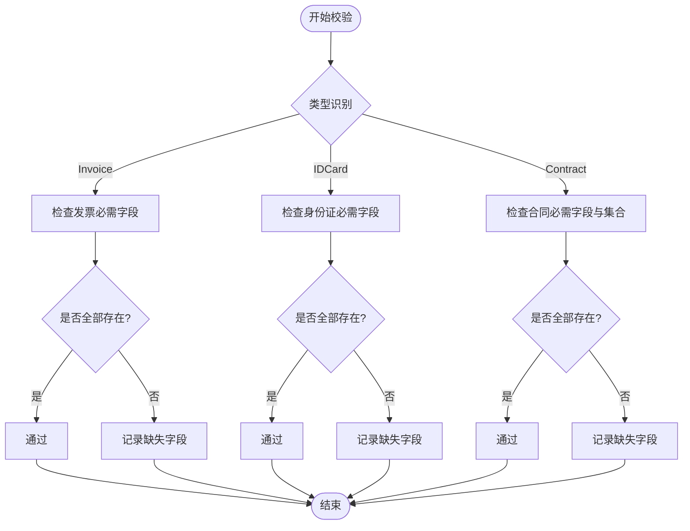
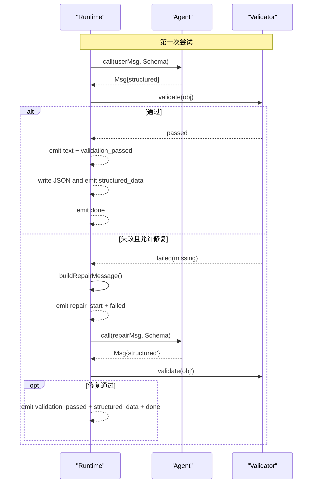
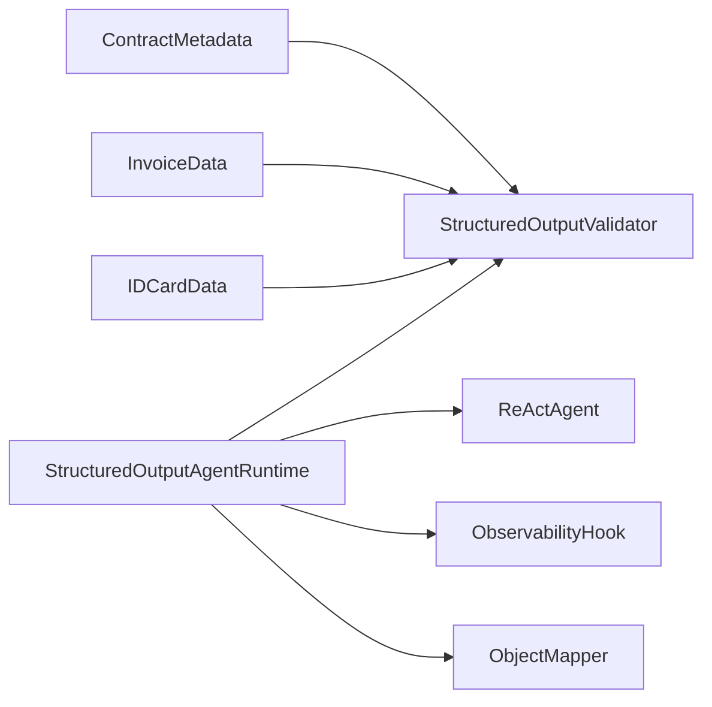

# 结构化输出Schema

<cite>
**本文引用的文件**   
- [ContractMetadata.java](file://src/main/java/com/skloda/agentscope/schema/ContractMetadata.java)
- [InvoiceData.java](file://src/main/java/com/skloda/agentscope/schema/InvoiceData.java)
- [IDCardData.java](file://src/main/java/com/skloda/agentscope/schema/IDCardData.java)
- [StructuredOutputValidator.java](file://src/main/java/com/skloda/agentscope/runtime/StructuredOutputValidator.java)
- [StructuredOutputAgentRuntime.java](file://src/main/java/com/skloda/agentscope/runtime/StructuredOutputAgentRuntime.java)
- [StructuredOutputValidatorTest.java](file://src/test/java/com/skloda/agentscope/runtime/StructuredOutputValidatorTest.java)
- [StructuredOutputAgentRuntimeTest.java](file://src/test/java/com/skloda/agentscope/runtime/StructuredOutputAgentRuntimeTest.java)
- [ContractMetadataTest.java](file://src/test/java/com/skloda/agentscope/schema/ContractMetadataTest.java)
- [InvoiceDataTest.java](file://src/test/java/com/skloda/agentscope/schema/InvoiceDataTest.java)
- [IDCardDataTest.java](file://src/test/java/com/skloda/agentscope/schema/IDCardDataTest.java)
</cite>

## 目录
1. [引言](#引言)
2. [项目结构概览](#项目结构概览)
3. [核心组件](#核心组件)
4. [架构总览](#架构总览)
5. [详细组件分析](#详细组件分析)
6. [依赖与交互分析](#依赖与交互分析)
7. [性能考量](#性能考量)
8. [故障诊断指南](#故障诊断指南)
9. [结论](#结论)
10. [附录：自定义Schema开发指南](#附录：自定义schema开发指南)

## 引言
本文件聚焦项目中“结构化输出Schema”的设计与实现，围绕三类典型领域模型展开：合同元数据（ContractMetadata）、发票数据（InvoiceData）、身份证信息（IDCardData）。我们将说明Schema的字段定义、验证规则、数据类型映射与嵌套结构；解析运行时序列化/反序列化的机制；并提供扩展自定义Schema的开发规范、约束设计、枚举限制与业务校验建议，最后给出版本兼容性与向后兼容策略。

## 项目结构概览
- Schema定义位于 schema 包，集中存放结构化输出模型，便于复用与跨模块使用。
- 运行期校验与重试由 runtime 包的 StructuredOutputValidator 与 StructuredOutputAgentRuntime 提供，封装了从LLM响应中提取结构化数据、执行校验、失败修复与事件下发等流程。
- 测试集中在 schema 与 runtime 子包的测试文件中，覆盖构造、字段赋值、必填约束与自动修复流程。

图表来源
- [ContractMetadata.java:8-43](file://src/main/java/com/skloda/agentscope/schema/ContractMetadata.java#L8-L43)
- [InvoiceData.java:8-37](file://src/main/java/com/skloda/agentscope/schema/InvoiceData.java#L8-L37)
- [IDCardData.java:6-19](file://src/main/java/com/skloda/agentscope/schema/IDCardData.java#L6-L19)
- [StructuredOutputValidator.java:14-99](file://src/main/java/com/skloda/agentscope/runtime/StructuredOutputValidator.java#L14-L99)
- [StructuredOutputAgentRuntime.java:17-182](file://src/main/java/com/skloda/agentscope/runtime/StructuredOutputAgentRuntime.java#L17-L182)

章节来源
- [ContractMetadata.java:1-43](file://src/main/java/com/skloda/agentscope/schema/ContractMetadata.java#L1-L43)
- [InvoiceData.java:1-37](file://src/main/java/com/skloda/agentscope/schema/InvoiceData.java#L1-L37)
- [IDCardData.java:1-19](file://src/main/java/com/skloda/agentscope/schema/IDCardData.java#L1-L19)
- [StructuredOutputValidator.java:1-99](file://src/main/java/com/skloda/agentscope/runtime/StructuredOutputValidator.java#L1-L99)
- [StructuredOutputAgentRuntime.java:1-182](file://src/main/java/com/skloda/agentscope/runtime/StructuredOutputAgentRuntime.java#L1-L182)

## 核心组件
- 合同元数据 ContractMetadata：表达合同抽取的结构化结果，包含基础信息、条款清单、风险清单、总体风险等级及摘要。
- 发票数据 InvoiceData：表达发票抽取的结构化结果，包含头部基本信息和条目明细列表。
- 身份证信息 IDCardData：表达证件OCR/抽取结果的基础身份字段。
- 校验器 StructuredOutputValidator：针对上述Schema进行轻量必填与集合非空校验，返回统一的结果记录。
- 运行时 StructuredOutputAgentRuntime：基于 AgentScope 的 ReActAgent 调用，解析结构化数据并触发校验；不通过则构造修复提示消息并尝试再请求，最终下发事件流。

章节来源
- [ContractMetadata.java:8-43](file://src/main/java/com/skloda/agentscope/schema/ContractMetadata.java#L8-L43)
- [InvoiceData.java:8-37](file://src/main/java/com/skloda/agentscope/schema/InvoiceData.java#L8-L37)
- [IDCardData.java:6-19](file://src/main/java/com/skloda/agentscope/schema/IDCardData.java#L6-L19)
- [StructuredOutputValidator.java:14-99](file://src/main/java/com/skloda/agentscope/runtime/StructuredOutputValidator.java#L14-L99)
- [StructuredOutputAgentRuntime.java:17-182](file://src/main/java/com/skloda/agentscope/runtime/StructuredOutputAgentRuntime.java#L17-L182)

## 架构总览
下图展示了“结构化输出”从用户请求到得到可序列化JSON的关键流程：构建/选择Schema类 → 调用ReActAgent提取 → 校验缺失/非法 → 必要时构建修复提示并重试 → 输出结构化数据或错误事件。

图表来源
- [StructuredOutputAgentRuntime.java:52-136](file://src/main/java/com/skloda/agentscope/runtime/StructuredOutputAgentRuntime.java#L52-L136)
- [StructuredOutputValidator.java:16-84](file://src/main/java/com/skloda/agentscope/runtime/StructuredOutputValidator.java#L16-L84)

章节来源
- [StructuredOutputAgentRuntime.java:17-182](file://src/main/java/com/skloda/agentscope/runtime/StructuredOutputAgentRuntime.java#L17-L182)
- [StructuredOutputValidator.java:1-99](file://src/main/java/com/skloda/agentscope/runtime/StructuredOutputValidator.java#L1-L99)

## 详细组件分析

### 数据结构与关系（面向对象视角）
- 每个Schema均为Java POJO，字段公开，便于JSON反序列化为对象；所有类提供空参构造函数以支持框架/库的反序列化。
- 复合结构通过内部静态类表达嵌套：
  - ContractMetadata 内嵌 ClauseItem、RiskItem
  - InvoiceData 内嵌 InvoiceItem

图表来源
- [ContractMetadata.java:8-43](file://src/main/java/com/skloda/agentscope/schema/ContractMetadata.java#L8-L43)
- [InvoiceData.java:8-37](file://src/main/java/com/skloda/agentscope/schema/InvoiceData.java#L8-L37)
- [IDCardData.java:6-19](file://src/main/java/com/skloda/agentscope/schema/IDCardData.java#L6-L19)

#### 字段验证规则（必填与集合）
- 发票数据要求至少包含票据编号、日期、总金额、销售方名称、购买方名称等关键项；未满足时将返回缺少字段集合。
- 身份证数据要求姓名与身份证号；其余为可选补充字段。
- 合同数据要求合同标题、双方主体、两个列表（条款、风险）、总体风险等级与摘要；若任一缺失，校验将报告相应字段。

图表来源
- [StructuredOutputValidator.java:32-84](file://src/main/java/com/skloda/agentscope/runtime/StructuredOutputValidator.java#L32-L84)

章节来源
- [StructuredOutputValidator.java:14-99](file://src/main/java/com/skloda/agentscope/runtime/StructuredOutputValidator.java#L14-L99)
- [InvoiceDataTest.java:30-59](file://src/test/java/com/skloda/agentscope/schema/InvoiceDataTest.java#L30-L59)
- [IDCardDataTest.java:25-48](file://src/test/java/com/skloda/agentscope/schema/IDCardDataTest.java#L25-L48)
- [ContractMetadataTest.java:32-66](file://src/test/java/com/skloda/agentscope/schema/ContractMetadataTest.java#L32-L66)

#### 类型映射与嵌套支持
- String：用于文本、编码、标识、时间字符串表示等。
- Double：用于金额、数量、税率等数值场景，避免精度丢失。
- List<T>：用于一维集合（如条款、风险、发票条目），在JSON中表现为数组；校验器要求不为空（对部分字段）。

章节来源
- [ContractMetadata.java:10-22](file://src/main/java/com/skloda/agentscope/schema/ContractMetadata.java#L10-L22)
- [InvoiceData.java:10-21](file://src/main/java/com/skloda/agentscope/schema/InvoiceData.java#L10-L21)
- [IDCardData.java:8-16](file://src/main/java/com/skloda/agentscope/schema/IDCardData.java#L8-L16)

### 运行时序列化/反序列化与错误处理
- 反序列化：通过 ReActAgent 返回的 Msg 携带结构化数据对象，运行时根据传入的SchemaClass进行类型提取。
- 校验：StructuredOutputValidator 按类别路由校验逻辑，缺失字段会收集到缺失集合。
- 修复与重试：校验失败时构造修复提示消息并发起新一轮请求，内置最大修复次数默认为1次，以便降低重复调用成本。
- 事件输出：过程中持续下发多种事件（文本内容、校验通过/失败、修复开始、结构化数据、完成等），方便前端或观测系统消费。
- JSON序列化：校验成功后以 ObjectMapper 写入JSON字符串作为 structured_data 事件载体。
- 异常捕获：类找不到、任意异常均会被捕获并转换为 error 事件，确保流完整关闭。

图表来源
- [StructuredOutputAgentRuntime.java:52-136](file://src/main/java/com/skloda/agentscope/runtime/StructuredOutputAgentRuntime.java#L52-L136)
- [StructuredOutputValidator.java:16-84](file://src/main/java/com/skloda/agentscope/runtime/StructuredOutputValidator.java#L16-L84)

章节来源
- [StructuredOutputAgentRuntime.java:52-136](file://src/main/java/com/skloda/agentscope/runtime/StructuredOutputAgentRuntime.java#L52-L136)
- [StructuredOutputValidator.java:14-99](file://src/main/java/com/skloda/agentscope/runtime/StructuredOutputValidator.java#L14-L99)
- [StructuredOutputAgentRuntimeTest.java:25-67](file://src/test/java/com/skloda/agentscope/runtime/StructuredOutputAgentRuntimeTest.java#L25-L67)

### 枚举值与字段约束的现状与建议
- 当前Schema使用开放String来表示受限取值（例如整体风险等级 LOW/MEDIUM/HIGH/CRITICAL，条款分类 PAYMENT/DELIVERY/LIABILITY/TERMINATION/CONFIDENTIALITY/OTHER，证件正反 side 为 front/back），校验器并未强制枚举范围，只关注必填与集合非空。
- 建议在新增或改造Schema时：
  - 在Schema层面使用 Enum 替换限定字符串以提升类型安全。
  - 在校验阶段增加白名单校验（可复现 requireEnum 辅助方法）。
  - 对外文档声明受取值范围。

章节来源
- [ContractMetadata.java:20-23](file://src/main/java/com/skloda/agentscope/schema/ContractMetadata.java#L20-L23)
- [ContractMetadata.java:27-33](file://src/main/java/com/skloda/agentscope/schema/ContractMetadata.java#L27-L33)
- [IDCardData.java:16-16](file://src/main/java/com/skloda/agentscope/schema/IDCardData.java#L16-L16)
- [StructuredOutputValidator.java:68-84](file://src/main/java/com/skloda/agentscope/runtime/StructuredOutputValidator.java#L68-L84)

## 依赖与交互分析
- StructuredOutputValidator 直接依赖三个Schema类，形成松耦合的类型分派。
- StructuredOutputAgentRuntime 依赖：
  - ReActAgent：用于结构化提取。
  - ObservabilityHook：用于生命周期事件合并与追踪。
  - ObjectMapper：用于将对象序列化为JSON。
- 测试用例验证：
  - Schema对象的构造与字段设置行为正确性。
  - 校验器对缺失字段的判定正确性。
  - 运行时的重试、事件流完整性与最终结构化数据输出。

图表来源
- [StructuredOutputValidator.java:3-5](file://src/main/java/com/skloda/agentscope/runtime/StructuredOutputValidator.java#L3-L5)
- [StructuredOutputAgentRuntime.java:1-13](file://src/main/java/com/skloda/agentscope/runtime/StructuredOutputAgentRuntime.java#L1-L13)

章节来源
- [ContractMetadataTest.java:11-157](file://src/test/java/com/skloda/agentscope/schema/ContractMetadataTest.java#L11-L157)
- [InvoiceDataTest.java:11-99](file://src/test/java/com/skloda/agentscope/schema/InvoiceDataTest.java#L11-L99)
- [IDCardDataTest.java:9-58](file://src/test/java/com/skloda/agentscope/schema/IDCardDataTest.java#L9-L58)
- [StructuredOutputValidatorTest.java:17-52](file://src/test/java/com/skloda/agentscope/runtime/StructuredOutputValidatorTest.java#L17-L52)
- [StructuredOutputAgentRuntimeTest.java:25-67](file://src/test/java/com/skloda/agentscope/runtime/StructuredOutputAgentRuntimeTest.java#L25-L67)

## 性能考量
- 最少必要校验：仅校验关键字段与集合为空情况，降低计算开销。
- 有限重试：默认最大修复次数较小，减少冗余的LLM调用。
- 流式事件：边处理边下发，有助于前端即时渲染与观测。
- 内存占用：使用POJO对象，无额外反射缓存；在大批量并发下注意对象分配与GC压力。

## 故障诊断指南
- 常见报错：
  - “结构化输出为空”：表明响应不含结构化数据对象。需检查上游Agent配置与提示词。
  - “缺失必需字段”：根据返回的 missingFields 定位缺失字段，优化提示词或工具前置条件。
  - “Schema类不存在”：运行时通过字符串类名加载失败，核对类名拼写与打包。
  - 通用异常：日志中将包含异常堆栈与消息，用于快速定位。
- 定位步骤：
  - 观察 events 流中的 structured_validation_failed 与 structured_repair_start，确认缺失字段。
  - 查看最终 structured_data 事件内容是否为预期JSON。
  - 对照Schema字段注释与实际业务上下文，补全Prompt或约束。

章节来源
- [StructuredOutputAgentRuntime.java:117-131](file://src/main/java/com/skloda/agentscope/runtime/StructuredOutputAgentRuntime.java#L117-L131)
- [StructuredOutputValidator.java:16-29](file://src/main/java/com/skloda/agentscope/runtime/StructuredOutputValidator.java#L16-L29)
- [StructuredOutputValidatorTest.java:17-52](file://src/test/java/com/skloda/agentscope/runtime/StructuredOutputValidatorTest.java#L17-L52)

## 结论
本项目通过“轻量Schema + 运行时校验 + 流式事件”的方式，实现了稳定的结构化输出能力。Schema清晰表达了核心领域数据的结构与约束，运行时在失败时能主动修复并重试，最终交付可用的JSON。后续可通过引入枚举类型与更丰富的业务校验进一步提升健壮性与可维护性。

## 附录：自定义Schema开发指南

### 1. 定义Schema类与字段
- 新建一个POJO类放在 schema 包中，字段尽量语义明确；公共字段可直接暴露或使用标准getter/setter（当前实现接受公共字段）。
- 对于受限取值建议未来迁移为枚举；现阶段可在校验阶段加入白名单。

章节来源
- [ContractMetadata.java:8-43](file://src/main/java/com/skloda/agentscope/schema/ContractMetadata.java#L8-L43)
- [InvoiceData.java:8-37](file://src/main/java/com/skloda/agentscope/schema/InvoiceData.java#L8-L37)
- [IDCardData.java:6-19](file://src/main/java/com/skloda/agentscope/schema/IDCardData.java#L6-L19)

### 2. 添加校验规则
- 在 StructuredOutputValidator 中为新Schema增加分支，编写 requireText / requireNumber / requireCollection / requireEnum 等方法组合。
- 将缺失字段汇总到列表并通过 ValidationResult.failed 返回，确保下游能感知并触发修复。

章节来源
- [StructuredOutputValidator.java:32-84](file://src/main/java/com/skloda/agentscope/runtime/StructuredOutputValidator.java#L32-L84)

### 3. 注册到运行时
- 在需要启用结构化输出的Agent配置中传入该Schema的类名字符串；运行时会在首次调用时解析该类。
- 当校验失败时，运行时将生成修复提示并重试，直到达到最大重试次数或成功。

章节来源
- [StructuredOutputAgentRuntime.java:31-49](file://src/main/java/com/skloda/agentscope/runtime/StructuredOutputAgentRuntime.java#L31-L49)
- [StructuredOutputAgentRuntime.java:67-99](file://src/main/java/com/skloda/agentscope/runtime/StructuredOutputAgentRuntime.java#L67-L99)

### 4. 枚举值限制与业务规则
- 优先使用枚举提升类型安全；若仍用字符串，需在校验阶段增加白名单校验。
- 业务规则（如总额=合计税额+税费等）可在Schema上提供自定义校验方法，或在校验器中扩展对应规则。

章节来源
- [StructuredOutputValidator.java:68-84](file://src/main/java/com/skloda/agentscope/runtime/StructuredOutputValidator.java#L68-L84)

### 5. 序列化/反序列化注意事项
- 确保有默认构造函数，Jackson才能正确反序列化。
- 保持字段命名稳定，如需变更，建议引入兼容字段别名。

章节来源
- [ContractMetadata.java:25-25](file://src/main/java/com/skloda/agentscope/schema/ContractMetadata.java#L25-L25)
- [InvoiceData.java:23-23](file://src/main/java/com/skloda/agentscope/schema/InvoiceData.java#L23-L23)
- [IDCardData.java:18-18](file://src/main/java/com/skloda/agentscope/schema/IDCardData.java#L18-L18)

### 6. Schema版本兼容性与向后兼容策略
- 兼容性目标：新增字段应尽量可选，避免破坏已有消费者。
- 废弃字段：先保留并忽略读取，后续在下一大版本移除。
- 枚举值演进：新增合法取值时需向前兼容，避免拒绝旧客户端数据。
- 建议实践：
  - 在Schema上增加 version 字段并在校验器中进行最小版本检查。
  - 在导入/导出时做字段映射与缺省值补齐，确保旧结构仍可工作。
  - 发布前运行现有测试，保障主路径不被破坏。

章节来源
- [StructuredOutputValidator.java:16-29](file://src/main/java/com/skloda/agentscope/runtime/StructuredOutputValidator.java#L16-L29)
- [StructuredOutputAgentRuntime.java:67-100](file://src/main/java/com/skloda/agentscope/runtime/StructuredOutputAgentRuntime.java#L67-L100)