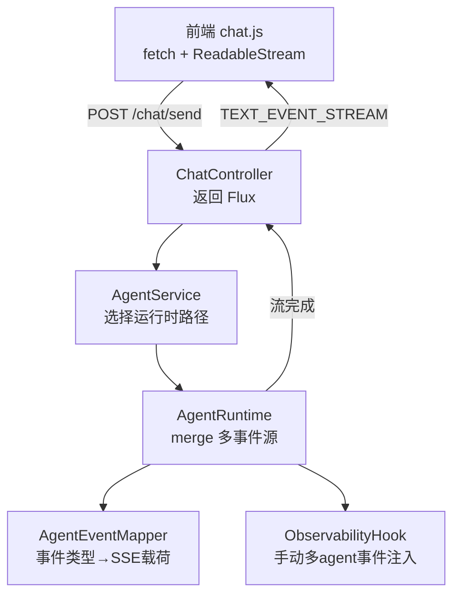
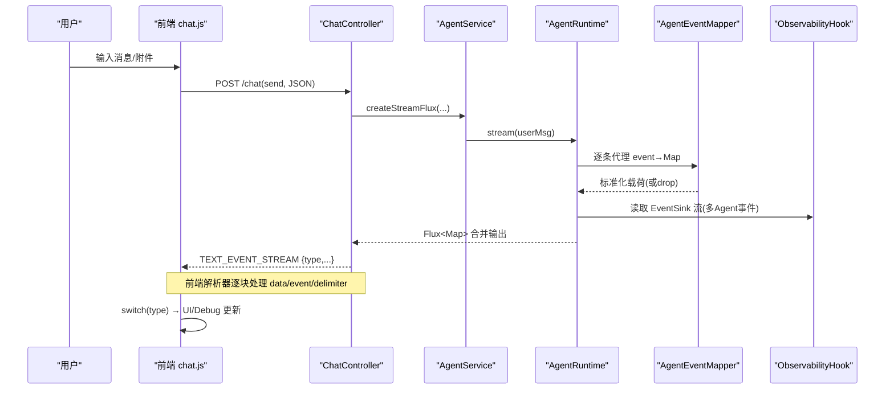
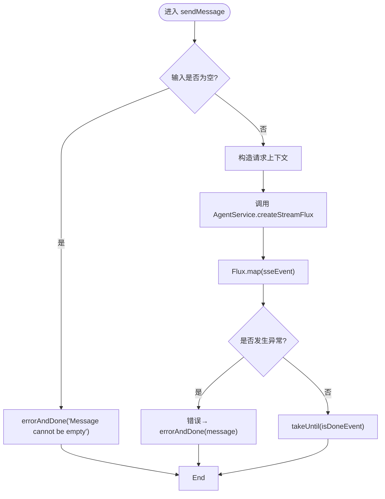
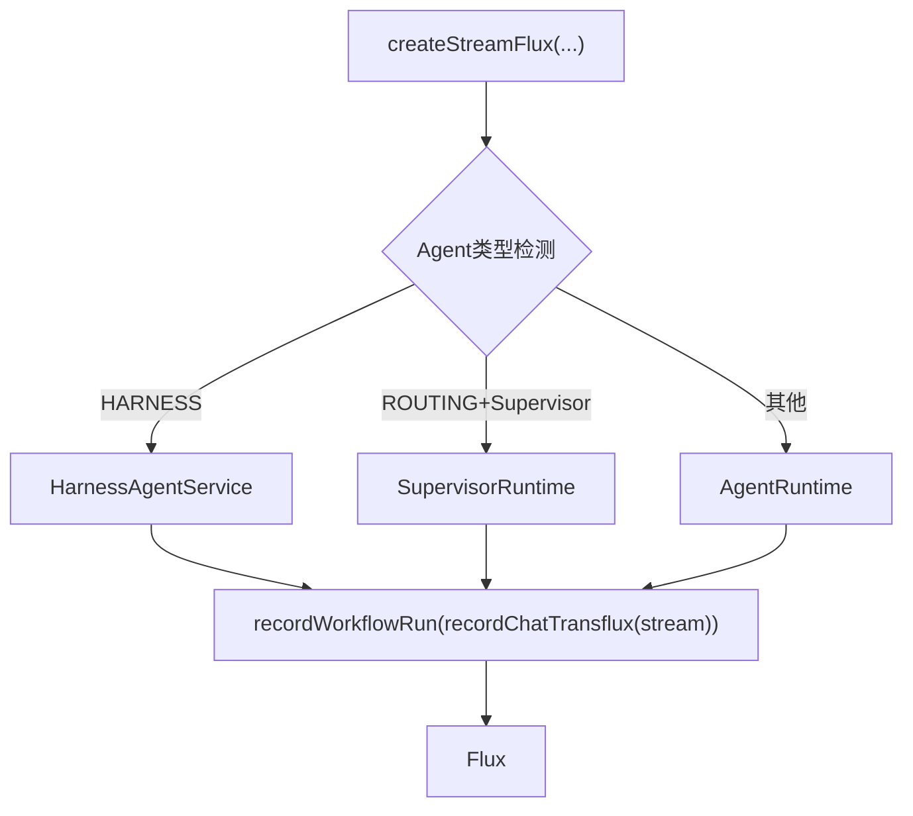
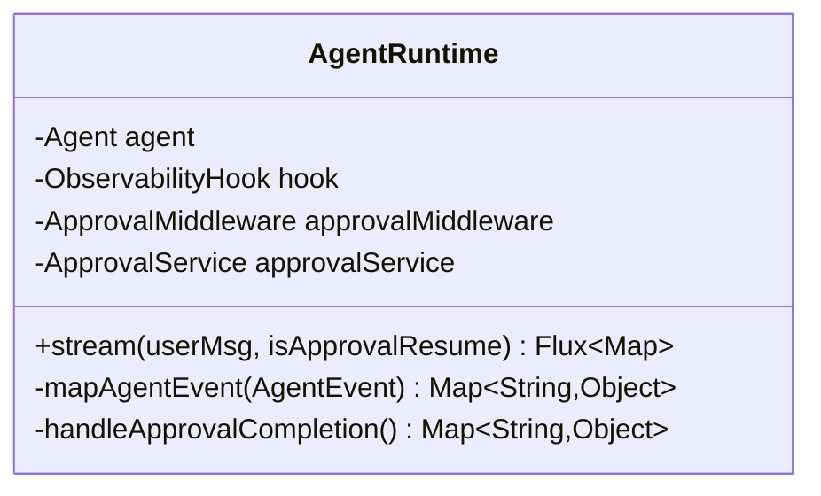
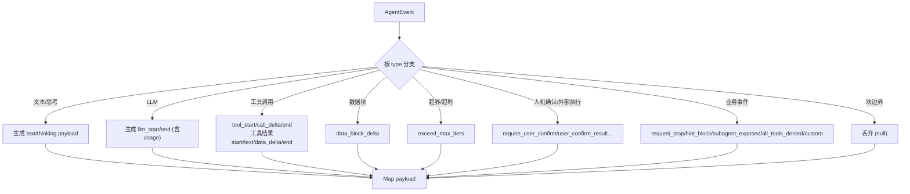
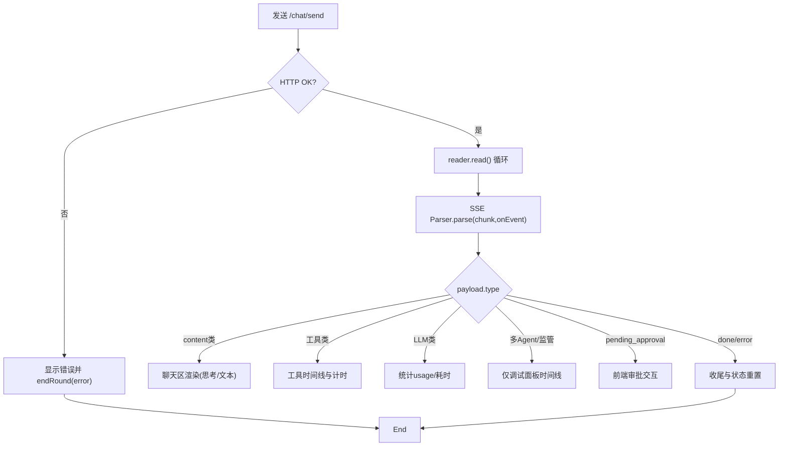
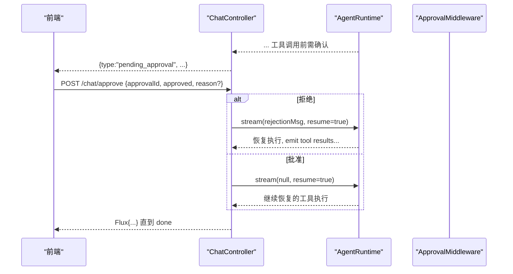
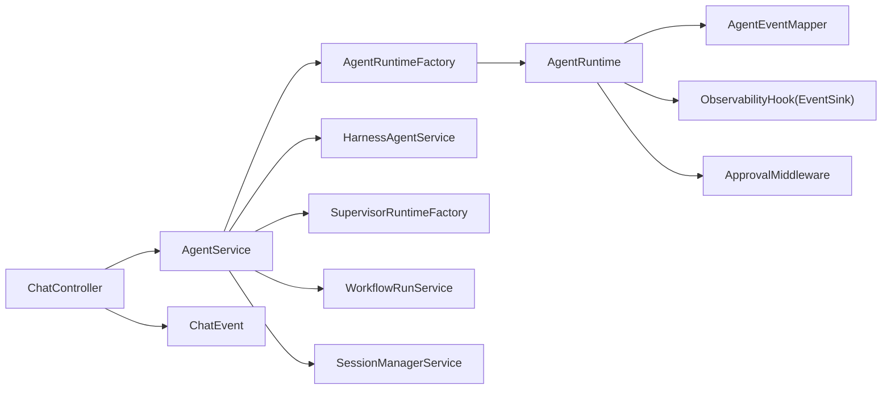

# SSE 流式通信

<cite>
**本文引用的文件列表**
- [ChatController.java](file://src/main/java/com/skloda/agentscope/controller/ChatController.java)
- [AgentEventMapper.java](file://src/main/java/com/skloda/agentscope/runtime/AgentEventMapper.java)
- [ChatEvent.java](file://src/main/java/com/skloda/agentscope/model/ChatEvent.java)
- [AgentRuntime.java](file://src/main/java/com/skloda/agentscope/runtime/AgentRuntime.java)
- [AgentService.java](file://src/main/java/com/skloda/agentscope/service/AgentService.java)
- [ObservabilityHook.java](file://src/main/java/com/skloda/agentscope/hook/ObservabilityHook.java)
- [api.js](file://src/main/resources/static/scripts/api.js)
- [chat.js](file://src/main/resources/static/scripts/chat.js)
- [debug.js](file://src/main/resources/static/scripts/modules/debug.js)
- [ui.js](file://src/main/resources/static/scripts/modules/ui.js)
</cite>

## 目录
1. [简介](#简介)
2. [项目结构](#项目结构)
3. [核心组件](#核心组件)
4. [架构总览](#架构总览)
5. [详细组件分析](#详细组件分析)
6. [依赖关系分析](#依赖关系分析)
7. [性能考量](#性能考量)
8. [故障排查指南](#故障排查指南)
9. [结论](#结论)
10. [附录](#附录)

## 简介
本技术文档系统性阐述本项目中的 Server-Sent Events（SSE）流式通信机制，覆盖后端事件生成与处理、Agent 事件到 SSE 的标准化映射、前端流式接收与渲染、以及完整的事件生命周期管理。重点包括：
- ChatController 中 sseEvent、sseDone、sseError 的实现与作用
- AgentEventMapper 如何将 30+ 种 Agent 内部事件转换为统一的 SSE 事件载荷
- 前端基于 fetch + ReadableStream 的 SSE 解析流程、消息路由、用户交互响应与错误重连策略
- Agent 从启动到结束的事件链路，包括开始、token 增量、工具调用、完成、审批（HITL）等

## 项目结构
SSE 数据流自前端发起 POST 至 /chat/send，后端以 Flux<ServerSentEvent<String>> 返回文本事件流；Agent 事件通过 Reactive 管道在 AgentRuntime 合并并映射为标准 SSE JSON 载荷；前端自定义解析器持续消费事件，驱动 UI 更新。

**图示来源**
- [ChatController.java:117-153](file://src/main/java/com/skloda/agentscope/controller/ChatController.java#L117-L153)
- [AgentService.java:131-177](file://src/main/java/com/skloda/agentscope/service/AgentService.java#L131-L177)
- [AgentRuntime.java:67-142](file://src/main/java/com/skloda/agentscope/runtime/AgentRuntime.java#L67-L142)
- [AgentEventMapper.java:64-105](file://src/main/java/com/skloda/agentscope/runtime/AgentEventMapper.java#L64-L105)
- [ObservabilityHook.java:45-67](file://src/main/java/com/skloda/agentscope/hook/ObservabilityHook.java#L45-L67)

**章节来源**
- [ChatController.java:44-153](file://src/main/java/com/skloda/agentscope/controller/ChatController.java#L44-L153)
- [AgentService.java:26-177](file://src/main/java/com/skloda/agentscope/service/AgentService.java#L26-L177)

## 核心组件
- ChatController：负责 HTTP 入口、SSE 事件包装、错误处理以及会话参数注入；暴露 sendMessage 返回连续事件流。
- AgentService：根据 Agent 类型路由到不同运行时，统一构建输入消息与记录工作流运行上下文。
- AgentRuntime：封装单轮 Agent 的 Stream，合并自动生命周期事件与手工注入的多 Agent 事件，负责终止时发送 done/pending_approval。
- AgentEventMapper：纯函数映射层，将 AgentScope 2.0 的 AgentEvent 转为可消费的 SSE Map 载荷。
- ObservabilityHook：桥接遗留 Hook API 与新的 EventSink，向流中注入 pipeline/routing/handoff 等多 Agent 协作事件。
- 前端 api.js 提供 createSSEParser 实现标准的 SSE 行协议解析；chat.js 负责分派事件到 UI 模块、状态管理与调试面板。

**章节来源**
- [ChatController.java:72-153](file://src/main/java/com/skloda/agentscope/controller/ChatController.java#L72-L153)
- [AgentService.java:80-177](file://src/main/java/com/skloda/agentscope/service/AgentService.java#L80-L177)
- [AgentRuntime.java:26-183](file://src/main/java/com/skloda/agentscope/runtime/AgentRuntime.java#L26-L183)
- [AgentEventMapper.java:39-105](file://src/main/java/com/skloda/agentscope/runtime/AgentEventMapper.java#L39-L105)
- [ObservabilityHook.java:11-67](file://src/main/java/com/skloda/agentscope/hook/ObservabilityHook.java#L11-L67)
- [api.js:1-25](file://src/main/resources/static/scripts/api.js#L1-L25)
- [chat.js:24-153](file://src/main/resources/static/scripts/chat.js#L24-L153)

## 架构总览
SSE 端到端时序如下：

**图示来源**
- [ChatController.java:117-153](file://src/main/java/com/skloda/agentscope/controller/ChatController.java#L117-L153)
- [AgentService.java:131-177](file://src/main/java/com/skloda/agentscope/service/AgentService.java#L131-L177)
- [AgentRuntime.java:67-142](file://src/main/java/com/skloda/agentscope/runtime/AgentRuntime.java#L67-L142)
- [AgentEventMapper.java:64-105](file://src/main/java/com/skloda/agentscope/runtime/AgentEventMapper.java#L64-L105)
- [api.js:1-25](file://src/main/resources/static/scripts/api.js#L1-L25)

## 详细组件分析

### ChatController：SSE 生成与边界控制
- sseEvent：将任意对象序列化后封装为 ServerSentEvent，固定事件名为 message。异常时用 ChatEvent.error 包裹，保证流稳定。
- sseDone：发送类型“done”的完成事件，标志流结束。
- sseError：发送类型“error”的错误事件，附带可读消息。
- sendMessage：校验请求体，组装 Agent 上下文参数（sessionId、userId、executionMode、permissionMode、sessionType 等），调用 AgentService.createStreamFlux，取直到完成事件，并以 sseEvent 包装后写出；任何上游异常被捕获为 error+done。

**图示来源**
- [ChatController.java:117-153](file://src/main/java/com/skloda/agentscope/controller/ChatController.java#L117-L153)

**章节来源**
- [ChatController.java:77-153](file://src/main/java/com/skloda/agentscope/controller/ChatController.java#L77-L153)

### AgentService：流式路由与工作流埋点
- createStreamFlax 重载族：支持多模态输入与会话上下文。
- 路由策略：
  - 若 Agent 类型为 HARNESS → 交由 HarnessAgentService 处理。
  - 若 Agent 类型为 ROUTING 且满足 Supervisor 配置 → SupervisorRuntime 流路径。
  - 否则使用普通 AgentRuntime。
- 统一以 recordWorkflowRun 与 recordChatTranscript 包裹原始流，便于审计与回放。

**图示来源**
- [AgentService.java:131-177](file://src/main/java/com/skloda/agentscope/service/AgentService.java#L131-L177)

**章节来源**
- [AgentService.java:80-177](file://src/main/java/com/skloda/agentscope/service/AgentService.java#L80-L177)

### AgentRuntime：事件合并、完成语义与审批中断恢复
- stream(userMsg)：
  - 清除旧的悬挂待执行 ToolUseBlock，避免对话污染。
  - 合并两路事件：
    - hook.getEventSink().asFlux()：手工注入的多 Agent 事件（pipeline/routing/handoff/loop/debate/graph 等）。
    - agent.streamEvents(userMsg)：框架原生生命周期与 token 增量事件。
  - doFinally 确保 EventSink 在完成时被关闭，解开外层的完成循环依赖。
  - concatWith 判断是否有 HITL 审批触发，如有则发出 pending_approval；否则发出 done。
  - doOnCancel/doOnComplete 做资源回收。
- mapAgentEvent：委托 AgentEventMapper 进行转换，并在 tool_start 上追加 MCP 来源标注（isMcp/mcpName）。

**图示来源**
- [AgentRuntime.java:26-183](file://src/main/java/com/skloda/agentscope/runtime/AgentRuntime.java#L26-L183)

**章节来源**
- [AgentRuntime.java:67-183](file://src/main/java/com/skloda/agentscope/runtime/AgentRuntime.java#L67-L183)

### AgentEventMapper：30+ 事件的标准化映射
- 对 AgentEventType 逐一分支：
  - 文本/思考增量：text/thinking → content 增量
  - 智能体生命周期：agent_start/agent_end/agent_result_text
  - LLM 调用：llm_start,llm_end（带 usage 统计）
  - 工具调用：tool_start/tool_call_delta/tool_end，工具结果：tool_result_start/tool_result_text_delta/tool_result_data_delta/tool_result_end
  - 数据块增量：data_block_delta
  - 超限：exceed_max_iters
  - 人机交互：require_user_confirm/user_confirm_result/external_execution_require/external_execution_result/request_stop
  - Hint 提示：hint_block
  - 子智能体暴露：subagent_exposed
  - 全部工具被拒绝：all_tools_denied
  - 自定义：custom
  - 块起止边界（如 TEXT_BLOCK_START/END）不向 UI 下发，直接丢弃
- 失败保护：所有异常捕获并产出 error 类型负载，避免崩溃断流。

**图示来源**
- [AgentEventMapper.java:64-105](file://src/main/java/com/skloda/agentscope/runtime/AgentEventMapper.java#L64-L105)

**章节来源**
- [AgentEventMapper.java:39-105](file://src/main/java/com/skloda/agentscope/runtime/AgentEventMapper.java#L39-L105)

### 前端 SSE 客户端：连接、解析、事件分发
- api.js 的 createSSEParser：基于 ReadableStream chunk 累积 buffer，按“event:”、“data:”与空行分隔，触发 onEvent 回调。
- chat.js 主流程：
  - 创建 AbortController，发起 fetch('/chat/send', POST JSON)，检查 HTTP 状态码。
  - 使用 response.body.getReader() + TextDecoder 获取二进制字节流，交由 parser.parse(chunk, onEvent) 解析。
  - 首个可展示内容（thinking/reasoning_text/text/tool_start/done/error/pending_approval）到达时，移除输入区的“正在输入”动效。
  - 依据 payload.type 分发到各 UI 逻辑：
    - agent_start/agent_end：调试面板时间线阶段标记与完成
    - thinking/text：聊天区增量渲染、思考折叠框更新
    - llm_start/llm_end：记录 LLM 耗时与次数、度量指标
    - tool_start/tool_call_delta/tool_end：工具调用时间与进度
    - supervisor_*、routing_event、expert_dispatch_*、blackboard_patched、pipeline_*、handoff_*、loop_*、task_delegate_*、roundtable_*：仅进调试面板
    - pending_approval：弹出审批界面（与后端 /chat/approve 对接）
    - done/error：收尾，重置流式状态
- 调试面板（debug.js）：维护 round、timeline、metrics 等结构化追踪信息，用于复盘。

**图示来源**
- [api.js:1-25](file://src/main/resources/static/scripts/api.js#L1-L25)
- [chat.js:24-153](file://src/main/resources/static/scripts/chat.js#L24-L153)
- [debug.js:5-200](file://src/main/resources/static/scripts/modules/debug.js#L5-L200)

**章节来源**
- [api.js:1-25](file://src/main/resources/static/scripts/api.js#L1-L25)
- [chat.js:24-153](file://src/main/resources/static/scripts/chat.js#L24-L153)
- [ui.js:14-200](file://src/main/resources/static/scripts/modules/ui.js#L14-L200)

### 审批（HITL）子流程：暂停—审批—恢复
- 当 Middleware 或 Runtime 检测到需要人工确认时，AgentRuntime.concatWith 阶段会发出 pending_approval 事件（包含 toolCalls 及标识 ID）。
- 前端收到 pending_approval 后，挂起后续默认行为并向后端提交 ApprovalRequest（approve=true/false 及理由）。
- ChatController.handleApproval：
  - 查询 PendingApproval；不存在则返回错误。
  - 拒绝：将 rejection Msg 注入，重新以 AgentRuntime.stream(...) 继续流式返回。
  - 同意：传入 null 让框架自行恢复待执行工具；同样以流形式返回。

**图示来源**
- [ChatController.java:155-186](file://src/main/java/com/skloda/agentscope/controller/ChatController.java#L155-L186)
- [AgentRuntime.java:170-183](file://src/main/java/com/skloda/agentscope/runtime/AgentRuntime.java#L170-L183)

**章节来源**
- [ChatController.java:155-186](file://src/main/java/com/skloda/agentscope/controller/ChatController.java#L155-L186)
- [AgentRuntime.java:170-183](file://src/main/java/com/skloda/agentscope/runtime/AgentRuntime.java#L170-L183)

### 事件生命周期全景
- 开始：agent_start（携带 name/role）
- LLM 调用：llm_start → token 增量（thinking/text）→ llm_end（usage 统计）
- 工具调用：tool_start → tool_call_delta（参数/参数变更流）→ tool_result_start → tool_result_text_delta/tool_result_data_delta → tool_result_end
- 多 Agent 协作：supervisor_start/start step/routing/handoff/loop/graph/roundtable/task 等事件（调试面板呈现）
- 中止与异常：exceed_max_iters、all_tools_denied 等
- HITL：pending_approval → 审批通过后继续 → 最终 done
- 完成：done（由 AgentRuntime 末尾发出）

**章节来源**
- [AgentEventMapper.java:64-105](file://src/main/java/com/skloda/agentscope/runtime/AgentEventMapper.java#L64-L105)
- [AgentRuntime.java:112-142](file://src/main/java/com/skloda/agentscope/runtime/AgentRuntime.java#L112-L142)
- [chat.js:164-210](file://src/main/resources/static/scripts/chat.js#L164-L210)

## 依赖关系分析
- ChatController 依赖 AgentService 抽象出多态路由，屏蔽具体运行时差异。
- AgentService 聚合 RuntimeFactory、SessionManagerService、WorkFlowRunService、HarnessAgentService、SupervisorRuntimeFactory 等，构成高层编排。
- AgentRuntime 组合 ObservabilityHook（EventSink）与 ApprovalMiddleware/Service，确保多事件源合并与安全终止。
- AgentEventMapper 完全无副作用，便于单元测试与跨运行时复用。
- 前端依赖 api.js 提供的轻量级 SSE 解析器和 ui.js/debug.js 等模块负责渲染与调试。

**图示来源**
- [AgentService.java:46-77](file://src/main/java/com/skloda/agentscope/service/AgentService.java#L46-L77)
- [AgentRuntime.java:33-65](file://src/main/java/com/skloda/agentscope/runtime/AgentRuntime.java#L33-L65)

**章节来源**
- [AgentService.java:46-177](file://src/main/java/com/skloda/agentscope/service/AgentService.java#L46-L177)
- [AgentRuntime.java:26-183](file://src/main/java/com/skloda/agentscope/runtime/AgentRuntime.java#L26-L183)

## 性能考量
- 非阻塞 I/O：前后端均采用 Reactor Flux/ReadableStream 零拷贝逐步传输，内存占用低，延迟小。
- 事件合并：AgentRuntime 通过 merge 同时输出多事件流，concatWith 保障尾部 done/pending_approval 顺序正确。
- 序列化开销：ChatController 使用 ObjectMapper 对载荷进行 JSON 序列化，应关注高频 small-payload 下 GC 压力；当前实现以 try/catch 包裹，降级为固定 error 结构，避免中断流。
- 前端的 parse 过程是缓冲+切片模式，注意在大 chunk 下的内存增长；可按需在应用侧限制单次 buffer 尺寸。
- 调优建议：
  - 在大批量工具结果场景考虑合并 tool_result_text_delta 的节流与汇总渲染。
  - 对长会话的 metrics 记录适当采样，避免调试面板过大导致渲染卡顿。
  - 对日志级别按需开启（如 io.agentscope DEBUG）仅在调试期启用。

[本节为通用指导，不直接分析特定代码文件]

## 故障排查指南
- 现象：流卡住不结束
  - 检查后端是否因 EventSink 未关闭导致无法终止；已在 AgentRuntime.doFinally 显式 complete。
  - 前端是否长时间未收到任何可显示内容而误判；请观察 typing indicator 清除逻辑与首个 content-bearing 事件。
- 现象：收到 error 后前端仍显示“正在输入”
  - 前端对 error 作为安全网清理指示器；请核查 payload.type 判定分支。
- 现象：工具调用未得到预期结果
  - 查看 tool_start/tool_call_delta/tool_result_* 链是否完整；必要时在 AgentEventMapper 层增加日志。
- 现象：多 Agent 协作可视化缺失
  - 确认 ObservabilityHook 是否按预期 emit_*，并确保前端 debug.js 的路径已挂载对应处理逻辑。
- 现象：HITL 审批无响应
  - 确认 pending_approval 事件携带 approvalId；/chat/approve 请求参数一致；若审批不存在返回“未找到或过期”。

**章节来源**
- [AgentRuntime.java:112-142](file://src/main/java/com/skloda/agentscope/runtime/AgentRuntime.java#L112-L142)
- [chat.js:164-210](file://src/main/resources/static/scripts/chat.js#L164-L210)
- [ChatController.java:155-186](file://src/main/java/com/skloda/agentscope/controller/ChatController.java#L155-L186)

## 结论
本项目采用“Reactor Flux + Spring ServerSentEvent + 前端 ReadableStream”的端到端流式架构，实现了高吞吐、低延迟的 Agent 交互体验。AgentEventMapper 将 30+ 原生事件标准化为统一载荷，配合 ObservabilityHook 与 EventSink 扩展了多 Agent 协作的可视能力。前端具备健壮的事件解析与 UI 分层更新机制，并通过调试面板与指标面板辅助问题定位。审批（HITL）机制在关键工具执行前加入人工介入点，保障安全性与可控性。

## 附录

### SSE 事件类型速查表（摘自映射实现）
- 文本与思考：text、thinking
- Agent 生命周期：agent_start、agent_end、agent_result_text
- 模型调用：llm_start、llm_end
- 工具调用与结果：tool_start、tool_call_delta、tool_end、tool_result_start、tool_result_text_delta、tool_result_data_delta、tool_result_end
- 数据块：data_block_delta
- 控制与提示：exceed_max_iters、request_stop、hint_block、all_tools_denied、custom
- 人机交互与外部执行：require_user_confirm、user_confirm_result、require_external_execution、external_execution_result
- 子智能体：subagent_exposed

**章节来源**
- [AgentEventMapper.java:64-105](file://src/main/java/com/skloda/agentscope/runtime/AgentEventMapper.java#L64-L105)

### 前端网络与事件流可视化方法
- 浏览器开发者工具的 Network 面板：观察 /chat/send 的连接状态与分块传输（SSE）。
- Console 日志：chat.js 中对 tool_start/tool_end 等重要事件做了 console.log 输出；亦可按需扩大日志范围。
- 调试面板：右侧 Agent Traces 显示多轮次 timeline、metrics，用于快速复现与分析。
- 本地抓包：可在 nginx/网关层或本机拦截观察 SSE 帧结构（event/data/boundary）。

**章节来源**
- [chat.js:147-150](file://src/main/resources/static/scripts/chat.js#L147-L150)
- [debug.js:5-200](file://src/main/resources/static/scripts/modules/debug.js#L5-L200)