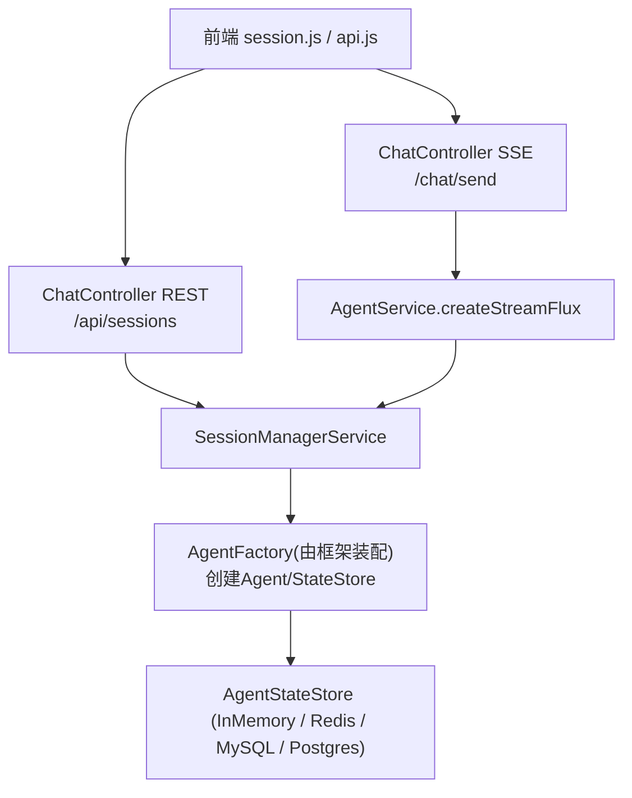
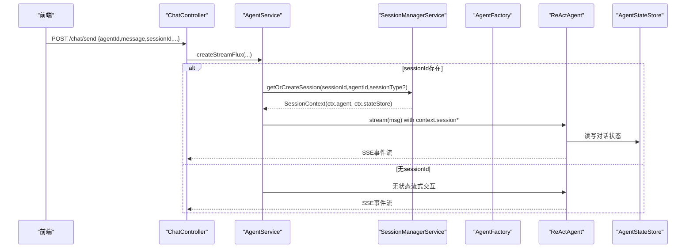
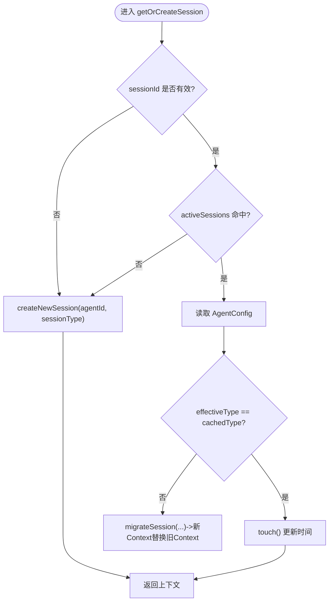
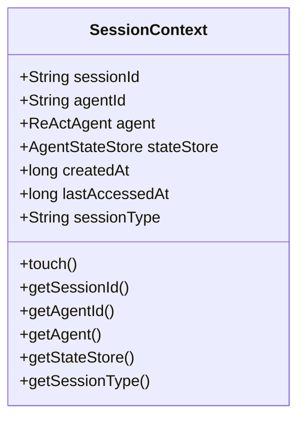
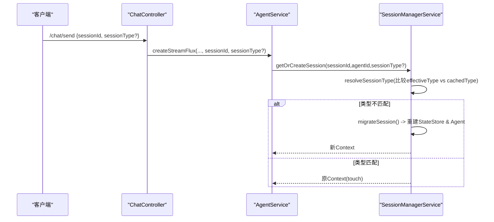
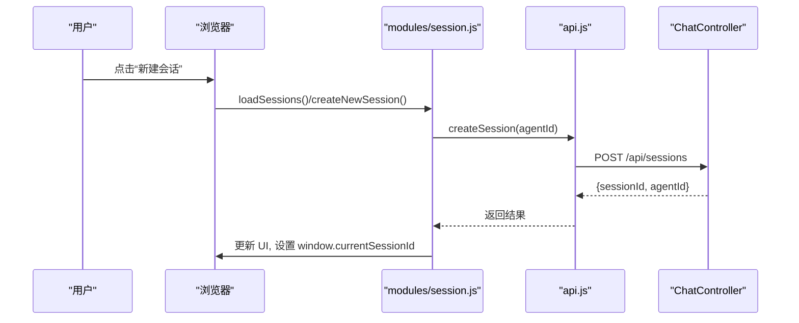
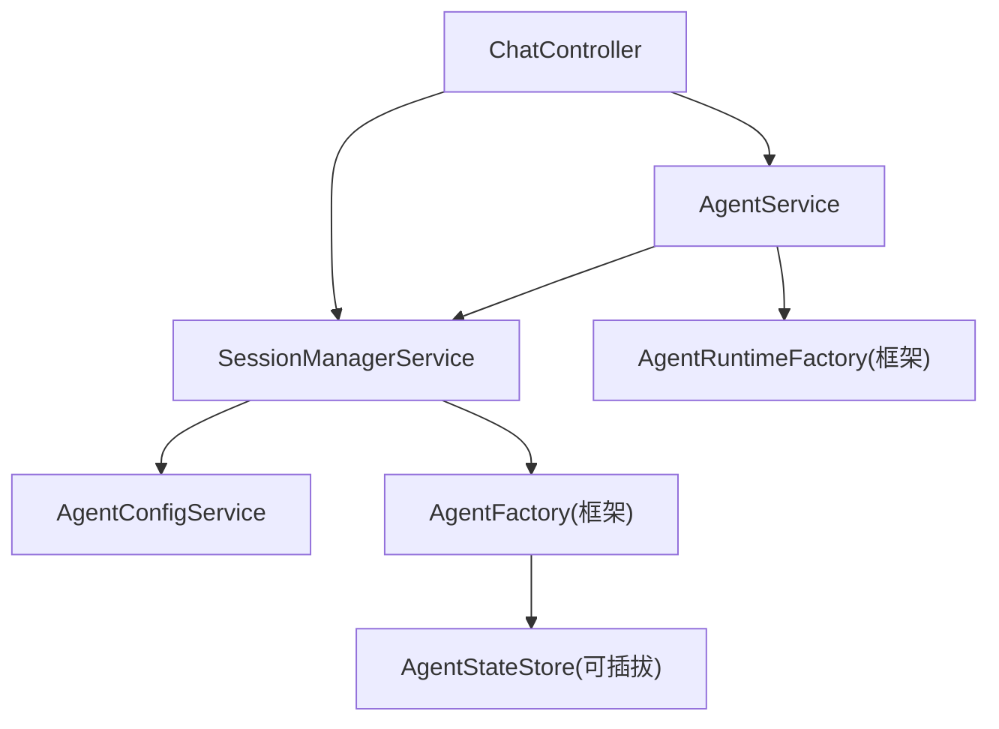

# 会话管理

<cite>
**本文引用的文件列表**
- [SessionManagerService.java](file://src/main/java/com/skloda/agentscope/service/SessionManagerService.java)
- [AgentConfig.java](file://src/main/java/com/skloda/agentscope/agent/AgentConfig.java)
- [AgentService.java](file://src/main/java/com/skloda/agentscope/service/AgentService.java)
- [ChatController.java](file://src/main/java/com/skloda/agentscope/controller/ChatController.java)
- [DistributedStateStoreConfig.java](file://src/main/java/com/skloda/agentscope/config/DistributedStateStoreConfig.java)
- [session.js](file://src/main/resources/static/scripts/modules/session.js)
- [api.js](file://src/main/resources/static/scripts/api.js)
- [chat.js](file://src/main/resources/static/scripts/chat.js)
- [application.yml](file://src/main/resources/application.yml)
</cite>

## 目录
1. [简介](#简介)
2. [项目结构（会话相关）](#项目结构会话相关)
3. [核心组件](#核心组件)
4. [架构总览](#架构总览)
5. [详细组件分析](#详细组件分析)
6. [依赖关系分析](#依赖关系分析)
7. [性能考虑](#性能考虑)
8. [故障排查指南](#故障排查指南)
9. [结论](#结论)
10. [附录](#附录)

## 简介
本文围绕 AgentScope Demo 项目的“会话管理”能力进行系统性技术文档化，重点包括：
- SessionManagerService 的会话生命周期管理：创建、获取、更新与删除。
- SessionContext 内部类的设计与关键属性职责。
- 会话状态存储机制（内存持久化 + 可扩展的分布式方案）。
- 会话迁移机制：当 Agent 配置的会话类型变化时的自动迁移逻辑。
- 会话超时管理与访问时间维护。
- 前端会话管理的 JavaScript 实现、会话 ID 的生成与传递机制。
- 最佳实践：会话复用策略与资源清理建议。

## 项目结构（会话相关）
- 后端服务层
  - Service: SessionManagerService 负责会话的生命周期与上下文管理。
  - Service: AgentService 在请求处理时根据是否携带 sessionId 决定走无状态流还是有状态流。
  - Controller: ChatController 暴露 /api/sessions 等 REST API，并对 /chat/send SSE 入口做会话路由。
  - Config: DistributedStateStoreConfig 提供按 Profile 切换的分布式 AgentStateStore。
  - Model/Agent 配置: AgentConfig.SessionConfig 描述默认会话类型与存储路径。
- 前端脚本
  - modules/session.js 负责加载/新建/选择/删除/清空会话 UI 逻辑。
  - api.js 封装对后端的会话 API 调用。
  - chat.js 在主聊天流程中拼装并传递 sessionId 到服务端。



图表来源
- [SessionManagerService.java:23-197](file://src/main/java/com/skloda/agentscope/service/SessionManagerService.java#L23-L197)
- [AgentService.java:131-177](file://src/main/java/com/skloda/agentscope/service/AgentService.java#L131-L177)
- [ChatController.java:122-152](file://src/main/java/com/skloda/agentscope/controller/ChatController.java#L122-L152)
- [ChatController.java:215-258](file://src/main/java/com/skloda/agentscope/controller/ChatController.java#L215-L258)
- [DistributedStateStoreConfig.java:43-118](file://src/main/java/com/skloda/agentscope/config/DistributedStateStoreConfig.java#L43-L118)

章节来源
- [SessionManagerService.java:23-197](file://src/main/java/com/skloda/agentscope/service/SessionManagerService.java#L23-L197)
- [ChatController.java:122-152](file://src/main/java/com/skloda/agentscope/controller/ChatController.java#L122-L152)
- [ChatController.java:215-258](file://src/main/java/com/skloda/agentscope/controller/ChatController.java#L215-L258)
- [AgentService.java:131-177](file://src/main/java/com/skloda/agentscope/service/AgentService.java#L131-L177)
- [DistributedStateStoreConfig.java:43-118](file://src/main/java/com/skloda/agentscope/config/DistributedStateStoreConfig.java#L43-L118)

## 核心组件
- SessionManagerService：进程内会话管理器，维护 activeSessions 缓存与会话上下文。
- SessionContext：会话上下文，持有sessionId、agentId、ReActAgent、AgentStateStore、会话类型及时间戳等元数据。
- AgentService：将用户消息封装为 Msg，并根据是否携带 sessionId 决定是否使用会话缓存 Agent。
- ChatController：对外提供会话 REST 接口和聊天 SSE 流式接口。
- AgentConfig.SessionConfig：定义会话默认类型与可选存储路径。
- DistributedStateStoreConfig：基于 Spring Profile 提供可插拔的状态存储后端（Redis/MySQL/PostgreSQL），用于 AgentStateStore。

章节来源
- [SessionManagerService.java:23-197](file://src/main/java/com/skloda/agentscope/service/SessionManagerService.java#L23-L197)
- [AgentConfig.java:110-113](file://src/main/java/com/skloda/agentscope/agent/AgentConfig.java#L110-L113)
- [AgentService.java:131-177](file://src/main/java/com/skloda/agentscope/service/AgentService.java#L131-L177)
- [DistributedStateStoreConfig.java:43-118](file://src/main/java/com/skloda/agentscope/config/DistributedStateStoreConfig.java#L43-L118)

## 架构总览
会话请求整体流程如下：
- 前端在聊天界面维护当前 sessionId；发送消息时将 sessionId 附加到 /chat/send 请求体。
- ChatController.sendMessage 调用 AgentService.createStreamFlux，传入 agentId、message、可选的多模态输入、sessionId 与 sessionType。
- AgentService 若检测到 sessionId 非空，则调用 SessionManagerService.getOrCreateSession 取得或创建会话上下文；随后用对应 Agent 运行流式事件。
- SessionManagerService 通过 AgentFactory 创建 AgentStateStore（可为 InMemory/Redis/MySQL/PostgreSQL）并创建 ReActAgent。
- 当 Agent 配置的会话类型发生变化时，SessionManagerService 会触发会话迁移，重建 Agent 与 StateStore，替换到同名 sessionId 的上下文。



图表来源
- [ChatController.java:122-152](file://src/main/java/com/skloda/agentscope/controller/ChatController.java#L122-L152)
- [AgentService.java:131-177](file://src/main/java/com/skloda/agentscope/service/AgentService.java#L131-L177)
- [SessionManagerService.java:75-145](file://src/main/java/com/skloda/agentscope/service/SessionManagerService.java#L75-L145)

章节来源
- [ChatController.java:122-152](file://src/main/java/com/skloda/agentscope/controller/ChatController.java#L122-L152)
- [AgentService.java:131-177](file://src/main/java/com/skloda/agentscope/service/AgentService.java#L131-L177)
- [SessionManagerService.java:75-145](file://src/main/java/com/skloda/agentscope/service/SessionManagerService.java#L75-L145)

## 详细组件分析

### SessionManagerService：会话生命周期
- 会话创建
  - 直接创建：createNewSession(agentId, sessionType) 生成短 sessionId，并通过 AgentFactory 创建新的 StateStore 与 Agent，放入 activeSessions。
  - 按 Agent 创建：getOrCreateSessionForAgent(agentId) 查找已存在的该 Agent 的唯一会话，不存在则新建。
- 会话获取与复用
  - getOrCreateSession(sessionId, agentId, sessionType) 会先查缓存命中，命中则读取 AgentConfig 对比会话类型，如不一致则迁移；一致则 touch() 更新时间并返回。
- 会话更新
  - saveSession(sessionId) 仅做一次 touch()（目前主要用于标记最近访问；如需落盘可扩展）。
  - 列表查询 listSessions 会按 lastAccessedAt 倒序展示。
- 会话删除
  - deleteSession(sessionId) 移除 activeSessions 条目；同时 Controller 层还会清理聊天记录（见下文控制器端）。



图表来源
- [SessionManagerService.java:75-145](file://src/main/java/com/skloda/agentscope/service/SessionManagerService.java#L75-L145)

章节来源
- [SessionManagerService.java:23-197](file://src/main/java/com/skloda/agentscope/service/SessionManagerService.java#L23-L197)

### SessionContext：内部类设计
- sessionId：唯一标识一个会话。
- agentId：所属 Agent 的标识。
- agent：具体的 ReActAgent 实例。
- stateStore：AgentStateStore，负责会话状态的存取。
- sessionType：会话存储类型（例如 memory/redis/mysql/postgresql 等），用于控制底层 StateStore 行为。
- createdAt/lastAccessedAt：记录创建时间与最近访问时间，用于排序与潜在的清理策略。
- touch()：每次访问时更新时间戳，便于后续进行活跃检测与清理。



图表来源
- [SessionManagerService.java:45-73](file://src/main/java/com/skloda/agentscope/service/SessionManagerService.java#L45-L73)

章节来源
- [SessionManagerService.java:45-73](file://src/main/java/com/skloda/agentscope/service/SessionManagerService.java#L45-L73)

### 会话状态存储机制
- 内存存储
  - 默认通过 AgentFactory.createStateStore("memory", storagePath) 得到内存型存储；SessionManagerService 构造函数明确以日志标注“内存模式”，storagePath 在此模式下忽略。
  - SessionContext 持有的 AgentStateStore 即用于会话状态的读/写（由 AgentScope 框架内部完成）。
- 可扩展的分布式方案
  - 通过 DistributedStateStoreConfig 在激活 redis/mysql/postgresql Profile 时提供分布式 AgentStateStore Bean。
  - SessionManagerService 创建 StateStore 时会结合 AgentConfig.SessionConfig.storagePath 与 effectiveType 交给 AgentFactory 构造合适的存储后端（实际构建由工厂负责）。
  - 这使得同一段会话可以在多实例场景下共享持久化状态。

```mermaid
graph LR
  Cfg["AgentConfig.SessionConfig"] --> Type["defaultType/storagePath"]
  Mode["Spring Profile"] --> DS["DistributedStateStoreConfig"]
  SM["SessionManagerService"] -->|createStateStore(effectiveType, path)| AF["AgentFactory"]
  AF --> Store["AgentStateStore (InMemory/Redis/MySQL/Postgres)"]
```

图表来源
- [DistributedStateStoreConfig.java:43-118](file://src/main/java/com/skloda/agentscope/config/DistributedStateStoreConfig.java#L43-L118)
- [SessionManagerService.java:135-145](file://src/main/java/com/skloda/agentscope/service/SessionManagerService.java#L135-L145)
- [AgentConfig.java:110-113](file://src/main/java/com/skloda/agentscope/agent/AgentConfig.java#L110-L113)

章节来源
- [DistributedStateStoreConfig.java:43-118](file://src/main/java/com/skloda/agentscope/config/DistributedStateStoreConfig.java#L43-L118)
- [SessionManagerService.java:135-145](file://src/main/java/com/skloda/agentscope/service/SessionManagerService.java#L135-L145)
- [AgentConfig.java:110-113](file://src/main/java/com/skloda/agentscope/agent/AgentConfig.java#L110-L113)

### 会话迁移机制
- 触发条件：当从 Client 传入了显式的 sessionType，或根据 AgentConfig 解析得到的 effectiveType 与当前缓存中的 sessionType 不同。
- 行为：构造新 StateStore，创建新的 ReActAgent 与 SessionContext，并以同一 sessionId 覆盖旧上下文，保证前端无需变更 sessionId。
- 日志：迁移过程中会输出迁移日志以便追踪。



图表来源
- [SessionManagerService.java:75-109](file://src/main/java/com/skloda/agentscope/service/SessionManagerService.java#L75-L109)

章节来源
- [SessionManagerService.java:75-109](file://src/main/java/com/skloda/agentscope/service/SessionManagerService.java#L75-L109)

### 超时管理与访问时间维护
- 访问时间
  - 每次命中缓存或获取会话都会调用 touch() 刷新 lastAccessedAt。
  - 列表展示按 lastAccessedAt 降序排列。
- 超时清理
  - 当前实现未在 Service 层提供基于时间的自动清理逻辑。
  - 可在未来扩展定时任务依据 lastAccessedAt 淘汰过期会话，并结合持久化策略定期落盘以避免内存膨胀。

章节来源
- [SessionManagerService.java:164-183](file://src/main/java/com/skloda/agentscope/service/SessionManagerService.java#L164-L183)

### 前端会话管理（JavaScript）
- 会话列表加载：loadSessions 调用 fetchSessions API，渲染会话项，支持点击切换、删除。
- 创建会话：createNewSession 调用 POST /api/sessions，成功后设置 window.currentSessionId。
- 切换会话：selectSession 设置当前会话并可能动态切换 Agent。
- 删除会话：deleteSession 先中止可能的流式传输（AbortController），然后调用 DELETE /api/sessions/{sessionId}，最后清空 UI。
- 清空会话：clearSession 兼容流式中断后的状态复位，并清理上传/调试等信息。
- 会话 ID 的传递
  - chat.js 在发送消息时会将 currentSessionId、sessionType 等一并提交至 /chat/send。
  - api.js 封装了 fetchSessions/createSession/deleteSession 等基础会话 API。



图表来源
- [session.js:6-97](file://src/main/resources/static/scripts/modules/session.js#L6-L97)
- [api.js:59-75](file://src/main/resources/static/scripts/api.js#L59-L75)
- [ChatController.java:227-244](file://src/main/java/com/skloda/agentscope/controller/ChatController.java#L227-L244)

章节来源
- [session.js:6-97](file://src/main/resources/static/scripts/modules/session.js#L6-L97)
- [api.js:59-75](file://src/main/resources/static/scripts/api.js#L59-L75)
- [chat.js:81-99](file://src/main/resources/static/scripts/chat.js#L81-L99)

## 依赖关系分析
- ChatController 依赖 SessionManagerService 提供会话 CRUD；依赖 AgentService 提供有/无状态的消息流式响应。
- AgentService 依赖 AgentRuntimeFactory（由框架装配）与 SessionManagerService；在带有 sessionId 的情况下委托 SessionManagerService 获取上下文，从而复用 Agent 与 StateStore。
- SessionManagerService 依赖 AgentConfigService 解析会话类型与存储路径；通过 AgentFactory 创建 StateStore 与 Agent（由框架装配）。
- DistributedStateStoreConfig 提供可插拔的分布式存储后端，供 AgentStateStore 使用，使得会话状态能够在多实例间共享。



图表来源
- [ChatController.java:122-152](file://src/main/java/com/skloda/agentscope/controller/ChatController.java#L122-L152)
- [AgentService.java:131-177](file://src/main/java/com/skloda/agentscope/service/AgentService.java#L131-L177)
- [SessionManagerService.java:29-43](file://src/main/java/com/skloda/agentscope/service/SessionManagerService.java#L29-L43)
- [DistributedStateStoreConfig.java:43-118](file://src/main/java/com/skloda/agentscope/config/DistributedStateStoreConfig.java#L43-L118)

章节来源
- [ChatController.java:122-152](file://src/main/java/com/skloda/agentscope/controller/ChatController.java#L122-L152)
- [AgentService.java:131-177](file://src/main/java/com/skloda/agentscope/service/AgentService.java#L131-L177)
- [SessionManagerService.java:29-43](file://src/main/java/com/skloda/agentscope/service/SessionManagerService.java#L29-L43)
- [DistributedStateStoreConfig.java:43-118](file://src/main/java/com/skloda/agentscope/config/DistributedStateStoreConfig.java#L43-L118)

## 性能考虑
- 会话缓存：activeSessions 使用并发安全容器，避免热点冲突；但进程重启后会丢失，生产应启用分布式 StateStore。
- 状态存储：优先选择低延迟高吞吐的后端（如 Redis）以降低跨实例会话切换成本。
- 流式响应：SSE 长连接天然适合会话状态复用；注意前端 AbortController 的正确使用，避免资源泄漏。
- 超时清理：建议在 Service 层增加定时清理逻辑，避免内存占用无限增长。
- 序列化开销：SSE payload 尽量精简，仅在必要时回传完整消息树。

[本节为通用指导，不涉及具体文件]

## 故障排查指南
- 前端提示“无法创建会话”
  - 检查 /api/sessions 返回码与错误体；确认 agentId 是否正确。
- 会话无法切换
  - 确认 selectSession 正确设置了 window.currentSessionId；查看控制台是否抛出异常。
- 发送消息无会话上下文
  - 检查 chat.js 是否在 payload 中包含 sessionId；后端 AgentService 分支是否进入有状态路径。
- 状态未持久化或跨实例不共享
  - 检查是否启用了分布式 Profile（redis/mysql/postgresql）；核对 DistributedStateStoreConfig 是否生效。
- 会话类型变更后失效
  - 确认 AgentConfig.SessionConfig.defaultType 是否与预期一致；观察迁移日志确认是否重建成功。

章节来源
- [ChatController.java:215-258](file://src/main/java/com/skloda/agentscope/controller/ChatController.java#L215-L258)
- [ChatController.java:122-152](file://src/main/java/com/skloda/agentscope/controller/ChatController.java#L122-L152)
- [DistributedStateStoreConfig.java:43-118](file://src/main/java/com/skloda/agentscope/config/DistributedStateStoreConfig.java#L43-L118)
- [SessionManagerService.java:75-109](file://src/main/java/com/skloda/agentscope/service/SessionManagerService.java#L75-L109)

## 结论
本项目的会话管理以 SessionManagerService 为核心，配合 AgentService 与 ChatController，实现了会话创建、获取、更新、删除全生命周期管理，并通过 AgentConfig 与 DistributedStateStoreConfig 支持灵活的状态存储与迁移策略。前端通过模块化 JS 管理会话 UI 并与后端清晰解耦。生产环境建议使用分布式状态存储与完善的超时清理策略，以获得更高的可用性、可扩展性与资源利用率。

[本节为总结性内容，不涉及具体文件]

## 附录
- REST API 速览
  - GET /api/sessions：列出会话
  - POST /api/sessions：创建会话（body: {agentId}）
  - DELETE /api/sessions/{sessionId}：删除会话
  - POST /chat/send：发送消息并返回 SSE 流式事件（body 含 sessionId）

- 应用配置
  - application.yml 中 agentscope.session.enabled/storage-path 控制会话开关与存储路径（默认内存模式）。

章节来源
- [ChatController.java:215-258](file://src/main/java/com/skloda/agentscope/controller/ChatController.java#L215-L258)
- [application.yml:56-60](file://src/main/resources/application.yml#L56-L60)