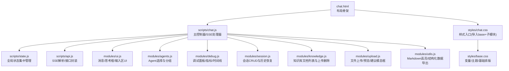
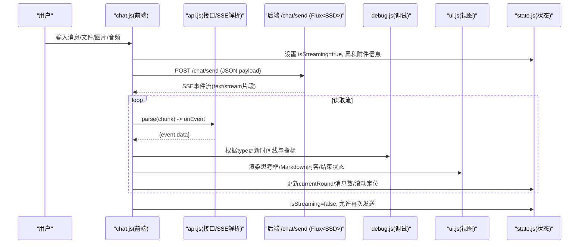
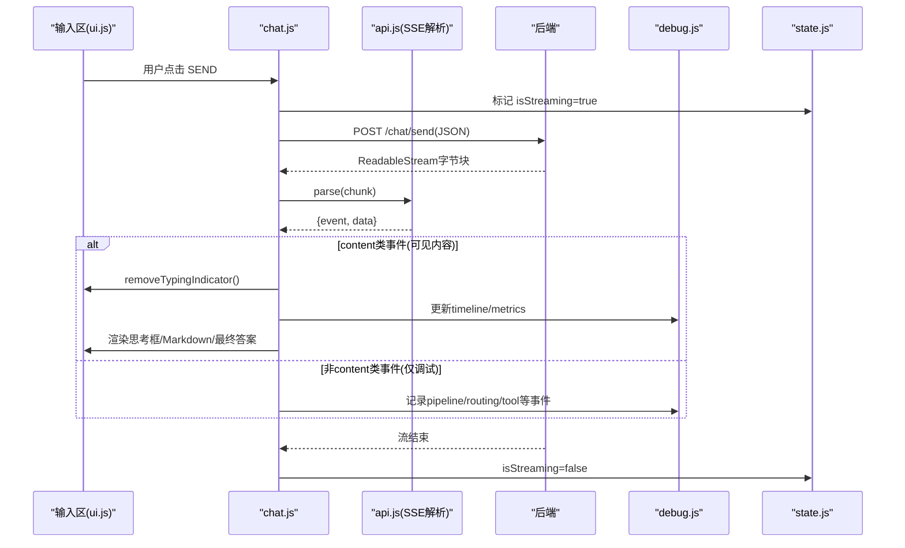
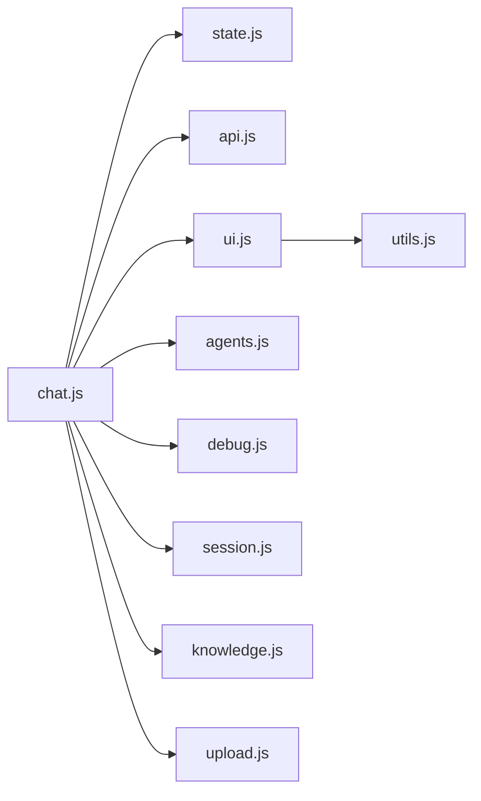

# 前端界面

<cite>
**本文引用的文件**
- [chat.html](file://src/main/resources/templates/chat.html)
- [chat.js](file://src/main/resources/static/scripts/chat.js)
- [state.js](file://src/main/resources/static/scripts/state.js)
- [api.js](file://src/main/resources/static/scripts/api.js)
- [ui.js](file://src/main/resources/static/scripts/modules/ui.js)
- [agents.js](file://src/main/resources/static/scripts/modules/agents.js)
- [debug.js](file://src/main/resources/static/scripts/modules/debug.js)
- [session.js](file://src/main/resources/static/scripts/modules/session.js)
- [knowledge.js](file://src/main/resources/static/scripts/modules/knowledge.js)
- [upload.js](file://src/main/resources/static/scripts/modules/upload.js)
- [utils.js](file://src/main/resources/static/scripts/modules/utils.js)
- [chat.css](file://src/main/resources/static/styles/chat.css)
- [base.css](file://src/main/resources/static/styles/base.css)
- [AGENTS.md](file://AGENTS.md)
</cite>

## 目录
1. [简介](#简介)
2. [项目结构](#项目结构)
3. [核心组件](#核心组件)
4. [架构总览](#架构总览)
5. [详细组件分析](#详细组件分析)
6. [依赖关系分析](#依赖关系分析)
7. [性能与实时性](#性能与实时性)
8. [响应式设计与可访问性](#响应式设计与可访问性)
9. [排错与问题诊断](#排错与问题诊断)
10. [定制化与扩展指南](#定制化与扩展指南)
11. [结论](#结论)

## 简介
本项目的前端基于原生 JavaScript（ES6 模块）和 CSS，以模块化方式组织代码，采用事件驱动与流式渲染的交互模式。整体遵循“轻量、无构建”的目标：通过 Spring Boot 静态资源托管页面与脚本，利用后端返回的 Server-Sent Events（SSE）完成多智能体流程的实时更新与展示。

本技术文档聚焦前端架构设计、状态管理、响应式适配以及各模块职责分工；同时给出完整的消息发送/接收/渲染/交互流程图，并解释前端与后端的通信机制与可扩展点，帮助维护者与扩展者高效定位修改点。

## 项目结构
前端工程位于 resources 下，由 HTML 模板承载布局，JS/CSS 按模块拆分，便于协作与维护。

图表来源
- [chat.html:1-95](file://src/main/resources/templates/chat.html#L1-L95)
- [chat.js:1-9](file://src/main/resources/static/scripts/chat.js#L1-L9)
- [state.js:1-24](file://src/main/resources/static/scripts/state.js#L1-L24)
- [api.js:1-124](file://src/main/resources/static/scripts/api.js#L1-L124)
- [ui.js:1-180](file://src/main/resources/static/scripts/modules/ui.js#L1-L180)
- [agents.js:1-199](file://src/main/resources/static/scripts/modules/agents.js#L1-L199)
- [debug.js:1-200](file://src/main/resources/static/scripts/modules/debug.js#L1-L200)
- [session.js:1-169](file://src/main/resources/static/scripts/modules/session.js#L1-L169)
- [knowledge.js:1-60](file://src/main/resources/static/scripts/modules/knowledge.js#L1-L60)
- [upload.js:1-200](file://src/main/resources/static/scripts/modules/upload.js#L1-L200)
- [utils.js:1-200](file://src/main/resources/static/scripts/modules/utils.js#L1-L200)
- [chat.css:1-12](file://src/main/resources/static/styles/chat.css#L1-L12)
- [base.css:1-143](file://src/main/resources/static/styles/base.css#L1-L143)

章节来源
- [chat.html:1-95](file://src/main/resources/templates/chat.html#L1-L95)
- [chat.css:1-12](file://src/main/resources/static/styles/chat.css#L1-L12)
- [base.css:1-143](file://src/main/resources/static/styles/base.css#L1-L143)

## 核心组件
- chat.js：主控制器。负责输入事件绑定、消息构造、发起 /chat/send 请求、读取 ReadableStream 并分派到不同事件处理分支，协调 UI、调试与状态。
- state.js：单一状态源。提供全局读写代理，保持 agent、stream、消息计数、媒体附件、轮次等状态的一致性。
- api.js：API 与 SSE 解析。实现 SSE 行级解析器与统一接口封装（上传、会话、Agent 列表、技能/工具信息等）。
- ui.js：通用 UI 组件。负责消息气泡、头像、Markdown 渲染、输入框自适应高度、思考框创建/更新/折叠等。
- agents.js：Agent 选择与分组。拉取 Agent 列表、按类别分组渲染、选择切换时的清理与重置策略。
- debug.js：调试面板。管理 round、时间线节点、运行时长、Token 统计、阶段耗时汇总等观测数据。
- session.js：会话管理。加载会话列表、新建/选择/删除会话、历史消息回填、清空时安全中断 streaming。
- knowledge.js：知识库管理。列示/上传/删除本地文档，供 RAG 能力使用。
- upload.js：媒体上传。支持文档/图片/音频类型识别与智能提示切换对应能力的 Agent，提供预览与模态对话框。
- utils.js：工具函数。Markdown 渲染增强（highlight.js）、结构化 JSON 表格化与导出、HTML 转义等。

章节来源
- [chat.js:24-178](file://src/main/resources/static/scripts/chat.js#L24-L178)
- [state.js:1-165](file://src/main/resources/static/scripts/state.js#L1-L165)
- [api.js:1-124](file://src/main/resources/static/scripts/api.js#L1-L124)
- [ui.js:14-181](file://src/main/resources/static/scripts/modules/ui.js#L14-L181)
- [agents.js:17-199](file://src/main/resources/static/scripts/modules/agents.js#L17-L199)
- [debug.js:5-200](file://src/main/resources/static/scripts/modules/debug.js#L5-L200)
- [session.js:6-169](file://src/main/resources/static/scripts/modules/session.js#L6-L169)
- [knowledge.js:5-60](file://src/main/resources/static/scripts/modules/knowledge.js#L5-L60)
- [upload.js:22-200](file://src/main/resources/static/scripts/modules/upload.js#L22-L200)
- [utils.js:1-200](file://src/main/resources/static/scripts/modules/utils.js#L1-L200)

## 架构总览
前后端通信采用单端点 SSE：前端 POST /chat/send，后端以 Reactor Flux<ServerSentEvent> 将事件逐条推送。前端使用 ReadableStream + 自研 parse(SSE 文本) 进行分片解析，依据事件 type 分发到不同的 UI/调试逻辑。

图表来源
- [chat.js:78-178](file://src/main/resources/static/scripts/chat.js#L78-L178)
- [api.js:2-25](file://src/main/resources/static/scripts/api.js#L2-L25)
- [debug.js:5-200](file://src/main/resources/static/scripts/modules/debug.js#L5-L200)
- [ui.js:14-181](file://src/main/resources/static/scripts/modules/ui.js#L14-L181)
- [state.js:1-165](file://src/main/resources/static/scripts/state.js#L1-L165)

## 详细组件分析

### chat.js：主控制器与事件分支
- 职责：监听输入与发送按钮、组装消息负载、开启流式读取、按事件 type 分发到相应处理逻辑、控制 UI 状态和调试面板。
- 关键流程：
  - 输入自适应高度与发送按键拦截
  - 媒体附件拼装（文档/图片/音频）与清理
  - 建立 AbortController 以便取消或切换 Agent
  - 构造 /chat/send 请求并读取 ReadableStream
  - SSE 解析并触发分支：thinking/reasoning_text/text/tool_start/done/error/pending_approval 等，并在首个可见内容出现时清除“正在输入”指示器
  - 启动/结束一轮对话 round 的生命周期，记录开始/结束与错误路径

章节来源
- [chat.js:11-23](file://src/main/resources/static/scripts/chat.js#L11-L23)
- [chat.js:24-178](file://src/main/resources/static/scripts/chat.js#L24-L178)

#### 主控制器时序图

图表来源
- [chat.js:78-178](file://src/main/resources/static/scripts/chat.js#L78-L178)
- [api.js:2-25](file://src/main/resources/static/scripts/api.js#L2-L25)

### state.js：UI 状态管理
- 职责：集中管理当前 Agent、流式传输标志、当前轮次、消息计数、上传媒体、会话 ID、权限/执行模式等。提供 getter/setter 确保跨模块一致性。
- 关键点：
  - 用 window 属性代理同步状态变化，避免重复赋值导致失步
  - 对 rounds/currentRound/roundNumber 提供 per-round 的调试上下文
  - 维护当前 thinking box 与文件信息指针

章节来源
- [state.js:1-165](file://src/main/resources/static/scripts/state.js#L1-L165)

### api.js：SSE 解析与 API 封装
- 职责：实现行级 SSE 解析器，封装 /chat/send、上传、Agent 列表、会话管理、知识文档、技能/工具信息等接口调用。
- 关键点：
  - 解析器按 data:/event:/空行分割事件块
  - 上传返回 fileId/fileName/filePath，被 ui.js 用于渲染图片/音频
  - 统一错误处理与结果反序列化为对象

章节来源
- [api.js:1-124](file://src/main/resources/static/scripts/api.js#L1-L124)

### ui.js：通用 UI 与消息渲染
- 职责：生成消息气泡、头像、时间戳、Markdown 渲染、思考框（创建/更新/折叠）、滚动到底部、显示/隐藏空态等。
- 关键点：
  - 针对用户/Agent 消息渲染差异，处理媒体附件显示（图片网格、音频控件、文件标签）
  - 支持历史消息回放的 thinkingContent 展示
  - Thinking box 在首个 visible content 时才收起并替换为完整答案

章节来源
- [ui.js:14-181](file://src/main/resources/static/scripts/modules/ui.js#L14-L181)

### agents.js：Agent 列表、分类与切换
- 职责：拉取 Agent 列表，按 category 分组展示；切换 Agent 时清理流式状态与调试信息、重置消息区、显示 Harness 控制项（模式与用户选择）、按需渲染权限/会话类型选择器。
- 关键点：
  - 对处于流式中的切换做中止与复位，保证稳定性
  - 根据 agent 配置动态决定是否暴露 Builder/Claw 模式切换和用户选择器

章节来源
- [agents.js:17-199](file://src/main/resources/static/scripts/modules/agents.js#L17-L199)

### debug.js：调试面板与观测指标
- 职责：围绕每轮（round）创建卡片、时间线条目、指标（tokens、LLM 耗时、工具调用次数等），并维护运行中状态到完成状态的转换。
- 关键点：
  - startRound/endRound/completeRoundTrace 组合形成闭环
  - addTimelineRow/addTimelineRowForRound 支持多种事件类型的可视化
  - 实时更新 summary 与 collapsed details

章节来源
- [debug.js:5-200](file://src/main/resources/static/scripts/modules/debug.js#L5-L200)

### session.js：会话管理与历史恢复
- 职责：获取会话列表、新建/选择/删除会话、从服务端回溯历史消息并渲染至聊天区；清空与会话删除时对 streaming 安全的中止与复位。
- 关键点：
  - 删除会话前若 streaming 则先 abort 并关闭按钮禁用态
  - loadAgentMessages 使用 appendMessage 回放历史内容，含思考内容

章节来源
- [session.js:6-169](file://src/main/resources/static/scripts/modules/session.js#L6-L169)

### knowledge.js：知识库文档
- 职责：列出知识库文档、支持上传与删除，供 Agent 检索增强。
- 关键点：
  - 上传成功后刷新列表；删除接口失败不影响列表刷新尝试

章节来源
- [knowledge.js:5-60](file://src/main/resources/static/scripts/modules/knowledge.js#L5-L60)

### upload.js：媒体上传与智能提示
- 职责：监听文件选择，校验类型（文档/图片/音频），调用上传接口，显示文件/图片/音频标签与预览；根据当前 Agent 能力缺失提示切换建议的 Agent。
- 关键点：
  - 类型检测与推荐弹窗（模态框）改善交互体验
  - 图片/音频上传后推入状态数组并更新预览区域

章节来源
- [upload.js:22-200](file://src/main/resources/static/scripts/modules/upload.js#L22-L200)

### utils.js：Markdown 与结构化数据
- 职责：启用 markdown/gfm，集成 highlight.js 代码高亮；自动探测 JSON 并以表格形式展示，提供导出 JSON 功能。
- 关键点：
  - 结构化数据导出为 Blob 下载
  - 值类型格式化（null、对象、数字、布尔）优化可读性

章节来源
- [utils.js:1-200](file://src/main/resources/static/scripts/modules/utils.js#L1-L200)

## 依赖关系分析
- 模块耦合度低，职责清晰：
  - chat.js 作为编排层依赖其他所有模块
  - state.js 提供单向状态中心，其他模块读/写均通过它
  - api.js 仅关注网络与解析，不涉及 DOM
  - 各 UI 模块（ui.js、agents.js、debug.js、session.js、knowledge.js、upload.js）各自管理对应区域的渲染与交互
- 外部依赖：marked.min.js 与 highlight.min.js 通过 vendor 引入，用于 Markdown 与代码高亮

图表来源
- [chat.js:1-9](file://src/main/resources/static/scripts/chat.js#L1-L9)
- [state.js:1-165](file://src/main/resources/static/scripts/state.js#L1-L165)
- [api.js:1-124](file://src/main/resources/static/scripts/api.js#L1-L124)
- [ui.js:1-180](file://src/main/resources/static/scripts/modules/ui.js#L1-L180)
- [agents.js:1-199](file://src/main/resources/static/scripts/modules/agents.js#L1-L199)
- [debug.js:1-200](file://src/main/resources/static/scripts/modules/debug.js#L1-L200)
- [session.js:1-169](file://src/main/resources/static/scripts/modules/session.js#L1-L169)
- [knowledge.js:1-60](file://src/main/resources/static/scripts/modules/knowledge.js#L1-L60)
- [upload.js:1-200](file://src/main/resources/static/scripts/modules/upload.js#L1-L200)
- [utils.js:1-200](file://src/main/resources/static/scripts/modules/utils.js#L1-L200)

章节来源
- [chat.js:1-9](file://src/main/resources/static/scripts/chat.js#L1-L9)
- [state.js:1-165](file://src/main/resources/static/scripts/state.js#L1-L165)
- [api.js:1-124](file://src/main/resources/static/scripts/api.js#L1-L124)

## 性能与实时性
- 首包与可视反馈：typing indicator 仅在接收到能渲染到聊天区的可见事件（thinking/reasoning_text/text/tool_start/done/error/pending_approval）时移除，避免“空白真空期”，提升感知速度。
- 流式处理：使用 ReadableStream 按块解析 SSE，减少内存缓冲压力；通过自实现解析器兼容浏览器原生流。
- 交互打断：Agent 切换或会话操作会主动 abort 当前请求并重置状态，避免并发冲突与僵尸流。
- DOM 更新：思考框增量更新，仅过滤空行与片段标识符，减少重绘；滚动始终置底以保证流畅。
- 渲染优化：Markdown 使用 gfm；代码高亮选择性启用；结构化数据导出以 Blob 进行，避免额外请求。

[本节为通用指导，不直接分析具体文件]

## 响应式设计与可访问性
- 布局与栅格：应用主体为 flex 列布局，顶部 header、左右侧边栏与中央聊天区自适应填充剩余空间。
- 主题变量：通过 CSS 自定义属性统一管理颜色、间距、字体等，易于切换风格。
- 滚动与可视性：滚动条渐变高光、内容区最小高度约束、输入区最小高度与最大高度自适应。
- 移动端优化：可通过媒体查询在 chat.css 中添加断点适配小屏布局（例如隐藏调试面板或缩小字号）。当前基础样式已为响应式奠定容器基础。

章节来源
- [chat.css:14-200](file://src/main/resources/static/styles/chat.css#L14-L200)
- [base.css:8-75](file://src/main/resources/static/styles/base.css#L8-L75)
- [chat.html:17-90](file://src/main/resources/templates/chat.html#L17-L90)

## 排错与问题诊断
- 常见问题定位：
  - 请求失败：chat.js 收到 non-ok 响应会移除 typing indicator、追加错误消息并结束 round。
  - 解析失败：SSE 解析异常会在控制台输出错误日志。
  - 流结束异常：stream 结束时 ensure 正常结束 round，避免死状态。
- 调试建议：
  - 打开调试面板查看 round 时间线与指标，确认 pipeline/routing/tool 事件链路是否连贯
  - 使用浏览器开发者工具的 Network 面板观察 /chat/send 的 SSE 响应流
  - 检查 state.js 的当前 Agent/会话/流状态是否与预期一致
- 日志位置：
  - 前端 console 大量日志，包括 SSE 事件接收、上传过程、Agent 选择、会话操作等

章节来源
- [chat.js:113-178](file://src/main/resources/static/scripts/chat.js#L113-L178)
- [api.js:1-25](file://src/main/resources/static/scripts/api.js#L1-L25)
- [debug.js:63-200](file://src/main/resources/static/scripts/modules/debug.js#L63-L200)
- [session.js:72-147](file://src/main/resources/static/scripts/modules/session.js#L72-L147)

## 定制化与扩展指南
- 主题样式修改：
  - 修改 base.css 中的 CSS 变量即可一键切换配色与阴影；如需新断点或组件样式，可在 chat.css 对应的 modules/ 子模块中添加规则。
- 新增功能模块：
  - 在 static/scripts/modules 下新增独立模块（如 analytics.js），在 chat.js 顶部 import 并通过现有事件通道接入；或通过 api.js 新增接口方法。
- 第三方库集成：
  - 在 vendor 目录添加 JS/CSS，并在 chat.html 中引入；必要时在 utils.js 初始化配置（如 marked/highlight 的配置）。
- 事件扩展：
  - chat.js 中的 switch/case 用于分支分发；新增后端事件类型时，需在此处添加分支并对接 UI/调试模块。
- 会话/权限/模式：
  - 通过 agents.js 根据 agent 配置动态显示 Harness 控制项与权限选择；可通过 state.js 扩展新的上下文字段。

[本节为通用指导，不直接分析具体文件]

## 结论
本前端通过模块化与事件驱动的架构实现了高性能、强观感的 AI 对话界面。基于原生 ES6 模块与 SSE 流式渲染，兼顾了开发效率与运行性能；完善的调试面板与状态管理使得复杂的多智能体流程可控、可视、可追踪。通过清晰的职责划分与可扩展的设计，后续可便捷地增加新功能、定制主题或集成第三方能力。

[本节为总结性内容，不直接分析具体文件]