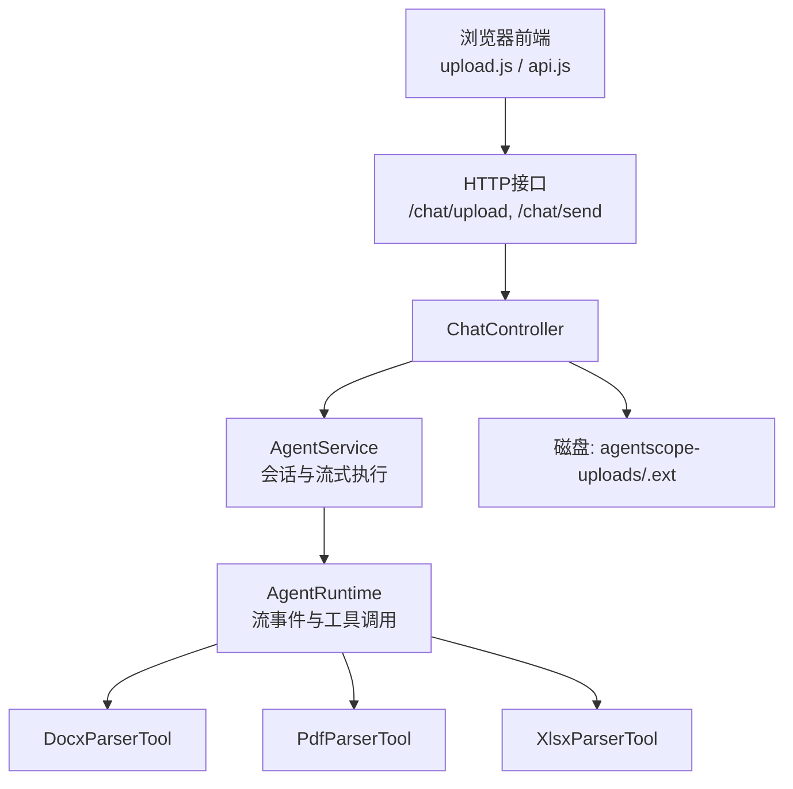
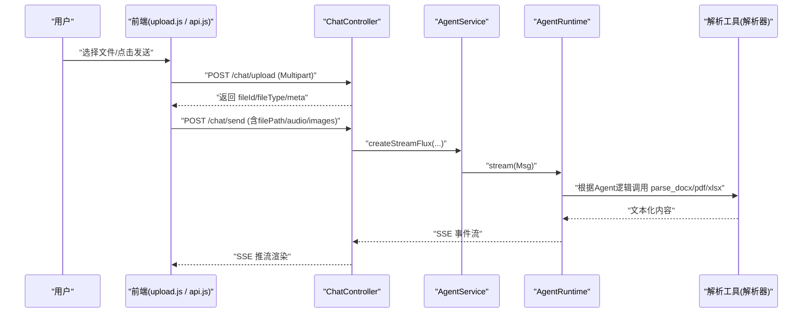
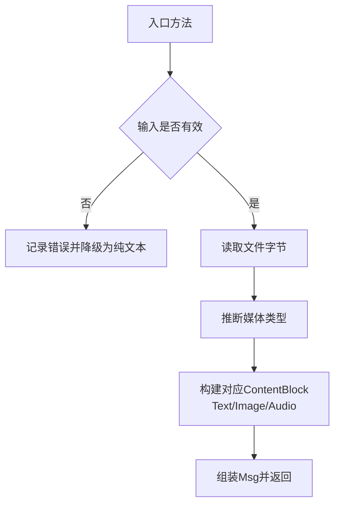
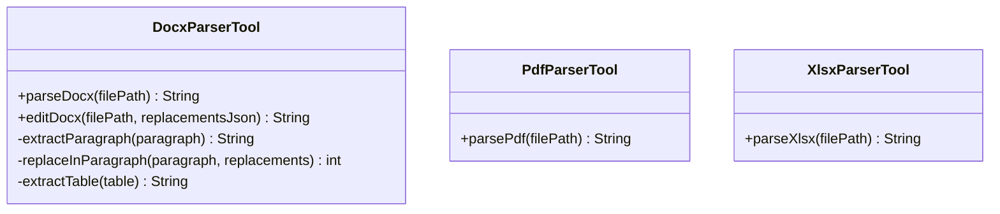
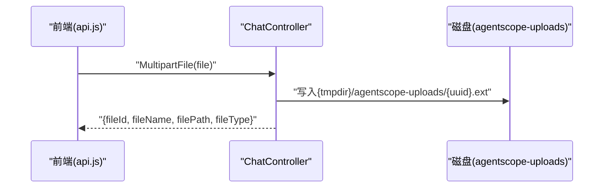
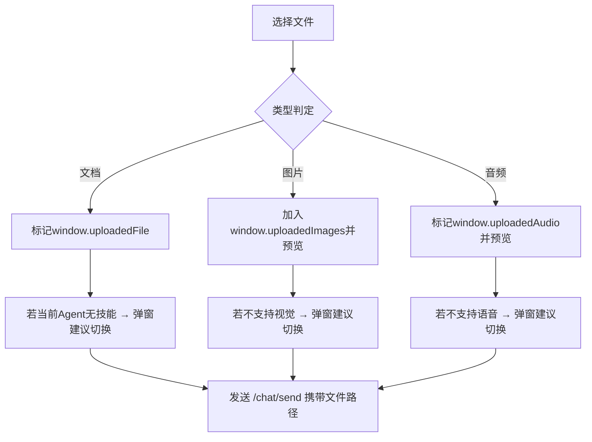
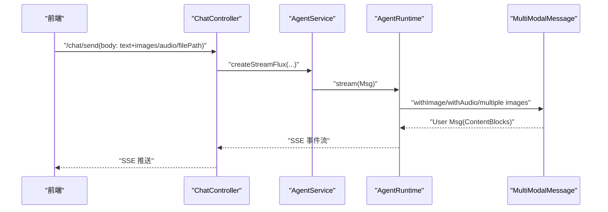
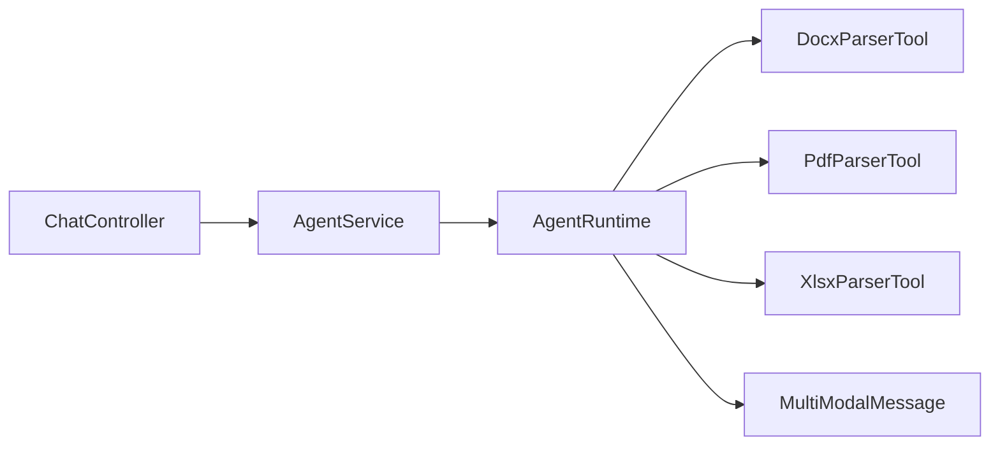

# 多模态支持

<cite>
**本文引用的文件**
- [MultiModalMessage.java](file://src/main/java/com/skloda/agentscope/model/MultiModalMessage.java)
- [DocxParserTool.java](file://src/main/java/com/skloda/agentscope/tool/DocxParserTool.java)
- [PdfParserTool.java](file://src/main/java/com/skloda/agentscope/tool/PdfParserTool.java)
- [XlsxParserTool.java](file://src/main/java/com/skloda/agentscope/tool/XlsxParserTool.java)
- [ChatController.java](file://src/main/java/com/skloda/agentscope/controller/ChatController.java)
- [application.yml](file://src/main/resources/application.yml)
- [upload.js](file://src/main/resources/static/scripts/modules/upload.js)
- [api.js](file://src/main/resources/static/scripts/api.js)
- [ChatControllerFileTest.java](file://src/test/java/com/skloda/agentscope/controller/ChatControllerFileTest.java)
- [AgentService.java](file://src/main/java/com/skloda/agentscope/service/AgentService.java)
</cite>

## 目录
1. [简介](#简介)
2. [项目结构](#项目结构)
3. [核心组件](#核心组件)
4. [架构总览](#架构总览)
5. [详细组件分析](#详细组件分析)
6. [依赖关系分析](#依赖关系分析)
7. [性能考虑](#性能考虑)
8. [故障排查指南](#故障排查指南)
9. [结论](#结论)
10. [附录：API与前端交互流程](#附录api与前端交互流程)

## 简介
本技术文档聚焦于系统中的多模态能力，涵盖文本、图片、音频以及常见文档格式（DOCX、PDF、XLSX）的统一处理流程。重点说明：
- MultiModalMessage 如何封装不同类型的消息内容并构造 AgentScope 原生消息
- 前端的文件选择、预览、上传与状态反馈流程
- 后端解析器（DocxParserTool、PdfParserTool、XlsxParserTool）的技术选型与功能特性
- 文件上传到临时目录的管理机制（命名、路径构建、生命周期）
- 最佳实践（文件大小、格式验证、安全与可观测性建议）

## 项目结构
多模态涉及以下关键位置：
- 模型层：MultiModalMessage（构造 Image/Audio 等消息块）
- 控制器层：ChatController（提供 /chat/upload、/chat/send 等端点，承载上传与分发）
- 工具层：DocxParserTool、PdfParserTool、XlsxParserTool（解析文档）
- 前端脚本：upload.js、api.js（文件上传、类型校验、状态展示）
- 配置：application.yml（multipart 大小限制）

**图表来源**
- [ChatController.java:117-153](file://src/main/java/com/skloda/agentscope/controller/ChatController.java#L117-L153)
- [ChatController.java:419-488](file://src/main/java/com/skloda/agentscope/controller/ChatController.java#L419-L488)
- [DocxParserTool.java:24-57](file://src/main/java/com/skloda/agentscope/tool/DocxParserTool.java#L24-L57)
- [PdfParserTool.java:19-71](file://src/main/java/com/skloda/agentscope/tool/PdfParserTool.java#L19-L71)
- [XlsxParserTool.java:17-107](file://src/main/java/com/skloda/agentscope/tool/XlsxParserTool.java#L17-L107)

**章节来源**
- [ChatController.java:117-153](file://src/main/java/com/skloda/agentscope/controller/ChatController.java#L117-L153)
- [ChatController.java:419-488](file://src/main/java/com/skloda/agentscope/controller/ChatController.java#L419-L488)
- [application.yml:10-12](file://src/main/resources/application.yml#L10-L12)
- [upload.js:22-111](file://src/main/resources/static/scripts/modules/upload.js#L22-L111)
- [api.js:28-36](file://src/main/resources/static/scripts/api.js#L28-L36)

## 核心组件
- MultiModalMessage：将本地文件或字节转换为 AgentScope 的 ContentBlock（Text/Image/Audio），返回标准 Msg 对象供 Agent 使用。
- 解析工具：DocxParserTool（POI XWPF）、PdfParserTool（PDFBox）、XlsxParserTool（POI XSSF）。
- 控制器：ChatController 暴露上传与发送消息的入口，负责文件落地、鉴权、路由到 Agent 服务。
- 前端脚本：upload.js 完成类型判断、上传、预览与智能体能力提示。

**章节来源**
- [MultiModalMessage.java:23-172](file://src/main/java/com/skloda/agentscope/model/MultiModalMessage.java#L23-L172)
- [DocxParserTool.java:24-127](file://src/main/java/com/skloda/agentscope/tool/DocxParserTool.java#L24-L127)
- [PdfParserTool.java:19-71](file://src/main/java/com/skloda/agentscope/tool/PdfParserTool.java#L19-L71)
- [XlsxParserTool.java:17-107](file://src/main/java/com/skloda/agentscope/tool/XlsxParserTool.java#L17-L107)
- [ChatController.java:117-153](file://src/main/java/com/skloda/agentscope/controller/ChatController.java#L117-L153)
- [upload.js:22-111](file://src/main/resources/static/scripts/modules/upload.js#L22-L111)

## 架构总览
整体端到端流程（多模态消息从前端到 Agent 解析）：
1. 用户在前端选择文件（文档/图片/音频），前端进行基础类型校验（后缀与 MIME）。
2. 通过 /chat/upload 上传至服务器，服务器保存至临时目录 agentscope-uploads/{uuid}{扩展名}。
3. 前端在后续 /chat/send 请求中携带 file path/filename（或图片/音频列表及字段）。
4. ChatController 调用 AgentService 创建流式会话，传入多媒体参数。
5. Agent 在执行过程中，按需要使用 Docx/Pdf/Xlsx 解析工具读取文件并生成文本化结果；或使用 MultiModalMessage 将图片/音频转为 Base64 的媒体块。

**图表来源**
- [upload.js:46-105](file://src/main/resources/static/scripts/modules/upload.js#L46-L105)
- [api.js:28-36](file://src/main/resources/static/scripts/api.js#L28-L36)
- [ChatController.java:117-153](file://src/main/java/com/skloda/agentscope/controller/ChatController.java#L117-L153)
- [ChatController.java:419-488](file://src/main/java/com/skloda/agentscope/controller/ChatController.java#L419-L488)
- [DocxParserTool.java:24-57](file://src/main/java/com/skloda/agentscope/tool/DocxParserTool.java#L24-L57)
- [PdfParserTool.java:19-71](file://src/main/java/com/skloda/agentscope/tool/PdfParserTool.java#L19-L71)
- [XlsxParserTool.java:17-107](file://src/main/java/com/skloda/agentscope/tool/XlsxParserTool.java#L17-L107)

## 详细组件分析

### MultiModalMessage：多模态消息构建
职责与特性
- withImage：读取图片文件字节并编码为 Base64，自动推断媒体类型，拼接 TextBlock 与 ImageBlock，返回 USER 角色 Msg。异常时回退为纯文本并附加错误信息。
- withAudio：读取音频文件字节并编码为 Base64，添加 AudioBlock 并设置媒体类型。异常时回退为带错误的文本消息。
- withMultipleImages：批量处理多张图片，逐项编码与类型识别。
- getMediaType：根据文件后缀推断媒体类型，支持 png/jpg/gif/webp/wav/mp3/m4a/mp4 等。

复杂度与注意事项
- IO：每次调用都会读取整文件到内存并 Base64 编码；对于大图片或音频需谨慎控制大小。
- 错误处理：捕获异常并以降级方式返回，避免中断对话流。

**图表来源**
- [MultiModalMessage.java:31-158](file://src/main/java/com/skloda/agentscope/model/MultiModalMessage.java#L31-L158)

**章节来源**
- [MultiModalMessage.java:31-172](file://src/main/java/com/skloda/agentscope/model/MultiModalMessage.java#L31-L172)

### 文档解析器：DocxParserTool、PdfParserTool、XlsxParserTool
- DocxParserTool
  - 使用 Apache POI（XWPF）解析 DOCX，提取段落、表格与编号列表，并按标题级别输出 Markdown 风格标题。
  - 提供编辑功能（基于占位符替换），将结果写为新的 _edited.docx。
  - 复杂度高：逐元素遍历；表格行列展开。
- PdfParserTool
  - 使用 PDFBox 加载 PDF，提取所有页面文本。少于等于 3 页一次性提取；超过则分页数行标识以增强可读性。
  - 支持读取文档元数据（标题、作者）并附加在首段。
- XlsxParserTool
  - 使用 Apache POI（XSSF）解析 XLSX，输出每个 sheet 名称与表格内容。对单元格数值/日期/布尔/公式进行区分格式化。

**图表来源**
- [DocxParserTool.java:24-207](file://src/main/java/com/skloda/agentscope/tool/DocxParserTool.java#L24-L207)
- [PdfParserTool.java:19-71](file://src/main/java/com/skloda/agentscope/tool/PdfParserTool.java#L19-L71)
- [XlsxParserTool.java:17-107](file://src/main/java/com/skloda/agentscope/tool/XlsxParserTool.java#L17-L107)

**章节来源**
- [DocxParserTool.java:24-207](file://src/main/java/com/skloda/agentscope/tool/DocxParserTool.java#L24-L207)
- [PdfParserTool.java:19-71](file://src/main/java/com/skloda/agentscope/tool/PdfParserTool.java#L19-L71)
- [XlsxParserTool.java:17-107](file://src/main/java/com/skloda/agentscope/tool/XlsxParserTool.java#L17-L107)

### 文件上传与 AgentScope 临时目录管理
- 接口：POST /chat/upload
- 存储位置：系统临时目录下 agentscope-uploads 子目录，路径由 System.getProperty("java.io.tmpdir") 与固定目录名拼接
- 命名策略：UUID + 原扩展名；响应包含 fileId、fileName、filePath（实际实现以当前版本为准，测试用例验证了 fileType、拒绝空/非法类型等）
- 生命周期：存放在进程级临时目录，由操作系统在进程退出或清理时回收；生产部署建议配合定期清理任务

**图表来源**
- [api.js:28-36](file://src/main/resources/static/scripts/api.js#L28-L36)
- [ChatController.java:419-488](file://src/main/java/com/skloda/agentscope/controller/ChatController.java#L419-L488)

**章节来源**
- [ChatController.java:419-488](file://src/main/java/com/skloda/agentscope/controller/ChatController.java#L419-L488)
- [application.yml:10-12](file://src/main/resources/application.yml#L10-L12)
- [ChatControllerFileTest.java:41-82](file://src/test/java/com/skloda/agentscope/controller/ChatControllerFileTest.java#L41-L82)

### 前端多模态处理流程
- 文件选择与类型校验：支持 .docx/.pdf/.xlsx/.jpg/.jpeg/.png/.gif/.webp/.wav/.mp3/.m4a/.mp4
- 上传与展示：上传成功后显示“文件标签”，图片/音频分别进入预览区；当当前智能体不具备相应能力时，弹出切换建议弹窗
- 发送至后端：发送消息时将 uploadedFile、uploadedImages、uploadedAudio 信息附带至 /chat/send 请求体

**图表来源**
- [upload.js:22-111](file://src/main/resources/static/scripts/modules/upload.js#L22-L111)
- [upload.js:113-154](file://src/main/resources/static/scripts/modules/upload.js#L113-L154)
- [upload.js:156-200](file://src/main/resources/static/scripts/modules/upload.js#L156-L200)

**章节来源**
- [upload.js:22-200](file://src/main/resources/static/scripts/modules/upload.js#L22-L200)

### 多模态消息在 Agent 中的处理
- ChatController.sendMessage 接收 ChatRequest，包含 message、filePath/fileName、images、audio 等多字段
- AgentService.createStreamFlux 将参数注入到 AgentRuntime 的流式处理中
- Agent 内部根据工具注册表决定调用哪个解析器；MultiModalMessage 用于构建带有 ImageBlock 或 AudioBlock 的消息

**图表来源**
- [ChatController.java:117-153](file://src/main/java/com/skloda/agentscope/controller/ChatController.java#L117-L153)
- [MultiModalMessage.java:31-158](file://src/main/java/com/skloda/agentscope/model/MultiModalMessage.java#L31-L158)

**章节来源**
- [ChatController.java:117-153](file://src/main/java/com/skloda/agentscope/controller/ChatController.java#L117-L153)
- [AgentService.java:1-200](file://src/main/java/com/skloda/agentscope/service/AgentService.java#L1-L200)

## 依赖关系分析
- ChatController 依赖于 AgentService 与文件系统；AgentService 依赖 AgentRuntime 和 Agent 工具链
- 解析工具各自依赖 POI/PDFBox，作为独立 @Tool 被注册与调用
- MultiModalMessage 依赖 AgentScope 消息模型（Msg、TextBlock、ImageBlock、AudioBlock、Base64Source）

**图表来源**
- [ChatController.java:117-153](file://src/main/java/com/skloda/agentscope/controller/ChatController.java#L117-L153)
- [AgentService.java:1-200](file://src/main/java/com/skloda/agentscope/service/AgentService.java#L1-L200)
- [DocxParserTool.java:24-207](file://src/main/java/com/skloda/agentscope/tool/DocxParserTool.java#L24-L207)
- [PdfParserTool.java:19-71](file://src/main/java/com/skloda/agentscope/tool/PdfParserTool.java#L19-L71)
- [XlsxParserTool.java:17-107](file://src/main/java/com/skloda/agentscope/tool/XlsxParserTool.java#L17-L107)

**章节来源**
- [AgentService.java:1-200](file://src/main/java/com/skloda/agentscope/service/AgentService.java#L1-L200)
- [ChatController.java:117-153](file://src/main/java/com/skloda/agentscope/controller/ChatController.java#L117-L153)

## 性能考虑
- 大文件 I/O 与内存占用
  - 图片/音频使用 Base64 编码后体积放大约 33%，需注意前后端传输与序列化成本。
  - 文档解析全量读入内存；建议对超大文档做分片或限流。
- 分页与增量
  - PDF 超过 3 页采用分页处理，有助于减少单次输出体积。
- SSE 流式
  - Agent 执行过程通过 Reactor Flux + SSE 逐步返回事件，利于交互体验。
- 线程与异步
  - 使用 Spring WebFlux 与 Project Reactor，非阻塞 I/O 降低线程压力。

[本节为通用性能建议，不直接引用具体文件]

## 故障排查指南
常见问题与定位
- 上传失败/受限
  - 检查 application.yml 中 spring.servlet.multipart.max-file-size/size 配置是否符合预期
  - 确认前端类型过滤与实际扩展名一致
- 解析器报错
  - 查看日志中 Docx/Pdf/Xlsx 解析异常堆栈，确认文件格式/损坏情况
  - 对于扫描版 PDF 无文本，解析器会返回为空或提示无法提取
- 临时文件丢失
  - agentscope-uploads 位于系统临时目录，进程退出后可能被清理
  - 如需要持久下载，请提供 /chat/download 或直接访问本地路径
- 类型映射错误
  - getMediaType 仅依据扩展名推断，需确保客户端上传的后缀合法

**章节来源**
- [application.yml:10-12](file://src/main/resources/application.yml#L10-L12)
- [PdfParserTool.java:19-71](file://src/main/java/com/skloda/agentscope/tool/PdfParserTool.java#L19-L71)
- [ChatController.java:419-488](file://src/main/java/com/skloda/agentscope/controller/ChatController.java#L419-L488)

## 结论
本项目实现了面向文档、图片、音频的多模态统一接入与处理通道。通过控制器统一上传、前端类型与能力引导、解析器稳定拆分以及 Agent 侧消息标准化构建，形成可扩展、可观测的多模态流水线。建议在正式环境结合业务规模完善大小限制、沙箱隔离、落盘保留策略、资源清理与审计。

## 附录：API与前端交互流程
- 上传接口
  - POST /chat/upload：接收 multipart 文件，保存至临时目录，返回文件信息与类型分类
- 发送接口
  - POST /chat/send：返回 SSE 流，支持包含文本、图片、音频、文件路径
- 前端行为
  - upload.js：校验、上传、预览、智能体能力判断与建议
  - api.js：封装 fetch 调用 /chat/upload

**章节来源**
- [ChatController.java:117-153](file://src/main/java/com/skloda/agentscope/controller/ChatController.java#L117-L153)
- [ChatController.java:419-488](file://src/main/java/com/skloda/agentscope/controller/ChatController.java#L419-L488)
- [upload.js:22-111](file://src/main/resources/static/scripts/modules/upload.js#L22-L111)
- [api.js:28-36](file://src/main/resources/static/scripts/api.js#L28-L36)