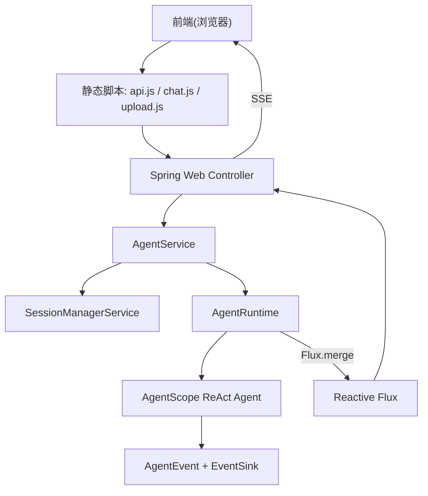
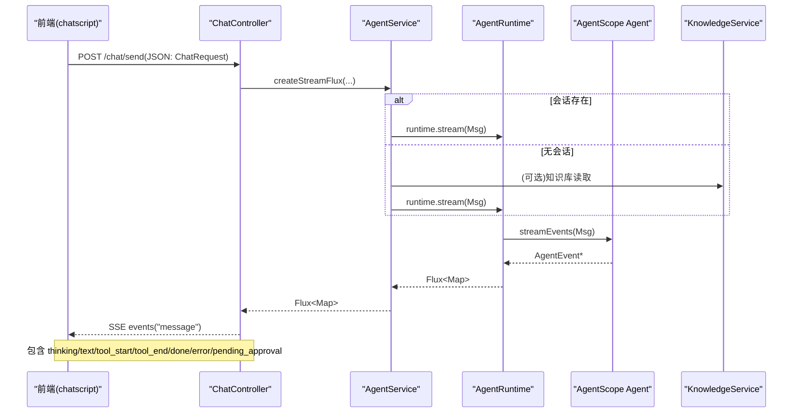
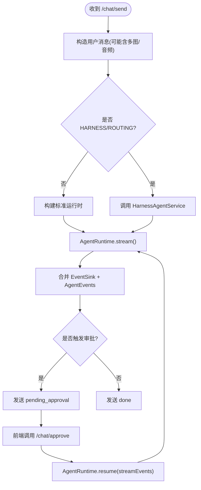
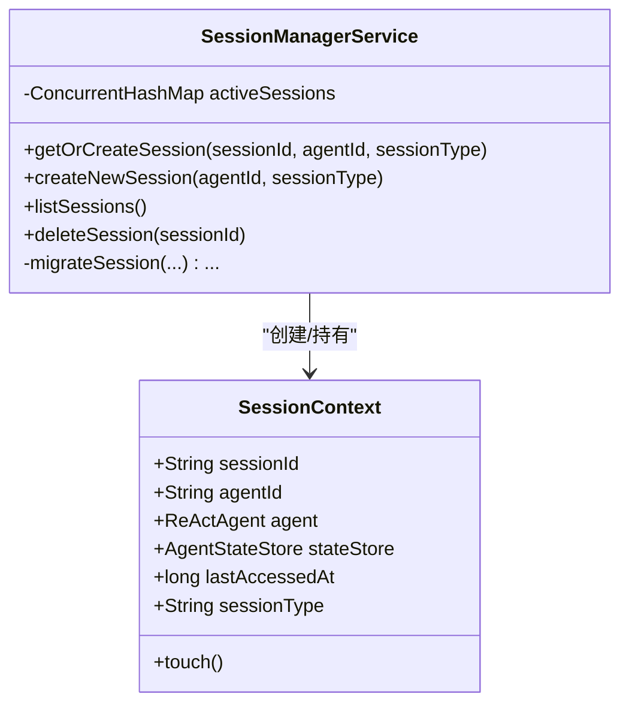
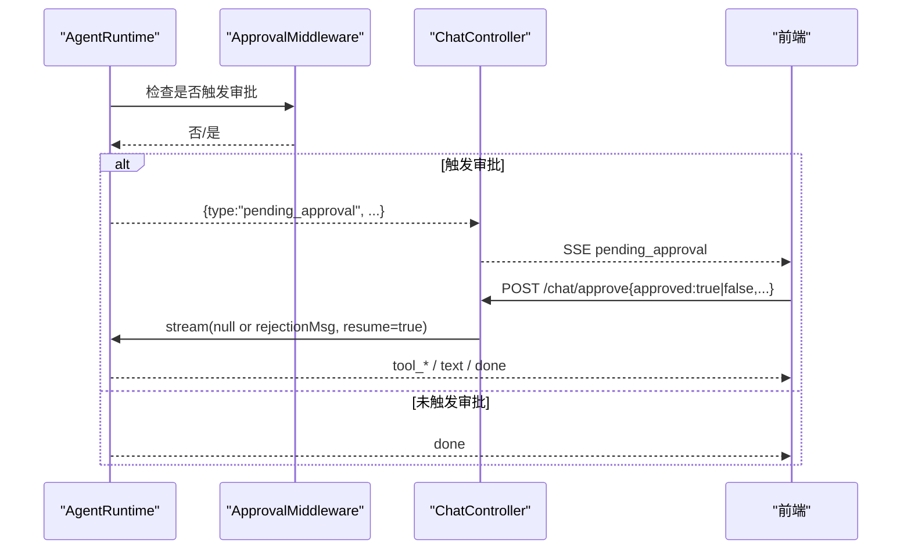
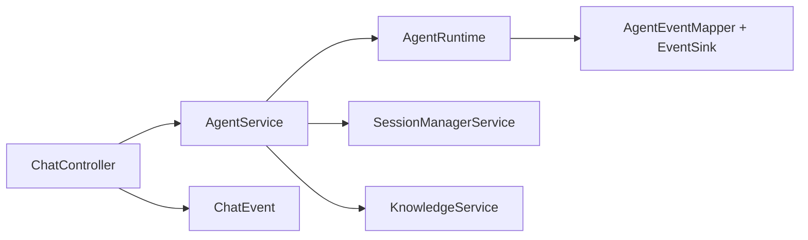

# 智能对话系统

<cite>
**本文引用的文件**   
- [ChatController.java](file://src/main/java/com/skloda/agentscope/controller/ChatController.java)
- [AgentService.java](file://src/main/java/com/skloda/agentscope/service/AgentService.java)
- [SessionManagerService.java](file://src/main/java/com/skloda/agentscope/service/SessionManagerService.java)
- [ChatRequest.java](file://src/main/java/com/skloda/agentscope/model/ChatRequest.java)
- [ChatEvent.java](file://src/main/java/com/skloda/agentscope/model/ChatEvent.java)
- [MultiModalMessage.java](file://src/main/java/com/skloda/agentscope/model/MultiModalMessage.java)
- [AgentRuntime.java](file://src/main/java/com/skloda/agentscope/runtime/AgentRuntime.java)
- [chat.js](file://src/main/resources/static/scripts/chat.js)
- [api.js](file://src/main/resources/static/scripts/api.js)
- [upload.js](file://src/main/resources/static/scripts/modules/upload.js)
- [ui.js](file://src/main/resources/static/scripts/modules/ui.js)
- [KnowledgeService.java](file://src/main/java/com/skloda/agentscope/service/KnowledgeService.java)
- [application.yml](file://src/main/resources/application.yml)
- [pom.xml](file://pom.xml)
</cite>

## 目录
1. [简介](#简介)
2. [项目结构](#项目结构)
3. [核心组件](#核心组件)
4. [架构总览](#架构总览)
5. [详细组件分析](#详细组件分析)
6. [依赖关系分析](#依赖关系分析)
7. [性能考虑](#性能考虑)
8. [故障排查指南](#故障排查指南)
9. [结论](#结论)
10. [附录](#附录)

## 简介
本项目是一个基于 Spring Boot 与 AgentScope（Java 版）的智能对话演示系统，提供 RESTful API 与 Server-Sent Events（SSE）流式响应，支持会话管理、多模态输入（文本+图片+音频）、文档上传下载与 RAG 知识检索。后端通过 Reactor 响应式流承载事件流，前端通过 SSE 解析器实时渲染思考过程、工具调用与结果，并提供人类在环（HITL）审批流程。

## 项目结构
- 控制器层：聊天、飞书渠道、工作流、指标等接口定义
- 服务层：Agent 路由、会话管理、知识索引等能力
- 运行层：AgentRuntime 将 Agent 事件转换为统一的 Map 事件流
- 模型层：请求体 ChatRequest、事件体 ChatEvent、多模态消息构建器
- 前端：SSE 客户端、上传模块、UI 渲染、调试面板



图表来源
- [ChatController.java:122-153](file://src/main/java/com/skloda/agentscope/controller/ChatController.java#L122-L153)
- [AgentService.java:140-177](file://src/main/java/com/skloda/agentscope/service/AgentService.java#L140-L177)
- [AgentRuntime.java:68-142](file://src/main/java/com/skloda/agentscope/runtime/AgentRuntime.java#L68-L142)

章节来源
- [application.yml:1-12](file://src/main/resources/application.yml#L1-L12)
- [pom.xml:20-67](file://pom.xml#L20-L67)

## 核心组件
- 聊天控制器（ChatController）：暴露 /chat/send（POST, SSE 流）、/chat/approve（POST）等端点；封装 SSE 发送与错误处理
- 代理路由服务（AgentService）：根据 agentId/sessionId/执行模式选择不同运行时；组装多模态消息并返回 Flux
- 会话管理（SessionManagerService）：按 session id 复用/迁移 ReActAgent 及状态存储；维护活跃会话集合
- 运行期（AgentRuntime）：合并 EventSink 和 Agent 事件为统一事件流，注入 HITL 等待/恢复逻辑
- 多模态消息（MultiModalMessage）：将本地文件路径编码为 Base64 的 ImageBlock/AudioBlock
- 知识服务（KnowledgeService）：后台异步索引本地文档与上传文档到 InMemoryStore，提供状态查询

章节来源
- [ChatController.java:44-113](file://src/main/java/com/skloda/agentscope/controller/ChatController.java#L44-L113)
- [AgentService.java:80-177](file://src/main/java/com/skloda/agentscope/service/AgentService.java#L80-L177)
- [SessionManagerService.java:24-198](file://src/main/java/com/skloda/agentscope/service/SessionManagerService.java#L24-L198)
- [AgentRuntime.java:68-183](file://src/main/java/com/skloda/agentscope/runtime/AgentRuntime.java#L68-L183)
- [MultiModalMessage.java:21-172](file://src/main/java/com/skloda/agentscope/model/MultiModalMessage.java#L21-L172)
- [KnowledgeService.java:53-196](file://src/main/java/com/skloda/agentscope/service/KnowledgeService.java#L53-L196)

## 架构总览


图表来源
- [ChatController.java:122-153](file://src/main/java/com/skloda/agentscope/controller/ChatController.java#L122-L153)
- [AgentService.java:140-177](file://src/main/java/com/skloda/agentscope/service/AgentService.java#L140-L177)
- [AgentRuntime.java:68-142](file://src/main/java/com/skloda/agentscope/runtime/AgentRuntime.java#L68-L142)

## 详细组件分析

### RESTful API 设计
- GET `/`：返回聊天页面模板
- POST `/chat/send`：请求体为 ChatRequest，返回 `text/event-stream` 类型 SSE 流；首次事件可携带 sessionId
- POST `/chat/approve`：处理 HITL 审批，接受 ApprovalRequest；若批准则继续执行工具，拒绝则构造 rejection Msg 重启流
- 其它辅助接口：/api/agents、/api/sessions、/api/knowledge/*、/ag-ui/run（profile agui）、/channel/feishu/webhook（profile feishu）

章节来源
- [ChatController.java:72-109](file://src/main/java/com/skloda/agentscope/controller/ChatController.java#L72-L109)
- [ChatController.java:117-186](file://src/main/java/com/skloda/agentscope/controller/ChatController.java#L117-L186)
- [application.yml:25-80](file://src/main/resources/application.yml#L25-L80)

### SSE 流式响应处理
- 控制器使用 Flux<ServerSentEvent<String>>，统一事件名为 "message"，数据为 JSON；遇到异常时发送 error 事件并以 done 结束流
- AgentRuntime 合并 EventSink（管道/路由/交接等手动事件）与 Agent 原生事件流，最终追加 pending_approval 或 done
- 前端通过自定义 SSE 解析器按行拆分，聚合 event/data，触发相应 UI 更新



图表来源
- [ChatController.java:77-113](file://src/main/java/com/skloda/agentscope/controller/ChatController.java#L77-L113)
- [AgentRuntime.java:79-168](file://src/main/java/com/skloda/agentscope/runtime/AgentRuntime.java#L79-L168)

章节来源
- [ChatController.java:77-113](file://src/main/java/com/skloda/agentscope/controller/ChatController.java#L77-L113)
- [AgentRuntime.java:79-183](file://src/main/java/com/skloda/agentscope/runtime/AgentRuntime.java#L79-L183)
- [chat.js:78-178](file://src/main/resources/static/scripts/chat.js#L78-L178)
- [api.js:1-25](file://src/main/resources/static/scripts/api.js#L1-L25)

### 会话管理机制
- 会话上下文（SessionContext）缓存于 ConcurrentHashMap，含 agent、stateStore、创建/访问时间戳与 sessionType
- 当请求附带 sessionId 且 sessionType 发生变化时，自动迁移到新 stateStore 类型并重建 ReActAgent
- 支持按 agentId 快速获取/创建会话，列出并删除会话



图表来源
- [SessionManagerService.java:24-198](file://src/main/java/com/skloda/agentscope/service/SessionManagerService.java#L24-L198)

章节来源
- [SessionManagerService.java:75-155](file://src/main/java/com/skloda/agentscope/service/SessionManagerService.java#L75-L155)
- [SessionManagerService.java:164-198](file://src/main/java/com/skloda/agentscope/service/SessionManagerService.java#L164-L198)

### 多模态消息支持
- 支持单图、多图与音频；通过 MultiModalMessage 将本地文件读入内存转为 Base64，映射 MIME 类型（image/audio）
- ChatRequest 中 images 列表与 audio 对象描述上传文件的 filePath 与 fileName
- 前端选择图片/音频后，提交时将其 path 与 fileName 放入 payload 一并发送到后端

章节来源
- [MultiModalMessage.java:31-158](file://src/main/java/com/skloda/agentscope/model/MultiModalMessage.java#L31-L158)
- [ChatRequest.java:50-143](file://src/main/java/com/skloda/agentscope/model/ChatRequest.java#L50-L143)
- [upload.js:22-111](file://src/main/resources/static/scripts/modules/upload.js#L22-L111)
- [chat.js:81-111](file://src/main/resources/static/scripts/chat.js#L81-L111)

### 文件上传与下载
- 前端通过 api.js 的 uploadFile 将文件以 multipart/form-data 发送至 /chat/upload（由 Spring MVC 接收，保存至临时目录），返回 fileId、fileName、filePath
- 上传成功后，前端将附件信息附加到聊天消息请求中；下载通过 /chat/download?fileId=... 访问
- 会话中的媒体消息可通过前端 ui.js 渲染图片/音频控件，并使用 download 链接展示预览

章节来源
- [api.js:27-41](file://src/main/resources/static/scripts/api.js#L27-L41)
- [upload.js:22-111](file://src/main/resources/static/scripts/modules/upload.js#L22-L111)
- [ui.js:30-79](file://src/main/resources/static/scripts/modules/ui.js#L30-L79)

### 前端 SSE 客户端实现与协议
- 自实现 createSSEParser：缓存未闭合的数据块，逐行扫描 data:/event:，在空白行处触发回调
- chat.js 中维护 round、thinking box、调试时间线、各类事件分支（agent_start/end、tool_*、llm_*、pipeline_*、routing_*、expert_*、blackboard_* 等）
- 打字指示器仅在首条可见内容事件中移除，避免“真空期”造成的空白体验

章节来源
- [api.js:1-25](file://src/main/resources/static/scripts/api.js#L1-L25)
- [chat.js:78-178](file://src/main/resources/static/scripts/chat.js#L78-L178)
- [chat.js:178-...](file://src/main/resources/static/scripts/chat.js#L178-L...)

### 错误处理与重连机制
- 后端：SSE 流 onErrorResume 时输出 ChatEvent.error 并以 done 结束，避免悬挂连接
- 前端：catch 解析异常、记录日志；HTTP 非 200 直接终止显示错误
- 重连策略：可按需要基于 AbortController 取消当前 reader，并在提示后重新发起 fetch；或在网络层使用带退避的重试逻辑（仓库未内置）

章节来源
- [ChatController.java:147-152](file://src/main/java/com/skloda/agentscope/controller/ChatController.java#L147-L152)
- [chat.js:106-119](file://src/main/resources/static/scripts/chat.js#L106-L119)
- [chat.js:137-145](file://src/main/resources/static/scripts/chat.js#L137-L145)

### 人类在环（HITL）审批
- AgentRuntime 在流结束时检查 approvalMiddleware 是否触发了审批，若触发则构造 pending_approval 事件（包含 approvalId、待执行工具列表、时间戳）
- 前端调用 /chat/approve，服务端根据是否批准，注入 rejection Msg 或空 Msg 恢复执行，并继续推送完整生命周期事件



图表来源
- [AgentRuntime.java:170-183](file://src/main/java/com/skloda/agentscope/runtime/AgentRuntime.java#L170-L183)
- [ChatController.java:155-186](file://src/main/java/com/skloda/agentscope/controller/ChatController.java#L155-L186)

章节来源
- [AgentRuntime.java:170-183](file://src/main/java/com/skloda/agentscope/runtime/AgentRuntime.java#L170-L183)
- [ChatController.java:155-186](file://src/main/java/com/skloda/agentscope/controller/ChatController.java#L155-L186)

### 事件流模型 ChatEvent
- ChatEvent 是简化的事件容器，统一序列化用于 SSE error/done 等边界事件
- 实际业务流事件（text/thinking/tool_start 等）由 AgentEventMapper 生成 Map 并透传到前端

章节来源
- [ChatEvent.java:1-39](file://src/main/java/com/skloda/agentscope/model/ChatEvent.java#L1-L39)

### 数据流与处理逻辑
- AgentService 根据配置与上下文选择 Harness/Supervisor/普通运行时；始终先构造 Msg，再启动流；并将流记录到工作流/历史库
- KnowledgeService 后台线程索引本地知识目录与上传文件，采用 InMemoryStore；提供状态快照（正在索引/已完成/失败）

章节来源
- [AgentService.java:140-177](file://src/main/java/com/skloda/agentscope/service/AgentService.java#L140-L177)
- [KnowledgeService.java:99-196](file://src/main/java/com/skloda/agentscope/service/KnowledgeService.java#L99-L196)

## 依赖关系分析


图表来源
- [ChatController.java:44-113](file://src/main/java/com/skloda/agentscope/controller/ChatController.java#L44-L113)
- [AgentService.java:32-77](file://src/main/java/com/skloda/agentscope/service/AgentService.java#L32-L77)
- [AgentRuntime.java:31-67](file://src/main/java/com/skloda/agentscope/runtime/AgentRuntime.java#L31-L67)

章节来源
- [pom.xml:28-188](file://pom.xml#L28-L188)
- [application.yml:25-80](file://src/main/resources/application.yml#L25-L80)

## 性能考虑
- 响应式流：前后端均以 Flux/SSE 处理长链路任务，避免阻塞线程；合理设置背压，避免大图片/音频导致内存峰值过高
- 会话池：使用 ConcurrentHashMap 缓存会话，降低重复初始化开销；注意并发清理与超时失效策略
- 知识索引：后台单线程增量索引，避免影响主线程；InMemoryStore 适合演示，生产应替换为分布式存储
- 大文件限制：application.yml 配置了 multipart 最大体积（50MB）；需配合网关与磁盘容量规划
- 日志级别：控制 io.agentscope 等内部包日志级别，减少 I/O 瓶颈

## 故障排查指南
- 流卡住或未关闭：检查 AgentRuntime 是否在 doFinally 中完成 EventSink；确保 onCompletion/onError 能发送 done 事件
- 审批挂起：确认 pending_approval 事件是否被前端正确处理，审批接口返回后的恢复流是否正确
- 图片/音频无法加载：检查文件路径、MIME 映射与下载接口路径；确认前端构造的 /chat/download URL
- SSE 解析错乱：确保分段 buffer 拼接正确，空白行作为事件结束标志
- 知识库异常：关注后台线程异常栈；确认文件格式受支持（pdf/docx/xlsx）

章节来源
- [AgentRuntime.java:112-141](file://src/main/java/com/skloda/agentscope/runtime/AgentRuntime.java#L112-L141)
- [chat.js:133-145](file://src/main/resources/static/scripts/chat.js#L133-L145)
- [KnowledgeService.java:143-196](file://src/main/java/com/skloda/agentscope/service/KnowledgeService.java#L143-L196)

## 结论
该系统实现了完整的智能对话闭环：RESTful API + SSE 流式事件、多模态输入、会话状态管理、HITL 审批、RAG 知识检索。通过响应式与模块化设计，具备良好的可扩展性与观测性，适合作为多种 AI 能力的集成基座。

## 附录

### API 接口文档与示例
- POST /chat/send
  - Content-Type: application/json
  - 请求体：ChatRequest
    - 必填：agentId（默认 chat.basic）；可选：message/filePath/fileName/images/audio/sessionId/userId/executionMode/permissionMode/sessionType
    - 示例（仅字段名示意）：
      ```json
      {
        "agentId": "chat.basic",
        "message": "请分析该图片内容",
        "sessionId": "任意唯一字符串",
        "userId": "user_123",
        "images": [{"path":"./tmp/a.png","fileName":"a.png"}],
        "audio": {"path":"./tmp/b.wav","fileName":"b.wav"},
        "sessionType": "memory"
      }
      ```
  - 响应：SSE 流（text/event-stream），事件名 message，数据为 JSON 对象（包含 type 等字段）
- POST /chat/approve
  - 请求体：ApprovalRequest
  - 用途：人工审批/拒绝工具调用后恢复执行
- 其它接口
  - GET /：聊天页面
  - GET /api/agents、POST /api/sessions、GET /api/sessions/{id}、DELETE /api/sessions/{id}
  - GET/POST/DELETE /api/knowledge/*
  - profile: feishu -> POST /channel/feishu/webhook
  - profile: agui -> POST /ag-ui/run

### 配置要点
- 端口：server.port（默认 8081）
- 模型：agentscope.model.dashscope.api-key、model-name、stream、enable-thinking、thinking-budget
- 知识库：agentscope.knowledge.enabled/path/embedding-model/chunk-size 等
- MCP：enabled 与端口配置（demo.sse-port/http-port）
- 文件上传上限：spring.servlet.multipart.max-file-size/max-request-size

章节来源
- [application.yml:1-12](file://src/main/resources/application.yml#L1-L12)
- [application.yml:25-80](file://src/main/resources/application.yml#L25-L80)