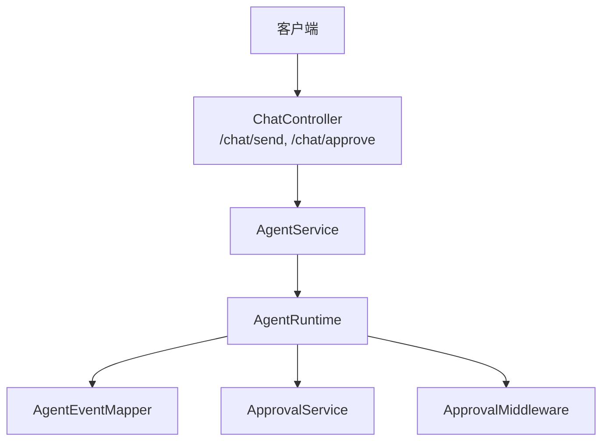
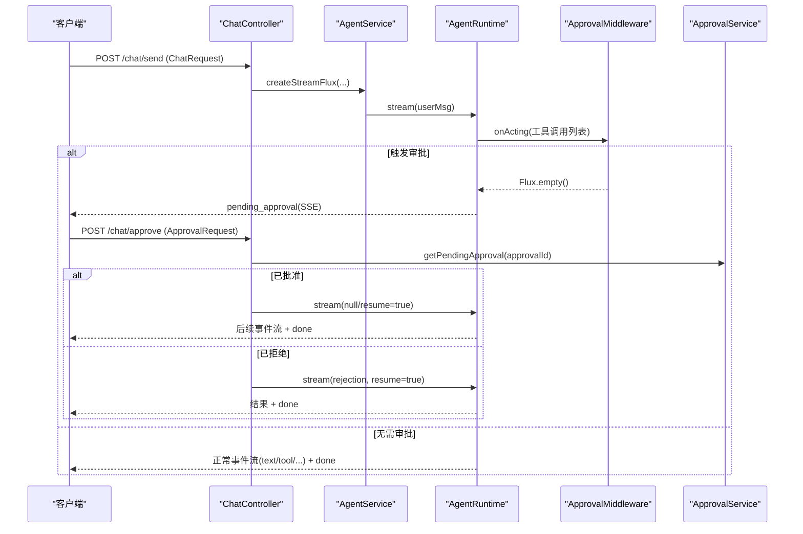
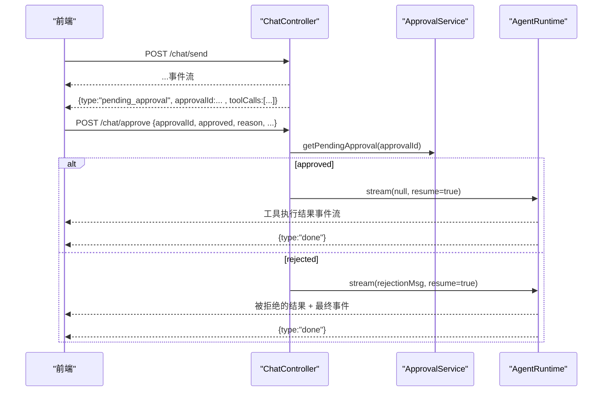
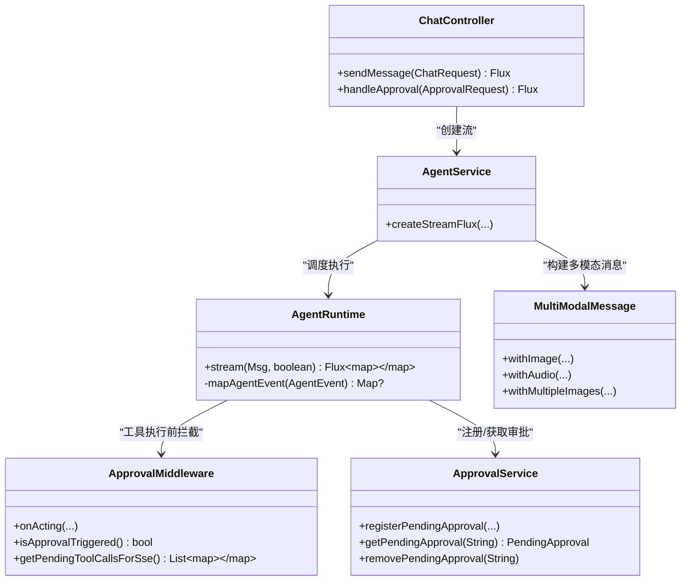

# 聊天 API 接口

<cite>
**本文引用的文件**
- [ChatController.java](file://src/main/java/com/skloda/agentscope/controller/ChatController.java)
- [ChatRequest.java](file://src/main/java/com/skloda/agentscope/model/ChatRequest.java)
- [ApprovalRequest.java](file://src/main/java/com/skloda/agentscope/model/ApprovalRequest.java)
- [MultiModalMessage.java](file://src/main/java/com/skloda/agentscope/model/MultiModalMessage.java)
- [AgentService.java](file://src/main/java/com/skloda/agentscope/service/AgentService.java)
- [AgentRuntime.java](file://src/main/java/com/skloda/agentscope/runtime/AgentRuntime.java)
- [AgentEventMapper.java](file://src/main/java/com/skloda/agentscope/runtime/AgentEventMapper.java)
- [ApprovalService.java](file://src/main/java/com/skloda/agentscope/service/ApprovalService.java)
- [ApprovalMiddleware.java](file://src/main/java/com/skloda/agentscope/middleware/ApprovalMiddleware.java)
- [ChatControllerStreamTest.java](file://src/test/java/com/skloda/agentscope/controller/ChatControllerStreamTest.java)
- [ChatRequestTest.java](file://src/test/java/com/skloda/agentscope/model/ChatRequestTest.java)
- [ApprovalMiddlewareTest.java](file://src/test/java/com/skloda/agentscope/middleware/ApprovalMiddlewareTest.java)
</cite>

## 目录
1. [简介](#简介)
2. [项目结构](#项目结构)
3. [核心组件](#核心组件)
4. [架构总览](#架构总览)
5. [详细接口规范](#详细接口规范)
6. [依赖关系与数据流](#依赖关系与数据流)
7. [性能与扩展性](#性能与扩展性)
8. [故障排查指南](#故障排查指南)
9. [结论](#结论)

## 简介
本章节聚焦后端聊天 API，覆盖以下要点：
- /chat/send：基于 Server-Sent Events 的流式对话接口，支持多模态（文本、图片、音频）与文件输入。
- /chat/approve：人机协同（HITL）审批接口，用于审批或拒绝需要人工确认的工具调用。
- ChatRequest 和 ApprovalRequest 模型字段语义与约束。
- SSE 事件格式与错误处理约定。
- 认证机制说明（当前实现未内建鉴权）。
- 参数验证规则、业务规则与常见集成场景。

## 项目结构
聊天相关功能主要集中在控制器、服务与运行时层：
- 控制器：接收请求、构造会话上下文、编排 SSE 流式响应。
- 服务层：路由 Agent、组装用户消息（含多模态）、创建并记录运行生命周期。
- 运行时：统一代理事件到 SSE Map，并在需要时介入 HITL 审批流程。
- 模型：标准化请求体与公共事件载体。

**图示来源**
- [ChatController.java:122-153](file://src/main/java/com/skloda/agentscope/controller/ChatController.java#L122-L153)
- [AgentService.java:131-177](file://src/main/java/com/skloda/agentscope/service/AgentService.java#L131-L177)
- [AgentRuntime.java:67-142](file://src/main/java/com/skloda/agentscope/runtime/AgentRuntime.java#L67-L142)
- [AgentEventMapper.java:39-56](file://src/main/java/com/skloda/agentscope/runtime/AgentEventMapper.java#L39-L56)
- [ApprovalMiddleware.java:22-42](file://src/main/java/com/skloda/agentscope/middleware/ApprovalMiddleware.java#L22-L42)
- [ApprovalService.java:17-26](file://src/main/java/com/skloda/agentscope/service/ApprovalService.java#L17-L26)

**小节来源**
- [ChatController.java:44-70](file://src/main/java/com/skloda/agentscope/controller/ChatController.java#L44-L70)
- [AgentService.java:26-38](file://src/main/java/com/skloda/agentscope/service/AgentService.java#L26-L38)
- [AgentRuntime.java:26-44](file://src/main/java/com/skloda/agentscope/runtime/AgentRuntime.java#L26-L44)

## 核心组件
- ChatController：定义两个关键端点，负责 SSE 封装与错误兜底。
- AgentService：根据 agentId、sessionId 与模式选择运行路径（单 Agent/Supervisor/Harness），聚合多模态输入。
- AgentRuntime：管理一次交互生命周期，将 AgentScope 2.0 的事件映射为 SSE payload，并集成 HITL 审批回调。
- ApprovalMiddleware 与 ApprovalService：实现工具执行前暂停、缓存待审批任务以及过期清理。
- MultiModalMessage：将本地文件路径转为 Agent 可消费的多模态消息（Base64 + Media Type）。

**小节来源**
- [ChatController.java:117-186](file://src/main/java/com/skloda/agentscope/controller/ChatController.java#L117-L186)
- [AgentService.java:80-177](file://src/main/java/com/skloda/agentscope/service/AgentService.java#L80-L177)
- [AgentRuntime.java:67-183](file://src/main/java/com/skloda/agentscope/runtime/AgentRuntime.java#L67-L183)
- [ApprovalMiddleware.java:54-77](file://src/main/java/com/skloda/agentscope/middleware/ApprovalMiddleware.java#L54-L77)
- [ApprovalService.java:27-46](file://src/main/java/com/skloda/agentscope/service/ApprovalService.java#L27-L46)
- [MultiModalMessage.java:20-94](file://src/main/java/com/skloda/agentscope/model/MultiModalMessage.java#L20-L94)

## 架构总览
整体流程分为“发消息”和“审批”两条主线，均通过 SSE 向前端推送结构化事件。

**图示来源**
- [ChatController.java:122-186](file://src/main/java/com/skloda/agentscope/controller/ChatController.java#L122-L186)
- [AgentService.java:131-177](file://src/main/java/com/skloda/agentscope/service/AgentService.java#L131-L177)
- [AgentRuntime.java:67-183](file://src/main/java/com/skloda/agentscope/runtime/AgentRuntime.java#L67-L183)
- [ApprovalMiddleware.java:58-77](file://src/main/java/com/skloda/agentscope/middleware/ApprovalMiddleware.java#L58-L77)
- [ApprovalService.java:27-46](file://src/main/java/com/skloda/agentscope/service/ApprovalService.java#L27-L46)

## 详细接口规范

### 基础信息
- 协议：HTTP/1.1 + SSE（text/event-stream）
- Content-Type：application/json（请求）；text/event-stream（响应）
- 字符编码：UTF-8
- 无状态：默认不强制校验登录态（见“认证机制”）

### 通用参数约定
- 所有 JSON 字段均为字符串或对象数组；可选字段为空时按 null 或空数组处理。
- sessionId 可选：提供时进行会话上下文的复用与历史记录写入；不提供则为无状态对话。
- agentId：目标 Agent 标识；缺省使用默认值 chat.basic。
- 事件流在结束时一定包含 type=done 事件。

### 接口一：/chat/send（流式对话）

#### HTTP 方法
POST

#### 路径
/chat/send

#### 请求体（JSON）
类型：ChatRequest

字段定义（全部为可选，除另有说明外）：
- agentId：字符串。Agent 标识，用于定位 Agent 配置。默认值：chat.basic。
- message：字符串。文本消息；若同时提供了 images/audio，则允许为空。
- filePath：字符串。文件路径，通常由上传接口返回后传入。
- fileName：字符串。原始文件名，用于推断 MIME 类型等。
- sessionId：字符串。会话 ID；用于会话级上下文和历史记录。
- userId：字符串。用户标识，用于权限与上下文透传。
- executionMode：字符串。执行模式标记，常用于 HarnessAgent 的路由与能力开关（如沙箱等）。
- permissionMode：字符串。权限模式，用于启用访问控制相关的策略。
- sessionType：字符串。会话类型标记，可用于下游区分会话用途或存储策略。

多模态字段：
- images：数组。元素类型为 ImageFile：
  - path：字符串。服务端可读取的绝对或相对路径。
  - fileName：字符串。原始文件名，用于判断媒体类型（例如 .png/.jpg/.gif/.webp）。
- audio：对象。AudioFile：
  - path：字符串。音频文件路径。
  - fileName：字符串。音频文件名，用于判断媒体类型（例如 .wav/.mp3/.m4a/.mp4）。

注意：
- 当 message、images、audio 三者全为空时，服务端将返回错误事件（message cannot be empty 语义），以流结束事件完成。

#### 成功响应（SSE 事件流）
服务端会持续发送 Server-Sent Event，事件名为 message，事件数据为 JSON 字符串，对应 ChatEvent 或运行时事件。前端应监听 text 事件与工具生命周期事件，直至收到 type=done 事件。

事件载荷示例（文本）：
{
  "type": "text",
  "content": "一段流式输出的回复内容片段。"
}

工具执行事件示例（开始/结束/结果）：
{
  "type": "tool_start",
  "name": "解析文档",
  "input": "{...}"
}
{
  "type": "tool_end",
  "name": "解析文档"
}
{
  "type": "tool_result_text_delta",
  "content": "工具返回的文本片段"
}
{
  "type": "tool_result_end",
  "name": "解析文档"
}

思维过程与推理提示：
- thinking、hint、custom 等事件将根据实际 Agent 行为输出。

流结束事件：
{
  "type": "done"
}

错误事件：
{
  "type": "error",
  "message": "错误描述信息"
}

#### 错误响应
- 由于返回类型是 Flux<ServerSentEvent<String>>，所有异常都会被包装为序列化的 error 事件并以 done 事件收尾，确保前端可以正确识别“失败且结束”。

#### 业务规则
- 多模态合并：如果同时存在 message 与 images/audio，将组合为多模态 Msg 发送给下游 Agent。
- 会话复用：传入 sessionId 时，会尝试从会话管理器获取/创建会话上下文，并记录本次输入预览用于工作流追踪。
- Harness 路由：当 agentId 指向 Harness 类型时，走 HarnessAgentService 流水线；否则进入标准 Runtime。
- Supervisor/路由型 Agent：当检测到 ROUTING 类型且启用 Supervisor 时，走 SupervisorRuntime 路径。

#### 常用集成示例
- 纯文本对话：仅设置 agentId、message。
- 上传图片分析：设置 agentId、optional message、images=[path, fileName]。
- 语音转文字：设置 agentId、optional message、audio=[path, fileName]。
- 带会话：提供 sessionId，便于历史对话与多轮问答。
- 需要审批的 Agent：当 Agent 配置启用了 approvalRequired 或匹配到指定工具名，会在执行敏感工具前中断并下发 pending_approval 事件，随后调用 /chat/approve 继续。

**小节来源**
- [ChatController.java:122-153](file://src/main/java/com/skloda/agentscope/controller/ChatController.java#L122-L153)
- [ChatRequest.java:8-16](file://src/main/java/com/skloda/agentscope/model/ChatRequest.java#L8-L16)
- [ChatRequest.java:50-90](file://src/main/java/com/skloda/agentscope/model/ChatRequest.java#L50-L90)
- [MultiModalMessage.java:31-94](file://src/main/java/com/skloda/agentscope/model/MultiModalMessage.java#L31-L94)
- [AgentService.java:131-177](file://src/main/java/com/skloda/agentscope/service/AgentService.java#L131-L177)
- [AgentRuntime.java:67-183](file://src/main/java/com/skloda/agentscope/runtime/AgentRuntime.java#L67-L183)
- [ChatControllerStreamTest.java:20-39](file://src/test/java/com/skloda/agentscope/controller/ChatControllerStreamTest.java#L20-L39)

### 接口二：/chat/approve（人机协作审批）

#### HTTP 方法
POST

#### 路径
/chat/approve

#### 请求体（JSON）
类型：ApprovalRequest

字段定义：
- approvalId：字符串。审批编号，来自 pending_approval 事件的 approvalId。
- approved：布尔值。true 表示批准，false 表示拒绝。
- reason：字符串。拒绝原因（拒绝时建议填写）。
- modifiedParams：对象。允许对即将执行的 tool input 做修改（取决于下游实现与工具契约）。
- sessionId：字符串。回写会话信息（与请求来源一致时更便于上下文关联）。

#### 成功响应（SSE 事件流）
批准：
- 恢复执行：以空消息方式让 Agent 继续执行待执行工具，流式中继续产生 tool_start/tool_end/tool_result* 等事件，最终以 done 结束。

拒绝：
- 注入拒消息：将拒绝原因转换为 ToolResultBlock 回写到各 ToolUseBlock，继续输出剩余流程并结束。

#### 失败/异常
- 找不到审批或已过期：返回 error 事件并结束。
- 其余异常：onErrorResume 捕获为 error 事件并结束。

#### 典型时序

**图示来源**
- [ChatController.java:161-186](file://src/main/java/com/skloda/agentscope/controller/ChatController.java#L161-L186)
- [AgentRuntime.java:67-183](file://src/main/java/com/skloda/agentscope/runtime/AgentRuntime.java#L67-L183)
- [ApprovalService.java:27-46](file://src/main/java/com/skloda/agentscope/service/ApprovalService.java#L27-L46)

**小节来源**
- [ApprovalRequest.java:8-20](file://src/main/java/com/skloda/agentscope/model/ApprovalRequest.java#L8-L20)
- [ChatController.java:155-186](file://src/main/java/com/skloda/agentscope/controller/ChatController.java#L155-L186)
- [ApprovalService.java:27-75](file://src/main/java/com/skloda/agentscope/service/ApprovalService.java#L27-L75)
- [ApprovalMiddleware.java:22-77](file://src/main/java/com/skloda/agentscope/middleware/ApprovalMiddleware.java#L22-L77)
- [AgentRuntime.java:67-183](file://src/main/java/com/skloda/agentscope/runtime/AgentRuntime.java#L67-L183)

### SSE 事件格式说明
- 事件名：message
- 事件数据：JSON 字符串
- 主要事件类型：
  - text：文本片段输出
  - tool_start/tool_call_delta/tool_call_end：工具调用生命周期
  - tool_result_*：工具结果分段输出
  - thinking/hint/custom：思考、提示或自定义事件
  - pending_approval：需要人工审批（附带 approvalId 与工具调用清单）
  - error：错误信息
  - done：流结束

注意：
- 所有异常均会以 error 事件的形式推送，并以 done 结尾，确保前端能安全关闭连接。

**小节来源**
- [ChatEvent.java:6-35](file://src/main/java/com/skloda/agentscope/model/ChatEvent.java#L6-L35)
- [AgentRuntime.java:67-142](file://src/main/java/com/skloda/agentscope/runtime/AgentRuntime.java#L67-L142)
- [AgentRuntime.java:170-183](file://src/main/java/com/skloda/agentscope/runtime/AgentRuntime.java#L170-L183)

### 认证机制
- 当前代码未内置身份认证或鉴权逻辑。
- 如需接入，建议在网关层或 Spring Security 中增加拦截器/过滤器，对 /chat/* 路径进行 Token/Session 校验，并将认证后的 userId 透传至 ChatRequest.userId。
- 建议结合 permissionMode 与 SessionManagerService 在应用层做细粒度授权（比如限制某些 agentId 的访问范围）。

[本节为一般性说明，不直接分析具体文件]

## 依赖关系与数据流

**图示来源**
- [ChatController.java:44-70](file://src/main/java/com/skloda/agentscope/controller/ChatController.java#L44-L70)
- [AgentService.java:26-38](file://src/main/java/com/skloda/agentscope/service/AgentService.java#L26-L38)
- [AgentRuntime.java:26-44](file://src/main/java/com/skloda/agentscope/runtime/AgentRuntime.java#L26-L44)
- [ApprovalMiddleware.java:22-42](file://src/main/java/com/skloda/agentscope/middleware/ApprovalMiddleware.java#L22-L42)
- [ApprovalService.java:17-26](file://src/main/java/com/skloda/agentscope/service/ApprovalService.java#L17-L26)
- [MultiModalMessage.java:20-94](file://src/main/java/com/skloda/agentscope/model/MultiModalMessage.java#L20-L94)

### 关键数据流转
- ChatRequest → AgentService.createStreamFlux 组装用户消息（必要时合并 images/audio）。
- AgentRuntime.stream 拉取 AgentScope 事件流并通过 AgentEventMapper 转换成 SSE 兼容 Map。
- 若触达审批，AgentRuntime 产出 pending_approval，前端需调用 /chat/approve 恢复流程。
- 流结束时统一追加 done 事件；异常统一转化为 error 事件。

**小节来源**
- [AgentService.java:131-177](file://src/main/java/com/skloda/agentscope/service/AgentService.java#L131-L177)
- [AgentRuntime.java:67-183](file://src/main/java/com/skloda/agentscope/runtime/AgentRuntime.java#L67-L183)
- [AgentEventMapper.java:39-56](file://src/main/java/com/skloda/agentscope/runtime/AgentEventMapper.java#L39-L56)
- [ChatController.java:122-153](file://src/main/java/com/skloda/agentscope/controller/ChatController.java#L122-L153)

## 性能与扩展性
- 流式传输：后端以 reactive Flux 推送事件，避免长连接阻塞，降低延迟。
- 批处理/压缩：可通过上层中间件或网关压缩 SSE 数据以降低带宽占用。
- 并发与会话：sessionId 使会话上下文持久化，避免重复构造大型上下文。
- 可扩展点：
  - 在 Controller 层添加鉴权与限流中间件。
  - 在 Service 层扩展更多路由分支（如新增 Agent 类型）。
  - 在 Runtime 层扩展现有事件映射（AgentEventMapper 已预留 future 事件占位）。

[本节为通用优化建议，不直接分析具体文件]

## 故障排查指南
- 流未结束：检查是否收到 error 事件；确保前端处理 done 事件正确退出循环。
- 无事件输出：检查 ChatRequest 必填条件（message/images/audio 至少其一）。
- 审批卡住：确认 approvalId 有效且在过期窗口内（默认 5 分钟）。
- 多模态失败：核对 image/audio 文件的 path 与 fileName；内部会对未知后缀降级为常见 mediaType。
- 错误日志：关注 Controller 中的序列化错误日志，以及 Runtime 的 stream 错误日志。

**小节来源**
- [ChatController.java:77-113](file://src/main/java/com/skloda/agentscope/controller/ChatController.java#L77-L113)
- [AgentRuntime.java:128-142](file://src/main/java/com/skloda/agentscope/runtime/AgentRuntime.java#L128-L142)
- [ApprovalService.java:59-75](file://src/main/java/com/skloda/agentscope/service/ApprovalService.java#L59-L75)
- [MultiModalMessage.java:134-158](file://src/main/java/com/skloda/agentscope/model/MultiModalMessage.java#L134-L158)

## 结论
本项目提供了基于 AgentScope 2.0 的高性能流式聊天 API：/chat/send 支持多模态与多种 Agent 类型，/chat/approve 支持人机协作的审批闭环。通过规范的 SSE 事件与完善的错误处理，客户端可稳定地构建实时 AI 对话体验。建议在生产环境中叠加认证、审计与限流等横切能力，以实现安全可控的服务发布。