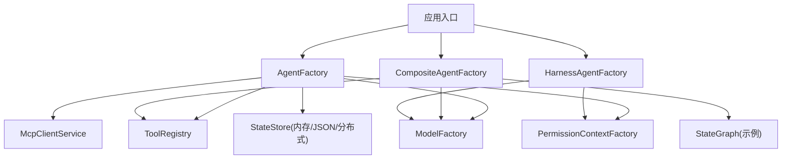
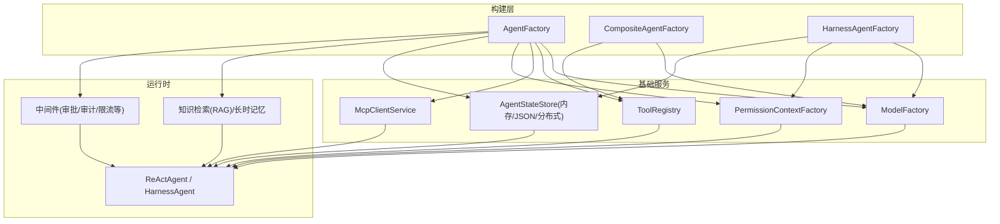
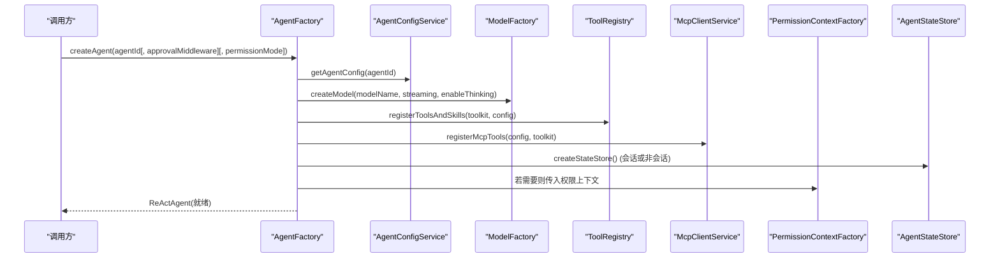
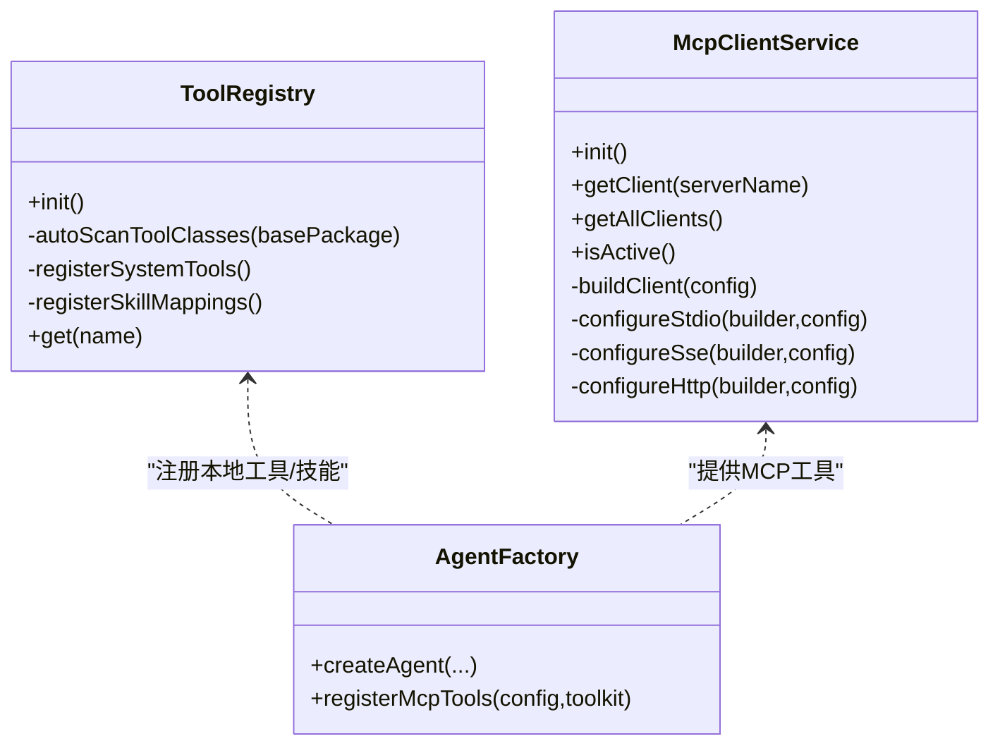
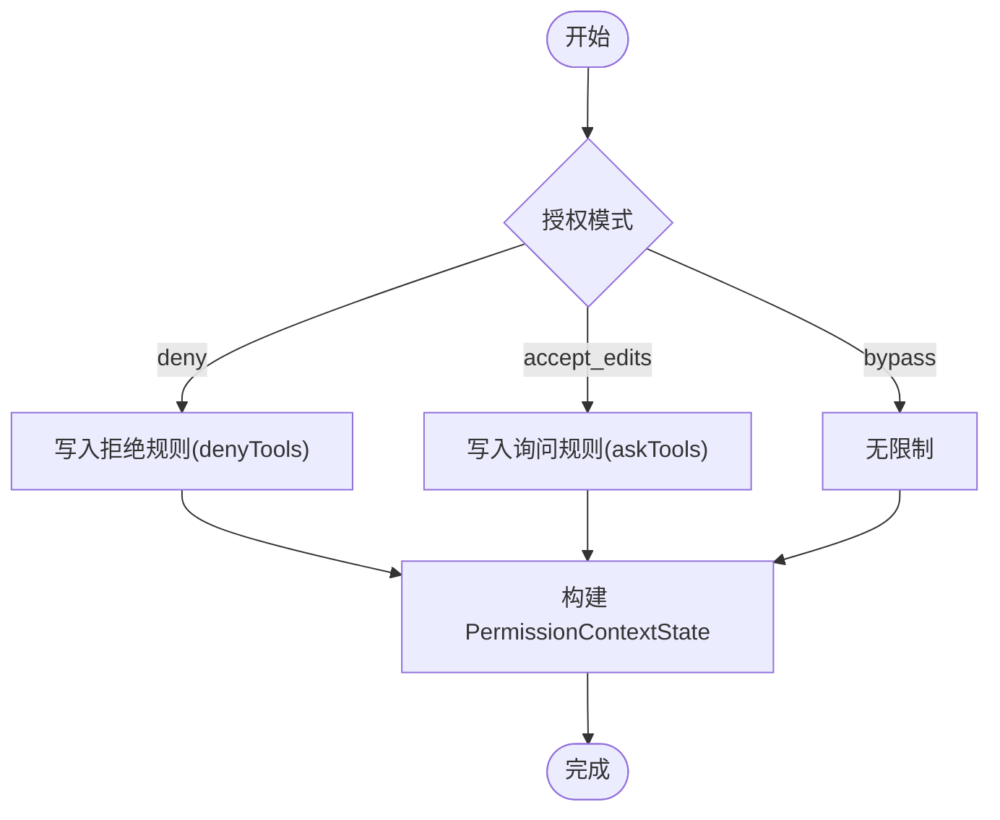
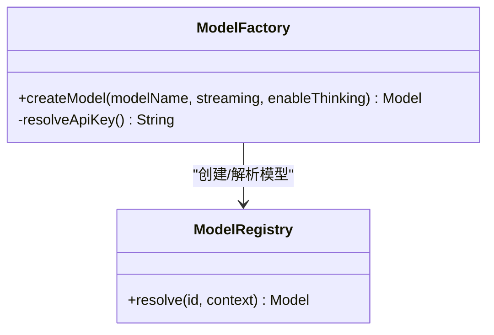
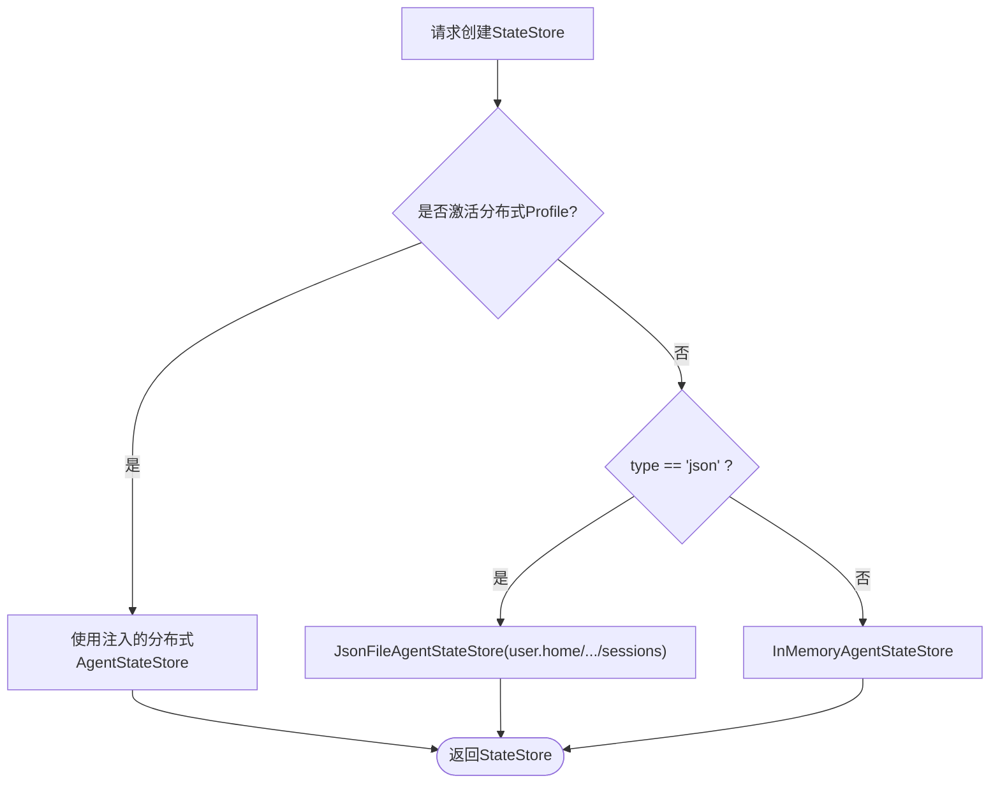
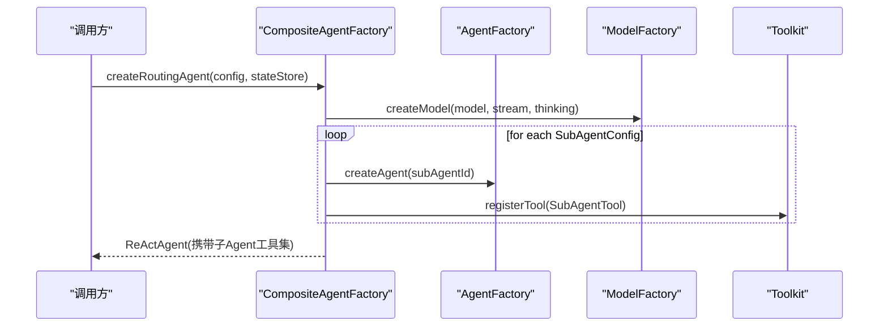
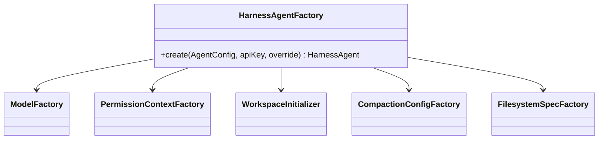
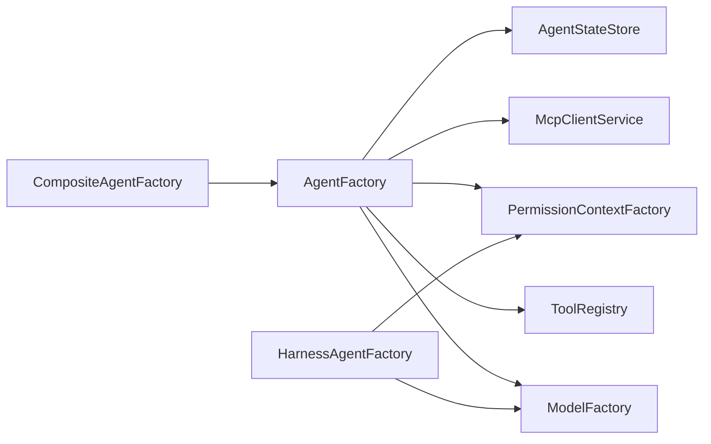

# Agent 工厂系统

<cite>
**本文引用的文件**
- [AgentFactory.java](file://src/main/java/com/skloda/agentscope/agent/AgentFactory.java)
- [AgentType.java](file://src/main/java/com/skloda/agentscope/agent/AgentType.java)
- [CompositeAgentFactory.java](file://src/main/java/com/skloda/agentscope/composite/CompositeAgentFactory.java)
- [ModelFactory.java](file://src/main/java/com/skloda/agentscope/model/ModelFactory.java)
- [ToolRegistry.java](file://src/main/java/com/skloda/agentscope/tool/ToolRegistry.java)
- [McpClientService.java](file://src/main/java/com/skloda/agentscope/mcp/McpClientService.java)
- [PermissionContextFactory.java](file://src/main/java/com/skloda/agentscope/permission/PermissionContextFactory.java)
- [AgentConfig.java](file://src/main/java/com/skloda/agentscope/agent/AgentConfig.java)
- [DistributedStateStoreConfig.java](file://src/main/java/com/skloda/agentscope/config/DistributedStateStoreConfig.java)
- [HarnessAgentFactory.java](file://src/main/java/com/skloda/agentscope/harness/HarnessAgentFactory.java)
- [OrderFulfillmentGraph.java](file://src/main/java/com/skloda/agentscope/composite/graph/OrderFulfillmentGraph.java)
</cite>

## 目录
1. [简介](#简介)
2. [项目结构](#项目结构)
3. [核心组件](#核心组件)
4. [架构总览](#架构总览)
5. [详细组件分析](#详细组件分析)
6. [依赖关系分析](#依赖关系分析)
7. [性能考虑](#性能考虑)
8. [故障排查指南](#故障排查指南)
9. [结论](#结论)
10. [附录](#附录)

## 简介
本章节概述 Agent 工厂系统的目标与设计理念。该系统通过统一的构建入口，为不同协作模式的 Agent（单代理、路由、交接、状态图等）创建 ReActAgent 实例；提供统一的模型抽象层以对接多种 LLM 提供商；实现工具注册与 MCP 工具集成；支持权限上下文注入；并具备可插拔的持久化状态存储方案（内存、JSON 文件、Redis/MySQL/PostgreSQL）。同时给出扩展自定义 Agent 类型的指南。

## 项目结构
整体代码以 Spring Boot + AgentScope 为核心，关键目录说明：
- agent：负责 Agent 配置加载、AgentFactory、AgentType 等
- composite：多 Agent 组合模式（路由、交接、状态图）的实现，以及 CompositeAgentFactory
- model：统一模型工厂 ModelFactory，封装 ModelRegistry
- tool：ToolRegistry 实现工具扫描、注册、技能映射
- mcp：MCP 客户端管理，支持 STDIO/SSE/HTTP 传输
- permission：权限上下文构造器
- harness：HarnessAgent 构建器（沙箱、记忆、压缩、任务清单等能力）
- config：分布式 StateStore 的 Profile 驱动配置

下面是一个高层次的结构概览图（非代码级别映射）：

本节为概念性结构说明，未直接分析具体文件，因此不附加来源。

## 核心组件
- AgentFactory：单代理创建中心，负责装配 Model、Toolkit、工具/技能、RAG、长时记忆、中间件、权限上下文、MCP 工具等；提供会话级和非会话级创建方法。
- CompositeAgentFactory：根据 AgentType 选择路由/交接/状态图等协作模式，动态生成子 Agent 工具与流程图。
- ModelFactory：统一模型抽象层，基于 ModelRegistry 解决 provider 前缀、API Key、流式/推理模式、格式化器等参数。
- ToolRegistry：自动发现 @Tool 注解的方法、注册框架内置工具、从 SKILL.md frontmatter 建立技能到工具的映射。
- McpClientService：读入 mcp-servers.yml，管理多个 MCP 客户端的生命周期，暴露可用工具给 Agent。
- PermissionContextFactory：按策略构建 PermissionContextState（deny/ask/bypass），支持 Agent 级别的权限控制。
- DistributedStateStoreConfig：通过 Spring Profile 切换分布式 StateStore（Redis/MySQL/PostgreSQL）。
- HarnessAgentFactory：面向高级特性的 HarnessAgent 组装（沙箱、计划模式、任务清单、分层记忆、权限等）。

**章节来源**
- [AgentFactory.java:36-204](file://src/main/java/com/skloda/agentscope/agent/AgentFactory.java#L36-L204)
- [CompositeAgentFactory.java:31-210](file://src/main/java/com/skloda/agentscope/composite/CompositeAgentFactory.java#L31-L210)
- [ModelFactory.java:21-95](file://src/main/java/com/skloda/agentscope/model/ModelFactory.java#L21-L95)
- [ToolRegistry.java:23-200](file://src/main/java/com/skloda/agentscope/tool/ToolRegistry.java#L23-L200)
- [McpClientService.java:29-200](file://src/main/java/com/skloda/agentscope/mcp/McpClientService.java#L29-L200)
- [PermissionContextFactory.java:9-39](file://src/main/java/com/skloda/agentscope/permission/PermissionContextFactory.java#L9-L39)
- [DistributedStateStoreConfig.java:43-118](file://src/main/java/com/skloda/agentscope/config/DistributedStateStoreConfig.java#L43-L118)
- [HarnessAgentFactory.java:22-200](file://src/main/java/com/skloda/agentscope/harness/HarnessAgentFactory.java#L22-L200)

## 架构总览
下图展示各工厂及依赖关系，重点体现 ModelFactory、ToolRegistry、MCP 工具、权限上下文在构建链路中的位置。

**图表来源**
- [AgentFactory.java:36-204](file://src/main/java/com/skloda/agentscope/agent/AgentFactory.java#L36-L204)
- [CompositeAgentFactory.java:31-210](file://src/main/java/com/skloda/agentscope/composite/CompositeAgentFactory.java#L31-L210)
- [HarnessAgentFactory.java:22-200](file://src/main/java/com/skloda/agentscope/harness/HarnessAgentFactory.java#L22-L200)
- [ModelFactory.java:21-95](file://src/main/java/com/skloda/agentscope/model/ModelFactory.java#L21-L95)
- [ToolRegistry.java:23-200](file://src/main/java/com/skloda/agentscope/tool/ToolRegistry.java#L23-L200)
- [McpClientService.java:29-200](file://src/main/java/com/skloda/agentscope/mcp/McpClientService.java#L29-L200)
- [PermissionContextFactory.java:9-39](file://src/main/java/com/skloda/agentscope/permission/PermissionContextFactory.java#L9-L39)

**章节来源**
- [AgentFactory.java:36-204](file://src/main/java/com/skloda/agentscope/agent/AgentFactory.java#L36-L204)
- [CompositeAgentFactory.java:31-210](file://src/main/java/com/skloda/agentscope/composite/CompositeAgentFactory.java#L31-L210)
- [HarnessAgentFactory.java:22-200](file://src/main/java/com/skloda/agentscope/harness/HarnessAgentFactory.java#L22-L200)
- [ModelFactory.java:21-95](file://src/main/java/com/skloda/agentscope/model/ModelFactory.java#L21-L95)

## 详细组件分析

### AgentFactory：单 Agent 构建流水线
职责与流程要点：
- 读取 AgentConfig，创建 Model（经 ModelFactory）、初始化 Toolkit
- 先注册本地工具与技能，再注册 MCP 工具，从而保持优先级顺序
- 可选启用 v1 RAG API（带弃用警告），或建议迁移至 Harness MemoryConfig
- 可选开启 PlanNotebook、长时记忆、中间件（如审批）、权限上下文
- 提供会话级与非会话级的 AgentStateStore 选择

**图表来源**
- [AgentFactory.java:97-204](file://src/main/java/com/skloda/agentscope/agent/AgentFactory.java#L97-L204)

**章节来源**
- [AgentFactory.java:36-204](file://src/main/java/com/skloda/agentscope/agent/AgentFactory.java#L36-L204)
- [AgentConfig.java:62-96](file://src/main/java/com/skloda/agentscope/agent/AgentConfig.java#L62-L96)

### 工具注册机制与 MCP 集成
- ToolRegistry 启动分三阶段：
  - 自动扫描用户工具的 @Tool 方法与类名绑定
  - 注册 AgentScope 框架自带文件系统/编码工具
  - 从 classpath:skills/*/SKILL.md 解析 frontmatter，将“技能名”映射到其包含的工具列表
- McpClientService：读入 mcp-servers.yml，根据 transport（STDIO/SSE/HTTP）构建并缓存 McpClientWrapper，启动时启用，销毁时关闭。支持 header/queryParam 的环境变量占位符替换。
- AgentFactory 在装配时先本地工具/技能后 MCP 工具，保证本地优先语义。

**图表来源**
- [ToolRegistry.java:23-200](file://src/main/java/com/skloda/agentscope/tool/ToolRegistry.java#L23-L200)
- [McpClientService.java:29-200](file://src/main/java/com/skloda/agentscope/mcp/McpClientService.java#L29-L200)
- [AgentFactory.java:151-156](file://src/main/java/com/skloda/agentscope/agent/AgentFactory.java#L151-L156)

**章节来源**
- [ToolRegistry.java:23-200](file://src/main/java/com/skloda/agentscope/tool/ToolRegistry.java#L23-L200)
- [McpClientService.java:29-200](file://src/main/java/com/skloda/agentscope/mcp/McpClientService.java#L29-L200)
- [AgentFactory.java:145-156](file://src/main/java/com/skloda/agentscope/agent/AgentFactory.java#L145-L156)

### 权限上下文注入
- PermissionContextFactory 接受默认模式（bypass/accept_edits/deny_all 等）与 deny/ask 工具白名单/黑名单列表，产出 PermissionContextState。
- AgentFactory/HarnessAgentFactory 可将该上下文注入到 Agent，以实现工具调用前的策略拦截。

**图表来源**
- [PermissionContextFactory.java:9-39](file://src/main/java/com/skloda/agentscope/permission/PermissionContextFactory.java#L9-L39)

**章节来源**
- [PermissionContextFactory.java:9-39](file://src/main/java/com/skloda/agentscope/permission/PermissionContextFactory.java#L9-L39)
- [AgentConfig.java:91-96](file://src/main/java/com/skloda/agentscope/agent/AgentConfig.java#L91-L96)

### ModelFactory：统一模型抽象层
- 以 ModelRegistry 为中心，统一处理 provider 前缀解析（缺省时自动补全 dashscope）、API Key 来源（配置/环境变量）、流式与推理开关、Formatter（DashScopeChatFormatter）。
- 对上层组件屏蔽 provider 细节，新增模型只需配置 modelName 或 Provider 前缀即可使用。

**图表来源**
- [ModelFactory.java:21-95](file://src/main/java/com/skloda/agentscope/model/ModelFactory.java#L21-L95)

**章节来源**
- [ModelFactory.java:21-95](file://src/main/java/com/skloda/agentscope/model/ModelFactory.java#L21-L95)

### AgentStateStore：状态存储选择逻辑
- AgentFactory 默认使用 InMemoryAgentStateStore；当外部传入 stateStore 或指定类型为 json 时分别选用对应实现。
- 当分布式 Profile 激活时（redis/mysql/postgresql），@Autowired(required=false) 注入的分布式 AgentStateStore 将优先被采用；否则退化为内存/文件。
- DistributedStateStoreConfig 通过 Profile 驱动创建对应 Bean。

**图表来源**
- [AgentFactory.java:76-92](file://src/main/java/com/skloda/agentscope/agent/AgentFactory.java#L76-L92)
- [DistributedStateStoreConfig.java:43-118](file://src/main/java/com/skloda/agentscope/config/DistributedStateStoreConfig.java#L43-L118)

**章节来源**
- [AgentFactory.java:76-92](file://src/main/java/com/skloda/agentscope/agent/AgentFactory.java#L76-L92)
- [DistributedStateStoreConfig.java:43-118](file://src/main/java/com/skloda/agentscope/config/DistributedStateStoreConfig.java#L43-L118)

### CompositeAgentFactory：多 Agent 协作类型与运行模式
- SINGLE：委托 AgentFactory 创建单一 ReActAgent，支持 Session 级别持久化与权限注入。
- ROUTING：动态创建若干子 Agent，并使用 SubAgentTool 将其注册为可调用工具；主 Agent 承担路由决策。
- HANDOFFS：通过配置传递手移交接策略（结合 TriggerType/HandoffTrigger）。
- STATE_GRAPH：根据 states 配置构建有序的状态机图（示例 OrderFulfillmentGraph）。
- SEQUENTIAL/PARALLEL/DEBATE/LOOP/MSG_HUB/SUBAGENT_SEQ/SUBAGENT_PAR：在 2.0 迁移期间暂时禁用 pipeline 相关实现，后续将以 subagent/middleware 方式重构。

**图表来源**
- [CompositeAgentFactory.java:115-191](file://src/main/java/com/skloda/agentscope/composite/CompositeAgentFactory.java#L115-L191)

**章节来源**
- [CompositeAgentFactory.java:31-210](file://src/main/java/com/skloda/agentscope/composite/CompositeAgentFactory.java#L31-L210)
- [AgentType.java:1-26](file://src/main/java/com/skloda/agentscope/agent/AgentType.java#L1-L26)

### HarnessAgentFactory：高级特性工厂
- 统一通过 ModelFactory 创建模型；支持工作区模板初始化、沙箱文件系统（Local/Docker）、压缩、结果淘汰、Task List、Plan Mode、分层记忆、权限上下文、SkillRepository、额外上下文文件等。
- 用于生产级复杂 Agent 场景（隔离执行环境、结构化输出、强约束等）。

**图表来源**
- [HarnessAgentFactory.java:22-200](file://src/main/java/com/skloda/agentscope/harness/HarnessAgentFactory.java#L22-L200)

**章节来源**
- [HarnessAgentFactory.java:22-200](file://src/main/java/com/skloda/agentscope/harness/HarnessAgentFactory.java#L22-L200)

### 扩展指南：如何新增自定义 Agent 类型
推荐做法：
- 若仅需扩展工具/技能：在 tool 包增加带有 @Tool 方法的类，ToolRegistry 会自动扫描并注册；在 skills 下新建 SKILL.md frontmatter 定义技能名与工具映射。
- 若需新的多 Agent 协作模式：参考 CompositeAgentFactory 中 routing/graph 的实现，利用 ReActAgent.Builder/SubAgentTool/StateGraphRuntime 等方式组合；在 AgentType 中添加枚举值并在路由层分发。
- 若需新的模型后端：在 ModelFactory 中增加 provider 前缀处理或在 ModelRegistry 下扩展相应 Provider；通过 modelName 的前缀/裸名统一管理。
- 若需扩展权限策略：在 PermissionContextFactory 中新增模式映射或策略规则，并通过 AgentConfig.PermissionConfig 配置。
- 若需改变状态存储策略：通过 DistributedStateStoreConfig 新增 Profile 或复用现有 Bean 注入方式，由 AgentFactory 优先选用分布式实现。

[本节为通用实践建议，未直接分析具体代码片段，因此不附加来源]

## 依赖关系分析
AgentFactory 与工具生态、模型、MCP、权限、存储之间的耦合情况如下：
- 与 ModelFactory 低耦合：仅通过统一接口创建 Model
- 与 ToolRegistry 解耦：通过 Toolkit.registerTool 动态加入
- 与 McpClientService 松耦合：按需启用 MCP 功能
- 与 PermissionContextFactory 弱耦合：按需注入权限上下文
- 与 AgentStateStore：根据 profile 与类型选择存储后端，零侵入

**图表来源**
- [AgentFactory.java:36-204](file://src/main/java/com/skloda/agentscope/agent/AgentFactory.java#L36-L204)
- [CompositeAgentFactory.java:31-210](file://src/main/java/com/skloda/agentscope/composite/CompositeAgentFactory.java#L31-L210)
- [HarnessAgentFactory.java:22-200](file://src/main/java/com/skloda/agentscope/harness/HarnessAgentFactory.java#L22-L200)
- [ModelFactory.java:21-95](file://src/main/java/com/skloda/agentscope/model/ModelFactory.java#L21-L95)
- [ToolRegistry.java:23-200](file://src/main/java/com/skloda/agentscope/tool/ToolRegistry.java#L23-L200)
- [McpClientService.java:29-200](file://src/main/java/com/skloda/agentscope/mcp/McpClientService.java#L29-L200)
- [PermissionContextFactory.java:9-39](file://src/main/java/com/skloda/agentscope/permission/PermissionContextFactory.java#L9-L39)

**章节来源**
- [AgentFactory.java:36-204](file://src/main/java/com/skloda/agentscope/agent/AgentFactory.java#L36-L204)
- [CompositeAgentFactory.java:31-210](file://src/main/java/com/skloda/agentscope/composite/CompositeAgentFactory.java#L31-L210)
- [HarnessAgentFactory.java:22-200](file://src/main/java/com/skloda/agentscope/harness/HarnessAgentFactory.java#L22-L200)
- [ModelFactory.java:21-95](file://src/main/java/com/skloda/agentscope/model/ModelFactory.java#L21-L95)
- [ToolRegistry.java:23-200](file://src/main/java/com/skloda/agentscope/tool/ToolRegistry.java#L23-L200)
- [McpClientService.java:29-200](file://src/main/java/com/skloda/agentscope/mcp/McpClientService.java#L29-L200)
- [PermissionContextFactory.java:9-39](file://src/main/java/com/skloda/agentscope/permission/PermissionContextFactory.java#L9-L39)

## 性能考虑
- 模型复用：ModelFactory 可在更高层缓存 Model 实例以避免重复创建（当前每个调用处独立创建）。
- 工具注册延迟：ToolRegistry 一次性完成扫描和注册，避免运行期开销。
- MCP 客户端连接池：McpClientService 维护已初始化客户端集合，减少重建成本。
- 状态存储：分布式 StateStore 提升跨进程/节点一致性，但引入网络延迟；单机可优先 InMemory/JsonFile。
- 长时记忆与 RAG：启用长时记忆/RAG 会带来额外检索成本，应按需控制检索数量与阈值。

[本节提供一般性指导，无需具体源码分析]

## 故障排查指南
- Model 初始化失败：检查 ModelFactory.resolveApiKey 与 provider 名称前缀是否正确（例如 bare name 将被自动添加 dashscope: 前缀）。
- MCP 工具不可用：确认 agentscope.mcp.enabled=true 且 mcp-servers.yml 中服务器名称、transport、命令/URL 配置正确；留意占位符 ${ENV_VAR} 是否存在。
- 权限异常：检查 PermissionContextFactory 构建的参数与 AgentConfig.PermissionConfig 的设置是否符合预期。
- 状态持久化未生效：确认是否注入了分布式 AgentStateStore 且 Profile 激活；若使用 JSON 模式，请确保 user.home/.agentscope/demo-sessions 路径可写。
- 路由/交接无效：核查 CompositeAgentFactory 中是否有足够的 SubAgentConfig，并确保子 Agent 可用（模型、工具均已装配）。

**章节来源**
- [ModelFactory.java:66-94](file://src/main/java/com/skloda/agentscope/model/ModelFactory.java#L66-L94)
- [McpClientService.java:43-77](file://src/main/java/com/skloda/agentscope/mcp/McpClientService.java#L43-L77)
- [PermissionContextFactory.java:9-39](file://src/main/java/com/skloda/agentscope/permission/PermissionContextFactory.java#L9-L39)
- [AgentFactory.java:76-92](file://src/main/java/com/skloda/agentscope/agent/AgentFactory.java#L76-L92)
- [CompositeAgentFactory.java:115-191](file://src/main/java/com/skloda/agentscope/composite/CompositeAgentFactory.java#L115-L191)

## 结论
本工厂系统以 AgentFactory 为中心，配合 CompositeAgentFactory 和 HarnessAgentFactory，提供了覆盖单体、路由、交接、状态图等多元协作模式的 Agent 构建能力。通过 ModelFactory 实现统一的模型抽象，通过 ToolRegistry 和 McpClientService 形成可扩展的工具生态，通过 PermissionContextFactory 实现细粒度权限控制，并结合分布式 Profile 驱动的状态存储策略，满足从单机到分布式生产环境的多样化需求。遵循本文的扩展指南，可以较低成本地添加新模型、新工具、新策略与新协作模式。

[本节总结不涉及具体源码分析]

## 附录
- 常用配置文件参考：agents.yml（单代理）、mcp-servers.yml（MCP 服务端配置）
- 关键类速查：
  - 单代理创建：AgentFactory
  - 多代理协同：CompositeAgentFactory
  - 模型抽象：ModelFactory
  - 工具注册：ToolRegistry
  - MCP 管理：McpClientService
  - 权限上下文：PermissionContextFactory
  - 状态存储：DistributedStateStoreConfig

[本节为补充说明，不直接分析具体代码]