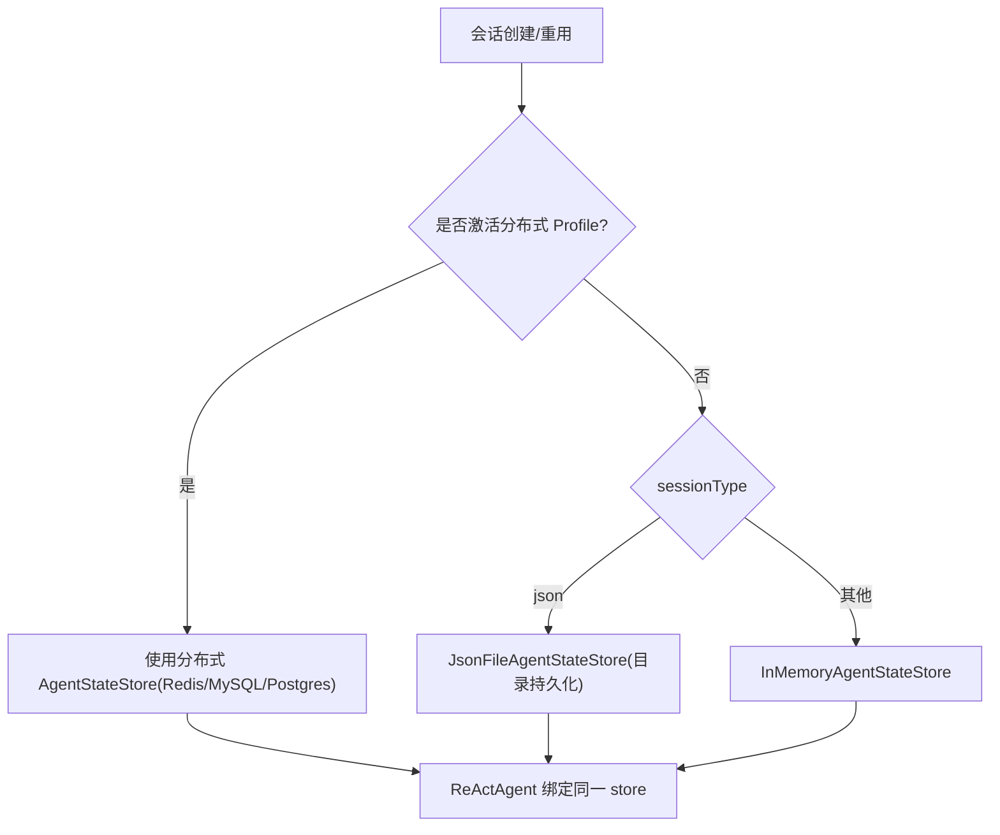
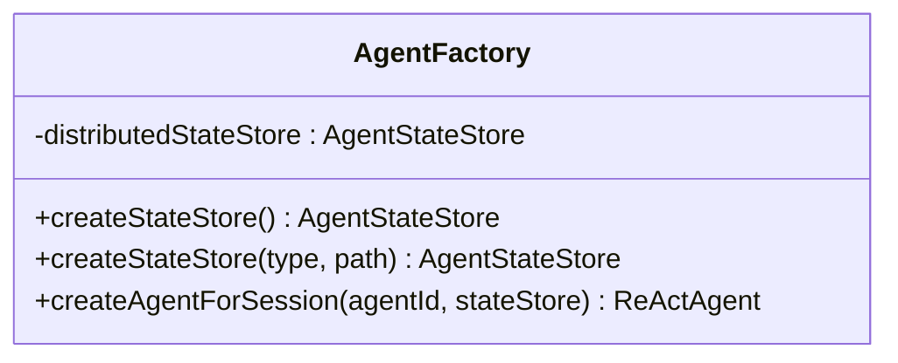
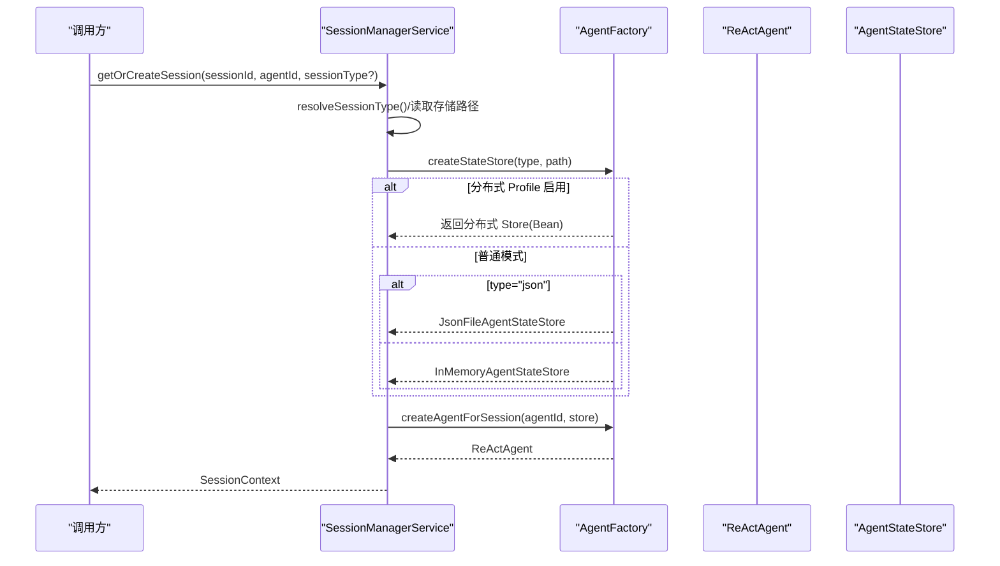
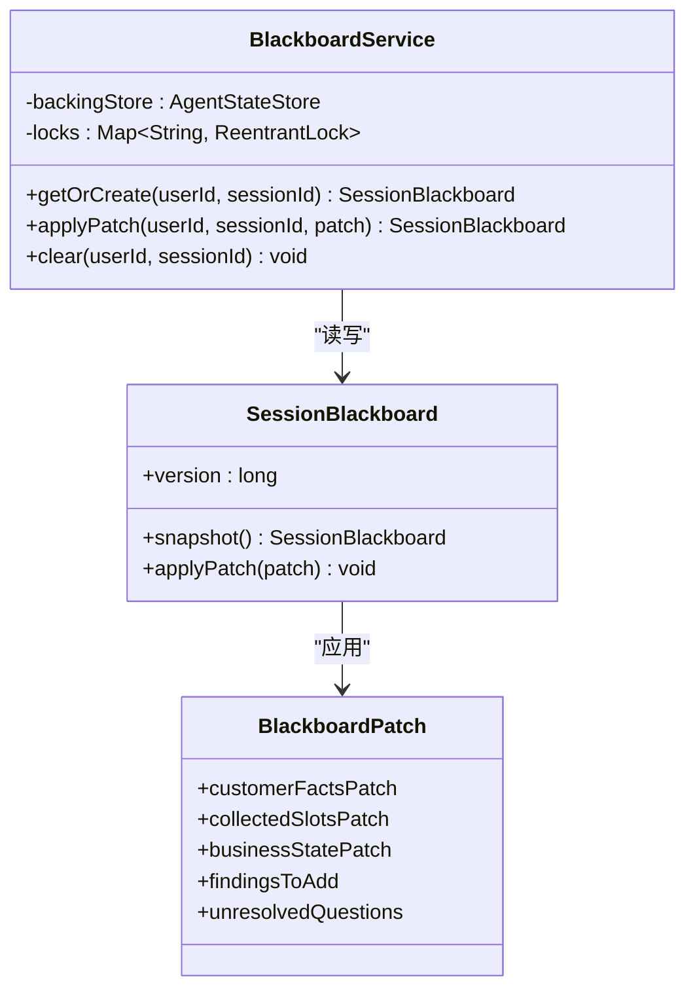
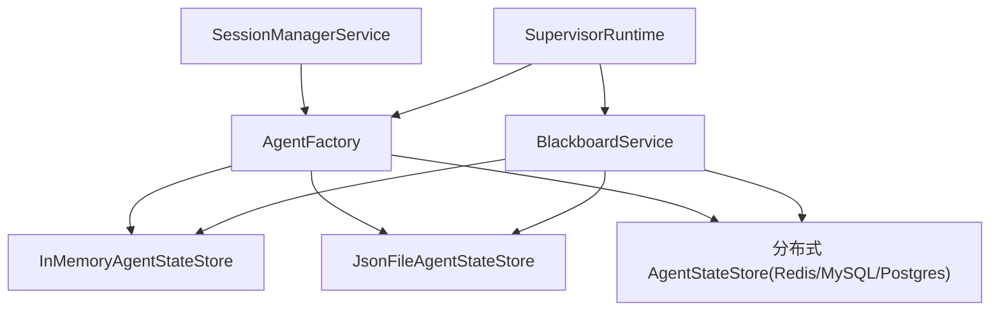

# Agent 状态管理

<cite>
**本文档引用的文件**
- [AgentFactory.java](file://src/main/java/com/skloda/agentscope/agent/AgentFactory.java)
- [SessionManagerService.java](file://src/main/java/com/skloda/agentscope/service/SessionManagerService.java)
- [DistributedStateStoreConfig.java](file://src/main/java/com/skloda/agentscope/config/DistributedStateStoreConfig.java)
- [BlackboardService.java](file://src/main/java/com/skloda/agentscope/blackboard/BlackboardService.java)
- [SessionBlackboard.java](file://src/main/java/com/skloda/agentscope/blackboard/SessionBlackboard.java)
- [BlackboardPatch.java](file://src/main/java/com/skloda/agentscope/blackboard/BlackboardPatch.java)
- [SupervisorRuntime.java](file://src/main/java/com/skloda/agentscope/blackboard/SupervisorRuntime.java)
- [application-redis.yml](file://src/main/resources/application-redis.yml)
- [pom.xml](file://pom.xml)
</cite>

## 目录
1. [引言](#引言)
2. [项目结构中与状态相关的关键组件](#项目结构中与状态相关的关键组件)
3. [核心机制总览：多策略存储与切换](#核心机制总览多策略存储与切换)
4. [详细组件分析](#详细组件分析)
5. [依赖关系图](#依赖关系图)
6. [性能特征与基准建议](#性能特征与基准建议)
7. [并发一致性与会话隔离](#并发一致性与会话隔离)
8. [序列化与反序列化](#序列化与反序列化)
9. [分布式环境下的同步与故障转移](#分布式环境下的同步与故障转移)
10. [故障排查指南](#故障排查指南)
11. [结论](#结论)

## 引言
本技术文档聚焦 Agent 状态管理的多策略实现与工程化细节，围绕以下目标展开：
- 梳理 AgentScope 状态存储的三种主要策略：InMemory（内存）、JsonFile（本地文件）、分布式后端（Redis/MySQL/PostgreSQL）
- 说明不同策略的选择、适用场景、一致性特征与性能权衡
- 解释状态数据在 AgentStateStore SPI 下的序列化和反序列化约定
- 设计并解释“按 (userId, sessionId) 隔离”的会话边界与并发安全机制
- 提供分布式部署下的一致性保障、同步和故障转移建议
- 给出可执行的基准测试思路与优化建议

## 项目结构中与状态相关的关键组件
- AgentFactory：根据 sessionType 及全局分布式 Profile 决定使用 InMemory、JsonFile 或分布式 AgentStateStore
- SessionManagerService：创建和管理 SessionContext，包含 ReActAgent、AgentStateStore 与会话类型解析与迁移
- DistributedStateStoreConfig：通过 Spring Profile 注入 Redis/MySQL/PostgreSQL 的 AgentStateStore Bean
- BlackboardService + SessionBlackboard：跨专家共享业务黑板的读/写服务与数据结构，封装序列化访问键与并发控制
- SupervisorRuntime：Supervisor 运行期，串行化路由与 Patch 应用，确保每个会话的状态变更有序

**Section sources**
- [AgentFactory.java:76-107](file://src/main/java/com/skloda/agentscope/agent/AgentFactory.java#L76-L107)
- [SessionManagerService.java:75-145](file://src/main/java/com/skloda/agentscope/service/SessionManagerService.java#L75-L145)
- [DistributedStateStoreConfig.java:43-118](file://src/main/java/com/skloda/agentscope/config/DistributedStateStoreConfig.java#L43-L118)
- [BlackboardService.java:44-134](file://src/main/java/com/skloda/agentscope/blackboard/BlackboardService.java#L44-L134)
- [SessionBlackboard.java:40-172](file://src/main/java/com/skloda/agentscope/blackboard/SessionBlackboard.java#L40-L172)
- [SupervisorRuntime.java:90-127](file://src/main/java/com/skloda/agentscope/blackboard/SupervisorRuntime.java#L90-L127)

## 核心机制总览：多策略存储与切换
- 默认行为：若无激活的分布式 Profile，则按 sessionType 选择 InMemory（默认 memory）或 JsonFile（type=json）。
- 分布式行为：当 spring.profiles.active=redis|mysql|postgresql 时，Spring 容器会提供对应的 AgentStateStore Bean；AgentFactory 在 createStateStore(type, path) 中优先使用该 Bean，实现“统一接入点 + 零侵入切换”。
- 会话类型解析：SessionManagerService 从 AgentConfig.SessionConfig 读取 defaultType 与 storagePath；请求时可覆盖。迁移时基于新类型重建 AgentStateStore 与 ReActAgent。

**Diagram sources**
- [AgentFactory.java:80-92](file://src/main/java/com/skloda/agentscope/agent/AgentFactory.java#L80-L92)
- [DistributedStateStoreConfig.java:43-118](file://src/main/java/com/skloda/agentscope/config/DistributedStateStoreConfig.java#L43-L118)
- [SessionManagerService.java:151-145](file://src/main/java/com/skloda/agentscope/service/SessionManagerService.java#L151-L145)

**Section sources**
- [AgentFactory.java:50-92](file://src/main/java/com/skloda/agentscope/agent/AgentFactory.java#L50-L92)
- [SessionManagerService.java:126-155](file://src/main/java/com/skloda/agentscope/service/SessionManagerService.java#L126-L155)
- [application-redis.yml:1-17](file://src/main/resources/application-redis.yml#L1-L17)

## 详细组件分析

### AgentFactory：存储策略装配器
- 职责：暴露 createStateStore() 与 createStateStore(type, path)，根据全局 Bean 优先级和本地 type 决议实际存储实现。
- 关键行为：
  - 存在分布式 Bean 则优先返回该 Bean（支持 redis/mysql/postgresql）。
  - type="json" 且无分布式 Bean 时使用 JsonFile 持久化；否则使用 InMemory。
  - createAgentForSession 将指定 stateStore 注入 ReActAgent 以建立“会话级状态”共享。

**Diagram sources**
- [AgentFactory.java:50-107](file://src/main/java/com/skloda/agentscope/agent/AgentFactory.java#L50-L107)

**Section sources**
- [AgentFactory.java:76-107](file://src/main/java/com/skloda/agentscope/agent/AgentFactory.java#L76-L107)

### SessionManagerService：会话与存储生命周期
- 维护进程内的活跃会话映射（ConcurrentHashMap），持有 sessionId→SessionContext。
- 会话创建流程：
  - 解析 agentId 对应配置的 SessionConfig.defaultType 与 storagePath。
  - 调用 AgentFactory.createStateStore 获取后端实例，再用 createAgentForSession 构建 ReActAgent。
  - 若检测到 sessionType 变更，触发迁移：用新 type/path 重建 store 与 agent，替换上下文。
- 会话列表/删除/最近访问时间等元信息管理。

**Diagram sources**
- [SessionManagerService.java:75-145](file://src/main/java/com/skloda/agentscope/service/SessionManagerService.java#L75-L145)
- [AgentFactory.java:80-107](file://src/main/java/com/skloda/agentscope/agent/AgentFactory.java#L80-L107)

**Section sources**
- [SessionManagerService.java:75-145](file://src/main/java/com/skloda/agentscope/service/SessionManagerService.java#L75-L145)

### 分布式 AgentStateStore 配置（Redis/MySQL/PostgreSQL）
- 通过 @Profile("redis|mysql|postgresql") 启用对应 Bean：
  - Redis：JedisPooled + RedisAgentStateStore。
  - MySQL/PostgreSQL：DataSource 构建 + 对应扩展 Store。
- application-redis.yml 中通过 agentscope.session.type=redis 覆盖默认行为，便于演示一键切换。
- pom.xml 引入相应扩展依赖，使编译期可用、运行时按需加载。

**Section sources**
- [DistributedStateStoreConfig.java:43-118](file://src/main/java/com/skloda/agentscope/config/DistributedStateStoreConfig.java#L43-L118)
- [application-redis.yml:1-17](file://src/main/resources/application-redis.yml#L1-L17)
- [pom.xml:146-170](file://pom.xml#L146-L170)

### 共享黑板（Supervisor/Expert）：并发与安全写入
- BlackboardService 以 (userId, sessionId) 为槽位键，串行执行 Patch 应用，保证版本号单调递增与最终一致。
- SessionBlackboard：携带 version、业务字段集合、时间戳；读写均做防御性拷贝，避免外部突变。
- BlackboardPatch：只描述增量变更，null 值语义为删除/不变；由 Supervisor 唯一写入，专家不直接操作底层存储。

**Diagram sources**
- [BlackboardService.java:44-134](file://src/main/java/com/skloda/agentscope/blackboard/BlackboardService.java#L44-L134)
- [SessionBlackboard.java:89-172](file://src/main/java/com/skloda/agentscope/blackboard/SessionBlackboard.java#L89-L172)
- [BlackboardPatch.java:29-90](file://src/main/java/com/skloda/agentscope/blackboard/BlackboardPatch.java#L29-L90)

**Section sources**
- [BlackboardService.java:18-134](file://src/main/java/com/skloda/agentscope/blackboard/BlackboardService.java#L18-L134)
- [SessionBlackboard.java:40-172](file://src/main/java/com/skloda/agentscope/blackboard/SessionBlackboard.java#L40-L172)
- [BlackboardPatch.java:29-120](file://src/main/java/com/skloda/agentscope/blackboard/BlackboardPatch.java#L29-L120)

### Supervisor 运行期：会话锁与事件编排
- 每 (userId, sessionId) 一个 ReentrantLock，串行化路由决策、专家调用、Patch 写入、状态保存，避免并发竞态。
- 将 Supervisor 自身会话状态存入其 own AgentStateStore（key 固定）；共享黑板存于另一个 key，互不干扰。
- 事件流中过滤专家侧事件类型，保证前端渲染正确，并记录路由与版本信息。

**Section sources**
- [SupervisorRuntime.java:60-127](file://src/main/java/com/skloda/agentscope/blackboard/SupervisorRuntime.java#L60-L127)
- [SupervisorRuntime.java:129-205](file://src/main/java/com/skloda/agentscope/blackboard/SupervisorRuntime.java#L129-L205)

## 依赖关系图

**Diagram sources**
- [SessionManagerService.java:75-145](file://src/main/java/com/skloda/agentscope/service/SessionManagerService.java#L75-L145)
- [AgentFactory.java:80-107](file://src/main/java/com/skloda/agentscope/agent/AgentFactory.java#L80-L107)
- [BlackboardService.java:44-134](file://src/main/java/com/skloda/agentscope/blackboard/BlackboardService.java#L44-L134)
- [SupervisorRuntime.java:60-127](file://src/main/java/com/skloda/agentscope/blackboard/SupervisorRuntime.java#L60-L127)

## 性能特征与基准建议
- 内存存储（InMemory）：
  - 优势：零 I/O、极低延迟、适合开发调试与单实例高吞吐场景。
  - 局限：重启即失；进程间不可共享。
- 文件持久化（JsonFile）：
  - 优势：进程内共享磁盘文件即可跨进程恢复；易观测与冷备。
  - 局限：磁盘随机写/大对象序列化开销较高；高并发写入需关注文件系统性能与文件粒度。
- 分布式后端：
  - Redis：键值型存储，低延迟、高吞吐，适合热点会话；注意键前缀隔离与内存水位监控。
  - MySQL/PostgreSQL：强一致性与事务能力更佳，持久化安全；但网络与 SQL 开销高于 Redis，适合复杂查询和审计。
- 建议基线测试维度：
  - 读写 RT/P99 与 QPS（单位会话 vs 全量聚合）
  - 大对象（JSON 状态/附件）序列化时间与压缩策略评估
  - 并发写入 Hot-key 冲突（通过版本号/锁）下的退化曲线
  - 缓存命中率（如 Redis）、连接池耗尽风险
  - I/O 抖动对尾延时的影响（尤其 JsonFile）

[本节为通用性能指导，无需代码文件引用]

## 并发一致性与会话隔离
- 进程内隔离：
  - 会话级隔离：SessionManagerService 通过 sessionId 区分，结合 AgentStateStore 的 userId/sessionId/key 三维键空间，实现多用户多会话并存。
  - 共享黑板并发：BlackboardService 在 withLock 中使用 per-slot ReentrantLock 串行化 applyPatch；SessionBlackboard 内部版本自增，防止乱序覆盖。
  - 专家私有状态：每次专家执行都拥有独立 InMemoryAgentStateStore，避免跨专家状态泄漏。
- 分布式一致性：
  - 当前跨进程未提供 CAS；仅能保证单次请求内串行。建议在应用层使用会话级锁（网关/服务层）避免重入并发修改。
  - Redis 模式下建议开启客户端重试/幂等写；DB 模式可考虑基于版本的乐观锁。

**Section sources**
- [SessionManagerService.java:33-73](file://src/main/java/com/skloda/agentscope/service/SessionManagerService.java#L33-L73)
- [BlackboardService.java:96-134](file://src/main/java/com/skloda/agentscope/blackboard/BlackboardService.java#L96-L134)
- [SessionBlackboard.java:121-172](file://src/main/java/com/skloda/agentscope/blackboard/SessionBlackboard.java#L121-L172)

## 序列化与反序列化
- SessionBlackboard 与 BlackboardPatch 均使用 Jackson 注解进行 JSON 序列化（JsonCreator/JsonProperty）。
- BlackboardService 存取键遵循 “shared_blackboard”（可配置），严格区别于 supervisor 的 “agent_state”，避免命名冲突。
- 读写路径：
  - 读：返回防御副本（snapshot），避免外部误改内部可变集合。
  - 写：重建可变副本 → 应用 Patch → 重新保存。此过程在锁保护下执行，保证可见性。
- 分布式 Store 将 State 对象序列化为后端格式（Redis Hash/String、SQL LOB/JSONB 取决于具体实现），上层无需感知。

**Section sources**
- [SessionBlackboard.java:64-87](file://src/main/java/com/skloda/agentscope/blackboard/SessionBlackboard.java#L64-L87)
- [BlackboardService.java:44-70](file://src/main/java/com/skloda/agentscope/blackboard/BlackboardService.java#L44-L70)
- [BlackboardService.java:96-134](file://src/main/java/com/skloda/agentscope/blackboard/BlackboardService.java#L96-L134)

## 分布式环境下的同步与故障转移
- 模式概述：
  - Redis：轻量、快速；通过 key-prefix 划分租户/环境；故障时主节点挂掉需要切换到备用节点或哨兵/集群，需在应用配置中体现高可用拓扑。
  - MySQL/PostgreSQL：具备强一致性与可审计；可通过数据库复制/分区提升可用性，必要时启用只读副本提高读性能。
- 状态同步策略：
  - 会话内顺序：SupervisorRuntime 已在本机层面将路由、专家调用与黑板写入串行化；分布式环境下请配合网关/服务层的会话粘性与会话级锁（例如基于会话 ID 的行锁/键锁）。
  - 跨节点回滚：分布式存储通常不具备内置的事务范围跨越多个代理步骤；应通过工作流层面的重试与幂等进行补偿。
- 故障转移建议：
  - Redis：启用 Sentinel 或 Cluster；客户端失败切换超时时间配置合理阈值；备份定期 RDB/AOF。
  - DB：读写分离、主从切换；迁移时采用蓝绿发布，先切读再切写；备份快照+binlog/WAL。

[本节为架构级建议，无直接代码文件引用]

## 性能基准测试设计（建议）
- 用例一：纯会话读写
  - 指标：GET/SET QPS、RT、CPU、GC 停顿、存储 IOPS
  - 对比：InMemory vs JsonFile vs Redis vs MySQL
- 用例二：高频 Patch 合并
  - 指标：并发 Patch QPS、版本冲突率、平均合并耗时
  - 方法：模拟 expert→supervisor→BlackboardService.applyPatch 的热点会话
- 用例三：大对象序列化
  - 指标：大 JSON 对象（消息历史/工具输出）序列/反序列时间
  - 方法：逐步增大 Payload，评估分片/压缩策略
- 报告产出：RT 分位数（P50/P95/P99）、错误率、资源使用趋势图

[本节为方法论建议，无直接代码文件引用]

## 故障排查指南
- 问题：启动后状态未持久化（期望 json）
  - 确认：sessionType 是否为 json；是否存在被全局分布式 Profile 覆盖的行为；storagePath 是否可达
- 问题：会话状态在不同进程不共享
  - 原因：默认 InMemory 或 JsonFile 在同一主机上的进程共享受限；切换至 Redis/DB 后端
- 问题：并发写入导致状态丢失
  - 定位：是否在 SupervisorRuntime 之外多线程并行 applyPatch；检查是否在同一会话槽位；确保单写者（Supervisor）
- 问题：分布式模式无法注入
  - 排查：spring.profiles.active 是否正确；依赖是否声明；YAML 配置项（URL/凭据）是否齐全

**Section sources**
- [SessionManagerService.java:75-155](file://src/main/java/com/skloda/agentscope/service/SessionManagerService.java#L75-L155)
- [DistributedStateStoreConfig.java:43-118](file://src/main/java/com/skloda/agentscope/config/DistributedStateStoreConfig.java#L43-L118)
- [application-redis.yml:1-17](file://src/main/resources/application-redis.yml#L1-L17)

## 结论
本项目通过统一入口（AgentFactory）、可扩展配置（Spring Profile）、细粒度并发控制（会话级锁）与明确的状态边界（blackboard 与 conversation 分离），实现了稳健的 Agent 状态管理能力。生产部署推荐：
- 开发与单机：InMemory/JsonFile
- 在线高吞吐与水平扩展：Redis 或数据库，按一致性需求选择
- 关键一致性区域（Supervisor）保持串行化处理；分布式状态下配合网关与会话锁达成最终一致

[本节总结陈述，无需代码文件引用]