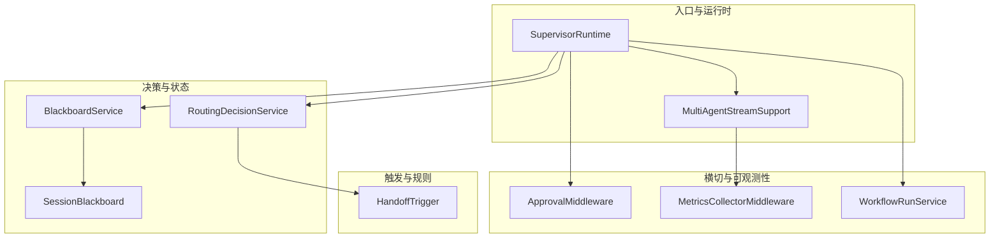
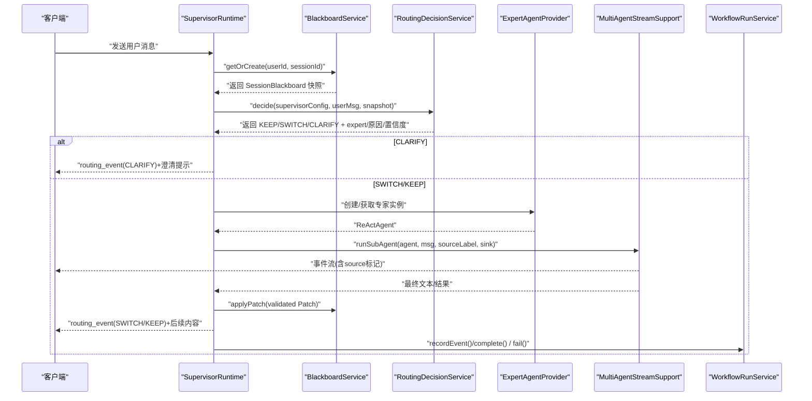
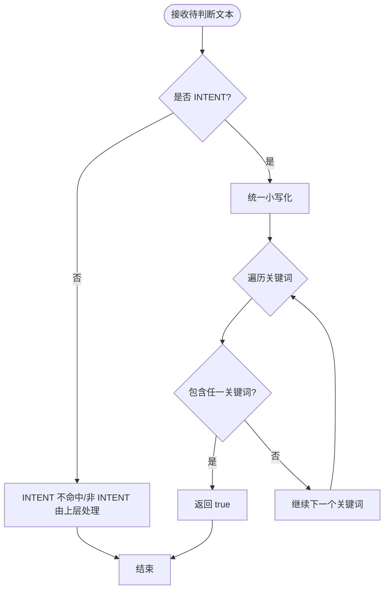
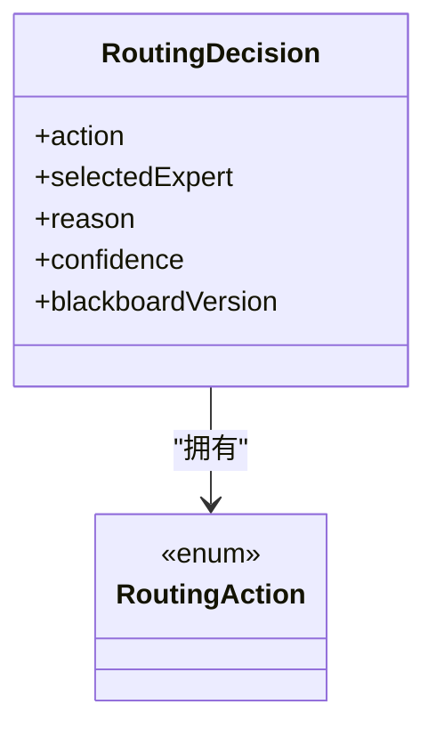
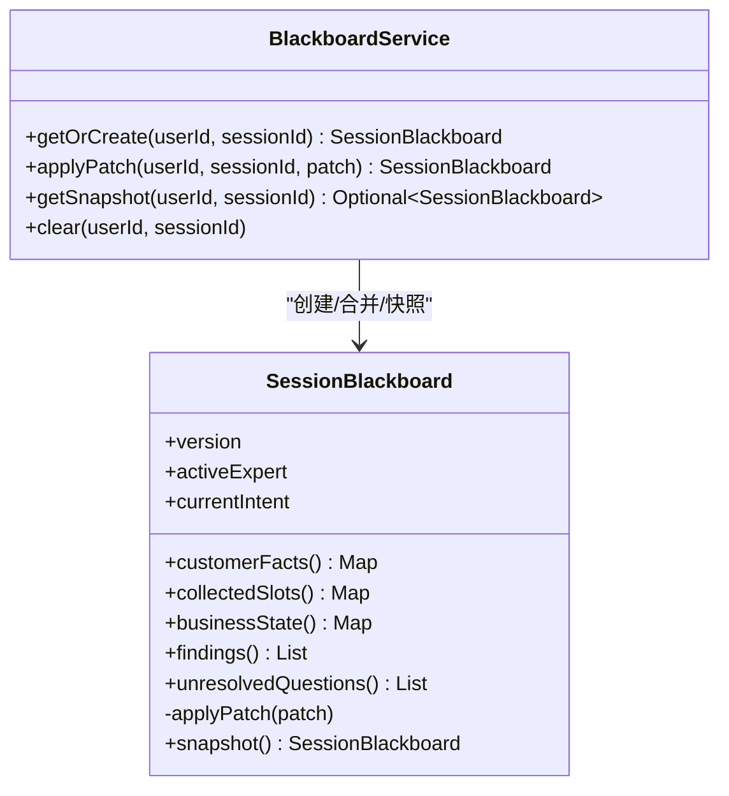
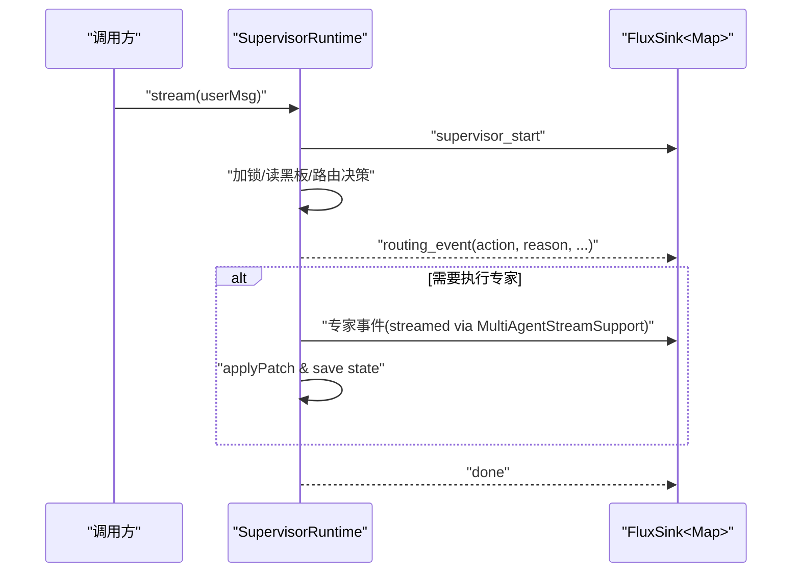
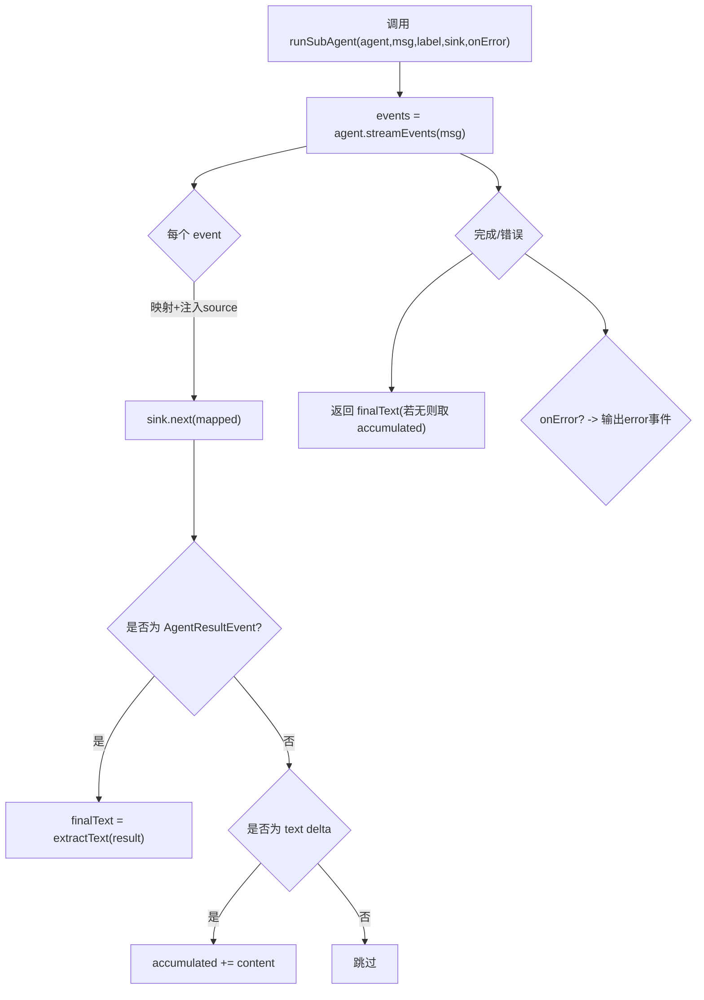
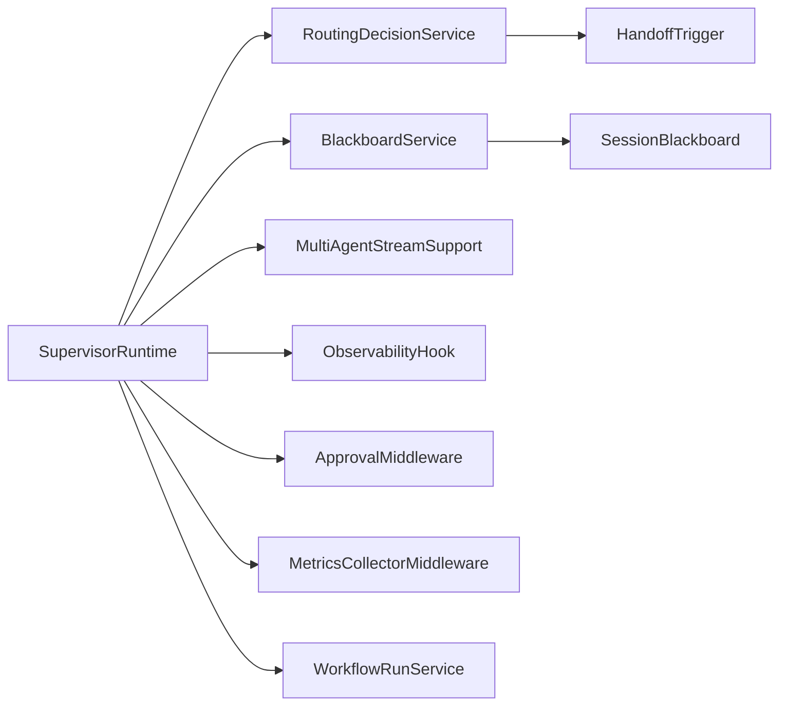

# Agent 交接协调系统

<cite>
**本文引用的文件列表**
- [HandoffTrigger.java](file://src/main/java/com/skloda/agentscope/agent/HandoffTrigger.java)
- [MultiAgentStreamSupport.java](file://src/main/java/com/skloda/agentscope/runtime/MultiAgentStreamSupport.java)
- [RoutingDecisionService.java](file://src/main/java/com/skloda/agentscope/blackboard/RoutingDecisionService.java)
- [SessionBlackboard.java](file://src/main/java/com/skloda/agentscope/blackboard/SessionBlackboard.java)
- [BlackboardService.java](file://src/main/java/com/skloda/agentscope/blackboard/BlackboardService.java)
- [SupervisorRuntime.java](file://src/main/java/com/skloda/agentscope/blackboard/SupervisorRuntime.java)
- [WorkflowRunService.java](file://src/main/java/com/skloda/agentscope/service/WorkflowRunService.java)
- [ApprovalMiddleware.java](file://src/main/java/com/skloda/agentscope/middleware/ApprovalMiddleware.java)
- [MetricsCollectorMiddleware.java](file://src/main/java/com/skloda/agentscope/middleware/MetricsCollectorMiddleware.java)
- [HandoffTriggerTest.java](file://src/test/java/com/skloda/agentscope/agent/HandoffTriggerTest.java)
- [MultiAgentStreamSupportTest.java](file://src/test/java/com/skloda/agentscope/runtime/MultiAgentStreamSupportTest.java)
</cite>

## 目录
1. [引言](#引言)
2. [项目结构](#项目结构)
3. [核心组件](#核心组件)
4. [架构总览](#架构总览)
5. [详细组件分析](#详细组件分析)
6. [依赖关系分析](#依赖关系分析)
7. [性能考量](#性能考量)
8. [故障排查指南](#故障排查指南)
9. [结论](#结论)
10. [附录：实战案例与策略调优](#附录：实战案例与策略调优)

## 引言
本文件系统性地阐述了 Agent 交接协调的设计与实现，重点包括：
- HandoffTrigger 的触发机制、条件判断与状态/上下文传递。
- MultiAgentStreamSupport 的多 Agent 事件流合并、过滤与转发策略。
- 交接过程中的数据一致性保障与错误处理。
- 实际业务场景下的可复用模式（客服转接、审批流程中的移交）。
- 交接策略的调优方法与监控指标，以及健壮交接协议的建议设计。

## 项目结构
该子系统主要分布在 agent、blackboard、runtime、middleware 与 service 五个方向：
- agent 层提供交接触发器与配置。
- blackboard 层提供会话级共享黑板及路由决策能力。
- runtime 层提供多 Agent 的事件桥接与运行编排。
- middleware 层提供审批与度量等横切关注点。
- service 层记录工作流执行快照用于可观测性。

图示来源
- [SupervisorRuntime.java](file://src/main/java/com/skloda/agentscope/blackboard/SupervisorRuntime.java)
- [MultiAgentStreamSupport.java](file://src/main/java/com/skloda/agentscope/runtime/MultiAgentStreamSupport.java)
- [RoutingDecisionService.java](file://src/main/java/com/skloda/agentscope/blackboard/RoutingDecisionService.java)
- [SessionBlackboard.java](file://src/main/java/com/skloda/agentscope/blackboard/SessionBlackboard.java)
- [BlackboardService.java](file://src/main/java/com/skloda/agentscope/blackboard/BlackboardService.java)
- [HandoffTrigger.java](file://src/main/java/com/skloda/agent/HandoffTrigger.java)
- [ApprovalMiddleware.java](file://src/main/java/com/skloda/agentscope/middleware/ApprovalMiddleware.java)
- [MetricsCollectorMiddleware.java](file://src/main/java/com/skloda/agentscope/middleware/MetricsCollectorMiddleware.java)
- [WorkflowRunService.java](file://src/main/java/com/skloda/agentscope/service/WorkflowRunService.java)

章节来源
- [SupervisorRuntime.java](file://src/main/java/com/skloda/agentscope/blackboard/SupervisorRuntime.java)
- [BlackboardService.java](file://src/main/java/com/skloda/agentscope/blackboard/BlackboardService.java)
- [SessionBlackboard.java](file://src/main/java/com/skloda/agentscope/blackboard/SessionBlackboard.java)
- [RoutingDecisionService.java](file://src/main/java/com/skloda/agentscope/blackboard/RoutingDecisionService.java)
- [HandoffTrigger.java](file://src/main/java/com/skloda/agentscope/agent/HandoffTrigger.java)
- [MultiAgentStreamSupport.java](file://src/main/java/com/skloda/agentscope/runtime/MultiAgentStreamSupport.java)
- [ApprovalMiddleware.java](file://src/main/java/com/skloda/agentscope/middleware/ApprovalMiddleware.java)
- [MetricsCollectorMiddleware.java](file://src/main/java/com/skloda/agentscope/middleware/MetricsCollectorMiddleware.java)
- [WorkflowRunService.java](file://src/main/java/com/skloda/agentscope/service/WorkflowRunService.java)

## 核心组件
- HandoffTrigger：定义交接触发类型与关键词匹配逻辑，支持显式与意图两类触发，并返回是否命中目标。
- RoutingDecisionService：根据当前消息与共享黑板快照，计算 KEEP/SWITCH/CLARIFY 三种路由动作及置信度，驱动后续专家调度与交接。
- SessionBlackboard：跨专家共享的业务状态载体，版本化增量更新，包含客户事实、收集槽位、业务状态、发现项、未解问题等。
- BlackboardService：基于 per-(userId,sessionId) 的 ReentrantLock 序列化写入，保证补丁串行合并与单调递增版本号；对外提供只读快照和受控写入门面。
- SupervisorRuntime：Supervisor 对话运行时，串行完成“读取黑板 → 路由决策 → 选择专家 → 派发工具/模型 → 应用补丁”的完整生命周期，并向 SSE 输出路由事件、中间事件与终态。
- MultiAgentStreamSupport：将底层 AgentEvent 统一映射为上游可消费的 Map 事件流，并注入 source 标签便于前端溯源；聚合最终文本（优先 AGENT_RESULT，其次累积 text delta），错误时回退为空结果并发出 error 事件。
- ApprovalMiddleware：对敏感工具调用进行审批阻断，支撑 HITL 人工确认场景。
- MetricsCollectorMiddleware：按 Agent/Tool/全局维度采集时长、token 用量与错误统计。
- WorkflowRunService：在进程内维护工作流运行记录与事件日志，供调试与回溯。

章节来源
- [HandoffTrigger.java](file://src/main/java/com/skloda/agentscope/agent/HandoffTrigger.java)
- [RoutingDecisionService.java](file://src/main/java/com/skloda/agentscope/blackboard/RoutingDecisionService.java)
- [SessionBlackboard.java](file://src/main/java/com/skloda/agentscope/blackboard/SessionBlackboard.java)
- [BlackboardService.java](file://src/main/java/com/skloda/agentscope/blackboard/BlackboardService.java)
- [SupervisorRuntime.java](file://src/main/java/com/skloda/agentscope/blackboard/SupervisorRuntime.java)
- [MultiAgentStreamSupport.java](file://src/main/java/com/skloda/agentscope/runtime/MultiAgentStreamSupport.java)
- [ApprovalMiddleware.java](file://src/main/java/com/skloda/agentscope/middleware/ApprovalMiddleware.java)
- [MetricsCollectorMiddleware.java](file://src/main/java/com/skloda/agentscope/middleware/MetricsCollectorMiddleware.java)
- [WorkflowRunService.java](file://src/main/java/com/skloda/agentscope/service/WorkflowRunService.java)

## 架构总览
Supervisor 作为“总控”，每次收到用户消息后：
- 加锁读取/重建 SessionBlackboard 快照。
- 依据路由策略（默认 rule，可扩展 llm）生成决策。
- 通过 ExpertAgentProvider 启动指定专家实例，借助 MultiAgentStreamSupport 将专家的事件流透明地映射到外部 Sink，同时累积或解析权威结果。
- 将专家返回的 BlackboardPatch 序列化应用到黑版，并更新 Supervisor 自身对话状态。
- 持续向客户端推送 SSE（包括 routing_event、工具调用事件、LLM token、错误/完成信号等）。

图示来源
- [SupervisorRuntime.java](file://src/main/java/com/skloda/agentscope/blackboard/SupervisorRuntime.java)
- [RoutingDecisionService.java](file://src/main/java/com/skloda/agentscope/blackboard/RoutingDecisionService.java)
- [BlackboardService.java](file://src/main/java/com/skloda/agentscope/blackboard/BlackboardService.java)
- [MultiAgentStreamSupport.java](file://src/main/java/com/skloda/agentscope/runtime/MultiAgentStreamSupport.java)
- [WorkflowRunService.java](file://src/main/java/com/skloda/agentscope/service/WorkflowRunService.java)

## 详细组件分析

### HandoffTrigger：交接触发机制
- 类型
  - EXPLICIT：显式切换（例如“转客服”），由上层匹配器直接比较关键词，具备最高优先级。
  - INTENT：意图触发（如“购买”“价格”），仅在 TriggerType.INTENT 时由内部 matches 判定命中。
- 匹配逻辑
  - 小写化输入与关键词集合，任一关键词命中即 true。
  - 配合 RoutingDecisionService 的规则分支，明确区分显式与意图两类行为。
- 复杂度
  - 时间复杂度 O(K)，K 为关键词数量。
- 典型用途
  - 客服转人工、订单阶段变更、风险升级等。

图示来源
- [HandoffTrigger.java](file://src/main/java/com/skloda/agentscope/agent/HandoffTrigger.java)

章节来源
- [HandoffTrigger.java](file://src/main/java/com/skloda/agentscope/agent/HandoffTrigger.java)
- [HandoffTriggerTest.java](file://src/test/java/com/skloda/agentscope/agent/HandoffTriggerTest.java)

### RoutingDecisionService：路由决策中心
- 策略
  - rule（默认）：显式切换 > 意图命中且不同于当前专家 > KEEP > 首次进入则路由至首个专家 > CLARIFY（可配置 defaultKeep=false）。
  - llm：预留扩展接口，本版本以规则兜底（确保测试与稳定性）。
- 关键约束
  - 使用 SessionBlackboard 的版本号参与决策（用于乐观校验与审计）。
  - 返回动作、选定专家、原因与置信度（用于前端展示与降级）。
- 适用场景
  - 智能分诊（按意图选择专业领域 Agent）。
  - 强规则场景（如安全合规强制跳转）。

图示来源
- [RoutingDecisionService.java](file://src/main/java/com/skloda/agentscope/blackboard/RoutingDecisionService.java)

章节来源
- [RoutingDecisionService.java](file://src/main/java/com/skloda/agentscope/blackboard/RoutingDecisionService.java)

### SessionBlackboard 与 BlackboardService：数据一致性与并发控制
- 边界与隔离
  - 仅 Supervisor 有权写入（applyPatch）。
  - 所有可变集合的 getter 返回防御性拷贝，避免越界修改。
  - 每 (userId,sessionId) 插槽使用 ReentrantLock 串行化补丁应用，保证版本单调递增。
- 结构与版本
  - version 字段在每次成功补丁后自增，附带更新时间。
  - 三个业务 Map 采用浅合并策略，Expert 需对自身字段形状负责。
- 存储键空间
  - 黑板持久化键默认为 “shared_blackboard”，不与 Supervisor 的 “agent_state” 冲突。

图示来源
- [SessionBlackboard.java](file://src/main/java/com/skloda/agentscope/blackboard/SessionBlackboard.java)
- [BlackboardService.java](file://src/main/java/com/skloda/agentscope/blackboard/BlackboardService.java)

章节来源
- [SessionBlackboard.java](file://src/main/java/com/skloda/agentscope/blackboard/SessionBlackboard.java)
- [BlackboardService.java](file://src/main/java/com/skloda/agentscope/blackboard/BlackboardService.java)

### SupervisorRuntime：编排与 SSE 分发
- 职责
  - 串联“读黑板 → 路由决策 → 专家执行 → 合并补丁 → 保存对话状态”的完整链路。
  - 输出路由事件、专家侧事件、错误与完成事件。
- 事件隔离
  - 专家侧某些事件需被屏蔽（防止原始 JSON、重复渲染、轮次提前结束），保持前端的轮次语义正确。
- 线程与锁
  - 每个会话持有独立锁，避免路由与补丁并发竞争。

图示来源
- [SupervisorRuntime.java](file://src/main/java/com/skloda/agentscope/blackboard/SupervisorRuntime.java)
- [MultiAgentStreamSupport.java](file://src/main/java/com/skloda/agentscope/runtime/MultiAgentStreamSupport.java)

章节来源
- [SupervisorRuntime.java](file://src/main/java/com/skloda/agentscope/blackboard/SupervisorRuntime.java)
- [MultiAgentStreamSupport.java](file://src/main/java/com/skloda/agentscope/runtime/MultiAgentStreamSupport.java)

### MultiAgentStreamSupport：事件流桥接与结果聚合
- 功能要点
  - extractText：从 Msg 的多个 ContentBlock 拼接得到人类可读文本。
  - runSubAgent：将 Agent.streamEvents() 的事件映射为 Map，附加 source 标注，转发给外部 sink；跟踪 text delta 并最终优先使用 AGENT_RESULT 作为权威结果；异常时发出 error 类型事件并返回空串。
- 优势
  - 将“流式交互”与“链式编排”耦合在一个 API 中（Mono<String>），便于下一步任务衔接。
- 复杂度
  - 事件数量为 E，单次运行 O(E)。

图示来源
- [MultiAgentStreamSupport.java](file://src/main/java/com/skloda/agentscope/runtime/MultiAgentStreamSupport.java)

章节来源
- [MultiAgentStreamSupport.java](file://src/main/java/com/skloda/agentscope/runtime/MultiAgentStreamSupport.java)
- [MultiAgentStreamSupportTest.java](file://src/test/java/com/skloda/agentscope/runtime/MultiAgentStreamSupportTest.java)

### Middleware 与会话外可观测
- ApprovalMiddleware：拦截 Acting 阶段的 tool_calls，必要时中止执行并暴露待批准调用清单，适合高风险业务操作的人机协同审批。
- MetricsCollectorMiddleware：基于 ThreadLocal 收集单次 Agent/Tool/Model 的耗时与 token，聚合全局统计与成本估算，有助于定位瓶颈与优化策略。
- WorkflowRunService：在内存中维护运行记录与事件回放，用于诊断与回归分析。

章节来源
- [ApprovalMiddleware.java](file://src/main/java/com/skloda/agentscope/middleware/ApprovalMiddleware.java)
- [MetricsCollectorMiddleware.java](file://src/main/java/com/skloda/agentscope/middleware/MetricsCollectorMiddleware.java)
- [WorkflowRunService.java](file://src/main/java/com/skloda/agentscope/service/WorkflowRunService.java)

## 依赖关系分析
- SupervisorRuntime 依赖：
  - BlackboardService（读写 shared_blackboard）、
  - RoutingDecisionService（路由决策）、
  - ExpertAgentProvider（专家实例工厂）、
  - MultiAgentStreamSupport（事件流桥接）、
  - ObservabilityHook/EventSink（可选观测扩展）。
- BlackboardService 依赖：
  - AgentStateStore（默认 InMemory，生产可替换为分布式后端）。
- RoutingDecisionService 依赖：
  - AgentConfig.RoutingConfig（strategy、defaultKeep）、
  - HandoffTrigger（关键词匹配）。
- Middleware 与可观测：
  - ApprovalMiddleware 与 MetricsCollectorMiddleware 以插拔方式接入各 Agent Runtime。
  - WorkflowRunService 在服务层记录端到端运行轨迹。

图示来源
- [SupervisorRuntime.java](file://src/main/java/com/skloda/agentscope/blackboard/SupervisorRuntime.java)
- [RoutingDecisionService.java](file://src/main/java/com/skloda/agentscope/blackboard/RoutingDecisionService.java)
- [BlackboardService.java](file://src/main/java/com/skloda/agentscope/blackboard/BlackboardService.java)
- [SessionBlackboard.java](file://src/main/java/com/skloda/agentscope/blackboard/SessionBlackboard.java)
- [HandoffTrigger.java](file://src/main/java/com/skloda/agentscope/agent/HandoffTrigger.java)
- [MultiAgentStreamSupport.java](file://src/main/java/com/skloda/agentscope/runtime/MultiAgentStreamSupport.java)
- [ApprovalMiddleware.java](file://src/main/java/com/skloda/agentscope/middleware/ApprovalMiddleware.java)
- [MetricsCollectorMiddleware.java](file://src/main/java/com/skloda/agentscope/middleware/MetricsCollectorMiddleware.java)
- [WorkflowRunService.java](file://src/main/java/com/skloda/agentscope/service/WorkflowRunService.java)

## 性能考量
- 路由决策：关键词匹配时间复杂度与关键词数成正比，建议对热点 Agent 控制关键词规模或使用词表预归一。
- 事件流转：事件数量大时注意 sink 背压；可通过合理拆分 expert 粒度与批量转发减少 UI 抖动。
- 并发与锁：per-session 锁可避免冲突但应控制单次会话的总处理耗时，避免热会话阻塞。
- Token 与延迟：利用 MetricsCollectorMiddleware 评估不同专家/工具的代价与耗时，调整路由阈值与 prompt。
- 存储键隔离：ensure “agent_state” 与 “shared_blackboard” 分离，降低跨域干扰。

[本节为通用指导，无特定文件分析]

## 故障排查指南
- 路由异常
  - 检查 RoutingDecisionService 的 strategy/defaultKeep 配置与当前 activeExpert、意图关键词集合是否覆盖全面。
- 事件乱序/重复渲染
  - 确认 SupervisorRuntime 对专家侧某些事件类型的丢弃策略是否正确生效，确保前端一轮一次 agent_end。
- 结果不一致
  - 若未收到 AGENT_RESULT，请核查 MultiAgentStreamSupport 的累积 text delta 路径；或在专家侧增强结构化结果输出。
- 数据被意外改写
  - 确认只有 Supervisor 调用 BlackboardService.applyPatch，且补丁中字段语义正确；避免跨会话键污染。
- 卡死/超时
  - 观察 MetricsCollectorMiddleware 输出的 Agent/Tool 耗时，结合 WorkflowRunService 的运行事件追踪失败原因。

章节来源
- [RoutingDecisionService.java](file://src/main/java/com/skloda/agentscope/blackboard/RoutingDecisionService.java)
- [SupervisorRuntime.java](file://src/main/java/com/skloda/agentscope/blackboard/SupervisorRuntime.java)
- [MultiAgentStreamSupport.java](file://src/main/java/com/skloda/agentscope/runtime/MultiAgentStreamSupport.java)
- [BlackboardService.java](file://src/main/java/com/skloda/agentscope/blackboard/BlackboardService.java)
- [WorkflowRunService.java](file://src/main/java/com/skloda/agentscope/service/WorkflowRunService.java)
- [MetricsCollectorMiddleware.java](file://src/main/java/com/skloda/agentscope/middleware/MetricsCollectorMiddleware.java)

## 结论
本交接协调系统通过“显式/意图触发 + 规则路由 + 共享黑板 + 事件桥接 + 审批与观测”的组合，实现了可解释、可回溯、可扩展的多 Agent 协作。关键价值在于：
- 交接条件清晰：显式强规则与意图弱匹配共存，兼顾确定性与灵活性。
- 状态一致性：会话内串行补丁与版本化，避免竞态与覆盖。
- 可观测性强：事件标准化、审批阻断、度量采集、运行快照全链路打通。
- 易迁移：策略可扩展为 LLM 路由；状态存储可切换至分布式后端。

## 附录：实战案例与策略调优

### 场景一：客服转接
- 需求：用户提出投诉或明确要求转人工，即时切换至资深客服专家，并保留历史事实与未解问题。
- 设计要点：
  - 配置 EXPLICIT 关键词“转人工/投诉”高优先级触发；配置 INTENT 关键词“退款/质量问题”提升命中率。
  - Blackboard 保留 customerFacts/collectedSlots/unresolvedQuestions，避免重复提问。
  - 使用 ApprovalMiddleware 保护“退款执行”等高危操作，走人工审批。
- 监控指标：
  - 首转成功率（CLARIFY→SWITCH 占比）、平均处理时长、人工审批通过率、Token 消耗。

### 场景二：审批流程中的 Agent 移交
- 需求：初审 Agent 识别到风险等级超过阈值，移交复审 Agent；复审通过后放行。
- 设计要点：
  - 用 ROUTE 决策携带 confidence，低置信度走 CLARIFY，要求补充证据或参数。
  - Blackboard 记录 riskScore/relatedCases，复审 Agent 可见。
  - 通过 MetricsCollector 对比不同 Agent 的耗时与错误率，动态调整阈值。
- 鲁棒性建议：
  - 对高风险转移设置双签（两个专家均同意才推进），并在 WorkflowRunService 中保留完整签名链。

### 交接策略调优方法
- 阈值与权重
  - 调节 routingConfig.defaultKeep 与意图关键词集合，平衡“保持稳定 vs 主动切换”。
  - 引入 LLM 辅助路由时，仅当置信度高于阈值再切换，否则回归 rule。
- 关键词治理
  - 定期巡检误命中/漏命中，建立白名单与黑名单；对近义词做归一化。
- 观察与迭代
  - 结合 MetricsCollector 与 WorkflowRunService 复盘长尾链路，针对性优化 prompt/工具组合与事件节流。

### 稳健的交接协议建议
- 契约前置：在进入专家流之前，以结构化消息（ExpertRequest）下发 blackboard 摘要、当前意图、原因、版本，要求专家以 BlackboardPatch 响应。
- 幂等与校验：补丁包含 expectedVersion；若版本漂移，拒绝合并并重试或回退。
- 事务性视图：在 Supervisor 侧串行提交补丁，保证一个会话在同一时刻只有一个版本生效。
- 容错与降级：专家超时或报错，自动退回上一个专家或转入人工介入流程，并记录错误事件。

[本节为概念与最佳实践，不直接分析具体代码文件]