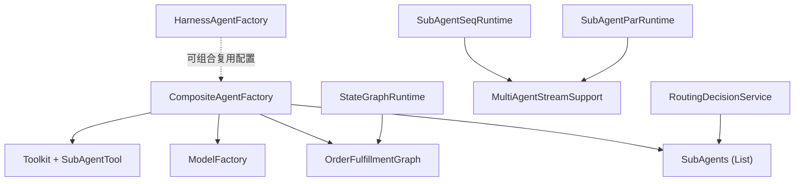
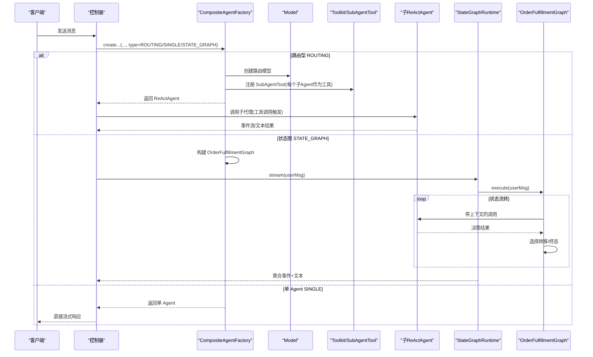
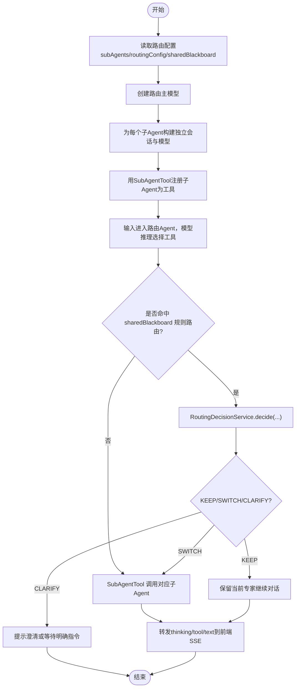
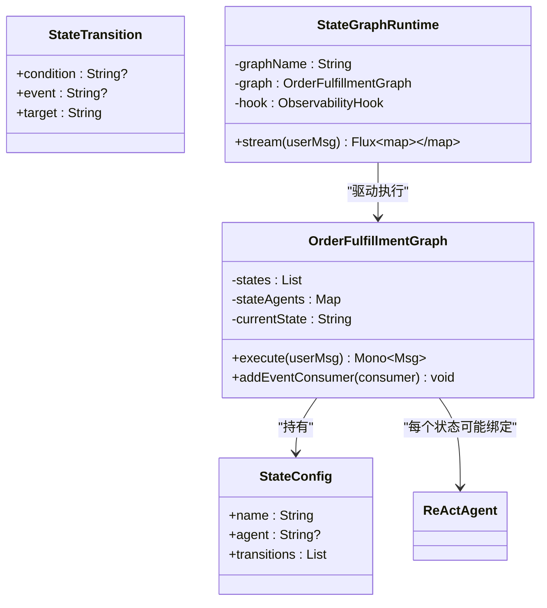
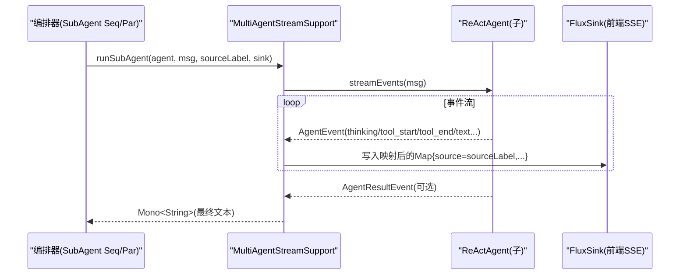
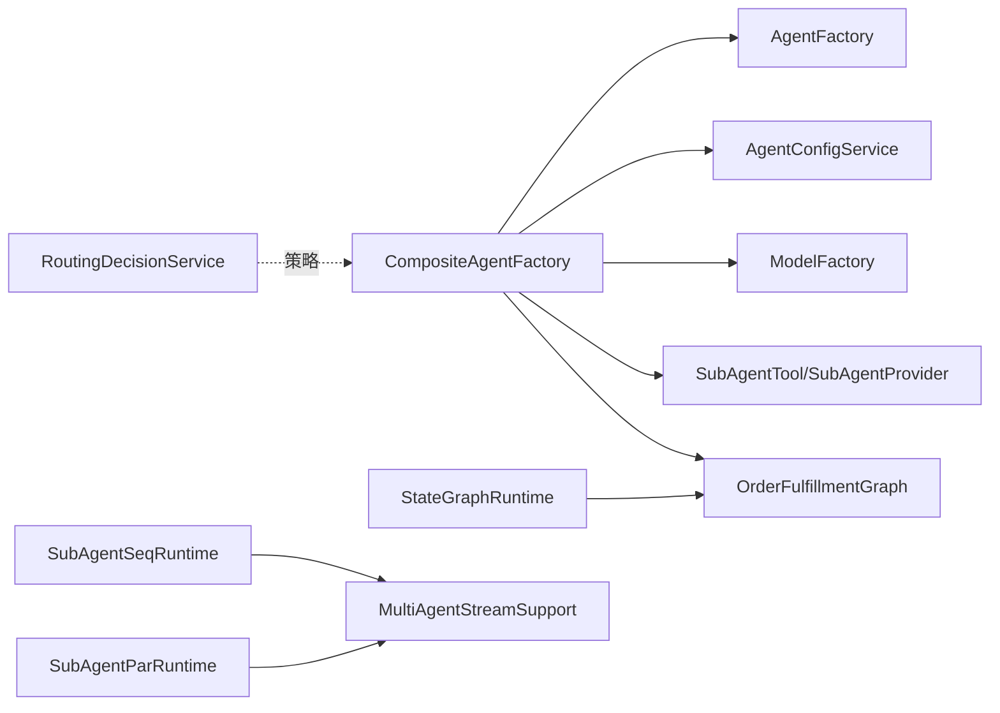

# 复合 Agent 工厂 (CompositeAgentFactory)

<cite>
**本文引用的文件**
- [CompositeAgentFactory.java](file://src/main/java/com/skloda/agentscope/composite/CompositeAgentFactory.java)
- [OrderFulfillmentGraph.java](file://src/main/java/com/skloda/agentscope/composite/graph/OrderFulfillmentGraph.java)
- [AgentConfig.java](file://src/main/java/com/skloda/agentscope/agent/AgentConfig.java)
- [AgentType.java](file://src/main/java/com/skloda/agentscope/agent/AgentType.java)
- [SubAgentConfig.java](file://src/main/java/com/skloda/agentscope/agent/SubAgentConfig.java)
- [StateGraphRuntime.java](file://src/main/java/com/skloda/agentscope/runtime/StateGraphRuntime.java)
- [SubAgentSeqRuntime.java](file://src/main/java/com/skloda/agentscope/runtime/SubAgentSeqRuntime.java)
- [SubAgentParRuntime.java](file://src/main/java/com/skloda/agentscope/runtime/SubAgentParRuntime.java)
- [MultiAgentStreamSupport.java](file://src/main/java/com/skloda/agentscope/runtime/MultiAgentStreamSupport.java)
- [RoutingDecisionService.java](file://src/main/java/com/skloda/agentscope/blackboard/RoutingDecisionService.java)
- [HarnessAgentFactory.java](file://src/main/java/com/skloda/agentscope/harness/HarnessAgentFactory.java)
</cite>

## 目录
1. [引言](#引言)
2. [项目结构](#项目结构)
3. [核心组件](#核心组件)
4. [架构总览](#架构总览)
5. [详细组件分析](#详细组件分析)
6. [依赖关系分析](#依赖关系分析)
7. [性能考量](#性能考量)
8. [故障排查指南](#故障排查指南)
9. [结论](#结论)
10. [附录：模式与配置、迁移指引](#附录模式与配置迁移指引)

## 引言
本文聚焦 CompositeAgentFactory 及与其协作的状态图、路由调度、子代理工具等实现，深入解析以下能力：
- 多种 Agent 类型在 2.0 下的工作机理：SINGLE（单 Agent）、ROUTING（智能路由，结合 Shared Blackboard）、HANDOFFS（基于规则/LLM 的交接控制）、STATE_GRAPH（状态图执行）。
- SubAgentTool 的动态调度机制、子 Agent 生命周期管理、以及 MultiAgentStreamSupport 如何把事件和最终文本串联为流式流水线。
- StateGraphRuntime 的设计：状态定义、转移条件（关键词/事件/Agent 决策）和数据传递。
- 不同协作模式的适用场景与配置方法，并提供实际案例与调试技巧。
- 提供从旧版 pipeline API 到 2.0 subagent/middleware 的迁移建议。

## 项目结构
该项目的复合 Agent 相关代码主要位于 composite、runtime、blackboard 与 agent 配置层：
- composite 层：CompositeAgentFactory、OrderFulfillmentGraph（状态图），负责多 Agent 编排入口与复杂流程。
- runtime 层：StateGraphRuntime、SubAgentSeqRuntime、SubAgentParRuntime、MultiAgentStreamSupport，负责流式事件桥接与任务编排。
- blackboard 层：RoutingDecisionService、SessionBlackboard 等，用于“共享黑板”路由/交接策略。
- agent 配置层：AgentConfig、AgentType、SubAgentConfig 等，集中描述单/多 Agent 行为与参数。

图示来源
- [CompositeAgentFactory.java:115-190](file://src/main/java/com/skloda/agentscope/composite/CompositeAgentFactory.java#L115-L190)
- [OrderFulfillmentGraph.java:29-41](file://src/main/java/com/skloda/agentscope/composite/graph/OrderFulfillmentGraph.java#L29-L41)
- [StateGraphRuntime.java:15-27](file://src/main/java/com/skloda/agentscope/runtime/StateGraphRuntime.java#L15-L27)
- [SubAgentSeqRuntime.java:22-35](file://src/main/java/com/skloda/agentscope/runtime/SubAgentSeqRuntime.java#L22-L35)
- [SubAgentParRuntime.java:22-35](file://src/main/java/com/skloda/agentscope/runtime/SubAgentParRuntime.java#L22-L35)
- [MultiAgentStreamSupport.java:36-76](file://src/main/java/com/skloda/agentscope/runtime/MultiAgentStreamSupport.java#L36-L76)
- [RoutingDecisionService.java:35-63](file://src/main/java/com/skloda/agentscope/blackboard/RoutingDecisionService.java#L35-L63)

章节来源
- [CompositeAgentFactory.java:33-44](file://src/main/java/com/skloda/agentscope/composite/CompositeAgentFactory.java#L33-L44)

## 核心组件
- CompositeAgentFactory：统一入口，按 AgentType 分发创建 SINGLE、ROUTING、STATE_GRAPH 等实例；对 ROUTING 使用 SubAgentTool 注册每个子代理为工具；对 STATE_GRAPH 构建 OrderFulfillmentGraph 并在会话中维护状态机运行态。
- OrderFulfillmentGraph：实现显式状态机，支持两类节点：
  - 带 Agent 的状态：由 LLM 做出决策并输出“【决策:xxx】”，按匹配到的转换进入下一状态。
  - 不带 Agent 的状态：由用户输入事件触发确定性转移。
- StateGraphRuntime：将 OrderFulfillmentGraph 暴露为流式运行时，合并观察钩子事件并推送 SSE。
- SubAgentSeqRuntime / SubAgentParRuntime：串行或并行编排若干 ReActAgent，借助 MultiAgentStreamSupport 转发生命周期事件与最终输出。
- MultiAgentStreamSupport：统一从 Msg 提取文本、运行子代理并将事件映射为 SSE，同时收集最终文本以串接后续步骤。
- RoutingDecisionService：Shared Blackboard 路由的核心纯函数服务，支持 rule/llm 两种策略；本版本 llm 策略默认回落至 rule。

章节来源
- [CompositeAgentFactory.java:59-113](file://src/main/java/com/skloda/agentscope/composite/CompositeAgentFactory.java#L59-L113)
- [OrderFulfillmentGraph.java:22-103](file://src/main/java/com/skloda/agentscope/composite/graph/OrderFulfillmentGraph.java#L22-L103)
- [StateGraphRuntime.java:29-74](file://src/main/java/com/skloda/agentscope/runtime/StateGraphRuntime.java#L29-L74)
- [SubAgentSeqRuntime.java:22-106](file://src/main/java/com/skloda/agentscope/runtime/SubAgentSeqRuntime.java#L22-L106)
- [SubAgentParRuntime.java:22-104](file://src/main/java/com/skloda/agentscope/runtime/SubAgentParRuntime.java#L22-L104)
- [MultiAgentStreamSupport.java:43-118](file://src/main/java/com/skloda/agentscope/runtime/MultiAgentStreamSupport.java#L43-L118)
- [RoutingDecisionService.java:48-160](file://src/main/java/com/skloda/agentscope/blackboard/RoutingDecisionService.java#L48-L160)

## 架构总览
下图展示了主调用路径：客户端请求经由控制器到达 AgentRuntime，再由 CompositeAgentFactory 创建具体 Agent，最后通过不同的运行时或子代理机制返回 SSE。

图示来源
- [CompositeAgentFactory.java:115-190](file://src/main/java/com/skloda/agentscope/composite/CompositeAgentFactory.java#L115-L190)
- [StateGraphRuntime.java:29-74](file://src/main/java/com/skloda/agentscope/runtime/StateGraphRuntime.java#L29-L74)
- [OrderFulfillmentGraph.java:39-103](file://src/main/java/com/skloda/agentscope/composite/graph/OrderFulfillmentGraph.java#L39-L103)

章节来源
- [CompositeAgentFactory.java:59-113](file://src/main/java/com/skloda/agentscope/composite/CompositeAgentFactory.java#L59-L113)
- [StateGraphRuntime.java:15-27](file://src/main/java/com/skloda/agentscope/runtime/StateGraphRuntime.java#L15-L27)

## 详细组件分析

### 组件 A：ROUTING（智能路由 + Shared Blackboard）
- 路由 Agent 创建
  - 读取父 Agent 的 model/stream/thinking 等选项创建主模型。
  - 遍历 subAgents，构造独立 Session 的子 ReActAgent，并以 SubAgentProvider 注册到 SubAgentTool。
  - 注入修改后的系统提示，使子 Agent 避免再调用工具（专注业务领域）。
- 动态调度
  - SubAgentTool 以 toolName=子AgentId 的形式挂载到 Toolkit，路由 Agent 收到文本后由模型决定调用哪个工具（即哪个子 Agent）。
  - 事件转发：SubAgentConfig 中的 StreamOptions 会打开 reasoning/tool_result 事件的增量转发。
- Shared Blackboard 与规则路由
  - AgentConfig.sharedBlackboard.enabled=true 时，ROUTING 升级为 Supervisor 风格：启用 session-scoped 黑板存储 key="shared_blackboard"。
  - RoutingDecisionService 根据策略进行决策：
    - rule：显式优先(EXPLICIT)，意图(INTENT)命中则尽可能切换到不同专家，否则 KEEP；无 activeExpert 且无匹配时默认选择首个专家。
    - llm：预留钩子，当前版本回退到 rule（真实 LLM 决策应由 SupervisorRuntime 在更高层触发，并保持本服务纯函数特性）。

图示来源
- [CompositeAgentFactory.java:115-190](file://src/main/java/com/skloda/agentscope/composite/CompositeAgentFactory.java#L115-L190)
- [RoutingDecisionService.java:48-160](file://src/main/java/com/skloda/agentscope/blackboard/RoutingDecisionService.java#L48-L160)

章节来源
- [CompositeAgentFactory.java:115-190](file://src/main/java/com/skloda/agentscope/composite/CompositeAgentFactory.java#L115-L190)
- [RoutingDecisionService.java:48-160](file://src/main/java/com/skloda/agentscope/blackboard/RoutingDecisionService.java#L48-L160)
- [AgentConfig.java:62-98](file://src/main/java/com/skloda/agentscope/agent/AgentConfig.java#L62-L98)
- [AgentConfig.java:130-185](file://src/main/java/com/skloda/agentscope/agent/AgentConfig.java#L130-L185)

### 组件 B：STATE_GRAPH（状态图执行器）
- 设计模式
  - 显式状态机，每个状态可选装配一个 ReActAgent。
  - 带 Agent 的状态：Agent 输出需包含“【决策:xxx】”以便解析为 transition 的 condition。
  - 无 Agent 的状态：根据用户输入事件匹配 event（支持别名如 submit->提交）。
- 数据传递
  - buildAgentInput 会把“当前状态+用户输入”组装成上下文传给 Agent。
  - 每次转移 emit graph_agent_call/graph_transition 事件，供观测与追踪。
  - 若达到终态（没有进一步 transitions），返回最终文本。
- 运行时封装
  - StateGraphRuntime 将 graph.execute(userMsg) 的结果转换为 Flux<Map> 事件流，合并 ObservabilityHook 事件输出。

图示来源
- [OrderFulfillmentGraph.java:24-41](file://src/main/java/com/skloda/agentscope/composite/graph/OrderFulfillmentGraph.java#L24-L41)
- [OrderFulfillmentGraph.java:39-103](file://src/main/java/com/skloda/agentscope/composite/graph/OrderFulfillmentGraph.java#L39-L103)
- [OrderFulfillmentGraph.java:104-198](file://src/main/java/com/skloda/agentscope/composite/graph/OrderFulfillmentGraph.java#L104-L198)
- [StateGraphRuntime.java:15-74](file://src/main/java/com/skloda/agentscope/runtime/StateGraphRuntime.java#L15-L74)

章节来源
- [OrderFulfillmentGraph.java:22-198](file://src/main/java/com/skloda/agentscope/composite/graph/OrderFulfillmentGraph.java#L22-L198)
- [StateGraphRuntime.java:15-74](file://src/main/java/com/skloda/agentscope/runtime/StateGraphRuntime.java#L15-L74)

### 组件 C：SubAgent 动态调度与生命周期
- 动态调度
  - 在 ROUTING 模式中，CompositeAgentFactory 为每个子 Agent 构建独立的 ReActAgent，并通过 SubAgentTool 暴露为工具。
  - MultiAgentStreamSupport.runSubAgent 使用 streamEvents() 拉取事件流，映射为 SSE，同时累积文本并在 AgentResultEvent 存在时优先采用其结果作为最终文本。
- 生命周期
  - 子 Agent 拥有独立 InMemoryAgentStateStore 与 defaultSessionId，避免状态污染。
  - enablePendingToolRecovery 开启，确保工具恢复场景的稳定性。
- 流式编排
  - SubAgentSeqRuntime：串行拼接 {prevOutput}，每步完成后发出 task_result 并最终汇总。
  - SubAgentParRuntime：并发执行，收集各子 Agent 输出后合并为结构化文本。

图示来源
- [MultiAgentStreamSupport.java:43-118](file://src/main/java/com/skloda/agentscope/runtime/MultiAgentStreamSupport.java#L43-L118)
- [CompositeAgentFactory.java:129-178](file://src/main/java/com/skloda/agentscope/composite/CompositeAgentFactory.java#L129-L178)

章节来源
- [MultiAgentStreamSupport.java:36-118](file://src/main/java/com/skloda/agentscope/runtime/MultiAgentStreamSupport.java#L36-L118)
- [CompositeAgentFactory.java:129-178](file://src/main/java/com/skloda/agentscope/composite/CompositeAgentFactory.java#L129-L178)

### 组件 D：Handoffs（交接控制）
- HandoffTrigger 与 TriggerType（EXPLICIT/INTENT）决定何时切换“活跃专家”。
- RoutingDecisionService 在 rule 策略下：
  - EXPLICIT 优先级最高（用户明确说“转 X”）。
  - INTENT 命中且与当前专家不同则 SWITCH。
  - 无命中且有 activeExpert 则 KEEP（可通过 defaultKeep=false 改为 CLARIFY）。
  - 首回合未配置 activeExpert 时，路由到第一个专家以保障可用性。
- SupervisorRuntimeFactory/SupervisorRuntime 与 SharedBlackboard 配合实现“主会话级”的专家记忆。

章节来源
- [RoutingDecisionService.java:67-160](file://src/main/java/com/skloda/agentscope/blackboard/RoutingDecisionService.java#L67-L160)
- [AgentConfig.java:62-98](file://src/main/java/com/skloda/agentscope/agent/AgentConfig.java#L62-L98)

### 组件 E：HARNESS（增强型 Agent 包装）
- HarnessAgentFactory 按 HarnessConfig 组装 HarnessAgent，支持沙箱文件系统、Compaction、Task List、Plan Mode、分层 Memory、权限上下文、技能仓库等。
- 与 CompositeAgentFactory 的关系：当 agent.type=HARNESS 时，不走 CompositeAgentFactory 的多 Agent 分支，而是直接进入 HarnessAgentFactory 的路径；但两者都使用 ModelFactory 构建模型，共享统一的模型配置。

章节来源
- [HarnessAgentFactory.java:42-200](file://src/main/java/com/skloda/agentscope/harness/HarnessAgentFactory.java#L42-L200)

## 依赖关系分析
- CompositeAgentFactory 强依赖：
  - AgentFactory：创建单个 ReActAgent 与状态存储。
  - AgentConfigService：加载子 Agent 配置。
  - ModelFactory：创建模型。
  - io.agentscope.core.tool.subagent.SubAgentTool/SubAgentProvider：子代理工具化。
- OrderFulfillmentGraph 依赖 StateConfig/StateTransition 定义状态与转换。
- StateGraphRuntime 通过 ObservabilityHook 注入事件流。
- SubAgent*Runtime 依赖 MultiAgentStreamSupport 统一事件桥接。
- RoutingDecisionService 只依赖静态配置与运行时 blackboard 快照，保持无副作用。

图示来源
- [CompositeAgentFactory.java:45-56](file://src/main/java/com/skloda/agentscope/composite/CompositeAgentFactory.java#L45-L56)
- [OrderFulfillmentGraph.java:24-33](file://src/main/java/com/skloda/agentscope/composite/graph/OrderFulfillmentGraph.java#L24-L33)
- [StateGraphRuntime.java:15-27](file://src/main/java/com/skloda/agentscope/runtime/StateGraphRuntime.java#L15-L27)
- [SubAgentSeqRuntime.java:22-35](file://src/main/java/com/skloda/agentscope/runtime/SubAgentSeqRuntime.java#L22-L35)
- [SubAgentParRuntime.java:22-35](file://src/main/java/com/skloda/agentscope/runtime/SubAgentParRuntime.java#L22-L35)
- [RoutingDecisionService.java:35-63](file://src/main/java/com/skloda/agentscope/blackboard/RoutingDecisionService.java#L35-L63)

## 性能考量
- 事件映射开销：大量 AgentEvent → SSE 的映射发生在 MultiAgentStreamSupport，建议在开发阶段使用 DEBUG 级别日志定位瓶颈。
- 状态图循环次数：OrderFulfillmentGraph 可能在单次请求中多次调用下游 Agent；应合理设置最大跳数或在 StateConfig 中标注终态以避免过长链路。
- 路由延迟：ROUTING 依赖模型推理选择工具，可在 routingConfig.recentTurns 控制历史上下文长度以降低 Token 消耗与延迟。
- 并发度：SUBAGENT_PAR 使用并行执行，注意后端模型 QPS 限制；必要时降并发或加入限流中间件。
- 内存占用：子 Agent 的 InMemoryAgentStateStore 会随会话增长；结合 Harness 的 Compaction/Flush 策略控制。

[本节为通用性能建议，不直接分析特定文件]

## 故障排查指南
- 路由未生效
  - 检查 sharedBlackboard.enabled 是否为 true，storageKey 是否与预期一致（默认 "shared_blackboard"）。
  - 检查 handoffTriggers 的 keywords/type/target 是否正确；确认 RoutingDecisionService.decide 的回退逻辑是否符合期望。
- 状态图卡住
  - 确认状态机包含终态；若无 transitions，流程应在有 Agent 状态下返回 Agent 文本。
  - 检查 Agent 是否按要求输出“【决策:xxx】”以匹配 transition.condition。
- 子 Agent 事件缺失
  - 确认 SubAgentConfig.streamOptions 打开了 reasoning/tool_result，并确保 forwardEvents=true。
  - 核对 MultiAgentStreamSupport 是否被调用；若模型侧缺少 AgentResultEvent，会以累积 text 兜底。
- HARNESS 类 Agent 不工作
  - 确认 AgentConfig.type=HARNESS 且提供了 harnessConfig；检查 WorkspaceInitializer 初始化是否成功。

章节来源
- [RoutingDecisionService.java:48-160](file://src/main/java/com/skloda/agentscope/blackboard/RoutingDecisionService.java#L48-L160)
- [OrderFulfillmentGraph.java:72-103](file://src/main/java/com/skloda/agentscope/composite/graph/OrderFulfillmentGraph.java#L72-L103)
- [CompositeAgentFactory.java:157-178](file://src/main/java/com/skloda/agentscope/composite/CompositeAgentFactory.java#L157-L178)
- [MultiAgentStreamSupport.java:74-118](file://src/main/java/com/skloda/agentscope/runtime/MultiAgentStreamSupport.java#L74-L118)
- [HarnessAgentFactory.java:42-100](file://src/main/java/com/skloda/agentscope/harness/HarnessAgentFactory.java#L42-L100)

## 结论
CompositeAgentFactory 在 2.0 中扮演“多 Agent 编排枢纽”的角色：单 Agent 委托给底层 AgentFactory，智能路由通过 SubAgentTool 将多个专业域子 Agent 工具化并由主模型选择，状态图通过 OrderFulfillmentGraph 表达复杂流程，并由 StateGraphRuntime 暴露为流式 API。配合 Shared Blackboard 与 RoutingDecisionService，可在多人协作文档审查、工单流转等场景中实现可控的知识汇聚与交接。序列/并行 SubAgent 运行时为横向扩展提供了高内聚、低耦合的事件管线，便于前端渲染与埋点观测。

## 附录：模式与配置、迁移指引

### 适用场景与配置要点
- SINGLE：单一 ReActAgent，适合简单问答、工具调用型任务。配置 modelName/streaming/enabledThinking 等。
- ROUTING：多专家知识域协同，适合客服/专家会诊。开启 sharedBlackboard 可实现跨轮次交接记忆；rules 与 LLM 策略可结合使用。
- HANDOFFS：基于关键字的主动/意图切换，适合分步引导的交互，如“帮我改合同→转法务专家”。
- STATE_GRAPH：面向固定业务流程（订单履约、理赔流程），要求状态与转换语义清晰，适合监管合规与审计可追溯的场景。
- SUBAGENT_SEQ / SUBAGENT_PAR：多步拆解（序列）或批量抽取（并行），适合报告生成/信息采集。

章节来源
- [AgentConfig.java:62-98](file://src/main/java/com/skloda/agentscope/agent/AgentConfig.java#L62-L98)
- [AgentType.java:3-15](file://src/main/java/com/skloda/agentscope/agent/AgentType.java#L3-L15)

### 调试技巧
- 观察事件流：在前端 Debug Panel 查看 source 标签区分不同子 Agent 的输出。
- 校验路由决策：打印 RoutingDecision 的 action/reason 以定位为何保持/切换专家。
- 调试状态图：在 OrderFulfillmentGraph 中添加额外事件消费（如记录 toState 与 trigger），便于回放。
- 限流与降级：对高耗时的子 Agent 设置超时与重试上限，避免前端长时间阻塞。

### 从旧版 pipeline API 到 2.0 subagent API 的迁移指南
- 背景
  - 旧版 Pipeline（io.agentscope.core.pipeline.*）已移除，当前版本注释声明 SEQUENTIAL/PARALLEL/DEBATE/LOOP/MSG_HUB/SUBAGENT_SEQ/SUBAGENT_PAR 等模式将被禁用，将以 2.0 的 subagent/middleware API 重新实现。
- 关键迁移点
  - 事件与流式：用 agent.streamEvents() 替代旧版 call/stream；参考 MultiAgentStreamSupport 将事件映射为 SSE。
  - 编排方式：顺序/并行由 SubAgentSeqRuntime/SubAgentParRuntime 承载，替换原有 Pipeline Step。
  - 工具化与子代理：使用 SubAgentTool 将子 Agent 注册为工具，由上游 Agent（路由或状态图）进行动态调用。
  - 持久与恢复：利用子 Agent 的 InMemoryAgentStateStore + defaultSessionId + enablePendingToolRecovery 恢复中断的工具调用。
  - 配置卸载：废弃的 LongTermMemory（AgentConfig 中 @Deprecated）替换为 Harness.MemoryConfig；RAG 字段同样标记过期。
- 操作步骤
  - 逐步替换旧的 pipeline steps 为序列/并行运行时，并使用 MultiAgentStreamSupport 桥接事件。
  - 对需要动态选择的场景（路由），引入 Shared Blackboard 与 RoutingDecisionService，先以 rule 策略稳定行为，再扩展 LLM 策略。
  - 逐步关闭旧 Pipeline 功能开关（若仍有），确保全部走 new streaming 路径后再清理兼容代码。
  - 在 Harness 模式下启用 Compaction 与 Task List/Plan Mode，以提升长会话的稳定性与可控性。

章节来源
- [CompositeAgentFactory.java:33-43](file://src/main/java/com/skloda/agentscope/composite/CompositeAgentFactory.java#L33-L43)
- [MultiAgentStreamSupport.java:17-35](file://src/main/java/com/skloda/agentscope/runtime/MultiAgentStreamSupport.java#L17-L35)
- [AgentConfig.java:26-40](file://src/main/java/com/skloda/agentscope/agent/AgentConfig.java#L26-L40)
- [HarnessAgentFactory.java:105-181](file://src/main/java/com/skloda/agentscope/harness/HarnessAgentFactory.java#L105-L181)