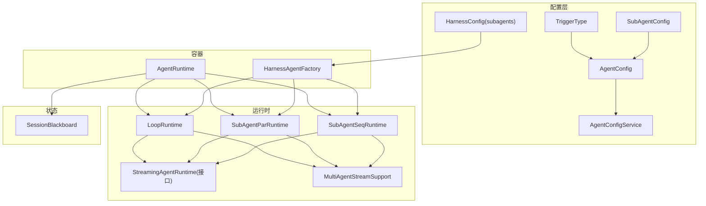
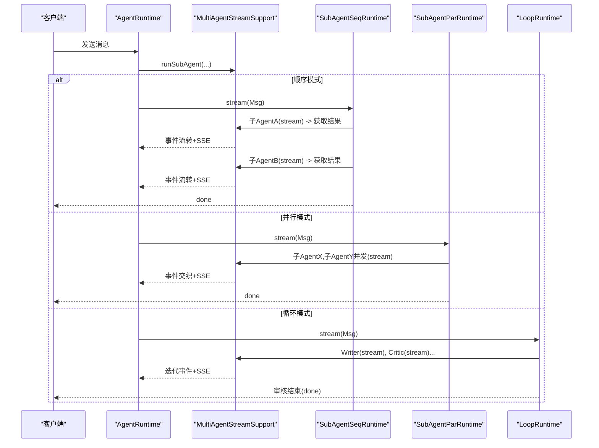
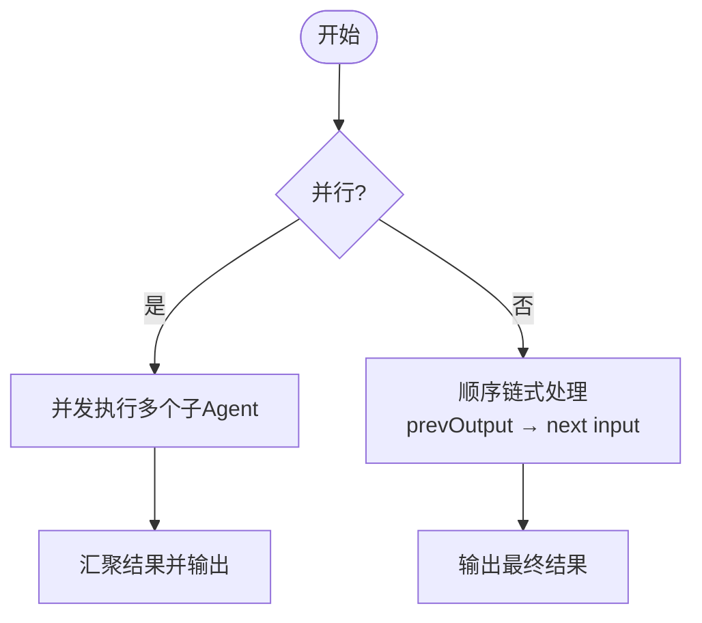
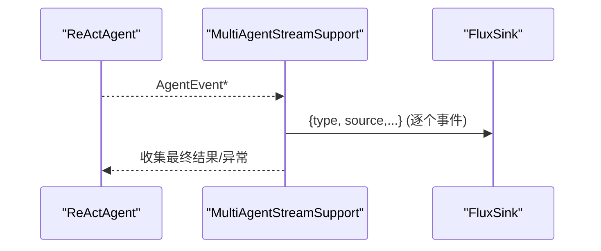
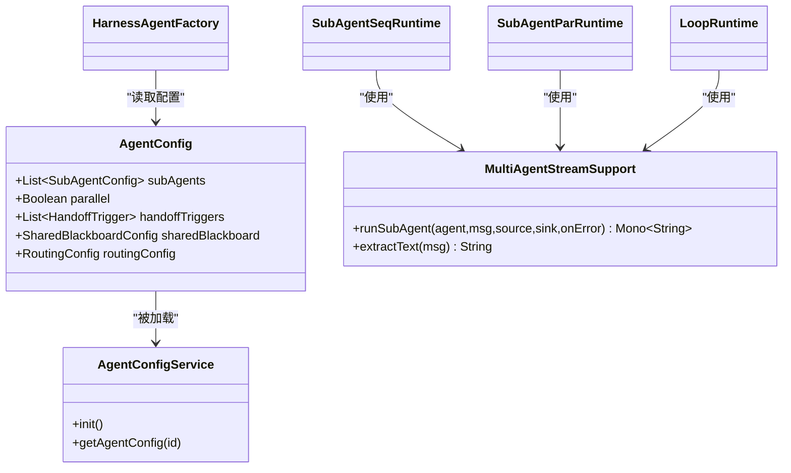

# 子 Agent 动态调度机制

<cite>
**文档中引用的文件**
- [SubAgentConfig.java](file://src/main/java/com/skloda/agentscope/agent/SubAgentConfig.java)
- [TriggerType.java](file://src/main/java/com/skloda/agentscope/agent/TriggerType.java)
- [AgentConfig.java](file://src/main/java/com/skloda/agentscope/agent/AgentConfig.java)
- [AgentConfigService.java](file://src/main/java/com/skloda/agentscope/agent/AgentConfigService.java)
- [MultiAgentStreamSupport.java](file://src/main/java/com/skloda/agentscope/runtime/MultiAgentStreamSupport.java)
- [SubAgentSeqRuntime.java](file://src/main/java/com/skloda/agentscope/runtime/SubAgentSeqRuntime.java)
- [SubAgentParRuntime.java](file://src/main/java/com/skloda/agentscope/runtime/SubAgentParRuntime.java)
- [LoopRuntime.java](file://src/main/java/com/skloda/agentscope/runtime/LoopRuntime.java)
- [AgentRuntime.java](file://src/main/java/com/skloda/agentscope/runtime/AgentRuntime.java)
- [SessionBlackboard.java](file://src/main/java/com/skloda/agentscope/blackboard/SessionBlackboard.java)
- [HarnessAgentFactory.java](file://src/main/java/com/skloda/agentscope/harness/HarnessAgentFactory.java)
- [agents.yml](file://src/main/resources/config/agents.yml)
- [harness-agents.yml](file://src/main/resources/config/harness-agents.yml)
</cite>

## 目录
1. [简介](#简介)
2. [项目结构](#项目结构)
3. [核心组件](#核心组件)
4. [架构总览](#架构总览)
5. [详细组件分析](#详细组件分析)
6. [依赖关系分析](#依赖关系分析)
7. [性能考量](#性能考量)
8. [故障排查指南](#故障排查指南)
9. [结论](#结论)

## 简介
本文件聚焦于“子 Agent 动态调度”的机制，系统性阐述：
- 子 Agent 配置与生命周期管理（SubAgentConfig、AgentConfig、AgentConfigService、HarnessAgentFactory）
- 工具注册与服务装配（ToolRegistry/技能与工具描述加载）
- 事件转发与流式桥接（StreamingAgentRuntime、MultiAgentStreamSupport、SSE 管道）
- 触发策略（TriggerType 及路由/转手机制在 AgentConfig 中的集成）
- 顺序、并行与循环三种子 Agent 运行模式（SubAgentSeqRuntime、SubAgentParRuntime、LoopRuntime）
- 性能优化建议与调试排障方法
- 复杂场景下的协作架构设计范式

## 项目结构
围绕子 Agent 动态调度，本项目采用分层与职责清晰的模块组织：
- agent 层：定义配置与元数据（AgentConfig、SubAgentConfig、TriggerType）与配置加载服务（AgentConfigService）
- runtime 层：实现多类子 Agent 编排（顺序、并行、循环），并通过统一的 StreamingAgentRuntime 暴露流式 API；同时包含通用支撑（MultiAgentStreamSupport）
- blackboard 层：共享黑板状态与会话隔离（SessionBlackboard），支持跨专家/子 Agent 的业务状态协同
- harness 层：构造 Harness 型 Agent（含工作区、沙箱、记忆、计划等高级能力），并初始化子 Agent 的工作空间
- config 层：YAML 配置（agents.yml、harness-agents.yml）驱动 Agent 创建与装配

图示来源
- [AgentConfig.java:62-79](file://src/main/java/com/skloda/agentscope/agent/AgentConfig.java#L62-L79)
- [AgentConfigService.java:41-76](file://src/main/java/com/skloda/agentscope/agent/AgentConfigService.java#L41-L76)
- [HarnessAgentFactory.java:56-66](file://src/main/java/com/skloda/agentscope/harness/HarnessAgentFactory.java#L56-L66)
- [SubAgentSeqRuntime.java:22-35](file://src/main/java/com/skloda/agentscope/runtime/SubAgentSeqRuntime.java#L22-L35)
- [SubAgentParRuntime.java:22-35](file://src/main/java/com/skloda/agentscope/runtime/SubAgentParRuntime.java#L22-L35)
- [LoopRuntime.java:29-49](file://src/main/java/com/skloda/agentscope/runtime/LoopRuntime.java#L29-L49)

章节来源
- [AgentConfig.java:1-186](file://src/main/java/com/skloda/agentscope/agent/AgentConfig.java#L1-L186)
- [AgentConfigService.java:1-199](file://src/main/java/com/skloda/agentscope/agent/AgentConfigService.java#L1-L199)
- [HarnessAgentFactory.java:1-200](file://src/main/java/com/skloda/agentscope/harness/HarnessAgentFactory.java#L1-L200)
- [agents.yml:1-200](file://src/main/resources/config/agents.yml#L1-L200)
- [harness-agents.yml:1-87](file://src/main/resources/config/harness-agents.yml#L1-L87)

## 核心组件
- SubAgentConfig：描述一个子 Agent 的基本元信息，包括 agentId、description、role、taskTemplate。用于在编排时构建任务模板与调用标识。
- TriggerType：枚举化的触发策略类型，用于上游路由或转手逻辑识别何时委托给子 Agent。
- AgentConfig：承载单 Agent 与多 Agent 组合的配置集，包含子 Agent 列表（subAgents）、并行标志（parallel）、HandoffTrigger 列表、以及 Supervisor/路由相关配置。
- AgentConfigService：启动时读取 YAML 配置，建立 agentId->AgentConfig 映射，并加载技能描述，提供查询与遍历接口。
- HarnessAgentFactory：基于 AgentConfig + HarnessConfig 装配 HarnessAgent，自动初始化工作区与子 Agent 工作区，并启用文件系统、记忆、计划等功能。
- MultiAgentStreamSupport：统一抽取 Msg 文本与桥接子 Agent 流（streamEvents），将全部子 Agent 的生命周期事件转发到 SSE 管道，并回收最终输出供编排链使用。
- SubAgentSeqRuntime / SubAgentParRuntime / LoopRuntime：三种典型的多步子 Agent 执行模式（顺序、并行、写-审循环）。
- SessionBlackboard：会话级共享业务状态，跨子 Agent/专家之间安全读写。

章节来源
- [SubAgentConfig.java:1-17](file://src/main/java/com/skloda/agentscope/agent/SubAgentConfig.java#L1-L17)
- [TriggerType.java:1-17](file://src/main/java/com/skloda/agentscope/agent/TriggerType.java#L1-L17)
- [AgentConfig.java:62-186](file://src/main/java/com/skloda/agentscope/agent/AgentConfig.java#L62-L186)
- [AgentConfigService.java:41-108](file://src/main/java/com/skloda/agentscope/agent/AgentConfigService.java#L41-L108)
- [HarnessAgentFactory.java:42-66](file://src/main/java/com/skloda/agentscope/harness/HarnessAgentFactory.java#L42-L66)
- [MultiAgentStreamSupport.java:43-118](file://src/main/java/com/skloda/agentscope/runtime/MultiAgentStreamSupport.java#L43-L118)

## 架构总览
子 Agent 调度的关键路径如下：
- 请求进入 AgentRuntime.stream()，统一合并 EventSink（多 Agent 手动事件）与 ReActAgent.streamEvents()（子 Agent 生命周期事件）
- 通过 MultiAgentStreamSupport.runSubAgent() 将子 Agent 的所有事件打上 sourceLabel 并前推至前端
- 序列/并行/循环 Runtime 根据编排策略组装任务输入，订阅最终结果并继续后续步骤或汇总输出
- 共享状态通过 SessionBlackboard 在不同子 Agent 间传递和累积

图示来源
- [AgentRuntime.java:67-142](file://src/main/java/com/skloda/agentscope/runtime/AgentRuntime.java#L67-L142)
- [MultiAgentStreamSupport.java:74-118](file://src/main/java/com/skloda/agentscope/runtime/MultiAgentStreamSupport.java#L74-L118)
- [SubAgentSeqRuntime.java:37-93](file://src/main/java/com/skloda/agentscope/runtime/SubAgentSeqRuntime.java#L37-L93)
- [SubAgentParRuntime.java:37-103](file://src/main/java/com/skloda/agentscope/runtime/SubAgentParRuntime.java#L37-L103)
- [LoopRuntime.java:52-165](file://src/main/java/com/skloda/agentscope/runtime/LoopRuntime.java#L52-L165)

## 详细组件分析

### SubAgentConfig 与配置结构
- agentId：子 Agent 唯一标识，用作任务溯源与日志关联键。
- description：面向用户的说明，常用于 UI 展示或路由决策辅助。
- role：角色描述，指导模型在执行任务时的语气与行为偏好（如“分析师”、“撰写员”）。
- taskTemplate：任务模板字符串，支持变量替换（例如 {input}、{prevOutput}），由顺序模式串联输出、并行模式注入原始输入。

最佳实践
- 每个子 Agent 仅承担单一明确职责，保持 taskTemplate 简洁且自解释。
- 将易变的 Prompt 片段外部化（YAML/模板），便于 A/B 实验与本地快速迭代。
- 对下游消费端稳定的字段（如 agentId）避免频繁修改。

章节来源
- [SubAgentConfig.java:1-17](file://src/main/java/com/skloda/agentscope/agent/SubAgentConfig.java#L1-L17)
- [SubAgentSeqRuntime.java:56-70](file://src/main/java/com/skloda/agentscope/runtime/SubAgentSeqRuntime.java#L56-L70)
- [SubAgentParRuntime.java:46-59](file://src/main/java/com/skloda/agentscope/runtime/SubAgentParRuntime.java#L46-L59)

### 触发策略 TriggerType 与路由/转手
- TriggerType 提供了意图驱动的三类触发语义：意图触发、显式用户请求、能力不足转手。它通常由上游 Router/Handoff 判断使用。
- 在 AgentConfig 中通过 HandoffTrigger 列表声明不同条件下的转手规则；配合 SharedBlackboard 的 RoutingConfig/SharedBlackboardConfig 可进一步细化路由阈值与默认策略。
- 若开启 Supervisor 共享黑板，可在不确定时选择 KEEP（保持当前专家）或 CLARIFY（澄清需求），以增强稳定性。

章节来源
- [TriggerType.java:1-17](file://src/main/java/com/skloda/agentscope/agent/TriggerType.java#L1-L17)
- [AgentConfig.java:62-86](file://src/main/java/com/skloda/agentscope/agent/AgentConfig.java#L62-L86)
- [AgentConfig.java:130-186](file://src/main/java/com/skloda/agentscope/agent/AgentConfig.java#L130-L186)

### 子 Agent 生命周期与工具注册
- 配置加载：AgentConfigService 在启动阶段扫描 agents.yml 与 harness-agents.yml，去重后构建索引；同时加载技能描述（基于 ToolRegistry 暴露的元数据）。
- 容器装配：HarnessAgentFactory 根据 HarnessConfig 初始化工作区、子 Agent 工作区、文件系统（本地/Docker）、内存、计划、权限与技能仓库；随后创建具体子 Agent 实例。
- 工具注册：通过 ToolRegistry 与 @Tool 注解完成方法级别的工具发现与参数解析；Skill 目录结构与 SKILL.md 用于绑定工具集合和说明。

章节来源
- [AgentConfigService.java:41-88](file://src/main/java/com/skloda/agentscope/agent/AgentConfigService.java#L41-L88)
- [HarnessAgentFactory.java:56-66](file://src/main/java/com/skloda/agentscope/harness/HarnessAgentFactory.java#L56-L66)
- [harness-agents.yml:11-47](file://src/main/resources/config/harness-agents.yml#L11-L47)

### 顺序/并行/循环子 Agent 运行器
- 顺序运行（SubAgentSeqRuntime）
  - 任务模板拼接 {input}/{prevOutput}，逐步把上一环节输出喂给下一个 Agent
  - 每步发射 task_start/task_end、task_result 与 text/done 事件
  - 适用于需要逐段加工的任务流水线（如分步分析→报告生成）
- 并行运行（SubAgentParRuntime）
  - 多个子 Agent 并发执行，聚合各自输出为一份综合结果
  - 事件按到达时间交织推送，适合多维对比与并行信息采集
- 循环运行（LoopRuntime）
  - 写作者+评审者交替进行，直至达到批准关键词或最大迭代数
  - 保证即便达到最大迭代也会输出“尽力而为”的最后内容，改善用户体验

图示来源
- [SubAgentParRuntime.java:37-90](file://src/main/java/com/skloda/agentscope/runtime/SubAgentParRuntime.java#L37-L90)
- [SubAgentSeqRuntime.java:37-93](file://src/main/java/com/skloda/agentscope/runtime/SubAgentSeqRuntime.java#L37-L93)
- [LoopRuntime.java:52-135](file://src/main/java/com/skloda/agentscope/runtime/LoopRuntime.java#L52-L135)

章节来源
- [SubAgentSeqRuntime.java:1-106](file://src/main/java/com/skloda/agentscope/runtime/SubAgentSeqRuntime.java#L1-L106)
- [SubAgentParRuntime.java:1-104](file://src/main/java/com/skloda/agentscope/runtime/SubAgentParRuntime.java#L1-L104)
- [LoopRuntime.java:1-166](file://src/main/java/com/skloda/agentscope/runtime/LoopRuntime.java#L1-L166)

### 事件转发与 SSE 桥接
- MultiAgentStreamSupport.runSubAgent：订阅 ReActAgent.streamEvents()，对每个事件进行类型转换并附加 source 标签，再写入 FluxSink，形成端到端 SSE；同时收集最终文本供编排链路返回。
- AgentRuntime：合并 EventSink 与 AgentEvents，并在结束时发出 "done"/"pending_approval" 等收尾事件；对未完成的工具调用会主动清理以避免上下文污染。

图示来源
- [MultiAgentStreamSupport.java:74-118](file://src/main/java/com/skloda/agentscope/runtime/MultiAgentStreamSupport.java#L74-L118)
- [AgentRuntime.java:94-142](file://src/main/java/com/skloda/agentscope/runtime/AgentRuntime.java#L94-L142)

章节来源
- [MultiAgentStreamSupport.java:17-118](file://src/main/java/com/skloda/agentscope/runtime/MultiAgentStreamSupport.java#L17-L118)
- [AgentRuntime.java:26-142](file://src/main/java/com/skloda/agentscope/runtime/AgentRuntime.java#L26-L142)

### 共享黑板与会话隔离
- SessionBlackboard 维护活跃专家、当前意图、客户事实、待解决问题等；版本化增量 Patch 提交，保证序列化与一致性。
- 存储键可配，默认与对话状态隔离，确保跨专家的数据不互相污染。

章节来源
- [SessionBlackboard.java:15-159](file://src/main/java/com/skloda/agentscope/blackboard/SessionBlackboard.java#L15-L159)

## 依赖关系分析
- AgentConfig 作为配置根对象，聚合 subAgents、handoffTriggers、sharedBlackboard、routingConfig 等多维能力开关
- AgentConfigService 依赖 ToolRegistry 获取技能描述；读取 YAML 并缓存
- 各种 Runtime（Seq/Par/Loop）都依赖 MultiAgentStreamSupport 完成统一的事件桥接
- HarnessAgentFactory 向上游提供 HarnessAgent 实例，内部负责子系统与工作区的完备性初始化

图示来源
- [AgentConfig.java:62-86](file://src/main/java/com/skloda/agentscope/agent/AgentConfig.java#L62-L86)
- [AgentConfigService.java:74-88](file://src/main/java/com/skloda/agentscope/agent/AgentConfigService.java#L74-L88)
- [SubAgentSeqRuntime.java:15-21](file://src/main/java/com/skloda/agentscope/runtime/SubAgentSeqRuntime.java#L15-L21)
- [SubAgentParRuntime.java:15-21](file://src/main/java/com/skloda/agentscope/runtime/SubAgentParRuntime.java#L15-L21)
- [LoopRuntime.java:14-28](file://src/main/java/com/skloda/agentscope/runtime/LoopRuntime.java#L14-L28)
- [HarnessAgentFactory.java:42-66](file://src/main/java/com/skloda/agentscope/harness/HarnessAgentFactory.java#L42-L66)

章节来源
- [AgentConfig.java:1-186](file://src/main/java/com/skloda/agentscope/agent/AgentConfig.java#L1-L186)
- [AgentConfigService.java:1-199](file://src/main/java/com/skloda/agentscope/agent/AgentConfigService.java#L1-L199)
- [MultiAgentStreamSupport.java:17-118](file://src/main/java/com/skloda/agentscope/runtime/MultiAgentStreamSupport.java#L17-L118)
- [HarnessAgentFactory.java:1-200](file://src/main/java/com/skloda/agentscope/harness/HarnessAgentFactory.java#L1-L200)

## 性能考量
- 任务粒度与数量
  - 将大任务拆分为更小、更纯的子任务有利于提升吞吐和可观测性
  - 并行模式的并发度需结合 LLM 限流与后端配额调优
- 流式事件体积控制
  - 输出截断策略已在各 Runtime 中对过长结果进行限制，避免 SSE 风暴
- 错误恢复与降级
  - MultiAgentStreamSupport 会在无最终结果时回退到累积文本，保障下游编排不中断
- 上下文管理
  - 关闭冗余历史、合理使用 compaction/memo/plan 降低上下文膨胀对延迟的影响
- I/O 与文件
  - 对于并行文件读取/解析，应避免阻塞调用；必要时借助独立线程池或异步 IO

## 故障排查指南
- “只能聊一次/流悬挂”问题
  - 现象：对话结束后前端保持 streaming=true
  - 原因：EventSink 未在合适的时机完成，导致 merge 无法终止
  - 修复要点：确保 agent 事件流结束时完成 EventSink；AgentRuntime 已在 doFinally 处完成
  - 参考路径：[AgentRuntime.java:112-142](file://src/main/java/com/skloda/agentscope/runtime/AgentRuntime.java#L112-L142)
- 工具调用挂起或残留
  - 现象：下次请求出现“自动生成失败的工具结果”，污染上下文
  - 原因：上一次中断的请求留有未完成 ToolUseBlock
  - 修复要点：在请求开始时清理残存的挂起工具调用
  - 参考路径：[AgentRuntime.java:82-92](file://src/main/java/com/skloda/agentscope/runtime/AgentRuntime.java#L82-L92)
- 子 Agent 无输出或无法拼接模板
  - 检查 taskTemplate 占位符是否完整（{input}/{prevOutput}）
  - 确认 MultiAgentStreamSupport 正常记录 text 累加与最终结果
  - 参考路径：[SubAgentSeqRuntime.java:44-70](file://src/main/java/com/skloda/agentscope/runtime/SubAgentSeqRuntime.java#L44-L70)
- 并行结果错乱或未聚拢
  - 确认 Flux.merge 后的 collectList 流程未被提前取消或报错
  - 参考路径：[SubAgentParRuntime.java:63-86](file://src/main/java/com/skloda/agentscope/runtime/SubAgentParRuntime.java#L63-L86)
- 共享状态不一致
  - 核对 BlackboardPatch 是否正确应用，确保串行提交与版本号递增
  - 参考路径：[SessionBlackboard.java:137-159](file://src/main/java/com/skloda/agentscope/blackboard/SessionBlackboard.java#L137-L159)

章节来源
- [AgentRuntime.java:82-142](file://src/main/java/com/skloda/agentscope/runtime/AgentRuntime.java#L82-L142)
- [SubAgentSeqRuntime.java:44-93](file://src/main/java/com/skloda/agentscope/runtime/SubAgentSeqRuntime.java#L44-L93)
- [SubAgentParRuntime.java:63-86](file://src/main/java/com/skloda/agentscope/runtime/SubAgentParRuntime.java#L63-L86)
- [SessionBlackboard.java:137-159](file://src/main/java/com/skloda/agentscope/blackboard/SessionBlackboard.java#L137-L159)

## 结论
子 Agent 动态调度在本项目中通过“配置驱动 + 统一流式桥接”的方式实现了高内聚、可扩展的编排能力：
- SubAgentConfig/AgentConfig 清晰定义了任务描述、触发与编排参数
- MultiAgentStreamSupport 屏蔽了底层事件差异，统一前后端协议
- 顺序/并行/循环三种运行时覆盖常见协作场景，且具备良好的可观测性与容错性
- 共享黑板与路由/转手机制让复杂多 Agent 协作更加稳定可靠
- 针对常见问题已有成熟修复与加固措施，可直接在生产环境使用

在实际落地中，建议：
- 以“小单元、标准化模板”为原则设计子 Agent
- 通过 YAML 外置 Prompt 与策略参数，便于持续迭代
- 用共享黑板沉淀跨步骤的关键状态，避免重复计算与歧义
- 结合限流、超时与断点续传策略，提高整体鲁棒性