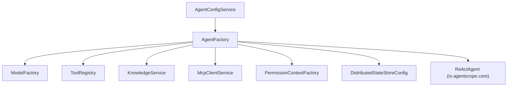
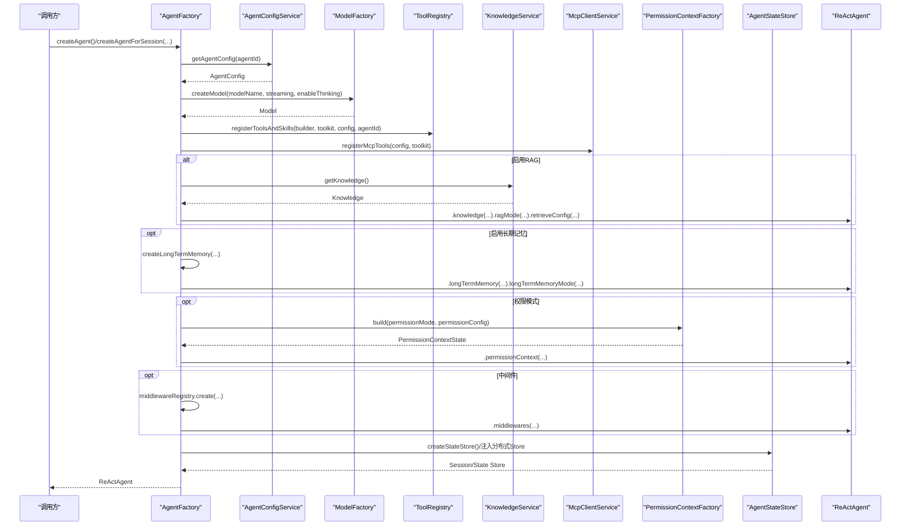
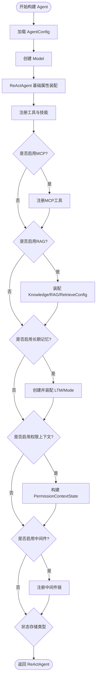
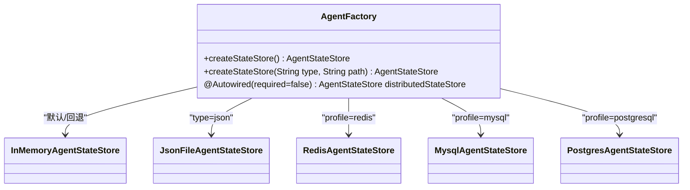

# 核心 Agent 工厂（AgentFactory）

<cite>
**本文引用的文件**
- [AgentFactory.java](file://src/main/java/com/skloda/agentscope/agent/AgentFactory.java)
- [AgentConfig.java](file://src/main/java/com/skloda/agentscope/agent/AgentConfig.java)
- [AgentConfigService.java](file://src/main/java/com/skloda/agentscope/agent/AgentConfigService.java)
- [ToolRegistry.java](file://src/main/java/com/skloda/agentscope/tool/ToolRegistry.java)
- [ModelFactory.java](file://src/main/java/com/skloda/agentscope/model/ModelFactory.java)
- [PermissionContextFactory.java](file://src/main/java/com/skloda/agentscope/permission/PermissionContextFactory.java)
- [KnowledgeService.java](file://src/main/java/com/skloda/agentscope/service/KnowledgeService.java)
- [McpClientService.java](file://src/main/java/com/skloda/agentscope/mcp/McpClientService.java)
- [DistributedStateStoreConfig.java](file://src/main/java/com/skloda/agentscope/config/DistributedStateStoreConfig.java)
- [HarnessAgentFactory.java](file://src/main/java/com/skloda/agentscope/harness/HarnessAgentFactory.java)
- [agents.yml](file://src/main/resources/config/agents.yml)
- [harness-agents.yml](file://src/main/resources/config/harness-agents.yml)
</cite>

## 目录
1. [简介](#简介)
2. [项目结构与角色分工](#项目结构与角色分工)
3. [核心组件与职责](#核心组件与职责)
4. [架构总览](#架构总览)
5. [详细构建流程拆解](#详细构建流程拆解)
6. [多策略状态存储选择逻辑（AgentStateStore）](#多策略状态存储选择逻辑agentstatestore)
7. [不同创建方法的场景与区别](#不同创建方法的场景与区别)
8. [自定义 Agent 配置示例与最佳实践](#自定义-agent-配置示例与最佳实践)
9. [错误处理与故障排查](#错误处理与故障排查)
10. [性能优化建议](#性能优化建议)
11. [结论](#结论)

## 简介
本文件聚焦 AgentFactory 的 Agent 工厂能力，系统阐述 ReActAgent 的完整构建生命周期、模型实例化、工具注册（ToolRegistry）、MCP 工具集成、权限上下文注入、RAG 知识库配置以及长期记忆系统配置；同时解释多种 createAgent/createAgentForSession 方法的使用差异，并给出 AgentStateStore 的多策略选择说明与自定义配置实践。

## 项目结构与角色分工
- 配置层：AgentConfig + AgentConfigService 从 YAML 加载 Agent 元信息并暴露查询接口。
- 构建层：AgentFactory 聚合模型、工具、技能、权限、RAG、长期记忆和中间件等要素构建 ReActAgent。
- 基础设施：
  - ModelFactory 统一通过 ModelRegistry 解析模型并提供 API Key。
  - ToolRegistry 自动发现用户工具、系统工具，并按 SKILL.md 动态映射 Skill → Tools。
  - McpClientService 加载 mcp-servers.yml，按需将 MCP Server 的工具注册到 Toolkit。
  - KnowledgeService 维护 InMemory RAG 知识库（SimpleKnowledge + InMemoryStore）。
  - DistributedStateStoreConfig 在 redis/mysql/postgresql profile 激活时提供分布式 AgentStateStore Bean。
  - PermissionContextFactory 根据默认模式与 deny/ask 规则构建 PermissionContextState。
  - HarnessAgentFactory 负责更重量的 HarnessAgent（工作空间、沙箱、压缩、分层记忆、Plan/TaskList 等）。

图表来源
- [AgentFactory.java:38-70](file://src/main/java/com/skloda/agentscope/agent/AgentFactory.java#L38-L70)
- [AgentConfigService.java:28-76](file://src/main/java/com/skloda/agentscope/agent/AgentConfigService.java#L28-L76)
- [ModelFactory.java:22-56](file://src/main/java/com/skloda/agentscope/model/ModelFactory.java#L22-L56)
- [ToolRegistry.java:23-44](file://src/main/java/com/skloda/agentscope/tool/ToolRegistry.java#L23-L44)
- [KnowledgeService.java:39-90](file://src/main/java/com/skloda/agentscope/service/KnowledgeService.java#L39-L90)
- [McpClientService.java:22-77](file://src/main/java/com/skloda/agentscope/mcp/McpClientService.java#L22-L77)
- [PermissionContextFactory.java:10-24](file://src/main/java/com/skloda/agentscope/permission/PermissionContextFactory.java#L10-L24)
- [DistributedStateStoreConfig.java:43-118](file://src/main/java/com/skloda/agentscope/config/DistributedStateStoreConfig.java#L43-L118)

章节来源
- [AgentFactory.java:38-70](file://src/main/java/com/skloda/agentscope/agent/AgentFactory.java#L38-L70)
- [AgentConfigService.java:28-76](file://src/main/java/com/skloda/agentscope/agent/AgentConfigService.java#L28-L76)

## 核心组件与职责
- AgentFactory：对外暴露 createAgent()、createAgentForSession() 等方法，完成单步装配 ReActAgent；内部复用 buildAgent / buildAgentWithPermission 完成具体装配。
- AgentConfig + AgentConfigService：YAML→对象，集中管理 Agent 元数据（名称、提示词、模型、技能、工具、RAG、权限、会话持久化等）。
- ToolRegistry：扫描 com.skloda.agentscope.tool 包中工具类，注册 AgentScope 系统工具，并根据 skills/*/SKILL.md frontmatter 建立 Skill→Tools 的动态映射。
- ModelFactory：封装 ModelRegistry.resolve，自动前缀 provider 名（dashscope），注入 apiKey、流式、思考模式与格式化器。
- PermissionContextFactory：按传入模式和配置构建权限上下文（bypass/accept_edits + deny/ask 规则）。
- KnowledgeService：启动后台索引本地 knowledge 目录，支持 PDF/Word/Text 解析入库（InMemoryStore）。
- McpClientService：读取 config/mcp-servers.yml 初始化 MCP 客户端并暴露 client 列表，供 Agent 装配时将远端工具纳入 Toolkit。
- DistributedStateStoreConfig：Profile 驱动 Redis/MySQL/PostgreSQL AgentStateStore Bean 注入。

章节来源
- [ToolRegistry.java:23-44](file://src/main/java/com/skloda/agentscope/tool/ToolRegistry.java#L23-L44)
- [ModelFactory.java:22-56](file://src/main/java/com/skloda/agentscope/model/ModelFactory.java#L22-L56)
- [KnowledgeService.java:39-90](file://src/main/java/com/skloda/agentscope/service/KnowledgeService.java#L39-L90)
- [McpClientService.java:22-77](file://src/main/java/com/skloda/agentscope/mcp/McpClientService.java#L22-L77)
- [DistributedStateStoreConfig.java:43-118](file://src/main/java/com/skloda/agentscope/config/DistributedStateStoreConfig.java#L43-L118)
- [PermissionContextFactory.java:10-24](file://src/main/java/com/skloda/agentscope/permission/PermissionContextFactory.java#L10-L24)

## 架构总览
下图展示一次典型 Agent 构建调用序列：请求方选择 create* 方法，内部加载 AgentConfig，组装模型、工具/技能、RAG、长期记忆、权限与中间件，最后输出可运行的 ReActAgent。

图表来源
- [AgentFactory.java:131-209](file://src/main/java/com/skloda/agentscope/agent/AgentFactory.java#L131-L209)
- [ModelFactory.java:42-56](file://src/main/java/com/skloda/agentscope/model/ModelFactory.java#L42-L56)
- [ToolRegistry.java:73-96](file://src/main/java/com/skloda/agentscope/tool/ToolRegistry.java#L73-L96)
- [KnowledgeService.java:73-90](file://src/main/java/com/skloda/agentscope/service/KnowledgeService.java#L73-L90)
- [McpClientService.java:43-77](file://src/main/java/com/skloda/agentscope/mcp/McpClientService.java#L43-L77)
- [PermissionContextFactory.java:12-24](file://src/main/java/com/skloda/agentscope/permission/PermissionContextFactory.java#L12-L24)
- [DistributedStateStoreConfig.java:53-118](file://src/main/java/com/skloda/agentscope/config/DistributedStateStoreConfig.java#L53-L118)

## 详细构建流程拆解
- 配置加载：通过 AgentConfigService.getAgentConfig(agentId) 取到 AgentConfig，若不存在会抛出异常，便于失败快速定位。
- 模型实例化：委托 ModelFactory.createModel(modelName, streaming, enableThinking)，内部统一使用 ModelRegistry 解析，自动为裸模型名添加 dashscope: 前缀。
- 基础构建：ReActAgent.builder().name/sysPrompt/model/stateStore/defaultSessionId。若 planEnabled 则开启任务清单。
- 工具与技能注册：先通过 Toolkit 与 ToolRegistry 注册用户工具/技能（含系统工具），再后置注册 MCP 工具，确保本地工具优先匹配。
- RAG 知识库：若 ragEnabled，则装配 Knowledge、RAGMode 与 RetrieveConfig（limit/scoreThreshold）。
- 长期记忆：若配置 LongTermMemoryConfig.type != none，则创建对应 LTM 实例并设置 Mode。该能力对单一 ReActAgent 可用，但新项目推荐 Harness 的分层 Memory。
- 权限上下文：当传入 permissionMode 或 AgentConfig.PermissionConfig 存在时，由 PermissionContextFactory 构建权限策略（deny/ask 规则）。
- 中间件：除 ApprovalMiddleware 外，还支持 AgentConfig.middlewares 动态注册。
- 状态存储：可选择 InMemory、JsonFile，或在活跃 profile 下使用分布式后端。

图表来源
- [AgentFactory.java:131-209](file://src/main/java/com/skloda/agentscope/agent/AgentFactory.java#L131-L209)

## 多策略状态存储选择逻辑（AgentStateStore）
AgentFactory 提供两种形态：
- 无参 createStateStore()：始终返回 InMemoryAgentStateStore。
- createStateStore(type, storagePath)：
  1) 若 Spring 容器中存在分布式 AgentStateStore Bean（redis/mysql/postgresql profile），优先返回该分布式实现；
  2) type="json" 且 storagePath 为空时使用默认 user.home 下的目录；否则新建 JsonFileAgentStateStore(dir)；
  3) 其他情况返回 InMemoryAgentStateStore。

该设计保证了在无分布式 profile 时完全向后兼容（无行为变化）。

图表来源
- [AgentFactory.java:76-92](file://src/main/java/com/skloda/agentscope/agent/AgentFactory.java#L76-L92)
- [DistributedStateStoreConfig.java:43-118](file://src/main/java/com/skloda/agentscope/config/DistributedStateStoreConfig.java#L43-L118)

章节来源
- [AgentFactory.java:76-92](file://src/main/java/com/skloda/agent/AgentFactory.java#L76-L92)
- [DistributedStateStoreConfig.java:43-118](file://src/main/java/com/skloda/agentscope/config/DistributedStateStoreConfig.java#L43-L118)

## 不同创建方法的场景与区别
- createAgent(agentId)：无状态会话型，内部每次创建独立的 InMemoryAgentStateStore，且不注入 ApprovalMiddleware。适用于一次性/短生命周期对话。
- createAgent(agentId, approvalMiddleware)：同上，但挂载审批中间件用于 HITL 流程。
- createAgentForSession(agentId, stateStore)：持久会话型，传入共享的 AgentStateStore，适用于长对话与跨请求持久化；不注入 ApprovalMiddleware。
- createAgentForSession(agentId, stateStore, approvalMiddleware)：持久会话+审批中间件。
- createAgent/createAgentForSession 带 permissionMode 的方法：在上述基础上额外构建 PermissionContextState，支持 deny/ask 规则。适合对工具调用进行安全控制与人工确认。

使用建议：
- 需要跨请求恢复对话/工作态 → 使用 createAgentForSession 并传入合适状态的 AgentStateStore。
- 需要对敏感工具进行审批/限制 → 使用带 approvalMiddleware 或 permissionMode 的版本。

章节来源
- [AgentFactory.java:97-130](file://src/main/java/com/skloda/agentscope/agent/AgentFactory.java#L97-L130)

## 自定义 Agent 配置示例与最佳实践
- 模型与能力开关：通过 modelName/streaming/enableThinking 配置模型能力。可参考现有 agents.yml 中的 chat-basic/task-document-analysis。
- 工具与技能：
  - 用户工具/系统工具通过 userTools/systemTools 指定工具名；
  - 技能通过 skills[] 指向 SKILL.md 中定义的技能名；
  - 建议新工具以 POJO + @Tool 方式实现，由 ToolRegistry 自动发现。
- RAG：启用 ragEnabled 并设置 ragRetrieveLimit/ragScoreThreshold。新项目若需更强记忆能力可优先考虑 Harness 的分层 MemoryConfig。
- 审批流程：在 harness 配置中可通过 permissionConfig 的 defaultMode/denyTools/askTools 配合 ApprovalMiddleware 实现可控的人机协同。
- 权限模式：在 AgentFactory 层面可通过 permissionMode 与 PermissionContextFactory 注入 deny/ask 规则，适合细粒度工具访问控制。
- 会话持久化：建议使用 createAgentForSession 配合分布式 AgentStateStore（redis/mysql/postgresql），提高多实例可用性。

示例位置
- [agents.yml:2-29](file://src/main/resources/config/agents.yml#L2-L29)
- [agents.yml:62-168](file://src/main/resources/config/agents.yml#L62-L168)
- [harness-agents.yml:1-48](file://src/main/resources/config/harness-agents.yml#L1-L48)

章节来源
- [agents.yml:2-29](file://src/main/resources/config/agents.yml#L2-L29)
- [agents.yml:62-168](file://src/main/resources/config/agents.yml#L62-L168)
- [harness-agents.yml:1-48](file://src/main/resources/config/harness-agents.yml#L1-L48)

## 错误处理与故障排查
- 配置缺失：当获取 AgentConfig 失败会抛出异常，应检查 agents.yml/harness-agents.yml 是否包含目标 agentId。
- 工具/技能未注册：
  - ToolRegistry 会在初始化时打印已发现的工具数量；如工具未出现，确认包路径是否为 com.skloda.agentscope.tool，或 SKILL.md frontmatter 是否写全。
- 模型鉴权失败：
  - ModelFactory 会读取配置或环境变量，校验 apiKey，必要时调整 agentscope.model.dashscope.api-key。
- RAG 知识库：
  - KnowledgeService 启动时会后台索引 local knowledge；若未生效，检查配置项与文件扩展名支持；上传文档后注意状态快照。
- MCP 集成：
  - McpClientService 会读取 config/mcp-servers.yml，如 transport/url/command 等参数缺失会记录告警或跳过；确认服务可达。
- 权限模式：
  - PermissionContextFactory 仅支持有限模式与规则组合；如果工具命中 DENY/ASK 导致中断，核对 permissionMode 及 deny/ask 列表。

章节来源
- [AgentConfigService.java:94-98](file://src/main/java/com/skloda/agentscope/agent/AgentConfigService.java#L94-L98)
- [ToolRegistry.java:73-96](file://src/main/java/com/skloda/agentscope/tool/ToolRegistry.java#L73-L96)
- [ModelFactory.java:83-94](file://src/main/java/com/skloda/agentscope/model/ModelFactory.java#L83-L94)
- [KnowledgeService.java:143-178](file://src/main/java/com/skloda/agentscope/service/KnowledgeService.java#L143-L178)
- [McpClientService.java:43-77](file://src/main/java/com/skloda/agentscope/mcp/McpClientService.java#L43-L77)
- [PermissionContextFactory.java:12-24](file://src/main/java/com/skloda/agentscope/permission/PermissionContextFactory.java#L12-L24)

## 性能优化建议
- 复用 Model 实例：当前每个 Agent 构建都会创建 Model；高吞吐场景可按需缓存 Model 实例或复用会话池减少重复创建。
- 控制工具规模：过多工具会影响模型推理质量与延迟；按需开启 userTools/systemTools，并优先用技能组织工具分组。
- RAG 检索调优：合理设置 ragRetrieveLimit/ragScoreThreshold；对本地知识库做分块优化与定期重建索引。
- 会话状态存储：长时/多实例部署下优先选择分布式 AgentStateStore；避免大体积状态导致 I/O 抖动。
- MCP 连接池与超时：为远端工具设置合适的 timeout/initTimeout，降低失败重试带来的整体耗时。
- 消息压缩与淘汰：结合 Harness 的 compaction 与 ToolResultEviction 控制上下文增长；对简单 Agent 也可考虑上层裁剪历史消息。

[本节提供通用优化建议，不直接分析具体代码文件]

## 结论
AgentFactory 作为统一的 Agent 装配入口，将模型、工具/技能、权限、RAG、长期记忆、中间件与状态存储解耦，并通过多构造方法与配置开关覆盖“无状态/有状态”“轻量/重量级”的各种业务场景。借助 ToolRegistry、McpClientService、PermissionContextFactory 与分布式 StateStore，系统具备强扩展性与可控的安全边界。在新项目中，可根据业务复杂度选择 ReActAgent 或 HarnessAgent，并结合 RAG 与分层记忆实现知识与记忆的有机结合。

[本节为总结性内容，不直接分析具体代码文件]