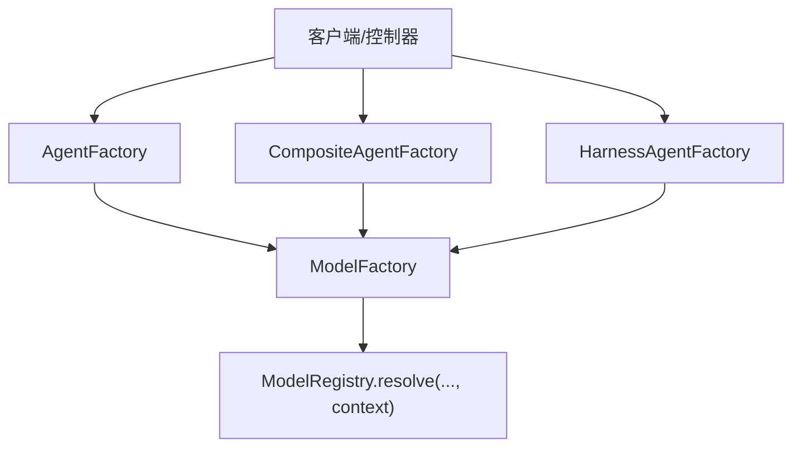
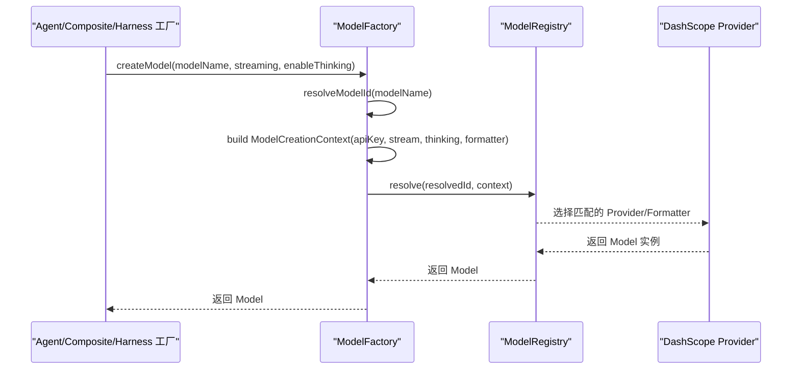
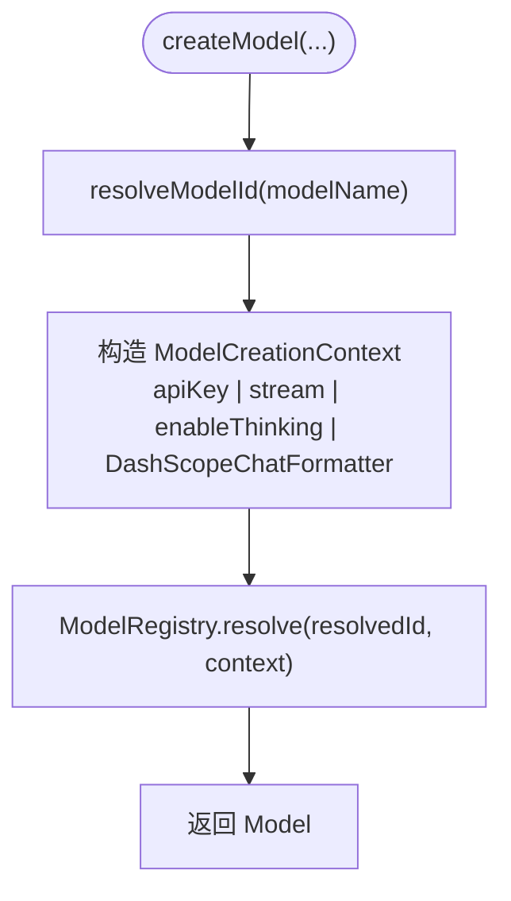
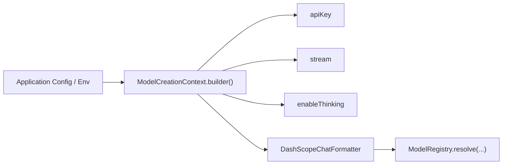
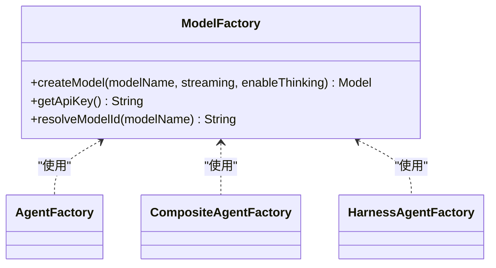

# 模型抽象层 (ModelFactory)

<cite>
**本文档引用的文件**
- [ModelFactory.java](file://src/main/java/com/skloda/agentscope/model/ModelFactory.java)
- [AgentFactory.java](file://src/main/java/com/skloda/agentscope/agent/AgentFactory.java)
- [CompositeAgentFactory.java](file://src/main/java/com/skloda/agentscope/composite/CompositeAgentFactory.java)
- [HarnessAgentFactory.java](file://src/main/java/com/skloda/agentscope/harness/HarnessAgentFactory.java)
- [application.yml](file://src/main/resources/application.yml)
- [pom.xml](file://pom.xml)
- [agents.yml](file://src/main/resources/config/agents.yml)
- [AGENTS.md](file://AGENTS.md)
</cite>

## 目录
1. [简介](#简介)
2. [项目结构](#项目结构)
3. [核心组件](#核心组件)
4. [架构总览](#架构总览)
5. [详细组件分析](#详细组件分析)
6. [依赖关系分析](#依赖关系分析)
7. [性能与最佳实践](#性能与最佳实践)
8. [故障排查指南](#故障排查指南)
9. [结论](#结论)
10. [附录：新增模型提供商集成指南](#附录新增模型提供商集成指南)

## 简介
本文件围绕模型抽象层展开，系统性说明 ModelFactory 如何以统一入口封装 AgentScope 的 ModelRegistry，提供跨不同 LLM 提供商的一致建模体验。内容涵盖：
- 模型 ID 解析策略（自动前缀添加）
- ModelCreationContext 配置项（API Key、流式响应、思考模式、格式化器）
- DashScope 提供商的特殊处理与兼容性考虑
- ModelFactory 在各工厂中的集成方式（单代理、组合代理、Harness）
- 新模型提供商扩展方法（SPI）、以及性能优化与最佳实践

## 项目结构
本节展示与模型创建相关的源码位置及组织方式。所有模型创建调用均通过 ModelFactory 进入，再由 ModelRegistry 根据 provider 与 model name 解析到具体实现。

图示来源
- [AgentFactory.java:131-141](file://src/main/java/com/skloda/agentscope/agent/AgentFactory.java#L131-L141)
- [CompositeAgentFactory.java:125-128](file://src/main/java/com/skloda/agentscope/composite/CompositeAgentFactory.java#L125-L128)
- [CompositeAgentFactory.java:140-144](file://src/main/java/com/skloda/agentscope/composite/CompositeAgentFactory.java#L140-L144)
- [HarnessAgentFactory.java:68-72](file://src/main/java/com/skloda/agentscope/harness/HarnessAgentFactory.java#L68-L72)
- [ModelFactory.java:42-56](file://src/main/java/com/skloda/agentscope/model/ModelFactory.java#L42-L56)

章节来源
- [ModelFactory.java:1-95](file://src/main/java/com/skloda/agentscope/model/ModelFactory.java#L1-L95)
- [AgentFactory.java:131-141](file://src/main/java/com/skloda/agentscope/agent/AgentFactory.java#L131-L141)
- [CompositeAgentFactory.java:125-128](file://src/main/java/com/skloda/agentscope/composite/CompositeAgentFactory.java#L125-L128)
- [CompositeAgentFactory.java:140-144](file://src/main/java/com/skloda/agentscope/composite/CompositeAgentFactory.java#L140-L144)
- [HarnessAgentFactory.java:68-72](file://src/main/java/com/skloda/agentscope/harness/HarnessAgentFactory.java#L68-L72)

## 核心组件
- ModelFactory：统一的模型创建入口，负责模型 ID 解析、上下文组装、并委派 ModelRegistry 构建实例。
- ModelCreationContext：定义 API Key、是否启用流式、是否启用思考模式、以及如何注入特定 Provider 的 Formatter。
- ModelRegistry：由 AgentScope 管理，基于 provider:modelName 格式进行实例解析；DashScope Provider 通过 SPI 自动注册。
- 各 Agent 工厂：AgentFactory、CompositeAgentFactory、HarnessAgentFactory 统一通过 ModelFactory 创建模型，避免散落的直接 builder 调用。

章节来源
- [ModelFactory.java:13-94](file://src/main/java/com/skloda/agentscope/model/ModelFactory.java#L13-L94)
- [pom.xml:43-48](file://pom.xml#L43-L48)
- [AGENTS.md](file://AGENTS.md)

## 架构总览
下图展示了从上层 Agent 构建到最终模型实例化的完整调用链，突出 ModelFactory 的居中协调作用与 ModelRegistry 的统一发现能力。

图示来源
- [ModelFactory.java:42-56](file://src/main/java/com/skloda/agentscope/model/ModelFactory.java#L42-L56)
- [AgentFactory.java:131-141](file://src/main/java/com/skloda/agentscope/agent/AgentFactory.java#L131-L141)
- [CompositeAgentFactory.java:125-128](file://src/main/java/com/skloda/agentscope/composite/CompositeAgentFactory.java#L125-L128)
- [HarnessAgentFactory.java:68-72](file://src/main/java/com/skloda/agentscope/harness/HarnessAgentFactory.java#L68-L72)
- [pom.xml:43-48](file://pom.xml#L43-L48)

## 详细组件分析

### ModelFactory：统一入口与默认行为
- 职责
  - 统一接收 modelName、streaming、enableThinking，输出 AgentScope 的 Model 实例。
  - 模型 ID 解析：当 modelName 不带 provider 前缀时，自动加上 “dashscope:” 前缀；为空或缺省则回退为“dashscope:qwen-plus”。
  - API Key 解析优先级：Spring 配置的 agentscope.model.dashscope.api-key → 环境变量 DASHSCOPE_API_KEY → 将 null 交由底层 Provider 再判断。
  - Context 组装：包含 apiKey、stream、enableThinking，以及针对 DashScope 的自定义 Formatter（用于对齐输入输出格式）。
- 行为要点
  - 无显式“冒号”的模型名会一律视为 DashScope 下模型并补全前缀，确保如 deepseek-v4-flash-0731 等能正确匹配 Provider 命名规则。
  - 日志记录关键决策点（resolvedId、stream、thinking），便于诊断。
  - getApiKey() 暴露给需要直接使用 Key 的其他组件使用（如长短期记忆模块）。

图示来源
- [ModelFactory.java:42-56](file://src/main/java/com/skloda/agentscope/model/ModelFactory.java#L42-L56)
- [ModelFactory.java:73-94](file://src/main/java/com/skloda/agentscope/model/ModelFactory.java#L73-L94)

章节来源
- [ModelFactory.java:13-94](file://src/main/java/com/skloda/agentscope/model/ModelFactory.java#L13-L94)

### 模型 ID 解析策略（自动前缀添加）
- 规则
  - 空或空白 → 返回“dashscope:qwen-plus”
  - 包含“:” → 保持原样
  - 不包含“:” → 自动拼接“dashscope:”前缀
- 原因
  - 某些模型名称未自带 provider 前缀时无法被 Provider 的匹配规则识别（例如 deepseek-v4-flash-0731 在 DashScopeProvider 中需要显式的 dashscope: 前缀）。

示例路径
- [ModelFactory.java:73-81](file://src/main/java/com/skloda/agentscope/model/ModelFactory.java#L73-L81)

章节来源
- [ModelFactory.java:67-81](file://src/main/java/com/skloda/agentscope/model/ModelFactory.java#L67-L81)

### ModelCreationContext：配置选项详解
- API Key 管理
  - 先尝试应用配置 agentscope.model.dashscope.api-key（支持 Spring @Value）
  - 若未配置，则读取环境变量 DASHSCOPE_API_KEY
  - 若均未设置，返回 null，交由底层 Provider 自行处理环境检测与报错
- 流式响应
  - streaming=true：启用流式响应，适用于 UI SSE 实时推送场景
  - streaming=false：关闭流式，按传统阻塞接口调用
- 思考模式
  - enableThinking=true：开启深度思考/推理模式（受 Provider 支持程度与 thinking-budget 控制）
- 格式化器
  - component(Formatter.class, new DashScopeChatFormatter())：针对 DashScope 的自定义消息转换，保证消息体结构与约定一致
- 配置文件引用
  - application.yml 中的 dashscope 段（provider、api-key、model-name、stream、enable-thinking、thinking-budget）
  - agents.yml 中各 agent 的 modelName/streaming/enableThinking

图示（概念流程）

章节来源
- [ModelFactory.java:28-56](file://src/main/java/com/skloda/agentscope/model/ModelFactory.java#L28-L56)
- [application.yml:25-42](file://src/main/resources/application.yml#L25-L42)
- [agents.yml:1-20](file://src/main/resources/config/agents.yml#L1-L20)

### 各工厂对 ModelFactory 的使用
- AgentFactory（单代理）
  - 通过 AgentConfig 获取 modelName/streaming/enableThinking，调用 ModelFactory 统一构建模型后装配 ReActAgent。
- CompositeAgentFactory（多代理/路由）
  - 为主路由代理与各子代理分别创建模型；子代理可能继承父级配置或覆盖各自的 modelName。
- HarnessAgentFactory（沙箱化 Harness）
  - 以 harnessConfig 为基础，构建更丰富的 HarnessAgent；同样经由 ModelFactory 创建模型以保证一致性。

图示（类层次与依赖）

图示来源
- [AgentFactory.java:131-141](file://src/main/java/com/skloda/agentscope/agent/AgentFactory.java#L131-L141)
- [CompositeAgentFactory.java:125-128](file://src/main/java/com/skloda/agentscope/composite/CompositeAgentFactory.java#L125-L128)
- [CompositeAgentFactory.java:140-144](file://src/main/java/com/skloda/agentscope/composite/CompositeAgentFactory.java#L140-L144)
- [HarnessAgentFactory.java:68-72](file://src/main/java/com/skloda/agentscope/harness/HarnessAgentFactory.java#L68-L72)

章节来源
- [AgentFactory.java:131-141](file://src/main/java/com/skloda/agentscope/agent/AgentFactory.java#L131-L141)
- [CompositeAgentFactory.java:125-128](file://src/main/java/com/skloda/agentscope/composite/CompositeAgentFactory.java#L125-L128)
- [CompositeAgentFactory.java:140-144](file://src/main/java/com/skloda/agentscope/composite/CompositeAgentFactory.java#L140-L144)
- [HarnessAgentFactory.java:68-72](file://src/main/java/com/skloda/agentscope/harness/HarnessAgentFactory.java#L68-L72)

### DashScope 提供商特殊处理与兼容性
- 自动补齐 provider 前缀：保证不含“:”的模型名也能命中 DashScope 匹配规则
- 注入 DashScopeChatFormatter：保证消息结构与 Provider 预期一致
- API Key 来源兼容：优先 Spring 配置；其次环境变量；最终交由 Provider 处理缺失情形
- 依赖引入：通过 pom.xml 显式引入 agentscope-extensions-model-dashscope，Provider 通过 Java SPI 自动注册

章节来源
- [ModelFactory.java:67-94](file://src/main/java/com/skloda/agentscope/model/ModelFactory.java#L67-L94)
- [pom.xml:43-48](file://pom.xml#L43-L48)
- [application.yml:25-42](file://src/main/resources/application.yml#L25-L42)

## 依赖关系分析
- 运行期依赖
  - agentscope-core：提供 Model、ModelCreationContext、ModelRegistry 等基础能力
  - agentscope-extensions-model-dashscope：DashScope Provider 及其 SPI 实现
- 配置依赖
  - application.yml：dashscope 段的 api-key、model-name、stream、enable-thinking、thinking-budget
  - agents.yml：每个 Agent 的 modelName、streaming、enableThinking 等
- 代码耦合
  - 各工厂仅依赖 ModelFactory 抽象，不直接感知具体 Provider，增强可替换性

章节来源
- [pom.xml:28-48](file://pom.xml#L28-L48)
- [application.yml:25-42](file://src/main/resources/application.yml#L25-L42)
- [agents.yml:1-20](file://src/main/resources/config/agents.yml#L1-L20)

## 性能与最佳实践
- 流式与非流式
  - UI/交互强相关场景开启 streaming，降低首字延迟，提升用户体验
  - 批处理/服务端内部逻辑可使用非流式以减少并发连接数
- 思考模式
  - enableThinking 适合复杂推理任务；在高并发时注意成本与响应时间
  - 结合 thinking-budget 控制 Token 预算，防止溢出
- API Key 管理
  - 生产环境建议通过环境变量注入，避免硬编码
  - 多环境切换使用 Spring Profile + application.yml
- 模型名策略
  - 建议统一带 provider 前缀，避免隐式自动前缀带来的维护负担
  - 对于不在 DashScope 下的模型，建议明确 provider:name，减少歧义
- 并发与资源
  - 合理限制并发会话数，关注上游限流与下游模型速率
  - 复用 Session/StateStore 策略，降低重建成本

[本节为通用指导，不涉及具体文件分析]

## 故障排查指南
- 错误：未配置 API Key
  - 现象：运行时抛出缺少密钥或 Provider 初始化失败
  - 解决：设置 agentscope.model.dashscope.api-key 或 DASHSCOPE_API_KEY
- 错误：模型名未命中任何 Provider
  - 现象：ModelRegistry.resolve 找不到提供者
  - 解决：为 modelName 增加 provider 前缀（如 dashscope:deepseek-v4-flash-0731）
- 错误：流式事件未显示
  - 检查：stream 是否为 true；SSE/前端是否正确订阅
  - 确认：上游控制器返回 Flux<ServerSentEvent> 链路正常
- 日志定位
  - 打开 io.agentscope 包日志，观察 ModelFactory 调试日志打印的 resolvedId、stream、thinking
  - 结合 Controller 层日志验证事件映射与传输

章节来源
- [ModelFactory.java:53-55](file://src/main/java/com/skloda/agentscope/model/ModelFactory.java#L53-L55)
- [application.yml:81-90](file://src/main/resources/application.yml#L81-L90)

## 结论
ModelFactory 通过集中化与标准化，屏蔽了不同 Provider 的差异细节，为上层 Agent 工厂提供了清晰、可测试、可替换的模型接入面。配合 ModelRegistry 的插件化设计与 SPI，可在无需改动调用方的前提下扩展新的模型提供商，同时通过 ModelCreationContext 对 API Key、流式、思考模式和格式化器进行细粒度控制。

[本节为总结，不涉及具体文件分析]

## 附录：新增模型提供商集成指南
目标：在不改动现有 Agent 工厂的前提下，新增一个非 DashScope 的模型提供商（例如 OpenAI、Ollama 等）。

步骤
1. 引入依赖
   - 添加对应 provider 的 extension 依赖（参考 pom.xml 中 DashScope 的方式）
2. 实现/对接 Provider
   - 使用 AgentScope Provider 规范实现或找到官方 provider 扩展
   - 借助 Java SPI 自动注册（无需修改框架代码）
3. 配置模型名
   - 建议在 agents.yml 中将 modelName 写为 “provider:modelName”
   - 若希望沿用本项目自动补全策略，可考虑在 ModelFactory 中扩展策略（谨慎评估影响范围）
4. 格式化器适配
   - 如需定制消息结构，仿照 DashScopeChatFormatter 的做法，将 Formatter 注入 ModelCreationContext
5. API Key 与敏感信息
   - 优先通过环境变量或外部 Secrets 管理
   - 与 ModelFactory 的 apiKey 解析路径保持一致或在其之上提供更高层抽象
6. 回归与观测
   - 使用单元测试验证 resolve 行为
   - 通过日志和埋点观察请求、失败率、RT、Token 消耗

注意
- 保持向后兼容：新增 Provider 不得破坏原有 dashscope 行为
- 对自动前缀策略要谨慎扩展，避免引入更多隐式假设

[本节为方法论指导，不直接分析具体代码文件]