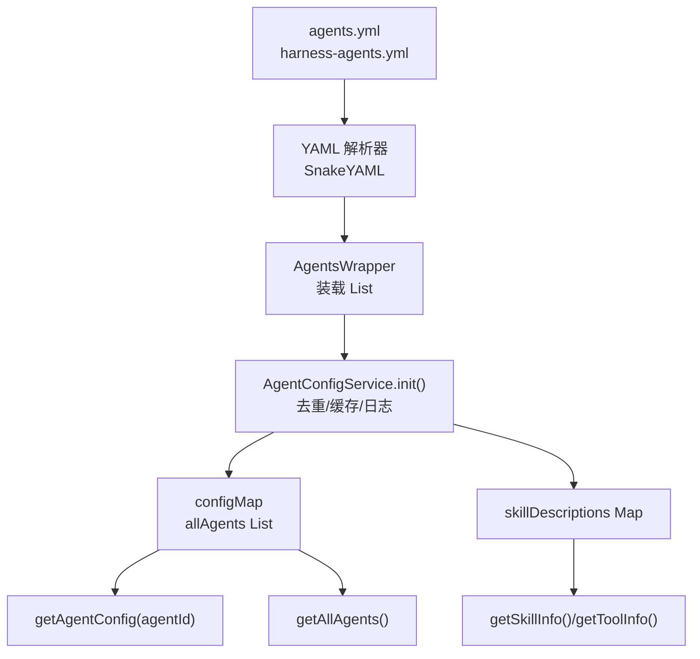
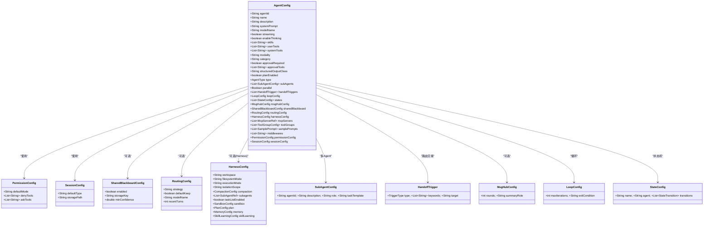
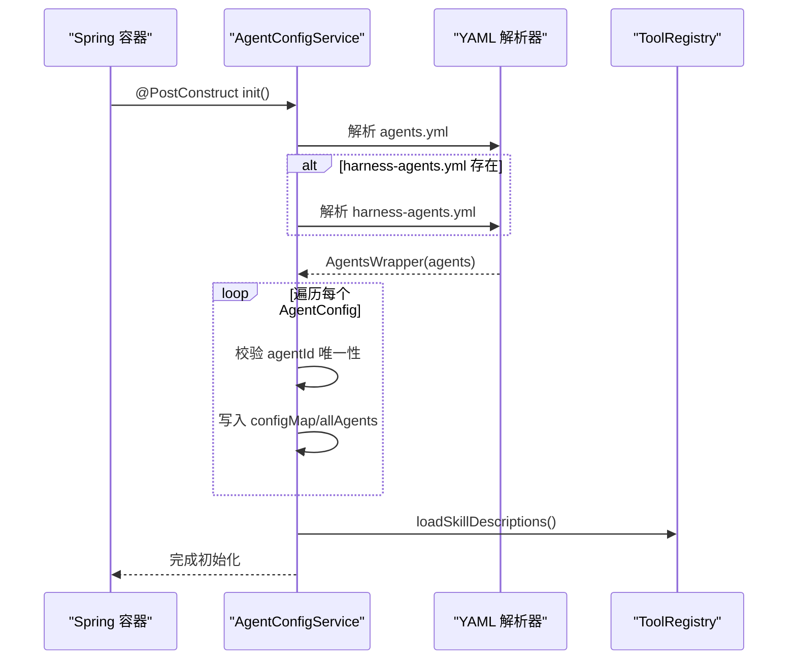
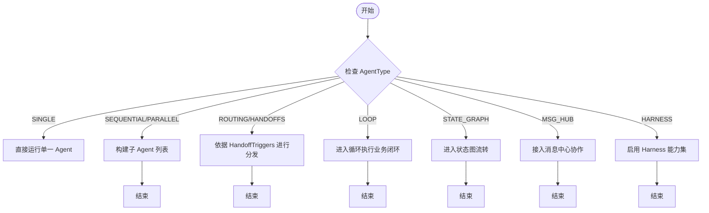

# Agent 配置系统

<cite>
**本文引用的文件**
- [AgentConfig.java](file://src/main/java/com/skloda/agentscope/agent/AgentConfig.java)
- [AgentConfigService.java](file://src/main/java/com/skloda/agentscope/agent/AgentConfigService.java)
- [HarnessConfig.java](file://src/main/java/com/skloda/agentscope/agent/HarnessConfig.java)
- [SubAgentConfig.java](file://src/main/java/com/skloda/agentscope/agent/SubAgentConfig.java)
- [HandoffTrigger.java](file://src/main/java/com/skloda/agentscope/agent/HandoffTrigger.java)
- [MsgHubConfig.java](file://src/main/java/com/skloda/agentscope/agent/MsgHubConfig.java)
- [SamplePrompt.java](file://src/main/java/com/skloda/agentscope/agent/SamplePrompt.java)
- [LoopConfig.java](file://src/main/java/com/skloda/agentscope/agent/LoopConfig.java)
- [StateConfig.java](file://src/main/java/com/skloda/agentscope/agent/StateConfig.java)
- [AgentType.java](file://src/main/java/com/skloda/agentscope/agent/AgentType.java)
- [agents.yml](file://src/main/resources/config/agents.yml)
- [harness-agents.yml](file://src/main/resources/config/harness-agents.yml)
</cite>

## 目录
1. [简介](#简介)
2. [项目结构与配置加载概览](#项目结构与配置加载概览)
3. [核心组件与职责](#核心组件与职责)
4. [架构总览](#架构总览)
5. [详细组件分析](#详细组件分析)
6. [依赖关系分析](#依赖关系分析)
7. [性能与可扩展性考量](#性能与可扩展性考量)
8. [故障排查指南](#故障排查指南)
9. [结论](#结论)
10. [附录：配置示例与最佳实践](#附录配置示例与最佳实践)

## 简介
本章节面向 Agent 配置系统的整体理解。该系统通过 YAML 定义多个 Agent，由 Spring Service 在启动时解析、校验并注入到运行期。每个 Agent 配置覆盖基础标识与行为（名称、描述、提示词）、模型参数、工具与技能挂载、RAG、多模态、权限控制、中间件、会话与会话状态、以及复杂的多 Agent 协同编排（路由、握手、循环、状态图）。此外，针对 Harness 模式还具备独立的能力集（工作空间、文件系统隔离、压缩、记忆分层、计划模式等）。

## 项目结构与配置加载概览
- 配置文件位于资源目录下的两个 YAML：
  - agents.yml：通用单 Agent / 协作型 Agent 清单
  - harness-agents.yml：Harness 模式 Agent 清单
- 启动时，Spring Service 读取上述 YAML，组装成 AgentConfig 对象列表并缓存；重复的 agentId 会丢弃后者，并提供服务查询能力（按 id、全部列表、技能/工具信息）。

图示来源
- [AgentConfigService.java:42-76](file://src/main/java/com/skloda/agentscope/agent/AgentConfigService.java#L42-L76)
- [AgentConfigService.java:191-196](file://src/main/java/com/skloda/agentscope/agent/AgentConfigService.java#L191-L196)

章节来源
- [AgentConfigService.java:32-76](file://src/main/java/com/skloda/agentscope/agent/AgentConfigService.java#L32-L76)
- [agents.yml:1-200](file://src/main/resources/config/agents.yml#L1-L200)
- [harness-agents.yml:1-85](file://src/main/resources/config/harness-agents.yml#L1-L85)

## 核心组件与职责
- AgentConfig：承载单个 Agent 的所有静态可配项与子结构（基本属性、模型、技能/工具、RAG、多模态、权限、中间件、会话、共享黑板、路由、Harness、MCP、中间层编排等）
- HarnessConfig：Harness 模式专属配置，包含工作区、隔离、压缩、计划、分层记忆、自学习等
- AgentConfigService：负责 YAML 加载、合并、去重、技能/工具元信息暴露
- 其他配合类：AgentType、SubAgentConfig、HandoffTrigger、MsgHubConfig、LoopConfig、StateConfig、SamplePrompt 等

章节来源
- [AgentConfig.java:15-99](file://src/main/java/com/skloda/agentscope/agent/AgentConfig.java#L15-L99)
- [HarnessConfig.java:11-133](file://src/main/java/com/skloda/agentscope/agent/HarnessConfig.java#L11-L133)
- [AgentConfigService.java:23-198](file://src/main/java/com/skloda/agentscope/agent/AgentConfigService.java#L23-L198)
- [AgentType.java:1-27](file://src/main/java/com/skloda/agentscope/agent/AgentType.java#L1-L27)

## 架构总览
下面的类图映射了 Agent 配置的核心数据结构及其嵌套关系。注意内部类为 AgentConfig 的若干子配置（权限、会话、长期记忆已弃用但仍保留兼容字段）、SharedBlackboardConfig、RoutingConfig；Harness 模式通过 HarnessConfig 组合入 AgentConfig。

图示来源
- [AgentConfig.java:15-99](file://src/main/java/com/skloda/agentscope/agent/AgentConfig.java#L15-L99)
- [AgentConfig.java:100-186](file://src/main/java/com/skloda/agentscope/agent/AgentConfig.java#L100-L186)
- [HarnessConfig.java:11-133](file://src/main/java/com/skloda/agentscope/agent/HarnessConfig.java#L11-L133)
- [SubAgentConfig.java:1-18](file://src/main/java/com/skloda/agent/SubAgentConfig.java#L1-L18)
- [HandoffTrigger.java:1-27](file://src/main/java/com/skloda/agentscope/agent/HandoffTrigger.java#L1-L27)
- [MsgHubConfig.java:1-15](file://src/main/java/com/skloda/agentscope/agent/MsgHubConfig.java#L1-L15)
- [LoopConfig.java:1-15](file://src/main/java/com/skloda/agentscope/agent/LoopConfig.java#L1-L15)
- [StateConfig.java:1-17](file://src/main/java/com/skloda/agentscope/agent/StateConfig.java#L1-L17)

## 详细组件分析

### AgentConfig：完整配置结构
- 基本属性
  - agentId/name/description/systemPrompt：用于标识和呈现给用户的 Agent 信息与初始上下文
  - category：用于 UI 分组（single、expert、collaboration 等）
- 模型行为
  - modelName/streaming/enableThinking：决定底层模型及流式推理和思维链开关
- 工具与技能
  - skills/userTools/systemTools：分别对应技能集合、用户侧工具、系统级工具
- 自动上下文/RAG
  - autoContext/autoContextMsgThreshold/autoContextLastKeep/autoContextTokenRatio：消息窗口管理与上下文阈值
  - ragEnabled/ragRetrieveLimit/ragScoreThreshold/ragMode：标记已弃用，建议迁移至 Harness MemoryConfig
- 多模态设置
  - modality：text/vision/audio
- 人机协同审批（HITL）
  - approvalRequired/approvalTools：指定是否需要审批的工具白名单
- 结构化输出
  - structuredOutputClass：限制模型输出的 JSON Schema 或类
- 计划笔记本
  - planEnabled：开启 Plan Notebook
- 多 Agent 协作
  - type/subAgents/parallel：顺序/并行/协作策略
  - handoffTriggers：基于关键词/意图的交接触发器
  - loopConfig/states/msgHubConfig：循环、状态图、消息总线集成
-  Supervisor / Router + 共享黑板
  - sharedBlackboard：共享黑板开关与最小置信度等
  - routingConfig：路由策略（rule/llm）、不确定时的默认行为、是否沿用当前专家、最近回合数等
- Harness 集成
  - harnessConfig：当 type=HARNESS 时生效，提供工作区、执行模式、文件系统、记忆分层、压缩、任务列表、沙箱、技能自学习等
- MCP 集成
  - mcpServers/toolGroups：远程工具服务器与工具组抽象
- 演示提示
  - samplePrompts：用于前端展示示例 Prompt 与期望行为
- 中间件
  - middlewares：中间件名称列表，统一注册执行
- 权限
  - permissionConfig：默认权限模式与拒绝/询问工具列表
- 会话
  - sessionConfig：会话类型与存储路径

章节来源
- [AgentConfig.java:15-99](file://src/main/java/com/skloda/agentscope/agent/AgentConfig.java#L15-L99)
- [AgentConfig.java:100-186](file://src/main/java/com/skloda/agentscope/agent/AgentConfig.java#L100-L186)
- [SamplePrompt.java:8-27](file://src/main/java/com/skloda/agentscope/agent/SamplePrompt.java#L8-L27)

### AgentConfigService：配置加载与信息查询
- 初始化流程
  - 装配主配置文件与 Harness 配置文件
  - 使用 SnakeYAML 解析为 AgentsWrapper 列表
  - 遍历并去重（重复的 agentId 以首个为准），记录日志，形成内存索引
  - 聚合 Skill 描述信息以便对外暴露
- 查询接口
  - getAgentConfig：根据 agentId 获取，未命中抛出非法参数异常
  - getAllAgents：返回不可变列表
  - getSkillInfo/getToolInfo：通过 ToolRegistry 反射获取工具的参数与描述

图示来源
- [AgentConfigService.java:42-76](file://src/main/java/com/skloda/agent/AgentConfigService.java#L42-L76)
- [AgentConfigService.java:78-88](file://src/main/java/com/skloda/agent/AgentConfigService.java#L78-L88)

章节来源
- [AgentConfigService.java:42-108](file://src/main/java/com/skloda/agentscope/agent/AgentConfigService.java#L42-L108)
- [AgentConfigService.java:110-189](file://src/main/java/com/skloda/agentscope/agent/AgentConfigService.java#L110-L189)

### HarnessConfig：Harness 模式专属能力
- 工作区与执行环境：workspace/filesystemMode/executionMode/isolationScope
- 压缩策略：compaction.triggerMessages/keepMessages/flushBeforeCompact
- 子代理引用：subagents
- 任务列表与元工具：taskListEnabled/metaToolEnabled
- 计划模式：plan.enabled/fileDirectory/allowShell
- 分层记忆：memory.model/flushTrigger/consolidationMinGapSeconds/consolidationMaxTokens/dailyFileRetentionDays/sessionRetentionDays
- 沙箱：sandbox.image/memorySizeBytes/cpuCount
- 权限：permissionConfig.defaultMode/denyTools/askTools
- 技能自学习：skillLearning.manageToolEnabled/autoPromote/securityScan/curatorEnabled/curatorIntervalHours/staleAfterDays/archiveAfterDays

章节来源
- [HarnessConfig.java:11-133](file://src/main/java/com/skloda/agentscope/agent/HarnessConfig.java#L11-L133)

### 多 Agent 协作与状态图
- 多 Agent
  - type：枚举类型涵盖 SINGLE、SEQUENTIAL、PARALLEL、ROUTING、HANDOFFS、DEBATE、LOOP、STATE_GRAPH、MSG_HUB、SUBAGENT_SEQ、SUBAGENT_PAR、HARNESS
  - subAgents：子 Agent 引用（agentId/description/role/taskTemplate）
  - parallel：并行开关
  - handoffTriggers：关键字/意图匹配到目标 agent
- 循环与状态机
  - loopConfig.maxIterations/exitCondition
  - states[name/agent/transitions]

图示来源
- [AgentType.java:1-27](file://src/main/java/com/skloda/agentscope/agent/AgentType.java#L1-L27)
- [SubAgentConfig.java:1-18](file://src/main/java/com/skloda/agentscope/agent/SubAgentConfig.java#L1-L18)
- [HandoffTrigger.java:14-26](file://src/main/java/com/skloda/agentscope/agent/HandoffTrigger.java#L14-L26)
- [LoopConfig.java:8-15](file://src/main/java/com/skloda/agentscope/agent/LoopConfig.java#L8-L15)
- [StateConfig.java:8-17](file://src/main/java/com/skloda/agentscope/agent/StateConfig.java#L8-L17)

章节来源
- [AgentType.java:1-27](file://src/main/java/com/skloda/agentscope/agent/AgentType.java#L1-L27)
- [SubAgentConfig.java:1-18](file://src/main/java/com/skloda/agentscope/agent/SubAgentConfig.java#L1-L18)
- [HandoffTrigger.java:1-27](file://src/main/java/com/skloda/agentscope/agent/HandoffTrigger.java#L1-L27)
- [LoopConfig.java:1-15](file://src/main/java/com/skloda/agentscope/agent/LoopConfig.java#L1-L15)
- [StateConfig.java:1-17](file://src/main/java/com/skloda/agentscope/agent/StateConfig.java#L1-L17)

## 依赖关系分析
- 外部依赖
  - SnakeYAML：YAML 解析
  - ToolRegistry：技能与工具元数据、动态反射工具参数
- 运行时耦合
  - 权限/审计/速率限制等中间件通过名称列表绑定
  - MCP 服务器与工具组为横向扩展点
- 继承与层次
  - AgentConfig 通过嵌套内部类实现“配置树”，避免过深包层级，同时保持强类型

章节来源
- [AgentConfigService.java:49-76](file://src/main/java/com/skloda/agentscope/agent/AgentConfigService.java#L49-L76)
- [AgentConfigService.java:110-189](file://src/main/java/com/skloda/agentscope/agent/AgentConfigService.java#L110-L189)
- [AgentConfig.java:100-186](file://src/main/java/com/skloda/agentscope/agent/AgentConfig.java#L100-L186)

## 性能与可扩展性考量
- 加载阶段
  - YAML 仅启动时解析一次；对大量 Agent 场景，应关注内存占用与重复 agentId 的告警
- 运行时
  - 自动上下文与压缩可减少长对话 Token 压力
  - Harness 的分层记忆将每日事实持久化，降低重复检索成本
  - 路由与状态图减少不必要的 LLM 调用，聚焦关键分支

[本节为通用指导，不直接分析具体文件]

## 故障排查指南
- agentId 缺失
  - 现象：对应的 Agent 不会被加载
  - 定位：Service 解析后会跳过并记录警告
  - 处理：确保 YAML 中每个 Agent 配置包含非空且唯一的 agentId
- 重复 agentId
  - 现象：仅保留第一个声明的 Agent
  - 定位：Service 会记录警告
  - 处理：合并或重命名冲突的 ID
- 权限配置导致工具访问受限
  - 现象：工具被禁止或被要求人工确认
  - 定位：检查 PermissionConfig 的 denyTools/askTools/defaultMode
  - 处理：根据业务需求调整，或在测试环境临时设置为 bypass
- HITL 卡住
  - 现象：某些工具处于 ASK 态，后续消息失败或缓存污染
  - 定位：优先区分工具的实际名称与约定名，必要时将 denyTools/askTools 与工具名对齐
- RAG 相关
  - 说明：v1 RAG API 已标注弃用，建议在 Harness 中使用 MemoryConfig 替代

章节来源
- [AgentConfigService.java:54-65](file://src/main/java/com/skloda/agentscope/agent/AgentConfigService.java#L54-L65)
- [AgentConfig.java:32-40](file://src/main/java/com/skloda/agentscope/agent/AgentConfig.java#L32-L40)
- [HarnessConfig.java:17-38](file://src/main/java/com/skloda/agentscope/agent/HarnessConfig.java#L17-L38)

## 结论
该配置系统以 AgentConfig 为中心，通过 YAML 驱动的方式实现了“一个配置即一个可运行的 Agent”的目标。它兼顾基础对话、工具/技能集成、RAG（兼容旧 API）、多模态、权限与安全、中间件、会话、共享黑板与路由策略，并针对 Harness 模式提供丰富的企业级能力。AgentConfigService 简化了配置的加载与管理，使新增 Agent 只需编辑 YAML 即可完成装配。

[本节为总结性内容，无需列出来源]

## 附录：配置示例与最佳实践

### 配置示例（来自仓库）
- 基础对话示例：chat-basic
  - 重点：开启流式与思考、设置示例 Prompt
  - 参考
    - [agents.yml:1-29](file://src/main/resources/config/agents.yml#L1-L29)
- 工具调用示例：tool-test-simple
  - 重点：userTools/systemTools 绑定
  - 参考
    - [agents.yml:30-61](file://src/main/resources/config/agents.yml#L30-L61)
- 文档分析示例：task-document-analysis
  - 重点：Skills + 文件解析工具
  - 参考
    - [agents.yml:62-91](file://src/main/resources/config/agents.yml#L62-L91)
- 银行发票生成示例：bank-invoice
  - 重点：审批工具、复杂流程提示词与示例 Prompt
  - 参考
    - [agents.yml:92-170](file://src/main/resources/config/agents.yml#L92-L170)
- RAG 示例：rag-chat
  - 重点：RAG 启用的 v1 配置及检索参数（已弃用，推荐改用 MemoryConfig）
  - 参考
    - [agents.yml:171-200](file://src/main/resources/config/agents.yml#L171-L200)
- Harness 示例（Claw/Builder）
  - 重点：工作区、执行模式、权限、压缩、子代理
  - 参考
    - [harness-agents.yml:1-85](file://src/main/resources/config/harness-agents.yml#L1-L85)

### 如何为新功能添加配置项
- 步骤
  1) 在 AgentConfig 中添加字段与默认值（必要时提供嵌套内部类），并在合适的地方给出语义约束
  2) 若涉及新策略（如新的路由策略），在相应 Config 中增加枚举或字符串选项，确保向后兼容
  3) 如需从 YAML 新增节点，确保类型与字段名匹配
  4) 补充单元测试验证默认值与可赋值性
  5) 更新 README 或注释，说明配置用途与影响范围
- 注意事项
  - 遵循“可弃用但未删除”的策略，先注解 @Deprecated，再逐步引导迁移到新方案（如 LongTermMemory → Harness MemoryConfig）
  - 对敏感字段（如 API Key）应走环境变量或密钥管理，而非硬编码

[本节为操作指导，不包含代码片段]