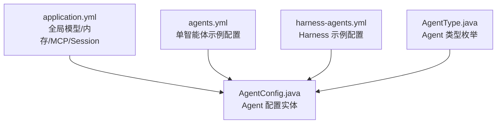
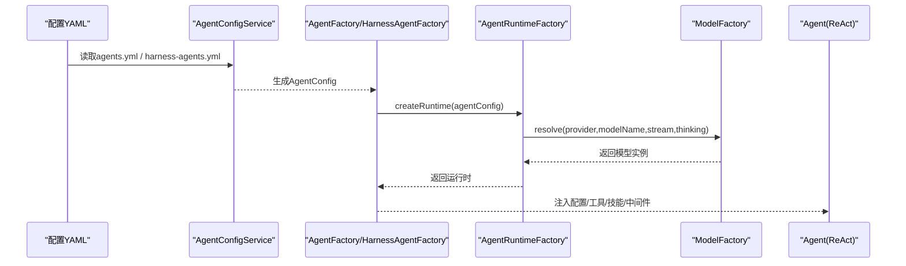
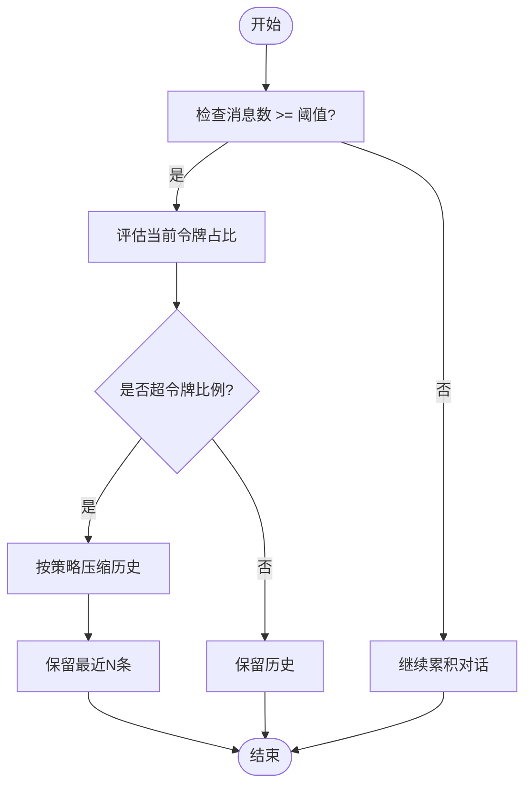
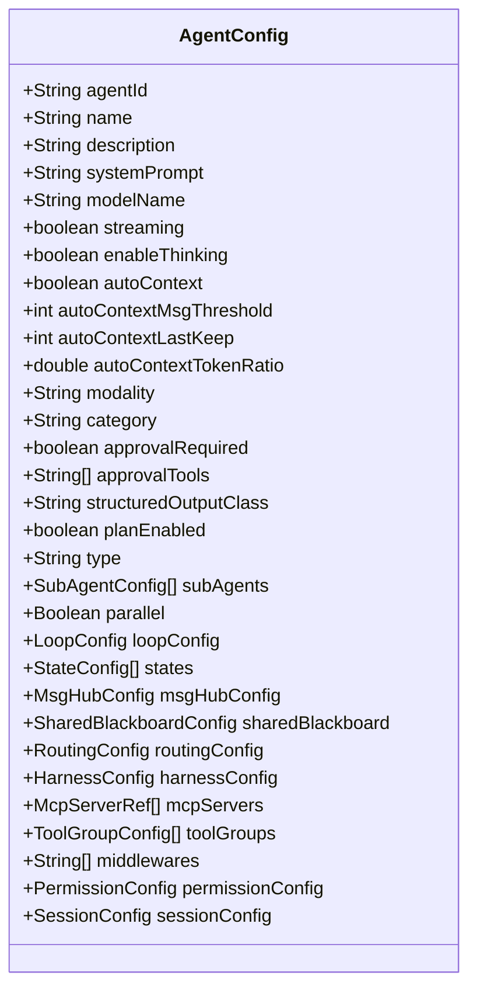

# 基础配置

<cite>
**本文档引用的文件**
- [AgentConfig.java](file://src/main/java/com/skloda/agentscope/agent/AgentConfig.java)
- [AgentType.java](file://src/main/java/com/skloda/agentscope/agent/AgentType.java)
- [Application 配置 application.yml](file://src/main/resources/application.yml)
- [示例 Agent 配置 agents.yml](file://src/main/resources/config/agents.yml)
- [Harness Agent 示例 harness-agents.yml](file://src/main/resources/config/harness-agents.yml)
</cite>

## 更新摘要
**变更内容**
- 更新了模型名称示例，将旧的 deepseek-v4-flash-0731 替换为最新的 deepseek-v4.1-flash
- 更新了 Basic Chat Agent 的模型名称从 qwen-plus 更新为 qwen3.8-flash
- 同步更新了应用级默认模型配置
- 保持了文档结构和核心概念的一致性

## 目录
1. [简介](#简介)
2. [项目结构](#项目结构)
3. [核心组件](#核心组件)
4. [架构总览](#架构总览)
5. [详细组件分析](#详细组件分析)
6. [依赖关系分析](#依赖关系分析)
7. [性能考虑](#性能考虑)
8. [故障排查指南](#故障排查指南)
9. [结论](#结论)
10. [附录：配置示例与最佳实践](#附录配置示例与最佳实践)

## 简介
本章节聚焦 Agent 的基础配置，围绕 AgentConfig 的核心属性展开说明，包括唯一标识、显示名、功能描述、系统提示词、模型配置（模型名称、流式响应、思维链）、以及上下文自动压缩相关参数。同时给出 Basic Chat、Tool Calling、Task Agent 的 YAML 配置范式，并总结常见配置陷阱与最佳实践。

## 项目结构
- 配置文件
  - 应用级模型与内存等全局开关位于 application.yml
  - 各 Agent 实例化配置位于 resources/config/agents.yml（普通单智能体）与 harness-agents.yml（Harness 多智能体）
- 代码模型
  - AgentConfig 定义 Agent 的所有可配置项，包含基础字段、AutoContextMemory、模态、权限、会话、多智能体、共享黑板、路由、中间件、MCP、工具组等
  - AgentType 列举支持的 Agent 类型（SINGLE/SEQUENTIAL/PARALLEL/ROUTING/HANDOFFS/LOOP/STATE_GRAPH/MSG_HUB/SUBAGENT_SEQ/SUBAGENT_PAR/HARNESS）

**图表来源**
- [application.yml:25-42](file://src/main/resources/application.yml#L25-L42)
- [AgentConfig.java:13-99](file://src/main/java/com/skloda/agentscope/agent/AgentConfig.java#L13-L99)
- [AgentType.java:1-26](file://src/main/java/com/skloda/agentscope/agent/AgentType.java#L1-L26)

**章节来源**
- [application.yml:25-42](file://src/main/resources/application.yml#L25-L42)
- [AgentConfig.java:13-99](file://src/main/java/com/skloda/agentscope/agent/AgentConfig.java#L13-L99)
- [agents.yml:1-91](file://src/main/resources/config/agents.yml#L1-L91)
- [AgentType.java:1-26](file://src/main/java/com/skloda/agentscope/agent/AgentType.java#L1-L26)

## 核心组件
- AgentId：Agent 的唯一标识符，用于路由与实例管理
- Name：Agent 显示名称，通常用于 UI 列表或控制台展示
- Description：Agent 功能描述，用于帮助用户理解 Agent 用途
- SystemPrompt：系统提示词，作为模型的系统指令来约定行为风格和约束
- ModelName：具体推理模型名称（如 **qwen3.8-flash**、**deepseek-v4.1-flash**），默认值在代码中设置；application.yml 也可提供全局默认 provider 与 modelName
- Streaming：是否开启流式响应，便于前端实时增量渲染
- EnableThinking：是否启用思维链（思考过程输出），增强可解释性但会消耗更多 Token
- AutoContext、AutoContextMsgThreshold、AutoContextLastKeep、AutoContextTokenRatio：控制对话上下文长度与内容裁剪策略

**章节来源**
- [AgentConfig.java:15-30](file://src/main/java/com/skloda/agentscope/agent/AgentConfig.java#L15-L30)
- [application.yml:25-42](file://src/main/resources/application.yml#L25-L42)
- [agents.yml:1-91](file://src/main/resources/config/agents.yml#L1-L91)

## 架构总览
下图展示从配置到运行时的关键路径：YAML 被加载为 AgentConfig → 由工厂创建对应 Runtime（基于 AgentType）→ 使用 ModelFactory 构造底层模型实例（遵循 global provider/model/stream/thinking 优先级）。

**图表来源**
- [agents.yml:1-91](file://src/main/resources/config/agents.yml#L1-L91)
- [harness-agents.yml:1-87](file://src/main/resources/config/harness-agents.yml#L1-L87)
- [AgentConfig.java:13-99](file://src/main/java/com/skloda/agentscope/agent/AgentConfig.java#L13-L99)
- [application.yml:25-42](file://src/main/resources/application.yml#L25-L42)

## 详细组件分析

### AgentConfig 核心属性详解
- agentId
  - 作用：Agent 唯一标识，决定实例缓存键、路由与调用
  - 建议：语义化且稳定，避免后期修改导致状态错乱
- name 与 description
  - 作用：面向用户的可读信息，影响界面呈现与引导语设计
  - 建议：与 systemPrompt 保持角色一致
- systemPrompt
  - 作用：以系统角色约束模型风格、边界和行为规范
  - 建议：明确能力范围、拒绝越权行为、规范输出格式
- modelName
  - **已更新**：代码默认值为 qwen-plus；示例 YAML 中多采用 **deepseek-v4.1-flash** 和 **qwen3.8-flash**
  - 优先顺序：Agent 级 modelName > application.yml 全局 model.dashscope.model-name > 其他 provider 默认
- streaming
  - 作用：开启后通过 SSE 推送消息片段提升交互体验
  - 建议：默认 true；长回复场景尤为重要
- enableThinking
  - 作用：开启"思考"链路，可观测但会增加 Token 成本与延迟
  - 建议：调试阶段开，生产按需关闭或降低预算

**章节来源**
- [AgentConfig.java:15-30](file://src/main/java/com/skloda/agentscope/agent/AgentConfig.java#L15-L30)
- [agents.yml:1-91](file://src/main/resources/config/agents.yml#L1-L91)
- [application.yml:25-42](file://src/main/resources/application.yml#L25-L42)

### 上下文自动压缩 AutoContextMemory
- autoContext（Boolean）
  - 作用：是否在对话过长时触发上下文压缩，防止超出模型窗口
  - 建议：任务型或长时间对话打开；短轮次对话可关闭
- autoContextMsgThreshold（Integer）
  - 作用：消息数量达到阈值时进入压缩评估
  - 建议：根据业务对话节奏调整，常用 20-50
- autoContextLastKeep（Integer）
  - 作用：压缩后保留最近的消息条数，保障近期对话不被丢失
  - 建议：5-20 之间平衡"记忆"与"成本"
- autoContextTokenRatio（Double）
  - 作用：当预估令牌超过上限时按比例回退更早历史
  - 建议：0.2-0.5 更激进节省；接近 1.0 较少压缩

**图表来源**
- [AgentConfig.java:26-30](file://src/main/java/com/skloda/agentscope/agent/AgentConfig.java#L26-L30)

**章节来源**
- [AgentConfig.java:26-30](file://src/main/java/com/skloda/agentscope/agent/AgentConfig.java#L26-L30)

### 行为与高级特性（节选）
- 模态 modality：text/vision/audio，配合多模态能力
- 分类 category：single/expert/collaboration，用于 UI 分组
- 审批 approvalRequired + approvalTools：对高危工具的 HITL（人审）控制
- 结构化输出 structuredOutputClass：约束返回的结构化数据 schema
- Plan 计划模式 planEnabled：配合 Harness 的计划任务
- 会话 SessionConfig：会话类型、存储路径
- 中间件 middlewares：审计、限流、指标采集等
- MCP toolGroups/mcpServers：扩展外部工具与服务发现

**章节来源**
- [AgentConfig.java:42-99](file://src/main/java/com/skloda/agentscope/agent/AgentConfig.java#L42-L99)

### 多智能体类型
- AgentType 决定执行模式：SINGLE（默认）、SEQUENTIAL、PARALLEL、ROUTING、HANDOFFS、DEBATE、LOOP、STATE_GRAPH、MSG_HUB、SUBAGENT_SEQ、SUBAGENT_PAR、HARNESS
- 不同模式对应不同的编排方式与事件形态（串行/并行/路由/协作/监督等）

**章节来源**
- [AgentType.java:1-26](file://src/main/java/com/skloda/agentscope/agent/AgentType.java#L1-L26)

## 依赖关系分析
- 配置层
  - agents.yml：每个 Agent 的具体配置入口
  - harness-agents.yml：Harness 模式下的 Agent 配置，支持子代理、文件系统、记忆、计划等
  - application.yml：全局模型 provider 与 model name、stream、enable-thinking 的默认值
- 代码层
  - AgentConfig：承载所有可配置项及嵌套配置类
  - AgentType：决定构建哪种 Runtime
  - 工厂与运行时：根据类型装配能力（工具、技能、中间件、权限、计划等）

**图表来源**
- [AgentConfig.java:13-99](file://src/main/java/com/skloda/agentscope/agent/AgentConfig.java#L13-L99)

**章节来源**
- [AgentConfig.java:13-99](file://src/main/java/com/skloda/agentscope/agent/AgentConfig.java#L13-L99)

## 性能考虑
- 开启 enableThinking 会带来额外 Token 和时延，适合调试或需要可解释性的场景；生产环境可按需关闭
- streaming 提升用户体验但不改变总 Token；对弱网络仍建议在服务端做节流与错误恢复
- AutoContext 压缩能显著降低成本并提升稳定性，但可能损失远端上下文；需结合业务容忍度调参
- **已更新**：modelName 切换需关注不同模型的吞吐与价格；推荐使用 **deepseek-v4.1-flash** 和 **qwen3.8-flash** 等最新模型以获得更好的性能和成本效益；默认与全局配置保持一致有助于简化排障

[本节为通用指导，不直接分析具体文件]

## 故障排查指南
- 无响应或无流
  - 确认 streaming 未误关；检查应用全局 stream 是否启用
  - 校验 modelName/provider 是否正确，必要时显式在 Agent 配置中指定
- 思考链未输出
  - 检查 enableThinking；若未生效，确认上游未覆盖为 false
- 上下文溢出
  - 启用 autoContext，调低 autoContextTokenRatio 或提高 threshold；合理设置 lastKeep
- 工具调用失败
  - 核对 userTools/systemTools 列表是否指向已注册的工具名；敏感工具可配置 approvalTools 以开启 HATL
- RAG/Rag 字段告警
  - Rag 字段标记为废弃，新实现推荐使用 Harness Memory 或升级后的知识模块

**章节来源**
- [application.yml:25-42](file://src/main/resources/application.yml#L25-L42)
- [AgentConfig.java:15-30](file://src/main/java/com/skloda/agentscope/agent/AgentConfig.java#L15-L30)

## 结论
Agent 基础配置以 AgentConfig 为中心，围绕身份、提示、模型与上下文管理四项主轴展开。实践中推荐：
- 用清晰 systemPrompt 界定能力边界
- 默认开启 streaming，按需开启 enableThinking
- 使用 AutoContext 保障长期对话稳定性
- 依据 Agent 类型（AgentType）选择合适的编排与资源配额
- **已更新**：选择最新的模型版本如 **deepseek-v4.1-flash** 和 **qwen3.8-flash** 以获得更好的性能和成本优化

[本节为总结性内容，不直接分析具体文件]

## 附录：配置示例与最佳实践

### 示例一：Basic Chat（简单对话）
- 目标：纯文本对话、简洁回答、良好交互
- 建议配置要点
  - agentId/name/description 明确用途
  - systemPrompt 规定语言风格、回答长度与准确性要求
  - **已更新**：modelName 选择 **qwen3.8-flash** 轻量快速模型以提升吞吐
  - streaming 保持开启，enableThinking 视需求开启
  - autoContext 适当开启以控制长期对话成本

**章节来源**
- [agents.yml:1-29](file://src/main/resources/config/agents.yml#L1-L29)

### 示例二：Tool Calling（工具调用）
- 目标：在对话过程中智能调用时间、计算、天气等工具
- 建议配置要点
  - systemPrompt 强调"何时/如何调用工具"，并要求向用户解释操作
  - userTools/systemTools 列出可用工具名称
  - **已更新**：modelName 使用 **deepseek-v4.1-flash** 以获得更好的工具调用能力
  - streaming/enableThinking 均建议开启以增强可观测性
  - autoContext 开启以应对多步工具调用产生的较长上下文

**章节来源**
- [agents.yml:30-61](file://src/main/resources/config/agents.yml#L30-L61)

### 示例三：Task Agent（文档解析与生成）
- 目标：解析上传文档并根据结果满足需求；如需发票，收集必要参数后调用工具生成
- 建议配置要点
  - skills/userTools/systemTools 匹配解析与文件处理工具
  - systemPrompt 明确必填字段、校验规则、输出格式
  - **已更新**：modelName 使用 **deepseek-v4.1-flash** 以获得更强的文档处理能力
  - streaming/enableThinking 开启便于追踪解析链路
  - approvalTools 将高风险操作置于审批流程（如发票生成）

**章节来源**
- [agents.yml:62-91](file://src/main/resources/config/agents.yml#L62-L91)

### 最佳实践清单
- 统一 modelName 策略：在 application.yml 设定全局默认 **deepseek-v4.1-flash**，个别 Agent 差异化覆盖
- 谨慎开启 enableThinking：生产环境仅在需要时可解释时开启，或降低 thinking-budget
- AutoContext 参数组合：先确保 lastKeep 足够，再调整 ratio 与 threshold，逐步收敛至稳定
- 安全策略：对写库/下载/导出类敏感工具启用 approvalRequired 与 approvalTools
- 模态与技能分离：modality 负责输入输出类型，skill/tool 负责能力绑定，减少耦合
- 多智能体类型选择：仅在高复杂度流程时使用 SEQUENTIAL/ROUTING/LOOP 等；默认 SINGLE 足够高效
- **已更新**：模型选择策略：优先使用 **deepseek-v4.1-flash** 进行复杂任务，**qwen3.8-flash** 进行简单对话任务，以获得最佳的性能成本比

**章节来源**
- [AgentConfig.java:13-99](file://src/main/java/com/skloda/agentscope/agent/AgentConfig.java#L13-L99)
- [agents.yml:1-91](file://src/main/resources/config/agents.yml#L1-L91)
- [application.yml:25-42](file://src/main/resources/application.yml#L25-L42)