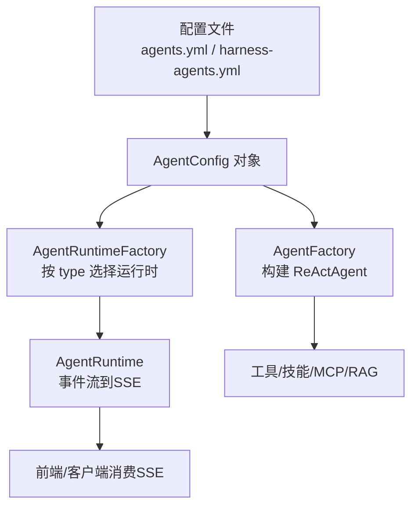
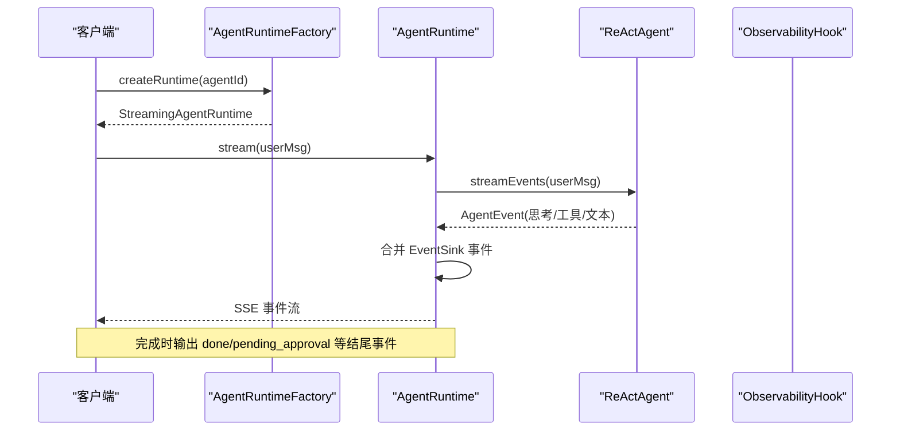
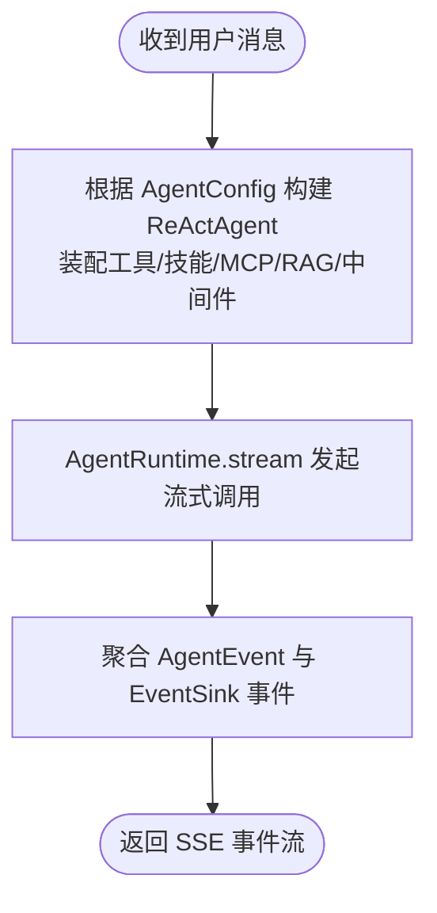
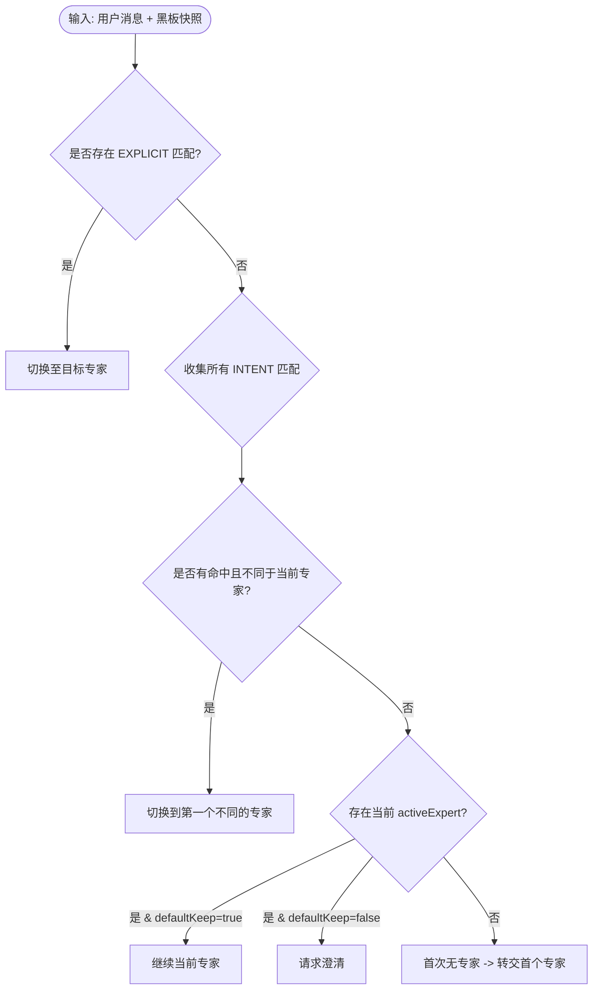
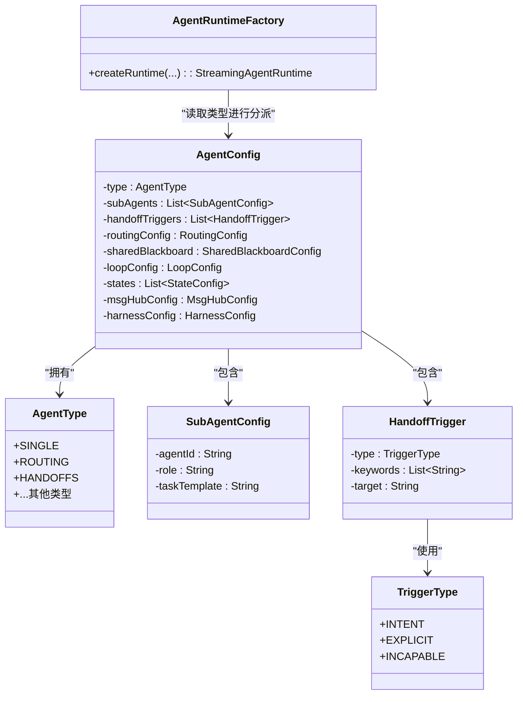

# Agent 类型配置

<cite>
**本文引用的文件**
- [AgentType.java](file://src/main/java/com/skloda/agentscope/agent/AgentType.java)
- [AgentConfig.java](file://src/main/java/com/skloda/agentscope/agent/AgentConfig.java)
- [agents.yml](file://src/main/resources/config/agents.yml)
- [harness-agents.yml](file://src/main/resources/config/harness-agents.yml)
- [AgentFactory.java](file://src/main/java/com/skloda/agentscope/agent/AgentFactory.java)
- [AgentRuntimeFactory.java](file://src/main/java/com/skloda/agentscope/runtime/AgentRuntimeFactory.java)
- [AgentRuntime.java](file://src/main/java/com/skloda/agentscope/runtime/AgentRuntime.java)
- [SubAgentConfig.java](file://src/main/java/com/skloda/agentscope/agent/SubAgentConfig.java)
- [HandoffTrigger.java](file://src/main/java/com/skloda/agentscope/agent/HandoffTrigger.java)
- [TriggerType.java](file://src/main/java/com/skloda/agentscope/agent/TriggerType.java)
- [RoutingDecisionService.java](file://src/main/java/com/skloda/agentscope/blackboard/RoutingDecisionService.java)
- [StateConfig.java](file://src/main/java/com/skloda/agentscope/agent/StateConfig.java)
- [MsgHubConfig.java](file://src/main/java/com/skloda/agentscope/agent/MsgHubConfig.java)
- [HarnessAgentFactory.java](file://src/main/java/com/skloda/agentscope/harness/HarnessAgentFactory.java)
</cite>

## 目录
1. [简介](#简介)
2. [项目结构概览](#项目结构概览)
3. [核心组件](#核心组件)
4. [架构总览](#架构总览)
5. [详细组件分析](#详细组件分析)
6. [依赖关系分析](#依赖关系分析)
7. [性能与生命周期管理](#性能与生命周期管理)
8. [故障排查指南](#故障排查指南)
9. [结论](#结论)
10. [附录](#附录)（选填）

## 简介
本文面向“Agent 类型配置”的深入使用与维护。重点解释三种核心的 Agent 类型在系统中的工作机制、适用场景与配置结构，并结合真实示例覆盖基础对话 Agent、任务型 Agent 和 RAG 问答 Agent 的配置方式。进一步说明不同 Agent 类型的生命周期管理、资源分配与执行策略，给出选择决策指南与最佳实践，帮助读者在单轮会话、多专家路由分发、交接处理之间做出正确选择并高效落地。

## 项目结构概览
- 配置入口：agents.yml 定义了多个具体 Agent 的元数据、系统提示词、工具与技能等；harness-agents.yml 聚焦 Harness 类型 Agent（沙箱、工作空间、记忆等高级能力）。
- 构建与装配：
  - AgentFactory 负责根据 agentId 解析配置、注册工具/技能/MCP、启用计划笔记与 RAG（旧 API）、挂载中间件、创建 ReActAgent 实例。
  - AgentRuntimeFactory 依据配置的 type 字段（SINGLE/ROUTING/HANDOFFS 等）创建对应的运行时容器。
- 运行时：AgentRuntime 负责将 Agent 的事件流映射为 SSE 事件并输出，处理 HITL（Human-in-the-Loop）审批恢复与结束。

图示来源
- [AgentRuntimeFactory.java:41-104](file://src/main/java/com/skloda/agentscope/runtime/AgentRuntimeFactory.java#L41-L104)
- [AgentFactory.java:131-200](file://src/main/java/com/skloda/agentscope/agent/AgentFactory.java#L131-L200)
- [AgentRuntime.java:67-142](file://src/main/java/com/skloda/agentscope/runtime/AgentRuntime.java#L67-L142)

章节来源
- [AgentRuntimeFactory.java:41-104](file://src/main/java/com/skloda/agentscope/runtime/AgentRuntimeFactory.java#L41-L104)
- [AgentFactory.java:131-200](file://src/main/java/com/skloda/agentscope/agent/AgentFactory.java#L131-L200)
- [AgentRuntime.java:67-142](file://src/main/java/com/skloda/agentscope/runtime/AgentRuntime.java#L67-L142)

## 核心组件
- AgentType：枚举了所有支持的 Agent 类型，其中 SINGLE 为默认类型，代表“基础对话”。其余包括 SEQUENTIAL、PARALLEL、ROUTING、HANDOFFS、DEBATE、LOOP、STATE_GRAPH、MSG_HUB、SUBAGENT_SEQ、SUBAGENT_PAR、HARNESS。
- AgentConfig：承载单个 Agent 的配置模型，包含基础属性（模型名、是否流式、思考开关）、子 Agent 列表、交接触发器、循环/状态图配置、共享黑板/路由配置、Harness 配置、MCP/工具分组、中间件、权限、会话等。
- 运行时工厂：基于 AgentType 分派到具体运行时或组合模式，如 ROUTING/HANDOFFS/HARNESS/STATE_GRAPH/MSG_HUB/LOOP 等。
- AgentRuntime：统一封装事件映射、审批恢复、完成事件下发、清理挂起工具调用等。

章节来源
- [AgentType.java:3-26](file://src/main/java/com/skloda/agentscope/agent/AgentType.java#L3-L26)
- [AgentConfig.java:15-100](file://src/main/java/com/skloda/agentscope/agent/AgentConfig.java#L15-L100)
- [AgentRuntimeFactory.java:41-104](file://src/main/java/com/skloda/agentscope/runtime/AgentRuntimeFactory.java#L41-L104)
- [AgentRuntime.java:67-142](file://src/main/java/com/skloda/agentscope/runtime/AgentRuntime.java#L67-L142)

## 架构总览
- 配置加载：AgentConfig 由 YAML 加载；agents.yml 提供常用 Agent；harness-agents.yml 定义具备沙箱/工作空间的复杂 Agent。
- 构建与装配：AgentFactory 组装 Model、Toolkit、RAG/LTM、Middleware、MCP 工具、Skill 仓库等，构造 ReActAgent。
- 路由与协作：
  - ROUTING：Supervisor 通过 Rule 或 LLM 策略决定下一轮交给哪个 Expert（SubAgent），结合 HandoffTrigger 与可选的 Shared Blackboard。
  - HANDOFFS：沿原有交接路径流转，支持显式/意图关键词触发切换。
  - STATE_GRAPH/LOOP/MSG_HUB/SEQUENTIAL/PARALLEL/HARNESS：对应不同的编排与运行模式。
- 运行时事件：AgentRuntime 将 Agent 的内部事件与外部多 Agent 事件合并后，输出给前端/SSE。

图示来源
- [AgentRuntimeFactory.java:41-104](file://src/main/java/com/skloda/agentscope/runtime/AgentRuntimeFactory.java#L41-L104)
- [AgentRuntime.java:67-142](file://src/main/java/com/skloda/agentscope/runtime/AgentRuntime.java#L67-L142)

章节来源
- [AgentRuntimeFactory.java:41-104](file://src/main/java/com/skloda/agentscope/runtime/AgentRuntimeFactory.java#L41-L104)
- [AgentRuntime.java:67-142](file://src/main/java/com/skloda/agentscope/runtime/AgentRuntime.java#L67-L142)

## 详细组件分析

### 一、SINGLE（基础对话）
- 行为与职责
  - 以单个 ReActAgent 为核心，负责单轮或多轮对话、工具调用、计划笔记、RAG（旧API）等。
  - 默认类型，适合大多数聊天、问答、简单工具调用场景。
- 配置要点
  - 基础字段：agentId、name、description、systemPrompt、modelName、streaming、enableThinking。
  - 知识与推理：autoContext 与阈值参数用于自动上下文压缩；ragEnabled 及其检索限制、阈值控制（注：v1 RAG API 已标记为废弃，建议使用 Harness MemoryConfig）。
  - 工具与技能：skills、userTools、systemTools 可分别声明，便于按需装配。
  - 审批与权限：approvalRequired 与 approvalTools；PermissionConfig 中 denyTools/askTools 可用于精细化权限控制。
  - 样本提示：samplePrompts 用于快速演示与预期行为校验。
- 典型用例
  - Basic Chat Agent：最小化配置，开启流式与思考，适合入门引导。
  - Task Agent：结合 skills/docx/pdf/xlsx 等解析能力与 userTools，执行文档分析与信息提取。
  - RAG Chat Agent：启用 ragEnabled，并配置检索数量与阈值，强调引用与无命中回退。

图示来源
- [AgentFactory.java:131-200](file://src/main/java/com/skloda/agentscope/agent/AgentFactory.java#L131-L200)
- [AgentRuntime.java:67-142](file://src/main/java/com/skloda/agentscope/runtime/AgentRuntime.java#L67-L142)

章节来源
- [AgentConfig.java:15-100](file://src/main/java/com/skloda/agentscope/agent/AgentConfig.java#L15-L100)
- [agents.yml:1-200](file://src/main/resources/config/agents.yml#L1-L200)
- [AgentFactory.java:131-200](file://src/main/java/com/skloda/agentscope/agent/AgentFactory.java#L131-L200)
- [AgentRuntime.java:67-142](file://src/main/java/com/skloda/agentscope/runtime/AgentRuntime.java#L67-L142)

### 二、ROUTING（路由分发）
- 行为与职责
  - Supervisor 根据静态规则或 LLM 策略决定下一轮转交给哪个 Expert（SubAgent）。
  - 通过 HandoffTrigger 设定关键词/意图触发，并可在首次未匹配时优先转交首个专家。
  - 可选择启用 SharedBlackboard 与 RoutingConfig（策略、置信度阈值、最近轮次、是否默认保持当前专家等）。
- 配置要点
  - AgentConfig.type=ROUTING。
  - subAgents[]：指定各专家的 agentId、描述、角色及任务模板。
  - handoffTriggers[]：type 可为 INTENT/EXPLICIT，keywords 列表，target 为目标专家。
  - routingConfig.strategy：rule（默认关键词）或 llm（扩展预留）；defaultKeep：无命中时的默认保留当前专家。
  - sharedBlackboard.enabled：当为 true 时将升级为 Supervised 模式并接入共享黑板。
- 路由决策流程（Rule 策略）

图示来源
- [RoutingDecisionService.java:65-145](file://src/main/java/com/skloda/agentscope/blackboard/RoutingDecisionService.java#L65-L145)
- [HandoffTrigger.java:18-26](file://src/main/java/com/skloda/agentscope/agent/HandoffTrigger.java#L18-L26)
- [TriggerType.java:3-17](file://src/main/java/com/skloda/agentscope/agent/TriggerType.java#L3-L17)

章节来源
- [AgentConfig.java:130-186](file://src/main/java/com/skloda/agentscope/agent/AgentConfig.java#L130-L186)
- [RoutingDecisionService.java:14-63](file://src/main/java/com/skloda/agentscope/blackboard/RoutingDecisionService.java#L14-L63)
- [RoutingDecisionService.java:65-145](file://src/main/java/com/skloda/agentscope/blackboard/RoutingDecisionService.java#L65-L145)
- [HandoffTrigger.java:10-26](file://src/main/java/com/skloda/agentscope/agent/HandoffTrigger.java#L10-L26)
- [TriggerType.java:1-17](file://src/main/java/com/skloda/agentscope/agent/TriggerType.java#L1-L17)

### 三、HANDOFFS（交接处理）
- 行为与职责
  - 沿用原有的交接路径，根据触发器（关键词/显式/能力不足）进行专家间交接。
  - 在当前版本中，HANDOFFS 不走共享黑板升级路径，保持原行为。
- 配置要点
  - AgentConfig.type=HANDOFFS。
  - 同 ROUTING，通过 handoffTriggers 与 subAgents 编排交接逻辑。
  - 适用于需要在现有交互链上逐步移交任务的处理模式。
- 创建路径
  - 由 AgentRuntimeFactory.createHandoffsRuntime 创建对应运行时；当前实现保持独立于 Supervisor/Shared Blackboard 的路径。

章节来源
- [AgentRuntimeFactory.java:137-144](file://src/main/java/com/skloda/agentscope/runtime/AgentRuntimeFactory.java#L137-L144)
- [AgentConfig.java:130-186](file://src/main/java/com/skloda/agentscope/agent/AgentConfig.java#L130-L186)
- [HandoffTrigger.java:10-26](file://src/main/java/com/skloda/agentscope/agent/HandoffTrigger.java#L10-L26)

### 四、其他相关类型（简述）
- STATE_GRAPH：使用 StateConfig/StateTransition 描述状态迁移，适用于订单履约等多阶段工作流。
- MSG_HUB：消息总线模式，通过 MsgHubConfig 控制轮次与摘要角色。
- LOOP：基于 LoopConfig 的多轮自调用与收敛。
- HARNESS：进入独立沙箱/工作空间环境，具备文件系统、记忆、任务清单、权限等完整能力。

章节来源
- [StateConfig.java:9-17](file://src/main/java/com/skloda/agentscope/agent/StateConfig.java#L9-L17)
- [MsgHubConfig.java:8-15](file://src/main/java/com/skloda/agentscope/agent/MsgHubConfig.java#L8-L15)
- [HarnessAgentFactory.java:42-200](file://src/main/java/com/skloda/agentscope/harness/HarnessAgentFactory.java#L42-L200)

## 依赖关系分析

图示来源
- [AgentType.java:3-26](file://src/main/java/com/skloda/agentscope/agent/AgentType.java#L3-L26)
- [AgentConfig.java:63-100](file://src/main/java/com/skloda/agentscope/agent/AgentConfig.java#L63-L100)
- [SubAgentConfig.java:11-17](file://src/main/java/com/skloda/agentscope/agent/SubAgentConfig.java#L11-L17)
- [HandoffTrigger.java:10-26](file://src/main/java/com/skloda/agentscope/agent/HandoffTrigger.java#L10-L26)
- [TriggerType.java:3-17](file://src/main/java/com/skloda/agentscope/agent/TriggerType.java#L3-L17)
- [AgentRuntimeFactory.java:41-104](file://src/main/java/com/skloda/agentscope/runtime/AgentRuntimeFactory.java#L41-L104)

章节来源
- [AgentConfig.java:63-186](file://src/main/java/com/skloda/agentscope/agent/AgentConfig.java#L63-L186)
- [AgentRuntimeFactory.java:41-104](file://src/main/java/com/skloda/agentscope/runtime/AgentRuntimeFactory.java#L41-L104)

## 性能与生命周期管理
- 生命周期关键点（以 SINGLE/HANDOFFS/ROUTING 为例）
  - 构建阶段：AgentFactory 一次性装配 Model、ToolKit、Skills、MCP、RAG/LTM、Middleware、Permissions。
  - 会话阶段：AgentRuntime 管理流式事件、清理历史挂起的 ToolUseBlock（避免影响下一轮上下文）、审批恢复。
  - 结束阶段：完成时输出 'done' 或 'pending_approval'，并关闭 EventSink。
- 资源分配
  - 非会话（stateless）：每次调用新建 InMemoryAgentStateStore，适合无状态测试与批处理。
  - 会话（stateful）：共享 AgentStateStore（内存/JSON/分布式 Redis/MySQL/PostgreSQL）复用同一上下文，适合持久化对话与多轮协作。
  - Harness 模式：工作空间/沙箱隔离，配合 FilesystemSpec、MemoryCompaction、ToolResultEviction 提升长期运行的稳健性。
- 执行策略
  - ROUTING：规则策略确定性高、开销低；LLM 策略可扩展但增加延迟（此处实现优先 fallback 到 rule）。
  - HANDOFFS：基于触发器的快速切换，适合强业务语义跳转。
  - HARNESS：更重资源占用，具备更强的隔离与可观测能力，适用于复杂任务闭环。

章节来源
- [AgentRuntime.java:67-142](file://src/main/java/com/skloda/agentscope/runtime/AgentRuntime.java#L67-L142)
- [AgentFactory.java:76-129](file://src/main/java/com/skloda/agentscope/agent/AgentFactory.java#L76-L129)
- [RoutingDecisionService.java:65-145](file://src/main/java/com/skloda/agentscope/blackboard/RoutingDecisionService.java#L65-L145)
- [HarnessAgentFactory.java:81-181](file://src/main/java/com/skloda/agentscope/harness/HarnessAgentFactory.java#L81-L181)

## 故障排查指南
- 常见问题与定位
  - 流式请求完成后前端仍显示“只能聊一次”：通常为 EventSink 未正确完成的环路问题，已在修复路径中将 sink 完成绑定到 agent 事件流的 finally 分支。
  - 审批恢复后丢失过程事件：审批恢复现在重新走 streamEvents()，确保与首调用一致的 typed event 流。
  - 上一请求中断导致悬挂的 ToolUseBlock：AgentRuntime 在新请求开始时清理残留的待完成工具调用块，避免污染上下文。
- 建议的检查点
  - 确认 AgentType/type 配置与期望一致；ROUTING 必须附带 subAgents 与 handoffTriggers 才能有效路由。
  - 校验 trigger.keywords 与业务术语匹配；明确 EXPLICIT/INTENT 优先级差异。
  - 若启用 RAG（旧API），注意检索阈值与上限；建议新项目转向 Harness MemoryConfig 以获得更好的长期体验。

章节来源
- [AgentRuntime.java:80-142](file://src/main/java/com/skloda/agentscope/runtime/AgentRuntime.java#L80-L142)
- [AgentRuntime.java:144-183](file://src/main/java/com/skloda/agentscope/runtime/AgentRuntime.java#L144-L183)
- [RoutingDecisionService.java:65-145](file://src/main/java/com/skloda/agentscope/blackboard/RoutingDecisionService.java#L65-L145)

## 结论
- 如果你的目标是“单一智能体快速完成对话、工具调用和知识检索”，优先选择 SINGLE。
- 如果需要“按关键词/意图在多专家之间精准分发”，选择 ROUTING；对稳定性敏感的场景首选 rule 策略，必要时再引入 LLM 策略。
- 如果已有“按规则进行专家交接”的历史方案，HANDOFFS 可以平滑延续。
- 对于“需要沙箱、工作空间、长期记忆与任务闭环”的复杂场景，选择 HARNESS。
- 始终关注生命周期与资源：会话态下共享 stateStore，跨轮稳定复用；非会话态用于无状态短流程。

## 附录
- 示例配置（摘自仓库文件，展示实际用法）
  - Basic Chat Agent：开启 streaming/thinking/autoContext，minimal tool usage
    - 参考：[agents.yml](file://src/main/resources/config/agents.yml)
  - Task Agent（文档分析 + 发票生成引导）
    - 参考：[agents.yml](file://src/main/resources/config/agents.yml)
  - RAG Chat Agent：ragEnabled + retrieveLimit + scoreThreshold
    - 参考：[agents.yml](file://src/main/resources/config/agents.yml)
  - Harness 演示（工作空间/记忆/任务清单/权限）
    - 参考：[harness-agents.yml](file://src/main/resources/config/harness-agents.yml)

章节来源
- [agents.yml:1-200](file://src/main/resources/config/agents.yml#L1-L200)
- [harness-agents.yml:1-87](file://src/main/resources/config/harness-agents.yml#L1-L87)