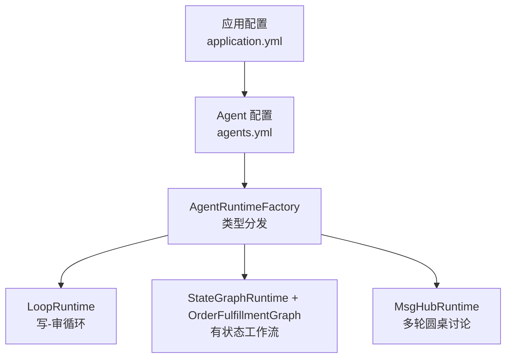
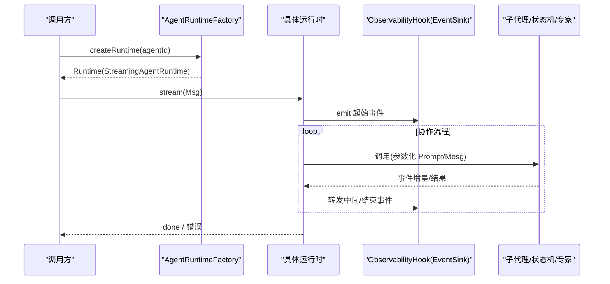
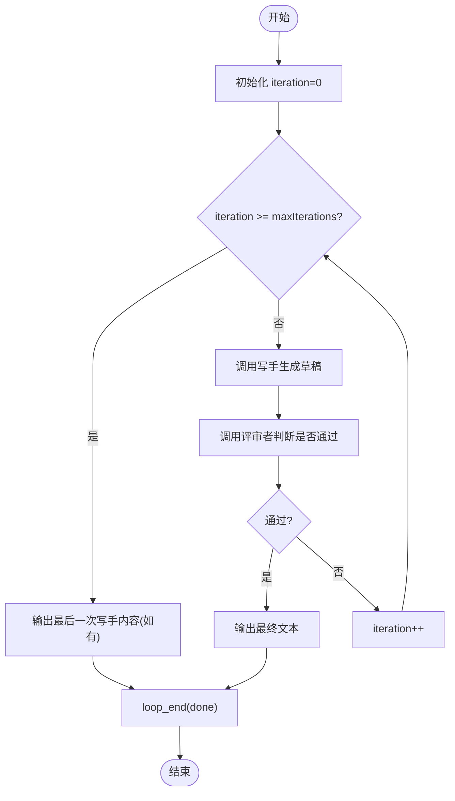
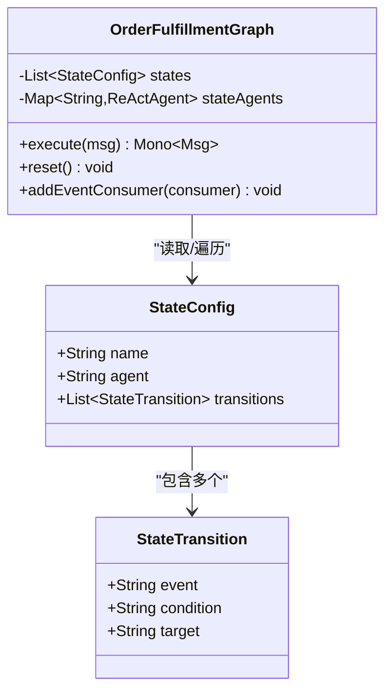
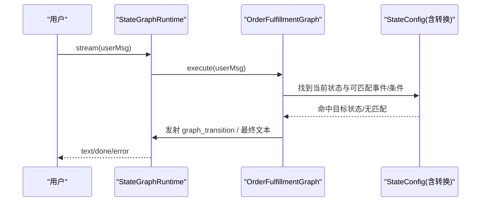
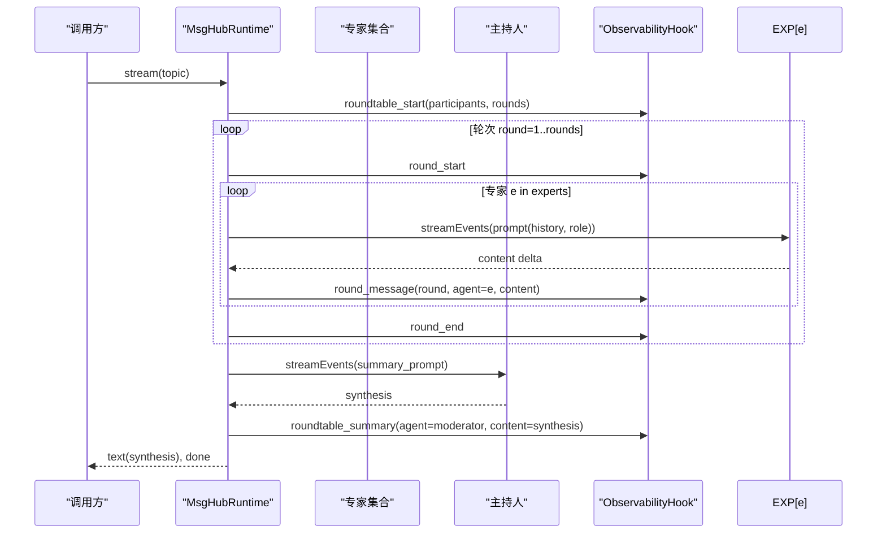
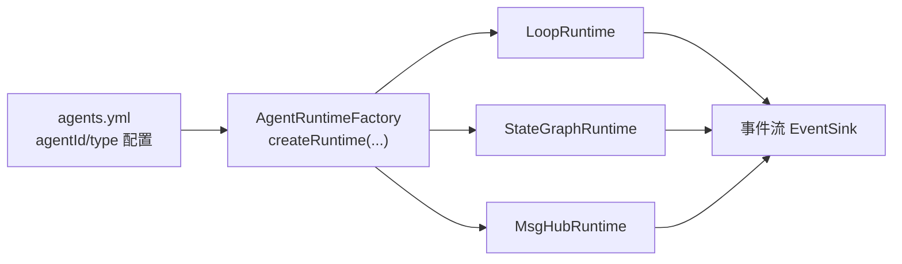
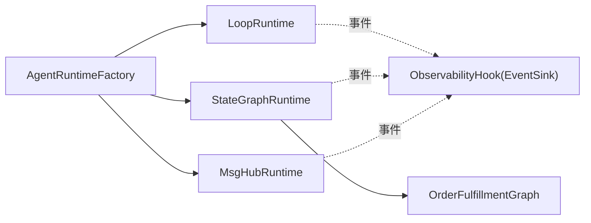

# 协作模式配置

<cite>
**本文引用的文件**
- [LoopConfig.java](file://src/main/java/com/skloda/agentscope/agent/LoopConfig.java)
- [StateConfig.java](file://src/main/java/com/skloda/agentscope/agent/StateConfig.java)
- [StateTransition.java](file://src/main/java/com/skloda/agentscope/agent/StateTransition.java)
- [MsgHubConfig.java](file://src/main/java/com/skloda/agentscope/agent/MsgHubConfig.java)
- [LoopRuntime.java](file://src/main/java/com/skloda/agentscope/runtime/LoopRuntime.java)
- [StateGraphRuntime.java](file://src/main/java/com/skloda/agentscope/runtime/StateGraphRuntime.java)
- [MsgHubRuntime.java](file://src/main/java/com/skloda/agentscope/runtime/MsgHubRuntime.java)
- [OrderFulfillmentGraph.java](file://src/main/java/com/skloda/agentscope/composite/graph/OrderFulfillmentGraph.java)
- [AgentRuntimeFactory.java](file://src/main/java/com/skloda/agentscope/runtime/AgentRuntimeFactory.java)
- [agents.yml](file://src/main/resources/config/agents.yml)
- [application.yml](file://src/main/resources/application.yml)
- [LoopConfigTest.java](file://src/test/java/com/skloda/agentscope/agent/LoopConfigTest.java)
- [StateConfigTest.java](file://src/test/java/com/skloda/agentscope/agent/StateConfigTest.java)
- [StateTransitionTest.java](file://src/test/java/com/skloda/agentscope/agent/StateTransitionTest.java)
- [MsgHubConfigTest.java](file://src/test/java/com/skloda/agentscope/agent/MsgHubConfigTest.java)
- [LoopRuntimeTest.java](file://src/test/java/com/skloda/agentscope/runtime/LoopRuntimeTest.java)
- [StateGraphRuntimeTest.java](file://src/test/java/com/skloda/agentscope/runtime/StateGraphRuntimeTest.java)
- [MsgHubRuntimeTest.java](file://src/test/java/com/skloda/agentscope/runtime/MsgHubRuntimeTest.java)
- [OrderFulfillmentGraphTest.java](file://src/test/java/com/skloda/agentscope/composite/graph/OrderFulfillmentGraphTest.java)
</cite>

## 目录
1. [简介](#简介)
2. [项目结构](#项目结构)
3. [核心组件](#核心组件)
4. [架构总览](#架构总览)
5. [组件详解](#组件详解)
6. [依赖关系分析](#依赖关系分析)
7. [性能与可观测性](#性能与可观测性)
8. [故障排查指南](#故障排查指南)
9. [结论](#结论)
10. [附录：典型业务流程配置示例](#附录：典型业务流程配置示例)

## 简介
本文面向多智能体协作模式的“配置层”与“运行时行为”，重点说明以下三类配置的用法与设计要点：
- LoopConfig（循环执行配置）：控制迭代次数、退出条件及最大轮次等；
- StateConfig（状态图配置）：定义状态节点、转换规则、初始状态和终态策略；
- MsgHubConfig（消息总线配置）：专家轮次讨论的轮数与主持人角色等。

同时给出复杂业务（如订单处理、审批流程）的完整配置与运行序列图示，并结合测试用例与实际运行时实现，帮助读者快速搭建高可用、可观测的多智能体工作流。

## 项目结构
与协作模式相关的代码集中在 agent（配置类）、runtime（运行时编排）与 composite/graph（状态机图）三个层次，配置数据来源于 agents.yml，并通过 AgentRuntimeFactory 按 AgentType 分发到对应运行时。

**图表来源**
- [AgentRuntimeFactory.java:41-60](file://src/main/java/com/skloda/agentscope/runtime/AgentRuntimeFactory.java#L41-L60)
- [LoopRuntime.java:29-66](file://src/main/java/com/skloda/agentscope/runtime/LoopRuntime.java#L29-L66)
- [StateGraphRuntime.java:13-32](file://src/main/java/com/skloda/agentscope/runtime/StateGraphRuntime.java#L13-L32)
- [MsgHubRuntime.java:25-46](file://src/main/java/com/skloda/agentscope/runtime/MsgHubRuntime.java#L25-L46)

**章节来源**
- [AgentRuntimeFactory.java:41-60](file://src/main/java/com/skloda/agentscope/runtime/AgentRuntimeFactory.java#L41-L60)
- [agents.yml:1-200](file://src/main/resources/config/agents.yml#L1-L200)
- [application.yml:25-70](file://src/main/resources/application.yml#L25-L70)

## 核心组件
本节概述与协作模式直接相关的数据模型及其职责边界。

- LoopConfig：封装循环执行的上下文参数，如最大迭代次数、退出条件。用于限定“写-审”循环的上限，避免无限重试。
- StateConfig：描述一个状态节点的名称、绑定代理以及在该状态下的若干转换。配合运行时完成状态图推进。
- StateTransition：描述从当前状态切换到目标状态的事件或条件，并指定目标状态。
- MsgHubConfig：描述消息总线（圆桌讨论）的讨论轮数与主持人角色，用于驱动多专家发言与最终汇总。

上述配置通过构造器、构建器和全参构造提供多种创建方式，单元测试验证了默认值与覆盖语义。

**章节来源**
- [LoopConfig.java:8-14](file://src/main/java/com/skloda/agentscope/agent/LoopConfig.java#L8-L14)
- [StateConfig.java:9-16](file://src/main/java/com/skloda/agentscope/agent/StateConfig.java#L9-L16)
- [StateTransition.java:8-15](file://src/main/java/com/skloda/agentscope/agent/StateTransition.java#L8-L15)
- [MsgHubConfig.java:8-14](file://src/main/java/com/skloda/agentscope/agent/MsgHubConfig.java#L8-L14)
- [LoopConfigTest.java:9-82](file://src/test/java/com/skloda/agentscope/agent/LoopConfigTest.java#L9-L82)
- [StateConfigTest.java:11-98](file://src/test/java/com/skloda/agentscope/agent/StateConfigTest.java#L11-L98)
- [StateTransitionTest.java:9-99](file://src/test/java/com/skloda/agentscope/agent/StateTransitionTest.java#L9-L99)
- [MsgHubConfigTest.java:9-112](file://src/test/java/com/skloda/agentscope/agent/MsgHubConfigTest.java#L9-L112)

## 架构总览
三种协作模式以统一的 StreamingAgentRuntime 暴露事件流，并由 AgentRuntimeFactory 根据 AgentType 选择实现。每种运行时都会将内部过程事件（如 start/end、iteration/result、round_message）写入统一的事件 sink，便于前端与监控消费。

**图表来源**
- [AgentRuntimeFactory.java:41-60](file://src/main/java/com/skloda/agentscope/runtime/AgentRuntimeFactory.java#L41-L60)
- [LoopRuntime.java:52-66](file://src/main/java/com/skloda/agentscope/runtime/LoopRuntime.java#L52-L66)
- [StateGraphRuntime.java:29-62](file://src/main/java/com/skloda/agentscope/runtime/StateGraphRuntime.java#L29-L62)
- [MsgHubRuntime.java:45-118](file://src/main/java/com/skloda/agentscope/runtime/MsgHubRuntime.java#L45-L118)

## 组件详解

### LoopRuntime 与 LoopConfig：写-审循环
LoopRuntime 实现了“撰写者-评审者”的迭代闭环：写稿→评审→通过/修改→继续……直到达到最大迭代或评审通过为止。其关键能力包括：
- 每轮发射 writer_output、iteration_result、text（最终稿）、loop_end、done 等事件；
- 到达最大迭代时，仍保证发出最后一次写手输出作为兜底内容；
- 使用固定关键词判定“通过”与否，简化评审逻辑。

LoopConfig 提供循环参数：
- maxIterations（等价源码中的 maxIterations）：限制循环上限；
- exitCondition（AUTO/MANUAL）：退出策略，自动判定或外部干预。

**图表来源**
- [LoopRuntime.java:69-135](file://src/main/java/com/skloda/agentscope/runtime/LoopRuntime.java#L69-L135)
- [LoopConfig.java:11-14](file://src/main/java/com/skloda/agentscope/agent/LoopConfig.java#L11-L14)

配置要点与注意事项：
- 设置合适的 maxIterations，避免过多 Token 消耗和响应延迟；
- 在“自动评审”中，评审提示词需引导评审者返回明确通过信号，确保稳定退出；
- 若需要更严格的通过标准或外部审批，可在上层结合 ApprovalMiddleware/HITL 机制（见项目整体设计文档）。

**章节来源**
- [LoopRuntime.java:29-166](file://src/main/java/com/skloda/agentscope/runtime/LoopRuntime.java#L29-L166)
- [LoopConfig.java:8-14](file://src/main/java/com/skloda/agentscope/agent/LoopConfig.java#L8-L14)
- [LoopRuntimeTest.java:29-79](file://src/test/java/com/skloda/agentscope/runtime/LoopRuntimeTest.java#L29-L79)

### StateGraphRuntime 与 StateConfig：状态图工作流
StateGraphRuntime 负责调度 OrderFulfillmentGraph（自定义状态机），将各状态的决策/事件匹配与状态迁移统一暴露为事件流。每个状态可绑定一个 ReActAgent（由 Agent 配置解析得到），在无 Agent 的状态下，基于用户输入匹配事件进行确定性切换。

StateConfig 与 StateTransition 的设计要点：
- states：一组状态节点，每个包含 name、agent（可选）、transitions（转换列表）；
- transitions：每条转换可声明 event（事件名）、condition（条件字符串）、target（目标状态）；
- 初始状态：取状态表第一个（若无则为 null），通过 StateGraphRuntime 初始化时确定；
- 终止状态：当某状态不存在或无 transitions 时可视为终点（例如已发货/DONE）。

**图表来源**
- [StateConfig.java:9-16](file://src/main/java/com/skloda/agentscope/agent/StateConfig.java#L9-L16)
- [StateTransition.java:8-15](file://src/main/java/com/skloda/agentscope/agent/StateTransition.java#L8-L15)
- [OrderFulfillmentGraph.java:22-102](file://src/main/java/com/skloda/agentscope/composite/graph/OrderFulfillmentGraph.java#L22-L102)

运行时序（单步事件驱动）：

**图表来源**
- [StateGraphRuntime.java:29-62](file://src/main/java/com/skloda/agentscope/runtime/StateGraphRuntime.java#L29-L62)
- [OrderFulfillmentGraph.java:39-101](file://src/main/java/com/skloda/agentscope/composite/graph/OrderFulfillmentGraph.java#L39-L101)

实践提示：
- 通过 condition 将 LLM 的“决策输出”映射到状态转换键；
- 支持事件别名（如 submit/提交），使自然语言也能触发确定流程；
- 对于“纯用户驱动”的路径，合理设计终态以安全结束流程。

**章节来源**
- [StateGraphRuntime.java:13-73](file://src/main/java/com/skloda/agentscope/runtime/StateGraphRuntime.java#L13-L73)
- [OrderFulfillmentGraph.java:22-200](file://src/main/java/com/skloda/agentscope/composite/graph/OrderFulfillmentGraph.java#L22-L200)
- [StateConfigTest.java:21-98](file://src/test/java/com/skloda/agentscope/agent/StateConfigTest.java#L21-L98)
- [StateTransitionTest.java:19-99](file://src/test/java/com/skloda/agentscope/agent/StateTransitionTest.java#L19-L99)
- [OrderFulfillmentGraphTest.java:48-190](file://src/test/java/com/skloda/agentscope/composite/graph/OrderFulfillmentGraphTest.java#L48-L190)

### MsgHubRuntime 与 MsgHubConfig：多轮圆桌讨论
MsgHubRuntime 实现“多专家、多轮次”的讨论模式：每轮依次让每位专家发言，并记录讨论摘要；所有轮结束后，主持人对全部观点进行总结。

MsgHubConfig 的关键配置：
- rounds：讨论轮数；
- summaryRole：主持人的角色标识（用于提示词构建与事件标注）。

**图表来源**
- [MsgHubRuntime.java:45-118](file://src/main/java/com/skloda/agentscope/runtime/MsgHubRuntime.java#L45-L118)
- [MsgHubConfig.java:12-14](file://src/main/java/com/skloda/agentscope/agent/MsgHubConfig.java#L12-L14)

注意要点：
- 事件流中包含 roundtable_start/round_start/round_message/round_end/roundtable_summary/text/done，可用于前端展示实时讨论与总结；
- 通过 summaryRole 可区分不同角色的总结风格；
- 合理的 rounds 能平衡深度与成本，建议按需配置并在上层提供停止控制。

**章节来源**
- [MsgHubRuntime.java:25-153](file://src/main/java/com/skloda/agentscope/runtime/MsgHubRuntime.java#L25-L153)
- [MsgHubConfig.java:8-14](file://src/main/java/com/skloda/agentscope/agent/MsgHubConfig.java#L8-L14)
- [MsgHubRuntimeTest.java:29-73](file://src/test/java/com/skloda/agentscope/runtime/MsgHubRuntimeTest.java#L29-L73)

### 配置与工厂集成
AgentRuntimeFactory 根据 agents.yml 中配置的 AgentType，将请求路由到对应运行时（LOOP、STATE_GRAPH、MSG_HUB 等），并组装钩子与 ObservabilityHook，使得各模式共享统一的可观测通道。

**图表来源**
- [AgentRuntimeFactory.java:41-60](file://src/main/java/com/skloda/agentscope/runtime/AgentRuntimeFactory.java#L41-L60)

**章节来源**
- [AgentRuntimeFactory.java:41-160](file://src/main/java/com/skloda/agentscope/runtime/AgentRuntimeFactory.java#L41-L160)
- [agents.yml:1-200](file://src/main/resources/config/agents.yml#L1-L200)

## 依赖关系分析
- AgentRuntimeFactory 依赖 CompositeAgentFactory 与 AgentConfigService，依据 AgentType 装配具体运行时；
- 各运行时均依赖 ObservabilityHook 的 EventSink 进行事件汇聚，供前端与观测系统消费；
- StateGraphRuntime 依赖 OrderFulfillmentGraph 的状态机引擎，而该引擎依赖于 StateConfig/StateTransition 的配置契约；
- MsgHubRuntime 依赖 MultiAgentStreamSupport 以桥接子代理流式输出。

**图表来源**
- [AgentRuntimeFactory.java:41-60](file://src/main/java/com/skloda/agentscope/runtime/AgentRuntimeFactory.java#L41-L60)
- [LoopRuntime.java:52-66](file://src/main/java/com/skloda/agentscope/runtime/LoopRuntime.java#L52-L66)
- [StateGraphRuntime.java:29-62](file://src/main/java/com/skloda/agentscope/runtime/StateGraphRuntime.java#L29-L62)
- [MsgHubRuntime.java:45-118](file://src/main/java/com/skloda/agentscope/runtime/MsgHubRuntime.java#L45-L118)

**章节来源**
- [AgentRuntimeFactory.java:41-160](file://src/main/java/com/skloda/agentscope/runtime/AgentRuntimeFactory.java#L41-L160)

## 性能与可观测性
- 循环与多轮讨论会产生大量事件流，应在业务侧评估 Token 与时延成本，合理设置 maxIterations、rounds；
- 使用统一事件流可便于追踪每次写稿、评审、状态转换、轮次进度与总结；
- 错误路径会发送 error 事件并以 done 收尾，保障客户端稳定重连/恢复；
- 建议在关键路径增加耗时统计（如 StateGraphRuntime 中已计算 durationMs）。

## 故障排查指南
常见问题定位思路：
- 循环未终止：检查评审提示词是否稳定返回通过关键词；增大 maxIterations 前先确认提示词有效性；
- 状态图卡住：确认状态配置中存在有效 transition，事件或条件匹配是否符合预期；
- 多轮讨论无总结：确认 rounds ≥ 1 且主持人未被错误跳过；检查 roundtable_summary 事件是否出现；
- 事件未达前端：观察 EventSink 是否被正常完成（done 事件）；必要时增加日志或指标采集。

**章节来源**
- [LoopRuntimeTest.java:52-79](file://src/test/java/com/skloda/agentscope/runtime/LoopRuntimeTest.java#L52-L79)
- [StateGraphRuntimeTest.java:85-117](file://src/test/java/com/skloda/agentscope/runtime/StateGraphRuntimeTest.java#L85-L117)
- [MsgHubRuntimeTest.java:29-63](file://src/test/java/com/skloda/agentscope/runtime/MsgHubRuntimeTest.java#L29-L63)

## 结论
本仓库提供了清晰而可扩展的多智能体协作模式配置与运行时：
- LoopConfig 控制循环上限与退出，搭配 Prompt 策略即可构建稳健的写-审闭环；
- StateConfig/StateTransition 组合出强大的有状态流程图，适用于订单、审批等长链路场景；
- MsgHubConfig 驱动多轮专家讨论与主持人总结，适合复杂问题求解与分析；
- 通过 AgentRuntimeFactory 的统一分发与 ObservabilityHook 的事件桥，三者共享一致的流式接口与可观测能力。

## 附录：典型业务流程配置示例
以下示例不粘贴实际代码，仅给出配置要点与步骤路径，实际字段参见对应配置与运行时定义。

### 示例一：订单履约（状态图）
- 目标：从下单、支付、发货到完成的端到端状态流转；
- 配置方法：
  - 定义若干 StateConfig（如 CREATED、SUBMITTED、PAID、SHIPPED、DONE），并为每一状态设置 transitions；
  - 事件命名可使用英文键并支持中文别名（如 pay/支付、ship/发货）；
  - 初始状态取状态列表第一项；当某状态没有 transitions 即为终态（如 DONE）；
- 运行验证：参考订单状态图的测试用例。

参考路径：
- [StateConfig 定义](file://src/main/java/com/skloda/agentscope/agent/StateConfig.java#L9-L16)
- [StateTransition 定义](file://src/main/java/com/skloda/agentscope/agent/StateTransition.java#L8-L15)
- [OrderFulfillmentGraph 执行与转换](file://src/main/java/com/skloda/agentscope/composite/graph/OrderFulfillmentGraph.java#L39-L101)
- [状态图测试（含中文别名/事件匹配）](file://src/test/java/com/skloda/agentscope/composite/graph/OrderFulfillmentGraphTest.java#L88-L136)

### 示例二：文档改写审核（循环）
- 目标：撰写-审核-修订的循环，直至通过或达到最大迭代；
- 配置方法：
  - 使用 LoopConfig 设置合理的 maxIterations 与 exitCondition（AUTO）；
  - 提示词工程上确保评审者明确返回“通过”相关词汇；
- 运行验证：参考循环运行时测试，确认最后输出与结束事件正确。

参考路径：
- [LoopConfig 参数](file://src/main/java/com/skloda/agentscope/agent/LoopConfig.java#L11-L14)
- [LoopRuntime 循环与结束路径](file://src/main/java/com/skloda/agentscope/runtime/LoopRuntime.java#L69-L135)
- [循环测试（含超出最大迭代时的兜底输出）](file://src/test/java/com/skloda/agentscope/runtime/LoopRuntimeTest.java#L52-L79)

### 示例三：技术决策圆桌（消息总线）
- 目标：多位专家就某一主题发表意见，主持人汇总；
- 配置方法：
  - 使用 MsgHubConfig 设置 rounds 与 summaryRole；
  - 借助事件流订阅 round_message、roundtable_summary 等事件；
- 运行验证：参考圆桌测试，确认轮次、成员发言与总结事件。

参考路径：
- [MsgHubConfig 参数](file://src/main/java/com/skloda/agentscope/agent/MsgHubConfig.java#L12-L14)
- [MsgHubRuntime 轮次与总结](file://src/main/java/com/skloda/agentscope/runtime/MsgHubRuntime.java#L45-L118)
- [圆桌测试](file://src/test/java/com/skloda/agentscope/runtime/MsgHubRuntimeTest.java#L29-L63)