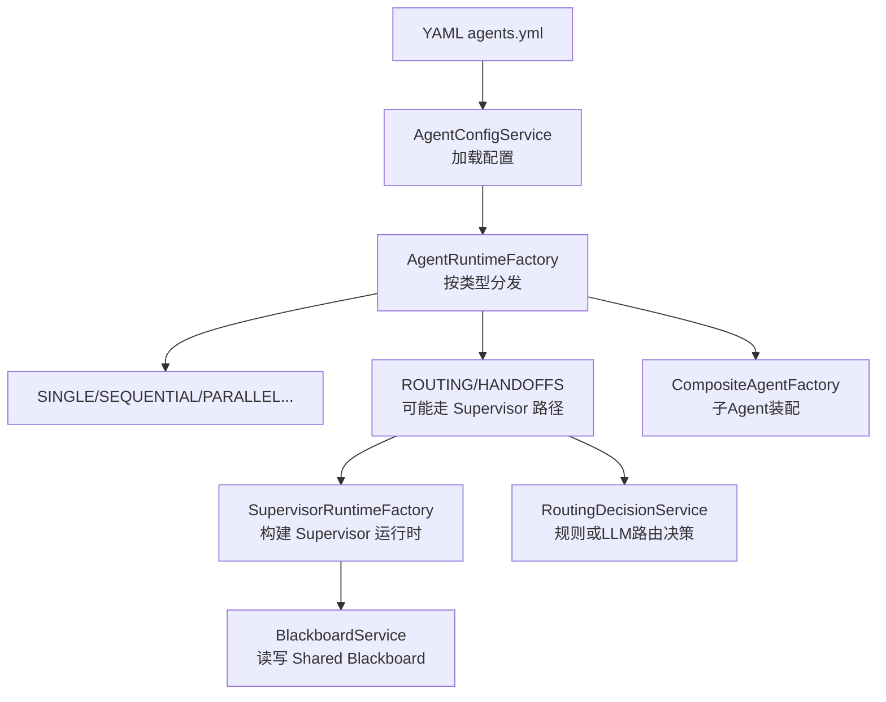
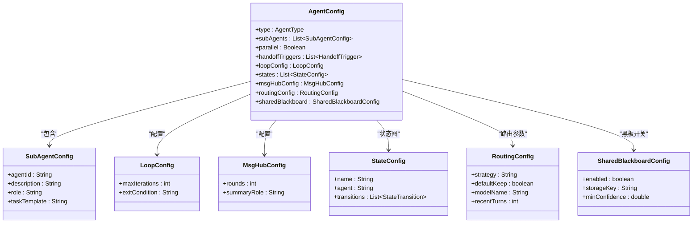
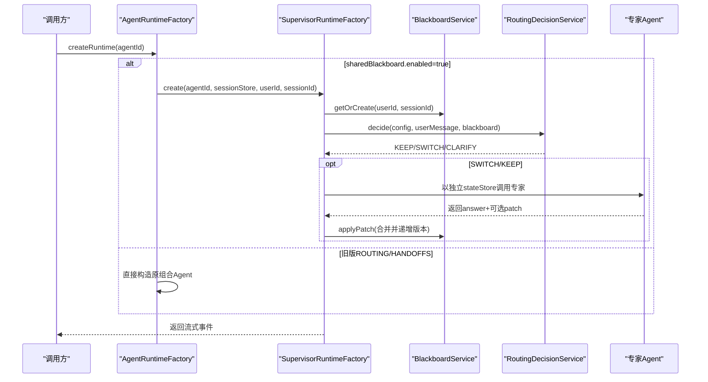
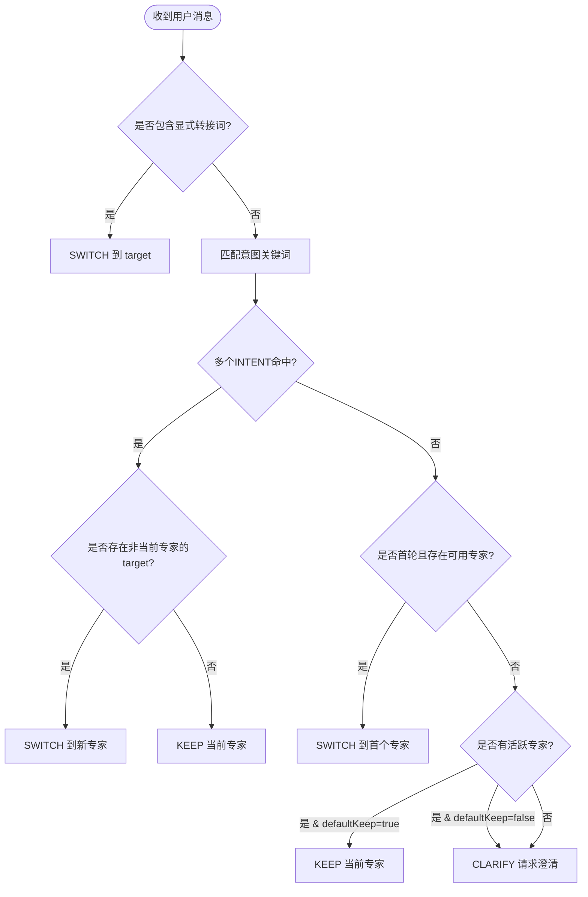
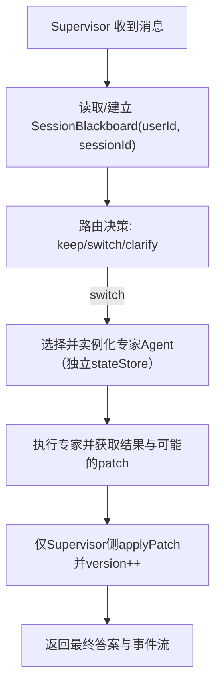
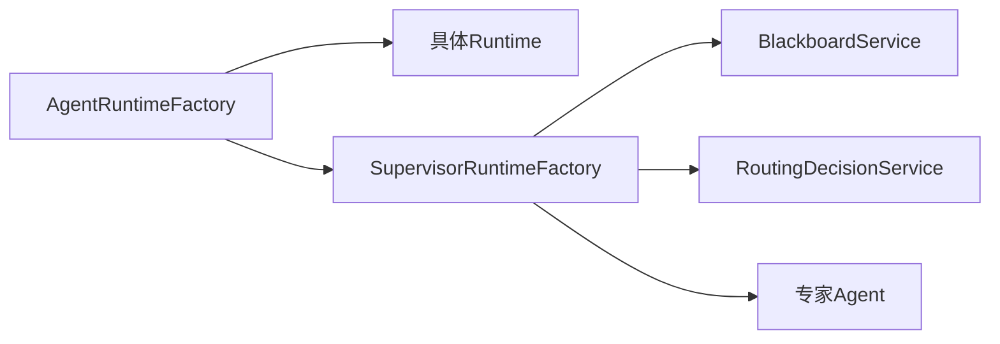

# 多智能体配置

<cite>
**本文引用的文件**   
- [AgentType.java](file://src/main/java/com/skloda/agentscope/agent/AgentType.java)
- [SubAgentConfig.java](file://src/main/java/com/skloda/agentscope/agent/SubAgentConfig.java)
- [LoopConfig.java](file://src/main/java/com/skloda/agentscope/agent/LoopConfig.java)
- [MsgHubConfig.java](file://src/main/java/com/skloda/agentscope/agent/MsgHubConfig.java)
- [StateConfig.java](file://src/main/java/com/skloda/agentscope/agent/StateConfig.java)
- [HandoffTrigger.java](file://src/main/java/com/skloda/agentscope/agent/HandoffTrigger.java)
- [TriggerType.java](file://src/main/java/com/skloda/agentscope/agent/TriggerType.java)
- [AgentConfig.java](file://src/main/java/com/skloda/agentscope/agent/AgentConfig.java)
- [AgentRuntimeFactory.java](file://src/main/java/com/skloda/agentscope/runtime/AgentRuntimeFactory.java)
- [SupervisorRuntimeFactory.java](file://src/main/java/com/skloda/agentscope/blackboard/SupervisorRuntimeFactory.java)
- [SessionBlackboard.java](file://src/main/java/com/skloda/agentscope/blackboard/SessionBlackboard.java)
- [RoutingDecisionServiceTest.java](file://src/test/java/com/skloda/agentscope/blackboard/RoutingDecisionServiceTest.java)
- [AgentConfigTest.java](file://src/test/java/com/skloda/agentscope/agent/AgentConfigTest.java)
- [agents.yml](file://src/main/resources/config/agents.yml)
- [supervisor-shared-blackboard-design.md](file://docs/supervisor-shared-blackboard-design.md)
</cite>

## 目录
1. [简介](#简介)
2. [项目结构](#项目结构)
3. [核心组件](#核心组件)
4. [架构总览](#架构总览)
5. [详细组件解析](#详细组件解析)
6. [依赖关系分析](#依赖关系分析)
7. [性能与可靠性考量](#性能与可靠性考量)
8. [故障排查指南](#故障排查指南)
9. [结论](#结论)
10. [附录：完整的多 Agent 协作配置示例](#附录：完整的多-agent-协作配置示例)

## 简介
本章节面向希望使用多智能体能力进行业务编排的用户，系统性说明如何通过配置实现不同的多 Agent 协作模式。内容覆盖：
- AgentType（SINGLE、ROUTING、HANDOFFS 等）的选择与适用场景
- SubAgentConfig 各字段（agentId、description、role、taskTemplate）的作用
- 协作模式配置：循环（loopConfig）、状态图（states）、消息总线（msgHubConfig）
- 路由策略：按规则或 LLM 的路由、默认保持、上下文轮次等
- Supervisor 模式的 Shared Blackboard 高级特性：存储键、置信度阈值等
- 端到端可运行的 YAML 示例位置指引

## 项目结构
多 Agent 相关的能力集中在以下层次：
- 配置层：AgentConfig、SubAgentConfig、LoopConfig、MsgHubConfig、StateConfig 等声明式配置
- 运行时层：AgentRuntimeFactory 根据类型创建不同 runtime；SupervisorRuntimeFactory 在启用 Shared Blackboard 时接管路由路径
- 共享黑板：SessionBlackboard、BlackboardService 及 Supervisor 路由决策服务
- 配置文件：agents.yml 中的多 Agent YAML 定义，包含 ROUTING/HANDOFFS/LOOP/MSG_HUB/STATE_GRAPH 等多种模式

**图表来源**
- [AgentRuntimeFactory.java:41-127](file://src/main/java/com/skloda/agentscope/runtime/AgentRuntimeFactory.java#L41-L127)
- [SupervisorRuntimeFactory.java:58-90](file://src/main/java/com/skloda/agentscope/blackboard/SupervisorRuntimeFactory.java#L58-L90)
- [SessionBlackboard.java:15-39](file://src/main/java/com/skloda/agentscope/blackboard/SessionBlackboard.java#L15-L39)
- [agents.yml:1064-1108](file://src/main/resources/config/agents.yml#L1064-L1108)

**节来源**
- [AgentRuntimeFactory.java:41-127](file://src/main/java/com/skloda/agentscope/runtime/AgentRuntimeFactory.java#L41-L127)
- [supervisor-shared-blackboard-design.md:17-31](file://docs/supervisor-shared-blackboard-design.md#L17-L31)

## 核心组件
本节聚焦多 Agent 的核心配置类型与作用：
- AgentType：决定运行时行为（单智能体/路由/交递/状态图/消息总线/顺序并行/Debate/循环/Harness等）。默认 SINGLE
- SubAgentConfig：子 Agent 引用与元信息，用于组合与编排
- LoopConfig：循环执行次数和退出条件
- MsgHubConfig：消息总线回合数与主持角色名
- StateConfig：状态图中的节点、关联 Agent、状态转移表
- HandoffTrigger / TriggerType：基于显式/意图关键词的手动或自动交接触发器
- AgentConfig：承载 type、subAgents、parallel、handoffTriggers、loop/states/msgHub、routingConfig 以及 sharedBlackboard

**图表来源**
- [AgentConfig.java:62-79](file://src/main/java/com/skloda/agentscope/agent/AgentConfig.java#L62-L79)
- [AgentConfig.java:131-185](file://src/main/java/com/skloda/agentscope/agent/AgentConfig.java#L131-L185)
- [SubAgentConfig.java:12-17](file://src/main/java/com/skloda/agentscope/agent/SubAgentConfig.java#L12-L17)
- [LoopConfig.java:12-15](file://src/main/java/com/skloda/agentscope/agent/LoopConfig.java#L12-L15)
- [MsgHubConfig.java:12-15](file://src/main/java/com/skloda/agentscope/agent/MsgHubConfig.java#L12-L15)
- [StateConfig.java:13-17](file://src/main/java/com/skloda/agentscope/agent/StateConfig.java#L13-L17)

**节来源**
- [AgentConfig.java:11-99](file://src/main/java/com/skloda/agentscope/agent/AgentConfig.java#L11-L99)
- [AgentType.java:3-26](file://src/main/java/com/skloda/agentscope/agent/AgentType.java#L3-L26)
- [SubAgentConfig.java:12-17](file://src/main/java/com/skloda/agentscope/agent/SubAgentConfig.java#L12-L17)
- [LoopConfig.java:12-15](file://src/main/java/com/skloda/agentscope/agent/LoopConfig.java#L12-L15)
- [MsgHubConfig.java:12-15](file://src/main/java/com/skloda/agentscope/agent/MsgHubConfig.java#L12-L15)
- [StateConfig.java:13-17](file://src/main/java/com/skloda/agentscope/agent/StateConfig.java#L13-L17)

## 架构总览
从用户入口到具体运行时的关键路径如下：
- 入口通过 AgentRuntimeFactory 依据 YAML 的 type 分支到不同 Runtime
- 当 agent 为 ROUTING 且启用了 Shared Blackboard，会经由 SupervisorRuntimeFactory 创建 Supervisor 运行时，结合 Rule/LLM 路由与 Shared Blackboard 的状态
- Shared Blackboard 将跨专家的业务事实持久化到特定存储键中，避免对话状态混用
- 规则路由与黑名单策略可由 RoutingConfig 控制不确定情况下的默认行为

**图表来源**
- [AgentRuntimeFactory.java:129-201](file://src/main/java/com/skloda/agentscope/runtime/AgentRuntimeFactory.java#L129-L201)
- [SupervisorRuntimeFactory.java:58-90](file://src/main/java/com/skloda/agentscope/blackboard/SupervisorRuntimeFactory.java#L58-L90)
- [SessionBlackboard.java:121-159](file://src/main/java/com/skloda/agentscope/blackboard/SessionBlackboard.java#L121-L159)

**节来源**
- [supervisor-shared-blackboard-design.md:32-91](file://docs/supervisor-shared-blackboard-design.md#L32-L91)

## 详细组件解析

### AgentType：SINGLE/ROUTING/HANDOFFS 的选择与工作机理
- SINGLE：单一 ReAct Agent，默认模式
- SEQUENTIAL/PARALLEL/DEBATE/LOOP/STATE_GRAPH/MSG_HUB/HARNESS：复合/流程类模式
- ROUTING/HANDOFFS：多专家协作路由
  - ROUTING：根据输入选择专家（规则或 LLM），将结果写回共享状态或直接返回
  - HANDOFFS：专家之间互相交接任务（传统实现）
- Shared Blackboard 增强后的 ROUTING：
  - 当共享黑板开启，ROUTING 升级为“Supervisor”模式
  - 使用 SessionBlackboard 存储跨专家会话事实，Supervisor 是唯一写入者
  - 路由决策支持 KEEP/SWITCH/CLARIFY 三种动作
  - 不再混用对话状态的 key（conversation agent_state 与 shared_blackboard 分离）

**节来源**
- [AgentType.java:3-26](file://src/main/java/com/skloda/agentscope/agent/AgentType.java#L3-L26)
- [AgentRuntimeFactory.java:47-60](file://src/main/java/com/skloda/agentscope/runtime/AgentRuntimeFactory.java#L47-L60)
- [AgentRuntimeFactory.java:129-201](file://src/main/java/com/skloda/agentscope/runtime/AgentRuntimeFactory.java#L129-L201)
- [supervisor-shared-blackboard-design.md:17-31](file://docs/supervisor-shared-blackboard-design.md#L17-L31)

### SubAgentConfig：agentId/description/role/taskTemplate 的作用
- agentId：被调用的子 Agent ID（必须已在 YAML 中定义）
- description：对角色的自然语言描述，常用于提示工程
- role：更高层的职责定义，有助于系统组织专家职责边界
- taskTemplate：任务模板占位符，可在不同上下文中渲染成具体指令

这些字段通常在路由/手交/组合编排中使用，用以指导 Supervisor/编排器如何选择合适的专家以及如何注入提示。

**节来源**
- [SubAgentConfig.java:12-17](file://src/main/java/com/skloda/agentscope/agent/SubAgentConfig.java#L12-L17)

### 协作模式配置：循环、状态图、消息总线
- loopConfig
  - maxIterations：最大迭代次数
  - exitCondition：退出条件（如 AUTO 表示由系统判断何时退出）
  - 适用于需要让 AI 在多轮内自我迭代收敛的场景（例如反思/验证）
- states（状态图）
  - name：状态节点名称
  - agent：该节点绑定的专家 agentId
  - transitions：转移规则集合，定义状态间转换条件与目标状态
  - 适合复杂业务流程的阶段推进（订单履约等）
- msgHubConfig（消息总线）
  - rounds：消息交换回合数
  - summaryRole：总结/主持角色名（例如 MODERATOR）
  - 适合多方讨论、聚合观点再收敛的协作

**节来源**
- [LoopConfig.java:12-15](file://src/main/java/com/skloda/agentscope/agent/LoopConfig.java#L12-L15)
- [StateConfig.java:13-17](file://src/main/java/com/skloda/agentscope/agent/StateConfig.java#L13-L17)
- [MsgHubConfig.java:12-15](file://src/main/java/com/skloda/agentscope/agent/MsgHubConfig.java#L12-L15)

### 路由策略：strategy/defaultKeep/recentTurns/trigger
- strategy：
  - rule：基于 HandoffTrigger（EXPLICIT/INTENT 等关键词匹配）的规则路由，确定性高
  - llm：预留的 LLM 路由方式（由 Supervisor 驱动或 fallback）
- defaultKeep：不确定性时的默认策略（true 保持当前专家；false 则澄清）
- recentTurns：传给 LLM 路由的最近 Supervisor 轮数，作为上下文窗口
- 优先级：
  - 显式转接 EXPLICIT 优先于意图 INTENT 命中
  - 首回合若未命中且有子专家，倾向路由到首个专家，避免卡死

可通过测试用例看到规则路径的行为：无命中时默认行为、首次轮优先路由、同专家重复命中保持、跨专家切换等。

**图表来源**
- [RoutingDecisionServiceTest.java:40-152](file://src/test/java/com/skloda/agentscope/blackboard/RoutingDecisionServiceTest.java#L40-L152)
- [AgentConfig.java:155-185](file://src/main/java/com/skloda/agentscope/agent/AgentConfig.java#L155-L185)
- [supervisor-shared-blackboard-design.md:121-148](file://docs/supervisor-shared-blackboard-design.md#L121-L148)

**节来源**
- [AgentConfig.java:155-185](file://src/main/java/com/skloda/agentscope/agent/AgentConfig.java#L155-L185)
- [supervisor-shared-blackboard-design.md:121-148](file://docs/supervisor-shared-blackboard-design.md#L121-L148)
- [RoutingDecisionServiceTest.java:40-152](file://src/test/java/com/skloda/agentscope/blackboard/RoutingDecisionServiceTest.java#L40-L152)

### Supervisor 模式的 Shared Blackboard：storageKey/minConfidence 与边界
- storageKey：用于区分会话对话状态与跨专家共享业务事实的存储键，默认为 "shared_blackboard"
- minConfidence：LLM 路由的最小置信度阈值，低于该值可能降级为 CLARIFY
- 数据模型字段包括 activeExpert、currentIntent、customerFacts、collectedSlots、businessState、findings、unresolvedQuestions 等
- 并发与安全：
  - Supervisor 是唯一写入者，专家只能提交 BlackboardPatch
  - 通过版本号保证串行应用与单调性
  - 所有读返回防御副本，防止越界修改
- 三层状态隔离：
  - Conversation AgentState（对话）：key = "agent_state"
  - Shared Blackboard（跨专家业务事实）：key = 可配置（如 "shared_blackboard"）
  - Expert Private State（专家私有）：每次 dispatch 生命周期内的临时状态

**图表来源**
- [SessionBlackboard.java:121-159](file://src/main/java/com/skloda/agentscope/blackboard/SessionBlackboard.java#L121-L159)
- [SupervisorRuntimeFactory.java:58-90](file://src/main/java/com/skloda/agentscope/blackboard/SupervisorRuntimeFactory.java#L58-L90)

**节来源**
- [AgentConfig.java:131-185](file://src/main/java/com/skloda/agentscope/agent/AgentConfig.java#L131-L185)
- [SessionBlackboard.java:15-116](file://src/main/java/com/skloda/agentscope/blackboard/SessionBlackboard.java#L15-L116)
- [supervisor-shared-blackboard-design.md:17-31](file://docs/supervisor-shared-blackboard-design.md#L17-L31)

## 依赖关系分析
- AgentRuntimeFactory 根据 type 分派不同 runtime，ROUTING 在共享黑板开启时进入 SupervisorRuntimeFactory
- SupervisorRuntimeFactory 注入 AgentConfigService、AgentFactory、BlackboardService、RoutingDecisionService，负责组装 Supervisor 运行时
- SessionBlackboard 提供不可变视图与 patch 合并逻辑，保障并发安全
- routingConfig 与 handoffTriggers 共同决定路由策略

**图表来源**
- [AgentRuntimeFactory.java:41-127](file://src/main/java/com/skloda/agentscope/runtime/AgentRuntimeFactory.java#L41-L127)
- [SupervisorRuntimeFactory.java:33-46](file://src/main/java/com/skloda/agentscope/blackboard/SupervisorRuntimeFactory.java#L33-L46)

**节来源**
- [AgentRuntimeFactory.java:41-127](file://src/main/java/com/skloda/agentscope/runtime/AgentRuntimeFactory.java#L41-L127)
- [SupervisorRuntimeFactory.java:33-90](file://src/main/java/com/skloda/agentscope/blackboard/SupervisorRuntimeFactory.java#L33-L90)

## 性能与可靠性考量
- 串行化：同一 (userId, sessionId) 的黑板补丁应用串行，保证版本号单调
- 资源隔离：专家每次获得独立的 InMemoryAgentStateStore，避免副作用污染
- 内存占用：Loop/MSG_HUB/状态图的多次交互会增加 token 与内存占用，合理设置 maxIterations、rounds 与 recentTurns
- 路由成本：LLM 路由策略引入额外延迟，rule 策略更可控但扩展性略弱
- 缓存与会话：Supervisor 使用会话级存储，建议合理复用会话以减少启动开销

[本节提供通用指导，无需特定代码引用]

## 故障排查指南
- 找不到 Agent 或未启用 sharedBlackboard：
  - 确认 agentId 存在且 sharedBlackboard.enabled 已打开，否则会走旧路径或不生效
- 路由结果与预期不符：
  - 检查 trigger 类型（EXPLICIT/INTENT）与关键词；必要时调整 defaultKeep/recentTurns
- 黑板未生效或数据丢失：
  - 确认 storageKey 正确且唯一；注意只由 Supervisor 写入
- 专家状态互相影响：
  - 确保每个专家拥有独立 stateStore；不要手动混用 conversation 与 blackboard

[本节提供通用问题定位思路，无需特定代码引用]

## 结论
- SINGLE 是最简入口，适合纯对话或少量工具调用
- 需要领域专家协同工作时，优先采用 ROUTING + Shared Blackboard，可获得确定性的规则路由与可扩展的 LLM 路由、稳定的跨专家业务状态共享
- LOOP/STATE_GRAPH/MSG_HUB 解决“过程型”任务编排，建议在复杂度提升时采用，同时控制规模
- SubAgentConfig 应清晰标注 agentId 与描述/职责，配合 handoffTriggers 形成明确的任务边界

[本节为总结性内容，无需特定代码引用]

## 附录：完整的多 Agent 协作配置示例
以下为可在仓库中直接使用的示例片段索引（请勿复制，请自行查看源文件）：
- 基础对话、工具调用、任务代理、发票生成、RAG 对话等示例定义
  - [agents.yml 中的多 Agent 示例](file://src/main/resources/config/agents.yml#L1-L210)
- 使用 Supervisor + Shared Blackboard 的典型配置（含 sharedBlackboard/routingConfig/subAgents）
  - [Supervisor 示例段（共享黑板/路由策略/子专家）](file://src/main/resources/config/agents.yml#L1064-L1108)

参考要点：
- 在 agents.yml 中将 agent type 设置为 ROUTING，并在 sharedBlackboard 中启用 enabled、设置 storageKey、minConfidence
- 配置 routingConfig.strategy 为 rule 或 llm；按需设置 defaultKeep 与 recentTurns
- subAgents 列出可用专家，HandoffTrigger 声明 EXPLICIT/INTENT 触发与目标专家
- 对于 LOOP/MSG_HUB/STATE_GRAPH，在对应 agent 下添加 loopConfig、msgHubConfig、states 配置项

[本小节通过文件路径索引示例，不包含实际代码片段]

**节来源**
- [agents.yml:1-210](file://src/main/resources/config/agents.yml#L1-L210)
- [agents.yml:1064-1108](file://src/main/resources/config/agents.yml#L1064-L1108)
- [AgentConfigTest.java:18-29](file://src/test/java/com/skloda/agentscope/agent/AgentConfigTest.java#L18-L29)