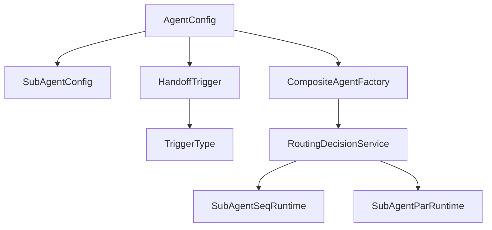
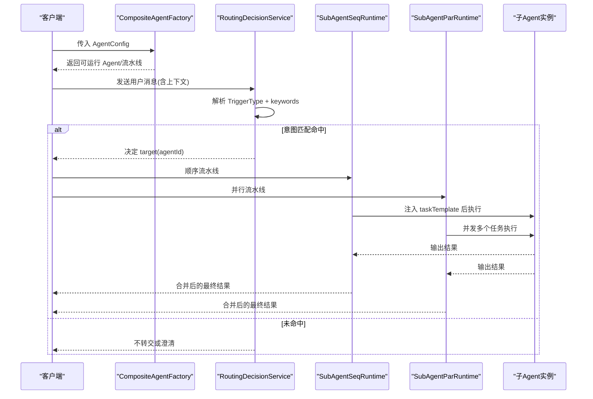
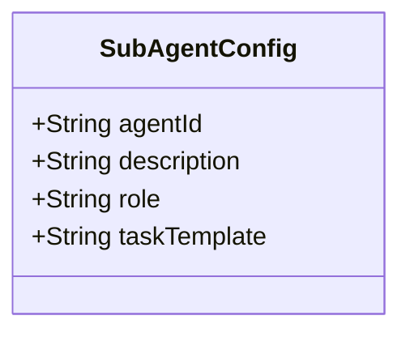
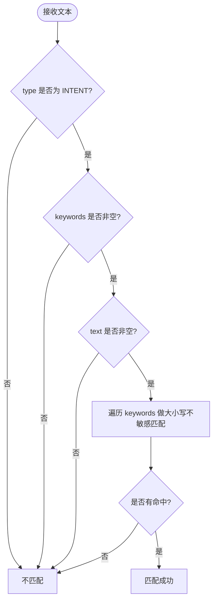
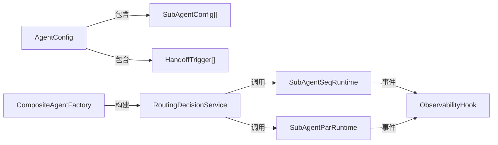

# 子智能体配置

<cite>
**本文档引用的文件**
- [SubAgentConfig.java](file://src/main/java/com/skloda/agentscope/agent/SubAgentConfig.java)
- [HandoffTrigger.java](file://src/main/java/com/skloda/agentscope/agent/HandoffTrigger.java)
- [TriggerType.java](file://src/main/java/com/skloda/agentscope/agent/TriggerType.java)
- [AgentConfig.java](file://src/main/java/com/skloda/agentscope/agent/AgentConfig.java)
- [CompositeAgentFactory.java](file://src/main/java/com/skloda/agentscope/composite/CompositeAgentFactory.java)
- [RoutingDecisionService.java](file://src/main/java/com/skloda/agentscope/blackboard/RoutingDecisionService.java)
- [SubAgentSeqRuntime.java](file://src/main/java/com/skloda/agentscope/runtime/SubAgentSeqRuntime.java)
- [SubAgentParRuntime.java](file://src/main/java/com/skloda/agentscope/runtime/SubAgentParRuntime.java)
- [harness-agents.yml](file://src/main/resources/config/harness-agents.yml)
- [agents.yml](file://src/main/resources/config/agents.yml)
- [SubAgentConfigTest.java](file://src/test/java/com/skloda/agentscope/agent/SubAgentConfigTest.java)
- [HandoffTriggerTest.java](file://src/test/java/com/skloda/agentscope/agent/HandoffTriggerTest.java)
- [TriggerTypeTest.java](file://src/test/java/com/skloda/agentscope/agent/TriggerTypeTest.java)
</cite>

## 目录
1. [简介](#简介)
2. [项目结构](#项目结构)
3. [核心组件](#核心组件)
4. [架构总览](#架构总览)
5. [详细组件分析](#详细组件分析)
6. [依赖关系分析](#依赖关系分析)
7. [性能考量](#性能考量)
8. [故障排查指南](#故障排查指南)
9. [结论](#结论)

## 简介
本文件聚焦于“子智能体配置”的完整说明，围绕 SubAgentConfig、HandoffTrigger 与 TriggerType 的属性、行为和使用方式进行深入讲解，并给出串行、并行与条件分支等多类协作模式的实践建议。同时结合运行时执行逻辑（顺序、并行）和路由服务对触发器的解析过程，帮助读者理解从配置到实际执行的全链路。

## 项目结构
子智能体相关能力分布在以下位置：
- 配置模型定义：agent 包下的 SubAgentConfig、HandoffTrigger、TriggerType、AgentConfig
- 组合构建与装配：composite 包的 CompositeAgentFactory
- 路由与分发：blackboard 包的 RoutingDecisionService
- 子智能体运行时：runtime 包的顺序与并行运行时（SubAgentSeqRuntime、SubAgentParRuntime）
- 示例与测试：test 包中的对应单元测试；resources 配置样例

**图表来源**
- [AgentConfig.java:64-66](file://src/main/java/com/skloda/agentscope/agent/AgentConfig.java#L64-L66)
- [CompositeAgentFactory.java:132-330](file://src/main/java/com/skloda/agentscope/composite/CompositeAgentFactory.java#L132-L330)
- [RoutingDecisionService.java:71-100](file://src/main/java/com/skloda/agentscope/blackboard/RoutingDecisionService.java#L71-L100)
- [SubAgentSeqRuntime.java:38-92](file://src/main/java/com/skloda/agentscope/runtime/SubAgentSeqRuntime.java#L38-L92)
- [SubAgentParRuntime.java:38-89](file://src/main/java/com/skloda/agentscope/runtime/SubAgentParRuntime.java#L38-L89)

**章节来源**
- [AgentConfig.java:64-66](file://src/main/java/com/skloda/agentscope/agent/AgentConfig.java#L64-L66)
- [CompositeAgentFactory.java:132-330](file://src/main/java/com/skloda/agentscope/composite/CompositeAgentFactory.java#L132-L330)
- [RoutingDecisionService.java:71-100](file://src/main/java/com/skloda/agentscope/blackboard/RoutingDecisionService.java#L71-L100)

## 核心组件
- SubAgentConfig：用于声明一个子 Agent 的基本信息，包括唯一标识、描述、角色、任务模板等关键属性，供父 Agent 在编排与执行时使用。
- HandoffTrigger：定义用户消息如何匹配并“交棒”给目标子 Agent，支持关键词匹配与显式意图触发。
- TriggerType：限定触发器类型，当前实现为基于意图的匹配与显式的用户请求两类。

本节重点解释以下要点：
- SubAgentConfig.agentId：子 Agent 的唯一标识符，便于调度与追踪。
- SubAgentConfig.description：简短的角色说明，有助于 LLM 理解该子 Agent 的职责范围。
- SubAgentConfig.role：职责定义字段，可与 system prompt 或任务模板配合使用，明确角色边界。
- SubAgentConfig.taskTemplate：任务模板，由父 Agent 或流水线在运行时将输入与上一步输出注入，构成完整的子 Agent 提示词。

**章节来源**
- [SubAgentConfig.java:12-17](file://src/main/java/com/skloda/agentscope/agent/SubAgentConfig.java#L12-L17)
- [SubAgentConfigTest.java:6-16](file://src/test/java/com/skloda/agentscope/agent/SubAgentConfigTest.java#L6-L16)

## 架构总览
配置到运行的关键流程：
- AgentConfig 中维护 subAgents 与 handoffTriggers。
- CompositeAgentFactory 根据 AgentConfig 组装 SubAgent 引用与路由规则。
- RoutingDecisionService 根据当前消息内容按 TriggerType 与关键词进行匹配决策，选择目标子 Agent。
- 顺序/并行运行时将任务模板填充后调用子 Agent，并通过事件流把各子步骤结果聚合返回。

**图表来源**
- [CompositeAgentFactory.java:132-330](file://src/main/java/com/skloda/agentscope/composite/CompositeAgentFactory.java#L132-L330)
- [RoutingDecisionService.java:71-100](file://src/main/java/com/skloda/agentscope/blackboard/RoutingDecisionService.java#L71-L100)
- [SubAgentSeqRuntime.java:38-92](file://src/main/java/com/skloda/agentscope/runtime/SubAgentSeqRuntime.java#L38-L92)
- [SubAgentParRuntime.java:38-89](file://src/main/java/com/skloda/agentscope/runtime/SubAgentParRuntime.java#L38-L89)

## 详细组件分析

### SubAgentConfig：子智能体描述与模板
- agentId（唯一标识符）
  - 用于在路由、执行及日志中区分不同子 Agent。
  - 通过 Builder 模式设置，确保不可变性与可组合性。
- description（角色描述）
  - 辅助 LLM 快速理解该 Agent 的能力面与适用范围。
- role（职责定义）
  - 提供更高维度的职责声明，可配合系统指令或业务策略使用。
- taskTemplate（任务模板）
  - 在顺序/并行流水线运行时，通过变量替换完成最终任务内容构建。
  - 顺序流水线会将上一阶段输出注入到 {prevOutput}，并将原始输入注入 {input}。
  - 并行流水线会为每个任务复制 {input}，生成独立任务内容并发执行。

**图表来源**
- [SubAgentConfig.java:12-17](file://src/main/java/com/skloda/agentscope/agent/SubAgentConfig.java#L12-L17)
- [SubAgentSeqRuntime.java:46-59](file://src/main/java/com/skloda/agentscope/runtime/SubAgentSeqRuntime.java#L46-L59)
- [SubAgentParRuntime.java:45-50](file://src/main/java/com/skloda/agentscope/runtime/SubAgentParRuntime.java#L45-L50)

**章节来源**
- [SubAgentConfig.java:12-17](file://src/main/java/com/skloda/agentscope/agent/SubAgentConfig.java#L12-L17)
- [SubAgentSeqRuntime.java:46-59](file://src/main/java/com/skloda/agentscope/runtime/SubAgentSeqRuntime.java#L46-L59)
- [SubAgentParRuntime.java:45-50](file://src/main/java/com/skloda/agentscope/runtime/SubAgentParRuntime.java#L45-L50)
- [SubAgentConfigTest.java:6-16](file://src/test/java/com/skloda/agentscope/agent/SubAgentConfigTest.java#L6-L16)

### HandoffTrigger 与 TriggerType：交棒规则与触发类型
- 触发器类型（TriggerType）
  - INTENT：基于关键词的意图匹配，仅在此类型下触发关键字扫描。
  - EXPLICIT：显式的用户请求匹配，适用于明确的切换语义。
  - INCAPABLE：能力不足触发，预留扩展点。
- 触发器字段（HandoffTrigger）
  - type：触发器类型。
  - keywords：关键词集合，匹配时采用大小写不敏感匹配。
  - target：命中后移交的目标 AgentId。
- matches(text) 行为要点
  - 当 type 不为 INTENT 或者缺少关键词/文本时，直接返回不匹配。
  - 当类型为 INTENT 且包含任意关键词（不区分大小写），则匹配成功。

**图表来源**
- [HandoffTrigger.java:19-25](file://src/main/java/com/skloda/agentscope/agent/HandoffTrigger.java#L19-L25)
- [TriggerType.java:3-16](file://src/main/java/com/skloda/agentscope/agent/TriggerType.java#L3-L16)
- [RoutingDecisionService.java:71-100](file://src/main/java/com/skloda/agentscope/blackboard/RoutingDecisionService.java#L71-L100)

**章节来源**
- [HandoffTrigger.java:14-26](file://src/main/java/com/skloda/agentscope/agent/HandoffTrigger.java#L14-L26)
- [TriggerType.java:3-16](file://src/main/java/com/skloda/agentscope/agent/TriggerType.java#L3-L16)
- [HandoffTriggerTest.java:8-31](file://src/test/java/com/skloda/agentscope/agent/HandoffTriggerTest.java#L8-L31)
- [TriggerTypeTest.java:6-16](file://src/test/java/com/skloda/agentscope/agent/TriggerTypeTest.java#L6-L16)

### 名称规范、权限隔离与资源限制
- 命名规范
  - 推荐使用短横线分隔的小写 ID（如 complaint-reviewer、finance-intel-tracker），便于配置可读性与稳定性。
  - 在 harness 示例中，子 Agent 通过 name 与 description 进一步表达职责，便于 UI 展示与运维管理。
- 权限隔离
  - Harness 配置中包含 isolationScope: USER，可在多用户场景中实现工作区与资源的用户级隔离，避免跨用户污染。
  - permissionConfig 支持默认策略（如 bypass）以及 denyTools/askTools 列表，可对工具访问进行细粒度控制。
- 资源限制
  - 通过 maxContextTokens 限制上下文大小；通过 compaction 参数控制消息压缩阈值。
  - executionMode 可选择 CLAW/BUILDER 等模式，不同模式对应不同的安全沙箱与工作空间策略（参考 Harness 配置）。

建议在子智能体设计时：
- 为每个子 Agent 赋予清晰的职责边界与最小可用权限。
- 针对涉及写入或高风险的操作，启用 askTools 或 approval 机制。
- 合理设置 memory/compaction/maxContextTokens，以控制成本与延迟。

**章节来源**
- [harness-agents.yml:12-43](file://src/main/resources/config/harness-agents.yml#L12-L43)
- [harness-agents.yml:63-82](file://src/main/resources/config/harness-agents.yml#L63-L82)
- [AgentConfig.java:100-106](file://src/main/java/com/skloda/agentscope/agent/AgentConfig.java#L100-L106)

### 协作模式与完整配置示例
以下为三种典型协作模式的设计要点与配置建议（以示例 YAML 与代码引用作为依据）：

1) 串行执行（Pipeline）
- 适用场景：多步骤数据处理或分析流水线，前一阶段的输出作为下一阶段的输入。
- 关键点：
  - 使用 SubAgentConfig.taskTemplate 组织输入传递，顺序执行时可引用 {prevOutput}。
  - 通过 ObservabilityHook 记录每一步的任务委托、开始与结束，便于前端观测。
- 参考：
  - 运行时串联逻辑与变量注入：[SubAgentSeqRuntime.java:46-59](file://src/main/java/com/skloda/agentscope/runtime/SubAgentSeqRuntime.java#L46-L59)
  - 任务生命周期事件与结果回传：[SubAgentSeqRuntime.java:51-69](file://src/main/java/com/skloda/agentscope/runtime/SubAgentSeqRuntime.java#L51-L69)
  - 示例 harness 子 Agent 清单（可作为串行步骤的候选）：[harness-agents.yml:34-43](file://src/main/resources/config/harness-agents.yml#L34-L43)

2) 并行处理
- 适用场景：需要同时对多个维度进行分析、检索或计算。
- 关键点：
  - 为每个子 Agent 准备独立的任务描述（taskDescription），复用 {input}。
  - 所有任务并发执行，结果聚合后再统一输出。
- 参考：
  - 并行任务构造与执行：[SubAgentParRuntime.java:45-55](file://src/main/java/com/skloda/agentscope/runtime/SubAgentParRuntime.java#L45-L55)
  - 结果聚合与输出格式：[SubAgentParRuntime.java:63-77](file://src/main/java/com/skloda/agentscope/runtime/SubAgentParRuntime.java#L63-L77)

3) 条件分支（路由/交棒）
- 适用场景：根据用户意图或显式命令将对话转交给专门领域专家。
- 关键点：
  - 通过 HandoffTrigger 设定 Intent 关键词匹配（INTENT）或显式切换（EXPLICIT）。
  - 路由服务先处理 EXPLICIT 类型的关键词匹配，再收集所有 INTENT 命中并进行判定。
  - 未命中时可按路由策略保持当前 Agent 或进入澄清流程。
- 参考：
  - 路由优先级与匹配顺序：[RoutingDecisionService.java:75-100](file://src/main/java/com/skloda/agentscope/blackboard/RoutingDecisionService.java#L75-L100)
  - TriggerType 的描述与作用域：[TriggerType.java:3-16](file://src/main/java/com/skloda/agentscope/agent/TriggerType.java#L3-L16)
  - 单元测试验证匹配行为与枚举值：[HandoffTriggerTest.java:20-30](file://src/test/java/com/skloda/agentscope/agent/HandoffTriggerTest.java#L20-L30)，[TriggerTypeTest.java:6-16](file://src/test/java/com/skloda/agentscope/agent/TriggerTypeTest.java#L6-L16)

上述模式均可与 Harness 的配置风格结合：通过 harness-config.subagents 声明能力单元（name、description），并在父 Agent 内部编排这些子能力形成流水线或路由图。

**章节来源**
- [SubAgentSeqRuntime.java:46-69](file://src/main/java/com/skloda/agentscope/runtime/SubAgentSeqRuntime.java#L46-L69)
- [SubAgentParRuntime.java:45-77](file://src/main/java/com/skloda/agentscope/runtime/SubAgentParRuntime.java#L45-L77)
- [RoutingDecisionService.java:71-100](file://src/main/java/com/skloda/agentscope/blackboard/RoutingDecisionService.java#L71-L100)
- [harness-agents.yml:34-43](file://src/main/resources/config/harness-agents.yml#L34-L43)
- [harness-agents.yml:71-82](file://src/main/resources/config/harness-agents.yml#L71-L82)

## 依赖关系分析
- AgentConfig 聚合了 SubAgentConfig 列表与 HandoffTrigger 列表，是父子关系的根节点。
- CompositeAgentFactory 负责读取上述配置并创建框架层的 SubAgent 结构与路由规则。
- RoutingDecisionService 消费 AgentConfig 的路由策略与触发器，对入站消息进行判定。
- 运行时模块（Sequential/Parallel）依赖事件钩子（ObservabilityHook）将子任务的生命周期事件发送到统一事件流。

**图表来源**
- [AgentConfig.java:64-66](file://src/main/java/com/skloda/agentscope/agent/AgentConfig.java#L64-L66)
- [CompositeAgentFactory.java:132-330](file://src/main/java/com/skloda/agentscope/composite/CompositeAgentFactory.java#L132-L330)
- [RoutingDecisionService.java:71-100](file://src/main/java/com/skloda/agentscope/blackboard/RoutingDecisionService.java#L71-L100)
- [SubAgentSeqRuntime.java:51-69](file://src/main/java/com/skloda/agentscope/runtime/SubAgentSeqRuntime.java#L51-L69)
- [SubAgentParRuntime.java:46-58](file://src/main/java/com/skloda/agentscope/runtime/SubAgentParRuntime.java#L46-L58)

## 性能考量
- 并行度控制：并行流水线会同时发起多个子任务，需注意后端负载与 token/超时限制，合理设置批次规模。
- 上下文压缩：Harness 配置提供了 compaction 参数（triggerMessages/keepMessages），可有效降低长会话成本。
- 观察与诊断：通过观察每条任务的 start/end/aggregate 事件，定位瓶颈 Agent 与慢路径。

建议：
- 对耗时较长的子任务，优先评估并行化收益与代价。
- 为大任务拆分更多子步骤，提升可控性与重试粒度。
- 结合权限与工具白名单，减少不必要的外部调用。

[本节提供通用指导，无需具体文件分析]

## 故障排查指南
- 交棒未生效
  - 检查 TriggerType 是否为 INTENT，并且 keywords 是否存在且与用户消息匹配。
  - 确认 HandoffTrigger.target 是否存在对应的子 AgentId。
  - 参考匹配逻辑与优先级：[RoutingDecisionService.java:71-100](file://src/main/java/com/skloda/agentscope/blackboard/RoutingDecisionService.java#L71-L100)
- 子 Agent 无输出或阻塞
  - 检查 taskTemplate 是否正确注入 {input}/{prevOutput}。
  - 查看事件流中是否触发了任务开始与结束事件，若仅有开始无结束，需排查子 Agent 侧异常。
  - 参考运行时事件上报：[SubAgentSeqRuntime.java:51-86](file://src/main/java/com/skloda/agentscope/runtime/SubAgentSeqRuntime.java#L51-L86)，[SubAgentParRuntime.java:46-83](file://src/main/java/com/skloda/agentscope/runtime/SubAgentParRuntime.java#L46-L83)
- Harness 子 Agent 权限被拒
  - 检查 permissionConfig.defaultMode/denyTools/askTools 是否限制了必要工具。
  - 必要时暂时设置为 bypass 进行测试，逐步收紧权限。
  - 参考 Harness 权限示例：[harness-agents.yml:17-29](file://src/main/resources/config/harness-agents.yml#L17-L29)

**章节来源**
- [RoutingDecisionService.java:71-100](file://src/main/java/com/skloda/agentscope/blackboard/RoutingDecisionService.java#L71-L100)
- [SubAgentSeqRuntime.java:51-86](file://src/main/java/com/skloda/agentscope/runtime/SubAgentSeqRuntime.java#L51-L86)
- [SubAgentParRuntime.java:46-83](file://src/main/java/com/skloda/agentscope/runtime/SubAgentParRuntime.java#L46-L83)
- [harness-agents.yml:17-29](file://src/main/resources/config/harness-agents.yml#L17-L29)

## 结论
通过 SubAgentConfig、HandoffTrigger 与 TriggerType 的配合，本系统实现了灵活而强大的子智能体编排与路由能力。推荐在实践中：
- 明确每个子 Agent 的职责与边界，合理使用角色描述与任务模板。
- 设计合理的触发关键词与显式指令，确保交棒准确性。
- 根据业务需求选择合适的串行、并行或混合模式，并结合 Harness 的权限与沙箱机制保障安全与稳定。
- 充分利用事件观测与日志，持续优化子智能体的效果与性能。

[本节总结性内容，无需具体文件分析]