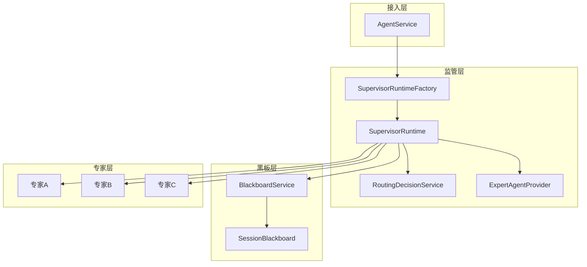
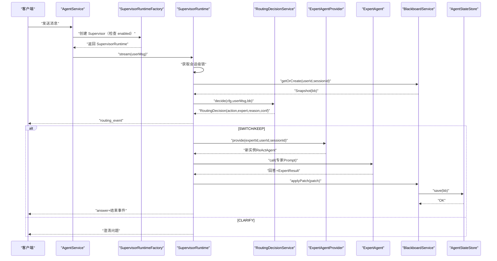
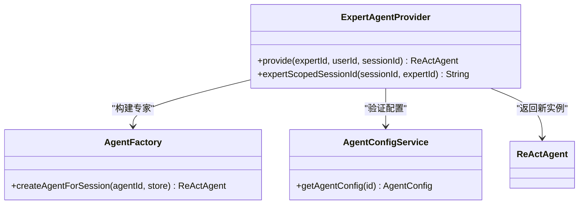
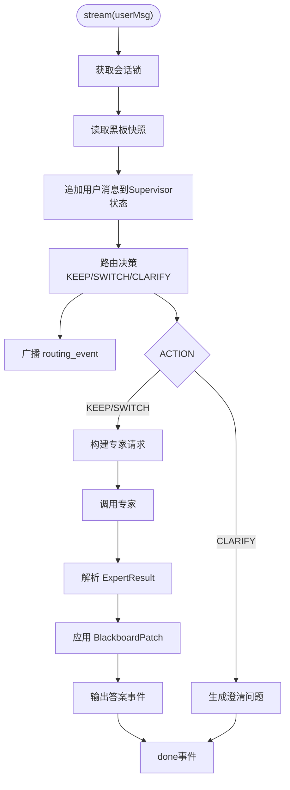
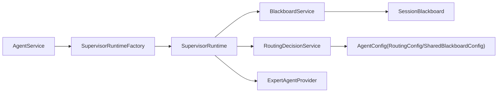

# 监管者模式配置

<cite>
**本文引用的文件**
- [SupervisorRuntime.java](file://src/main/java/com/skloda/agentscope/blackboard/SupervisorRuntime.java)
- [BlackboardService.java](file://src/main/java/com/skloda/agentscope/blackboard/BlackboardService.java)
- [SessionBlackboard.java](file://src/main/java/com/skloda/agentscope/blackboard/SessionBlackboard.java)
- [ExpertAgentProvider.java](file://src/main/java/com/skloda/agentscope/blackboard/ExpertAgentProvider.java)
- [RoutingDecisionService.java](file://src/main/java/com/skloda/agentscope/blackboard/RoutingDecisionService.java)
- [RoutingAction.java](file://src/main/java/com/skloda/agentscope/blackboard/RoutingAction.java)
- [BlackboardPatch.java](file://src/main/java/com/skloda/agentscope/blackboard/BlackboardPatch.java)
- [ExpertResult.java](file://src/main/java/com/skloda/agentscope/blackboard/ExpertResult.java)
- [SupervisorRuntimeFactory.java](file://src/main/java/com/skloda/agentscope/blackboard/SupervisorRuntimeFactory.java)
- [AgentConfig.java](file://src/main/java/com/skloda/agentscope/agent/AgentConfig.java)
- [AgentService.java](file://src/main/java/com/skloda/agentscope/service/AgentService.java)
- [agents.yml](file://src/main/resources/config/agents.yml)
- [supervisor-shared-blackboard-design.md](file://docs/supervisor-shared-blackboard-design.md)
- [BlackboardServiceTest.java](file://src/test/java/com/skloda/agentscope/blackboard/BlackboardServiceTest.java)
</cite>

## 目录
1. [简介](#简介)
2. [项目结构与职责划分](#项目结构与职责划分)
3. [核心组件总览](#核心组件总览)
4. [架构概览](#架构概览)
5. [详细组件分析](#详细组件分析)
6. [依赖关系分析](#依赖关系分析)
7. [性能与并发特性](#性能与并发特性)
8. [高级特性说明](#高级特性说明)
9. [配置示例与最佳实践](#配置示例与最佳实践)
10. [故障排查指南](#故障排查指南)
11. [结论](#结论)

## 简介
本文档聚焦“监管者模式”（Supervisor）实现，围绕 Shared Blackboard、专家发现与调度、以及路由决策质量保障展开。它将用户消息交由 Supervisor 进行意图识别和专家路由，通过会话级黑板存储跨专家业务事实；专家每次调用保持状态隔离；最终由 Supervisor 汇总结果并推进会话上下文。本文同时覆盖 SharedBlackboard 配置的 storageKey 规范与冲突避免策略、minConfidence 最小置信度阈值的质量控制机制、专家 Agent 的发现与聚合流程、SupervisorRuntime 的调度与恢复策略，以及动态加载、缓存、监控等进阶使用方式。

## 项目结构与职责划分
- blackboard：监管者与黑版核心能力
  - SessionBlackboard：跨专家共享的业务事实模型
  - BlackboardPatch：专家请求变更黑板的数据契约
  - ExpertResult：专家输出的标准化结果契约
  - ExpertFinding：审计轨迹记录
  - BlackboardService：黑板服务的持久化、并发保护、版本管理、防御复制
  - RoutingDecisionService：根据规则或策略输出 KEEP/SWITCH/CLARIFY
  - ExpertAgentProvider：构建单次调用的隔离专家实例
  - SupervisorRuntime / Factory：监管者运行时与构建器
- agent：配置模型
  - AgentConfig.SharedBlackboardConfig：启用开关、storageKey、minConfidence
  - AgentConfig.RoutingConfig：路由策略、默认行为、模型参数
- service：接入层
  - AgentService：统一创建流式 Agent 流，支持 Supervisor 分支
- resources/config：示例配置与多模式
  - agents.yml：包含 supervisor 示例与路由规则、子专家定义

图表来源
- [AgentService.java:80-120](file://src/main/java/com/skloda/agentscope/service/AgentService.java#L80-L120)
- [SupervisorRuntimeFactory.java:48-91](file://src/main/java/com/skloda/agentscope/blackboard/SupervisorRuntimeFactory.java#L48-L91)
- [SupervisorRuntime.java:134-156](file://src/main/java/com/skloda/agentscope/blackboard/SupervisorRuntime.java#L134-L156)
- [RoutingDecisionService.java:48-63](file://src/main/java/com/skloda/agentscope/blackboard/RoutingDecisionService.java#L48-L63)
- [BlackboardService.java:93-134](file://src/main/java/com/skloda/agentscope/blackboard/BlackboardService.java#L93-L134)

章节来源
- [agents.yml:1059-1141](file://src/main/resources/config/agents.yml#L1059-L1141)
- [supervisor-shared-blackboard-design.md:17-30](file://docs/supervisor-shared-blackboard-design.md#L17-L30)

## 核心组件总览
- SharedBlackboardConfig（AgentConfig）
  - enabled：是否启用监管者+黑板路径
  - storageKey：黑板在 AgentStateStore 中的键名，禁止为 "agent_state"
  - minConfidence：最小置信度阈值，低于该值触发澄清（影响路由质量门控）
- RoutingConfig（AgentConfig）
  - strategy：规则或 LLM 策略（当前内置 rule，预留 llm）
  - defaultKeep：不确定时是否保持当前专家
  - modelName、recentTurns：LLM 路由的可选控制项
- BlackboardService
  - 进程内按 (userId, sessionId) 分片加锁，串行应用补丁，保证版本号单调递增
  - 读返回防御性拷贝，写前重建可变对象，避免并发写入穿透底层存储引用
- SessionBlackboard
  - 存储 activeExpert、currentIntent、customerFacts、collectedSlots、businessState、findings、unresolvedQuestions 及 version/time 戳
  - applyPatch 支持浅合并与字段替换、追加审计、清空或保留问题列表
- ExpertAgentProvider
  - 每次 provide 都构造全新 InMemoryAgentStateStore + ReActAgent，确保专家内部状态绝对隔离
  - 通过 sessionId::expertId 形成专家作用域 session，防止状态碰撞
- RoutingDecisionService
  - 基于 EXPLICIT/INTENT 关键字匹配确定目标专家；未命中时根据 defaultKeep、activeExpert 决定 KEEP 或 CLARIFY
  - 首次无 activeExpert 且存在子专家时，默认路由到第一个专家，避免阻塞用户体验
- SupervisorRuntime
  - 对每轮 user 消息执行路由、专家调用、黑板更新、结果聚合，并以 SSE 事件形式回推
  - 明确丢弃专家侧 text/agent_start/agent_end/agent_result_text 原始事件，避免前端渲染异常
  - 以 per-(userId, sessionId) 粒度串行化关键步骤，保证路由 + 补丁串行
- SupervisorRuntimeFactory
  - 当且仅当路由 Agent 配置了 sharedBlackboard.enabled=true 才返回 SupervisorRuntime
  - 组装 Supervisor 的 Conversation Store（来自 SessionManager），构建 expertProvider/routingService

章节来源
- [AgentConfig.java:131-185](file://src/main/java/com/skloda/agentscope/agent/AgentConfig.java#L131-L185)
- [BlackboardService.java:18-38](file://src/main/java/com/skloda/agentscope/blackboard/BlackboardService.java#L18-L38)
- [SessionBlackboard.java:40-159](file://src/main/java/com/skloda/agentscope/blackboard/SessionBlackboard.java#L40-L159)
- [ExpertAgentProvider.java:13-106](file://src/main/java/com/skloda/agentscope/blackboard/ExpertAgentProvider.java#L13-L106)
- [RoutingDecisionService.java:14-63](file://src/main/java/com/skloda/agentscope/blackboard/RoutingDecisionService.java#L14-L63)
- [SupervisorRuntime.java:29-99](file://src/main/java/com/skloda/agentscope/blackboard/SupervisorRuntime.java#L29-L99)
- [SupervisorRuntimeFactory.java:28-91](file://src/main/java/com/skloda/agentscope/blackboard/SupervisorRuntimeFactory.java#L28-L91)

## 架构概览
监管者模式将“对话编排”与“专家执行”解耦，用 Shared Blackboard 承载跨专家共享事实。一轮处理流程如下：
1. AgentService 接收请求，判断是否为已启用 sharedBlackboard 的 Router Agent。
2. 若是，则使用 SupervisorRuntimeFactory 构造 SupervisorRuntime。
3. SupervisorRuntime.stream 获取 per-slot 锁后，读取黑板快照并记录用户消息。
4. 调用 RoutingDecisionService.decide 获得路由决策 KEEP/SWITCH/CLARIFY。
5. 广播 routing_event（含 action、previousExpert、selectedExpert、reason、confidence、blackboardVersion）。
6. 若 SWITCH/KEEP，构建专家请求并通过 ExpertAgentProvider 提供隔离的专家实例，执行业务并解析结果为 ExpertResult。
7. 将结果中的 BlackboardPatch 作为唯一写入源提交给 BlackboardService.applyPatch。
8. 向前端推送 answer，并将专家回复追加到 Supervisor Conversation AgentState。

图表来源
- [AgentService.java:80-120](file://src/main/java/com/skloda/agentscope/service/AgentService.java#L80-L120)
- [SupervisorRuntimeFactory.java:58-91](file://src/main/java/com/skloda/agentscope/blackboard/SupervisorRuntimeFactory.java#L58-L91)
- [SupervisorRuntime.java:134-193](file://src/main/java/com/skloda/agentscope/blackboard/SupervisorRuntime.java#L134-L193)
- [RoutingDecisionService.java:48-136](file://src/main/java/com/skloda/agentscope/blackboard/RoutingDecisionService.java#L48-L136)
- [BlackboardService.java:93-134](file://src/main/java/com/skloda/agentscope/blackboard/BlackboardService.java#L93-L134)

## 详细组件分析

### Shared Blackboard 配置与存储键规范
- storageKey 必须与 "agent_state" 不同，避免与 Supervisor 的对话状态混淆。默认值为 "shared_blackboard"。
- BlackboardService 启动时扫描所有 AgentConfig，取首个启用并设置 storageKey 的配置；未设置或扫描失败时使用默认键。
- 写路径通过 reconstructForWrite 从底层存储对象重建可变副本，再应用 patch 并保存，避免直接修改底层返回的引用导致并发问题。
- 每个 (userId, sessionId) 槽位持有独立的 ReentrantLock，保证顺序应用补丁与单调版本增长；跨槽位可并行。

最佳实践
- 生产环境中为每个 supervisor 配置独立的 storageKey，或在多实例部署中使用分布式 AgentStateStore 并在未来引入乐观锁；同一进程中不必担心重复 key。
- 不要修改默认 storageKey 为 "agent_state" 或与任何 AgentState 键冲突的字符串。

章节来源
- [BlackboardService.java:44-91](file://src/main/java/com/skloda/agentscope/blackboard/BlackboardService.java#L44-L91)
- [BlackboardService.java:164-197](file://src/main/java/com/skloda/agentscope/blackboard/BlackboardService.java#L164-L197)
- [SessionBlackboard.java:137-172](file://src/main/java/com/skloda/agentscope/blackboard/SessionBlackboard.java#L137-L172)
- [AgentConfig.java:131-153](file://src/main/java/com/skloda/agentscope/agent/AgentConfig.java#L131-L153)
- [supervisor-shared-blackboard-design.md:17-30](file://docs/supervisor-shared-blackboard-design.md#L17-L30)

### 质量控制：minConfidence 与置信度门控
- SharedBlackboardConfig.minConfidence 用于控制低置信度时的行为：当路由 confidence 低于此值时，Supervisor 应倾向澄清而不是盲目路由。
- 规则路由中：
  - EXPLICIT 触发高置信（固定较高的返回值）
  - INTENT 命中次高置信
  - CLARIFY 低置信表示不确定性较大
- LLM 路由预留接口，可通过 withConfidence 传入外部置信度，进而由上层在必要时触发澄清或重试。

建议
- 对于面向外部的客服场景，可将 minConfidence 设置在 0.5~0.7，确保把握不足时主动询问用户，减少误路由。
- 如果开启 defaultKeep=false，则在不确定性较高时更倾向于澄清，而非继续维持当前专家。

章节来源
- [AgentConfig.java:148-153](file://src/main/java/com/skloda/agentscope/agent/AgentConfig.java#L148-L153)
- [RoutingDecisionService.java:180-195](file://src/main/java/com/skloda/agentscope/blackboard/RoutingDecisionService.java#L180-L195)
- [RoutingAction.java:3-23](file://src/main/java/com/skloda/agentscope/blackboard/RoutingAction.java#L3-L23)
- [supervisor-shared-blackboard-design.md:121-148](file://docs/supervisor-shared-blackboard-design.md#L121-L148)

### ExpertAgentProvider：专家发现、调用与结果聚合
- 发现：根据 YAML 中声明的 expertId，通过 AgentConfigService 校验配置存在，不存在则快速失败。
- 构建：每次 provide 创建新的 InMemoryAgentStateStore + ReActAgent，严格隔离专家私有权限、工具、任务、计划等上下文。
- 调用边界：通过 sessionId::expertId 区分专家作用域会话，即使共用底层存储也不会碰撞。
- 结果聚合：Supervisor 是唯一的黑板写入者，专家仅返回 BlackboardPatch，由 Supervisor 验证并应用。

图表来源
- [ExpertAgentProvider.java:43-106](file://src/main/java/com/skloda/agentscope/blackboard/ExpertAgentProvider.java#L43-L106)
- [AgentConfig.java:131-185](file://src/main/java/com/skloda/agentscope/agent/AgentConfig.java#L131-L185)

章节来源
- [ExpertAgentProvider.java:13-106](file://src/main/java/com/skloda/agentscope/blackboard/ExpertAgentProvider.java#L13-L106)
- [AgentConfig.java:131-185](file://src/main/java/com/skloda/agent/AgentConfig.java#L131-L185)

### SupervisorRuntime：调度算法、并发控制与错误恢复
- 调度算法：
  1) 锁定会话级资源，读取黑板快照，记录用户消息
  2) 路由决策：规则策略优先匹配 EXPLICIT 然后 INTENT，未命中结合 defaultKeep 与 activeExpert 决定是否保持或澄清
  3) 专家执行：仅在 KEEP/SWITCH 分支触发，携带黑名单快照和摘要信息，避免重复提问
  4) 黑板更新：仅 Supervisor 应用 BlackboardPatch，确保版本单调与一致性
  5) 事件输出：先发 routing_event，再发文本响应事件与完成事件
- 并发控制：per-(userId, sessionId) 的重入锁串行化路由、专家调用与补丁应用，避免竞态。
- 错误恢复：
  - 外层捕获异常，发出 error 事件，并保证 finally 中发送 done 和 complete
  - 屏蔽专家原始 text/agent_start/agent_end/agent_result_text 事件，防止前端渲染紊乱

图表来源
- [SupervisorRuntime.java:134-193](file://src/main/java/com/skloda/agentscope/blackboard/SupervisorRuntime.java#L134-L193)
- [RoutingDecisionService.java:67-136](file://src/main/java/com/skloda/agentscope/blackboard/RoutingDecisionService.java#L67-L136)
- [BlackboardService.java:121-134](file://src/main/java/com/skloda/agentscope/blackboard/BlackboardService.java#L121-L134)

章节来源
- [SupervisorRuntime.java:90-193](file://src/main/java/com/skloda/agentscope/blackboard/SupervisorRuntime.java#L90-L193)
- [BlackboardService.java:178-197](file://src/main/java/com/skloda/agentscope/blackboard/BlackboardService.java#L178-L197)

### 数据模型与会话边界
- SessionBlackboard：集中保存跨专家共享的事实、意图、业务流程状态、审计轨迹与未解决问题，getter 均返回不可变视图，snapshot() 提供深度防御副本。
- BlackboardPatch：只增不改（浅合并与删除通过 null 值）、追加审计记录，clear/replacement 语义通过 unresolvedQuestions 的 null/[] 明确区分。
- ExpertResult：专家输出契约，包含 answer、confidence、可能为空的黑板补丁与待澄清问题清单。

章节来源
- [SessionBlackboard.java:40-172](file://src/main/java/com/skloda/agentscope/blackboard/SessionBlackboard.java#L40-L172)
- [BlackboardPatch.java:13-146](file://src/main/java/com/skloda/agentscope/blackboard/BlackboardPatch.java#L13-L146)
- [ExpertResult.java:11-76](file://src/main/java/com/skloda/agentscope/blackboard/ExpertResult.java#L11-L76)

## 依赖关系分析
- AgentService 负责统一入口，遇到 ROUTING 且 sharedBlackboard.enabled=true 走 SupervisorRuntimeFactory。
- SupervisorRuntimeFactory 校验配置，组装 SupervisorRuntime，注入 BlackboardService 与 RoutingDecisionService。
- SupervisorRuntime 依赖 ExpertAgentProvider 构造独立专家，依赖 BlackboardService 做持久化与安全更新，依赖 RoutingDecisionService 决定下一步行动。
- RoutingDecisionService 纯函数，输入当前消息、Supervisor 静态配置与黑板快照，输出路由决策。

图表来源
- [AgentService.java:80-120](file://src/main/java/com/skloda/agentscope/service/AgentService.java#L80-L120)
- [SupervisorRuntimeFactory.java:48-91](file://src/main/java/com/skloda/agentscope/blackboard/SupervisorRuntimeFactory.java#L48-L91)
- [SupervisorRuntime.java:134-193](file://src/main/java/com/skloda/agentscope/blackboard/SupervisorRuntime.java#L134-L193)
- [RoutingDecisionService.java:48-136](file://src/main/java/com/skloda/agentscope/blackboard/RoutingDecisionService.java#L48-L136)
- [BlackboardService.java:93-134](file://src/main/java/com/skloda/agentscope/blackboard/BlackboardService.java#L93-L134)

章节来源
- [AgentService.java:80-120](file://src/main/java/com/skloda/agentscope/service/AgentService.java#L80-L120)
- [SupervisorRuntimeFactory.java:28-91](file://src/main/java/com/skloda/agentscope/blackboard/SupervisorRuntimeFactory.java#L28-L91)

## 性能与并发特性
- 进程内串行保证：同一会话按槽位加锁，避免重复路由、补丁竞态、版本错乱。
- 防御性复制：所有读操作返回不可变视图与 snapshot，确保多线程安全读取。
- 版本单调：每次 applyPatch 增加 version，便于未来引入 CAS 与冲突检测。
- 事件透传优化：过滤专家副作用事件，减轻前端渲染压力。
- 可扩展后端：支持分布式 AgentStateStore（Redis/MySQL/PG），但当前无跨进程乐观锁，需未来演进。

章节来源
- [BlackboardService.java:22-33](file://src/main/java/com/skloda/agentscope/blackboard/BlackboardService.java#L22-L33)
- [BlackboardService.java:178-197](file://src/main/java/com/skloda/agentscope/blackboard/BlackboardService.java#L178-L197)
- [SessionBlackboard.java:121-172](file://src/main/java/com/skloda/agentscope/blackboard/SessionBlackboard.java#L121-L172)
- [supervisor-shared-blackboard-design.md:150-163](file://docs/supervisor-shared-blackboard-design.md#L150-L163)

## 高级特性说明
- 动态专家加载：ExpertAgentProvider 每次 provide 都从配置加载最新专家能力，不复用旧实例，天然支持热插拔式的策略扩展（例如新增专家类型只需加入 agents.yml）。
- 结果缓存：可通过 SupervisorRuntime 上游（如 AgentService 或业务层）对 ExpertResult 或路由决策结果进行缓存；注意缓存键需包含 conversation 上下文与版本信息以避免脏读。
- 性能监控：
  - 内置 timing 日志点（路由耗时、开始结束标记），可接入 MetricsCollectorMiddleware 或 ObservabilityHook 收集时序指标。
  - 可在 ExpertAgentProvider.provide 与 BlackboardService.applyPatch 处埋点测量专家调用耗时与黑版同步成本。
- 可扩展路由策略：现有 rule 稳定可用，llm 策略作为钩子预留，可在需要时用 LLM 路由并配合 minConfidence 门控提升准确性。

章节来源
- [ExpertAgentProvider.java:13-106](file://src/main/java/com/skloda/agentscope/blackboard/ExpertAgentProvider.java#L13-L106)
- [RoutingDecisionService.java:148-160](file://src/main/java/com/skloda/agentscope/blackboard/RoutingDecisionService.java#L148-L160)
- [SupervisorRuntime.java:158-193](file://src/main/java/com/skloda/agentscope/blackboard/SupervisorRuntime.java#L158-L193)

## 配置示例与最佳实践
以下为生产可用的监管者模式典型配置要点与做法：
- 在 agents.yml 中启用 sharedBlackboard.enabled 并为路由 Agent 指定 routingConfig.strategy=rule，默认 keep 合理。
- storageKey 建议使用 "shared_blackboard" 或业务前缀化的键，绝不要与 "agent_state" 重叠。
- 首次无人工干预的场景下，设置 defaultKeep=true 让系统保持当前专家，减少误澄清；敏感领域可设为 false 强制确认。
- 合理设定 minConfidence：常规 0.5~0.7；对高可靠场景可提高阈值以减少误判。
- 专家之间通过 BlackboardPatch 共享必要事实（如订单号、金额、失败原因），避免重复交互。
- 审计轨迹：使用 findingsToAdd 记录专家决策依据，便于回溯与诊断。
- 会话生命周期：必要时清理黑板 clear(userId,sessionId)，防止越权泄露或历史污染。

参考示例
- 智能客服 Supervisor（多专家协作）
- 超级主管（复杂任务分解协调）

章节来源
- [AgentConfig.java:131-185](file://src/main/java/com/skloda/agentscope/agent/AgentConfig.java#L131-L185)
- [supervisor-shared-blackboard-design.md:93-148](file://docs/supervisor-shared-blackboard-design.md#L93-L148)
- [agents.yml:1059-1141](file://src/main/resources/config/agents.yml#L1059-L1141)

## 故障排查指南
- 症状：路由始终停留在 CLARIFY
  - 检查 routingConfig.defaultKeep 是否为 true；否则无命中会澄清。
  - 检查 HandoffTrigger 是否设置了 INTENT/EXPLICIT 关键词。
  - 查看 routing_event 的 reason 字段定位原因。
- 症状：专家切换后事实丢失
  - 确认专家是否通过 BlackboardPatch 写入了 customerFacts/collectedSlots/businessState。
  - 确认 Supervisor 确实调用了 BlackboardService.applyPatch。
- 症状：并发写入版本混乱
  - 确认使用的是 BlackboardService.applyPatch（单写者约束），避免绕过服务直接存 Store。
  - 检查是否存在多实例并发写同一 (userId, sessionId)；如需强一致，考虑引入乐观锁升级。
- 症状：前端事件错乱或重复渲染
  - 确认 SupervisorRuntime 屏蔽了专家侧 text/agent_start/agent_end/agent_result_text，不要转发这些事件。

验证与自测
- BlackboardServiceTest 覆盖了版本增长、防御复制、跨会话隔离、空补丁等场景，可据此复现实验并断言期望行为。

章节来源
- [RoutingDecisionService.java:67-136](file://src/main/java/com/skloda/agentscope/blackboard/RoutingDecisionService.java#L67-L136)
- [BlackboardServiceTest.java:44-172](file://src/test/java/com/skloda/agentscope/blackboard/BlackboardServiceTest.java#L44-L172)
- [SupervisorRuntime.java:72-88](file://src/main/java/com/skloda/agentscope/blackboard/SupervisorRuntime.java#L72-L88)

## 结论
监管者模式通过显式 Shared Blackboard 与严格的写权限控制，解决了跨专家业务事实共享与状态隔离两大难题；SupervisorRuntime 提供稳定的调度、并发与容错能力；RoutingDecisionService 基于规则的可预测路由与可配置的置信度门控，使得系统既可靠又可演进。配合合理的 storageKey 治理与 minConfidence 门槛，可以在真实生产环境中稳定支撑复杂的客服、分析与协同任务。