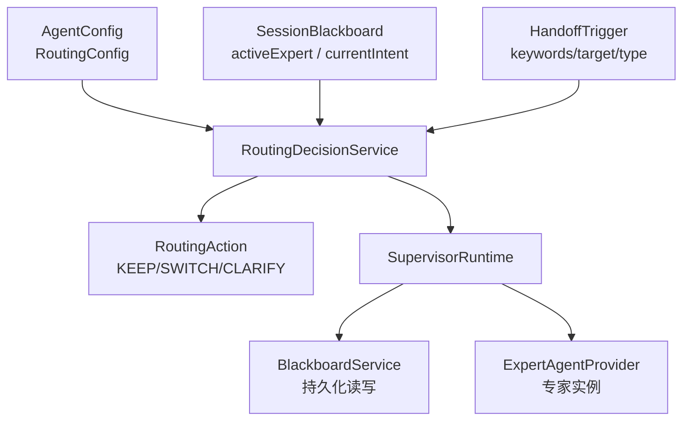
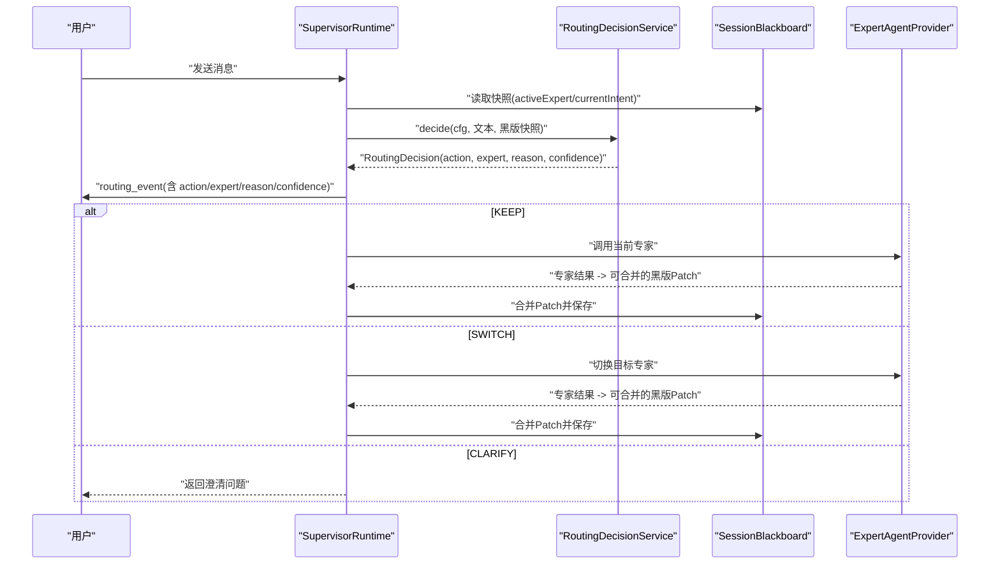
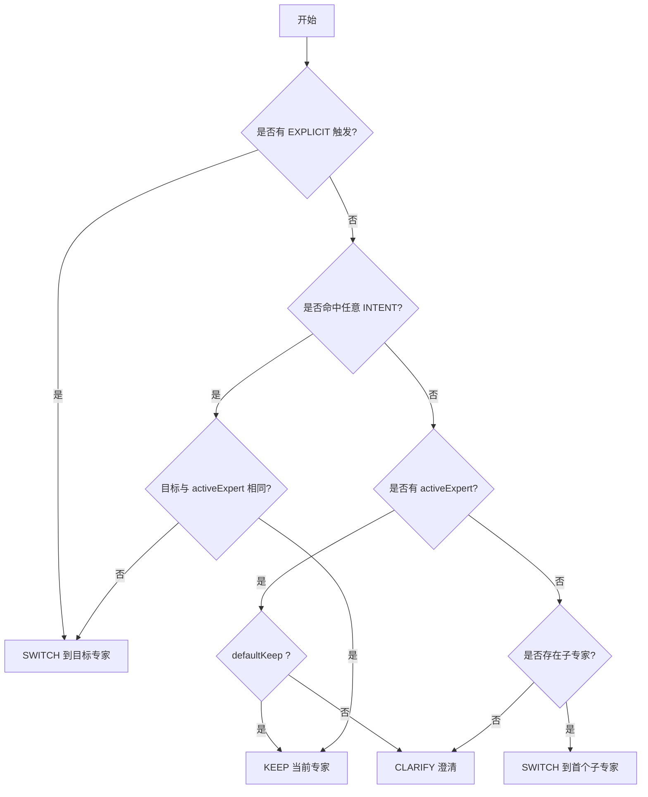
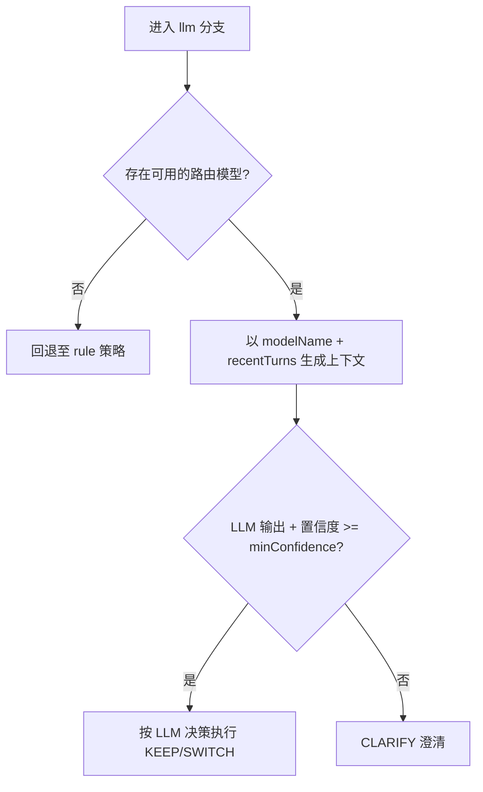
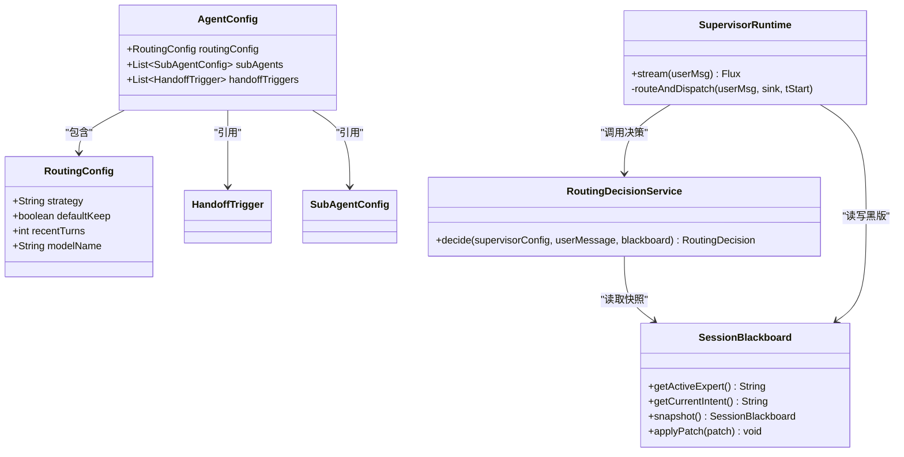
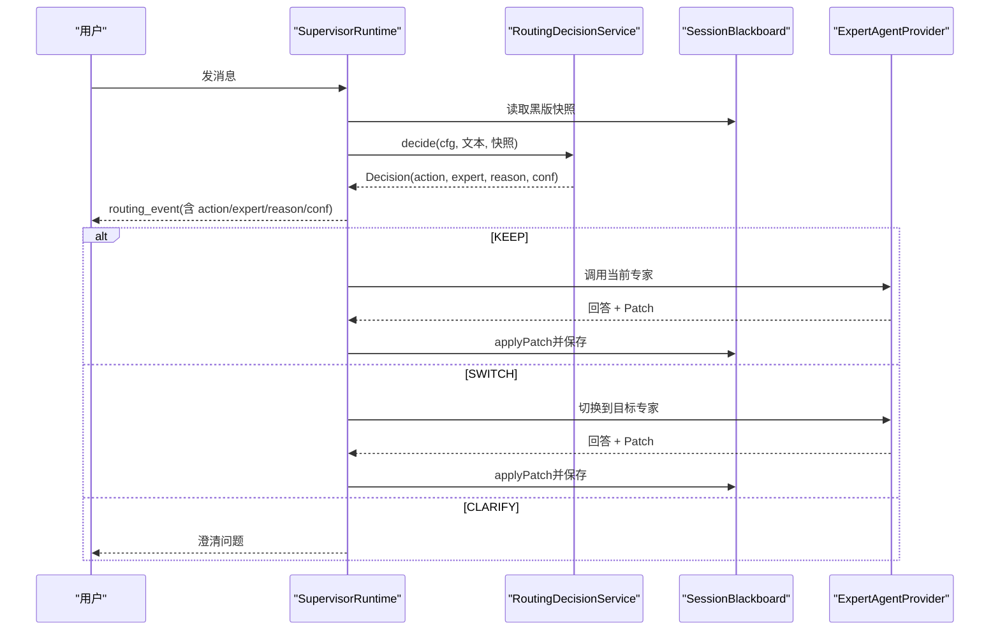
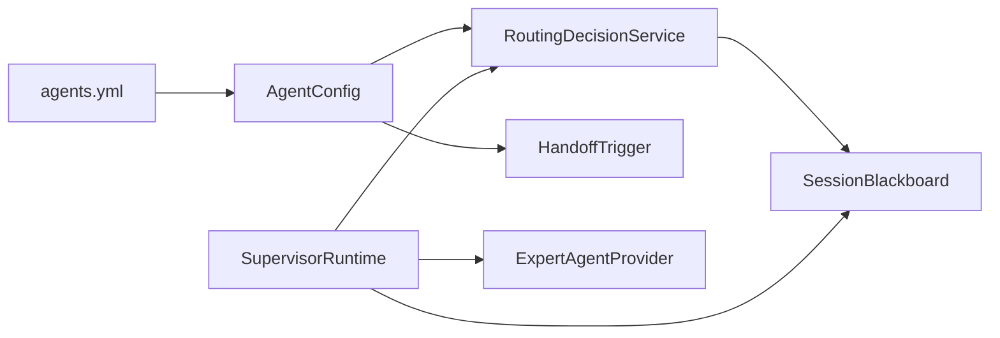

# 路由策略配置

<cite>
**本文引用的文件**
- [AgentConfig.java](file://src/main/java/com/skloda/agentscope/agent/AgentConfig.java)
- [RoutingDecisionService.java](file://src/main/java/com/skloda/agentscope/blackboard/RoutingDecisionService.java)
- [RoutingAction.java](file://src/main/java/com/skloda/agentscope/blackboard/RoutingAction.java)
- [SessionBlackboard.java](file://src/main/java/com/skloda/agentscope/blackboard/SessionBlackboard.java)
- [SupervisorRuntime.java](file://src/main/java/com/skloda/agentscope/blackboard/SupervisorRuntime.java)
- [HandoffTrigger.java](file://src/main/java/com/skloda/agentscope/agent/HandoffTrigger.java)
- [SupervisorRuntimeFactory.java](file://src/main/java/com/skloda/agentscope/blackboard/SupervisorRuntimeFactory.java)
- [agents.yml](file://src/main/resources/config/agents.yml)
- [harness-agents.yml](file://src/main/resources/config/harness-agents.yml)
- [application.yml](file://src/main/resources/application.yml)
- [RoutingDecisionServiceTest.java](file://src/test/java/com/skloda/agentscope/blackboard/RoutingDecisionServiceTest.java)
</cite>

## 目录
1. [简介](#简介)
2. [项目结构](#项目结构)
3. [核心组件](#核心组件)
4. [架构总览](#架构总览)
5. [详细组件分析](#详细组件分析)
6. [依赖关系分析](#依赖关系分析)
7. [性能考虑](#性能考虑)
8. [故障排查指南](#故障排查指南)
9. [结论](#结论)
10. [附录：配置示例与调优建议](#附录配置示例与调优建议)

## 简介
本文件系统性说明多智能体“路由策略”的工作原理与配置方法，聚焦以下主题：
- routingConfig.strategy 的两种策略：rule（规则引擎）与 llm（AI 决策）
- defaultKeep 参数在不明确意图时的“保留当前专家”决策逻辑
- recentTurns 参数的作用：向 LLM 路由器提供上下文轮数，影响上下文感知与性能
- 高级特性：基于 Blackboard 的智能路由、上下文感知的转发、负载均衡策略思想与实践建议
- 不同业务场景的可操作配置示例与调优建议

目标是帮助开发者在不深入代码细节的情况下，也能正确理解、装配与优化路由行为。

## 项目结构
路由相关的核心类位于 blackboard 与 agent 两个包中，协同构建 Supervisor（监督者/路由器）能力：
- AgentConfig.RoutingConfig：定义路由策略开关与参数
- RoutingDecisionService：实现策略解析与决策计算（含 rule 回退为 llm）
- SessionBlackboard：会话级共享黑版，存储 activeExpert/currentIntent/事实等
- SupervisorRuntime：每轮路由+专家调度+黑版合并的流式运行时
- HandoffTrigger：规则匹配的条件元数据（INTENT/EXPLICIT 触发器）

图示来源
- [AgentConfig.java:155-186](file://src/main/java/com/skloda/agentscope/agent/AgentConfig.java#L155-L186)
- [RoutingDecisionService.java:35-63](file://src/main/java/com/skloda/agentscope/blackboard/RoutingDecisionService.java#L35-L63)
- [SessionBlackboard.java:40-120](file://src/main/java/com/skloda/agentscope/blackboard/SessionBlackboard.java#L40-L120)
- [RoutingAction.java:1-23](file://src/main/java/com/skloda/agentscope/blackboard/RoutingAction.java#L1-L23)
- [SupervisorRuntime.java:29-59](file://src/main/java/com/skloda/agentscope/blackboard/SupervisorRuntime.java#L29-L59)

章节来源
- [AgentConfig.java:155-186](file://src/main/java/com/skloda/agentscope/agent/AgentConfig.java#L155-L186)
- [SupervisorRuntime.java:29-59](file://src/main/java/com/skloda/agentscope/blackboard/SupervisorRuntime.java#L29-L59)
- [agents.yml:1060-1110](file://src/main/resources/config/agents.yml#L1060-L1110)

## 核心组件
- AgentConfig.RoutingConfig：声明 strategy、defaultKeep、modelName、recentTurns
- RoutingDecisionService：依据 strategy 执行 decision；默认 rule；llm 路径在本实现中通过回退至 rule 避免强依赖模型
- SessionBlackboard：跨专家会话状态载体，承载 activeExpert、currentIntent、customerFacts/capturedSlots/businessState/findings/unresolvedQuestions
- SupervisorRuntime：单轮调度入口，串行化 per-(userId,sessionId) 的路由/专家调用/黑版写入
- HandoffTrigger：规则触发的条件清单（类型、关键词、目标专家）
- RoutingAction：决策动作枚举（KEEP/SWITCH/CLARIFY），预留 MULTI 扩展点

章节来源
- [AgentConfig.java:136-186](file://src/main/java/com/skloda/agentscope/agent/AgentConfig.java#L136-L186)
- [RoutingDecisionService.java:35-199](file://src/main/java/com/skloda/agentscope/blackboard/RoutingDecisionService.java#L35-L199)
- [SessionBlackboard.java:40-120](file://src/main/java/com/skloda/agentscope/blackboard/SessionBlackboard.java#L40-L120)
- [SupervisorRuntime.java:29-59](file://src/main/java/com/skloda/agentscope/blackboard/SupervisorRuntime.java#L29-L59)
- [HandoffTrigger.java:1-26](file://src/main/java/com/skloda/agentscope/agent/HandoffTrigger.java#L1-L26)
- [RoutingAction.java:1-23](file://src/main/java/com/skloda/agentscope/blackboard/RoutingAction.java#L1-L23)

## 架构总览
SupervisorRuntime 在每条用户消息到来时：
1. 获取/初始化会话黑版
2. 读取路由配置（strategy/defaultKeep/recentTurns/modelName）
3. 调用 RoutingDecisionService.decide 进行路由决策（rule/llm）
4. 发出 routing_event（action/previousExpert/selectedExpert/reason/confidence 等）
5. 若 KEEP/SWITCH：构造 ExpertRequest 并调度专家，再将黑版变更序列化回写
6. 若 CLARIFY：直接返回澄清问句

图示来源
- [SupervisorRuntime.java:135-215](file://src/main/java/com/skloda/agentscope/blackboard/SupervisorRuntime.java#L135-L215)
- [RoutingDecisionService.java:48-63](file://src/main/java/com/skloda/agentscope/blackboard/RoutingDecisionService.java#L48-L63)
- [SessionBlackboard.java:121-172](file://src/main/java/com/skloda/agentscope/blackboard/SessionBlackboard.java#L121-L172)

章节来源
- [SupervisorRuntime.java:135-215](file://src/main/java/com/skloda/agentscope/blackboard/SupervisorRuntime.java#L135-L215)
- [RoutingDecisionService.java:48-63](file://src/main/java/com/skloda/agentscope/blackboard/RoutingDecisionService.java#L48-L63)

## 详细组件分析

### 策略一：rule（规则引擎）
- 机制：对当前用户输入进行关键词匹配，命中 HandoffTrigger 即触发路由
- 优先级：
  - EXPLICIT（显式指令，如“转某专家”）优先于 INTENT
  - 多个 INTENT 命中且目标不同于 activeExpert → SWITCH
  - 命中但目标等于 activeExpert → KEEP
  - 无命中时：若有 activeExpert 且 defaultKeep=true → KEEP；否则 CLARIFY
  - 首回合无 activeExpert 且未命中：选择第一个子专家以避免冷启动阻塞
- 适用场景：确定性强、规则清晰、低延迟的业务分流（如客服分流到销售/投诉/支持）

图示来源
- [RoutingDecisionService.java:67-145](file://src/main/java/com/skloda/agentscope/blackboard/RoutingDecisionService.java#L67-L145)
- [HandoffTrigger.java:14-26](file://src/main/java/com/skloda/agentscope/agent/HandoffTrigger.java#L14-L26)

章节来源
- [RoutingDecisionService.java:67-145](file://src/main/java/com/skloda/agentscope/blackboard/RoutingDecisionService.java#L67-L145)
- [HandoffTrigger.java:14-26](file://src/main/java/com/skloda/agentscope/agent/HandoffTrigger.java#L14-L26)
- [RoutingDecisionServiceTest.java:40-153](file://src/test/java/com/skloda/agentscope/blackboard/RoutingDecisionServiceTest.java#L40-L153)

### 策略二：llm（AI 决策）
- 机制：由 Supervisor 侧 LLM 进行结构化推理输出（可扩展为 JSON 或契约格式），结合最小置信度阈值决定是否路由或澄清
- 现状：当前 RoutingDecisionService 在检测到需要模型调用时，采用“回退到 rule 策略”的实现，以确保测试与服务不强制依赖模型可用
- 关键参数：
  - modelName：可选覆盖 Supervisors 的默认模型名，用于路由专用模型
  - recentTurns：控制传递给 LLM 的最近对话轮数，提高上下文相关性
  - minConfidence：仅在 LLM 路径中使用，低于阈值则转为 CLARIFY

图示来源
- [AgentConfig.java:177-185](file://src/main/java/com/skloda/agentscope/agent/AgentConfig.java#L177-L185)
- [RoutingDecisionService.java:147-160](file://src/main/java/com/skloda/agentscope/blackboard/RoutingDecisionService.java#L147-L160)
- [SupervisorRuntime.java:29-59](file://src/main/java/com/skloda/agentscope/blackboard/SupervisorRuntime.java#L29-L59)

章节来源
- [AgentConfig.java:177-185](file://src/main/java/com/skloda/agentscope/agent/AgentConfig.java#L177-L185)
- [RoutingDecisionService.java:147-160](file://src/main/java/com/skloda/agentscope/blackboard/RoutingDecisionService.java#L147-L160)

### defaultKeep：不确定时保留当前专家的决策逻辑
- 含义：当无法命中任何触发器且已有 activeExpert 时，保持当前专家继续处理，直到出现新线索才切换
- 效果：提升多轮对话的连贯性，避免对用户频繁澄清；false 时会走 CLARIFY，强制确认意图
- 典型用法：
  - 客服场景：用户在咨询后可能继续追问细节，defaultKeep=true 保证上下文延续
  - 严格流程：设置 false 可要求每次转折都明确确认

章节来源
- [AgentConfig.java:170-176](file://src/main/java/com/skloda/agentscope/agent/AgentConfig.java#L170-L176)
- [RoutingDecisionService.java:116-124](file://src/main/java/com/skloda/agentscope/blackboard/RoutingDecisionService.java#L116-L124)
- [RoutingDecisionServiceTest.java:71-85](file://src/test/java/com/skloda/agentscope/blackboard/RoutingDecisionServiceTest.java#L71-L85)

### recentTurns：上下文轮数对路由的影响与性能优化
- 含义：决定传入 LLM 路由器的最近对话轮数；轮数越多，上下文信息越全，但也更高开销
- 影响：
  - small 值：更快的决策、更低成本，但可能忽略重要前缀上下文
  - 大值：更鲁棒的意图判断、适合复杂任务链，但有额外调用成本
- 推荐：从 1-3 起步评估指标（延迟/命中率/误判率），逐步调优

章节来源
- [AgentConfig.java:183-185](file://src/main/java/com/skloda/agentscope/agent/AgentConfig.java#L183-L185)
- [SupervisorRuntime.java:29-59](file://src/main/java/com/skloda/agentscope/blackboard/SupervisorRuntime.java#L29-L59)

### 高级特性：Blackboard 智能路由、上下文感知转发、负载均衡
- 共享黑版（Shared Blackboard）：集中维护 session 维度业务数据（activeExpert、currentIntent、客户事实、待办字段、发现等），作为多专家协作的统一记忆层
- 上下文感知转发：Supervisor 把黑版快照摘要与 reasoning 传入专家，使专家具备全局视角，减少重复提问
- 负载均衡策略（设计建议）：
  - 基于命中频次的加权随机选择同等候选专家
  - 按历史耗时/错误率/容量动态调整权重
  - 结合 recentTurns/置信度阈值做弹性降级（高负载时偏向 rule）

章节来源
- [SessionBlackboard.java:40-120](file://src/main/java/com/skloda/agentscope/blackboard/SessionBlackboard.java#L40-L120)
- [SupervisorRuntime.java:29-59](file://src/main/java/com/skloda/agentscope/blackboard/SupervisorRuntime.java#L29-L59)

### 类图：路由相关类关系

图示来源
- [AgentConfig.java:136-186](file://src/main/java/com/skloda/agentscope/agent/AgentConfig.java#L136-L186)
- [RoutingDecisionService.java:48-63](file://src/main/java/com/skloda/agentscope/blackboard/RoutingDecisionService.java#L48-L63)
- [SessionBlackboard.java:40-120](file://src/main/java/com/skloda/agentscope/blackboard/SessionBlackboard.java#L40-L120)
- [SupervisorRuntime.java:135-215](file://src/main/java/com/skloda/agentscope/blackboard/SupervisorRuntime.java#L135-L215)

### 时序图：单轮路由+专家调度

图示来源
- [SupervisorRuntime.java:158-215](file://src/main/java/com/skloda/agentscope/blackboard/SupervisorRuntime.java#L158-L215)
- [RoutingDecisionService.java:67-145](file://src/main/java/com/skloda/agentscope/blackboard/RoutingDecisionService.java#L67-L145)
- [SessionBlackboard.java:132-159](file://src/main/java/com/skloda/agentscope/blackboard/SessionBlackboard.java#L132-L159)

## 依赖关系分析
- AgentConfig 提供静态路由参数（strategy、defaultKeep、recentTurns、modelName）
- RoutingDecisionService 依赖 HandoffTrigger 与 AgentConfig（及可选 SubAgentConfig）完成规则匹配
- SupervisorRuntime 作为运行时协调者，串联黑版、路由决策、专家派发与事件回放
- 配置源 agents.yml/harness-agents.yml 驱动 AgentConfigService 构建 AgentConfig

图示来源
- [agents.yml:1060-1110](file://src/main/resources/config/agents.yml#L1060-L1110)
- [AgentConfig.java:136-186](file://src/main/java/com/skloda/agentscope/agent/AgentConfig.java#L136-L186)
- [RoutingDecisionService.java:67-145](file://src/main/java/com/skloda/agentscope/blackboard/RoutingDecisionService.java#L67-L145)
- [SupervisorRuntime.java:158-215](file://src/main/java/com/skloda/agentscope/blackboard/SupervisorRuntime.java#L158-L215)

章节来源
- [agents.yml:1060-1110](file://src/main/resources/config/agents.yml#L1060-L1110)
- [agent/AgentConfig.java:136-186](file://src/main/java/com/skloda/agentscope/agent/AgentConfig.java#L136-L186)

## 性能考虑
- rule 策略：O(n*k) 复杂度（n=触发器数量，k=关键词长度），极快，适合高吞吐场景
- llm 策略：受模型调用时延与 token 输入大小影响；recentTurns 增大将增加上下文长度与延迟
- 黑版读写：per-session 串行锁避免并发脏写；合理设置缓存与合并粒度（expert 仅提交必要补丁）
- 首回合行为：首次路由到首个子专家，降低用户等待；可通过 defaultKeep=false 强制澄清（谨慎使用）

[本节为通用性能讨论，无需特定文件]

## 故障排查指南
- 现象：总是返回 CLARIFY
  - 检查 HandoffTrigger 是否配置完整（type/keywords/target）
  - 检查 defaultKeep 是否为 false
  - 确认是否有 activeExpert（上一轮专家未落盘？）
  - 参考测试断言验证策略路径预期行为
- 现象：无法切换到预期专家
  - 核查 EXPLICIT/INTENT 的关键词匹配语义（大小写忽略）
  - 若多处 INTENT 命中，确保只有一个目标不同于 activeExpert 才会 SWITCH
- 现象：LLM 路由无效
  - 当前 RoutingDecisionService.llm 分支会回退到 rule；如需真实 LLM 路由，需在 SupervisorRuntime 侧实现 model 调用并注入置信度
  - 确认 recentTurns/modelName/minConfidence 配置生效

章节来源
- [RoutingDecisionServiceTest.java:54-101](file://src/test/java/com/skloda/agentscope/blackboard/RoutingDecisionServiceTest.java#L54-L101)
- [RoutingDecisionService.java:147-160](file://src/main/java/com/skloda/agentscope/blackboard/RoutingDecisionService.java#L147-L160)

## 结论
- rule 策略确定性高、延迟极低，适合作为默认方案；llm 策略提供更灵活的意图识别，需评估模型与上下文成本
- defaultKeep 保障连续对话稳定性；recentTurns 调节上下文深度与性能权衡
- Shared Blackboard 是多专家协作的核心基石，配合 SupervisorRuntime 实现跨轮次一致性与可解释性
- 建议在不同业务场景中组合使用上述能力，并结合监控指标持续优化策略与参数

[本节总结，无需特定文件]

## 附录：配置示例与调优建议
- 基础路由（客服分流）
  - sharedBlackboard.enabled=true；strategy=rule；defaultKeep=true；recentTurns=3
  - 配置位置参见 agents.yml 路由段
- 严格澄清流程
  - defaultKeep=false；结合 HandoffTrigger 细化关键词，防止误切换
- LLM 增强路由
  - 先以 rule 为基线，再尝试 strategy=llm；根据近期成功率、时延、误判率调整 recentTurns 与 minConfidence
- 负载均衡策略（实现建议）
  - 在同一候选专家集合上，加入历史负载、失败率的打分函数，做加权随机选择
  - 在高负载时自动退化到 rule，降低模型调用频率

章节来源
- [agents.yml:1099-1102](file://src/main/resources/config/agents.yml#L1099-L1102)
- [AgentConfig.java:136-186](file://src/main/java/com/skloda/agentscope/agent/AgentConfig.java#L136-L186)