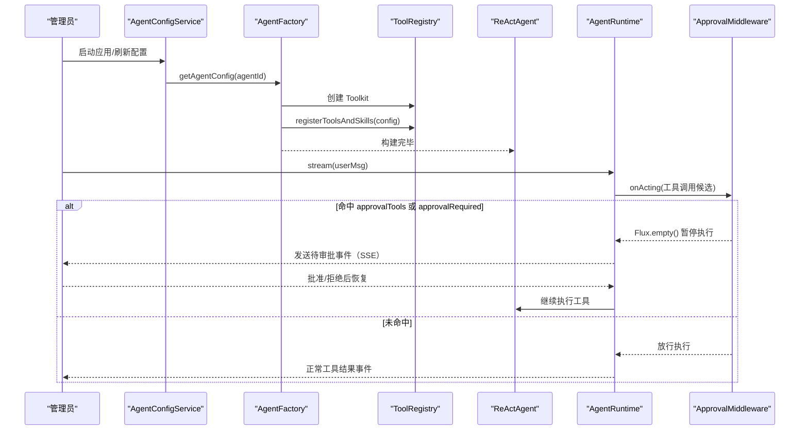
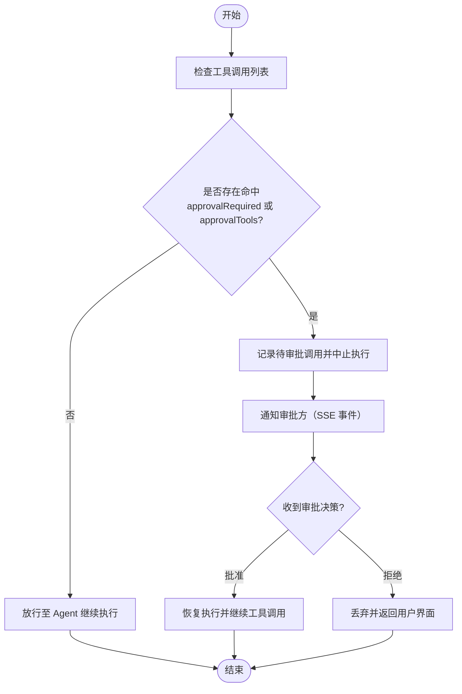
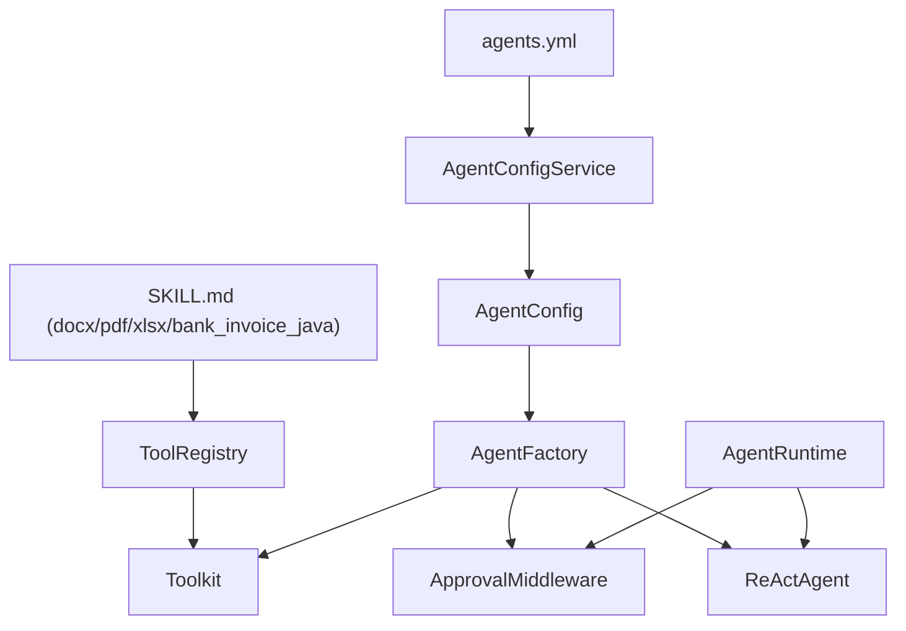

# Agent 工具配置

<cite>
**本文引用的文件**
- [agents.yml](file://src/main/resources/config/agents.yml)
- [AgentConfig.java](file://src/main/java/com/skloda/agentscope/agent/AgentConfig.java)
- [AgentFactory.java](file://src/main/java/com/skloda/agentscope/agent/AgentFactory.java)
- [ToolRegistry.java](file://src/main/java/com/skloda/agentscope/tool/ToolRegistry.java)
- [ApprovalMiddleware.java](file://src/main/java/com/skloda/agentscope/middleware/ApprovalMiddleware.java)
- [SimpleTools.java](file://src/main/java/com/skloda/agentscope/tool/SimpleTools.java)
- [BankInvoiceTool.java](file://src/main/java/com/skloda/agentscope/tool/BankInvoiceTool.java)
- [AgentConfigService.java](file://src/main/java/com/skloda/agentscope/agent/AgentConfigService.java)
- [AgentRuntime.java](file://src/main/java/com/skloda/agentscope/runtime/AgentRuntime.java)
- [approval-service.java](file://src/main/java/com/skloda/agentscope/service/ApprovalService.java)
- [skills-docx.md](file://src/main/resources/skills/docx/SKILL.md)
- [skills-pdf.md](file://src/main/resources/skills/pdf/SKILL.md)
- [skills-xlsx.md](file://src/main/resources/skills/xlsx/SKILL.md)
- [skills-bank_invoice_java.md](file://src/main/resources/skills/bank_invoice_java/SKILL.md)
</cite>

## 目录
1. [简介](#简介)
2. [项目结构与关键文件](#项目结构与关键文件)
3. [核心组件与角色](#核心组件与角色)
4. [架构总览](#架构总览)
5. [三类工具配置详解：skills / userTools / systemTools](#三类工具配置详解skillsserertoolsystemtools)
6. [不同 Agent 类型的工具策略与示例](#不同-agent-类型的工具策略与示例)
7. [工具执行上下文：调用、参数与结果处理](#工具执行上下文调用参数与结果处理)
8. [权限控制：approvalTools 的机制与效果](#权限控制approvaltools的机制与效果)
9. [依赖关系与装配流程](#依赖关系与装配流程)
10. [性能与健壮性建议](#性能与健壮性建议)
11. [常见问题排查指南](#常见问题排查指南)
12. [结论](#结论)

## 简介
本文件面向 agents.yml 中的“Agent 工具配置”，系统性解释 skills（技能列表）、userTools（用户工具数组）与 systemTools（系统工具）三者的区别与作用，并结合代码库说明工具如何在 Agent 运行时被注册、发现和调用。文档同时覆盖不同 Agent 类型（基础对话、工具调用、任务型、银行发票审批）的工具组合策略，以及 approvalTools 的审批拦截机制。最后给出排错清单和最佳实践建议。

## 项目结构与关键文件
- 配置文件
  - agents.yml：定义各 Agent 的能力边界，包括 skills、userTools、systemTools、approvalTools、RAG、流式开关等。
- 装载与装配
  - AgentConfigService：加载 YAML，构建 AgentConfig，并维护技能描述信息。
  - AgentFactory：基于 AgentConfig 组装 ReActAgent、Toolkit、中间件与模型能力。
  - ToolRegistry：集中扫描与注册各类工具（含框架内置系统工具、业务工具、由 SKILL.md 动态绑定的技能）。
- 运行期
  - AgentRuntime：封装单次会话流式执行，结合 ApprovalMiddleware 实现人机审批暂停与恢复。
  - ApprovalMiddleware：在 tool-calling 阶段拦截命中名单中的敏感工具调用，挂起执行等待审批。
- 工具实现
  - SimpleTools：演示型用户工具（时间、计算、天气）。
  - BankInvoiceTool：银行业务发票生成工具（Excel + Word），用于 bank-invoice Agent。
- 技能元数据
  - SKILL.md（docx/pdf/xlsx/bank_invoice_java）：声明技能的名称、描述、关联工具，供 ToolRegistry 自动解析为能力映射。

章节来源
- [agents.yml:1-199](file://src/main/resources/config/agents.yml#L1-L199)
- [AgentConfigService.java:23-88](file://src/main/java/com/skloda/agentscope/agent/AgentConfigService.java#L23-L88)
- [ToolRegistry.java:23-200](file://src/main/java/com/skloda/agentscope/tool/ToolRegistry.java#L23-L200)
- [AgentFactory.java:131-200](file://src/main/java/com/skloda/agentscope/agent/AgentFactory.java#L131-L200)
- [AgentRuntime.java:26-100](file://src/main/java/com/skloda/agentscope/runtime/AgentRuntime.java#L26-L100)
- [ApprovalMiddleware.java:22-124](file://src/main/java/com/skloda/agentscope/middleware/ApprovalMiddleware.java#L22-L124)

## 核心组件与角色
- AgentConfig（配置实体）
  - 包含 tools/skills/middlewares/approval 等可配置字段；其中 skills、userTools、systemTools、approvalTools 决定该 Agent 能使用的工具集合与权限。
- ToolRegistry（工具注册中心）
  - Phase A：类路径扫描 com.skloda.agentscope.tool 包下带 @Tool 注解的 POJO，暴露方法名即工具名。
  - Phase B：按框架命名空间自动发现或回退到反射实例化系统工具（如 ReadFileTool/WriteFileTool/ShellCommandTool）。
  - Phase C：从 classpath:skills/*/SKILL.md 读取 frontmatter（name/description/tools），将技能名映射到对应工具组。
- AgentFactory（Agent 装配器）
  - 读取 AgentConfig → 创建 Model → 创建 Toolkit → 注册工具与技能 → 按需启用 RAG/中长期记忆/中间件 → 返回可运行的 ReActAgent。
- AgentRuntime（会话执行器）
  - 使用 ReActAgent.streamEvents() 返回统一事件流；当存在 ApprovalMiddleware 时可在工具调用阶段触发审批。
- ApprovalMiddleware（审批中间件）
  - 根据 agent-level approvalRequired 或 tool-level approvalTools 判断是否拦截；若命中则保存待审工具调用并中断执行，直至外部恢复。

章节来源
- [AgentConfig.java:15-99](file://src/main/java/com/skloda/agentscope/agent/AgentConfig.java#L15-L99)
- [ToolRegistry.java:71-200](file://src/main/java/com/skloda/agentscope/tool/ToolRegistry.java#L71-L200)
- [AgentFactory.java:131-200](file://src/main/java/com/skloda/agentscope/agent/AgentFactory.java#L131-L200)
- [AgentRuntime.java:40-100](file://src/main/java/com/skloda/agentscope/runtime/AgentRuntime.java#L40-L100)
- [ApprovalMiddleware.java:44-124](file://src/main/java/com/skloda/agentscope/middleware/ApprovalMiddleware.java#L44-L124)

## 架构总览
下图展示从配置到执行的完整链路，强调工具装配顺序与审批拦截点。

图表来源
- [AgentFactory.java:131-200](file://src/main/java/com/skloda/agentscope/agent/AgentFactory.java#L131-L200)
- [ToolRegistry.java:71-200](file://src/main/java/com/skloda/agentscope/tool/ToolRegistry.java#L71-L200)
- [AgentRuntime.java:68-100](file://src/main/java/com/skloda/agentscope/runtime/AgentRuntime.java#L68-L100)
- [ApprovalMiddleware.java:59-77](file://src/main/java/com/skloda/agentscope/middleware/ApprovalMiddleware.java#L59-L77)

## 三类工具配置详解：skills / userTools / systemTools
- skills（技能列表）
  - 作用：为 LLM 提供一组“可被发现”的能力标签，每个技能通常关联一个或多个工具方法。通过 SKILL.md 的 frontmatter（name/description/tools）声明。
  - 解析时机：ToolRegistry 启动时扫描 classpath:skills/*/SKILL.md，将技能名映射到其工具组。
  - 典型用法：Task Agent 绑定 docx/pdf/xlsx 技能，从而获得“解析上传文档”的可发现能力；bank-invoice Agent 额外绑定 bank_invoice_java 技能以激活模板生成。
  - 影响范围：仅当 Agent 的 config.skills 列表包含该技能名，LLM 才知道可使用这些能力。

- userTools（用户工具数组）
  - 作用：明确为该 Agent 开放的具体工具方法名称集合（例如 get_current_time、calculate_sum、parse_docx、generate_bank_invoice）。
  - 匹配规则：必须存在于 ToolRegistry 已注册的工具表（来自类扫描或框架系统工具）。
  - 用途：限制 Agent 可调用的工具白名单，避免暴露过多系统能力，配合权限控制更精细。

- systemTools（系统工具数组）
  - 作用：指向框架或底层提供的“环境操作类”能力，如读取文本、写入文本、执行命令等。
  - 注册来源：ToolRegistry 会自动从框架工具包中扫描或回退反射注册；也可由上层业务扩展。
  - 用途：给 Agent 提供轻量文件与脚本执行能力，常用于日志/调试/文件检查等场景。

- 差异总结
  - skills 是“能力模块”的声明，适合用自然语言引导 LLM；
  - userTools/systemTools 是具体的“函数名”白名单，直接决定可执行动作。
  - 推荐搭配：task/专业 Agent → skills + 限定 userTools；tool-calling 演示 → userTools + 少量 systemTools；安全关键 Agent → approvalTools 叠加。

章节来源
- [ToolRegistry.java:155-200](file://src/main/java/com/skloda/agentscope/tool/ToolRegistry.java#L155-L200)
- [skills-docx.md:1-5](file://src/main/resources/skills/docx/SKILL.md#L1-L5)
- [skills-pdf.md:1-5](file://src/main/resources/skills/pdf/SKILL.md#L1-L5)
- [skills-xlsx.md:1-5](file://src/main/resources/skills/xlsx/SKILL.md#L1-L5)
- [agents.yml:12-14](file://src/main/resources/config/agents.yml#L12-L14)
- [agents.yml:46-54](file://src/main/resources/config/agents.yml#L46-L54)
- [agents.yml:74-84](file://src/main/resources/config/agents.yml#L74-L84)

## 不同 Agent 类型的工具策略与示例
- Basic Chat Agent（chat-basic）
  - 工具策略：无 skills/userTools/systemTools，适合纯对话。
  - 效果：不暴露任何工具，只进行自然对话。
  - 参考：agents.yml 中 chat-basic 配置。

- Tool Calling Agent（tool-test-simple）
  - 工具策略：配置 userTools：get_current_time、calculate_sum、get_weather；systemTools：view_text_file、write_text_file、execute_shell_command。
  - 效果：具备时间与计算能力、可读/写文本和执行命令的环境能力，演示工具调用链路。
  - 参考：agents.yml 中 tool-test-simple 工具与提示词。

- Task Agent（task-document-analysis）
  - 工具策略：skills 包含 docx/pdf/xlsx；userTools：parse_docx、parse_pdf、parse_xlsx；systemTools：view_text_file。
  - 效果：能识别文档分析任务、解析上传文件并结构化输出，支持查看文件内容。
  - 参考：agents.yml 中 task-document-analysis 的配置及 SKILL.md 声明。

- Bank Invoice Agent（bank-invoice）
  - 工具策略：skills 包含 xlsx/docx 与 bank_invoice_java；userTools 包含 parse_docx、edit_docx、generate_bank_invoice；approvalTools 包含 generate_bank_invoice。
  - 效果：收集必要字段后可生成 Excel+Word 发票文件，且因 generate_bank_invoice 在 approvalTools 中，调用前需人工审批通过后才执行。
  - 参考：agents.yml 中 bank-invoice 的配置、bank_invoice_java SKILL.md 与审批中间件。

章节来源
- [agents.yml:2-29](file://src/main/resources/config/agents.yml#L2-L29)
- [agents.yml:30-60](file://src/main/resources/config/agents.yml#L30-L60)
- [agents.yml:62-90](file://src/main/resources/config/agents.yml#L62-L90)
- [agents.yml:92-169](file://src/main/resources/config/agents.yml#L92-L169)
- [skills-bank_invoice_java.md:1-69](file://src/main/resources/skills/bank_invoice_java/SKILL.md#L1-L69)

## 工具执行上下文：调用、参数与结果处理
- 触发条件
  - LLM 根据 prompt、skills 能力描述与可用 userTools/systemTools 白名单决定是否需要调用某个工具。
  - 当检测到需要执行工具时，会产出 ToolUseBlock（工具名 + 输入参数字典）。
- 工具发现与装配
  - ToolRegistry 启动阶段完成所有工具扫描与技能映射；AgentFactory 在构建 Agent 时将 Toolkit 注入 ReActAgent。
- 调用与参数传递
  - 运行时以工具名为 key 找到对应工具方法，按 @ToolParam 的 name 绑定 JSON 参数；异常参数会抛出错误或返回错误字符串（参见简单工具的容错）。
- 结果处理
  - 工具返回后作为 ToolResultBlock 嵌入会话消息流；前端（SSE）会收到工具结果事件以便展示。
- 审批拦截（HITL）
  - ApprovalMiddleware 在 onActing 阶段拦截工具调用。若工具名命中 approvalTools 或代理开启 approvalRequired，则停止执行并挂起，直到服务层完成审批后再恢复执行。

章节来源
- [ToolRegistry.java:71-124](file://src/main/java/com/skloda/agentscope/tool/ToolRegistry.java#L71-L124)
- [AgentFactory.java:151-200](file://src/main/java/com/skloda/agentscope/agent/AgentFactory.java#L151-L200)
- [SimpleTools.java:12-44](file://src/main/java/com/skloda/agentscope/tool/SimpleTools.java#L12-L44)
- [AgentRuntime.java:68-100](file://src/main/java/com/skloda/agentscope/runtime/AgentRuntime.java#L68-L100)
- [ApprovalMiddleware.java:59-77](file://src/main/java/com/skloda/agentscope/middleware/ApprovalMiddleware.java#L59-L77)
- [approval-service.java:22-75](file://src/main/java/com/skloda/agentscope/service/ApprovalService.java#L22-L75)

## 权限控制：approvalTools 的机制与效果
- 配置位置
  - AgentConfig.approvalRequired：对当前 Agent 全局要求审批；
  - AgentConfig.approvalTools：针对特定工具名进行审批拦截。
- 运行机制
  - 每次执行工具前，ApprovalMiddleware 检查 toolCalls 列表中是否含有命中条件（approvalTools 或 agent 级别 approvalRequired）；
  - 若命中，则设置 pendingToolUseBlocks 并返回空流中止后续工具执行；
  - 外部服务通过 ApprovalService 持有挂起的会话与待审批调用，并在审批通过后恢复执行。
- 典型用例
  - bank-invoice Agent 将 generate_bank_invoice 加入 approvalTools，确保敏感文档生成需经人工确认后才真正落地落盘，降低误发风险。

图表来源
- [ApprovalMiddleware.java:59-124](file://src/main/java/com/skloda/agentscope/middleware/ApprovalMiddleware.java#L59-L124)
- [agents.yml:92-169](file://src/main/resources/config/agents.yml#L92-L169)
- [approval-service.java:22-75](file://src/main/java/com/skloda/agentscope/service/ApprovalService.java#L22-L75)

## 依赖关系与装配流程
下图展示 Agent 配置如何驱动工具注册与执行。

图表来源
- [AgentConfigService.java:23-88](file://src/main/java/com/skloda/agentscope/agent/AgentConfigService.java#L23-L88)
- [ToolRegistry.java:71-200](file://src/main/java/com/skloda/agentscope/tool/ToolRegistry.java#L71-L200)
- [AgentFactory.java:131-200](file://src/main/java/com/skloda/agentscope/agent/AgentFactory.java#L131-L200)

## 性能与健壮性建议
- 工具数量控制
  - userTools/systemTools 应尽量精简，减少 LLM 选择成本，提高响应速度。
- 技能描述质量
  - SKILL.md 的描述越准确，LLM 越容易正确选择能力，降低错误调用。
- 大工具返回值
  - 尽量避免返回超大文本，必要时分页或提供摘要链接。
- 审批节流
  - 审批队列注意清理过期请求（ApprovalService 默认 5 分钟 TTL），避免内存泄漏。

## 常见问题排查指南
- 工具名称不匹配
  - 现象：配置了 userTools.systemTools.skills 但无法调用。
  - 原因：
    - 工具未被 ToolRegistry 扫描注册（未在 com.skloda.agentscope.tool 包、或未携带 @Tool(name=...)）。
    - SKILL.md 中 tools 字段与实际注册工具不一致。
  - 排查步骤：
    - 检查工具类方法上是否正确标注 @Tool(name="xxx")；
    - 确认 ToolRegistry 初始化日志，确认工具/技能是否登记成功；
    - 核对 SKILL.md 的 frontmatter tools 列表。
  - 参考
    - [ToolRegistry.java:71-124](file://src/main/java/com/skloda/agentscope/tool/ToolRegistry.java#L71-L124)
    - [ToolRegistry.java:155-200](file://src/main/java/com/skloda/agentscope/tool/ToolRegistry.java#L155-L200)
    - [skills-docx.md:1-5](file://src/main/resources/skills/docx/SKILL.md#L1-L5)

- 权限不足（未开启审批导致阻塞或允许）
  - 现象：敏感工具未触发审批或意外触发审批。
  - 排查：
    - 检查 AgentConfig 的 approvalRequired 与 approvalTools；
    - 确认是否在 AgentFactory 中注入了 ApprovalMiddleware；
    - 观察 ApprovalMiddleware.onActing 的拦截逻辑。
  - 参考
    - [AgentConfig.java:48-51](file://src/main/java/com/skloda/agentscope/agent/AgentConfig.java#L48-L51)
    - [AgentFactory.java:186-200](file://src/main/java/com/skloda/agentscope/agent/AgentFactory.java#L186-L200)
    - [ApprovalMiddleware.java:59-77](file://src/main/java/com/skloda/agentscope/middleware/ApprovalMiddleware.java#L59-L77)

- 配置冲突（重复 agentId）
  - 现象：部分 Agent 未加载或覆盖异常。
  - 原因：多个 YAML 中出现相同 agentId，首个生效，其余跳过。
  - 排查：检查 agents.yml 与 harness-agents.yml 是否有重复 ID。
  - 参考
    - [AgentConfigService.java:59-72](file://src/main/java/com/skloda/agentscope/agent/AgentConfigService.java#L59-L72)

- 参数传递失败
  - 现象：工具调用报参数缺失或类型不匹配。
  - 原因：@ToolParam 的 name 必须与调用入参键一致。
  - 排查：对齐前端/后端传入的 JSON 键名与方法签名上的 @ToolParam 定义。
  - 参考
    - [SimpleTools.java:14-43](file://src/main/java/com/skloda/agentscope/tool/SimpleTools.java#L14-L43)

- 技能未激活
  - 现象：配置了 skills 但未生效。
  - 原因：SKILL.md 未放置到 classpath:skills/*/SKILL.md；或 frontmatter 缺少 name/tools。
  - 排查：确认资源路径、frontmatter 必填字段齐全。
  - 参考
    - [ToolRegistry.java:155-200](file://src/main/java/com/skloda/agentscope/tool/ToolRegistry.java#L155-L200)

## 结论
- skills 提供“能力发现”，userTools/systemTools 提供“具体方法白名单”，两者共同约束 Agent 的实际可调用范围。
- Task/专业 Agent 倾向使用 skills+限定工具；工具演示 Agent 使用更开放的 userTools/systemTools；涉及落盘的敏感操作应启用 approvalTools 配合审批中间件。
- ToolRegistry 统一了工具、技能和系统能力的注册入口，AgentFactory 负责将其装配进 ReActAgent；ApprovalMiddleware 则在执行期提供安全的 HIL 审批截断与恢复能力。
- 实践中应以最小权限原则配置工具，提升安全性与响应稳定性；通过清晰的技能描述降低 LLM 调用误差。