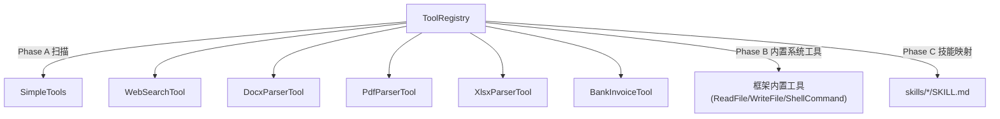
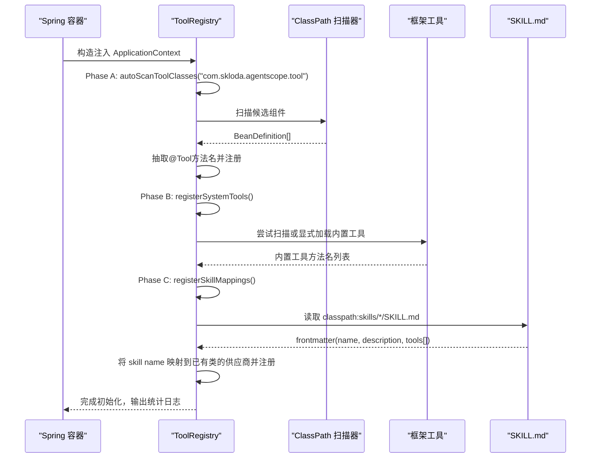
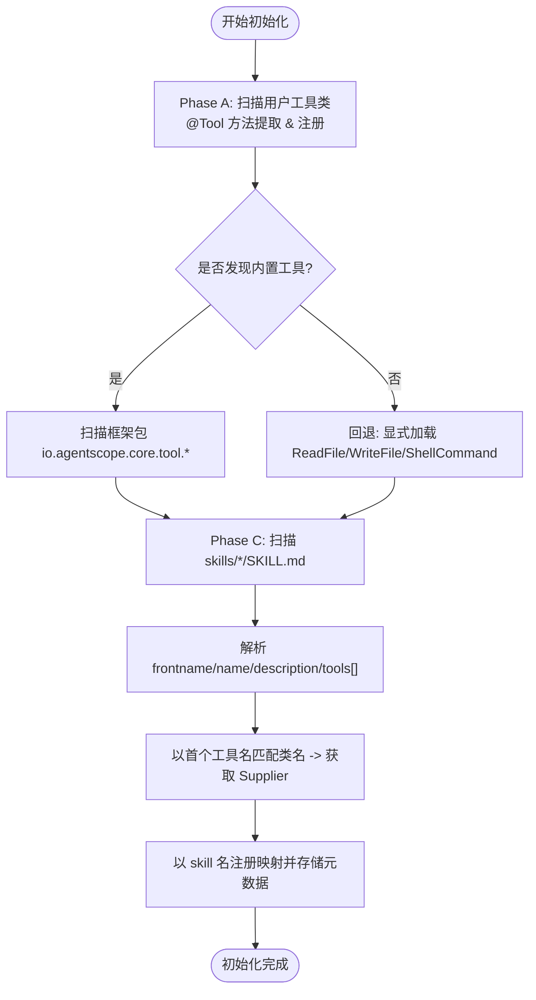
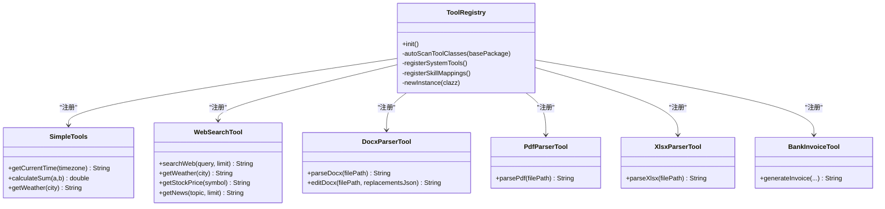
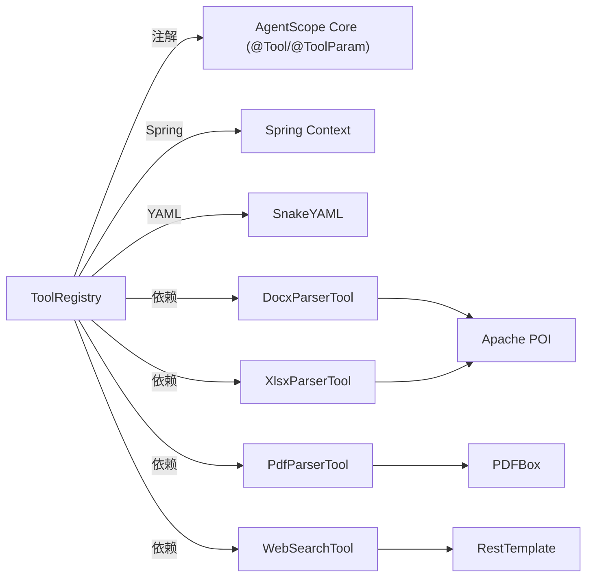

# 工具注册与管理

<cite>
**本文引用的文件**
- [ToolRegistry.java](file://src/main/java/com/skloda/agentscope/tool/ToolRegistry.java)
- [SimpleTools.java](file://src/main/java/com/skloda/agentscope/tool/SimpleTools.java)
- [WebSearchTool.java](file://src/main/java/com/skloda/agentscope/tool/WebSearchTool.java)
- [DocxParserTool.java](file://src/main/java/com/skloda/agentscope/tool/DocxParserTool.java)
- [PdfParserTool.java](file://src/main/java/com/skloda/agentscope/tool/PdfParserTool.java)
- [XlsxParserTool.java](file://src/main/java/com/skloda/agentscope/tool/XlsxParserTool.java)
- [BankInvoiceTool.java](file://src/main/java/com/skloda/agentscope/tool/BankInvoiceTool.java)
- [SKILL.md (bank_invoice)](file://src/main/resources/skills/bank_invoice/SKILL.md)
- [SKILL.md (docx)](file://src/main/resources/skills/docx/SKILL.md)
- [SKILL.md (pdf)](file://src/main/resources/skills/pdf/SKILL.md)
- [SKILL.md (xlsx)](file://src/main/resources/skills/xlsx/SKILL.md)
</cite>

## 目录
1. [引言](#引言)
2. [项目结构](#项目结构)
3. [核心组件](#核心组件)
4. [架构总览](#架构总览)
5. [详细组件分析](#详细组件分析)
6. [依赖关系分析](#依赖关系分析)
7. [性能考量](#性能考量)
8. [故障排查指南](#故障排查指南)
9. [结论](#结论)
10. [附录](#附录)

## 引言
本文件系统性阐述 AgentScope Demo 中的“工具注册与管理系统”，围绕 ToolRegistry 的三阶段初始化过程（Phase A/B/C）展开，详解 @Tool/@ToolParam 注解、返回值与异常模式、Spring Bean 优先实例化与反射降级、并发安全的数据结构以及技能映射的动态发现。同时提供自定义工具的完整开发指南、生命周期管理、调试与优化技巧。

## 项目结构
工具生态位于 tool 包下：
- ToolRegistry：统一的工具注册中心，负责三阶段初始化及并发安全的索引表维护。
- SimpleTools：示例工具集合（时间查询、计算器、天气等），展示最简工具写法。
- WebSearchTool：网络搜索工具，演示 Spring Bean + RestTemplate 接入外部 API 的模式。
- DocxParserTool / PdfParserTool / XlsxParserTool：文档解析工具，统一以 String 返回结构化结果。
- BankInvoiceTool：银行发票生成器，演示模板填充与文件输出的复杂场景。
资源层 skills/*/SKILL.md 定义技能元数据，由 Phase C 自动读取并与已注册工具进行绑定。

图表来源
- [ToolRegistry.java:23-44](file://src/main/java/com/skloda/agentscope/tool/ToolRegistry.java#L23-L44)

章节来源
- [ToolRegistry.java:23-44](file://src/main/java/com/skloda/agentscope/tool/ToolRegistry.java#L23-L44)
- [SKILL.md (docx):1-5](file://src/main/resources/skills/docx/SKILL.md#L1-L5)
- [SKILL.md (pdf):1-5](file://src/main/resources/skills/pdf/SKILL.md#L1-L5)
- [SKILL.md (xlsx):1-5](file://src/main/resources/skills/xlsx/SKILL.md#L1-L5)
- [SKILL.md (bank_invoice):1-4](file://src/main/resources/skills/bank_invoice/SKILL.md#L1-L4)

## 核心组件
- ToolRegistry
  - 职责：集中注册并缓存所有可被调用的工具方法与类；维护“工具名→类名”、“类名→Supplier 工厂”、“类名→方法集合”和“技能名→元数据”的索引。
  - 并发安全：使用 ConcurrentHashMap 承载所有映射，保证多线程下注册与查找的安全性与高性能。
  - 三阶段初始化：
    - Phase A：类路径扫描 com.skloda.agentscope.tool 下带 @Tool 注解方法的类，提取方法名并注册。
    - Phase B：尝试自动扫描 AgentScope 内置工具所在的框架包；失败时回退为显式加载 ReadFileTool/WriteFileTool/ShellCommandTool。
    - Phase C：扫描 classpath:skills/*/SKILL.md，解析 frontmatter(name, description, tools[])，将 skill name 注册到工具索引，并保存技能元数据供上层消费。
- 工具类
  - 必须包含至少一个使用 io.agentscope.core.tool.Tool 注解的方法；参数使用 @ToolParam(name, description) 声明以便运行时构建 schema。
  - 返回值建议为 String 或可序列化对象；异常应捕获并以明确错误信息返回（内部日志记录）。

章节来源
- [ToolRegistry.java:23-44](file://src/main/java/com/skloda/agentscope/tool/ToolRegistry.java#L23-L44)
- [ToolRegistry.java:51-69](file://src/main/java/com/skloda/agentscope/tool/ToolRegistry.java#L51-L69)
- [ToolRegistry.java:71-121](file://src/main/java/com/skloda/agentscope/tool/ToolRegistry.java#L71-L121)
- [ToolRegistry.java:123-151](file://src/main/java/com/skloda/agentscope/tool/ToolRegistry.java#L123-L151)
- [ToolRegistry.java:153-199](file://src/main/java/com/skloda/agentscope/tool/ToolRegistry.java#L153-L199)
- [SimpleTools.java:1-44](file://src/main/java/com/skloda/agentscope/tool/SimpleTools.java#L1-L44)
- [WebSearchTool.java:1-134](file://src/main/java/com/skloda/agentscope/tool/WebSearchTool.java#L1-L134)
- [DocxParserTool.java:17-57](file://src/main/java/com/skloda/agentscope/tool/DocxParserTool.java#L17-L57)
- [PdfParserTool.java:15-72](file://src/main/java/com/skloda/agentscope/tool/PdfParserTool.java#L15-L72)
- [XlsxParserTool.java:13-107](file://src/main/java/com/skloda/agentscope/tool/XlsxParserTool.java#L13-L107)

## 架构总览
下图展示了 ToolRegistry 在启动时如何发现用户工具、内置系统工具和技能映射，并通过供应商 Supplier 延迟实例化工具类，最终暴露给上层 AgentRuntime 调用。

图表来源
- [ToolRegistry.java:23-44](file://src/main/java/com/skloda/agentscope/tool/ToolRegistry.java#L23-L44)
- [ToolRegistry.java:71-121](file://src/main/java/com/skloda/agentscope/tool/ToolRegistry.java#L71-L121)
- [ToolRegistry.java:123-151](file://src/main/java/com/skloda/agentscope/tool/ToolRegistry.java#L123-L151)
- [ToolRegistry.java:153-199](file://src/main/java/com/skloda/agentscope/tool/ToolRegistry.java#L153-L199)

## 详细组件分析

### ToolRegistry：三阶段初始化与并发设计
- 数据结构
  - toolToClass：Map<工具名/技能名, 类名>，用于名称到实现类的快速定位。
  - classSuppliers：Map<类名, Supplier<Object>>，延迟创建工具实例；优先 Spring Bean，否则反射 new。
  - classToTools：Map<类名, List<工具名>>，描述每个类提供的全部工具。
  - skillMetadataMap：Map<技能名, SkillMetadata>，持久化 SKILL.md 的 name/description/tools[] 便于上层展现。
- Phase A 自动扫描
  - 基于 ClassPathScanningCandidateComponentProvider 全量扫描指定包，提取每个类的 @Tool 方法名。
  - 注册入口：registerClass(key, supplier, toolNames...)。
- Phase B 内置系统工具
  - 先尝试扫描框架内置包（io.agentscope.core.tool.file/coding），若不可用则通过 Class.forName 显式加载常见系统工具，再将其方法与类一并注册。
- Phase C 动态技能映射
  - 读取 classpath:skills/*/SKILL.md，解析 YAML frontmatter，校验必要字段。
  - 通过首个工具名反向查找到对应类，获取其 Supplier，以技能名为键重新注册，使 Agent 可以通过 skill 名称调用一组工具。

图表来源
- [ToolRegistry.java:71-96](file://src/main/java/com/skloda/agentscope/tool/ToolRegistry.java#L71-L96)
- [ToolRegistry.java:123-151](file://src/main/java/com/skloda/agentscope/tool/ToolRegistry.java#L123-L151)
- [ToolRegistry.java:153-199](file://src/main/java/com/skloda/agentscope/tool/ToolRegistry.java#L153-L199)

章节来源
- [ToolRegistry.java:23-44](file://src/main/java/com/skloda/agentscope/tool/ToolRegistry.java#L23-L44)
- [ToolRegistry.java:51-69](file://src/main/java/com/skloda/agentscope/tool/ToolRegistry.java#L51-L69)
- [ToolRegistry.java:71-121](file://src/main/java/com/skloda/agentscope/tool/ToolRegistry.java#L71-L121)
- [ToolRegistry.java:123-151](file://src/main/java/com/skloda/agentscope/tool/ToolRegistry.java#L123-L151)
- [ToolRegistry.java:153-199](file://src/main/java/com/skloda/agentscope/tool/ToolRegistry.java#L153-L199)

### 工具类编写规范
- 注解与参数
  - 方法级 @Tool(name, description)：声明工具名与说明，会被 Phase A 扫描注册。
  - 参数级 @ToolParam(name, description)：提供参数名与说明，用于运行时生成调用 schema。
- 返回值处理
  - 推荐返回 String，保持跨语言与前端展示友好；也可以返回 POJO，但需确保可序列化。
- 异常处理模式
  - 建议在方法内 try-catch 并记录日志，返回明确的错误信息字符串，避免抛出未捕获异常中断执行流。
- 典型实践
  - SimpleTools：简单无状态工具，直接返回计算结果或格式化字符串。
  - WebSearchTool：集成外部服务，异步阻塞等待响应后拼装结果，异常时返回友好提示。
  - Docx/Pdf/Xlsx Parser：统一按错误路径返回可读信息，并在成功时返回结构化的全文内容。
  - BankInvoiceTool：复杂业务工具，结合模板、文件 IO 与安全策略（如姓名脱敏）。

图表来源
- [ToolRegistry.java:23-44](file://src/main/java/com/skloda/agentscope/tool/ToolRegistry.java#L23-L44)
- [SimpleTools.java:12-44](file://src/main/java/com/skloda/agentscope/tool/SimpleTools.java#L12-L44)
- [WebSearchTool.java:20-134](file://src/main/java/com/skloda/agentscope/tool/WebSearchTool.java#L20-L134)
- [DocxParserTool.java:17-127](file://src/main/java/com/skloda/agentscope/tool/DocxParserTool.java#L17-L127)
- [PdfParserTool.java:15-72](file://src/main/java/com/skloda/agentscope/tool/PdfParserTool.java#L15-L72)
- [XlsxParserTool.java:13-107](file://src/main/java/com/skloda/agentscope/tool/XlsxParserTool.java#L13-L107)
- [BankInvoiceTool.java:19-200](file://src/main/java/com/skloda/agentscope/tool/BankInvoiceTool.java#L19-L200)

章节来源
- [SimpleTools.java:12-44](file://src/main/java/com/skloda/agentscope/tool/SimpleTools.java#L12-L44)
- [WebSearchTool.java:20-134](file://src/main/java/com/skloda/agentscope/tool/WebSearchTool.java#L20-L134)
- [DocxParserTool.java:17-127](file://src/main/java/com/skloda/agentscope/tool/DocxParserTool.java#L17-L127)
- [PdfParserTool.java:15-72](file://src/main/java/com/skloda/agentscope/tool/PdfParserTool.java#L15-L72)
- [XlsxParserTool.java:13-107](file://src/main/java/com/skloda/agentscope/tool/XlsxParserTool.java#L13-L107)
- [BankInvoiceTool.java:19-200](file://src/main/java/com/skloda/agentscope/tool/BankInvoiceTool.java#L19-L200)

### 工具分类体系：userTools vs systemTools vs skills
- userTools（用户自定义工具）
  - 位于 com.skloda.agentscope.tool，由 Phase A 自动发现。
  - 适用于业务扩展与领域专用能力，例如文档解析、金融报表生成、网页搜索等。
- systemTools（系统内置工具）
  - 由 Phase B 自动扫描或回退加载，包括文件读写、命令行执行等系统能力。
  - 适合通用操作，一般无需业务定制。
- skills（技能集合）
  - 通过 Phase C 从 resources/skills/*/SKILL.md 解析，tools[] 指向已注册的 tool 名。
  - 作为工具的组合入口，面向上层 Agent 提供语义化能力封装（如“docx”、“pdf”、“xlsx”、“bank_invoice”）。

章节来源
- [ToolRegistry.java:71-121](file://src/main/java/com/skloda/agentscope/tool/ToolRegistry.java#L71-L121)
- [ToolRegistry.java:123-151](file://src/main/java/com/skloda/agentscope/tool/ToolRegistry.java#L123-L151)
- [ToolRegistry.java:153-199](file://src/main/java/com/skloda/agentscope/tool/ToolRegistry.java#L153-L199)
- [SKILL.md (docx):1-5](file://src/main/resources/skills/docx/SKILL.md#L1-L5)
- [SKILL.md (pdf):1-5](file://src/main/resources/skills/pdf/SKILL.md#L1-L5)
- [SKILL.md (xlsx):1-5](file://src/main/resources/skills/xlsx/SKILL.md#L1-L5)
- [SKILL.md (bank_invoice):1-4](file://src/main/resources/skills/bank_invoice/SKILL.md#L1-L4)

### 自定义工具开发完整指南

#### 1）简单工具（以 SimpleTools 为例）
- 步骤
  - 在方法上使用 @Tool(name, description)。
  - 参数使用 @ToolParam(name, description) 描述入参意图与类型。
  - 返回值建议为 String；内部做好参数校验与异常兜底。
- 典型场景
  - get_current_time：根据时区格式化当前时间。
  - calculate_sum：两数相加，返回双精度结果。
  - get_weather：模拟返回某城市天气信息，未知城市给出 fallback。
- 关键点
  - 保持幂等与无副作用；避免长耗时 I/O。
  - 错误信息清晰、易读。

章节来源
- [SimpleTools.java:14-43](file://src/main/java/com/skloda/agentscope/tool/SimpleTools.java#L14-L43)

#### 2）网络请求工具（以 WebSearchTool 为例）
- 步骤
  - 标注 @Component，使用 @Value 注入 API Key。
  - 使用 RestTemplate + Reactor 调度线程池进行 HTTP 调用，并组装结构化结果。
- 典型场景
  - web_search：通用搜索。
  - get_current_weather/get_stock_price/get_news：基于搜索封装垂直能力的快捷工具。
- 关键点
  - 对外部依赖设置超时与重试策略（本项目已做基础封装，可按需增强）。
  - 异常时记录日志并返回友好消息。

章节来源
- [WebSearchTool.java:20-134](file://src/main/java/com/skloda/agentscope/tool/WebSearchTool.java#L20-L134)

#### 3）文档解析工具（Docx/Pdf/Xlsx）
- 步骤
  - 使用 Apache POI/PDFBox 打开文件流。
  - 将结构化内容（段落、表格、列表、页号等）转为文本返回。
  - 对空文档或未找到内容的情况返回明确提示。
- 典型场景
  - parse_docx/edit_docx：提取全文与占位符替换。
  - parse_pdf：分页提取文字，附带文档元数据。
  - parse_xlsx：逐 sheet 解析表格数据，格式化日期/公式/布尔值等。
- 关键点
  - 大文件时注意内存使用；对每页或每个 sheet 流式处理更佳（本项目对 PDF 按页处理即为范例）。

章节来源
- [DocxParserTool.java:24-127](file://src/main/java/com/skloda/agentscope/tool/DocxParserTool.java#L24-L127)
- [PdfParserTool.java:19-72](file://src/main/java/com/skloda/agentscope/tool/PdfParserTool.java#L19-L72)
- [XlsxParserTool.java:17-107](file://src/main/java/com/skloda/agentscope/tool/XlsxParserTool.java#L17-L107)

#### 4）复杂业务工具（以 BankInvoiceTool 为例）
- 步骤
  - 通过模板文件（Excel/Word）进行数据填充。
  - 敏感信息脱敏（如姓名处理）。
  - 输出文件保存到安全目录（临时目录/uploads），记录路径并返回。
- 关键点
  - 模板不存在时抛出明确异常，调用方可感知配置问题。
  - 文件写入异常时记录堆栈并返回失败原因。

章节来源
- [BankInvoiceTool.java:19-200](file://src/main/java/com/skloda/agentscope/tool/BankInvoiceTool.java#L19-L200)

### 生命周期管理与并发安全
- 实例化顺序
  - newInstance 优先从 ApplicationContext 获取 Spring Bean（支持 @Value/@Autowired 等注入）。
  - 若失败，回退到反射实例化工厂，保证即使非托管也能正常运行。
- 并发安全
  - 所有共享映射均为 ConcurrentHashMap，读多写少的注册阶段高并发下不会争用瓶颈。
  - Supplier 持有类级别引用，真正工具方法调用时的具体状态取决于工具自身设计（建议无状态或局部作用域）。

章节来源
- [ToolRegistry.java:109-121](file://src/main/java/com/skloda/agentscope/tool/ToolRegistry.java#L109-L121)
- [ToolRegistry.java:51-69](file://src/main/java/com/skloda/agentscope/tool/ToolRegistry.java#L51-L69)

## 依赖关系分析
- ToolRegistry 依赖
  - Spring Context：用于 Bean 解析、ClassPath 扫描与资源路径定位。
  - AgentScope Core Tool：@Tool/@ToolParam 注解来自 io.agentscope.core.tool.*。
  - SnakeYAML：解析 SKILL.md frontmatter。
- 工具类依赖
  - 文件 IO：Apache POI（Office 系列）、PDFBox（PDF）。
  - 网络：RestTemplate（HTTP）。
  - 日志：SLF4J/Logback。

图表来源
- [ToolRegistry.java:3-20](file://src/main/java/com/skloda/agentscope/tool/ToolRegistry.java#L3-L20)
- [DocxParserTool.java:1-15](file://src/main/java/com/skloda/agentscope/tool/DocxParserTool.java#L1-L15)
- [PdfParserTool.java:1-14](file://src/main/java/com/skloda/agentscope/tool/PdfParserTool.java#L1-L14)
- [XlsxParserTool.java:1-12](file://src/main/java/com/skloda/agentscope/tool/XlsxParserTool.java#L1-L12)
- [WebSearchTool.java:1-16](file://src/main/java/com/skloda/agentscope/tool/WebSearchTool.java#L1-L16)

章节来源
- [ToolRegistry.java:3-20](file://src/main/java/com/skloda/agentscope/tool/ToolRegistry.java#L3-L20)
- [DocxParserTool.java:1-15](file://src/main/java/com/skloda/agentscope/tool/DocxParserTool.java#L1-L15)
- [PdfParserTool.java:1-14](file://src/main/java/com/skloda/agentscope/tool/PdfParserTool.java#L1-L14)
- [XlsxParserTool.java:1-12](file://src/main/java/com/skloda/agentscope/tool/XlsxParserTool.java#L1-L12)
- [WebSearchTool.java:1-16](file://src/main/java/com/skloda/agentscope/tool/WebSearchTool.java#L1-L16)

## 性能考量
- 启动期扫描
  - Phase A/B 在应用启动时执行，可能带来短暂 IO/类加载开销；应仅在热部署或需要频繁变更工具定义时关注。
- 大文件解析
  - PDF/DOCX/XLSX 均涉及 IO；对大 PDF 已实现分页处理，建议对 DOCX/XLSX 也考虑逐块或流式解析以降低峰值内存。
- 网络请求
  - WebSearchTool 使用弹性线程池进行 HTTP 调用；建议在生产环境增加熔断、重试与超时配置以提升鲁棒性。
- 并发访问
  - ToolRegistry 使用 ConcurrentHashMap，注册完成后仅读为主，适合高并发调用场景。

[本节为通用性能建议，不直接分析特定文件]

## 故障排查指南
- 技能未注册
  - 现象：无法通过 skill name 调用工具。
  - 检查点：
    - SKILL.md 是否放置在 classpath:skills/* 目录下。
    - frontmatter 中 name/description/tools[] 是否齐全且正确。
    - tools[] 内的第一个工具是否在 Phase A/B 已注册。
  - 参考
    - [ToolRegistry.java:153-199](file://src/main/java/com/skloda/agentscope/tool/ToolRegistry.java#L153-L199)
    - [SKILL.md (docx):1-5](file://src/main/resources/skills/docx/SKILL.md#L1-L5)
    - [SKILL.md (pdf):1-5](file://src/main/resources/skills/pdf/SKILL.md#L1-L5)
    - [SKILL.md (xlsx):1-5](file://src/main/resources/skills/xlsx/SKILL.md#L1-L5)
    - [SKILL.md (bank_invoice):1-4](file://src/main/resources/skills/bank_invoice/SKILL.md#L1-L4)
- 工具方法未识别
  - 现象：工具名无效。
  - 检查点：
    - 类是否正确放在 com.skloda.agentscope.tool 或其子包下。
    - 方法是否标注 @Tool，且 name 非空。
    - 是否因继承/接口未被扫描导致。
  - 参考
    - [ToolRegistry.java:71-107](file://src/main/java/com/skloda/agentscope/tool/ToolRegistry.java#L71-L107)
    - [SimpleTools.java:14-43](file://src/main/java/com/skloda/agentscope/tool/SimpleTools.java#L14-L43)
- 外部依赖缺失
  - 现象：模板找不到、POI/PDFBox 异常。
  - 检查点：
    - assets 路径是否正确，resources 是否包含模板文件。
    - Maven 依赖是否引入相应库。
  - 参考
    - [BankInvoiceTool.java:52-98](file://src/main/java/com/skloda/agentscope/tool/BankInvoiceTool.java#L52-L98)
    - [BankInvoiceTool.java:114-165](file://src/main/java/com/skloda/agentscope/tool/BankInvoiceTool.java#L114-L165)

## 结论
ToolRegistry 以三阶段机制实现了“即插即用”的工具注册中心：Phase A 自动发现用户工具、Phase B 装载系统能力、Phase C 将技能语义与工具集合绑定。借助并发安全的映射结构与灵活的 Supplier 延迟实例化，系统在扩展性、可维护性和运行时性能方面取得平衡。配合清晰的 @Tool/@ToolParam 规范与稳健的错误处理模式，开发者可以高效地构建从简单工具到复杂业务工作流的丰富工具生态。

## 附录

### 最佳实践清单
- 工具命名与说明
  - 使用简洁、一致的 name 与清晰描述性 description，有助于 LLM 选择合适工具。
- 参数约束
  - 严格使用 @ToolParam 声明参数含义，尽量限制取值范围与必填性（通过逻辑校验）。
- 返回值设计
  - 优先返回人类可读的字符串；必要时返回 JSON，确保前端/下游可解析。
- 异常与日志
  - 捕获所有可能的 IO/网络/解析异常；记录必要的上下文（如文件路径、关键参数）。
- 可观测性
  - 在关键步骤加入日志，必要时添加指标收集（如网络请求耗时、文件大小统计）。
- 性能与容量
  - 大文件解析采用流式/分页；网络请求设置合理超时与重试；避免在工具内进行长轮询。

[本节为通用指导，不直接分析特定文件]