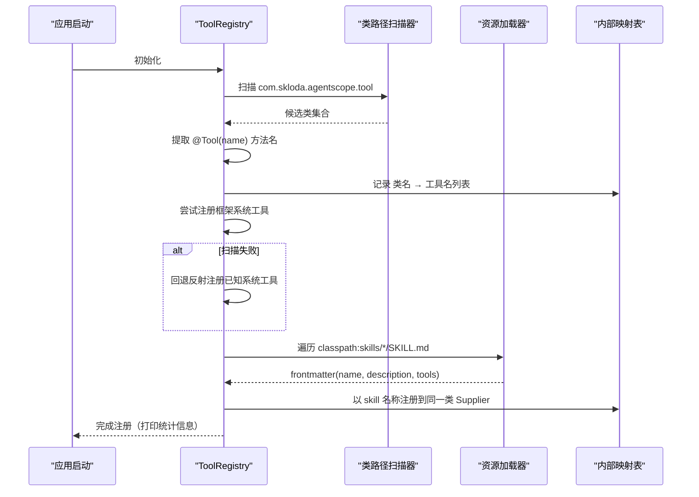
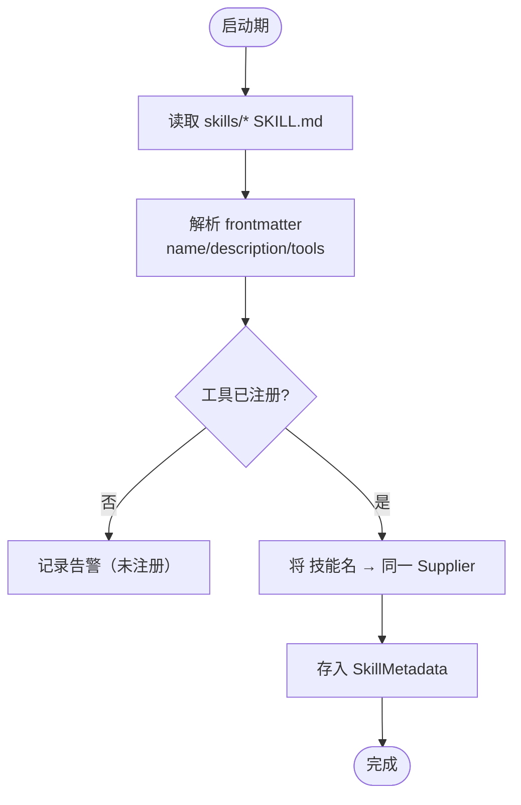
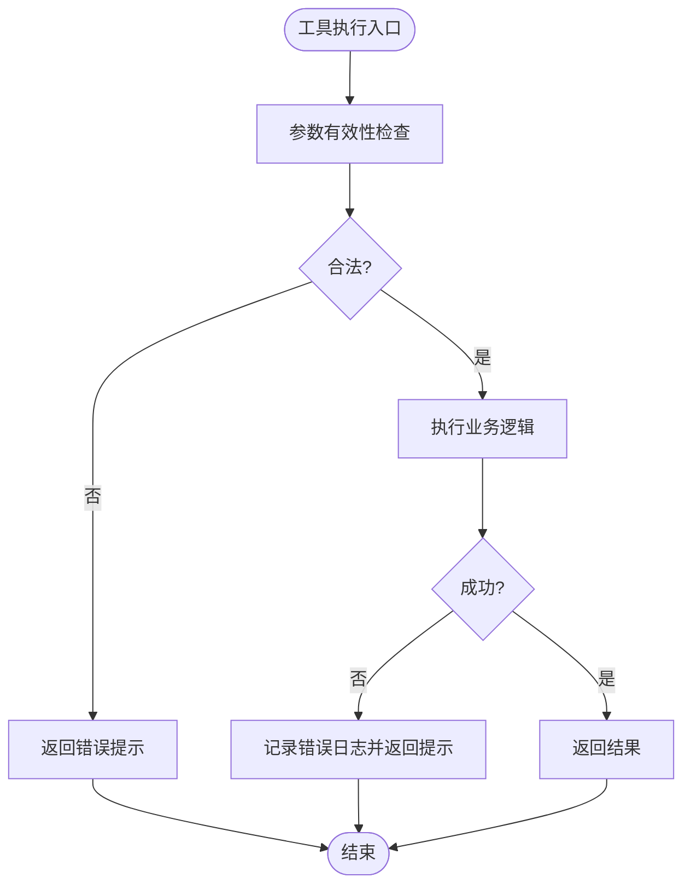
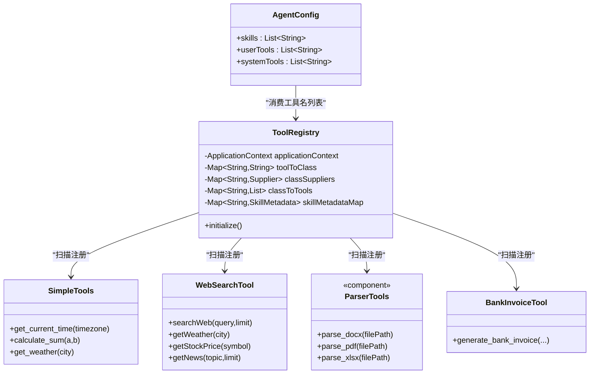

# 工具配置

<cite>
**本文引用的文件**   
- [ToolRegistry.java](file://src/main/java/com/skloda/agentscope/tool/ToolRegistry.java)
- [SimpleTools.java](file://src/main/java/com/skloda/agentscope/tool/SimpleTools.java)
- [WebSearchTool.java](file://src/main/java/com/skloda/agentscope/tool/WebSearchTool.java)
- [BankInvoiceTool.java](file://src/main/java/com/skloda/agentscope/tool/BankInvoiceTool.java)
- [DocxParserTool.java](file://src/main/java/com/skloda/agentscope/tool/DocxParserTool.java)
- [PdfParserTool.java](file://src/main/java/com/skloda/agentscope/tool/PdfParserTool.java)
- [XlsxParserTool.java](file://src/main/java/com/skloda/agentscope/tool/XlsxParserTool.java)
- [AgentConfig.java](file://src/main/java/com/skloda/agentscope/agent/AgentConfig.java)
- [agents.yml](file://src/main/resources/config/agents.yml)
- [docx SKILL.md](file://src/main/resources/skills/docx/SKILL.md)
- [pdf SKILL.md](file://src/main/resources/skills/pdf/SKILL.md)
- [xlsx SKILL.md](file://src/main/resources/skills/xlsx/SKILL.md)
- [bank_invoice_java SKILL.md](file://src/main/resources/skills/bank_invoice_java/SKILL.md)
</cite>

## 目录
1. [简介](#简介)
2. [项目结构与定位](#项目结构与定位)
3. [核心组件总览](#核心组件总览)
4. [系统架构与数据流](#系统架构与数据流)
5. [关键组件深入分析](#关键组件深入分析)
6. [依赖关系分析](#依赖关系分析)
7. [性能与可用性考虑](#性能与可用性考虑)
8. [故障排查指南](#故障排查指南)
9. [结论与最佳实践](#结论与最佳实践)

## 简介
本文件面向开发者，系统化说明 AgentScope 演示工程中的“工具配置”机制：如何通过配置项将技能（skills）、用户工具（userTools）和系统工具（systemTools）组装到不同 Agent 类型中；ToolRegistry 如何实现工具发现、动态注册与参数声明；以及如何为 Basic Chat Agent、Tool Calling Agent、Task Agent 等场景提供推荐的工具集与安全边界。文档同时覆盖内置工具引用方式、自定义工具注册流程、权限控制与安全注意事项，并给出图示化的流程与架构图。

## 项目结构与定位
- 工具实现位于 tool 包中，以注解驱动的方式暴露方法名，供 Agent 调用。
- 工具清单通过 ToolRegistry 在启动阶段完成三类装配：用户工具类自动扫描、框架内置系统工具自动回退注册、从 skills 目录 SKILL.md 前缀元数据解析得到“技能—工具映射”。
- 各 Agent 的能力由 agents.yml 中的 agentId + skills/userTools/systemTools 描述，构建时转化为运行时可用的工具集合。
- 针对权限策略，AgentConfig 定义 permissionConfig（默认模式 denyTools/askTools），结合 Harness/Middleware 层可执行细粒度审批或拦截。

章节来源
- [ToolRegistry.java:23-44](file://src/main/java/com/skloda/agentscope/tool/ToolRegistry.java#L23-L44)
- [AgentConfig.java:11-24](file://src/main/java/com/skloda/agentscope/agent/AgentConfig.java#L11-L24)
- [agents.yml:1-90](file://src/main/resources/config/agents.yml#L1-L90)

## 核心组件总览
- 工具注解模型：采用 @Tool/@ToolParam 描述能力名称与入参语义，便于注册与后续参数校验。
- 工具注册中心：ToolRegistry 负责启动期扫描与注册，统一维护 “功能名→类名→实例供应商” 的映射，以及 “技能名→工具名列表” 的前缀映射。
- Agent 配置：AgentConfig.skills/userTools/systemTools 定义每个 Agent 可见工具集。
- 内置/外部工具示例：SimpleTools（时间/计算/天气）、WebSearchTool（网络搜索/天气/股票/新闻）、文件与文档解析工具（docx/pdf/xlsx）与业务工具（银行发票生成）。

章节来源
- [SimpleTools.java:12-44](file://src/main/java/com/skloda/agentscope/tool/SimpleTools.java#L12-L44)
- [WebSearchTool.java:20-134](file://src/main/java/com/skloda/agentscope/tool/WebSearchTool.java#L20-L134)
- [DocxParserTool.java:17-24](file://src/main/java/com/skloda/agentscope/tool/DocxParserTool.java#L17-L24)
- [PdfParserTool.java:15-19](file://src/main/java/com/skloda/agentscope/tool/PdfParserTool.java#L15-L19)
- [XlsxParserTool.java:13-17](file://src/main/java/com/skloda/agentscope/tool/XlsxParserTool.java#L13-L17)
- [BankInvoiceTool.java:19-199](file://src/main/java/com/skloda/agentscope/tool/BankInvoiceTool.java#L19-L199)
- [AgentConfig.java:11-24](file://src/main/java/com/skloda/agentscope/agent/AgentConfig.java#L11-L24)

## 系统架构与数据流
```mermaid
graph TB
    A["配置文件<br/>agents.yml"] --> B["工具注册表<br/>ToolRegistry"]
    A --> C["Agent 配置实体<br/>AgentConfig"]
    D["工具实现类<br/>SimpleTools/WebSearchTool/..."] -->|@Tool 注解扫描| B
    E["SKILL.md 前缀元数据<br/>skills/*"] -->|name/tools 解析| B
    F["框架内置系统工具<br/>Read/Write/Shell 等"] -->|自动/回退注册| B
    B --> G["运行时工具可用集<br/>按 Agent 装配 userTools/systemTools/skills"]
    C --> G
```

图表来源
- [ToolRegistry.java:30-199](file://src/main/java/com/skloda/agentscope/tool/ToolRegistry.java#L30-L199)
- [agents.yml:1-90](file://src/main/resources/config/agents.yml#L1-L90)
- [docx SKILL.md:1-5](file://src/main/resources/skills/docx/SKILL.md#L1-L5)
- [pdf SKILL.md:1-5](file://src/main/resources/skills/pdf/SKILL.md#L1-L5)
- [xlsx SKILL.md:1-5](file://src/main/resources/skills/xlsx/SKILL.md#L1-L5)
- [bank_invoice_java SKILL.md:1-5](file://src/main/resources/skills/bank_invoice_java/SKILL.md#L1-L5)

章节来源
- [ToolRegistry.java:71-199](file://src/main/java/com/skloda/agentscope/tool/ToolRegistry.java#L71-L199)
- [agents.yml:1-90](file://src/main/resources/config/agents.yml#L1-L90)

## 关键组件深入分析

### 工具注册表（ToolRegistry）工作原理
- 第一阶段：自动扫描用户工具类
  - 基于指定基础包，扫描所有候选类，过滤掉注册表自身；提取包含 @Tool(name=...) 的方法名集合；以类名为键记录该类的全部功能名。
  - 使用 Spring ApplicationContext 优先获取 Bean 实例（支持注入依赖），否则反射创建。
- 第二阶段：注册框架内置系统工具
  - 尝试扫描框架内置包；若未发现则回退到显式反射注册常见系统工具（读取/写入文件、执行 Shell）。
- 第三阶段：基于 SKILL.md 前缀元数据的技能映射
  - 读取 classpath 下 skills/*/SKILL.md，解析 YAML frontmatter 的 name/description/tools；
  - 用首个工具对应的类找到 Supplier，将“技能名”作为另一个 key 注册到注册表，并将元数据缓存以便上层查询。

下图展示了启动期注册流程：



图表来源
- [ToolRegistry.java:30-44](file://src/main/java/com/skloda/agentscope/tool/ToolRegistry.java#L30-L44)
- [ToolRegistry.java:71-107](file://src/main/java/com/skloda/agentscope/tool/ToolRegistry.java#L71-L107)
- [ToolRegistry.java:123-151](file://src/main/java/com/skloda/agentscope/tool/ToolRegistry.java#L123-L151)
- [ToolRegistry.java:155-199](file://src/main/java/com/skloda/agentscope/tool/ToolRegistry.java#L155-L199)

章节来源
- [ToolRegistry.java:23-44](file://src/main/java/com/skloda/agentscope/tool/ToolRegistry.java#L23-L44)
- [ToolRegistry.java:71-199](file://src/main/java/com/skloda/agentscope/tool/ToolRegistry.java#L71-L199)

### 工具发现机制
- 注解驱动：方法级 @Tool(name) 决定对外暴露的名称。参数通过 @ToolParam(name, description) 传递语义，便于 LLM 理解参数含义与约束。
- 包扫描：限定 basePackage（tool 包）避免无关类被误识别。
- 类级别去重：忽略注册表本身；若类不含任何带名的工具方法则不登记。
- 系统工具兼容：当框架包扫描不可用时，回退显式反射注册常见工具，确保环境差异下的可用性。

章节来源
- [ToolRegistry.java:71-107](file://src/main/java/com/skloda/agentscope/tool/ToolRegistry.java#L71-L107)
- [ToolRegistry.java:123-151](file://src/main/java/com/skloda/agentscope/tool/ToolRegistry.java#L123-L151)
- [SimpleTools.java:12-44](file://src/main/java/com/skloda/agentscope/tool/SimpleTools.java#L12-L44)
- [DocxParserTool.java:17-24](file://src/main/java/com/skloda/agentscope/tool/DocxParserTool.java#L17-L24)
- [PdfParserTool.java:15-19](file://src/main/java/com/skloda/agentscope/tool/PdfParserTool.java#L15-L19)
- [XlsxParserTool.java:13-17](file://src/main/java/com/skloda/agentscope/tool/XlsxParserTool.java#L13-L17)
- [BankInvoiceTool.java:194-199](file://src/main/java/com/skloda/agentscope/tool/BankInvoiceTool.java#L194-L199)
- [WebSearchTool.java:30-134](file://src/main/java/com/skloda/agentscope/tool/WebSearchTool.java#L30-L134)

### 动态注册与技能映射
- 技能即工具别名：SKILL.md 的 frontmatter 中 tools 字段列出该技能绑定的实际工具名；注册表会据此将“技能名”指向同一工具类实例供应商。
- 元数据缓存：注册时同步保存 SkillMetadata（含 name/description/tools），便于上层服务在 UI/诊断中展示“当前有哪些技能，分别能做什么”。
- 典型场景：docx/pdf/xlsx/bank_invoice_java 等技能仅通过 name/tools 绑定现有解析或生成工具，即可让 Agent 以自然语言“技能名”触发一组工具调用。



图表来源
- [ToolRegistry.java:155-199](file://src/main/java/com/skloda/agentscope/tool/ToolRegistry.java#L155-L199)

章节来源
- [ToolRegistry.java:155-199](file://src/main/java/com/skloda/agentscope/tool/ToolRegistry.java#L155-L199)
- [docx SKILL.md:1-5](file://src/main/resources/skills/docx/SKILL.md#L1-L5)
- [pdf SKILL.md:1-5](file://src/main/resources/skills/pdf/SKILL.md#L1-L5)
- [xlsx SKILL.md:1-5](file://src/main/resources/skills/xlsx/SKILL.md#L1-L5)
- [bank_invoice_java SKILL.md:1-5](file://src/main/resources/skills/bank_invoice_java/SKILL.md#L1-L5)

### 参数验证与错误处理
- 参数语义化：通过 @ToolParam(description) 给 LLM 明确参数要求；具体值合法性校验应在工具内部实现（如空值检查、范围限制、远程接口异常捕获）。
- 运行期异常：工具方法应 catch 并返回人类可读的错误消息；注册阶段捕获无法加载的类或系统工具缺失并降级。
- 日志与警告：注册失败、缺少元数据、找不到系统等均有相应日志输出，便于部署排障。



图表来源
- [WebSearchTool.java:35-99](file://src/main/java/com/skloda/agentscope/tool/WebSearchTool.java#L35-L99)
- [ToolRegistry.java:191-199](file://src/main/java/com/skloda/agentscope/tool/ToolRegistry.java#L191-L199)

章节来源
- [WebSearchTool.java:30-134](file://src/main/java/com/skloda/agentscope/tool/WebSearchTool.java#L30-L134)
- [ToolRegistry.java:155-199](file://src/main/java/com/skloda/agentscope/tool/ToolRegistry.java#L155-L199)

### 为不同 Agent 类型配置工具集
- Basic Chat Agent：默认不启用额外工具（skills/userTools/systemTools 为空），适合纯对话与上下文压缩场景。
- Tool Calling Agent：开启 userTools（业务能力）+ systemTools（读写文件/执行命令等系统级能力），用于实时问答与工具组合。
- Task Agent（文档分析）：开启 skills（以技能名聚合多工具）+ 用户工具（解析/编辑文档）+ systemTools（只读查看文本等最小化系统权限），强调安全与任务聚焦。

参考配置示例（摘自配置文件片段）：
- chat-basic：无工具，走上下文压缩。
- tool-test-simple：启用 get_current_time/calculate_sum/get_weather（userTools），以及 view_text_file/write_text_file/execute_shell_command（systemTools）。
- task-document-analysis：启用 docx/pdf/xlsx 技能与对应解析工具，systemTools 仅开放文本查看。
- bank-invoice：启用解析与编辑工具、发票生成工具，并通过 approvalTools 进行人工审批把关。

章节来源
- [agents.yml:1-200](file://src/main/resources/config/agents.yml#L1-L200)
- [AgentConfig.java:11-24](file://src/main/java/com/skloda/agentscope/agent/AgentConfig.java#L11-L24)

### 内置工具引用与自定义工具注册
- 引用方式：在 agents.yml 中直接将工具名加入 userTools 或 systemTools；或在 SKILL.md 中通过 tools 列出，再以 skills 字段引入。
- 自定义工具：
  1) 在 tool 包新增 Java 类，使用 @Tool 标注方法并命名；
  2) 如需依赖注入，添加 @Component；
  3) 保证包路径在 ToolRegistry 扫描范围内；
  4) 在 agents.yml 或 SKILL.md 中以“方法名”或“技能名”暴露给 Agent。

章节来源
- [ToolRegistry.java:71-107](file://src/main/java/com/skloda/agentscope/tool/ToolRegistry.java#L71-L107)
- [SimpleTools.java:12-44](file://src/main/java/com/skloda/agentscope/tool/SimpleTools.java#L12-L44)
- [WebSearchTool.java:20-134](file://src/main/java/com/skloda/agentscope/tool/WebSearchTool.java#L20-L134)
- [DocxParserTool.java:17-24](file://src/main/java/com/skloda/agentscope/tool/DocxParserTool.java#L17-L24)
- [PdfParserTool.java:15-19](file://src/main/java/com/skloda/agentscope/tool/PdfParserTool.java#L15-L19)
- [XlsxParserTool.java:13-17](file://src/main/java/com/skloda/agentscope/tool/XlsxParserTool.java#L13-L17)
- [BankInvoiceTool.java:194-199](file://src/main/java/com/skloda/agentscope/tool/BankInvoiceTool.java#L194-L199)

### 权限控制与安全考虑
- 默认权限模式：通过 AgentConfig.PermissionConfig.defaultMode 设置（如 bypass/other 模式）；可基于 denyTools/askTools 列表禁止特定工具或触发人工审批。
- 最小权限原则：建议 Task/专业型 Agent 的 systemTools 保持最小可用集合（例如只读查看文本），高风险操作放入 userTools 并配合审批。
- HITL/审批：对敏感工具（如银行发票生成）可在配置中使用 approvalTools；在执行前进入人工确认流程，降低误操作风险。
- 输入校验：工具内部严格校验参数（空值、格式、范围），并对远程调用（如搜索 API）做超时/错误降级，防止恶意输入放大。
- 资源与隔离：系统工具（写文件、命令执行）需审慎开放；必要时结合沙箱（Harness 文件系统模式）与中间件进行更细粒度隔离与审计。

章节来源
- [AgentConfig.java:91-106](file://src/main/java/com/skloda/agentscope/agent/AgentConfig.java#L91-L106)
- [agents.yml:140-170](file://src/main/resources/config/agents.yml#L140-L170)
- [WebSearchTool.java:35-99](file://src/main/java/com/skloda/agentscope/tool/WebSearchTool.java#L35-L99)
- [BankInvoiceTool.java:194-199](file://src/main/java/com/skloda/agentscope/tool/BankInvoiceTool.java#L194-L199)

## 依赖关系分析


图表来源
- [ToolRegistry.java:23-69](file://src/main/java/com/skloda/agentscope/tool/ToolRegistry.java#L23-L69)
- [SimpleTools.java:12-44](file://src/main/java/com/skloda/agentscope/tool/SimpleTools.java#L12-L44)
- [WebSearchTool.java:20-134](file://src/main/java/com/skloda/agentscope/tool/WebSearchTool.java#L20-L134)
- [DocxParserTool.java:17-24](file://src/main/java/com/skloda/agentscope/tool/DocxParserTool.java#L17-L24)
- [PdfParserTool.java:15-19](file://src/main/java/com/skloda/agentscope/tool/PdfParserTool.java#L15-L19)
- [XlsxParserTool.java:13-17](file://src/main/java/com/skloda/agentscope/tool/XlsxParserTool.java#L13-L17)
- [BankInvoiceTool.java:194-199](file://src/main/java/com/skloda/agentscope/tool/BankInvoiceTool.java#L194-L199)
- [AgentConfig.java:11-24](file://src/main/java/com/skloda/agentscope/agent/AgentConfig.java#L11-L24)

## 性能与可用性考虑
- 启动扫描开销：ToolRegistry 在启动阶段进行类路径扫描与反射调用，工具数量较大时应注意首次冷启动耗时；建议尽量复用 Bean（优先从 Spring 上下文获取）。
- 系统工具回退：当依赖框架包不可用时会自动回退注册少数关键系统工具，有助于在不同部署环境中保持稳定。
- 远程调用性能：网络搜索工具以阻塞调用包裹异步调度，需注意线程模型与超时；可按需在工具内实现限流/重试/熔断。
- 大文件处理：文档解析类工具应避免一次性读取超大文件，结合分页/流式处理以提升稳定性（按具体实现评估）。

[本节为通用性能指导，不涉及具体行号]

## 故障排查指南
- 工具未生效
  - 检查 @Tool.name 是否与 agents.yml 中配置的 userTools/systemTools 一致；
  - 确认工具类是否位于扫描基础包下；
  - 查看启动日志是否出现“Could not load class / failed to parse skill file”等信息。
- 技能未绑定
  - 核对 SKILL.md frontmatter 中 name/tools 是否存在且工具确已注册；
  - 若首个工具未注册，则会跳过该技能并告警。
- 系统工具不可用
  - 观察日志是否命中“Framework scan found nothing, using explicit system tool registration”；
  - 如仍不可用，检查依赖是否完整或反射目标类是否存在。
- 权限/审批拦截
  - 检查 defaultMode、denyTools、askTools 配置；
  - 对敏感工具设置 approvalTools，确保工作流进入审批分支。

章节来源
- [ToolRegistry.java:92-94](file://src/main/java/com/skloda/agentscope/tool/ToolRegistry.java#L92-L94)
- [ToolRegistry.java:169-188](file://src/main/java/com/skloda/agentscope/tool/ToolRegistry.java#L169-L188)
- [ToolRegistry.java:131-149](file://src/main/java/com/skloda/agentscope/tool/ToolRegistry.java#L131-L149)
- [AgentConfig.java:91-106](file://src/main/java/com/skloda/agentscope/agent/AgentConfig.java#L91-L106)

## 结论与最佳实践
- 以“技能”聚合复杂能力，以“工具”暴露原子操作，二者在 ToolRegistry 中统一注册，Agent 按需装配 userTools/systemTools/skills。
- 坚持最小权限原则：系统工具仅在必要时授予，并对高危能力加上审批；用户工具也应根据 Agent 职责收敛。
- 参数描述与校验并重：@ToolParam 清晰描述参数语义，工具内部完成边界校验与错误处理，提升鲁棒性与可观测性。
- 配置即契约：agents.yml 集中管理 Agent 能力边界，配合 SKILL.md 文档化技能用途，便于维护与演进。