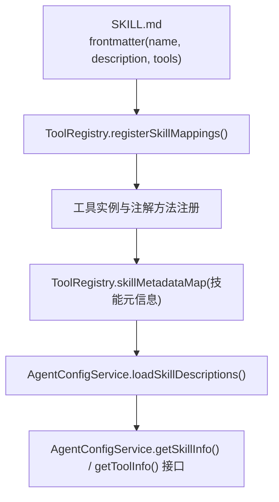
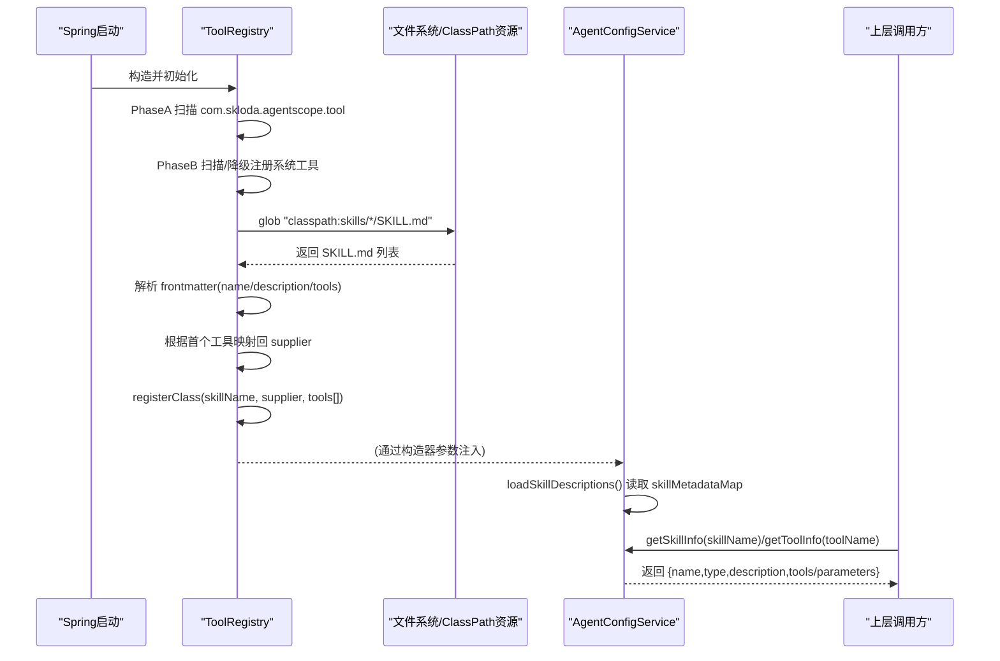
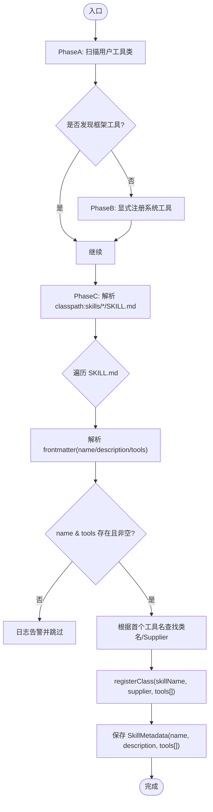
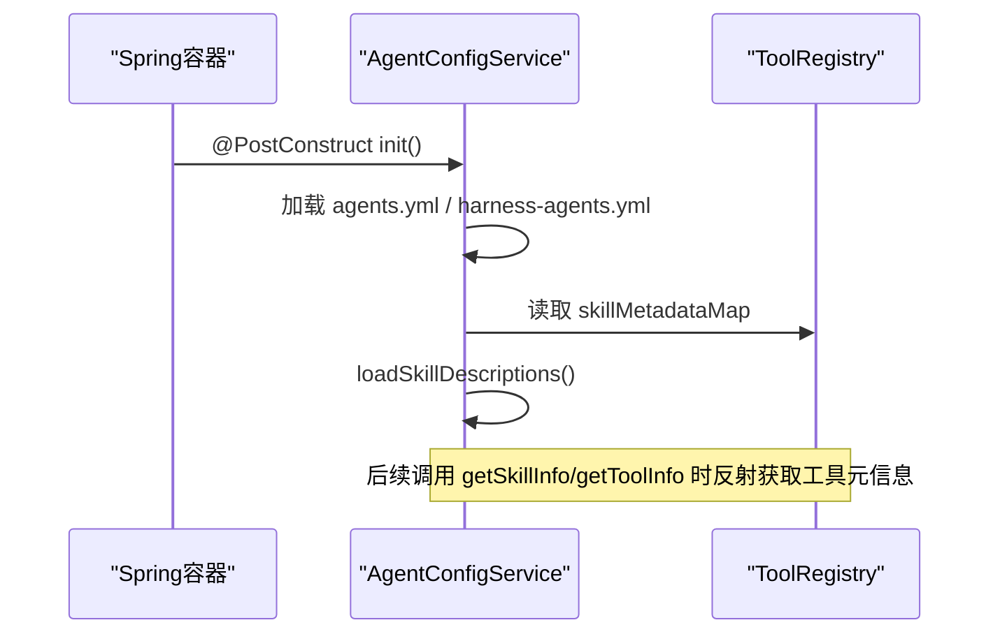
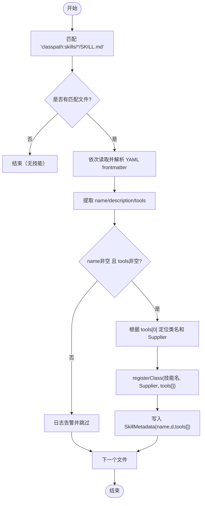
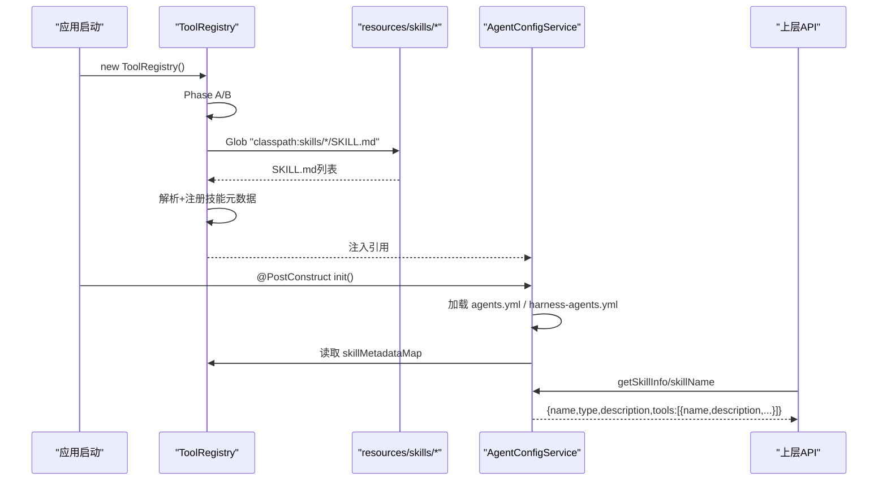
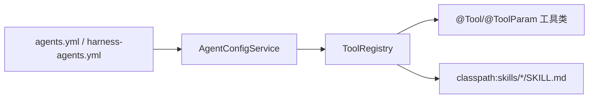

# 技能系统

<cite>
**本文引用的文件列表**
- [ToolRegistry.java](file://src/main/java/com/skloda/agentscope/tool/ToolRegistry.java)
- [AgentConfigService.java](file://src/main/java/com/skloda/agentscope/agent/AgentConfigService.java)
- [DocxParserTool.java](file://src/main/java/com/skloda/agentscope/tool/DocxParserTool.java)
- [PdfParserTool.java](file://src/main/java/com/skloda/agentscope/tool/PdfParserTool.java)
- [XlsxParserTool.java](file://src/main/java/com/skloda/agentscope/tool/XlsxParserTool.java)
- [SimpleTools.java](file://src/main/java/com/skloda/agentscope/tool/SimpleTools.java)
- [WebSearchTool.java](file://src/main/java/com/skloda/agentscope/tool/WebSearchTool.java)
- [BankInvoiceTool.java](file://src/main/java/com/skloda/agentscope/tool/BankInvoiceTool.java)
- [agents.yml](file://src/main/resources/config/agents.yml)
- [harness-agents.yml](file://src/main/resources/config/harness-agents.yml)
- [SKILL.md（docx）](file://src/main/resources/skills/docx/SKILL.md)
- [SKILL.md（pdf）](file://src/main/resources/skills/pdf/SKILL.md)
- [SKILL.md（xlsx）](file://src/main/resources/skills/xlsx/SKILL.md)
- [SKILL.md（bank_invoice_java）](file://src/main/resources/skills/bank_invoice_java/SKILL.md)
- [WorkspaceInitializer.java](file://src/main/java/com/skloda/agentscope/harness/WorkspaceInitializer.java)
</cite>

## 目录
1. [简介](#简介)
2. [项目结构](#项目结构)
3. [核心组件](#核心组件)
4. [架构总览](#架构总览)
5. [详细组件分析](#详细组件分析)
6. [依赖关系分析](#依赖关系分析)
7. [性能考量](#性能考量)
8. [故障排除指南](#故障排除指南)
9. [结论](#结论)
10. [附录](#附录)

## 简介
本文件系统化阐述 AgentScope 技能系统的结构与工作流：
- SKILL.md frontmatter 的结构与作用，包括 name、description、tools 字段的含义。
- 工具发现与注册机制：基于注解自动扫描与 classpath 模式匹配动态加载技能。
- 技能与工具的映射关系：SKILL.md 通过 tools 字段将“技能名”绑定到若干具体工具，形成能力组合。
- 技能的动态加载流程：从解析 SKILL.md → 构建 SkillMetadata → 注入 ToolRegistry → 暴露给 AgentConfigService。
- 完整开发示例：如何新增 SKILL.md、关联现有工具或类路径资源、在 agents.yml 中启用并使用。
- 常见问题排查：如缺少 tools、工具未注册等错误的定位方法。

## 项目结构
与本主题相关的代码主要分布在以下位置：
- 工具与注册中心：src/main/java/com/skloda/agentscope/tool/*（@Tool 注解工具、ToolRegistry）
- 配置与服务：src/main/java/com/skloda/agentscope/agent/AgentConfigService.java、src/main/resources/config/agents.yml、harness-agents.yml
- 技能元数据：src/main/resources/skills/*/SKILL.md（每个技能一个文件夹）
- 示例模板初始化：src/main/java/com/skloda/agentscope/harness/WorkspaceInitializer.java（演示 harness 模板目录包含技能文档）

图表来源
- [ToolRegistry.java:155-200](file://src/main/java/com/skloda/agentscope/tool/ToolRegistry.java#L155-L200)
- [AgentConfigService.java:78-88](file://src/main/java/com/skloda/agentscope/agent/AgentConfigService.java#L78-L88)

章节来源
- [ToolRegistry.java:23-44](file://src/main/java/com/skloda/agentscope/tool/ToolRegistry.java#L23-L44)
- [AgentConfigService.java:23-76](file://src/main/java/com/skloda/agentscope/agent/AgentConfigService.java#L23-L76)

## 核心组件
- ToolRegistry：负责工具类与 @Tool 方法的自动扫描、注册；并以 classpath:skills/*/SKILL.md 模式扫描 SKILL.md，解析 frontmatter 生成 SkillMetadata，并将“技能名”与一组工具关联注册。
- AgentConfigService：读取 agents.yml 与 harness-agents.yml，维护代理配置集合；并暴露技能描述与工具信息供上层使用。
- 各类工具：位于 com.skloda.agentscope.tool 包下，方法使用 @Tool/@ToolParam 标注，由 ToolRegistry 自动发现并注册。

章节来源
- [ToolRegistry.java:71-96](file://src/main/java/com/skloda/agentscope/tool/ToolRegistry.java#L71-L96)
- [ToolRegistry.java:125-151](file://src/main/java/com/skloda/agentscope/tool/ToolRegistry.java#L125-L151)
- [ToolRegistry.java:155-200](file://src/main/java/com/skloda/agentscope/tool/ToolRegistry.java#L155-L200)
- [AgentConfigService.java:41-88](file://src/main/java/com/skloda/agentscope/agent/AgentConfigService.java#L41-L88)

## 架构总览
技能系统的关键阶段：
- Phase A：按指定 basePackage 扫描含 @Tool 的 Java 类，提取方法名并注册工具。
- Phase B：尝试扫描框架内置工具（io.agentscope.core.tool.*），若不可用则降级显式注册。
- Phase C：以 PathMatchingResourcePatternResolver 匹配 classpath:skills/*/SKILL.md，逐文件解析 YAML frontmatter，校验 name/description/tools，依据首个工具所在的类获取 Supplier，将该 skill 名作为 key 复用同一 supplier 并提供 tools 列表。
- 运行时暴露：AgentConfigService 在初始化时将 SkillMetadata 的描述缓存为 skillDescriptions，并在查询时聚合工具的元数据与说明。

图表来源
- [ToolRegistry.java:71-200](file://src/main/java/com/skloda/agentscope/tool/ToolRegistry.java#L71-L200)
- [AgentConfigService.java:41-88](file://src/main/java/com/skloda/agentscope/agent/AgentConfigService.java#L41-L88)

## 详细组件分析

### ToolRegistry（工具与技能注册中心）
- 职责
  - 自动扫描用户工具类（com.skloda.agentscope.tool），抽取所有 @Tool 标注的方法名称，建立 name→className 映射。
  - 注册系统工具（优先自动扫描 io.agentscope.core.tool.*；失败则兜底显式注册）。
  - 动态加载技能元数据：glob 匹配 classpath:skills/*/SKILL.md，解析 YAML frontmatter，校验必须字段并构建 SkillMetadata。
  - 将“技能名”注册为一个“虚拟工具类名”，指向已有工具类的 supplier，并持有该技能可用的工具名列表。

- 关键数据结构
  - toolToClass: 工具名 → 类名
  - classSuppliers: 类名 → Supplier（用于懒创建实例）
  - classToTools: 类名 → 工具名列表
  - skillMetadataMap: 技能名 → SkillMetadata{name, description, tools[]}

- 复杂逻辑时序
  - 扫描阶段（Phase A/B）完成后进入 Phase C，逐个解析 SKILL.md：
    - 取 frontmatter.name/frontmatter.description/frontmatter.tools
    - 工具列表为空时跳过并告警
    - 通过首个工具名反查类名，进而获取 supplier，再 registerClass(skillName, supplier, tools[])
    - 记录 SkillMetadata 供上层服务消费

图表来源
- [ToolRegistry.java:71-200](file://src/main/java/com/skloda/agentscope/tool/ToolRegistry.java#L71-L200)

章节来源
- [ToolRegistry.java:23-44](file://src/main/java/com/skloda/agentscope/tool/ToolRegistry.java#L23-L44)
- [ToolRegistry.java:71-96](file://src/main/java/com/skloda/agentscope/tool/ToolRegistry.java#L71-L96)
- [ToolRegistry.java:125-151](file://src/main/java/com/skloda/agentscope/tool/ToolRegistry.java#L125-L151)
- [ToolRegistry.java:155-200](file://src/main/java/com/skloda/agentscope/tool/ToolRegistry.java#L155-L200)

### AgentConfigService（配置加载与服务化）
- 职责
  - 加载 agents.yml 与 harness-agents.yml，去重并缓存 AgentConfig。
  - 从 ToolRegistry 的 skillMetadataMap 中加载技能描述集合，便于对外查询。
  - 提供 getSkillInfo(skillName) 与 getToolInfo(toolName)，组装技能、工具及其参数的可读信息。

- 与工具/技能的交互
  - 初始化时读取 ToolRegistry 的技能元信息并存入内存。
  - 查询技能时，借助工具层的反射解析 @Tool/@ToolParam 来获取方法的描述与参数定义。

图表来源
- [AgentConfigService.java:41-88](file://src/main/java/com/skloda/agentscope/agent/AgentConfigService.java#L41-L88)

章节来源
- [AgentConfigService.java:41-88](file://src/main/java/com/skloda/agentscope/agent/AgentConfigService.java#L41-L88)
- [AgentConfigService.java:110-189](file://src/main/java/com/skloda/agentscope/agent/AgentConfigService.java#L110-L189)

### 工具类示例（@Tool 注解与方法参数）
- DocxParserTool：提供 parse_docx、edit_docx 两个工具，分别用于解析与编辑 .docx 文件内容，支持保留标题层级与表格文本。
- PdfParserTool：提供 parse_pdf，提取 PDF 全文与简单元信息。
- XlsxParserTool：提供 parse_xlsx，导出 sheet、表头、行数据的可读文本。
- SimpleTools：演示 get_current_time、calculate_sum、get_weather 等工具。
- WebSearchTool：提供 web_search、get_current_weather、get_stock_price、get_news 等工具。
- BankInvoiceTool：提供 generate_bank_invoice，基于模板生成 Excel + Word 并输出可下载路径。

这些工具通过 @Tool/@ToolParam 声明方法与参数，由 ToolRegistry 的 Phase A 自动发现并注册。

章节来源
- [DocxParserTool.java:24-57](file://src/main/java/com/skloda/agentscope/tool/DocxParserTool.java#L24-L57)
- [DocxParserTool.java:59-127](file://src/main/java/com/skloda/agentscope/tool/DocxParserTool.java#L59-L127)
- [PdfParserTool.java:19-25](file://src/main/java/com/skloda/agentscope/tool/PdfParserTool.java#L19-L25)
- [XlsxParserTool.java:17-25](file://src/main/java/com/skloda/agentscope/tool/XlsxParserTool.java#L17-L25)
- [SimpleTools.java:14-37](file://src/main/java/com/skloda/agentscope/tool/SimpleTools.java#L14-L37)
- [WebSearchTool.java:30-36](file://src/main/java/com/skloda/agentscope/tool/WebSearchTool.java#L30-L36)
- [WebSearchTool.java:102-131](file://src/main/java/com/skloda/agentscope/tool/WebSearchTool.java#L102-L131)
- [BankInvoiceTool.java:194-212](file://src/main/java/com/skloda/agentscope/tool/BankInvoiceTool.java#L194-L212)

### SKILL.md 结构与 frontmatter 语法
- 统一结构：
  - 文件位于 src/main/resources/skills/<技能名>/SKILL.md
  - 首行为 YAML frontmatter，至少包含：
    - name：技能唯一标识
    - description：对该技能能力的自然语言描述
    - tools：字符串数组，列出该技能可调用的工具名（例如 ["parse_docx"]）
- 示例技能：
  - docx：绑定工具 parse_docx
  - pdf：绑定工具 parse_pdf
  - xlsx：绑定工具 parse_xlsx
  - bank_invoice_java：与 BankInvoiceTool 的能力协同（结合 agents.yml 中的配置引导先激活技能路径再调用工具）

前端描述区可自由补充使用说明、参数说明与示例，但仅供人类阅读，不会参与机器解析。

章节来源
- [SKILL.md（docx）:1-5](file://src/main/resources/skills/docx/SKILL.md#L1-L5)
- [SKILL.md（pdf）:1-5](file://src/main/resources/skills/pdf/SKILL.md#L1-L5)
- [SKILL.md（xlsx）:1-5](file://src/main/resources/skills/xlsx/SKILL.md#L1-L5)
- [SKILL.md（bank_invoice_java）:1-5](file://src/main/resources/skills/bank_invoice_java/SKILL.md#L1-L5)

### 技能发现与解析流程（PathMatchingResourcePatternResolver）
- 扫描规则：classpath:skills/*/SKILL.md，即位于 resources 目录下任意子目录中以 SKILL.md 命名的文件均会被检测。
- 解析步骤：
  1) 读取 Resource 输入流
  2) 用 YAML 解析 frontmatter 到 Map<String,Object>
  3) 取 name、description、tools（字符串集合）
  4) 校验：缺 name 或 tools 为空则跳过并告警
  5) 通过 tools[0] 反向查找 className → supplier，再以 skillName 注册为“虚拟工具键”，携带 tools 列表
  6) 持久化 SkillMetadata 到内存 map，供 AgentConfigService 消费

图表来源
- [ToolRegistry.java:155-200](file://src/main/java/com/skloda/agentscope/tool/ToolRegistry.java#L155-L200)

章节来源
- [ToolRegistry.java:155-200](file://src/main/java/com/skloda/agentscope/tool/ToolRegistry.java#L155-L200)

### 技能与工具的映射关系与能力组合
- 一个技能可以绑定多个工具。例如 docx 技能当前绑定 parse_docx；agents.yml 中 task-document-analysis 启用了 docx、pdf、xlsx 三个技能，并开放对应解析工具给用户侧。
- 典型用例：
  - 任务型 agent（task-document-analysis）同时具备文档多格式解析能力（docx/pdf/xlsx）
  - 发票生成（bank-invoice）需在运行前“激活特定技能路径”后调用生成工具（见 agents.yml 中的 systemPrompt 引导）

章节来源
- [agents.yml:62-90](file://src/main/resources/config/agents.yml#L62-L90)
- [SKILL.md（docx）:1-5](file://src/main/resources/skills/docx/SKILL.md#L1-L5)
- [SKILL.md（xlsx）:1-5](file://src/main/resources/skills/xlsx/SKILL.md#L1-L5)
- [SKILL.md（pdf）:1-5](file://src/main/resources/skills/pdf/SKILL.md#L1-L5)

### 动态加载全流程：从 SKILL.md 到 AgentConfigService
1) 应用启动时 ToolRegistry 构造触发三个阶段：
   - 扫描用户工具类
   - 扫描/降级注册系统工具
   - 动态加载 classpath skills
2) AgentConfigService 在 @PostConstruct 中：
   - 加载 agents.yml 与 harness-agents.yml
   - 读取 ToolRegistry 已注册的 skillMetadataMap 并缓存描述
3) 上层调用 getSkillInfo()/getToolInfo() 时会通过工具反射读取 @Tool/@ToolParam 获取更详细的参数说明与描述。

图表来源
- [ToolRegistry.java:71-200](file://src/main/java/com/skloda/agentscope/tool/ToolRegistry.java#L71-L200)
- [AgentConfigService.java:41-88](file://src/main/java/com/skloda/agentscope/agent/AgentConfigService.java#L41-L88)
- [AgentConfigService.java:110-189](file://src/main/java/com/skloda/agentscope/agent/AgentConfigService.java#L110-L189)

章节来源
- [ToolRegistry.java:23-44](file://src/main/java/com/skloda/agentscope/tool/ToolRegistry.java#L23-L44)
- [AgentConfigService.java:41-88](file://src/main/java/com/skloda/agentscope/agent/AgentConfigService.java#L41-L88)
- [AgentConfigService.java:110-189](file://src/main/java/com/skloda/agentscope/agent/AgentConfigService.java#L110-L189)

### 完整的技能开发示例
- 场景：为新的“合同审查报告”功能创建 SKILL.md，并使其可用
- 步骤：
  1) 编写 SKILL.md：在 src/main/resources/skills/<新技能名>/SKILL.md 放置文件，定义 frontmatter：name、description、tools。tools 中列出现有工具（如 generate_contract_review_report），或使用“skill path”方式链接到类路径中的资源（如 agents.yml 中的 bank-invoice 示例所示）。
  2) 工具实现：确保目标工具方法已正确标注 @Tool/@ToolParam，并位于 ToolRegistry 自动扫描的包内（或直接通过 System Tools 注册）。
  3) 重启应用：ToolRegistry 会自动扫描到新的 SKILL.md，解析 frontmatter 并注册技能元数据。
  4) 配置使用：在 agents.yml 的某个 agent 配置的 skills 数组中加入你的技能名，并在 userTools/systemTools 中按需声明需要的工具。
  5) 验证可用性：调用 AgentConfigService.getSkillInfo("你的技能名") 查看描述与工具列表；必要时调试 ToolRegistry 日志定位问题。

提示：参考项目中银行发票的场景，agents.yml 中明确引导“在生成发票前先激活 bank_invoice_java 技能路径”，再调用 generate_bank_invoice 工具。这体现了“技能—工具链”的组合编排思路。

章节来源
- [agents.yml:92-169](file://src/main/resources/config/agents.yml#L92-L169)
- [SKILL.md（bank_invoice_java）:1-5](file://src/main/resources/skills/bank_invoice_java/SKILL.md#L1-L5)

### 与 Harness 模板的关系
WorkspaceInitializer 负责在运行期将 harness-templates 下的目录结构复制到工作空间，其中包含众多子技能文档（skills 目录中的 SKILL.md）。尽管其主要用于复制模板而非驱动技能发现，但它展示了仓库中对 SKILL.md 的组织方式以及可被外部模板引擎复用的模式。

章节来源
- [WorkspaceInitializer.java:18-103](file://src/main/java/com/skloda/agentscope/harness/WorkspaceInitializer.java#L18-L103)

## 依赖关系分析
- ToolRegistry 依赖 Spring 的 ClassPathScanningCandidateComponentProvider 进行类扫描，依赖 PathMatchingResourcePatternResolver 扫描 classpath 资源；内部通过反射读取 @Tool/@ToolParam。
- AgentConfigService 依赖 ToolRegistry 暴露的 skillMetadataMap，并在查询时通过反射读取工具注解元数据。
- agents.yml/harness-agents.yml 定义哪些 agent 启用哪些技能与工具，是业务层的策略配置。

图表来源
- [ToolRegistry.java:23-44](file://src/main/java/com/skloda/agentscope/tool/ToolRegistry.java#L23-L44)
- [AgentConfigService.java:23-76](file://src/main/java/com/skloda/agentscope/agent/AgentConfigService.java#L23-L76)
- [agents.yml:62-90](file://src/main/resources/config/agents.yml#L62-L90)

章节来源
- [ToolRegistry.java:23-44](file://src/main/java/com/skloda/agentscope/tool/ToolRegistry.java#L23-L44)
- [AgentConfigService.java:23-76](file://src/main/java/com/skloda/agentscope/agent/AgentConfigService.java#L23-L76)
- [agents.yml:62-90](file://src/main/resources/config/agents.yml#L62-L90)

## 性能考量
- 类扫描与资源扫描在应用启动阶段执行，属于冷启动成本。建议控制工具类规模，避免过长的 basePackage。
- SKILL.md 数量过多会导致更多 I/O 与 YAML 解析开销，可按功能域拆分资源目录。
- 对工具的反射元数据获取（如 getToolInfo）仅在需要时调用，避免阻塞主流程。

[本节为通用指导，不直接分析具体文件]

## 故障排除指南
- 症状：某技能未被识别或 getSkillInfo 返回无描述
  - 可能原因：SKILL.md 缺少 name 或 tools 为空，导致注册被跳过
  - 处理方式：检查 SKILL.md 的 frontmatter，确保 name 与 tools 字段存在且非空
  - 对应代码路径：[ToolRegistry.java:155-200](file://src/main/java/com/skloda/agentscope/tool/ToolRegistry.java#L155-L200)

- 症状：工具不在可用列表中，getToolInfo 无法找到
  - 可能原因：工具方法未加 @Tool 或 @ToolParam，或者工具类不在扫描包内；或是工具所在类未能被 Supplier 正确装载
  - 处理方式：确认方法注解是否正确、包路径是否在 ToolRegistry 的 basePackage 范围内、类是否能被反射实例化
  - 对应代码路径：[ToolRegistry.java:71-96](file://src/main/java/com/skloda/agentscope/tool/ToolRegistry.java#L71-L96)

- 症状：技能绑定的工具不存在
  - 可能原因：SKILL.md 中 tools 列表包含的工具名未注册到 ToolRegistry
  - 处理方式：核查工具类与方法名是否与 agents.yml 配置一致
  - 对应代码路径：[ToolRegistry.java:165-192](file://src/main/java/com/skloda/agentscope/tool/ToolRegistry.java#L165-L192)

- 症状：Harness agent 无法正常拉取模板中的技能文档
  - 可能原因：运行时 classpath 不包含模板文件或模板路径不正确
  - 处理方式：参考 WorkspaceInitializer 的资源路径组织方式进行校验
  - 对应代码路径：[WorkspaceInitializer.java:30-52](file://src/main/java/com/skloda/agentscope/harness/WorkspaceInitializer.java#L30-L52)

- 症状：AgentConfigService 无法加载 agents.yml
  - 可能原因：资源路径不正确或 YAML 结构不符合 AgentsWrapper 结构
  - 处理方式：确保 mainConfigFile 与 harnessConfigFile 资源存在且格式合法
  - 对应代码路径：[AgentConfigService.java:41-76](file://src/main/java/com/skloda/agentscope/agent/AgentConfigService.java#L41-L76)

章节来源
- [ToolRegistry.java:71-96](file://src/main/java/com/skloda/agentscope/tool/ToolRegistry.java#L71-L96)
- [ToolRegistry.java:155-200](file://src/main/java/com/skloda/agentscope/tool/ToolRegistry.java#L155-L200)
- [WorkspaceInitializer.java:30-52](file://src/main/java/com/skloda/agentscope/harness/WorkspaceInitializer.java#L30-L52)
- [AgentConfigService.java:41-76](file://src/main/java/com/skloda/agentscope/agent/AgentConfigService.java#L41-L76)

## 结论
本技能系统通过“注解式工具 + SKILL.md frontmatter + classpath 自动扫描”的方式实现了高内聚、低耦合的可插拔能力装配。ToolRegistry 承担注册与编排的核心职责，AgentConfigService 提供配置层与信息查询的统一入口。通过合理设计 SKILL.md 的 tools 字段，可将多个工具组合成面向场景的“技能”，再通过 agents.yml 将技能挂载至不同 agent，从而快速搭建多样化的智能体能力矩阵。

## 附录

### SKILL.md frontmatter 规范摘要
- name：必须唯一
- description：清晰表达技能用途
- tools：字符串数组，列举该技能可调用的工具名（可多值）

章节来源
- [SKILL.md（docx）:1-5](file://src/main/resources/skills/docx/SKILL.md#L1-L5)
- [SKILL.md（pdf）:1-5](file://src/main/resources/skills/pdf/SKILL.md#L1-L5)
- [SKILL.md（xlsx）:1-5](file://src/main/resources/skills/xlsx/SKILL.md#L1-L5)
- [SKILL.md（bank_invoice_java）:1-5](file://src/main/resources/skills/bank_invoice_java/SKILL.md#L1-L5)

### agents.yml 中启用技能与工具示例要点
- skills 数组：列出要启用的技能名
- userTools / systemTools：精确声明可调用的工具名
- 特殊场景：如银行发票场景需先“激活技能路径”，再调用生成工具

章节来源
- [agents.yml:62-90](file://src/main/resources/config/agents.yml#L62-L90)
- [agents.yml:92-169](file://src/main/resources/config/agents.yml#L92-L169)

### 参考工具清单（部分）
- DocxParserTool：parse_docx、edit_docx
- PdfParserTool：parse_pdf
- XlsxParserTool：parse_xlsx
- SimpleTools：get_current_time、calculate_sum、get_weather
- WebSearchTool：web_search、get_current_weather、get_stock_price、get_news
- BankInvoiceTool：generate_bank_invoice

章节来源
- [DocxParserTool.java:24-127](file://src/main/java/com/skloda/agentscope/tool/DocxParserTool.java#L24-L127)
- [PdfParserTool.java:19-25](file://src/main/java/com/skloda/agentscope/tool/PdfParserTool.java#L19-L25)
- [XlsxParserTool.java:17-25](file://src/main/java/com/skloda/agentscope/tool/XlsxParserTool.java#L17-L25)
- [SimpleTools.java:14-37](file://src/main/java/com/skloda/agentscope/tool/SimpleTools.java#L14-L37)
- [WebSearchTool.java:30-36](file://src/main/java/com/skloda/agentscope/tool/WebSearchTool.java#L30-L36)
- [WebSearchTool.java:102-131](file://src/main/java/com/skloda/agentscope/tool/WebSearchTool.java#L102-L131)
- [BankInvoiceTool.java:194-212](file://src/main/java/com/skloda/agentscope/tool/BankInvoiceTool.java#L194-L212)