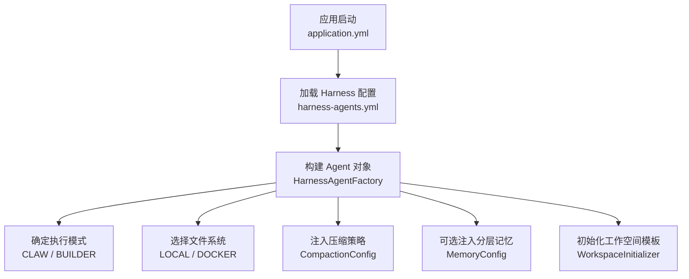
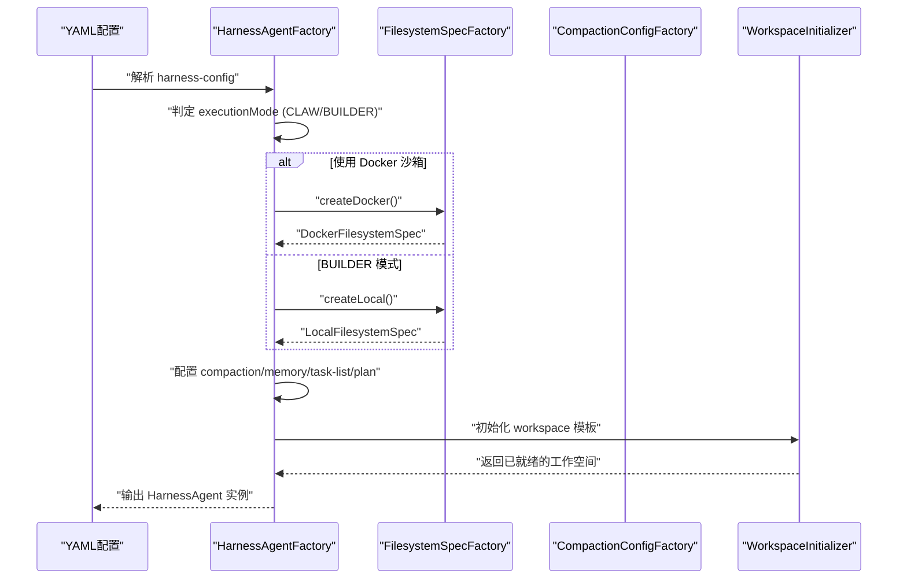
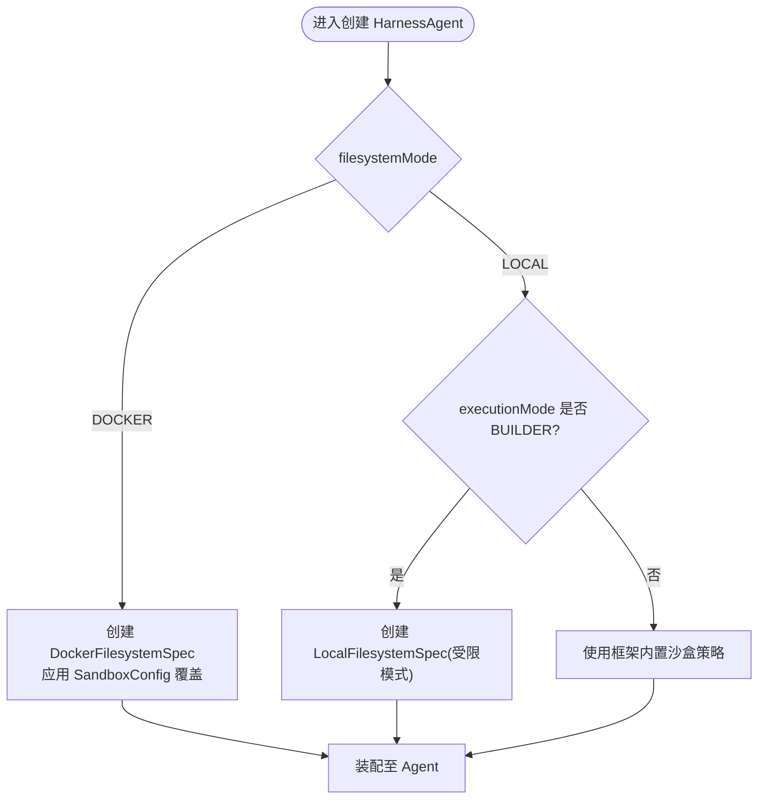
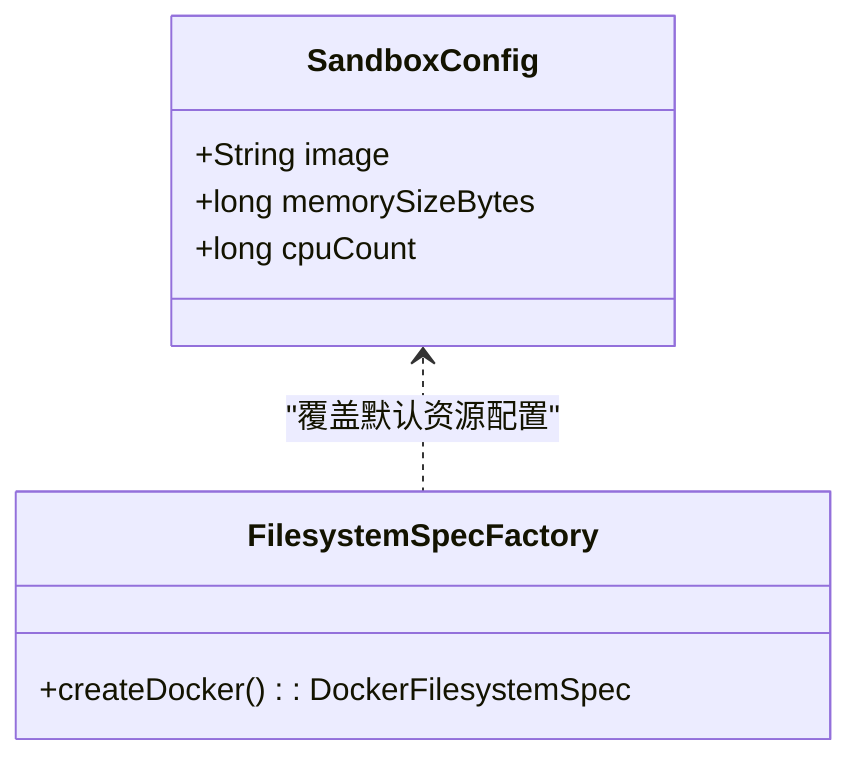
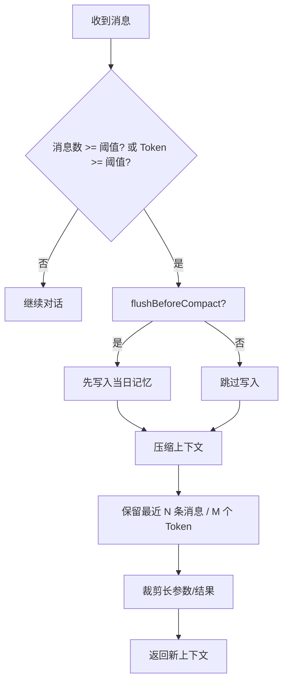
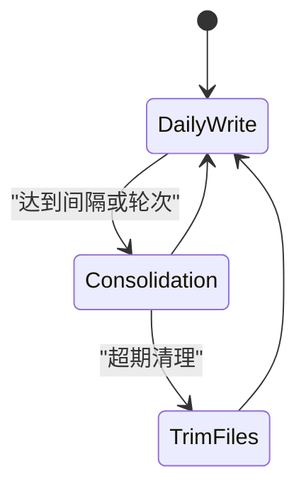
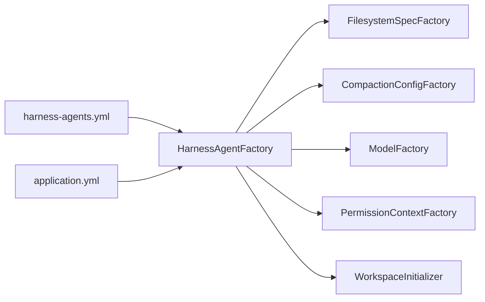

# Harness 高级配置

<cite>
**本文档引用的文件**
- [HarnessConfig.java](file://src/main/java/com/skloda/agentscope/agent/HarnessConfig.java)
- [HarnessAgentFactory.java](file://src/main/java/com/skloda/agentscope/harness/HarnessAgentFactory.java)
- [FilesystemSpecFactory.java](file://src/main/java/com/skloda/agentscope/harness/FilesystemSpecFactory.java)
- [CompactionConfigFactory.java](file://src/main/java/com/skloda/agentscope/harness/CompactionConfigFactory.java)
- [WorkspaceInitializer.java](file://src/main/java/com/skloda/agentscope/harness/WorkspaceInitializer.java)
- [harness-agents.yml](file://src/main/resources/config/harness-agents.yml)
- [application.yml](file://src/main/resources/application.yml)
</cite>

## 更新摘要
**变更内容**
- 更新了模型配置部分，反映所有Harness Agent现在统一使用deepseek-v4.1-flash模型
- 更新了harness-agents.yml配置文件示例，展示最新的模型配置
- 增强了多环境部署配置中的模型选择建议

## 目录
1. [简介](#简介)
2. [项目结构](#项目结构)
3. [核心组件](#核心组件)
4. [架构总览](#架构总览)
5. [详细组件分析](#详细组件分析)
6. [依赖关系分析](#依赖关系分析)
7. [性能考虑](#性能考虑)
8. [故障排查指南](#故障排查指南)
9. [结论](#结论)
10. [附录：多环境部署配置示例与最佳实践](#附录多环境部署配置示例与最佳实践)

## 简介
本文面向使用 Harness 的高级用户，聚焦 harnessConfig 的关键配置与运行机制，帮助你在本地开发与容器沙箱环境间无缝切换，合理配置消息压缩、记忆分层、任务执行模式及资源限制。

## 项目结构
Harness 高级配置由以下代码和配置文件共同构成：
- 配置数据类：定义工作空间、文件系统模式、执行模式、隔离范围、压缩、沙箱、计划、记忆和技能自学习等能力开关与参数
- 工厂与服务：根据配置构建 HarnessAgent，装配文件系统（Local/Docker）、压缩策略、记忆系统等
- 模板初始化：启动时从 classpath 拷贝预设的 AGENTS/knowledge/skills 到 workspace
- 配置文件：yml 中按 Agent 维度声明 harnessConfig 的具体值，应用级全局参数在 application.yml

图表来源
- [application.yml:26-88](file://src/main/resources/application.yml#L26-L88)
- [harness-agents.yml:1-123](file://src/main/resources/config/harness-agents.yml#L1-L123)

章节来源
- [HarnessConfig.java:11-153](file://src/main/java/com/skloda/agentscope/agent/HarnessConfig.java#L11-L153)
- [HarnessAgentFactory.java:42-276](file://src/main/java/com/skloda/agentscope/harness/HarnessAgentFactory.java#L42-L276)
- [FilesystemSpecFactory.java:17-48](file://src/main/java/com/skloda/agentscope/harness/FilesystemSpecFactory.java#L17-L48)
- [CompactionConfigFactory.java:11-48](file://src/main/java/com/skloda/agentscope/harness/CompactionConfigFactory.java#L11-L48)
- [WorkspaceInitializer.java:18-28](file://src/main/java/com/skloda/agentscope/harness/WorkspaceInitializer.java#L18-L28)

## 核心组件
- 工作空间路径 workspace：每个 Harness Agent 的独立存储根目录。支持环境变量占位符（例如 ${user.home}/...），用于区分不同 agent 的数据与产物
- 文件系统模式 filesystemMode：
  - LOCAL：本地文件系统（默认），BUILDER 模式下使用框架内置的 LocalFilesystemSpec，可结合命名空间实现多用户隔离；Claw 模式下同样可使用 Local 文件系统以配合沙盒工具
  - DOCKER：Docker 沙箱模式，使用 DockerFilesystemSpec 在容器中执行工具，具备更强的隔离性与一致运行环境
- 执行模式 executionMode：
  - CLAW：简单快速的任务执行模式，适合脚本化、一次性或轻量任务
  - BUILDER：面向开发调试与复杂工作流，支持计划模式、任务清单、更丰富的本地文件操作体验
- 隔离范围 isolationScope：用于 BUILDER 模式下的多用户命名空间隔离控制（具体行为依赖框架实现）
- 压缩策略 CompactionConfig：按消息数/Token 阈值触发上下文压缩，减少长对话的 Token 消耗
- 分层记忆 MemoryConfig：三层记忆机制——每次对话"每日写入"、"节流合并"为长期记忆，支持模型选择、合并上限、保留周期等
- 沙箱资源限制 SandboxConfig：镜像、内存、CPU 数量以及通过工厂预置的环境变量与快照策略
- **模型配置**：所有 Harness Agent 现在统一使用 deepseek-v4.1-flash 模型，提供稳定的推理性能和成本效益

章节来源
- [HarnessConfig.java:13-39, 50-69, 93-106, 117-131:13-39](file://src/main/java/com/skloda/agentscope/agent/HarnessConfig.java#L13-L39)
- [HarnessAgentFactory.java:42-103, 105-118:42-103](file://src/main/java/com/skloda/agentscope/harness/HarnessAgentFactory.java#L42-L103)
- [FilesystemSpecFactory.java:17-48](file://src/main/java/com/skloda/agentscope/harness/FilesystemSpecFactory.java#L17-L48)
- [CompactionConfigFactory.java:11-48](file://src/main/java/com/skloda/agentscope/harness/CompactionConfigFactory.java#L11-L48)
- [harness-agents.yml:8, 59, 99](file://src/main/resources/config/harness-agents.yml#L8)

## 架构总览
下图展示 HarnessAgentFactory 基于 harnessConfig 构建 Agent 并装配能力的关键流程：

图表来源
- [HarnessAgentFactory.java:42-141](file://src/main/java/com/skloda/agentscope/harness/HarnessAgentFactory.java#L42-L141)
- [FilesystemSpecFactory.java:17-48](file://src/main/java/com/skloda/agentscope/harness/FilesystemSpecFactory.java#L17-L48)
- [WorkspaceInitializer.java:18-28](file://src/main/java/com/skloda/agentscope/harness/WorkspaceInitializer.java#L18-L28)

## 详细组件分析

### workSpace 工作空间路径配置与管理策略
- 作用：作为每个 Agent 的持久化根目录，存放 AGENTS.md、skills、knowledge、会话日志、生成文件等
- 支持环境变量扩展，便于按 host 或用户目录隔离（如 ~/.agentscope/<agentId>）
- 初始化流程：
  - 启动时由 WorkspaceInitializer 基于 classpath 中的 harness-templates 复制模板至 workspace
  - subagents 的工作空间位于父 workspace 的同级子目录下，也会被初始化
- 管理建议：
  - 生产环境建议使用挂载目录或统一存储后端，避免被清理策略误删
  - 结合 BUILDER 模式的命名空间隔离，可将不同用户的 workspace 物理分离
  - 定期归档/轮转历史目录，避免磁盘增长不可控

章节来源
- [HarnessAgentFactory.java:56-66](file://src/main/java/com/skloda/agentscope/harness/HarnessAgentFactory.java#L56-L66)
- [WorkspaceInitializer.java:18-52](file://src/main/java/com/skloda/agentscope/harness/WorkspaceInitializer.java#L18-L52)
- [harness-agents.yml:11-14, 62-65:11-14](file://src/main/resources/config/harness-agents.yml#L11-L14)

### filesystemMode 的 LOCAL 与 DOCKER 区别与应用场景
- LOCAL 模式
  - 在主机文件系统上读写，适合本地开发与调试，IO 速度快
  - 支持受限与不受限两种策略（受限于工厂预设的超时与输出大小等限制）
  - 在 BUILDER 模式下，结合框架命名空间实现多用户隔离（基于用户 ID）
  - 适用场景：交互式开发、快速原型、批量数据处理
- DOCKER 模式
  - 在 Docker 容器内运行工具与脚本，获得一致的运行环境与更强隔离性
  - 可通过 SandboxConfig 覆盖镜像、内存、CPU 等资源限制与环境变量
  - 适用场景：需要稳定第三方依赖、安全隔离、跨平台一致性执行的任务

图表来源
- [HarnessAgentFactory.java:81-103](file://src/main/java/com/skloda/agentscope/harness/HarnessAgentFactory.java#L81-L103)
- [FilesystemSpecFactory.java:17-48](file://src/main/java/com/skloda/agentscope/harness/FilesystemSpecFactory.java#L17-L48)

章节来源
- [HarnessAgentFactory.java:81-103](file://src/main/java/com/skloda/agentscope/harness/HarnessAgentFactory.java#L81-L103)
- [FilesystemSpecFactory.java:17-48](file://src/main/java/com/skloda/agentscope/harness/FilesystemSpecFactory.java#L17-L48)
- [HarnessConfig.java:44-46](file://src/main/java/com/skloda/agentscope/agent/HarnessConfig.java#L44-L46)

### executionMode 的 CLAW 与 BUILDER
- CLAW 模式
  - 侧重"即拿即用"的快速执行，适合单步或少步骤任务、批处理脚本调用
  - 配合压缩策略即可有效控制上下文长度，降低 Token 消耗
- BUILDER 模式
  - 针对复杂开发与调试场景优化：更易读的文件系统交互、计划模式、任务列表等
  - 支持通过运行时覆盖 executionMode，灵活决定实例构造
  - 适合长时间对话、多阶段任务、需要分步确认与计划编排的流程

章节来源
- [HarnessAgentFactory.java:42-54, 121-141:42-54](file://src/main/java/com/skloda/agentscope/harness/HarnessAgentFactory.java#L42-L54)
- [HarnessConfig.java:15, 40-46:15-15](file://src/main/java/com/skloda/agentscope/agent/HarnessConfig.java#L15-L15)
- [harness-agents.yml:12-15, 62-65:12-15](file://src/main/resources/config/harness-agents.yml#L12-L15)

### sandbox 资源限制配置（仅 DOCKER 模式）
- image：容器基础镜像，默认 python:3.11-slim，可在 SandboxConfig.image 覆盖
- memorySizeBytes：容器可用内存，工厂默认 2GB，支持自定义
- cpuCount：分配 CPU 数量，工厂默认 2，支持自定义
- 环境变量：工厂设置 PYTHONUNBUFFERED=1 与时区 Asia/Shanghai，保证日志与时间一致性
- 快照策略：使用 NoopSnapshotSpec（不启用快照），可根据业务需求替换

图表来源
- [HarnessConfig.java:65-69](file://src/main/java/com/skloda/agentscope/agent/HarnessConfig.java#L65-L69)
- [FilesystemSpecFactory.java:34-48](file://src/main/java/com/skloda/agentscope/harness/FilesystemSpecFactory.java#L34-L48)

章节来源
- [HarnessAgentFactory.java:83-99](file://src/main/java/com/skloda/agentscope/harness/HarnessAgentFactory.java#L83-L99)
- [FilesystemSpecFactory.java:34-48](file://src/main/java/com/skloda/agentscope/harness/FilesystemSpecFactory.java#L34-L48)
- [HarnessConfig.java:65-69](file://src/main/java/com/skloda/agentscope/agent/HarnessConfig.java#L65-L69)

### CompactionConfig 压缩策略
- 触发条件：
  - triggerMessages：达到该消息数后尝试压缩
  - 同时存在 triggerTokens（工厂默认），当对话过长时会优先考虑 Token 维度
- 保留消息：
  - keepMessages/keepTokens：压缩后保留的最短历史记录，以保证上下文连贯性
- 压缩时机：
  - flushBeforeCompact：是否在压缩前先执行当日"每日写"，将新事实下沉到记忆文件，再压缩
  - offloadBeforeCompact：必要时将内容下推至文件以降低显式上下文
- 参数裁剪：
  - truncateArgs：对工具输入等长文本做最大长度裁剪与提示标记，防止过长参数污染上下文
- 工具结果限长：
  - maxResultChars：工具执行返回的字符串最大保留长度
  - previewChars：超长结果的前缀预览长度

图表来源
- [HarnessAgentFactory.java:105-118](file://src/main/java/com/skloda/agentscope/harness/HarnessAgentFactory.java#L105-L118)
- [CompactionConfigFactory.java:11-48](file://src/main/java/com/skloda/agentscope/harness/CompactionConfigFactory.java#L11-L48)

章节来源
- [HarnessAgentFactory.java:105-118](file://src/main/java/com/skloda/agentscope/harness/HarnessAgentFactory.java#L105-L118)
- [CompactionConfigFactory.java:11-48](file://src/main/java/com/skloda/agentscope/harness/CompactionConfigFactory.java#L11-L48)
- [harness-agents.yml:30-33](file://src/main/resources/config/harness-agents.yml#L30-L33)

### MemoryConfig 分层记忆系统
- 每日写（Per-turn flush）：
  - 每轮将提取出的事实追加到 daily/<日期>.md，便于后续合并与溯源
  - 触发策略：ALWAYS（默认）、THROTTLED（间隔时间合并）、NEVER（关闭）
- 节流合并（Consolidation）：
  - THROTTLED 模式下，按 consolidationMinGapSeconds（默认 1800s）进行周期性合并
  - consolidationMaxTokens 控制合并后的总 token 上限
- 长期记忆：
  - 合并后的摘要保存至 MEMORY.md，形成可检索的稳定知识
- 保留策略：
  - dailyFileRetentionDays：日常文件的保留天数
  - sessionRetentionDays：会话树的保留天数
- 模型选择：
  - model：指定用于 flush 与合并的 LLM 名称；为空时使用 Agent 主模型

图表来源
- [HarnessConfig.java:93-106](file://src/main/java/com/skloda/agentscope/agent/HarnessConfig.java#L93-L106)
- [HarnessAgentFactory.java:143-181](file://src/main/java/com/skloda/agentscope/harness/HarnessAgentFactory.java#L143-L181)

章节来源
- [HarnessConfig.java:93-106](file://src/main/java/com/skloda/agentscope/agent/HarnessConfig.java#L93-L106)
- [HarnessAgentFactory.java:143-181](file://src/main/java/com/skloda/agentscope/harness/HarnessAgentFactory.java#L143-L181)

### 模型配置更新
**重要更新**：所有 Harness Agent 现已统一使用 deepseek-v4.1-flash 模型，这一变更提供了以下优势：

- **统一的推理性能**：所有 Harness Agent 共享相同的模型配置，确保一致的响应速度和准确性
- **成本优化**：deepseek-v4.1-flash 模型在保持高质量输出的同时降低了 API 调用成本
- **简化配置管理**：减少了模型配置的复杂性，便于维护和升级
- **标准化部署**：统一的模型选择有利于在多环境中保持一致的行为

当前配置示例：
- complaint-reviewer: modelName: deepseek-v4.1-flash
- finance-intel-tracker: modelName: deepseek-v4.1-flash  
- sandbox-artifact-demo: modelName: deepseek-v4.1-flash

章节来源
- [harness-agents.yml:8, 59, 99](file://src/main/resources/config/harness-agents.yml#L8)
- [application.yml:36](file://src/main/resources/application.yml#L36)

## 依赖关系分析
- HarnessAgentFactory 依赖：
  - FilesystemSpecFactory：提供 Local/Docker 文件系统抽象
  - CompactionConfigFactory：提供压缩与工具结果剔除的配置
  - ModelFactory：统一模型接入（DashScope）
  - PermissionContextFactory：权限上下文
- WorkspaceInitializer 依赖：
  - classpath 下的 harness-templates 资源，作为 Agent/子 Agent 的初始骨架
- 配置驱动：
  - harness-agents.yml 定义 per-agent 的 harnessConfig
  - application.yml 提供全局默认（模型、session、MCP、RAG 等）

图表来源
- [HarnessAgentFactory.java:27-40](file://src/main/java/com/skloda/agentscope/harness/HarnessAgentFactory.java#L27-L40)
- [FilesystemSpecFactory.java:17-48](file://src/main/java/com/skloda/agentscope/harness/FilesystemSpecFactory.java#L17-L48)
- [CompactionConfigFactory.java:11-48](file://src/main/java/com/skloda/agentscope/harness/CompactionConfigFactory.java#L11-L48)
- [workspace_initializer 引用模板:18-52](file://src/main/java/com/skloda/agentscope/harness/WorkspaceInitializer.java#L18-L52)

章节来源
- [HarnessAgentFactory.java:27-40](file://src/main/java/com/skloda/agentscope/harness/HarnessAgentFactory.java#L27-L40)
- [FilesystemSpecFactory.java:17-48](file://src/main/java/com/skloda/agentscope/harness/FilesystemSpecFactory.java#L17-L48)
- [CompactionConfigFactory.java:11-48](file://src/main/java/com/skloda/agentscope/harness/CompactionConfigFactory.java#L11-L48)

## 性能考虑
- 上下文压缩
  - 在高并发或长对话场景下，适当降低 triggerMessages/triggerTokens，可减少一次压缩的成本
  - 合理设置 keepMessages/keepTokens，避免因过度截断影响回复质量
- 工具结果限制
  - 调小 maxResultChars 与 previewChars，可减少上下文膨胀，尤其对大输出工具友好
- 沙箱资源
  - DOCKER 模式下根据任务特征调节 memorySizeBytes 与 cpuCount
  - 频繁短任务建议适当提高 CPU 数量以降低排队等待
- 记忆合并间隔
  - THROTTLED 合并间隔越大，I/O 压力越低；但可能导致短期重复信息较多
- 工作空间
  - 定期归档旧 workspace，或使用外部存储卷持久化，避免频繁 GC 与磁盘碎片
- **模型性能**
  - deepseek-v4.1-flash 模型提供了良好的性能价格比，适合大多数 Harness Agent 场景
  - 对于需要更高推理能力的特殊场景，可以考虑切换到更强大的模型

## 故障排查指南
- workspace 路径无效或无权限
  - 检查工作空间路径是否存在，确保进程有写入权限
  - 首次启动会在 workspace 内创建模板目录；若失败会记录相应日志
- 压缩未触发或触发过频
  - 核对 config 中的 triggerMessages/triggerTokens 与实际对话长度是否匹配
  - 查看日志确认 flushBeforeCompact 行为
- 工具结果过长导致卡顿
  - 调整 ToolResultEvictionConfig 的 maxResultChars/previewChars 以控制上下文长度
- Docker 模式异常
  - 检查镜像可达性、内存/CPU 限制是否满足
  - 确认环境变量配置符合预期（时区、缓冲等）
- **模型相关问题**
  - 确认 DASHSCOPE_API_KEY 环境变量正确配置
  - 检查 deepseek-v4.1-flash 模型的可用性
  - 验证 DashScope 服务连接状态

章节来源
- [CompactionConfigFactory.java:11-48](file://src/main/java/com/skloda/agentscope/harness/CompactionConfigFactory.java#L11-L48)
- [WorkspaceInitializer.java:18-52](file://src/main/java/com/skloda/agentscope/harness/WorkspaceInitializer.java#L18-L52)
- [FilesystemSpecFactory.java:34-48](file://src/main/java/com/skloda/agentscope/harness/FilesystemSpecFactory.java#L34-L48)
- [application.yml:32-42](file://src/main/resources/application.yml#L32-L42)

## 结论
Harness 高级配置通过工作空间、执行模式、文件系统、压缩与记忆等多维度的组合，既满足了简单任务的快速交付，也支撑了复杂开发调试与团队协作。随着所有 Harness Agent 统一采用 deepseek-v4.1-flash 模型，系统在保持高性能的同时实现了更好的成本控制和配置简化。建议在本地优先使用 LOCAL+BUILDER 进行联调，在生产或需要强隔离的场景切换到 DOCKER 模式，并根据负载调整压缩与记忆策略，平衡响应时间与成本。

## 附录：多环境部署配置示例与最佳实践

- 开发环境（BUILDER + LOCAL）
  - 目标：快速迭代、易调试、文件直读直写
  - 建议：
    - executionMode=BUILDER，filesystemMode=LOCAL
    - 开启 plan 与 task list，提升复杂度任务的可见性
    - 将 workspace 指向当前用户目录，便于共享与版本化跟踪
    - 使用 deepseek-v4.1-flash 模型以获得稳定的开发体验
  - 参考配置项：
    - 在 harness-agents.yml 中为对应 Agent 配置 harnessConfig 各字段

- 测试/集成环境（CLAW + LOCAL）
  - 目标：批量任务、稳定回归、快速吞吐
  - 建议：
    - executionMode=CLAW，filesystemMode=LOCAL
    - 适度收紧上下文压缩阈值，避免长会话导致的开销
    - 控制 ToolResultEviction 上限，降低单次请求的 Token 占用
    - deepseek-v4.1-flash 模型提供良好的性价比

- 生产环境（DOCKER）
  - 目标：强隔离、可观测、资源可控
  - 建议：
    - filesystemMode=DOCKER，image 固定版本以保障一致性
    - memorySizeBytes/cpuCount 按典型工作负载压测设定
    - 结合日志、监控与链路追踪观察任务耗时与错误率
    - deepseek-v4.1-flash 模型在生产环境中表现稳定且成本可控

- 多租户隔离（BUILDER + 命名空间）
  - 建议通过 isolationScope 与运行时 userId 实现用户级别工作空间隔离
  - 配合权限上下文限制危险工具调用
  - 所有租户共享 deepseek-v4.1-flash 模型以确保一致性

- 最佳实践
  - 将模板工程化：按 Agent 分类维护 harness-templates，确保新项目开箱即用
  - 分级配置：application.yml 放全局默认，harness-agents.yml 细化到 Agent
  - 持续审计 workspace：制定归档与清理策略，防止磁盘爆满
  - 关注压缩与记忆：在长对话中，优先调优压缩策略，其次再放大模型或资源
  - **模型管理**：统一使用 deepseek-v4.1-flash 模型，如需特殊场景可单独配置更强大的模型

章节来源
- [harness-agents.yml:11-15, 62-66:11-15](file://src/main/resources/config/harness-agents.yml#L11-L15)
- [application.yml:26-88](file://src/main/resources/application.yml#L26-L88)
- [HarnessConfig.java:13-39, 50-69, 93-106:13-39](file://src/main/java/com/skloda/agentscope/agent/HarnessConfig.java#L13-L39)