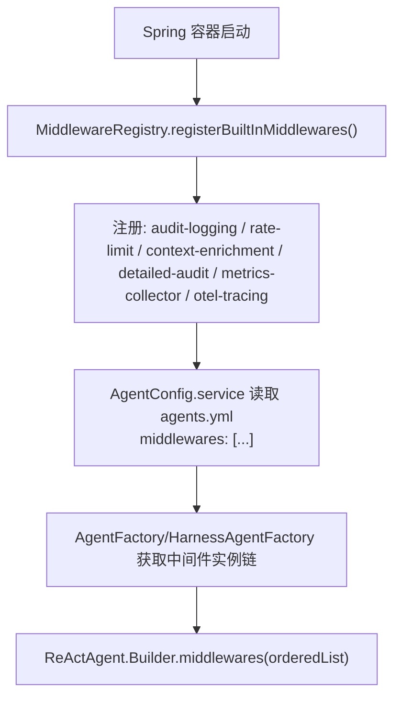
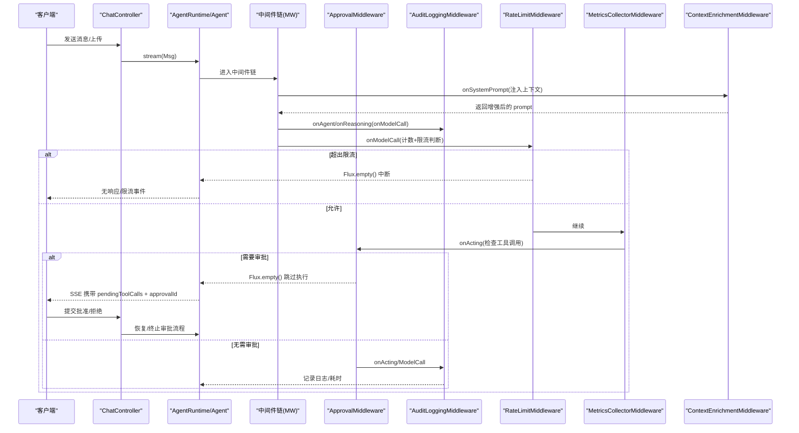
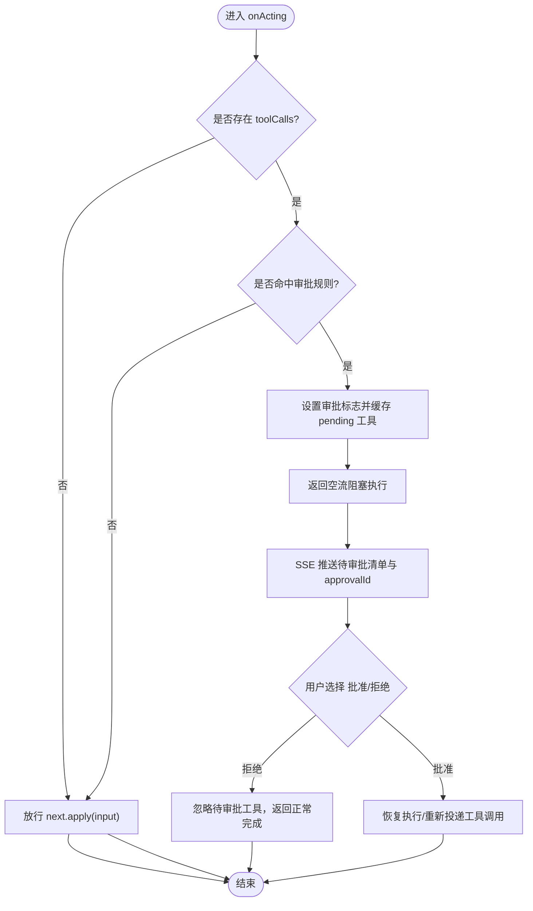
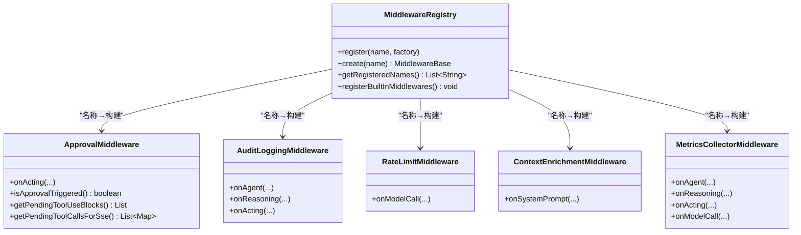

# 中间件系统配置

<cite>
**本文引用的文件**
- [MiddlewareRegistry.java](file://src/main/java/com/skloda/agentscope/middleware/MiddlewareRegistry.java)
- [ApprovalMiddleware.java](file://src/main/java/com/skloda/agentscope/middleware/ApprovalMiddleware.java)
- [AuditLoggingMiddleware.java](file://src/main/java/com/skloda/agentscope/middleware/AuditLoggingMiddleware.java)
- [RateLimitMiddleware.java](file://src/main/java/com/skloda/agentscope/middleware/RateLimitMiddleware.java)
- [ContextEnrichmentMiddleware.java](file://src/main/java/com/skloda/agentscope/middleware/ContextEnrichmentMiddleware.java)
- [MetricsCollectorMiddleware.java](file://src/main/java/com/skloda/agentscope/middleware/MetricsCollectorMiddleware.java)
- [ApprovalService.java](file://src/main/java/com/skloda/agentscope/service/ApprovalService.java)
- [agent 配置（agents.yml）](file://src/main/resources/config/agents.yml)
- [应用配置（application.yml）](file://src/main/resources/application.yml)
- [ChatController.java](file://src/main/java/com/skloda/agentscope/controller/ChatController.java)
</cite>

## 目录
1. [简介](#简介)
2. [项目结构与注册机制](#项目结构与注册机制)
3. [核心组件分析](#核心组件分析)
4. [架构概览](#架构概览)
5. [详细组件分析与配置](#详细组件分析与配置)
6. [依赖与执行顺序](#依赖与执行顺序)
7. [性能考量](#性能考量)
8. [故障排查](#故障排查)
9. [结论](#结论)
10. [附录：复杂场景配置示例](#附录复杂场景配置示例)

## 简介
本文件系统化说明 AgentScope 2.0 中间件系统在该项目中的配置、注册与执行流程，覆盖以下重点：
- middlewares 列表的注册位置、执行顺序机制与如何组合多层防护
- 审批中间件 ApprovalMiddleware 的规则定义、状态管理与结果处理
- 审计日志中间件的配置项、输出目标与敏感信息脱敏策略
- 限流中间件的请求频率限制、窗口大小与策略
- 结合审批、审计、限流的复合配置方案，形成“合规+可观测+稳定”的多层防护体系

[本节为概念性说明，不直接引用具体文件]

## 项目结构与注册机制
中间件系统由名称到构建器的注册表组成，Spring 启动时将内置中间件自动注册，供 Agent 装配时按名称解析并依次执行。

- 注册中心 MiddlewareRegistry
  - 通过 @PostConstruct 自动注册一组内置中间件名称
  - 暴露 register()/create() 用于外部扩展注册
  - 提供 getRegisteredNames() 暴露已注册列表，便于前端或诊断工具展示
- 名称与类型映射
  - audit-logging → AuditLoggingMiddleware
  - rate-limit → RateLimitMiddleware
  - context-enrichment → ContextEnrichmentMiddleware
  - detailed-audit → DetailedAuditMiddleware（不在本次读取范围内）
  - metrics-collector → MetricsCollectorMiddleware
  - otel-tracing → OtelTracingMiddleware（来自核心库）
- Agent 侧的配置入口
  - agents.yml 中每个 Agent 可声明 middlewares 名称列表
  - Agent 构建阶段会从 Registry 解析中间件并按顺序注入到 ReActAgent.Builder.middlewares()

图表来源
- [MiddlewareRegistry.java:23-41](file://src/main/java/com/skloda/agentscope/middleware/MiddlewareRegistry.java#L23-L41)
- [agents.yml:1764-1770](file://src/main/resources/config/agents.yml#L1764-L1770)

章节来源
- [MiddlewareRegistry.java:18-55](file://src/main/java/com/skloda/agentscope/middleware/MiddlewareRegistry.java#L18-L55)
- [agents.yml:1764-1770](file://src/main/resources/config/agents.yml#L1764-L1770)

## 核心组件分析
- 审计日志中间件：拦截 Agent/Reasoning/Acting 阶段，记录起止耗时与关键参数摘要
- 限流中间件：在模型调用阶段按时间窗口统计次数，超过阈值则拒绝
- 上下文增强中间件：在系统提示词前注入时间等上下文，便于可观测性与业务提示
- 指标收集中间件：汇总工具调用耗时、模型令牌用量与错误率等全局指标
- 审批中间件：在工具调用前根据规则判定是否需要人审；若需审批，暂停执行并将待审批工具清单以结构化数据发回前端

章节来源
- [AuditLoggingMiddleware.java:19-68](file://src/main/java/com/skloda/agentscope/middleware/AuditLoggingMiddleware.java#L19-L68)
- [RateLimitMiddleware.java:31-52](file://src/main/java/com/skloda/agentscope/middleware/RateLimitMiddleware.java#L31-L52)
- [ContextEnrichmentMiddleware.java:18-27](file://src/main/java/com/skloda/agentscope/middleware/ContextEnrichmentMiddleware.java#L18-L27)
- [MetricsCollectorMiddleware.java:50-161](file://src/main/java/com/skloda/agentscope/middleware/MetricsCollectorMiddleware.java#L50-L161)
- [ApprovalMiddleware.java:42-124](file://src/main/java/com/skloda/agentscope/middleware/ApprovalMiddleware.java#L42-L124)

## 架构概览
下图展示了用户请求进入 Chat 控制器后，事件流通过中间件链的处理路径与审批流程的回传交互。

图表来源
- [AuditLoggingMiddleware.java:19-68](file://src/main/java/com/skloda/agentscope/middleware/AuditLoggingMiddleware.java#L19-L68)
- [RateLimitMiddleware.java:31-52](file://src/main/java/com/skloda/agentscope/middleware/RateLimitMiddleware.java#L31-L52)
- [ApprovalMiddleware.java:58-124](file://src/main/java/com/skloda/agentscope/middleware/ApprovalMiddleware.java#L58-L124)
- [MetricsCollectorMiddleware.java:50-161](file://src/main/java/com/skloda/agentscope/middleware/MetricsCollectorMiddleware.java#L50-L161)
- [ContextEnrichmentMiddleware.java:18-27](file://src/main/java/com/skloda/agentscope/middleware/ContextEnrichmentMiddleware.java#L18-L27)

## 详细组件分析与配置

### 1) 中间件注册与执行顺序
- 注册来源
  - 默认通过 Spring 注解触发自动注册
  - 可通过自定义 Supplier 进一步扩展注册
- 执行顺序
  - 由 Agent 配置的 middlewares 名称顺序决定
  - 同名中间件重复出现将导致多次实例化与执行
  - 建议在单个 Agent 中明确限定需要的中间件集合，避免全量接入影响性能

建议最佳实践
- 仅在特定 Agent（如高风险操作 Agent）开启审批与限流
- 通用日志与上下文增强可在大多数 Agent 启用
- 指标采集对性能有一定影响，可按环境开关或在调试模式下使用

章节来源
- [MiddlewareRegistry.java:23-55](file://src/main/java/com/skloda/agentscope/middleware/MiddlewareRegistry.java#L23-L55)
- [agents.yml:1764-1770](file://src/main/resources/config/agents.yml#L1764-L1770)

### 2) 审批中间件 ApprovalMiddleware
功能要点
- 触发条件
  - 当 agent 配置了 requiredApproval=true 或指定了 approvalTools 列表时，若即将调用的工具属于命中范围，则触发审批
- 阻断行为
  - 命中时，直接返回空流以跳过工具执行，同时保存待执行工具清单
- 前端交互
  - 将通过 SSE 将待审批的工具清单（id、name、input、inputParams 等）回推给前端，附带 approvalId
- 结果处理
  - 后端存在 ApprovalService 缓存 PendingApproval（含 agent、hook、pendingToolCalls、创建时间），并提供清理过期条目的定时任务
  - 前端提交批准后，由上层服务（例如 ChatController 及相关处理逻辑）恢复执行或丢弃

关键配置字段（位于 agents.yml 对应 Agent 条目）
- approval-required: true/false，控制是否对所有工具调用都进行审批
- approval-tools: 字符串列表，仅对列出的工具名进行审批

审批流程图

图表来源
- [ApprovalMiddleware.java:58-124](file://src/main/java/com/skloda/agentscope/middleware/ApprovalMiddleware.java#L58-L124)
- [ApprovalService.java:21-76](file://src/main/java/com/skloda/agentscope/service/ApprovalService.java#L21-L76)

章节来源
- [ApprovalMiddleware.java:42-124](file://src/main/java/com/skloda/agentscope/middleware/ApprovalMiddleware.java#L42-L124)
- [ApprovalService.java:21-76](file://src/main/java/com/skloda/agentscope/service/ApprovalService.java#L21-L76)
- [agents.yml:158-160](file://src/main/resources/config/agents.yml#L158-L160)

### 3) 审计日志中间件 AuditLoggingMiddleware
- 输出目标
  - 控制台 System.out
  - 基于 SLF4J 的 log.info/error
- 记录时机
  - onAgent：Agent 生命周期起始与结束，累计耗时
  - onReasoning：推理阶段开始/结束及耗时
  - onActing：工具调用入参摘要打印与工具执行耗时
- 敏感信息脱敏策略
  - 对工具输入采用 toString() 后截断展示（默认最长 80 字符），避免长 JSON/敏感内容完整落盘
  - 未实现字段级去标识化或过滤策略

可调优点
- 调整日志级别（INFO/DEBUG/WARN/ERROR）
- 如需细粒度脱敏，建议替换或扩展该中间件，增加键白名单/黑名单或掩码器

章节来源
- [AuditLoggingMiddleware.java:19-68](file://src/main/java/com/skloda/agentscope/middleware/AuditLoggingMiddleware.java#L19-L68)
- [application.yml:81-90](file://src/main/resources/application.yml#L81-L90)

### 4) 限流中间件 RateLimitMiddleware
- 限制维度
  - 按模型调用 onModelCall 进行限流计数
- 窗口策略
  - 固定滑动窗口：过去 60 秒内最大调用次数
  - 超出阈值时返回空流阻止后续执行
- 默认上限
  - 默认构造函数设定每分钟最大次数
- 可配项
  - max-calls-per-minute：可通过构造参数传入（当前未提供统一配置绑定）

注意
- 限流发生在模型调用处，不影响纯本地工具链；但多数工具最终会触发模型决策或返回，整体仍受控
- 高并发场景下建议使用更严格的限流策略或分布式限流实现

章节来源
- [RateLimitMiddleware.java:16-53](file://src/main/java/com/skloda/agentscope/middleware/RateLimitMiddleware.java#L16-L53)

### 5) 其他常用中间件
- 上下文增强 ContextEnrichmentMiddleware
  - 在系统提示词注入时间与用户身份占位，便于定位调用时间点
- 指标收集 MetricsCollectorMiddleware
  - 记录 Agent/工具调用耗时、错误次数、令牌用量与预估成本
  - 输出至控制台与专用 METRICS logger
  - 可用于性能分析/容量规划

章节来源
- [ContextEnrichmentMiddleware.java:18-27](file://src/main/java/com/skloda/agentscope/middleware/ContextEnrichmentMiddleware.java#L18-L27)
- [MetricsCollectorMiddleware.java:21-161](file://src/main/java/com/skloda/agentsope/middleware/MetricsCollectorMiddleware.java#L21-L161)

## 依赖与执行顺序
- 注册阶段
  - Spring 启动后 MiddlewareRegistry 集中注册所有内置中间件
- 装配阶段
  - agents.yml 的每个 Agent 声明 middlewares 名称列表，按顺序解析构建实例链
- 运行阶段
  - 事件流按声明顺序依次经过 each middleware 的 onXXX 钩子
  - 若任一中间件返回空流或短路，后续中间件不再执行
- 典型顺序
  - 推荐先做上下文增强和审计，再做限流与审批，确保日志与度量准确且尽早拦截异常流量

图示

图表来源
- [MiddlewareRegistry.java:18-55](file://src/main/java/com/skloda/agentscope/middleware/MiddlewareRegistry.java#L18-L55)

## 性能考量
- 审计日志频繁 IO：建议生产环境仅保留必要等级，或使用异步写入/采样
- 指标收集聚合：内存计数器在高 QPS 下会有锁竞争，建议按进程隔离或使用外部指标系统
- 限流：基于本地内存的滑动窗口，适合单机；多实例部署应配合网关/Redis 分布式限流
- 审批：命中时立即阻断工具执行，可降低不必要成本；但过多审批会导致用户体验下降，需合理配置阈值

## 故障排查
常见问题与处理
- 中间件不生效
  - 检查 agents.yml 中对应的 Agent 是否正确列出中间件名称
  - 确认名称与 MiddlewareRegistry 注册一致
- 审批一直触发但不显示 UI
  - 确认上游服务将 pendingToolCalls 序列化为 SSE 字段
  - 校验 frontend 渲染逻辑包含 approval-tools 容器与动作按钮
- 限流过于频繁
  - 调整中间件默认上限（当前默认值较小）
  - 结合业务特征优化窗口长度与阈值
- 审计日志缺失关键信息
  - 调整日志级别并核对 onXXX 钩子链
  - 针对工具入参与输出进行选择性脱敏/格式化

章节来源
- [AuditLoggingMiddleware.java:19-68](file://src/main/java/com/skloda/agentscope/middleware/AuditLoggingMiddleware.java#L19-L68)
- [RateLimitMiddleware.java:31-52](file://src/main/java/com/skloda/agentscope/middleware/RateLimitMiddleware.java#L31-L52)
- [ApprovalMiddleware.java:58-124](file://src/main/java/com/skloda/agentscope/middleware/ApprovalMiddleware.java#L58-L124)

## 结论
本项目实现了以名称驱动、顺序执行的中间件管线，覆盖审计、限流、审批、指标与上下文增强等常见横切关注点。通过 agents.yml 的 middlewares 列表即可灵活组装不同 Agent 的安全与可观测能力。结合 ApprovalService 提供的暂存与清理机制，实现了人机协同的高风险操作把关。生产中建议按环境与 Agent 敏感度精细配置中间件组合，平衡安全性、可观测性与性能。

[本节为总结性描述，不直接引用具体文件]

## 附录：复杂场景配置示例
以下以“审批+审计+限流+上下文增强+指标采集”的多层防护为目标，给出一个可直接复用的 agents.yml 片段模板（字段含义参见上方说明）：

- 适用 Agent
  - 高价值、高风险工具调用（如银行发票生成、合同审查等）
- 中间件顺序建议
  - 上下文增强（保证提示词包含时间等上下文）
  - 审计日志（全程可追踪）
  - 限流（保护下游资源）
  - 审批（最终安全闸）
  - 指标（观测与成本控制）

参考字段与值
- 在对应 Agent 条目中添加：
  - middlewares:
    - otel-tracing
    - detailed-audit
    - metrics-collector
    - rate-limit
    - context-enrichment
    - audit-logging
    - approval-middleware（如自行注册了相应名称）
- 若需全局审批：approval-required: true
- 若需部分工具审批：approval-tools: ["your_sensitive_tool"]
- 日志级别（application.yml）
  - logging.level.root=INFO
  - logging.level.io.agentscope=INFO
  - logging.pattern.console 可按需调整

章节来源
- [agents.yml:1764-1770](file://src/main/resources/config/agents.yml#L1764-L1770)
- [application.yml:81-90](file://src/main/resources/application.yml#L81-L90)
- [ApprovalMiddleware.java:42-124](file://src/main/java/com/skloda/agentscope/middleware/ApprovalMiddleware.java#L42-L124)
- [AuditLoggingMiddleware.java:19-68](file://src/main/java/com/skloda/agentscope/middleware/AuditLoggingMiddleware.java#L19-L68)
- [RateLimitMiddleware.java:16-53](file://src/main/java/com/skloda/agentscope/middleware/RateLimitMiddleware.java#L16-L53)