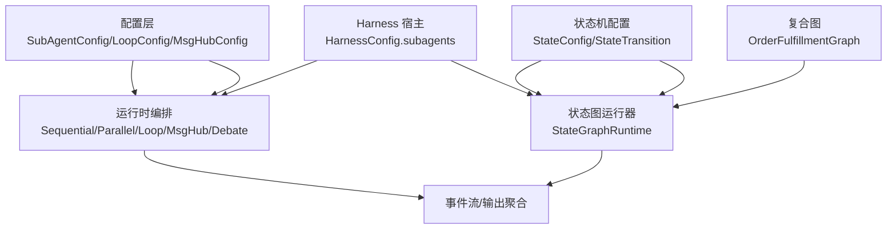
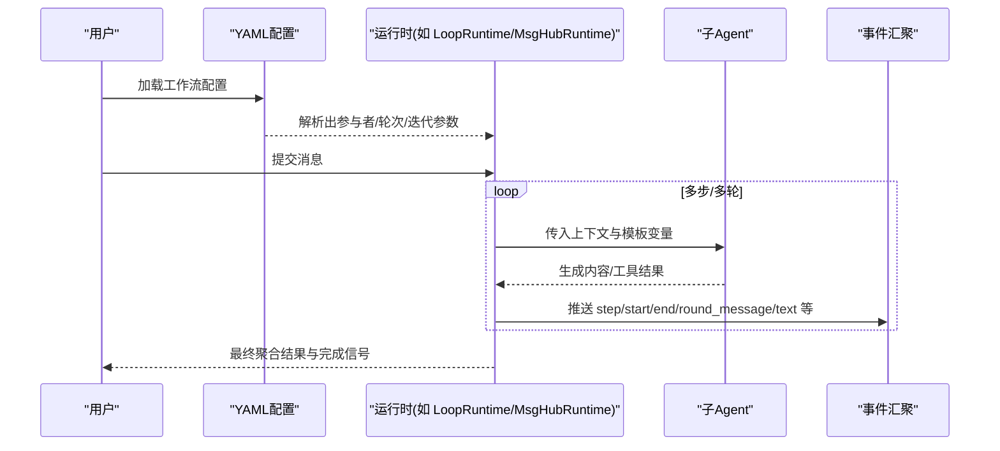
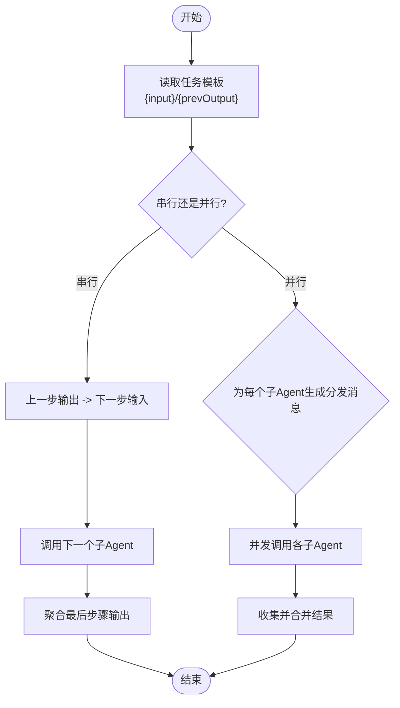
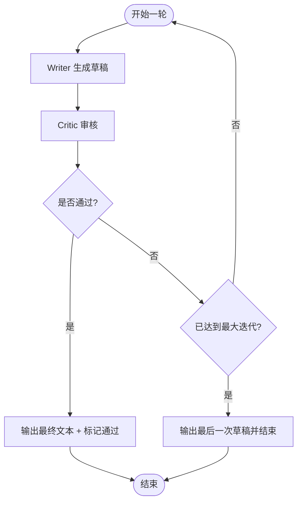
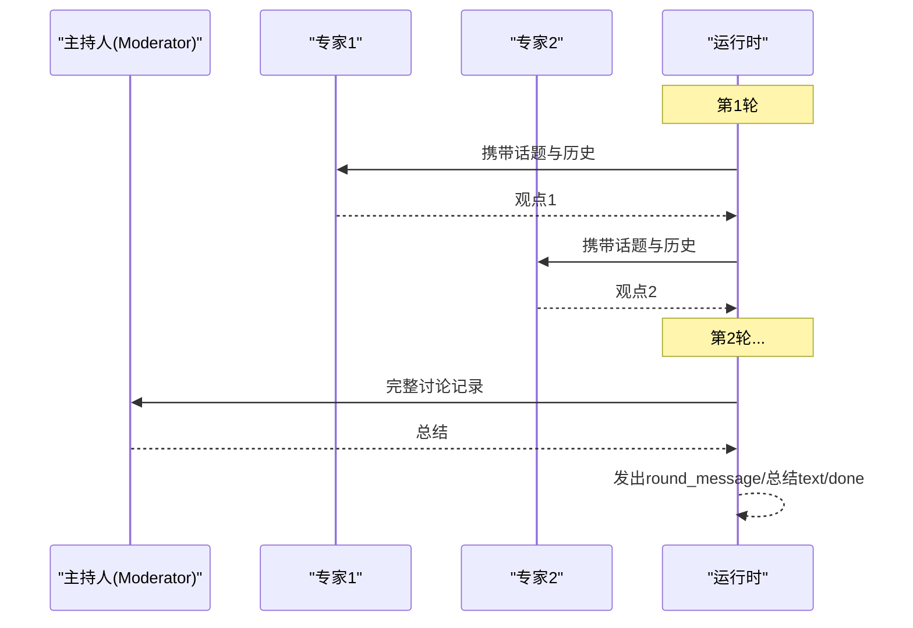
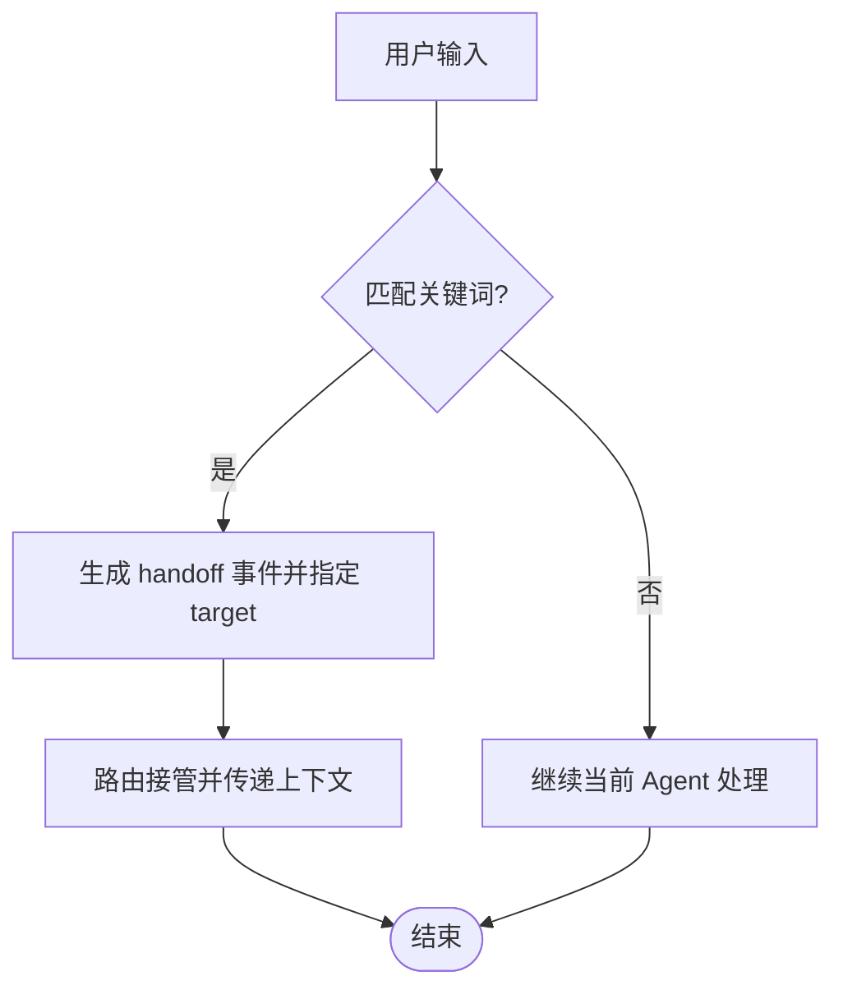
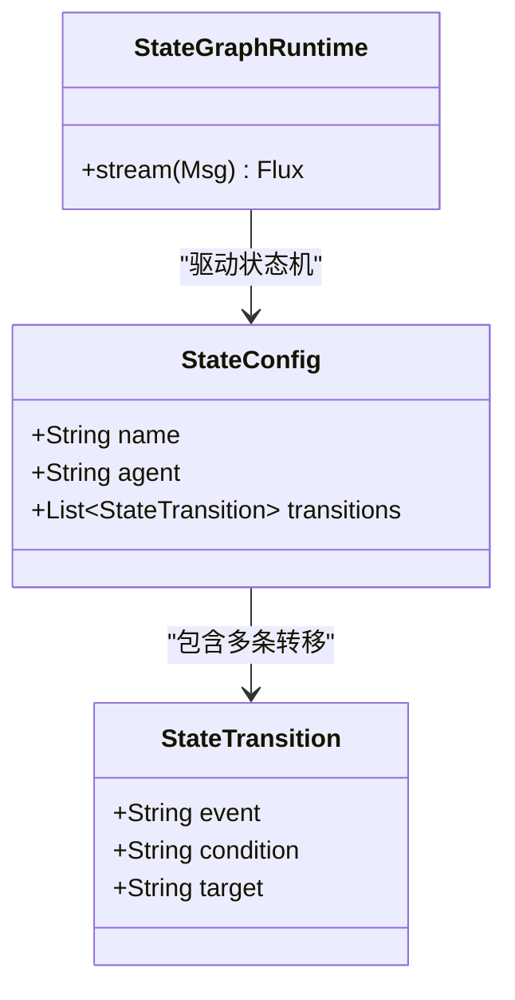
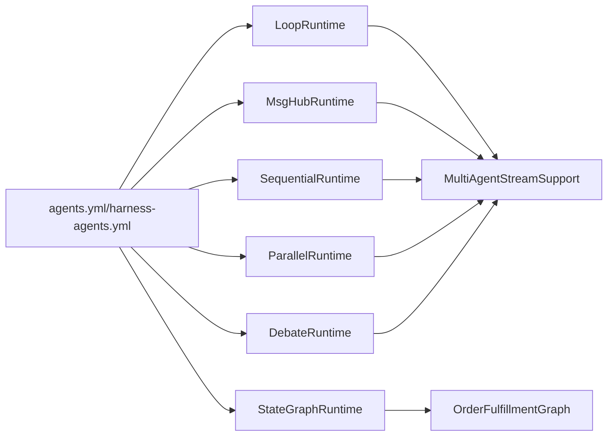

# 多智能体协作配置

<cite>
**本文件中引用的文件**
- [SubAgentConfig.java](file://src/main/java/com/skloda/agentscope/agent/SubAgentConfig.java)
- [LoopConfig.java](file://src/main/java/com/skloda/agentscope/agent/LoopConfig.java)
- [MsgHubConfig.java](file://src/main/java/com/skloda/agentscope/agent/MsgHubConfig.java)
- [HandoffTrigger.java](file://src/main/java/com/skloda/agentscope/agent/HandoffTrigger.java)
- [StateConfig.java](file://src/main/java/com/skloda/agentscope/agent/StateConfig.java)
- [StateTransition.java](file://src/main/java/com/skloda/agentscope/agent/StateTransition.java)
- [HarnessConfig.java](file://src/main/java/com/skloda/agentscope/agent/HarnessConfig.java)
- [LoopRuntime.java](file://src/main/java/com/skloda/agentscope/runtime/LoopRuntime.java)
- [MsgHubRuntime.java](file://src/main/java/com/skloda/agentscope/runtime/MsgHubRuntime.java)
- [SequentialRuntime.java](file://src/main/java/com/skloda/agentscope/runtime/SequentialRuntime.java)
- [ParallelRuntime.java](file://src/main/java/com/skloda/agentscope/runtime/ParallelRuntime.java)
- [DebateRuntime.java](file://src/main/java/com/skloda/agentscope/runtime/DebateRuntime.java)
- [StateGraphRuntime.java](file://src/main/java/com/skloda/agentscope/runtime/StateGraphRuntime.java)
- [SubAgentSeqRuntime.java](file://src/main/java/com/skloda/agentscope/runtime/SubAgentSeqRuntime.java)
- [SubAgentParRuntime.java](file://src/main/java/com/skloda/agentscope/runtime/SubAgentParRuntime.java)
- [OrderFulfillmentGraph.java](file://src/main/java/com/skloda/agentscope/composite/graph/OrderFulfillmentGraph.java)
- [agents.yml](file://src/main/resources/config/agents.yml)
- [harness-agents.yml](file://src/main/resources/config/harness-agents.yml)
</cite>

## 目录
1. [介绍](#介绍)
2. [项目结构](#项目结构)
3. [核心组件](#核心组件)
4. [架构总览](#架构总览)
5. [详细组件分析](#详细组件分析)
6. [依赖关系分析](#依赖关系分析)
7. [性能与可观测性](#性能与可观测性)
8. [故障排查指南](#故障排查指南)
9. [结论](#结论)
10. [附录：复杂工作流配置示例](#附录复杂工作流配置示例)

## 介绍
本文面向需要构建多智能体协作场景的开发与配置人员，系统梳理 SubAgentConfig（子 Agent 配置）、LoopConfig（循环配置）、MsgHubConfig（消息总线配置）、handoffTriggers（交接触发器）、states（状态图），并给出流水线、辩论、状态机三种典型模式的完整配置思路与落地要点。文档同时结合运行时实现，说明参数如何被消费、数据如何在运行期流转、退出与聚合策略如何实现。

## 项目结构
代码将“配置声明”与“运行时执行”解耦：
- agent 包：描述协作模式的数据结构与配置项（如 SubAgentConfig、LoopConfig、MsgHubConfig、HandoffTrigger、StateConfig、StateTransition）。
- runtime 包：对应每种协作模式的运行时编排（如 LoopRuntime、MsgHubRuntime、SequentialRuntime、ParallelRuntime、DebateRuntime、StateGraphRuntime）。
- composite/graph：封装复杂的状态机与工作流图（以订单履约为例）。
- resources/config：外部化 YAML 配置入口，供 AgentFactory 等装配到运行时。
- harness：提供 HarnessAgent 能力（含 subagents、内存、计划模式等）作为复杂场景的宿主容器。

**图表来源**
- [SubAgentConfig.java:1-17](file://src/main/java/com/skloda/agentscope/agent/SubAgentConfig.java#L1-L17)
- [LoopConfig.java:1-14](file://src/main/java/com/skloda/agentscope/agent/LoopConfig.java#L1-L14)
- [MsgHubConfig.java:1-14](file://src/main/java/com/skloda/agentscope/agent/MsgHubConfig.java#L1-L14)
- [StateConfig.java:1-16](file://src/main/java/com/skloda/agentscope/agent/StateConfig.java#L1-L16)
- [StateTransition.java:1-15](file://src/main/java/com/skloda/agentscope/agent/StateTransition.java#L1-L15)
- [HarnessConfig.java:11-42](file://src/main/java/com/skloda/agentscope/agent/HarnessConfig.java#L11-L42)

**部分来源**
- [agents.yml:1-200](file://src/main/resources/config/agents.yml#L1-L200)
- [harness-agents.yml:1-80](file://src/main/resources/config/harness-agents.yml#L1-L80)

## 核心组件
本节聚焦配置类与运行时的映射关系，帮助理解“配置即契约，运行即编排”。

- SubAgentConfig
  - 字段包括子 Agent 引用键与任务模板等，用于在组合模式中指定参与步骤的 Agent 以及每个步骤的任务提示模板。
  - 通常与 SequentialRuntime / ParallelRuntime / SubAgentSeqRuntime / SubAgentParRuntime 配合使用，通过 {input}/{prevOutput}/{taskTemplate} 进行参数注入。
  - 关键参考路径：[SubAgentConfig.java:12-17](file://src/main/java/com/skloda/agentscope/agent/SubAgentConfig.java#L12-L17)、[SubAgentSeqRuntime.java:46-63](file://src/main/java/com/skloda/agentscope/runtime/SubAgentSeqRuntime.java#L46-L63)、[SubAgentParRuntime.java:45-55](file://src/main/java/com/skloda/agentscope/runtime/SubAgentParRuntime.java#L45-L55)

- LoopConfig
  - maxIterations：最大迭代次数；exitCondition：退出条件控制（AUTO 表示根据评审结果自动判断是否提前结束，或达到上限后终止）。
  - 由 LoopRuntime 消费，完成“写作者→评审者”的迭代；当达到最大迭代时，会确保输出最近一次写作结果。
  - 关键参考路径：[LoopConfig.java:12-14](file://src/main/java/com/skloda/agentscope/agent/LoopConfig.java#L12-L14)、[LoopRuntime.java:73-82](file://src/main/java/com/skloda/agentscope/runtime/LoopRuntime.java#L73-L82)、[LoopRuntime.java:106-113](file://src/main/java/com/skloda/agentscope/runtime/LoopRuntime.java#L106-L113)、[LoopRuntime.java:122-134](file://src/main/java/com/skloda/agentscope/runtime/LoopRuntime.java#L122-L134)

- MsgHubConfig
  - rounds：讨论轮数；summaryRole：总结角色标识（通常为主持人）。
  - 由 MsgHubRuntime 消费，按轮次让多位专家依次发言，最后主持人生成汇总。
  - 关键参考路径：[MsgHubConfig.java:12-14](file://src/main/java/com/skloda/agentscope/agent/MsgHubConfig.java#L12-L14)、[MsgHubRuntime.java:58-105](file://src/main/java/com/skloda/agentscope/runtime/MsgHubRuntime.java#L58-L105)

- HandoffTrigger
  - 类型+关键词匹配+目标 Agent ID，用于在交互中检测触发点，将控制权移交目标 Agent。
  - matches 方法支持 INTENT 类型的关键词匹配。
  - 关键参考路径：[HandoffTrigger.java:14-25](file://src/main/java/com/skloda/agentscope/agent/HandoffTrigger.java#L14-L25)

- StateConfig / StateTransition
  - 定义状态节点名称、绑定 Agent 以及转换条件与目标状态，配合 StateGraphRuntime 执行为有向无环图。
  - 关键参考路径：[StateConfig.java:13-16](file://src/main/java/com/skloda/agentscope/agent/StateConfig.java#L13-L16)、[StateTransition.java:12-15](file://src/main/java/com/skloda/agentscope/agent/StateTransition.java#L12-L15)、[StateGraphRuntime.java:13-74](file://src/main/java/com/skloda/agentscope/runtime/StateGraphRuntime.java#L13-L74)

- HarnessConfig（subagents 关联）
  - Harness 模式下可声明一组子 Agent 描述（name/description），作为复杂工作流中的角色清单。
  - 关键参考路径：[HarnessConfig.java:11-42](file://src/main/java/com/skloda/agentscope/agent/HarnessConfig.java#L11-L42)、[HarnessConfig.SubAgentRef:58-61](file://src/main/java/com/skloda/agentscope/agent/HarnessConfig.java#L58-L61)

**部分来源**
- [SubAgentConfig.java:12-17](file://src/main/java/com/skloda/agentscope/agent/SubAgentConfig.java#L12-L17)
- [LoopConfig.java:12-14](file://src/main/java/com/skloda/agentscope/agent/LoopConfig.java#L12-L14)
- [MsgHubConfig.java:12-14](file://src/main/java/com/skloda/agentscope/agent/MsgHubConfig.java#L12-L14)
- [HandoffTrigger.java:14-25](file://src/main/java/com/skloda/agentscope/agent/HandoffTrigger.java#L14-L25)
- [StateConfig.java:13-16](file://src/main/java/com/skloda/agentscope/agent/StateConfig.java#L13-L16)
- [StateTransition.java:12-15](file://src/main/java/com/skloda/agentscope/agent/StateTransition.java#L12-L15)
- [HarnessConfig.java:11-42](file://src/main/java/com/skloda/agentscope/agent/HarnessConfig.java#L11-L42)

## 架构总览
下图展示了从配置到运行时的整体调用链：外部 YAML 定义 → 运行时构造 → 流式事件输出。

**图表来源**
- [LoopRuntime.java:52-67](file://src/main/java/com/skloda/agentscope/runtime/LoopRuntime.java#L52-L67)
- [MsgHubRuntime.java:45-119](file://src/main/java/com/skloda/agentscope/runtime/MsgHubRuntime.java#L45-L119)
- [SequentialRuntime.java:37-88](file://src/main/java/com/skloda/agentscope/runtime/SequentialRuntime.java#L37-L88)
- [ParallelRuntime.java:38-94](file://src/main/java/com/skloda/agentscope/runtime/ParallelRuntime.java#L38-L94)

## 详细组件分析

### 子 Agent 配置：SubAgentConfig、引用与参数传递、结果聚合
- 子 Agent 引用
  - 通过 agentId 唯一标识参与的子 Agent；在多步/并行场景中，多个 SubAgentConfig 组成工作流的节点集合。
  - 关键参考：[SubAgentConfig.java:12-17](file://src/main/java/com/skloda/agentscope/agent/SubAgentConfig.java#L12-L17)

- 参数传递
  - 顺序模式：{input} 为原始输入；{prevOutput} 为上一个子 Agent 的输出；每次步骤拼接为新的 Msg 文本。
  - 并发模式：将 {input} 替换后并行分发至各子 Agent，结果合并展示。
  - 关键参考：[SubAgentSeqRuntime.java:50-64](file://src/main/java/com/skloda/agentscope/runtime/SubAgentSeqRuntime.java#L50-L64)、[SubAgentParRuntime.java:49-55](file://src/main/java/com/skloda/agentscope/runtime/SubAgentParRuntime.java#L49-L55)

- 结果聚合
  - 顺序模式：前一步输出即为下一步输入，最终以最后一步输出作为文本结果。
  - 并发模式：收集所有任务的输出，按 AgentId 分块聚合为一个统一文本返回。
  - 关键参考：[SubAgentSeqRuntime.java:71-80](file://src/main/java/com/skloda/agentscope/runtime/SubAgentSeqRuntime.java#L71-L80)、[SubAgentParRuntime.java:63-77](file://src/main/java/com/skloda/agentscope/runtime/SubAgentParRuntime.java#L63-L77)

**图表来源**
- [SubAgentSeqRuntime.java:46-80](file://src/main/java/com/skloda/agentscope/runtime/SubAgentSeqRuntime.java#L46-L80)
- [SubAgentParRuntime.java:45-77](file://src/main/java/com/skloda/agentscope/runtime/SubAgentParRuntime.java#L45-L77)

**部分来源**
- [SubAgentConfig.java:12-17](file://src/main/java/com/skloda/agentscope/agent/SubAgentConfig.java#L12-L17)
- [SubAgentSeqRuntime.java:46-80](file://src/main/java/com/skloda/agentscope/runtime/SubAgentSeqRuntime.java#L46-L80)
- [SubAgentParRuntime.java:45-77](file://src/main/java/com/skloda/agentscope/runtime/SubAgentParRuntime.java#L45-L77)

### 循环配置：LoopConfig、循环条件、最大迭代、退出机制
- 循环主体
  - writer 产出草稿，critic 审核后决定是否继续；approved 时立即输出 writer 的最后结果并结束。
- 循环条件与退出
  - maxIterations：达到该值后终止循环，但仍会输出最后一篇草稿，避免用户空返回。
  - exitCondition：控制退出策略语义（AUTO/MANUAL 等在测试用例中出现）。
- 事件流
  - 每轮写出 writer 与 critic 的消息增量，并在结束时发送 loop_end 与 final text/done。
- 关键参考：
  - [LoopConfig.java:12-14](file://src/main/java/com/skloda/agentscope/agent/LoopConfig.java#L12-L14)
  - [LoopRuntime.java:73-113](file://src/main/java/com/skloda/agentscope/runtime/LoopRuntime.java#L73-L113)
  - [LoopRuntime.java:118-134](file://src/main/java/com/skloda/agentscope/runtime/LoopRuntime.java#L118-L134)

**图表来源**
- [LoopRuntime.java:73-134](file://src/main/java/com/skloda/agentscope/runtime/LoopRuntime.java#L73-L134)

**部分来源**
- [LoopConfig.java:12-14](file://src/main/java/com/skloda/agentscope/agent/LoopConfig.java#L12-L14)
- [LoopRuntime.java:73-134](file://src/main/java/com/skloda/agentscope/runtime/LoopRuntime.java#L73-L134)
- [LoopRuntimeTest.java:29-79](file://src/test/java/com/skloda/agentscope/runtime/LoopRuntimeTest.java#L29-L79)

### 消息总线：MsgHubConfig、主题订阅、消息路由与异步通信
- 主题订阅与路由
  - 运行时根据 rounds 组织轮次；每轮内依次邀请专家发言，保留历史对话记录，确保后续参与者在完整语境下作答。
  - moderator 在所有轮结束后对整场讨论做总结，并以文本形式输出。
- 异步通信机制
  - 全量使用 Reactive Flux 链式调用与事件发射，所有中间片段与最终结果都会流入前端事件流。
- 关键参考：
  - [MsgHubConfig.java:12-14](file://src/main/java/com/skloda/agentscope/agent/MsgHubConfig.java#L12-L14)
  - [MsgHubRuntime.java:45-119](file://src/main/java/com/skloda/agentscope/runtime/MsgHubRuntime.java#L45-L119)

**图表来源**
- [MsgHubRuntime.java:60-105](file://src/main/java/com/skloda/agentscope/runtime/MsgHubRuntime.java#L60-L105)

**部分来源**
- [MsgHubConfig.java:12-14](file://src/main/java/com/skloda/agentscope/agent/MsgHubConfig.java#L12-L14)
- [MsgHubRuntime.java:45-119](file://src/main/java/com/skloda/agentscope/runtime/MsgHubRuntime.java#L45-L119)
- [MsgHubRuntimeTest.java:29-63](file://src/test/java/com/skloda/agentscope/runtime/MsgHubRuntimeTest.java#L29-L63)

### 交接触发器：handoffTriggers、条件判断、交接规则与状态保持
- 条件判断
  - INTENT 类型基于 keywords 列表进行包含匹配；当用户输入满足任一关键词即认为命中。
- 交接规则
  - target 指向目标 Agent 的标识；匹配成功后由上层路由决定如何将控制权移交给目标 Agent。
- 状态保持
  - 交接后应将当前对话上下文继续透传给新 Agent，确保业务连续性（由上层路由/会话管理负责维持，运行时仅负责识别触发）。
- 关键参考：
  - [HandoffTrigger.java:14-25](file://src/main/java/com/skloda/agentscope/agent/HandoffTrigger.java#L14-L25)
  - [agents.yml:示例 Agent 上下文透传方式](file://src/main/resources/config/agents.yml#L1-L200)

**图表来源**
- [HandoffTrigger.java:19-25](file://src/main/java/com/skloda/agentscope/agent/HandoffTrigger.java#L19-L25)

**部分来源**
- [HandoffTrigger.java:14-25](file://src/main/java/com/skloda/agentscope/agent/HandoffTrigger.java#L14-L25)

### 状态图：states、状态定义、转移条件与动作执行
- 状态定义
  - 每个状态 name 绑定一个 agent，并通过 transitions 定义在该状态下可响应的事件及其目标状态。
- 转移条件
  - transition 通过 event 表达触发动作，condition 表达进入限制（逻辑可由上层策略扩展）。
- 动作执行
  - StateGraphRuntime 在执行图时会调用 OrderFulfillmentGraph，并将图事件转发至全局事件汇，最终输出文本与完成信号。
- 关键参考：
  - [StateConfig.java:13-16](file://src/main/java/com/skloda/agentscope/agent/StateConfig.java#L13-L16)
  - [StateTransition.java:12-15](file://src/main/java/com/skloda/agentscope/agent/StateTransition.java#L12-L15)
  - [StateGraphRuntime.java:13-74](file://src/main/java/com/skloda/agentscope/runtime/StateGraphRuntime.java#L13-L74)
  - [OrderFulfillmentGraph.java](file://src/main/java/com/skloda/agentscope/composite/graph/OrderFulfillmentGraph.java)

**图表来源**
- [StateConfig.java:13-16](file://src/main/java/com/skloda/agentscope/agent/StateConfig.java#L13-L16)
- [StateTransition.java:12-15](file://src/main/java/com/skloda/agentscope/agent/StateTransition.java#L12-L15)
- [StateGraphRuntime.java:13-74](file://src/main/java/com/skloda/agentscope/runtime/StateGraphRuntime.java#L13-L74)

**部分来源**
- [StateConfig.java:13-16](file://src/main/java/com/skloda/agentscope/agent/StateConfig.java#L13-L16)
- [StateTransition.java:12-15](file://src/main/java/com/skloda/agentscope/agent/StateTransition.java#L12-L15)
- [StateGraphRuntime.java:13-74](file://src/main/java/com/skloda/agentscope/runtime/StateGraphRuntime.java#L13-L74)

## 依赖关系分析
- 组件耦合
  - LoopRuntime/MsgHubRuntime/SequentialRuntime/ParallelRuntime/DebateRuntime 均依赖 MultiAgentStreamSupport 来桥接 ReActAgent 的流式事件；统一通过 ObservabilityHook.EventSink 向外暴露事件。
  - StateGraphRuntime 依赖 OrderFulfillmentGraph 完成节点间的有向转移。
- 外部集成
  - YAML 配置集中放在 agents.yml 与 harness-agents.yml，用于注册 Agent、子 Agent、权限/沙箱等元信息。
- 可能的环路
  - 状态图应避免设计环状依赖；如需闭环（例如重试），应在外层用 LoopRuntime 承载，内部状态机保持无环。

**图表来源**
- [LoopRuntime.java:52-67](file://src/main/java/com/skloda/agentscope/runtime/LoopRuntime.java#L52-L67)
- [MsgHubRuntime.java:45-119](file://src/main/java/com/skloda/agentscope/runtime/MsgHubRuntime.java#L45-L119)
- [SequentialRuntime.java:37-88](file://src/main/java/com/skloda/agentscope/runtime/SequentialRuntime.java#L37-L88)
- [ParallelRuntime.java:38-94](file://src/main/java/com/skloda/agentscope/runtime/ParallelRuntime.java#L38-L94)
- [DebateRuntime.java:44-106](file://src/main/java/com/skloda/agentscope/runtime/DebateRuntime.java#L44-L106)
- [StateGraphRuntime.java:13-74](file://src/main/java/com/skloda/agentscope/runtime/StateGraphRuntime.java#L13-L74)

**部分来源**
- [LoopRuntime.java:52-67](file://src/main/java/com/skloda/agentscope/runtime/LoopRuntime.java#L52-L67)
- [MsgHubRuntime.java:45-119](file://src/main/java/com/skloda/agentscope/runtime/MsgHubRuntime.java#L45-L119)
- [SequentialRuntime.java:37-88](file://src/main/java/com/skloda/agentscope/runtime/SequentialRuntime.java#L37-L88)
- [ParallelRuntime.java:38-94](file://src/main/java/com/skloda/agentscope/runtime/ParallelRuntime.java#L38-L94)
- [DebateRuntime.java:44-106](file://src/main/java/com/skloda/agentscope/runtime/DebateRuntime.java#L44-L106)
- [StateGraphRuntime.java:13-74](file://src/main/java/com/skloda/agentscope/runtime/StateGraphRuntime.java#L13-L74)

## 性能与可观测性
- 流式与背压
  - 全部运行时采用 Reactor Flux/Mono 构建事件流，减少一次性阻塞等待，利于大文本与长流程的分片输出。
- 聚合成本
  - 并行模式中 collectList 会在所有子任务完成后聚合，注意子任务数量与单体输出的大小；可在上游截断冗余输出。
- 可观测性
  - 所有运行时无侵入地通过 ObservabilityHook 暴露 start/end/step/round/table summary 等事件，便于前端可视化与链路追踪。

[本节为通用建议，不直接分析具体文件]

## 故障排查指南
- 循环模式下最大迭代未输出内容
  - 现象：critic 从未通过，但用户最终未收到任何文本。
  - 定位：检查达到最大迭代分支是否正确发出最后一次 writer 输出。
  - 参考：[LoopRuntime.java:118-134](file://src/main/java/com/skloda/agentscope/runtime/LoopRuntime.java#L118-L134)、[LoopRuntimeTest.java:52-79](file://src/test/java/com/skloda/agentscope/runtime/LoopRuntimeTest.java#L52-L79)
- 消息总线未生成总结
  - 现象：若干轮之后没有 roundtable_summary 与最终的 text。
  - 定位：确认 rounds 与 Moderator 调用链是否完整执行。
  - 参考：[MsgHubRuntime.java:89-105](file://src/main/java/com/skloda/agentscope/runtime/MsgHubRuntime.java#L89-L105)、[MsgHubRuntimeTest.java:29-63](file://src/test/java/com/skloda/agentscope/runtime/MsgHubRuntimeTest.java#L29-L63)
- 子 Agent 间数据丢失
  - 现象：步骤之间 {prevOutput} 为空或错配。
  - 定位：检查 SubAgentStep 模板拼接逻辑与任务分解粒度。
  - 参考：[SubAgentSeqRuntime.java:50-64](file://src/main/java/com/skloda/agentscope/runtime/SubAgentSeqRuntime.java#L50-L64)
- 交接未生效
  - 现象：意图关键词正确但未跳转。
  - 定位：检查 TriggerType 是否为 INTENT、keywords 是否覆盖到实际语料。
  - 参考：[HandoffTrigger.java:19-25](file://src/main/java/com/skloda/agentscope/agent/HandoffTrigger.java#L19-L25)

**部分来源**
- [LoopRuntime.java:118-134](file://src/main/java/com/skloda/agentscope/runtime/LoopRuntime.java#L118-L134)
- [MsgHubRuntime.java:89-105](file://src/main/java/com/skloda/agentscope/runtime/MsgHubRuntime.java#L89-L105)
- [SubAgentSeqRuntime.java:50-64](file://src/main/java/com/skloda/agentscope/runtime/SubAgentSeqRuntime.java#L50-L64)
- [HandoffTrigger.java:19-25](file://src/main/java/com/skloda/agentscope/agent/HandoffTrigger.java#L19-L25)

## 结论
- SubAgentConfig 将“谁来做什么、怎么把上一轮结果带过来”固化在配置中，配合 Sequencial/Parallel 子类运行器轻松组合多步骤多角色工作流。
- LoopConfig 提供可控的写审迭代闭环，保障即使未获通过也能交付最佳可用版本。
- MsgHubConfig 组织多轮专家讨论并由主持人收敛共识，适合需要深度协商与综合评判的任务。
- handoffTriggers 使交互过程具备“动态路由”能力，按需切换负责方，提升人机协同体验。
- states/state transitions 将业务流程结构化，便于审计与回溯；配合状态图运行器可将复杂决策逻辑显式化。

[本节为总结性内容，不直接分析具体文件]

## 附录：复杂工作流配置示例

以下示例侧重“如何组合上述配置”，不涉及具体代码片段，均标注了参考路径以便追溯实现。

- 流水线模式（Sequential/Parallel 组合）
  - 角色分工：资料检索 → 数据分析 → 报告生成
  - 配置要点：
    - 使用子 Agent 序列，每步任务模板中包含 {input}/{prevOutput}。
    - 若检索与分析互不依赖，可改用并行分支，提高吞吐。
  - 运行效果：步骤级 pipeline_step_result 与最终 text。
  - 参考：[SequentialRuntime.java:37-88](file://src/main/java/com/skloda/agentscope/runtime/SequentialRuntime.java#L37-L88)、[ParallelRuntime.java:38-94](file://src/main/java/com/skloda/agentscope/runtime/ParallelRuntime.java#L38-L94)、[SubAgentSeqRuntime.java:46-80](file://src/main/java/com/skloda/agentscope/runtime/SubAgentSeqRuntime.java#L46-L80)、[SubAgentParRuntime.java:45-77](file://src/main/java/com/skloda/agentscope/runtime/SubAgentParRuntime.java#L45-L77)

- 辩论模式（Debate/MsgHub）
  - 角色分工：多专家多轮辩论 + 裁判/主持人总结
  - 配置要点：
    -  DebateRuntime 以“多专家×轮次”组织讨论，judge 收口总结。
    - 亦可使用 MsgHubRuntime，以 rounds 控制回合，moderator 汇总。
  - 参考：[DebateRuntime.java:44-106](file://src/main/java/com/skloda/agentscope/runtime/DebateRuntime.java#L44-L106)、[MsgHubRuntime.java:45-119](file://src/main/java/com/skloda/agentscope/runtime/MsgHubRuntime.java#L45-L119)

- 状态机模式（StateGraph）
  - 角色分工：下单→支付→发货→签收，每步可嵌入工具调用或人类审批。
  - 配置要点：
    - 使用 StateConfig 声明节点与绑定 Agent；StateTransition 定义可执行动作及目标状态。
    - 异常时可转移到错误/补偿状态，便于恢复。
  - 参考：[StateConfig.java:13-16](file://src/main/java/com/skloda/agentscope/agent/StateConfig.java#L13-L16)、[StateTransition.java:12-15](file://src/main/java/com/skloda/agentscope/agent/StateTransition.java#L12-L15)、[StateGraphRuntime.java:13-74](file://src/main/java/com/skloda/agentscope/runtime/StateGraphRuntime.java#L13-L74)、[OrderFulfillmentGraph.java](file://src/main/java/com/skloda/agentscope/composite/graph/OrderFulfillmentGraph.java)

- Harness 下的复杂场景（多子 Agent + 记忆/计划/沙箱）
  - 通过 harness-agents.yml 中 harnessConfig.subagents 定义角色集，结合 compaction/memory/plan 完成知识沉淀与长期记忆。
  - 典型用法：根因分析→趋势对比→策略优化→ROI 测算的串联流水线。
  - 参考：[harness-agents.yml:1-80](file://src/main/resources/config/harness-agents.yml#L1-L80)、[HarnessConfig.java:11-42](file://src/main/java/com/skloda/agentscope/agent/HarnessConfig.java#L11-L42)

**部分来源**
- [SequentialRuntime.java:37-88](file://src/main/java/com/skloda/agentscope/runtime/SequentialRuntime.java#L37-L88)
- [ParallelRuntime.java:38-94](file://src/main/java/com/skloda/agentscope/runtime/ParallelRuntime.java#L38-L94)
- [DebateRuntime.java:44-106](file://src/main/java/com/skloda/agentscope/runtime/DebateRuntime.java#L44-L106)
- [MsgHubRuntime.java:45-119](file://src/main/java/com/skloda/agentscope/runtime/MsgHubRuntime.java#L45-L119)
- [StateConfig.java:13-16](file://src/main/java/com/skloda/agentscope/agent/StateConfig.java#L13-L16)
- [StateTransition.java:12-15](file://src/main/java/com/skloda/agentscope/agent/StateTransition.java#L12-L15)
- [StateGraphRuntime.java:13-74](file://src/main/java/com/skloda/agentscope/runtime/StateGraphRuntime.java#L13-L74)
- [OrderFulfillmentGraph.java](file://src/main/java/com/skloda/agentscope/composite/graph/OrderFulfillmentGraph.java)
- [harness-agents.yml:1-80](file://src/main/resources/config/harness-agents.yml#L1-L80)
- [HarnessConfig.java:11-42](file://src/main/java/com/skloda/agentscope/agent/HarnessConfig.java#L11-L42)