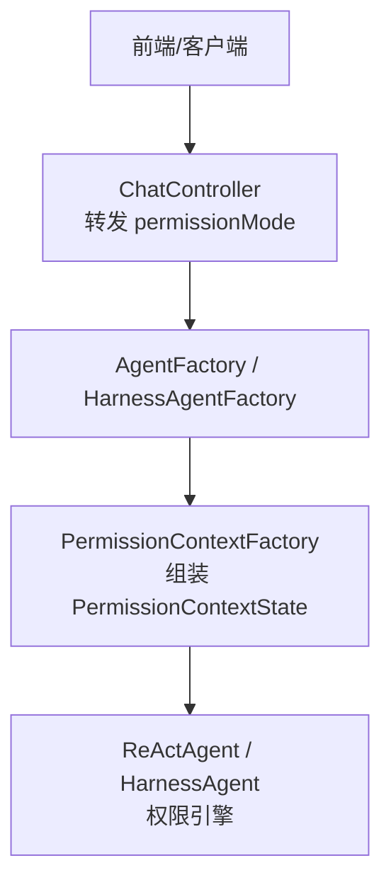
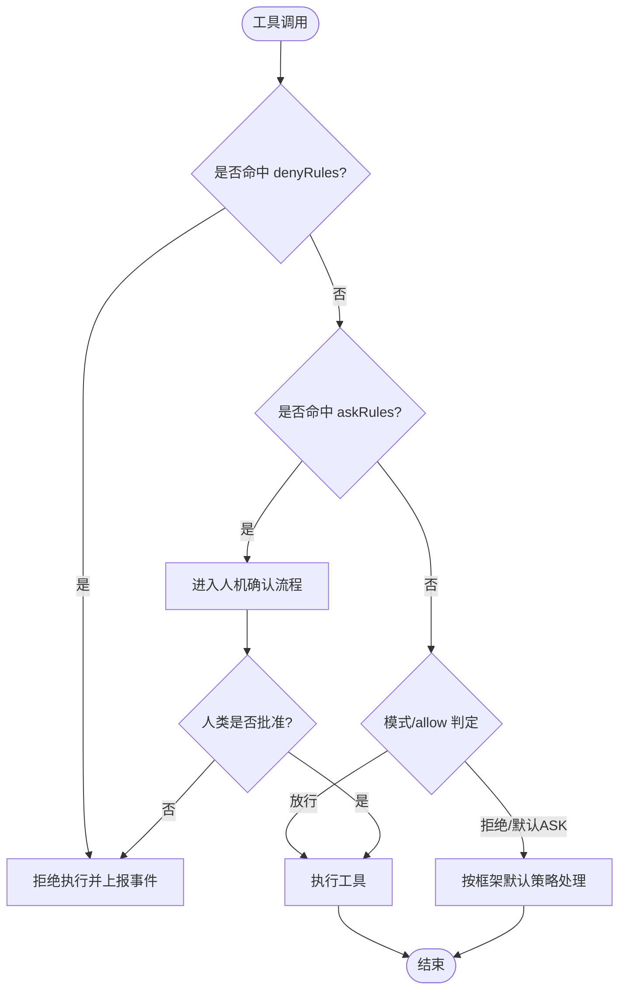
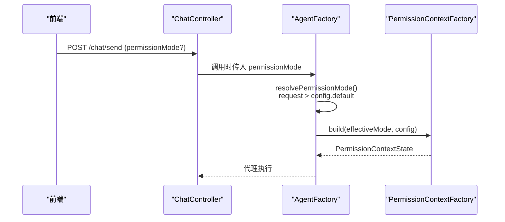
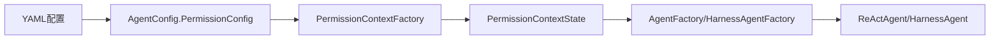

# 权限控制配置

<cite>
**本文引用的文件**
- [AgentConfig.java](file://src/main/java/com/skloda/agentscope/agent/AgentConfig.java)
- [PermissionContextFactory.java](file://src/main/java/com/skloda/agentscope/permission/PermissionContextFactory.java)
- [AgentFactory.java](file://src/main/java/com/skloda/agentscope/agent/AgentFactory.java)
- [HarnessAgentFactory.java](file://src/main/java/com/skloda/agentscope/harness/HarnessAgentFactory.java)
- [ChatRequest.java](file://src/main/java/com/skloda/agentscope/model/ChatRequest.java)
- [ChatController.java](file://src/main/java/com/skloda/agentscope/controller/ChatController.java)
- [agents.yml](file://src/main/resources/config/agents.yml)
- [harness-agents.yml](file://src/main/resources/config/harness-agents.yml)
- [PermissionContextFactoryTest.java](file://src/test/java/com/skloda/agentscope/permission/PermissionContextFactoryTest.java)
</cite>

## 目录
1. [简介](#简介)
2. [项目结构与权限相关位置](#项目结构与权限相关位置)
3. [核心组件](#核心组件)
4. [架构总览](#架构总览)
5. [详细组件分析](#详细组件分析)
6. [依赖关系分析](#依赖关系分析)
7. [性能与扩展性建议](#性能与扩展性建议)
8. [故障排查指南](#故障排查指南)
9. [结论](#结论)
10. [附录：常见场景配置示例](#附录：常见场景配置示例)

## 简介
本文件聚焦 AgentScope 权限控制的运行时配置与执行流程，系统说明 AgentConfig.PermissionConfig.defaultMode 三种模式（bypass、deny、ask）的使用场景与配置方法；解释 denyTools 与 askTools 的作用与优先级；并结合源码路径给出上下文状态机行为与权限决策流程。最后提供敏感操作保护、批量工具调用、团队协作环境隔离等实际复杂场景的配置思路。

## 项目结构与权限相关位置
- 权限配置定义在 AgentConfig 的内部类 PermissionConfig 中，集中声明默认模式与两类工具白名单/黑名单。
- 运行时通过 PermissionContextFactory 将“请求级模式 + 配置”转换为框架级别的权限上下文，并注入到 Agent/Harness 构建器。
- 入口贯穿 ChatController → AgentService/AgentRuntime → AgentFactory/HarnessAgentFactory → PermissionContextFactory → ReActAgent/HarnessAgent 的权限引擎。



图表来源
- [AgentFactory.java:271-286](file://src/main/java/com/skloda/agentscope/agent/AgentFactory.java#L271-L286)
- [HarnessAgentFactory.java:187-189](file://src/main/java/com/skloda/agentscope/harness/HarnessAgentFactory.java#L187-L189)
- [PermissionContextFactory.java:12-24](file://src/main/java/com/skloda/agentscope/permission/PermissionContextFactory.java#L12-L24)
- [ChatController.java:144-146](file://src/main/java/com/skloda/agentscope/controller/ChatController.java#L144-L146)

章节来源
- [ChatController.java:140-150](file://src/main/java/com/skloda/agentscope/controller/ChatController.java#L140-L150)
- [AgentFactory.java:271-286](file://src/main/java/com/skloda/agentscope/agent/AgentFactory.java#L271-L286)
- [HarnessAgentFactory.java:187-190](file://src/main/java/com/skloda/agentscope/harness/HarnessAgentFactory.java#L187-L190)

## 核心组件
- AgentConfig.PermissionConfig
  - defaultMode：默认权限模式，决定未显式指定时的安全基线。
  - denyTools：显式拒绝工具清单。始终生效、不可被模式覆盖。
  - askTools：需要用户确认的工具清单。仅在特定模式下应用。

- PermissionContextFactory
  - 根据传入的模式字符串和 PermissionConfig，构建框架侧的 PermissionContextState。
  - denyTools 无论 mode 如何都注册为拒绝规则；askTools 仅当模式为 accept_edits 时注册为询问规则。
  - 模式解析来自 PermissionMode.fromString()，默认回退为 bypass。

章节来源
- [AgentConfig.java:94-106](file://src/main/java/com/skloda/agentscope/agent/AgentConfig.java#L94-L106)
- [PermissionContextFactory.java:12-39](file://src/main/java/com/skloda/agentscope/permission/PermissionContextFactory.java#L12-L39)

## 架构总览
权限决策的关键在于“请求级模式 > 配置默认模式”，以及“denyRules 最高优先级 > askRules > 允许规则/模式回退”。

```mermaid
sequenceDiagram
    participant Client as "客户端"
    participant Ctrl as "ChatController"
    participant AF as "AgentFactory"
    participant HF as "HarnessAgentFactory"
    participant PCF as "PermissionContextFactory"
    participant Engine as "权限引擎(内置)"

    Client->>Ctrl: 发送消息(含 optional permissionMode)
    Ctrl->>AF: 使用 request.permissionMode 构建参数
    AF->>PCF: build(effectiveMode, config.permissionConfig)
    alt 单 Agent 路径
        AF-->>Engine: 注入 PermissionContextState
    else Harness 路径
        HF->>PCF: build(effectiveMode, harnessConfig.permissionConfig)
        HF-->>Engine: 注入 PermissionContextState
    end
    Note over Engine: 每次工具调用按以下顺序判定:
    1) denyRules (绝对禁止)
    2) askRules (需人工审批)
    3) 模式与允许规则
    4) BYPASS 回退或默认 ASK/DONT_ASK
```

图表来源
- [AgentFactory.java:271-286](file://src/main/java/com/skloda/agentscope/agent/AgentFactory.java#L271-L286)
- [HarnessAgentFactory.java:187-190](file://src/main/java/com/skloda/agentscope/harness/HarnessAgentFactory.java#L187-L190)
- [PermissionContextFactory.java:12-24](file://src/main/java/com/skloda/agentscope/permission/PermissionContextFactory.java#L12-L24)
- [ChatController.java:144-146](file://src/main/java/com/skloda/agentscope/controller/ChatController.java#L144-L146)

## 详细组件分析

### PermissionConfig 字段语义
- defaultMode（默认值 bypass）
  - bypass：默认绕过检查，几乎所有工具调用直接放行。适合开发调试或受信任内网。
  - deny：对应框架中的拒绝默认策略。未被明确允许的工具将被拒绝。适用于“最小权限原则”的只读环境。注意：当前工厂对模式字符串会映射为框架的 PermissionMode，若采用 deny 语义，应使用框架提供的拒绝模式（例如 DONT_ASK），并通过 askTools/denyTools 精细化控制。
  - ask：此处实现中将 accept_edits 作为可编辑且需批准的宽松模式；对于“必须问”的通用默认，应基于框架模式与 askRules 配合。
- denyTools
  - 任意模式均会被添加为拒绝规则，是真正的“硬黑帽”。用于阻断高风险能力（如 shell、任意写盘）。
- askTools
  - 在 accept_edits 模式下，将该列表内的工具标记为需要人工批准。用于危险但可控的读写/执行场景。

章节来源
- [AgentConfig.java:94-106](file://src/main/java/com/skloda/agentscope/agent/AgentConfig.java#L94-L106)
- [PermissionContextFactory.java:12-39](file://src/main/java/com/skloda/agentscope/permission/PermissionContextFactory.java#L12-L39)

### 权限上下文构建与状态机
- 状态构造
  - 模式解析：PermissionMode.fromString(mode)，若无则回退为 bypass。
  - 拒绝规则：始终应用 denyTools。
  - 询问规则：仅当 mode 为 accept_edits 时应用 askTools。
- 运行时决策
  - 拒绝优先：所有 denyRules 在任何模式下均有效。
  - 询问优先：askRules 触发审批流，通过后执行。
  - 模式回退：BYPASS 模式放行；EXPLORE 模式限制写入；其他模式结合 allow/ask 综合判定。



图表来源
- [PermissionContextFactory.java:12-39](file://src/main/java/com/skloda/agentscope/permission/PermissionContextFactory.java#L12-L39)

章节来源
- [PermissionContextFactoryTest.java:17-58](file://src/test/java/com/skloda/agentscope/permission/PermissionContextFactoryTest.java#L17-L58)
- [PermissionContextFactory.java:12-39](file://src/main/java/com/skloda/agentscope/permission/PermissionContextFactory.java#L12-L39)

### 请求-响应路径与模式覆盖
- 请求层：ChatController 接收可选的 permissionMode。
- 工厂层：AgentFactory/HarnessAgentFactory 解析 effectiveMode = requestMode 优先于 agent defaultMode。
- 注入层：通过 PermissionContextFactory.build 生成上下文并注入 Agent 构建器。



图表来源
- [AgentFactory.java:271-286](file://src/main/java/com/skloda/agentscope/agent/AgentFactory.java#L271-L286)
- [HarnessAgentFactory.java:187-190](file://src/main/java/com/skloda/agentscope/harness/HarnessAgentFactory.java#L187-L190)
- [ChatController.java:144-146](file://src/main/java/com/skloda/agentscope/controller/ChatController.java#L144-L146)

章节来源
- [ChatRequest.java:34-40](file://src/main/java/com/skloda/agentscope/model/ChatRequest.java#L34-L40)
- [AgentFactory.java:271-286](file://src/main/java/com/skloda/agentscope/agent/AgentFactory.java#L271-L286)

### 配置文件集成
- agents.yml：可为普通 Agent 配置 permissionConfig（defaultMode、denyTools、askTools）。
- harness-agents.yml：Harness 模式也支持相同字段，并在构建 HarnessAgent 时注入上下文。

章节来源
- [agents.yml:1800-1810](file://src/main/resources/config/agents.yml#L1800-L1810)
- [harness-agents.yml:17-30](file://src/main/resources/config/harness-agents.yml#L17-L30)

## 依赖关系分析
- AgentConfig 暴露 PermissionConfig 结构供 YAML 解析与 Spring 装配。
- PermissionContextFactory 负责把 YAML 配置转化为运行期权限上下文。
- AgentFactory/HarnessAgentFactory 负责任命模式与上下文注入，保证不同 Agent 类型统一接入。
- ChatController/ChatRequest 负责将前端选择的模式透传到后端决策链路。



图表来源
- [AgentConfig.java:94-106](file://src/main/java/com/skloda/agentscope/agent/AgentConfig.java#L94-L106)
- [PermissionContextFactory.java:12-24](file://src/main/java/com/skloda/agentscope/permission/PermissionContextFactory.java#L12-L24)
- [AgentFactory.java:271-276](file://src/main/java/com/skloda/agentscope/agent/AgentFactory.java#L271-L276)
- [HarnessAgentFactory.java:187-190](file://src/main/java/com/skloda/agentscope/harness/HarnessAgentFactory.java#L187-L190)

章节来源
- [AgentFactory.java:271-286](file://src/main/java/com/skloda/agentscope/agent/AgentFactory.java#L271-L286)
- [HarnessAgentFactory.java:187-190](file://src/main/java/com/skloda/agentscope/harness/HarnessAgentFactory.java#L187-L190)

## 性能与扩展性建议
- 上下文复用：PermissionContextState 构造后随 Agent 实例复用，频繁切换模式时需重建 Agent 以生效（建议在会话边界或用户主动切换时使用）。
- 规则粒度：尽量将高影响工具放入 denyTools 或 askTools，避免宽泛默认放行增加审计成本。
- 可扩展点：如需新增维度（如工作目录限制），可在 PermissionContextFactory 中扩展构建逻辑，并与上游工厂协同校验。
- 可观测性：权限决策会通过现有可观察通道产生事件，便于在时序与日志中追踪“拒绝/询问/批准”链路。

[本节为一般性指导，不直接引用具体文件]

## 故障排查指南
- 现象：某工具被意外拒绝
  - 排查是否在 denyTools 中被显式禁用（任何模式均生效）。
  - 若处于 EXPLORE 或类似受限模式，确认未加入 askRules 或未获得批准。
- 现象：模式切换未生效
  - 确认请求携带了正确的 permissionMode 或已在 Agent 配置设置 defaultMode。
  - 模式变更会改变后续新建 Agent 实例的上下文；确保缓存策略允许新实例生效。
- 现象：询问流程卡住
  - 确认 askTools 是否在该模式生效（仅在 accept_edits 生效）。
  - 检查上层是否有审批中间件阻塞或前端展示未更新。

章节来源
- [PermissionContextFactoryTest.java:17-58](file://src/test/java/com/skloda/agentscope/permission/PermissionContextFactoryTest.java#L17-L58)
- [PermissionContextFactory.java:12-39](file://src/main/java/com/skloda/agentscope/permission/PermissionContextFactory.java#L12-L39)

## 结论
- defaultMode 决定默认安全基调：bypass 最宽松、deny 严格最小权限、ask 强调人机确认。
- denyTools 是最强约束，始终生效；askTools 在 accept_edits 模式下生效，适合危险操作的人工把关。
- 完整链路：前端可选 permissionMode → 服务端解析 effectiveMode → 构建 PermissionContextState → 注入 Agent → 引擎按拒绝优先、询问次之、模式/允许兜底的顺序进行决策。
- 推荐实践：默认 deny/explore 倾向的安全基线，配合 denyTools/askTools 精细化控制；仅在可控环境中使用 bypass。

[本节为总结，不直接引用具体文件]

## 附录：常见场景配置示例
说明：以下为配置思路与要点，具体字段请以工程中的 Schema 为准。

- 敏感操作保护（强制审批）
  - 目标：防止误删改或执行系统命令。
  - 做法：defaultMode 使用更严格的策略；将高风险工具列入 denyTools（直接禁用）或 askTools（审批）；对关键写入操作同时启用文件路径与作用域限制。
  - 参考位置
    - [harness-agents.yml:17-30](file://src/main/resources/config/harness-agents.yml#L17-L30)
    - [PermissionContextFactory.java:26-39](file://src/main/java/com/skloda/agentscope/permission/PermissionContextFactory.java#L26-L39)

- 批量工具调用的权限管理
  - 目标：批处理任务可能触发大量工具调用，需兼顾效率与安全。
  - 做法：默认 deny/explore；对必要的读取类工具通过 allow/模式放开；对批量写入/执行纳入 askTools，并配合审批中间件与审计日志；拆分批次并以会话级别控制。
  - 参考位置
    - [AgentConfig.java:94-106](file://src/main/java/com/skloda/agentscope/agent/AgentConfig.java#L94-L106)
    - [PermissionContextFactoryTest.java:29-48](file://src/test/java/com/skloda/agentscope/permission/PermissionContextFactoryTest.java#L29-L48)

- 团队协作环境中的权限隔离
  - 目标：不同角色（研发/测试/运营）拥有不同工具可见性。
  - 做法：按角色准备多份 YAML 片段（不同 agents.yml 或使用 profile），分别设定 defaultMode/askTools/denyTools；通过网关或路由将同一会话绑定到固定 Agent 配置；必要时在请求中附带 userGroup/角色标识，由上游服务选择配置。
  - 参考位置
    - [AgentFactory.java:271-286](file://src/main/java/com/skloda/agentscope/agent/AgentFactory.java#L271-L286)
    - [agents.yml:1800-1810](file://src/main/resources/config/agents.yml#L1800-L1810)