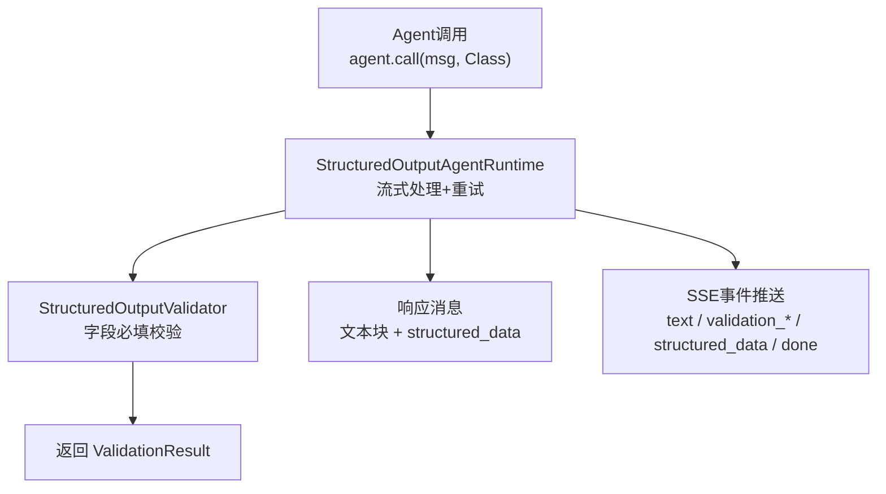
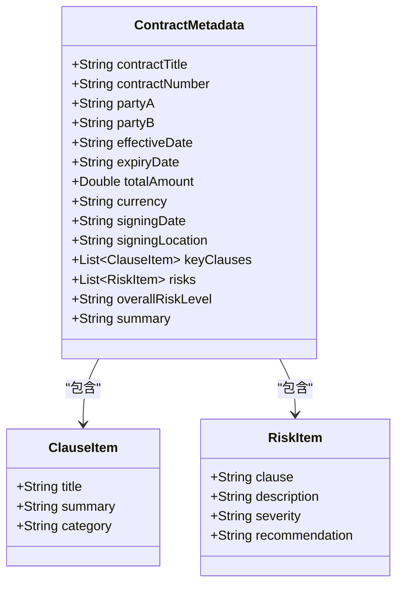
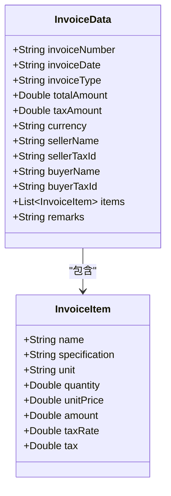
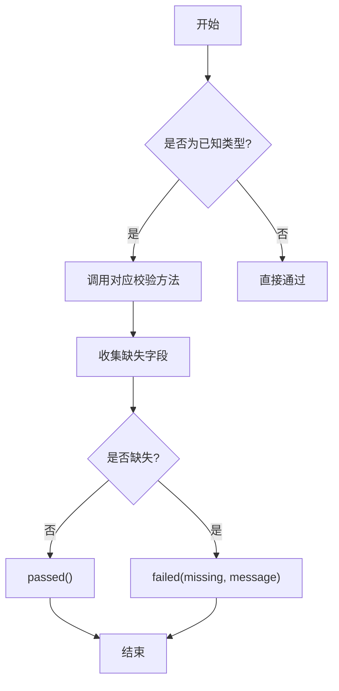
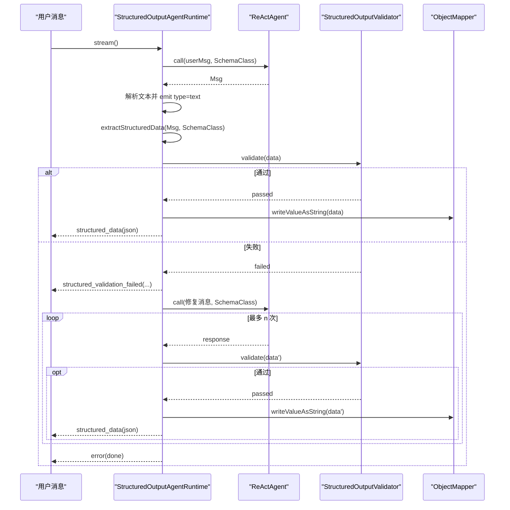
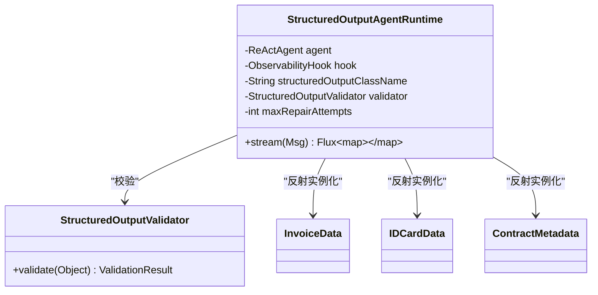
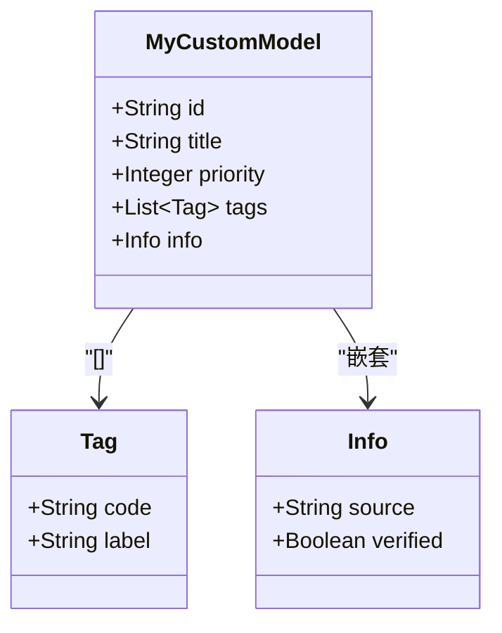

# 结构化输出配置

<cite>
**本文引用的文件**   
- [ContractMetadata.java](file://src/main/java/com/skloda/agentscope/schema/ContractMetadata.java)
- [IDCardData.java](file://src/main/java/com/skloda/agentscope/schema/IDCardData.java)
- [InvoiceData.java](file://src/main/java/com/skloda/agentscope/schema/InvoiceData.java)
- [StructuredOutputValidator.java](file://src/main/java/com/skloda/agentscope/runtime/StructuredOutputValidator.java)
- [StructuredOutputAgentRuntime.java](file://src/main/java/com/skloda/agentscope/runtime/StructuredOutputAgentRuntime.java)
- [BankInvoiceTool.java](file://src/main/java/com/skloda/agentscope/tool/BankInvoiceTool.java)
- [AgentScopeDemoApplication.java](file://src/main/java/com/skloda/agentscope/AgentScopeDemoApplication.java)
- [ContractMetadataTest.java](file://src/test/java/com/skloda/agentscope/schema/ContractMetadataTest.java)
- [IDCardDataTest.java](file://src/test/java/com/skloda/agentscope/schema/IDCardDataTest.java)
- [InvoiceDataTest.java](file://src/test/java/com/skloda/agentscope/schema/InvoiceDataTest.java)
- [StructuredOutputValidatorTest.java](file://src/test/java/com/skloda/agentscope/runtime/StructuredOutputValidatorTest.java)
</cite>

## 目录
1. [简介](#简介)
2. [项目结构](#项目结构)
3. [核心组件](#核心组件)
4. [架构总览](#架构总览)
5. [详细组件分析](#详细组件分析)
6. [依赖关系分析](#依赖关系分析)
7. [性能与容错](#性能与容错)
8. [故障排查指南](#故障排查指南)
9. [结论](#结论)
10. [附录：自定义数据模型与最佳实践](#附录自定义数据模型与最佳实践)

## 简介
本文件面向“结构化输出”能力，系统性说明如何在 Agent 运行时以 Java POJO 形式定义并校验结构化结果；解释字段校验规则、默认内置数据模型的语义与用法；描述序列化机制、事件流以及修复重试流程。同时提供扩展指南，帮助你在项目中添加新的结构化模型（包含复杂嵌套、数组、枚举等）。

## 项目结构
围绕“结构化输出”，仓库关键位置如下：
- 结构化模型定义：src/main/java/.../schema/*.java
- 运行时与校验器：src/main/java/.../runtime/StructuredOutput*
- 使用示例（发票工具）：src/main/java/.../tool/BankInvoiceTool.java
- 应用入口与装配（供参考）：src/main/java/.../AgentScopeDemoApplication.java
- 用例测试：src/test/java/.../*Test.java



**图表来源**
- [StructuredOutputAgentRuntime.java:52-136](file://src/main/java/com/skloda/agentscope/runtime/StructuredOutputAgentRuntime.java#L52-L136)
- [StructuredOutputValidator.java:16-98](file://src/main/java/com/skloda/agentscope/runtime/StructuredOutputValidator.java#L16-L98)

**章节来源**
- [StructuredOutputAgentRuntime.java:22-50](file://src/main/java/com/skloda/agentscope/runtime/StructuredOutputAgentRuntime.java#L22-L50)
- [StructuredOutputValidator.java:11-30](file://src/main/java/com/skloda/agentscope/runtime/StructuredOutputValidator.java#L11-L30)

## 核心组件
- 运行时：StructuredOutputAgentRuntime
  - 负责通过 agent.call(request, SchemaClass) 获取 typed 结构化结果
  - 将文本内容与 structured_data 以 SSE 事件形式推送
  - 基于校验失败的信息生成“修复提示”，进行有限次数重试
- 校验器：StructuredOutputValidator
  - 对 InvoiceData、IDCardData、ContractMetadata 三类内置模型执行“必填字段”校验
  - 支持“缺失集合为空”的校验
  - 统一返回 ValidationResult（valid、missingFields、message）

**章节来源**
- [StructuredOutputAgentRuntime.java:52-136](file://src/main/java/com/skloda/agentscope/runtime/StructuredOutputAgentRuntime.java#L52-L136)
- [StructuredOutputValidator.java:16-98](file://src/main/java/com/skloda/agentscope/runtime/StructuredOutputValidator.java#L16-L98)

## 架构总览
结构化输出端到端流程（简化时序）：

```mermaid
sequenceDiagram
  participant Client as "客户端"
  participant RT as "StructuredOutputAgentRuntime"
  participant AG as "ReActAgent"
  participant VAL as "StructuredOutputValidator"
  participant Sink as "EventSink/Flux"

  Client->>RT: stream(userMsg)
  RT->>AG: call(userMsg, SchemaClass).block()
  AG-->>RT: Msg(response)
  RT->>RT: extractStructuredData(response, SchemaClass)
  RT->>VAL: validate(structuredData)
  alt 首次即通过
    VAL-->>RT: ValidationResult(passed)
    RT-->>Client: text(content blocks)
    RT-->>Client: structured_validation_passed(schemaClass, attempt=0)
    RT-->>Client: structured_data(json of POJO)
    RT-->>Client: done
  else 首次未通过或无structured数据
    VAL-->>RT: ValidationResult(failed, missingFields)
    RT-->>Client: structured_validation_failed(...)
    RT->>AG: call(repairMessage(...), SchemaClass).block()
    loop 最多 maxRepairAttempts 次
      AG-->>RT: response'
      RT->>VAL: validate(...)
      alt 后续尝试通过
        VAL-->>RT: passed
        RT-->>Client: structured_repair_start(...) (在上一次失败前广播)
        RT-->>Client: structured_data(json)
        RT-->>Client: done
      else 仍失败
        VAL-->>RT: failed
        RT-->>Client: structured_validation_failed(...)
      end
    end
    if 仍未通过
      RT-->>Client: error(message)
      RT-->>Client: done
    end
  end
```

**图表来源**
- [StructuredOutputAgentRuntime.java:52-136](file://src/main/java/com/skloda/agentscope/runtime/StructuredOutputAgentRuntime.java#L52-L136)
- [StructuredOutputValidator.java:16-98](file://src/main/java/com/skloda/agentscope/runtime/StructuredOutputValidator.java#L16-L98)

## 详细组件分析

### 结构化模型：ContractMetadata（合同元数据）
- 用途：抽取合同关键元信息、重点条款及风险点，并给出整体风险评估与摘要
- 结构与要点
  - 基础字段：合同标题、编号、双方、生效/到期/签署日期地点、币种、总金额、总结
  - 列表字段：keyClauses（条款项）、risks（风险项）
  - 枚举含义：overallRiskLevel 与 riskItem.severity 均采用 LEVEL 语义（LOW/MEDIUM/HIGH/CRITICAL）
  - 嵌套类型：ClauseItem（title、summary、category），RiskItem（clause、description、severity、recommendation）
- 典型场景：合同文档解析后形成结构化报告，供审查与归档



**图表来源**
- [ContractMetadata.java:8-43](file://src/main/java/com/skloda/agentscope/schema/ContractMetadata.java#L8-L43)

**章节来源**
- [ContractMetadata.java:8-43](file://src/main/java/com/skloda/agentscope/schema/ContractMetadata.java#L8-L43)
- [ContractMetadataTest.java:12-156](file://src/test/java/com/skloda/agentscope/schema/ContractMetadataTest.java#L12-L156)

### 结构化模型：IDCardData（身份证数据）
- 用途：从图像或表单提取身份证号、姓名等身份信息
- 关键字段：name、gender、ethnicity、birthDate、address、idNumber、issuingAuthority、validPeriod、side（front/back）
- 典型场景：OCR后结构化入库、实名制核验前置清洗

**章节来源**
- [IDCardData.java:6-19](file://src/main/java/com/skloda/agentscope/schema/IDCardData.java#L6-L19)
- [IDCardDataTest.java:10-57](file://src/test/java/com/skloda/agentscope/schema/IDCardDataTest.java#L10-L57)

### 结构化模型：InvoiceData（发票数据）
- 用途：票据要素结构化（发票号、日期、税额、销售方/购买方信息及明细行）
- 关键字段：invoiceNumber、invoiceDate、invoiceType、totalAmount、taxAmount、currency、sellerName、sellerTaxId、buyerName、buyerTaxId、items（明细列表）、remarks
- 典型场景：OCR/PDF解析后生成标准化发票记录，对接财务系统



**图表来源**
- [InvoiceData.java:8-37](file://src/main/java/com/skloda/agentscope/schema/InvoiceData.java#L8-L37)

**章节来源**
- [InvoiceData.java:8-37](file://src/main/java/com/skloda/agentscope/schema/InvoiceData.java#L8-L37)
- [InvoiceDataTest.java:12-98](file://src/test/java/com/skloda/agentscope/schema/InvoiceDataTest.java#L12-L98)

### 校验器：StructuredOutputValidator
- 行为说明
  - 识别类型：InvoiceData、IDCardData、ContractMetadata
  - 校验策略：必须存在且满足类型的字段；集合不能为空；部分数值类字段要求非空
  - 结果：ValidationResult（valid、missingFields、message）
- 可观测性：在校验失败时暴露缺失字段名，便于修复



**图表来源**
- [StructuredOutputValidator.java:16-98](file://src/main/java/com/skloda/agentscope/runtime/StructuredOutputValidator.java#L16-L98)

**章节来源**
- [StructuredOutputValidator.java:16-98](file://src/main/java/com/skloda/agentscope/runtime/StructuredOutputValidator.java#L16-L98)
- [StructuredOutputValidatorTest.java:13-52](file://src/test/java/com/skloda/agentscope/runtime/StructuredOutputValidatorTest.java#L13-L52)

### 运行时：StructuredOutputAgentRuntime
- 关键职责
  - 通过反射加载 schema 类名
  - 调用 agent.call(request, schemaClass) 获取 typed 结果
  - 将文本片段以 type=text 的事件推送
  - 对 structured_data 调用 Validator 校验，根据结果发出 structured_validation_passed/failed、structured_repair_start、error、done 等事件
  - 成功时将对象序列化为 JSON，以 type=structured_data 事件下发
  - 在最后一次校验失败时发出 error 并关闭流



**图表来源**
- [StructuredOutputAgentRuntime.java:52-136](file://src/main/java/com/skloda/agentscope/runtime/StructuredOutputAgentRuntime.java#L52-L136)
- [StructuredOutputValidator.java:16-98](file://src/main/java/com/skloda/agentscope/runtime/StructuredOutputValidator.java#L16-L98)

**章节来源**
- [StructuredOutputAgentRuntime.java:52-136](file://src/main/java/com/skloda/agentscope/runtime/StructuredOutputAgentRuntime.java#L52-L136)

## 依赖关系分析
- StructuredOutputAgentRuntime 依赖：
  - ReActAgent（通过 agentscope-core 的 call 接口）
  - ObservabilityHook（事件合并与完成控制）
  - ObjectMapper（POJO→JSON）
  - StructuredOutputValidator（校验）
- Validator 与 POJO 的关系：
  - 通过 instanceof 匹配已支持的三个模型并分别校验
  - 对未知类型默认通过（可扩展）



**图表来源**
- [StructuredOutputAgentRuntime.java:22-49](file://src/main/java/com/skloda/agentscope/runtime/StructuredOutputAgentRuntime.java#L22-L49)
- [StructuredOutputValidator.java:16-30](file://src/main/java/com/skloda/agentscope/runtime/StructuredOutputValidator.java#L16-L30)

**章节来源**
- [StructuredOutputAgentRuntime.java:22-49](file://src/main/java/com/skloda/agentscope/runtime/StructuredOutputAgentRuntime.java#L22-L49)

## 性能与容错
- 流式处理：文本内容尽早发出，降低前端等待延迟
- 轻量校验：仅做必需字段的非空/非空集合判断，开销低
- 自动修复：当字段缺失时构造修复提示，再次请求模型补齐
- 超时与错误：校验失败超过上限会返回 error 并完成流；ClassNotFoundException 等异常也会安全终止流

[本节为通用性能建议与流程解读]

## 故障排查指南
- 常见问题定位
  - 模型类不存在：检查 structuredOutputClassName 是否正确加载
  - 校验失败：关注 structured_validation_failed 中的 missingFields
  - 修复失败：确认修复消息是否正确传递了缺失字段提示
- 日志与事件
  - 通过 eventSink 合并的 flux 观察文本与结构化数据事件顺序
  - 若长时间无 structured_data，检查是否存在异常或模型未返回结构化结果

**章节来源**
- [StructuredOutputAgentRuntime.java:102-131](file://src/main/java/com/skloda/agentscope/runtime/StructuredOutputAgentRuntime.java#L102-L131)

## 结论
本方案以 POJO 作为结构化契约，结合运行时反射与轻量校验，实现“可观测、可修复、可复用”的结构化输出管线。内置合同/身份证/发票三类常用模型可满足多数业务场景；同时提供了清晰的扩展路径来新增模型与校验逻辑。

[本节总结不引用具体代码]

## 附录：自定义数据模型与最佳实践

### 定义新模型类
- 新建一个 POJO，包含所有业务字段；使用基础类型、集合或内嵌类表达复杂结构
- 保持无参构造（用于反序列化），字段可为 public 以便 Jackson 填充



[该图为概念示意，不对应现有具体类]

### 注册到校验器（新增类型分支）
- 在 StructuredOutputValidator.validate(Object) 中添加 instanceof 分支
- 编写专门的 requireText/requireNumber/requireCollection 调用组合
- 通过单元测试验证缺失字段与边界情况

**章节来源**
- [StructuredOutputValidator.java:16-30](file://src/main/java/com/skloda/agentscope/runtime/StructuredOutputValidator.java#L16-L30)

### @Schema 注解的使用说明
- 项目当前未启用 JSR-303 Bean Validation（如 javax.validation.constraints.*），也未使用 jakarta.validation.constraints 或 swagger 的 @Schema 约束
- 因此，字段约束主要通过 StructuredOutputValidator 中的“非空/非空集合”校验实现
- 若未来引入 JSR-303，可将“必填性验证”“类型约束”统一映射到注解级别，再由校验器转换
- 关于正则表达式：本项目当前未实现基于注解的正则校验逻辑；如需增强，可在 Validator 中增加模式匹配方法

[本小节为基于代码现状的分析与建议]

### 序列化机制与数据转换
- 运行时使用 ObjectMapper 将 POJO 序列化为 JSON，通过 structured_data 事件推送
- 若结构化数据为空或未从响应中解析出来，将不会发出 structured_data，仅发出 error/done
- 建议在业务层对 structured_data 的 JSON 再做二次校验，避免上游模型输出不一致导致下游出错

**章节来源**
- [StructuredOutputAgentRuntime.java:105-111](file://src/main/java/com/skloda/agentscope/runtime/StructuredOutputAgentRuntime.java#L105-L111)

### 复杂嵌套、数组、枚举的最佳实践
- 嵌套对象：拆分为独立静态内嵌类，提高可读性与复用性
- 数组/集合：明确必填场景（如 keyClauses、risks），在 Validator 中 enforce 非空集合
- 枚举：使用 String 承载固定取值，在注释或测试中限定合法值；如需严格限制，可在 Validator 中添加白名单校验
- 命名一致性：保持前后端一致的结构定义，避免歧义

[本节为实践指导，不直接引用具体文件]

### 参考使用案例
- 发票模板生成工具展示了如何使用工具参数驱动业务，并可类比到结构化输出落地：先生成结构化数据，再写入模板
- 通过 BankInvoiceTool 可以了解如何将数据填入文件模板并在文件系统落盘

**章节来源**
- [BankInvoiceTool.java:49-96](file://src/main/java/com/skloda/agentscope/tool/BankInvoiceTool.java#L49-L96)
- [BankInvoiceTool.java:111-164](file://src/main/java/com/skloda/agentscope/tool/BankInvoiceTool.java#L111-L164)

### 相关配置说明：structuredOutputClass 属性
- 运行时需要传入结构化输出的类全名（structuredOutputClassName），运行时通过反射加载并用于：
  - 调用 agent.call(request, schemaClass)
  - 构建修复消息时携带类名提示
  - 推发 structured_validation_passed/failed/structured_data 事件中附带 schemaClass
- 典型装配位置请参考主应用入口与 Agent 装配链路，确保每个具备结构化输出的 Agent 都绑定对应的 SchemaClass

**章节来源**
- [StructuredOutputAgentRuntime.java:28-49](file://src/main/java/com/skloda/agentscope/runtime/StructuredOutputAgentRuntime.java#L28-L49)
- [StructuredOutputAgentRuntime.java:52-79](file://src/main/java/com/skloda/agentscope/runtime/StructuredOutputAgentRuntime.java#L52-L79)