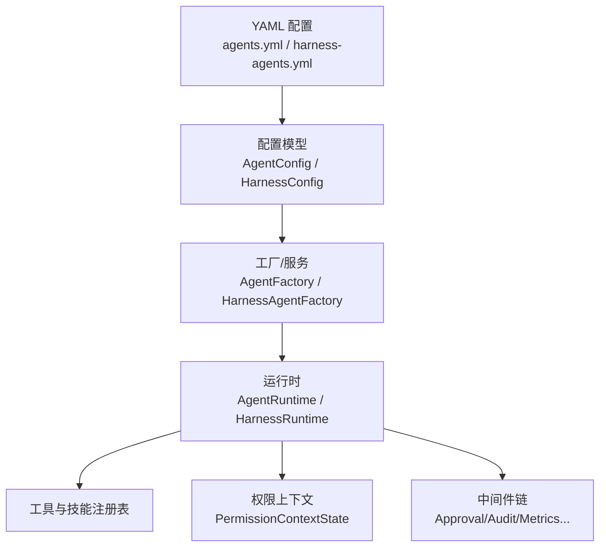
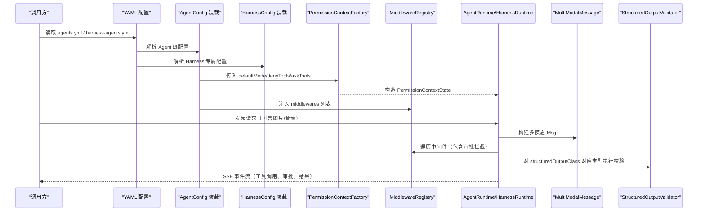
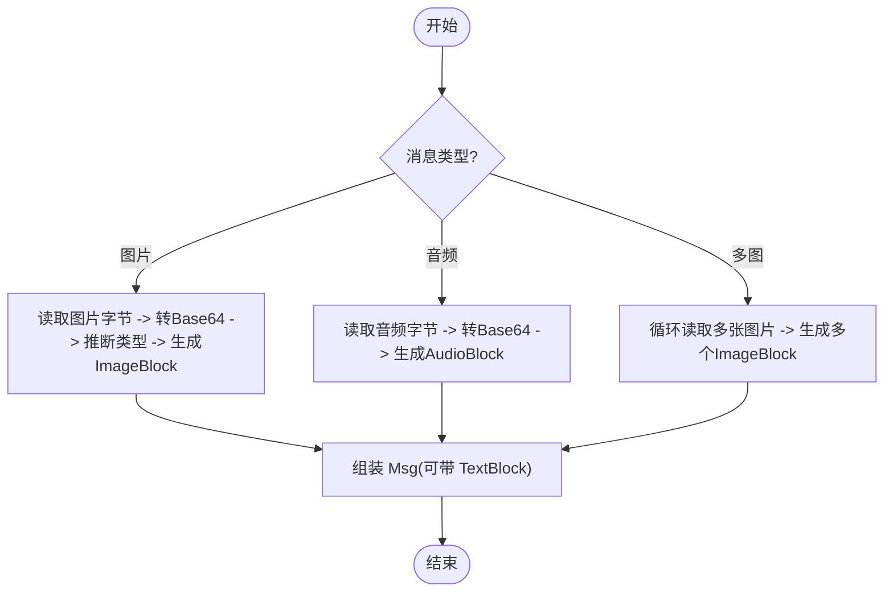
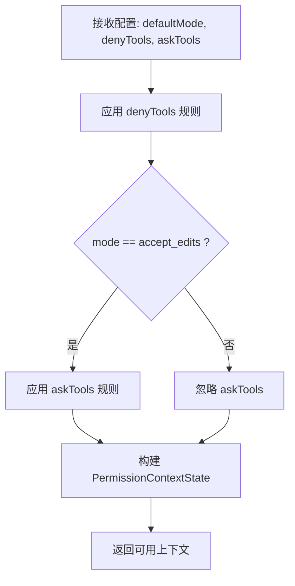
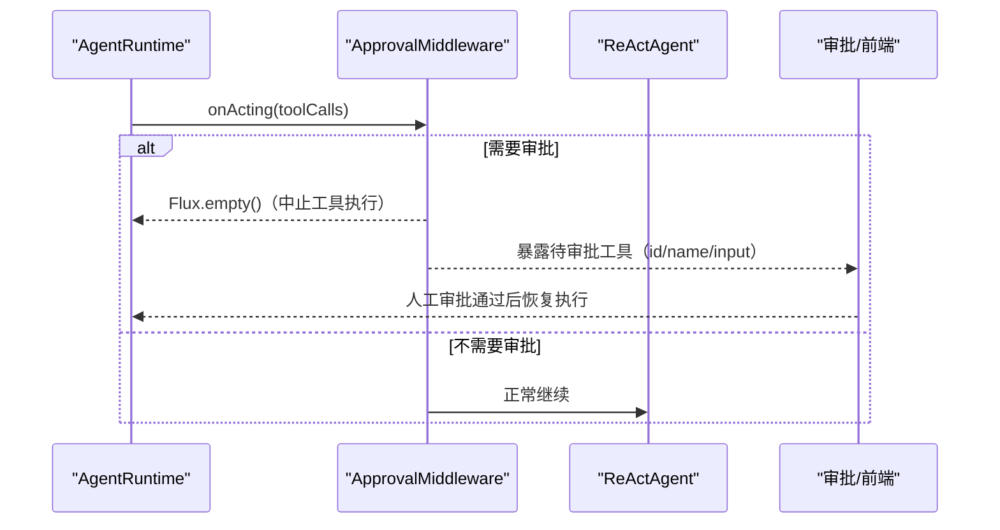
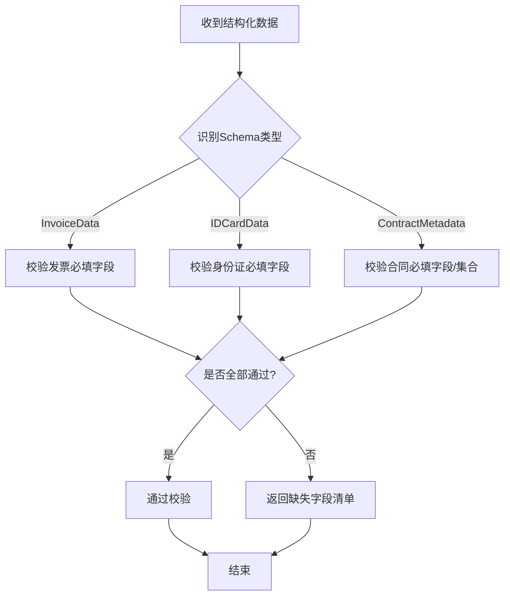
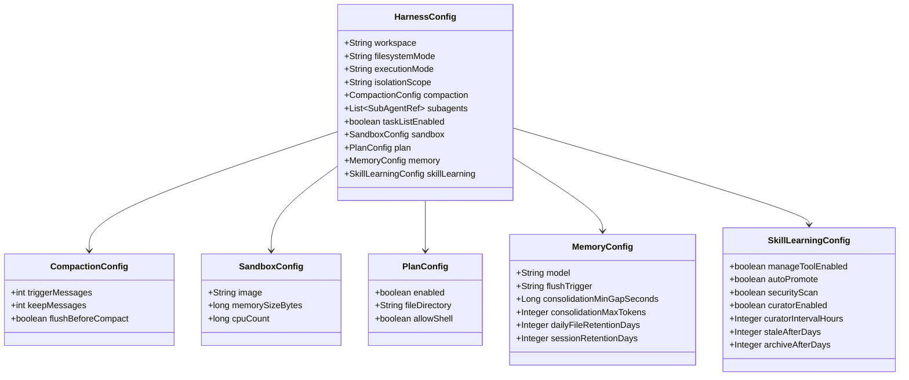
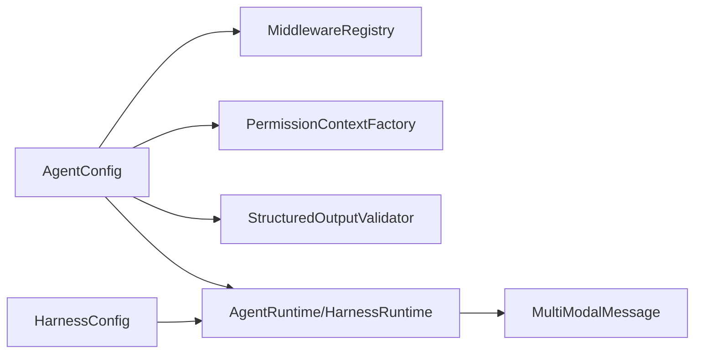

# 高级配置

<cite>
**本文引用的文件列表**
- [AgentConfig.java](file://src/main/java/com/skloda/agentscope/agent/AgentConfig.java)
- [HarnessConfig.java](file://src/main/java/com/skloda/agentscope/agent/HarnessConfig.java)
- [MultiModalMessage.java](file://src/main/java/com/skloda/agentscope/model/MultiModalMessage.java)
- [ApprovalMiddleware.java](file://src/main/java/com/skloda/agentscope/middleware/ApprovalMiddleware.java)
- [MiddlewareRegistry.java](file://src/main/java/com/skloda/agentscope/middleware/MiddlewareRegistry.java)
- [PermissionContextFactory.java](file://src/main/java/com/skloda/agentscope/permission/PermissionContextFactory.java)
- [StructuredOutputValidator.java](file://src/main/java/com/skloda/agentscope/runtime/StructuredOutputValidator.java)
- [agents.yml](file://src/main/resources/config/agents.yml)
- [harness-agents.yml](file://src/main/resources/config/harness-agents.yml)
</cite>

## 目录
1. [简介](#简介)
2. [项目结构](#项目结构)
3. [核心组件](#核心组件)
4. [架构总览](#架构总览)
5. [详细组件分析](#详细组件分析)
6. [依赖分析](#依赖分析)
7. [性能考量](#性能考量)
8. [故障排查指南](#故障排查指南)
9. [结论](#结论)
10. [附录：配置示例与最佳实践](#附录配置示例与最佳实践)

## 简介
本章节面向希望精细化控制 Agent 行为的高级用户，系统阐述以下高级配置主题：
- 多模态设置：modality（text/vision/audio）与多模态消息处理机制
- 权限控制：PermissionConfig.defaultMode、denyTools、askTools 的作用域与优先级
- 中间件：middlewares 列表装配、审批流程与扩展点
- 结构化输出：structuredOutputClass 的定义与校验链路
- Harness 专属：workspace、filesystemMode、executionMode、sandbox 等资源限制与执行上下文
- 复杂场景示例：协作型 Agent 与多智能体工作流的高级配置选项

## 项目结构
本仓库以“配置即能力”为核心：通过 YAML 描述每个 Agent 的运行策略，由工厂类将其转化为运行时对象。关键路径如下：
- 配置定义：agents.yml、harness-agents.yml
- 配置模型：AgentConfig、HarnessConfig 及其嵌套结构（PermissionConfig、SandboxConfig、MemoryConfig 等）
- 运行时装配：根据配置动态创建 AgentRuntime、HarnessAgent、Middleware 链、权限上下文等

图表来源
- [agents.yml:1-200](file://src/main/resources/config/agents.yml#L1-L200)
- [harness-agents.yml:1-120](file://src/main/resources/config/harness-agents.yml#L1-L120)
- [AgentConfig.java:13-106](file://src/main/java/com/skloda/agentscope/agent/AgentConfig.java#L13-L106)
- [HarnessConfig.java:11-133](file://src/main/java/com/skloda/agentscope/agent/HarnessConfig.java#L11-L133)

小节来源
- [AgentConfig.java:13-106](file://src/main/java/com/skloda/agentscope/agent/AgentConfig.java#L13-L106)
- [HarnessConfig.java:11-133](file://src/main/java/com/skloda/agentscope/agent/HarnessConfig.java#L11-L133)
- [agents.yml:1-200](file://src/main/resources/config/agents.yml#L1-L200)
- [harness-agents.yml:1-120](file://src/main/resources/config/harness-agents.yml#L1-L120)

## 核心组件
- 多模态消息构建器：支持文本+图像、文本+音频、多图等组合
- 权限上下文构建器：将 defaultMode/denyTools/askTools 转化为可执行的权限规则
- 中间件系统：内置审计、限流、指标收集、追踪及可插拔的审批中间件
- 结构化输出校验：将 LLM 返回的结构化数据映射到 Java Schema 并进行必填项校验
- Harness 专属配置：工作区、文件系统模式、执行模式、沙箱资源、分层记忆、计划模式等

小节来源
- [MultiModalMessage.java:20-172](file://src/main/java/com/skloda/agentscope/model/MultiModalMessage.java#L20-L172)
- [PermissionContextFactory.java:9-39](file://src/main/java/com/skloda/agentscope/permission/PermissionContextFactory.java#L9-L39)
- [ApprovalMiddleware.java:22-124](file://src/main/java/com/skloda/agentscope/middleware/ApprovalMiddleware.java#L22-L124)
- [MiddlewareRegistry.java:12-55](file://src/main/java/com/skloda/agentscope/middleware/MiddlewareRegistry.java#L12-L55)
- [StructuredOutputValidator.java:14-99](file://src/main/java/com/skloda/agentscope/runtime/StructuredOutputValidator.java#L14-L99)
- [HarnessConfig.java:11-133](file://src/main/java/com/skloda/agentscope/agent/HarnessConfig.java#L11-L133)

## 架构总览
下图展示了从配置到运行时的一条完整路径，涵盖多模态、权限、中间件与结构化输出的关键接入点。

图表来源
- [AgentConfig.java:13-106](file://src/main/java/com/skloda/agentscope/agent/AgentConfig.java#L13-L106)
- [HarnessConfig.java:11-133](file://src/main/java/com/skloda/agentscope/agent/HarnessConfig.java#L11-L133)
- [PermissionContextFactory.java:9-39](file://src/main/java/com/skloda/agentscope/permission/PermissionContextFactory.java#L9-L39)
- [MiddlewareRegistry.java:12-55](file://src/main/java/com/skloda/agentscope/middleware/MiddlewareRegistry.java#L12-L55)
- [MultiModalMessage.java:20-172](file://src/main/java/com/skloda/agentscope/model/MultiModalMessage.java#L20-L172)
- [StructuredOutputValidator.java:14-99](file://src/main/java/com/skloda/agentscope/runtime/StructuredOutputValidator.java#L14-L99)

## 详细组件分析

### 多模态设置：modality 与消息处理
- modality 字段用于声明 Agent 期望的消息类型，可选 text、vision、audio。该字段影响上层对输入/输出的处理能力选择与 UI 分组（category 可结合 single/expert/collaboration）。
- 多模态消息通过 MultiModalMessage 统一构建：
  - 图片：读取本地路径文件转 Base64，自动推断媒体类型（png/jpeg/gif/webp），组装 TextBlock 与 ImageBlock
  - 音频：读取本地音频文件转 Base64，生成 AudioBlock
  - 多图：批量追加多个 ImageBlock
  - 异常回退：文件读取失败时降级为纯文本并附加错误信息
- 典型使用入口在上传与发送消息的路径中；UI 层负责选择/携带文件元数据，服务端组装多模态内容后交给下游 Agent。

图表来源
- [MultiModalMessage.java:20-172](file://src/main/java/com/skloda/agentscope/model/MultiModalMessage.java#L20-L172)

小节来源
- [AgentConfig.java:42-46](file://src/main/java/com/skloda/agentscope/agent/AgentConfig.java#L42-L46)
- [MultiModalMessage.java:20-172](file://src/main/java/com/skloda/agentscope/model/MultiModalMessage.java#L20-L172)

### 权限控制配置：defaultMode / denyTools / askTools
- defaultMode：默认权限模式，常见值包括 bypass（绕过）、deny（拒绝）、ask（询问）等。当未显式配置或为空时采用框架默认值。
- denyTools：被明确拒绝的工具名集合，无论 defaultMode 为何都直接拒绝。
- askTools：需要人机交互确认的工具集合。当前权限上下文构建逻辑在“accept_edits”模式下应用 askTools 问审规则；其他模式下 denyTools 始终生效。
- 权限上下文由 PermissionContextFactory.build 组装，内部将 denyTools/askTools 转换为具体 PermissionRule，加入 PermissionContextState。

图表来源
- [PermissionContextFactory.java:9-39](file://src/main/java/com/skloda/agentscope/permission/PermissionContextFactory.java#L9-L39)
- [harness-agents.yml:11-43](file://src/main/resources/config/harness-agents.yml#L11-L43)

小节来源
- [AgentConfig.java:91-106](file://src/main/java/com/skloda/agentscope/agent/AgentConfig.java#L91-L106)
- [PermissionContextFactory.java:9-39](file://src/main/java/com/skloda/agentscope/permission/PermissionContextFactory.java#L9-L39)
- [harness-agents.yml:11-43](file://src/main/resources/config/harness-agents.yml#L11-L43)

### 中间件配置与审批流程
- middlewares：AgentConfig 中的字符串列表，指定要启用的中间件名称。MiddlewareRegistry 负责在启动时自动注册一系列内置中间件（审计、限流、指标、追踪等），并按名称实例化。
- ApprovalMiddleware：拦截工具调用阶段（onActing），若触发审批条件（approvalRequired 或 tool 命中 approvalTools），则清空后续事件流，阻止工具实际执行，并向外部暴露待审批工具列表，供前端或审批流程消费。
- 典型用途：涉及敏感操作的工具（如写文件、执行 shell、生成报告等）可开启审批开关，实现人在回路。

图表来源
- [ApprovalMiddleware.java:22-124](file://src/main/java/com/skloda/agentscope/middleware/ApprovalMiddleware.java#L22-L124)
- [MiddlewareRegistry.java:12-55](file://src/main/java/com/skloda/agentscope/middleware/MiddlewareRegistry.java#L12-L55)
- [agents.yml:92-170](file://src/main/resources/config/agents.yml#L92-L170)

小节来源
- [AgentConfig.java:81-95](file://src/main/java/com/skloda/agentscope/agent/AgentConfig.java#L81-L95)
- [ApprovalMiddleware.java:22-124](file://src/main/java/com/skloda/agentscope/middleware/ApprovalMiddleware.java#L22-L124)
- [MiddlewareRegistry.java:12-55](file://src/main/java/com/skloda/agentscope/middleware/MiddlewareRegistry.java#L12-L55)

### 结构化输出配置：structuredOutputClass 与数据校验
- 通过 AgentConfig.structuredOutputClass 声明结构化输出类型，运行时将该类型交由 StructuredOutputValidator 进行字段约束校验。
- 校验逻辑针对已知 Schema 类型（如发票、身份证、合同等）逐项检查必填字段、数量类型等，并汇总缺失字段信息；校验结果以记录形式返回，便于上层决定是否继续流程或提示补全。
- 建议：为新业务新增结构化输出时，同步完善 Validator 的分支校验逻辑，确保边界条件（空值/空集合/数值缺失）都被覆盖。

图表来源
- [StructuredOutputValidator.java:14-99](file://src/main/java/com/skloda/agentscope/runtime/StructuredOutputValidator.java#L14-L99)

小节来源
- [AgentConfig.java:52-54](file://src/main/java/com/skloda/agentscope/agent/AgentConfig.java#L52-L54)
- [StructuredOutputValidator.java:14-99](file://src/main/java/com/skloda/agentscope/runtime/StructuredOutputValidator.java#L14-L99)

### Harness 特有配置：workSpace / filesystemMode / executionMode / sandbox
- workspace：Agent 的工作空间根路径，常用于保存计划、记忆、子 Agent 状态、临时产物等。
- filesystemMode：文件系统访问模式，支持 LOCAL 与 DOCKER。DOCKer 模式通常与沙箱隔离搭配使用。
- executionMode：执行模式，支持 CLAW（命令/脚本驱动）与 BUILDER（增量构建/编译工作流）。isBuilderMode()/isDockerMode() 提供便捷判断。
- isolationScope：隔离范围（例如 USER 级别），配合 Builder 多租户隔离。
- sandbox：沙箱资源上限，如镜像、内存、CPU 配额等，用于安全隔离重度任务。
- 其他 Harness 能力：compaction（压缩策略）、memory（分层记忆）、plan（计划模式）、skillLearning（技能自学习）等，详见下方附录。

图表来源
- [HarnessConfig.java:11-133](file://src/main/java/com/skloda/agentscope/agent/HarnessConfig.java#L11-L133)

小节来源
- [HarnessConfig.java:11-133](file://src/main/java/com/skloda/agentscope/agent/HarnessConfig.java#L11-L133)
- [harness-agents.yml:11-120](file://src/main/resources/config/harness-agents.yml#L11-L120)

## 依赖分析
- AgentConfig 依赖：MCP 引用、工具组、子 Agent、循环/状态图、共享黑板与路由配置、HarnessConfig、权限与会话配置、中间件列表等。
- 运行时依赖：中间件链按名称加载；权限上下文在 Agent/Harness 创建时注入；结构化校验在返回阶段执行；多模态在入站消息时构建。
- 潜在耦合点：
  - middleware 名称必须于 MiddlewareRegistry 中存在且匹配
  - structuredOutputClass 必须与现有校验器支持类型一致
  - PermissionConfig.askTools 仅在特定模式下生效（需结合业务语义理解）

图表来源
- [AgentConfig.java:68-106](file://src/main/java/com/skloda/agentscope/agent/AgentConfig.java#L68-L106)
- [HarnessConfig.java:11-133](file://src/main/java/com/skloda/agentscope/agent/HarnessConfig.java#L11-L133)

小节来源
- [AgentConfig.java:68-106](file://src/main/java/com/skloda/agentscope/agent/AgentConfig.java#L68-L106)
- [HarnessConfig.java:11-133](file://src/main/java/com/skloda/agentscope/agent/HarnessConfig.java#L11-L133)

## 性能考量
- 多模态：Base64 编码会放大传输体积，应控制图片/音频大小，合理选择格式；大图建议上传到服务器后再以路径传递。
- 中间件：审计与指标收集在高并发下可能引入 I/O 开销，可针对热点链路选择性启用。
- 结构化校验：集中处理校验失败，减少重复无效推理；必要时缓存 Schema 解析结果。
- Harness 沙箱：为重型任务分配足够的内存/CPU，避免频繁崩溃；压缩策略避免上下文膨胀导致延迟升高。
- 权限判断：deny 规则优先计算，可减少后续处理成本；将高风险工具集中在 deny/ask 管理。

## 故障排查指南
- 多模态图片/音频加载失败：检查文件路径与权限；关注日志中的加载错误分支；确认前端是否正确携带 filePath/fileName。
- 中间件不生效：确认 agents.yml 中 middlewares 的名称与 MiddlewareRegistry 注册名一致；检查命名拼写与顺序。
- 审批流程卡住：确认是否需要审批；查看 ApprovalMiddleware 暴露的 pendingToolCalls；在前端展示并引导完成审批。
- 结构化输出校验失败：根据返回的 missingFields 补全必填字段；核对 Schema 定义是否与上游输出结构一致。
- Harness 执行问题：检查 filesystemMode 与 sandbox 配置是否匹配；确认 workspace 是否存在且有写入权限；BUILDER 模式下是否具备必要编译环境。

小节来源
- [MultiModalMessage.java:20-172](file://src/main/java/com/skloda/agentscope/model/MultiModalMessage.java#L20-L172)
- [MiddlewareRegistry.java:12-55](file://src/main/java/com/skloda/agentscope/middleware/MiddlewareRegistry.java#L12-L55)
- [ApprovalMiddleware.java:22-124](file://src/main/java/com/skloda/agentscope/middleware/ApprovalMiddleware.java#L22-L124)
- [StructuredOutputValidator.java:14-99](file://src/main/java/com/skloda/agentscope/runtime/StructuredOutputValidator.java#L14-L99)

## 结论
通过本文档，您可以系统性掌握 Agent 的多模态、权限、中间件、结构化输出以及 Harness 专属配置的使用方式。建议在生产环境中：
- 对所有可变更状态的调用开启审批或权限问审
- 严格限定 denyTools，最小权限开放
- 合理使用多层记忆与上下文压缩，控制长对话开销
- 为高价值任务启用结构化输出与强校验，保证下游可靠性
- 在 Harness 中根据任务强度设置合理的沙箱资源与执行模式

## 附录：配置示例与最佳实践
以下示例仅给出结构要点，请结合实际业务调整。

- 协作型 Agent（含中间件与权限）
  - category: collaboration，type: ROUTING/HANDOFFS（如需 Supervisor/Shared Blackboard）
  - middlewares: 启用 audit-logging、metrics-collector、detailed-audit、otel-tracing
  - approvalRequired: true 或针对敏感工具列入 approvalTools
  - permissionConfig: defaultMode 设置为 deny 或 ask，denyTools 包含高危工具
- 多智能体工作流（Harness Builder 模式）
  - harnessConfig.executionMode: BUILDER
  - harnessConfig.filesystemMode: LOCAL 或 DOCKER（结合隔离 Scope）
  - harnessConfig.sandbox.image/memorySizeBytes/cpuCount 设定资源上限
  - harnessConfig.compaction 防止上下文膨胀
  - harnessConfig.memory.model/consolidationMinGapSeconds/consolidationMaxTokens 控制分层记忆写入频率与规模
  - harnessConfig.plan.enabled/fileDirectory/allowShell 控制计划模式
  - harnessConfig.skillLearning 控制技能自我学习与归档策略

小节来源
- [agents.yml:62-170](file://src/main/resources/config/agents.yml#L62-L170)
- [harness-agents.yml:1-120](file://src/main/resources/config/harness-agents.yml#L1-L120)
- [AgentConfig.java:62-95](file://src/main/java/com/skloda/agentscope/agent/AgentConfig.java#L62-L95)
- [HarnessConfig.java:11-133](file://src/main/java/com/skloda/agentscope/agent/HarnessConfig.java#L11-L133)