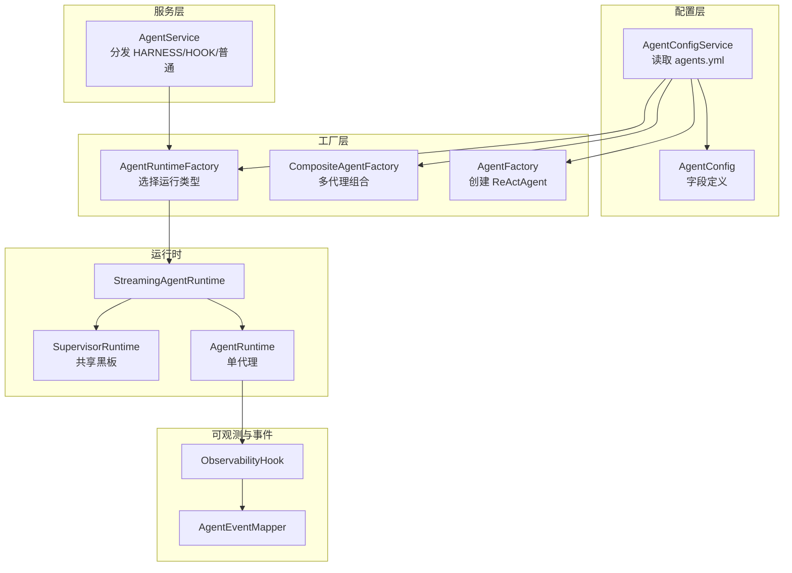
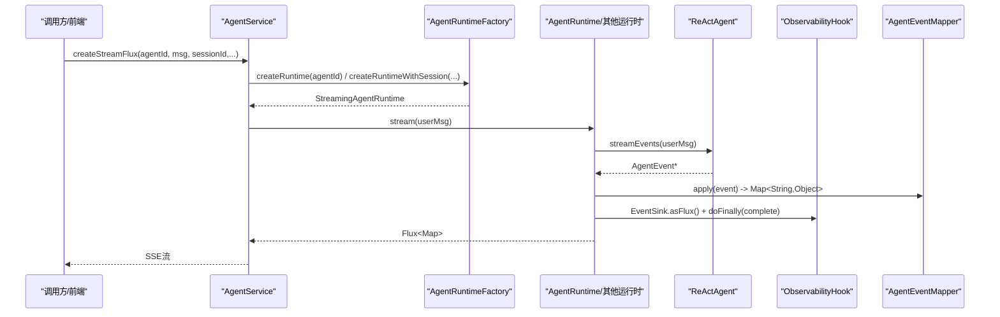
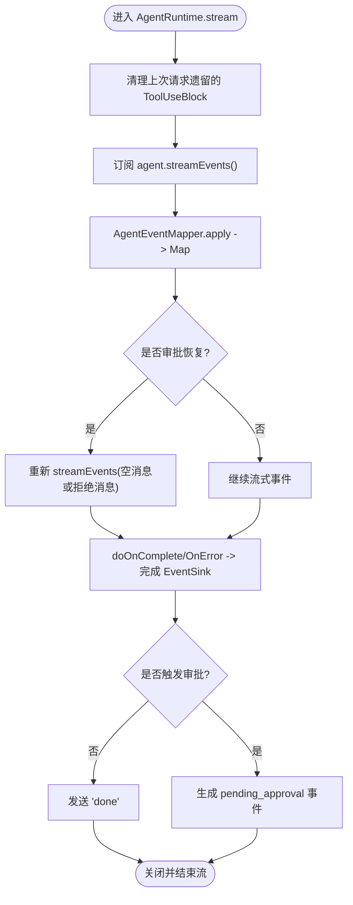
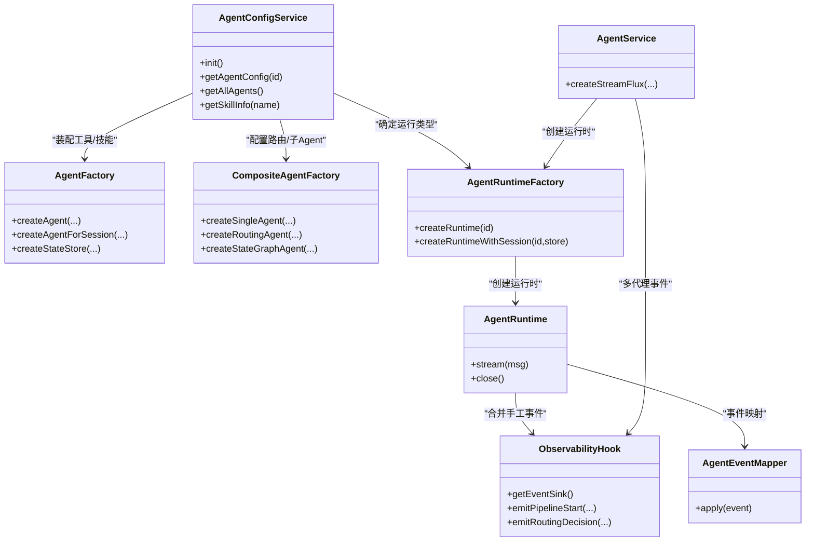
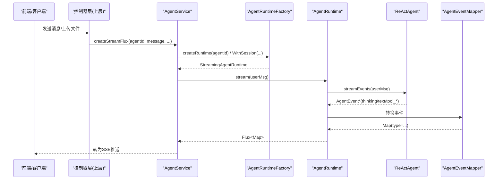
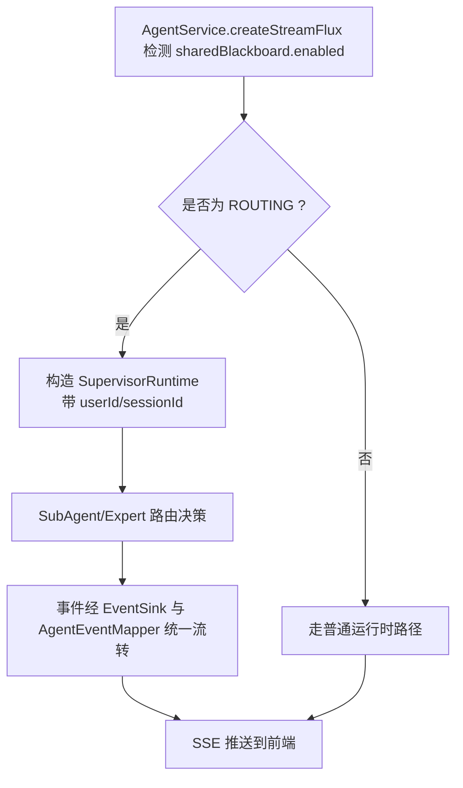

# 核心架构

<cite>
**本文引用的文件列表**
- [AgentConfig.java](file://src/main/java/com/skloda/agentscope/agent/AgentConfig.java)
- [AgentConfigService.java](file://src/main/java/com/skloda/agentscope/agent/AgentConfigService.java)
- [AgentFactory.java](file://src/main/java/com/skloda/agentscope/agent/AgentFactory.java)
- [AgentRuntime.java](file://src/main/java/com/skloda/agentscope/runtime/AgentRuntime.java)
- [AgentRuntimeFactory.java](file://src/main/java/com/skloda/agentscope/runtime/AgentRuntimeFactory.java)
- [StreamingAgentRuntime.java](file://src/main/java/com/skloda/agentscope/runtime/StreamingAgentRuntime.java)
- [AgentType.java](file://src/main/java/com/skloda/agentscope/agent/AgentType.java)
- [CompositeAgentFactory.java](file://src/main/java/com/skloda/agentscope/composite/CompositeAgentFactory.java)
- [AgentEventMapper.java](file://src/main/java/com/skloda/agentscope/runtime/AgentEventMapper.java)
- [ObservabilityHook.java](file://src/main/java/com/skloda/agentscope/hook/ObservabilityHook.java)
- [AgentService.java](file://src/main/java/com/skloda/agentscope/service/AgentService.java)
- [agents.yml](file://src/main/resources/config/agents.yml)
</cite>

## 目录
1. [引言](#引言)
2. [项目结构概览](#项目结构概览)
3. [核心组件总览](#核心组件总览)
4. [架构总览图](#架构总览图)
5. [详细组件分析](#详细组件分析)
6. [依赖关系与扩展点](#依赖关系与扩展点)
7. [性能与内存管理](#性能与内存管理)
8. [配置加载机制](#配置加载机制)
9. [数据流与控制流时序](#数据流与控制流时序)
10. [故障排查指南](#故障排查指南)
11. [结论与最佳实践](#结论与最佳实践)

## 引言
本仓库实现了一个基于 AgentScope（Java）的多模态、多代理演示系统，提供统一的 Agent 配置管理、工厂模式创建、运行时编排（单代理、路由、协作、状态图、消息总线等）、事件化流式输出和 HITL 审批。核心目标是为开发者提供一个可扩展、可观测、易配置的 Agent 框架基础，支持自定义 Agent、工具、中间件、MCP、权限、会话与记忆扩展。

## 项目结构概览
代码按领域分层组织：
- agent：配置模型、加载服务与单代理工厂
- runtime：运行时代码、事件映射、流式接口与多种运行时实现
- composite：多代理组合构建（路由、子代理、状态图等）
- harness：Harness 模式统一构建与运行时
- hook：可观测性与手动事件桥接
- service：HTTP 到运行时的编排（会话、工作流记录、HARNESS/HOOK/SUP 分流）
- tool、mcp、middleware、permission、model 等：横切能力

**图示来源**
- [AgentConfigService.java:32-76](file://src/main/java/com/skloda/agentscope/agent/AgentConfigService.java#L32-L76)
- [AgentFactory.java:131-200](file://src/main/java/com/skloda/agentscope/agent/AgentFactory.java#L131-L200)
- [AgentRuntimeFactory.java:41-60](file://src/main/java/com/skloda/agentscope/runtime/AgentRuntimeFactory.java#L41-L60)
- [AgentRuntime.java:67-141](file://src/main/java/com/skloda/agentscope/runtime/AgentRuntime.java#L67-L141)
- [ObservabilityHook.java:30-66](file://src/main/java/com/skloda/agentscope/hook/ObservabilityHook.java#L30-L66)
- [AgentService.java:131-176](file://src/main/java/com/skloda/agentscope/service/AgentService.java#L131-L176)

**部分来源**
- [AgentConfigService.java:32-76](file://src/main/java/com/skloda/agentscope/agent/AgentConfigService.java#L32-L76)
- [AgentRuntimeFactory.java:41-60](file://src/main/java/com/skloda/agentscope/runtime/AgentRuntimeFactory.java#L41-L60)

## 核心组件总览
- 配置模型：AgentConfig（含嵌套配置如 HarnessConfig、SharedBlackboardConfig、RoutingConfig、SessionConfig、PermissionConfig 等）
- 配置服务：AgentConfigService，启动时加载 agents.yml 与 harness-agents.yml
- 工厂：AgentFactory（单代理创建）、CompositeAgentFactory（多代理/路由/状态图）、AgentRuntimeFactory（根据 AgentType 选运行时）
- 运行时：StreamingAgentRuntime 为统一接口，默认实现为 AgentRuntime（单代理），另有 SupervisorRuntime 等
- 事件：ObservabilityHook 聚合人工事件；AgentEventMapper 将 AgentEvent 转成 SSE Map
- 服务：AgentService 负责会话、记录、以及 HARNESS/HOOK/SUP 分流

**部分来源**
- [AgentConfig.java:11-186](file://src/main/java/com/skloda/agentscope/agent/AgentConfig.java#L11-L186)
- [AgentConfigService.java:23-76](file://src/main/java/com/skloda/agentscope/agent/AgentConfigService.java#L23-L76)
- [AgentFactory.java:38-200](file://src/main/java/com/skloda/agentscope/agent/AgentFactory.java#L38-L200)
- [CompositeAgentFactory.java:33-190](file://src/main/java/com/skloda/agentscope/composite/CompositeAgentFactory.java#L33-L190)
- [AgentRuntimeFactory.java:21-105](file://src/main/java/com/skloda/agentscope/runtime/AgentRuntimeFactory.java#L21-L105)
- [AgentRuntime.java:26-141](file://src/main/java/com/skloda/agentscope/runtime/AgentRuntime.java#L26-L141)
- [AgentEventMapper.java:39-105](file://src/main/java/com/skloda/agentscope/runtime/AgentEventMapper.java#L39-L105)
- [ObservabilityHook.java:11-66](file://src/main/java/com/skloda/agentscope/hook/ObservabilityHook.java#L11-L66)
- [AgentService.java:80-176](file://src/main/java/com/skloda/agentscope/service/AgentService.java#L80-L176)

## 架构总览图

**图示来源**
- [AgentService.java:131-176](file://src/main/java/com/skloda/agentscope/service/AgentService.java#L131-L176)
- [AgentRuntimeFactory.java:41-105](file://src/main/java/com/skloda/agentscope/runtime/AgentRuntimeFactory.java#L41-L105)
- [AgentRuntime.java:67-141](file://src/main/java/com/skloda/agentscope/runtime/AgentRuntime.java#L67-L141)
- [AgentEventMapper.java:39-105](file://src/main/java/com/skloda/agentscope/runtime/AgentEventMapper.java#L39-L105)
- [ObservabilityHook.java:30-66](file://src/main/java/com/skloda/agentscope/hook/ObservabilityHook.java#L30-L66)

## 详细组件分析

### 配置管理系统：AgentConfig 与 AgentConfigService
- AgentConfig：承载 Agent 的所有可配置项，包括基础信息、模型开关、RAG（已标记弃用迁移）、技能/工具清单、HITL 审批、结构化输出、循环与状态机、消息枢纽、共享黑板与路由策略、Harness 配置、MCP、中间件、权限与会话等
- AgentConfigService：Spring 启动后加载 agents.yml 与可选 harness-agents.yml，构造 AgentConfig 集合并缓存；同时从 ToolRegistry 加载技能描述以支持工具/技能的元信息查询

关键行为
- 配置文件加载顺序：main config 优先，再拼接 harness config（存在则追加）
- 去重策略：同 agentId 只保留首次出现
- 技能信息：通过反射获取 Tool 注解上的参数与信息

**部分来源**
- [AgentConfig.java:11-186](file://src/main/java/com/skloda/agentscope/agent/AgentConfig.java#L11-L186)
- [AgentConfigService.java:23-76](file://src/main/java/com/skloda/agentscope/agent/AgentConfigService.java#L23-L76)
- [AgentConfigService.java:78-189](file://src/main/java/com/skloda/agentscope/agent/AgentConfigService.java#L78-L189)
- [agents.yml:1-200](file://src/main/resources/config/agents.yml#L1-L200)

### Agent 工厂模式：AgentFactory
职责
- 创建 ReActAgent 实例：装配 Model、Toolkit、Tools/Skills、RAG（兼容旧路径）、LongTermMemory（兼容旧路径）、中间件（如 ApprovalMiddleware）、计划任务（PlanNotebook）
- 状态存储：InMemory/JsonFile/分布式 AgentStateStore（通过外部 Bean 注入）

重要点
- 当存在分布式 AgentStateStore Bean 时优先使用
- Toolkit 先注册本地工具与技能，再注册 MCP 工具，避免冲突
- RAG/长记忆采用兼容路径，但新 Agent 建议走 Harness MemoryConfig

**部分来源**
- [AgentFactory.java:73-92](file://src/main/java/com/skloda/agentscope/agent/AgentFactory.java#L73-L92)
- [AgentFactory.java:131-200](file://src/main/java/com/skloda/agentscope/agent/AgentFactory.java#L131-L200)

### 运行时框架：AgentRuntimeFactory、StreamingAgentRuntime、AgentRuntime
- 运行时抽象：StreamingAgentRuntime 暴露统一的 stream 接口与生命周期 close
- 运行时工厂：根据 AgentType 分派到不同运行时（SINGLE、ROUTING、HANDOFFS、STATE_GRAPH、MSG_HUB、HARNESS、SEQUENTIAL、PARALLEL、DEBATE、LOOP、SUBAGENT_*）
- 单代理运行时：AgentRuntime 使用 agent.streamEvents() 自动生命周期事件，合并 EventSink 的“手工多代理事件”，统一输出 Flux<Map>

流程要点
- 进入 stream 时清理“悬空的待处理工具调用”以避免污染上下文
- 完成回调中触发 HITL 审批检查；或发送 done 事件
- 错误/取消时关闭资源，确保 SSE 正常结束

**图示来源**
- [AgentRuntime.java:67-141](file://src/main/java/com/skloda/agentscope/runtime/AgentRuntime.java#L67-L141)
- [AgentRuntime.java:145-183](file://src/main/java/com/skloda/agentscope/runtime/AgentRuntime.java#L145-L183)

**部分来源**
- [StreamingAgentRuntime.java:9-19](file://src/main/java/com/skloda/agentscope/runtime/StreamingAgentRuntime.java#L9-L19)
- [AgentRuntimeFactory.java:41-105](file://src/main/java/com/skloda/agentscope/runtime/AgentRuntimeFactory.java#L41-L105)
- [AgentRuntime.java:26-141](file://src/main/java/com/skloda/agentscope/runtime/AgentRuntime.java#L26-L141)

### 多代理与高级模式：CompositeAgentFactory
- ROUTING：主 Agent 使用 SubAgentTool 动态派发至多个子 Agent（无工具模式）
- STATE_GRAPH：基于状态机调度多个子 Agent
- MSG_HUB：与其他流水线模式一致，统一通过 Factory 组装运行时
- SEQUENTIAL/PARALLEL/LOOP/SUBAGENT_*：在 AgentScope 2.0 迁移中暂时禁用，预留后续重实现

设计要点
- 子 Agent 使用独立的 InMemoryAgentStateStore，避免状态互扰
- 路由提示词注入子 Agent 专属领域限定，减少工具滥用

**部分来源**
- [CompositeAgentFactory.java:86-190](file://src/main/java/com/skloda/agentscope/composite/CompositeAgentFactory.java#L86-L190)

### 可观测性：ObservabilityHook 与 AgentEventMapper
- ObservabilityHook：为“多代理流水线/路由/手递手/循环/状态图/对话”等场景提供 EventSink 通道，统一发射人工事件
- AgentEventMapper：纯函数映射 AgentEvent → SSE Map，涵盖 30+ 事件类型，块边界事件直接丢弃；错误时返回 error 类型，防止异常上抛

注意
- tool_start 事件中会补充 MCP 溯源信息（isMcp、mcpName），由运行时在 mapper 外注入

**部分来源**
- [ObservabilityHook.java:11-66](file://src/main/java/com/skloda/agentscope/hook/ObservabilityHook.java#L11-L66)
- [AgentEventMapper.java:39-105](file://src/main/java/com/skloda/agentscope/runtime/AgentEventMapper.java#L39-L105)
- [AgentEventMapper.java:174-220](file://src/main/java/com/skloda/agentscope/runtime/AgentEventMapper.java#L174-L220)
- [AgentRuntime.java:185-205](file://src/main/java/com/skloda/agentscope/runtime/AgentRuntime.java#L185-L205)

### 服务层：AgentService（会话、记录与分流）
- 支持无状态与会话两种模式
- 若检测到 AgentType.HARNESS，直接委派 HarnessAgentService
- 若启用 Supervisor（sharedBlackboard.enabled=true 且类型为 ROUTING），转入 SupervisorRuntime 通路
- 普通 Agent：通过 AgentRuntimeFactory 创建运行时并流式执行
- 记录工作流、聊天历史与审计

**部分来源**
- [AgentService.java:80-176](file://src/main/java/com/skloda/agentscope/service/AgentService.java#L80-L176)

## 依赖关系与扩展点

**图示来源**
- [AgentConfigService.java:23-76](file://src/main/java/com/skloda/agentscope/agent/AgentConfigService.java#L23-L76)
- [AgentFactory.java:38-92](file://src/main/java/com/skloda/agentscope/agent/AgentFactory.java#L38-L92)
- [CompositeAgentFactory.java:33-113](file://src/main/java/com/skloda/agentscope/composite/CompositeAgentFactory.java#L33-L113)
- [AgentRuntimeFactory.java:21-60](file://src/main/java/com/skloda/agentscope/runtime/AgentRuntimeFactory.java#L21-L60)
- [AgentRuntime.java:26-66](file://src/main/java/com/skloda/agentscope/runtime/AgentRuntime.java#L26-L66)
- [ObservabilityHook.java:11-66](file://src/main/java/com/skloda/agentscope/hook/ObservabilityHook.java#L11-L66)
- [AgentEventMapper.java:39-105](file://src/main/java/com/skloda/agentscope/runtime/AgentEventMapper.java#L39-L105)
- [AgentService.java:80-176](file://src/main/java/com/skloda/agentscope/service/AgentService.java#L80-L176)

扩展点
- 新增 Agent 类型：在 AgentType 枚举添加新值并在 AgentRuntimeFactory 中分支实现
- 新增工具：在 ToolRegistry 注册并绑定到具体 Agent 配置或技能
- 新增中间件：实现中间件并通过 MiddlewareRegistry 注册
- 新增运行时：实现 StreamingAgentRuntime，并在工厂中接入
- 扩展 MCP：通过 McpClientService/McpServerConfig 配置外部服务器
- 权限：自定义 PermissionContext 与规则

## 性能与内存管理
- 状态存储选型：
  - InMemoryAgentStateStore：适合开发/测试，简单轻量
  - JsonFileAgentStateStore：基于文件持久化，跨进程重启可用
  - 分布式 AgentStateStore：通过 Spring Bean 注入（Redis/MySQL/PostgreSQL profile），生产高并发推荐
- 上下文压缩与工具结果回收：在 Harness 模式下由 CompactionConfigFactory 与 ToolResultEviction 管理；单 Agent 可通过 autoContext 相关字段控制精简策略
- 事件合并：EventSink 必须在流终止时显式 complete，避免 Reactor 流挂起
- 流式友好：全部使用 Reactor Flux，避免阻塞式 API

建议
- 生产环境务必启用 Session（持久 AgentStateStore）以复用上下文
- 对频繁调用/大输出的场景关注 token 用量与工具结果大小

**部分来源**
- [AgentFactory.java:73-92](file://src/main/java/com/skloda/agentscope/agent/AgentFactory.java#L73-L92)
- [AgentRuntime.java:80-141](file://src/main/java/com/skloda/agentscope/runtime/AgentRuntime.java#L80-L141)

## 配置加载机制
- 加载入口：AgentConfigService.init() 在 @PostConstruct 执行
- 源文件：
  - main: classpath:config/agents.yml
  - harness: classpath:config/harness-agents.yml（存在即合并）
- 解析：使用 SnakeYAML 的自定义构造函数包装 AgentsWrapper 批量反序列化
- 合法性：跳过缺失 agentId 的条目，重复 agentId 取首个
- 技能信息：从 ToolRegistry 收集描述，便于 UI 展示

最佳实践
- 保持每个 Agent 拥有唯一且稳定的 agentId
- 谨慎修改已有 Agent 的 systemPrompt/技能/工具列表，避免破坏下游契约
- 新 Agent 优先在 harness-agents.yml 中使用 HarnessConfig 增强能力（sandbox/compaction/memory/plan/taskList/skillLearning/permission 等）

**部分来源**
- [AgentConfigService.java:32-76](file://src/main/java/com/skloda/agentscope/agent/AgentConfigService.java#L32-L76)
- [agents.yml:1-200](file://src/main/resources/config/agents.yml#L1-L200)

## 数据流与控制流时序

### 典型单代理对话

**图示来源**
- [AgentService.java:131-176](file://src/main/java/com/skloda/agentscope/service/AgentService.java#L131-L176)
- [AgentRuntime.java:67-141](file://src/main/java/com/skloda/agentscope/runtime/AgentRuntime.java#L67-L141)
- [AgentRuntimeFactory.java:41-105](file://src/main/java/com/skloda/agentscope/runtime/AgentRuntimeFactory.java#L41-L105)

### 共享黑板（Supervisor）路由（当 enabled=true）

**图示来源**
- [AgentService.java:140-176](file://src/main/java/com/skloda/agentscope/service/AgentService.java#L140-L176)
- [AgentConfig.java:130-185](file://src/main/java/com/skloda/agentscope/agent/AgentConfig.java#L130-L185)

## 故障排查指南
- 前端输入框永久不可用
  - 现象：SSE 未正常完成，isStreaming 保持 true
  - 原因：EventSink 未在流结束前完成，导致 merge 无法完成
  - 定位：确认 AgentRuntime 在 doFinally 中完成 sink
  - 参考：[AgentRuntime.java:120-141](file://src/main/java/com/skloda/agentscope/runtime/AgentRuntime.java#L120-L141)

- 上一次中断后残留 ToolUseBlock 污染上下文
  - 现象：下一次请求产生自动生成的 Tool 错误结果
  - 解决：进入 stream 时主动清理悬空的 ToolUseBlock（非恢复路径）
  - 参考：[AgentRuntime.java:80-99](file://src/main/java/com/skloda/agentscope/runtime/AgentRuntime.java#L80-L99)

- 找不到 Agent 配置
  - 表现：getAgentConfig 抛出参数不合法异常
  - 检查：agents.yml 中 agentId 是否正确、有无重复覆盖
  - 参考：[AgentConfigService.java:90-108](file://src/main/java/com/skloda/agentscope/agent/AgentConfigService.java#L90-L108)

- 工具/技能未生效
  - 检查：ToolRegistry 是否注册对应工具/技能，AgentConfig 的 userTools/systemTools/skills 是否包含
  - 参考：[AgentFactory.java:151-199](file://src/main/java/com/skloda/agentscope/agent/AgentFactory.java#L151-L199)

## 结论与最佳实践
- 清晰分层：配置→工厂→运行时→服务→可观测，职责明确、易于扩展
- 统一事件：所有 Agent 运行时通过 AgentEventMapper 输出统一格式，方便前端处理与调试
- 状态与内存：根据部署环境与负载选择合适 AgentStateStore；合理使用 autoContext、Compaction 等能力
- 安全与治理：结合中间件、权限、MCP、工具白名单/黑名单等进行治理；HITL 审批用于高风险操作
- 扩展建议：
  - 新增 Agent 类型需更新 AgentType 并在 AgentRuntimeFactory 分派
  - 新功能优先在 Harness 模式下验证（沙箱/记忆/计划/任务列表/技能自学习）
  - 尽量使用工具与技能声明式配置，保持 YAML 作为“真实来源”

[无章节来源——本节为总结与建议]