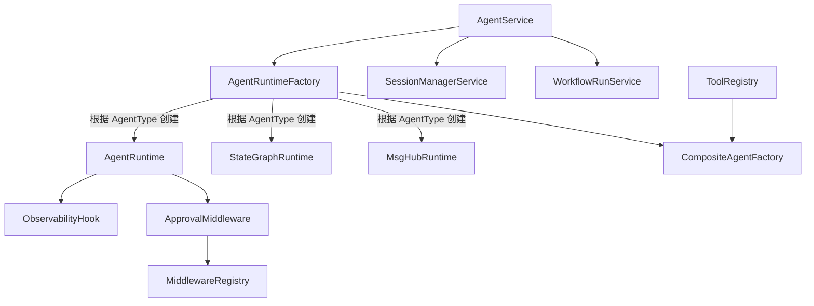
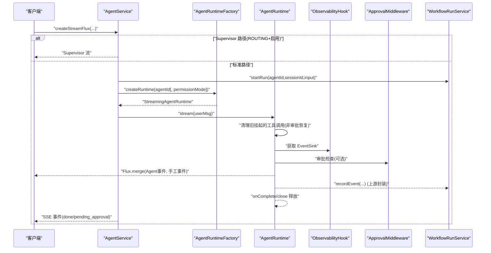
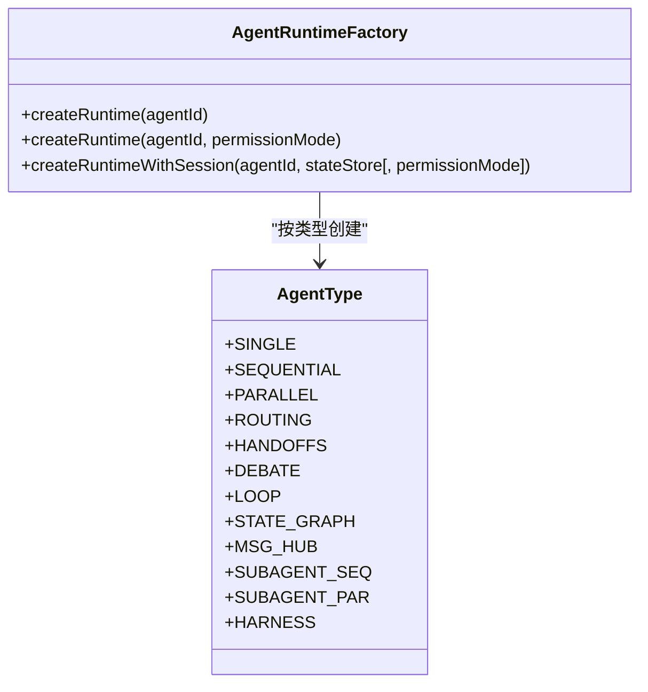
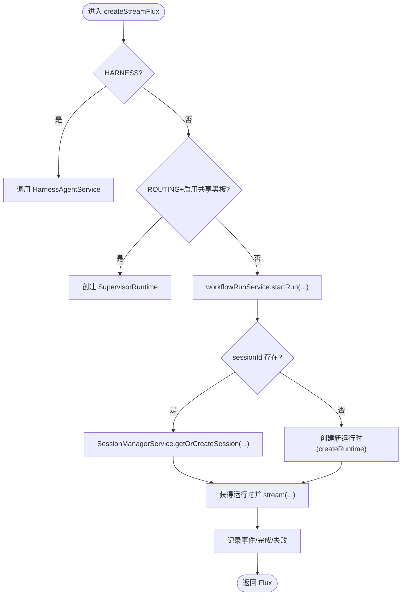
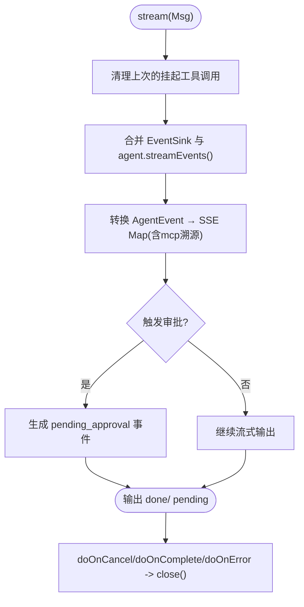
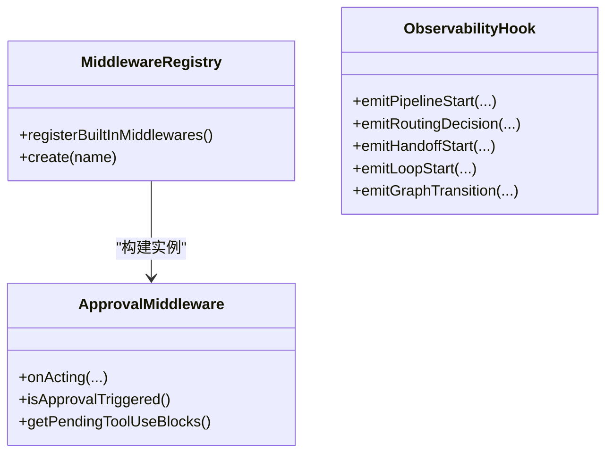
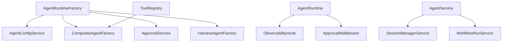

# Agent 生命周期管理

<cite>
**本文引用的文件列表**
- [AgentRuntimeFactory.java](file://src/main/java/com/skloda/agentscope/runtime/AgentRuntimeFactory.java)
- [AgentType.java](file://src/main/java/com/skloda/agentscope/agent/AgentType.java)
- [CompositeAgentFactory.java](file://src/main/java/com/skloda/agentscope/composite/CompositeAgentFactory.java)
- [ObservabilityHook.java](file://src/main/java/com/skloda/agentscope/hook/ObservabilityHook.java)
- [MiddlewareRegistry.java](file://src/main/java/com/skloda/agentscope/middleware/MiddlewareRegistry.java)
- [ApprovalMiddleware.java](file://src/main/java/com/skloda/agentscope/middleware/ApprovalMiddleware.java)
- [SessionManagerService.java](file://src/main/java/com/skloda/agentscope/service/SessionManagerService.java)
- [WorkflowRunService.java](file://src/main/java/com/skloda/agentscope/service/WorkflowRunService.java)
- [ToolRegistry.java](file://src/main/java/com/skloda/agentscope/tool/ToolRegistry.java)
- [AgentRuntime.java](file://src/main/java/com/skloda/agentscope/runtime/AgentRuntime.java)
- [StreamingAgentRuntime.java](file://src/main/java/com/skloda/agentscope/runtime/StreamingAgentRuntime.java)
- [AgentService.java](file://src/main/java/com/skloda/agentscope/service/AgentService.java)
- [HarnessAgentFactory.java](file://src/main/java/com/skloda/agentscope/harness/HarnessAgentFactory.java)
- [HarnessAgentService.java](file://src/main/java/com/skloda/agentscope/harness/HarnessAgentService.java)
- [StateGraphRuntime.java](file://src/main/java/com/skloda/agentscope/runtime/StateGraphRuntime.java)
- [MsgHubRuntime.java](file://src/main/java/com/skloda/agentscope/runtime/MsgHubRuntime.java)
</cite>

## 目录
1. [简介](#简介)
2. [项目结构](#项目结构)
3. [核心组件](#核心组件)
4. [架构总览](#架构总览)
5. [详细组件分析](#详细组件分析)
6. [依赖关系分析](#依赖关系分析)
7. [性能考量](#性能考量)
8. [故障诊断指南](#故障诊断指南)
9. [结论](#结论)

## 简介
本档聚焦于 Agent 的完整生命周期管理：从创建到销毁的全过程，覆盖初始化（配置加载、工具注册、中间件装配）、执行阶段（消息处理、工具调用、状态更新）与清理阶段（资源释放、会话清理、统计信息收集）。我们将深入解释运行时工厂模式在不同 AgentType 下的实例化策略，解析 AgentService 中的实例缓存机制，并提供生命周期钩子的自定义方法与典型场景下的最佳实践。同时，针对常见问题如内存泄漏、上下文丢失等给出诊断思路与解决方案。

## 项目结构
与 Agent 生命周期直接相关的代码分布在 runtime、service、middleware、hook、tool、composite 和 harness 等包中：
- 运行时层：StreamingAgentRuntime 接口及具体实现（AgentRuntime、StateGraphRuntime、MsgHubRuntime），以及 AgentRuntimeFactory 工厂类。
- 服务层：AgentService 统一编排请求路由、会话管理、工作流统计；SessionManagerService 提供并发安全的会话缓存；WorkflowRunService 跟踪运行轨迹。
- 扩展点：ObservabilityHook 提供事件观察入口；MiddlewareRegistry 集中注册并构建中间件；ApprovalMiddleware 实现 HITL 审批中断。
- 工具层：ToolRegistry 自动扫描并注册工具及技能映射。
- 组合与 Harness：CompositeAgentFactory 负责多 Agent 编排；HarnessAgentFactory/HarnessAgentService 处理 Harness 模式。

**图表来源**
- [AgentRuntimeFactory.java:41-105](file://src/main/java/com/skloda/agentscope/runtime/AgentRuntimeFactory.java#L41-L105)
- [AgentService.java:140-176](file://src/main/java/com/skloda/agentscope/service/AgentService.java#L140-L176)
- [ObservabilityHook.java:22-67](file://src/main/java/com/skloda/agentscope/hook/ObservabilityHook.java#L22-L67)
- [MiddlewareRegistry.java:12-55](file://src/main/java/com/skloda/agentscope/middleware/MiddlewareRegistry.java#L12-L55)
- [SessionManagerService.java:23-62](file://src/main/java/com/skloda/agentscope/service/SessionManagerService.java#L23-L62)
- [WorkflowRunService.java:17-40](file://src/main/java/com/skloda/agentscope/service/WorkflowRunService.java#L17-L40)
- [ToolRegistry.java:23-43](file://src/main/java/com/skloda/agentscope/tool/ToolRegistry.java#L23-L43)

**章节来源**
- [AgentRuntimeFactory.java:41-127](file://src/main/java/com/skloda/agentscope/runtime/AgentRuntimeFactory.java#L41-L127)
- [AgentService.java:140-176](file://src/main/java/com/skloda/agentscope/service/AgentService.java#L140-L176)
- [SessionManagerService.java:75-144](file://src/main/java/com/skloda/agentscope/service/SessionManagerService.java#L75-L144)
- [WorkflowRunService.java:35-95](file://src/main/java/com/skloda/agentscope/service/WorkflowRunService.java#L35-L95)
- [ToolRegistry.java:71-199](file://src/main/java/com/skloda/agentscope/tool/ToolRegistry.java#L71-L199)
- [ObservabilityHook.java:22-67](file://src/main/java/com/skloda/agentscope/hook/ObservabilityHook.java#L22-L67)
- [MiddlewareRegistry.java:12-55](file://src/main/java/com/skloda/agentscope/middleware/MiddlewareRegistry.java#L12-L55)

## 核心组件
- AgentRuntimeFactory：工厂方法，依据 AgentConfig.Type 选择对应运行时实现，支持无会话、带会话、带权限三种构造路径。
- AgentRuntime：单 Agent 运行时容器，整合 ReActAgent 的事件流、中间件（审批拦截）、事件观察与结束回调。
- StreamingAgentRuntime：统一的流式 API 抽象（stream + getHook + close），供上层一致调用。
- ObservabilityHook：生命周期观测桥接层，暴露 EventSink 供多 Agent 模式广播事件。
- MiddlewareRegistry / ApprovalMiddleware：中间件注册与 HITL 审批阻断，暂停工具调用等待人工确认。
- SessionManagerService：并发安全（ConcurrentHashMap）维护 session → ReActAgent + AgentStateStore 的映射，提供按 agentId/sessionId 查找或新建会话能力。
- WorkflowRunService：记录每次运行的输入预览、事件快照与完成状态，用于审计与统计。
- ToolRegistry：自动扫描 @Tool 方法、系统内置工具与 SKILL.md 前缀元数据，完成工具注册与技能绑定。

**章节来源**
- [AgentRuntimeFactory.java:41-127](file://src/main/java/com/skloda/agentscope/runtime/AgentRuntimeFactory.java#L41-L127)
- [AgentRuntime.java:31-65](file://src/main/java/com/skloda/agentscope/runtime/AgentRuntime.java#L31-L65)
- [StreamingAgentRuntime.java:9-20](file://src/main/java/com/skloda/agentscope/runtime/StreamingAgentRuntime.java#L9-L20)
- [ObservabilityHook.java:16-67](file://src/main/java/com/skloda/agentscope/hook/ObservabilityHook.java#L16-L67)
- [MiddlewareRegistry.java:12-55](file://src/main/java/com/skloda/agentscope/middleware/MiddlewareRegistry.java#L12-L55)
- [ApprovalMiddleware.java:22-124](file://src/main/java/com/skloda/agentscope/middleware/ApprovalMiddleware.java#L22-L124)
- [SessionManagerService.java:23-62](file://src/main/java/com/skloda/agentscope/service/SessionManagerService.java#L23-L62)
- [WorkflowRunService.java:17-40](file://src/main/java/com/skloda/agentscope/service/WorkflowRunService.java#L17-L40)
- [ToolRegistry.java:23-43](file://src/main/java/com/skloda/agentscope/tool/ToolRegistry.java#L23-L43)

## 架构总览
下图展示请求进入后的端到端流程：AgentService 决定是否使用 Supervisor（ROUTING 且启用共享黑板），否则走标准路径；Standard 路径由 AgentRuntimeFactory 根据类型创建运行时，随后 AgentRuntime.stream() 合并 AgentScope 原生事件流与 EventSink 手动事件流，并在结束时触发审计与统计。

**图表来源**
- [AgentService.java:140-176](file://src/main/java/com/skloda/agentscope/service/AgentService.java#L140-L176)
- [AgentRuntimeFactory.java:41-82](file://src/main/java/com/skloda/agentscope/runtime/AgentRuntimeFactory.java#L41-L82)
- [AgentRuntime.java:67-142](file://src/main/java/com/skloda/agentscope/runtime/AgentRuntime.java#L67-L142)
- [ObservabilityHook.java:22-67](file://src/main/java/com/skloda/agentscope/hook/ObservabilityHook.java#L22-L67)
- [WorkflowRunService.java:35-47](file://src/main/java/com/skloda/agentscope/service/WorkflowRunService.java#L35-L47)

## 详细组件分析

### 运行时工厂模式与多 AgentType 分支
AgentRuntimeFactory.createRuntime 基于 AgentConfig.getType() 分派到不同运行时：
- SINGLE、SEQUENTIAL、PARALLEL、DEBATE、LOOP、MSG_HUB、STATE_GRAPH、HANDOFFS、ROUTING、SUBAGENT_SEQ、SUBAGENT_PAR、HARNESS。
- 支持三类构建语义：
  - 无会话：createRuntime(agentId)
  - 带权限：createRuntime(agentId, permissionMode)
  - 带会话（AgentStateStore 共享）：createRuntimeWithSession(agentId, stateStore[, permissionMode])

各分支的职责：
- SINGLE：通过 CompositeAgentFactory 构建 ReActAgent，若开启结构化输出则包装为 StructuredOutputAgentRuntime。
- ROUTING / HANDOFFS：委托 CompositeAgentFactory 构造路由/交接代理（当前版本 HANDOFFS 仍沿用旧路径）。
- STATE_GRAPH：返回 StateGraphRuntime，封装 State 图驱动的执行流。
- MSG_HUB：委托 CompositeAgentFactory 创建 MsgHubRuntime，确保与其他管道一致的共享状态行为。
- HARNESS：通过 HarnessAgentFactory 生成 HarnessAgent，再包装为 HarnessRuntime，附带 RuntimeContext（sessionId、userId）。

**图表来源**
- [AgentRuntimeFactory.java:41-127](file://src/main/java/com/skloda/agentscope/runtime/AgentRuntimeFactory.java#L41-L127)
- [AgentType.java:3-26](file://src/main/java/com/skloda/agentscope/agent/AgentType.java#L3-L26)

**章节来源**
- [AgentRuntimeFactory.java:41-127](file://src/main/java/com/skloda/agentscope/runtime/AgentRuntimeFactory.java#L41-L127)
- [CompositeAgentFactory.java:59-191](file://src/main/java/com/skloda/agentscope/composite/CompositeAgentFactory.java#L59-L191)
- [HarnessAgentFactory.java:参考构造函数与 create 流程](file://src/main/java/com/skloda/agentscope/harness/HarnessAgentFactory.java)

### AgentService 的实例缓存与并发安全
- 会话缓存：SessionManagerService 使用 ConcurrentHashMap<String, SessionContext> 保存活跃会话，SessionContext 内包含 ReActAgent、AgentStateStore、访问与创建时间戳。
- 并发读取/写入：getOrCreateSession 对命中会话进行 touch() 更新时间；新建会话时创建对应状态的 store 与 agent，保证线程安全访问。
- 迁移策略：当会话类型变化时，自动重建新的 AgentStateStore 与 ReActAgent 并替换缓存。
- 运行记录：WorkflowRunService 以 Map<runId, MutableWorkflowRun> 存储运行期事件与状态，提供最大条目修剪逻辑，防止无限增长。
- 路由优先级：AgentService 先判断是否进入 Harness 路径或 Supervisor 路径，其次才走常规运行时创建。

**图表来源**
- [AgentService.java:140-176](file://src/main/java/com/skloda/agentscope/service/AgentService.java#L140-L176)
- [SessionManagerService.java:75-144](file://src/main/java/com/skloda/agentscope/service/SessionManagerService.java#L75-L144)
- [WorkflowRunService.java:35-95](file://src/main/java/com/skloda/agentscope/service/WorkflowRunService.java#L35-L95)

**章节来源**
- [AgentService.java:140-176](file://src/main/java/com/skloda/agentscope/service/AgentService.java#L140-L176)
- [SessionManagerService.java:23-192](file://src/main/java/com/skloda/agentscope/service/SessionManagerService.java#L23-L192)
- [WorkflowRunService.java:17-95](file://src/main/java/com/skloda/agentscope/service/WorkflowRunService.java#L17-L95)

### AgentRuntime 生命周期：初始化、执行、清理
- 初始化：
  - 注入 ObservabilityHook 与 ApprovalMiddleware、ApprovalService、agentId/sessionId。
  - 在 stream 开始前，清除“过期挂起”的工具调用块，避免历史中断导致后续请求污染对话上下文。
- 执行：
  - 合并两条事件流：AgentScope 原生 streamEvents 产生的事件与 EventSink 手工事件（路由/交接/流水线/图切换等）。
  - 将 AgentEvent 映射为 SSE 友好的 Map 结构，并为 tool_start 事件注入 MCP 溯源字段。
  - 处理 HITL 审批：若触发了审批，则生成 pending_approval 事件供前端交互。
- 清理：
  - 在 stream 完成/取消/错误回调中关闭 EventSink，确保 merge 流正常终结。
  - 触发 onClose（若存在）释放外部资源。
  - 记录完成的审批与最终 'done' 事件。

**图表来源**
- [AgentRuntime.java:67-142](file://src/main/java/com/skloda/agentscope/runtime/AgentRuntime.java#L67-L142)
- [AgentRuntime.java:144-200](file://src/main/java/com/skloda/agentscope/runtime/AgentRuntime.java#L144-L200)

**章节来源**
- [AgentRuntime.java:31-200](file://src/main/java/com/skloda/agentscope/runtime/AgentRuntime.java#L31-L200)
- [ObservabilityHook.java:22-67](file://src/main/java/com/skloda/agentscope/hook/ObservabilityHook.java#L22-L67)

### 中间件系统与生命周期钩子
- 中间件注册：MiddlewareRegistry 在启动时集中注册审计、限流、上下文增强、指标采集、OpenTelemetry 追踪等内置中间件，可按名构建实例。
- 审批中间件：ApprovalMiddleware 在 acting 阶段拦截敏感工具调用，设置 approvalTriggered 并保留待审工具块，使 Agent 流自然终止并以 pending_approval 响应前端。
- 观测钩子：ObservabilityHook 封装 EventSink，提供 pipeline/routing/handoff/loop/graph/roundtable/task 等多维事件的发射能力，被 composite/handler 在关键节点调用以推送至前端。

**图表来源**
- [MiddlewareRegistry.java:12-55](file://src/main/java/com/skloda/agentscope/middleware/MiddlewareRegistry.java#L12-L55)
- [ApprovalMiddleware.java:22-124](file://src/main/java/com/skloda/agentscope/middleware/ApprovalMiddleware.java#L22-L124)
- [ObservabilityHook.java:22-67](file://src/main/java/com/skloda/agentscope/hook/ObservabilityHook.java#L22-L67)

**章节来源**
- [MiddlewareRegistry.java:12-55](file://src/main/java/com/skloda/agentscope/middleware/MiddlewareRegistry.java#L12-L55)
- [ApprovalMiddleware.java:22-124](file://src/main/java/com/skloda/agentscope/middleware/ApprovalMiddleware.java#L22-L124)
- [ObservabilityHook.java:22-67](file://src/main/java/com/skloda/agentscope/hook/ObservabilityHook.java#L22-L67)

### 工具注册与生命周期
- 工具扫描：启动时扫描 com.skloda.agentscope.tool 下带 @Tool 注解的方法，建立函数名 → 类名映射与类实例供应商。
- 系统工具：尝试扫描框架内置文件系统/编码相关工具，若无则显式反射注册常见工具。
- 技能绑定：解析 skills/*/SKILL.md 前缀元数据，将 skill name 映射到其包含的一组工具，便于配置引用。

**章节来源**
- [ToolRegistry.java:23-43](file://src/main/java/com/skloda/agentscope/tool/ToolRegistry.java#L23-L43)
- [ToolRegistry.java:71-199](file://src/main/java/com/skloda/agentscope/tool/ToolRegistry.java#L71-L199)

### 不同运行模式的差异
- SINGLE：最简路径，适用于单 Agent 聊天/工具调用。
- ROUTING：主代理路由至子代理（SubAgentTool 方式）。
- STATE_GRAPH：基于状态机的有向图执行。
- MSG_HUB：消息聚合与转发，确保与其他管道一致的状态共享语义。
- HARNESS：沙箱/计划/任务列表/技能自学习等强能力，配合 HarnessAgentFactory/HarnessRuntime。

**章节来源**
- [AgentRuntimeFactory.java:41-127](file://src/main/java/com/skloda/agentscope/runtime/AgentRuntimeFactory.java#L41-L127)
- [CompositeAgentFactory.java:97-191](file://src/main/java/com/skloda/agentscope/composite/CompositeAgentFactory.java#L97-L191)
- [HarnessAgentService.java:参考 Harness 路径分支](file://src/main/java/com/skloda/agentscope/harness/HarnessAgentService.java)

## 依赖关系分析
- AgentRuntimeFactory 依赖 AgentConfigService、CompositeAgentFactory、ApprovalService、HarnessAgentFactory 以构建不同类型的运行时。
- AgentRuntime 依赖 ObservabilityHook、ApprovalMiddleware、ApprovalService，以及 AgentScope 原生 ReActAgent。
- SessionManagerService 与 WorkflowRunService 提供会话与审计基础设施。
- ToolRegistry 为所有 Agent 构建阶段（特别是 CompositeAgentFactory 的子代理）提供工具能力。
- MiddlewareRegistry 统一管理可插拔中间件。

**图表来源**
- [AgentRuntimeFactory.java:21-39](file://src/main/java/com/skloda/agentscope/runtime/AgentRuntimeFactory.java#L21-L39)
- [AgentRuntime.java:31-65](file://src/main/java/com/skloda/agentscope/runtime/AgentRuntime.java#L31-L65)
- [AgentService.java:26-60](file://src/main/java/com/skloda/agentscope/service/AgentService.java#L26-L60)
- [SessionManagerService.java:23-62](file://src/main/java/com/skloda/agentscope/service/SessionManagerService.java#L23-L62)
- [WorkflowRunService.java:17-40](file://src/main/java/com/skloda/agentscope/service/WorkflowRunService.java#L17-L40)
- [ToolRegistry.java:23-43](file://src/main/java/com/skloda/agentscope/tool/ToolRegistry.java#L23-L43)

**章节来源**
- [AgentRuntimeFactory.java:21-39](file://src/main/java/com/skloda/agentscope/runtime/AgentRuntimeFactory.java#L21-L39)
- [AgentRuntime.java:31-65](file://src/main/java/com/skloda/agentscope/runtime/AgentRuntime.java#L31-L65)
- [AgentService.java:26-60](file://src/main/java/com/skloda/agentscope/service/AgentService.java#L26-L60)

## 性能考量
- 避免重复创建 Agent：优先复用 SessionManagerService 中缓存的 ReActAgent 与 AgentStateStore，降低模型与工具初始化成本。
- 控制流合并开销：AgentRuntime 合并 EventSink 与 streamEvents 时使用 handle 过滤空事件，减少下游计算。
- 会话大小与修剪：WorkflowRunService 默认限制最大运行数（MAX_RUNS），避免事件集合无限增长造成 OOM。
- 工具发现与扫描：ToolRegistry 启动时扫描，应避免高频反射路径；建议保持工具类数量合理，必要时按需加载。
- 审批中断的影响：ApprovalMiddleware 会短路工具执行链，需评估业务侧超时与重试策略，避免堆积。

[本节提供通用指导，不直接分析具体文件]

## 故障诊断指南
- 内存泄漏/上下文污染
  - 现象：会话间残留上一请求的 ToolUseBlock 导致 LLM 自动生成错误结果。
  - 定位：AgentRuntime.stream 开始时清理挂起工具调用，如未生效请检查 isApprovalResume 分支是否正确设置。
  - 解决：确保中断/超时时走正常 stream 关闭路径，不要长时间持有会话对象。

- SSE 悬挂/前端永久 disabled
  - 现象：Agent 完成后前端未收到 'done'。
  - 定位：EventSink 必须在 agentEvents 结束后 doFinally 中 complete，否则 Flux.merge 不会结束。
  - 解决：保持 AgentRuntime 的完成回调链路完整，不要在外部强行阻塞流。

- 审批卡住
  - 现象：pending_approval 后无法恢复。
  - 定位：ApprovalMiddleware 的 approvalTriggered 与 pendingToolUseBlocks 应正确传递给 AgentRuntime 以重新 streamEvents。
  - 解决：调用审批恢复时传入 userMsg 或空消息，确保 resume 路径被触发。

- 会话类型不一致
  - 现象：同一 sessionId 在不同请求使用不同的 sessionType 导致状态不可预期。
  - 定位：SessionManagerService 会在类型变更时迁移会话并重建 Store/Agent。
  - 解决：保持应用侧传递 sessionType 一致性，或接受自动迁移。

- 工具找不到/技能未生效
  - 现象：运行时报 tool not found。
  - 定位：ToolRegistry 自动扫描与 SKILL.md 映射是否正常注册。
  - 解决：检查 @Tool name 唯一性、SKILL.md frontmatter tools 列表与目标工具一致。

**章节来源**
- [AgentRuntime.java:80-142](file://src/main/java/com/skloda/agentscope/runtime/AgentRuntime.java#L80-L142)
- [ApprovalMiddleware.java:58-77](file://src/main/java/com/skloda/agentscope/middleware/ApprovalMiddleware.java#L58-L77)
- [SessionManagerService.java:75-108](file://src/main/java/com/skloda/agentscope/service/SessionManagerService.java#L75-L108)
- [ToolRegistry.java:71-199](file://src/main/java/com/skloda/agentscope/tool/ToolRegistry.java#L71-L199)

## 结论
本仓库通过清晰的分层设计，将 Agent 的生命周期划分为工厂创建、运行时执行与清理三个明确阶段：工厂根据 AgentType 精准构建对应运行时；运行时负责事件流编排、中间件串联、状态清理与审计上报；服务层提供并发安全的会话管理与运行态统计。结合工具自动注册与可观测钩子，系统具备良好的可扩展性与可诊断性。实际使用中应重视会话复用、流式完成保障、审批恢复以及工具集的稳定注册，以获得稳定高性能的 Agent 服务体验。