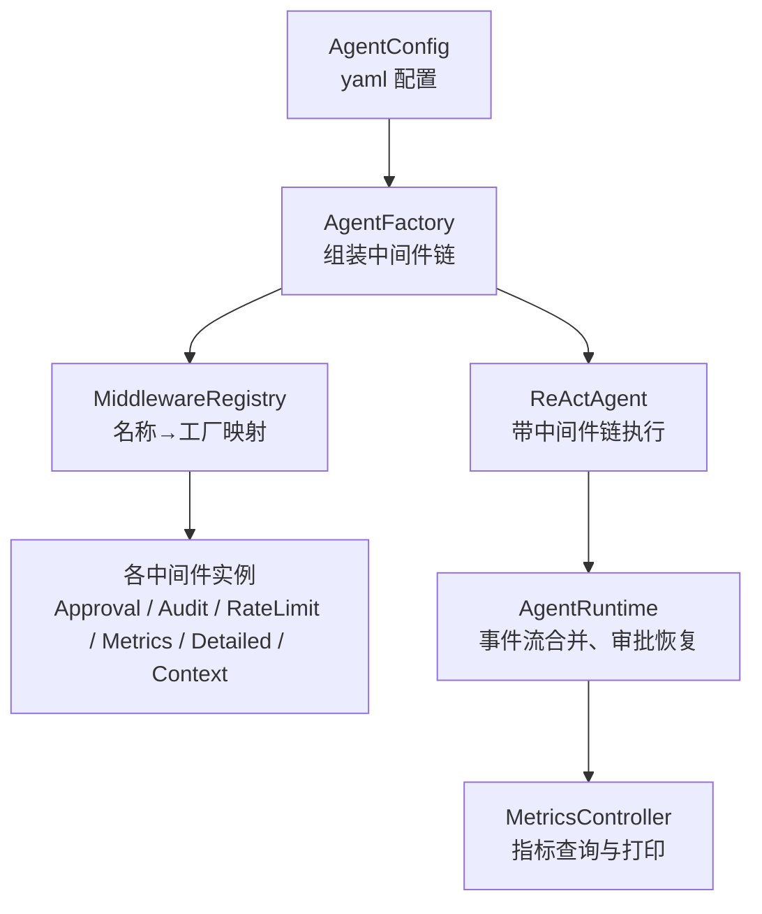
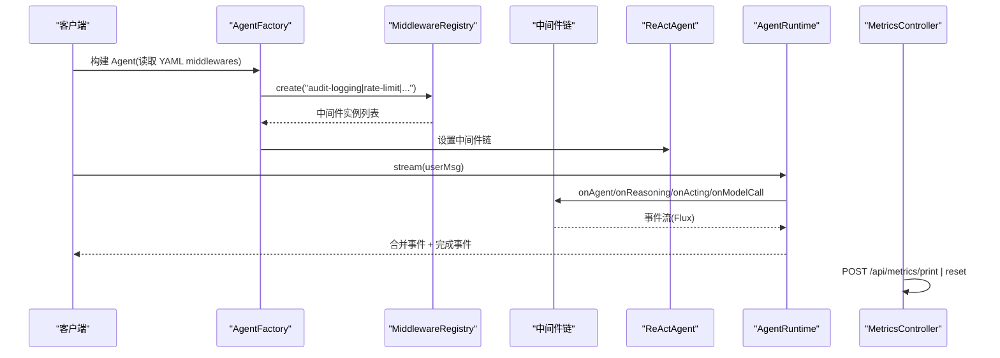
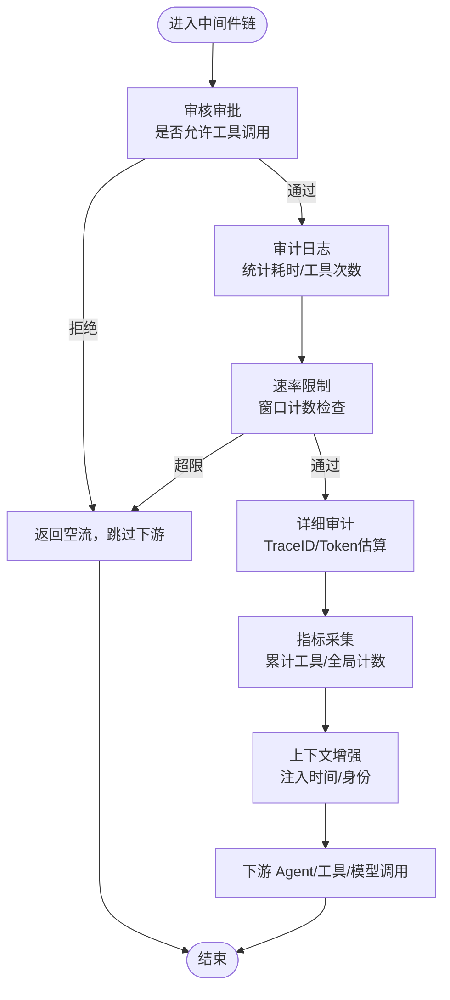
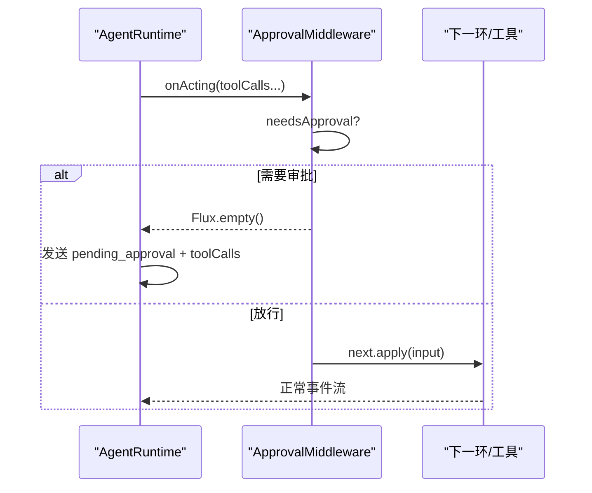
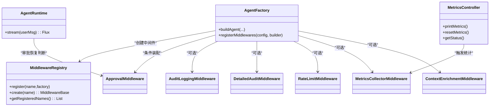

# 中间件管道机制

<cite>
**本文档引用的文件**
- [MiddlewareRegistry.java](file://src/main/java/com/skloda/agentscope/middleware/MiddlewareRegistry.java)
- [ApprovalMiddleware.java](file://src/main/java/com/skloda/agentscope/middleware/ApprovalMiddleware.java)
- [AuditLoggingMiddleware.java](file://src/main/java/com/skloda/agentscope/middleware/AuditLoggingMiddleware.java)
- [RateLimitMiddleware.java](file://src/main/java/com/skloda/agentscope/middleware/RateLimitMiddleware.java)
- [ContextEnrichmentMiddleware.java](file://src/main/java/com/skloda/agentscope/middleware/ContextEnrichmentMiddleware.java)
- [DetailedAuditMiddleware.java](file://src/main/java/com/skloda/agentscope/middleware/DetailedAuditMiddleware.java)
- [MetricsCollectorMiddleware.java](file://src/main/java/com/skloda/agentscope/middleware/MetricsCollectorMiddleware.java)
- [AgentFactory.java](file://src/main/java/com/skloda/agentscope/agent/AgentFactory.java)
- [AgentConfig.java](file://src/main/java/com/skloda/agentscope/agent/AgentConfig.java)
- [AgentRuntime.java](file://src/main/java/com/skloda/agentscope/runtime/AgentRuntime.java)
- [MetricsController.java](file://src/main/java/com/skloda/agentscope/controller/MetricsController.java)
- [application.yml](file://src/main/resources/application.yml)
- [agents.yml](file://src/main/resources/config/agents.yml)
- [MiddlewareRegistryTest.java](file://src/test/java/com/skloda/agentscope/middleware/MiddlewareRegistryTest.java)
</cite>

## 目录
1. 简介
2. 项目结构
3. 核心组件
4. 架构总览
5. 详细组件分析
6. 依赖关系分析
7. 性能考量
8. 故障排查指南
9. 结论
10. 附录（示例与配置）

## 简介
本文件系统性说明 AgentScope Demo 中的“中间件管道”机制：如何通过注册表自动发现与创建中间件，如何组织执行顺序，如何使用拦截器模式实现前置处理、后置处理与异常传播；并详述内置中间件（审批、审计日志、详细审计、速率限制、指标采集、上下文增强）及其组合方式。同时给出自定义中间件的实现规范、依赖注入与生命周期、YAML 动态配置、运行时集成、链路追踪与调试优化要点，并以真实业务场景演示复杂编排。

## 项目结构
与中间件相关的代码集中在以下目录与文件：
- 中间件实现与注册：com.skloda.agentscope.middleware.*
- 运行时装配与串联：com.skloda.agentscope.agent.AgentFactory, com.skloda.agentscope.runtime.AgentRuntime
- 监控与可观测性：com.skloda.agentscope.controller.MetricsController
- 配置装载：application.yml, agents.yml

图表来源
- [AgentFactory.java:188-200](file://src/main/java/com/skloda/agentscope/agent/AgentFactory.java#L188-L200)
- [MiddlewareRegistry.java:12-55](file://src/main/java/com/skloda/agentscope/middleware/MiddlewareRegistry.java#L12-L55)
- [AgentRuntime.java:98-142](file://src/main/java/com/skloda/agentscope/runtime/AgentRuntime.java#L98-L142)
- [MetricsController.java:22-37](file://src/main/java/com/skloda/agentscope/controller/MetricsController.java#L22-L37)

章节来源
- [MiddlewareRegistry.java:12-55](file://src/main/java/com/skloda/agentscope/middleware/MiddlewareRegistry.java#L12-L55)
- [AgentFactory.java:188-200](file://src/main/java/com/skloda/agentscope/agent/AgentFactory.java#L188-L200)
- [AgentRuntime.java:98-142](file://src/main/java/com/skloda/agentscope/runtime/AgentRuntime.java#L98-L142)
- [MetricsController.java:22-37](file://src/main/java/com/skloda/agentscope/controller/MetricsController.java#L22-L37)

## 核心组件
- MiddlewareRegistry：集中式中间件注册表，维护“名称 → 工厂”的有序映射，启动时自动登记内置中间件，并提供按名创建实例的能力。
- ApprovalMiddleware：在工具调用前进行“人机确认（HITL）”拦截，阻断后续工具执行并暴露待审批参数供前端展示。
- AuditLoggingMiddleware：基础审计记录，统计 Agent 开始/结束时长、推理阶段、工具调用次数和耗时等。
- DetailedAuditMiddleware：深度审计，生成全链路 Trace ID，汇总工具输入输出、思考内容、文本输出、错误堆栈、Token 用量估算等。
- RateLimitMiddleware：基于滑动窗口的每分钟最大请求数控制，超出则直接短路返回。
- MetricsCollectorMiddleware：聚合全局和 Agent/Tool 级性能与 Token 成本度量，提供汇总打印能力。
- ContextEnrichmentMiddleware：向系统提示词注入上下文（时间戳、用户身份等），用于下游 LLM 决策感知。

章节来源
- [MiddlewareRegistry.java:12-55](file://src/main/java/com/skloda/agentscope/middleware/MiddlewareRegistry.java#L12-L55)
- [ApprovalMiddleware.java:22-124](file://src/main/java/com/skloda/agentscope/middleware/ApprovalMiddleware.java#L22-L124)
- [AuditLoggingMiddleware.java:15-68](file://src/main/java/com/skloda/agentscope/middleware/AuditLoggingMiddleware.java#L15-L68)
- [DetailedAuditMiddleware.java:28-210](file://src/main/java/com/skloda/agentscope/middleware/DetailedAuditMiddleware.java#L28-L210)
- [RateLimitMiddleware.java:16-53](file://src/main/java/com/skloda/agentscope/middleware/RateLimitMiddleware.java#L16-L53)
- [MetricsCollectorMiddleware.java:21-205](file://src/main/java/com/skloda/agentscope/middleware/MetricsCollectorMiddleware.java#L21-L205)
- [ContextEnrichmentMiddleware.java:13-27](file://src/main/java/com/skloda/agentscope/middleware/ContextEnrichmentMiddleware.java#L13-L27)

## 架构总览
中间件通过拦截器链贯穿 Agent 运行时的各个阶段：Agent 初始化/消息接收、推理、工具调用、模型调用及系统提示词构造。其典型流程如下：

图表来源
- [AgentFactory.java:188-200](file://src/main/java/com/skloda/agentscope/agent/AgentFactory.java#L188-L200)
- [MiddlewareRegistry.java:26-55](file://src/main/java/com/skloda/agentscope/middleware/MiddlewareRegistry.java#L26-L55)
- [AgentRuntime.java:98-142](file://src/main/java/com/skloda/agentscope/runtime/AgentRuntime.java#L98-L142)
- [MetricsController.java:22-37](file://src/main/java/com/skloda/agentscope/controller/MetricsController.java#L22-L37)

## 详细组件分析

### MiddlewareRegistry：注册、发现与创建
- 设计要点
  - 使用有序映射保存“名称→工厂”，确保执行顺序可控且稳定。
  - PostConstruct 自动注册所有内置中间件名称与创建工厂。
  - provide “create(name)”以从名称获取具体中间件实例。
- 关键点
  - register() 支持扩展第三方中间件命名。
  - getRegisteredNames() 可用于诊断/前端枚举。

章节来源
- [MiddlewareRegistry.java:12-55](file://src/main/java/com/skloda/agentscope/middleware/MiddlewareRegistry.java#L12-L55)

### 中间件执行顺序与拦截器模式
- 阶段覆盖：onAgent → onReasoning → onActing → onModelCall → onSystemPrompt
- 顺序策略：由 AgentBuilder 将中间件按注册顺序形成链表，依次调用 next.apply(input) 实现“进入链/离开链”的前后处理。
- 异常传播：任一中间件的 doOnError 或上游抛出异常均会沿链向上传播，下游无法继续；可在对应阶段使用 doOnError 统一捕获记录。
- 短路语义：若某阶段直接返回空流（如 rate-limit 超限、approval 触发阻断），后续下游不会收到事件，也不会执行业务步骤。

图表来源
- [ApprovalMiddleware.java:58-77](file://src/main/java/com/skloda/agentscope/middleware/ApprovalMiddleware.java#L58-L77)
- [RateLimitMiddleware.java:31-52](file://src/main/java/com/skloda/agentscope/middleware/RateLimitMiddleware.java#L31-L52)
- [DetailedAuditMiddleware.java:45-107](file://src/main/java/com/skloda/agentscope/middleware/DetailedAuditMiddleware.java#L45-L107)
- [MetricsCollectorMiddleware.java:50-91](file://src/main/java/com/skloda/agentscope/middleware/MetricsCollectorMiddleware.java#L50-L91)
- [ContextEnrichmentMiddleware.java:18-27](file://src/main/java/com/skloda/agentscope/middleware/ContextEnrichmentMiddleware.java#L18-L27)

### 审批中间件（ApprovalMiddleware）
- 作用域：仅拦截工具调用阶段 onActing，检查是否需要人工审批。
- 策略：支持“全量审批 required=true”与“白名单审批 tools=List”两种模式。
- 行为：需要审批时返回空流阻断工具执行，并将待审批的工具调用结构化信息暴露给上层（含 input 参数）。
- 集成：AgentRuntime 在流完成后根据 isApprovalTriggered() 发出 pending_approval 事件，结合前端进行人机交互后再恢复执行。

图表来源
- [ApprovalMiddleware.java:58-77](file://src/main/java/com/skloda/agentscope/middleware/ApprovalMiddleware.java#L58-L77)
- [AgentRuntime.java:128-183](file://src/main/java/com/skloda/agentscope/runtime/AgentRuntime.java#L128-L183)

章节来源
- [ApprovalMiddleware.java:22-124](file://src/main/java/com/skloda/agentscope/middleware/ApprovalMiddleware.java#L22-L124)
- [AgentRuntime.java:128-183](file://src/main/java/com/skloda/agentscope/runtime/AgentRuntime.java#L128-L183)

### 审计日志中间件（AuditLoggingMiddleware）
- 目标：对 Agent 调用起止、推理阶段、工具调用进行基础审计。
- 细节：打印消息数量、阶段耗时、工具入参预览，便于快速定位问题。
- 适用：轻量场景下的可观测性补充。

章节来源
- [AuditLoggingMiddleware.java:15-68](file://src/main/java/com/skloda/agentscope/middleware/AuditLoggingMiddleware.java#L15-L68)

### 详细审计中间件（DetailedAuditMiddleware）
- 能力：生成 ThreadLocal Trace 上下文，记录每轮推理详情、工具输入输出摘要、思考内容与文本输出的增量收集、错误堆栈、成功/失败标记等。
- 价值：为排障与合规审计提供高保真记录。

章节来源
- [DetailedAuditMiddleware.java:28-210](file://src/main/java/com/skloda/agentscope/middleware/DetailedAuditMiddleware.java#L28-L210)

### 速率限制中间件（RateLimitMiddleware）
- 策略：单进程内存中维护最近 60 秒的时间戳队列，超过阈值即拒绝。
- 副作用：阻止下游调用并返回空流，适合保护昂贵模型调用。
- 可调参数：maxCallsPerMinute 可由外部配置或通过构造函数注入。

章节来源
- [RateLimitMiddleware.java:16-53](file://src/main/java/com/skloda/agentscope/middleware/RateLimitMiddleware.java#L16-L53)

### 指标采集中间件（MetricsCollectorMiddleware）
- 粒度：Agent 级、Tool 级、全局三个维度；包含调用次数、持续时间最小/最大/总和、Token 用量、成本估算与错误计数。
- API：提供静态方法汇总打印与重置指标，控制器对外暴露 REST 接口以触发。
- 线程安全：使用原子变量与并发容器保证多路并发正确性。

章节来源
- [MetricsCollectorMiddleware.java:21-205](file://src/main/java/com/skloda/agentscope/middleware/MetricsCollectorMiddleware.java#L21-L205)
- [MetricsController.java:22-37](file://src/main/java/com/skloda/agentscope/controller/MetricsController.java#L22-L37)

### 上下文增强中间件（ContextEnrichmentMiddleware）
- 目的：在系统提示词中注入运行时上下文（如当前时间、用户标识），提升指令遵循与决策质量。
- 实现：重写 onSystemPrompt 追加 context 块并返回新的提示词。

章节来源
- [ContextEnrichmentMiddleware.java:13-27](file://src/main/java/com/skloda/agentscope/middleware/ContextEnrichmentMiddleware.java#L13-L27)

## 依赖关系分析
- AgentFactory 负责将 AgentConfig.middlewares 中的名称交由 MiddlewareRegistry 解析并构造中间件链，再装配到 Agent 构建器中。
- ApprovalMiddleware 被框架级逻辑强制插入审批路径（当存在相关配置或使用 Harness）。
- AgentRuntime 在流结束时检测是否触发了审批，并通过 AgentEventMapper 将事件转换为 SSE 流。
- MetricsController 对外暴露 /api/metrics/* 用于触发指标操作，便于运维与排障。

图表来源
- [AgentFactory.java:188-200](file://src/main/java/com/skloda/agentscope/agent/AgentFactory.java#L188-L200)
- [MiddlewareRegistry.java:26-55](file://src/main/java/com/skloda/agentscope/middleware/MiddlewareRegistry.java#L26-L55)
- [AgentRuntime.java:128-183](file://src/main/java/com/skloda/agentscope/runtime/AgentRuntime.java#L128-L183)
- [MetricsController.java:22-37](file://src/main/java/com/skloda/agentscope/controller/MetricsController.java#L22-L37)

章节来源
- [AgentFactory.java:188-200](file://src/main/java/com/skloda/agentscope/agent/AgentFactory.java#L188-L200)
- [MiddlewareRegistry.java:26-55](file://src/main/java/com/skloda/agentscope/middleware/MiddlewareRegistry.java#L26-L55)
- [AgentRuntime.java:128-183](file://src/main/java/com/skloda/agentscope/runtime/AgentRuntime.java#L128-L183)
- [MetricsController.java:22-37](file://src/main/java/com/skloda/agentscope/controller/MetricsController.java#L22-L37)

## 性能考量
- 中间件顺序影响显著：将轻量的日志与指标采集置于靠后位置可减少阻塞；将审批、限速等高阻动作尽量靠前，以尽早短路降低资源浪费。
- 指标采样：高频事件建议采用采样或去重，避免打满日志。
- 内存开销：详细审计会收集大量片段文本，需注意上限与长度裁剪。
- 吞吐与延迟：在高并发下，应评估速率限制的阈值、重试退避以及下游模型限流策略。
- I/O 外泄：指标打印建议异步化或落盘，避免同步 IO 影响主链路。

[本节提供通用指导，不直接分析具体文件]

## 故障排查指南
- 常见问题
  - 中间件未生效：确认 YAML 中 middleware 名称已注册至 Registry，或在 AgentFactory 中按顺序装配。
  - 审批流程卡住：检查 approvalRequired/approvalTools 与 AgentRuntime 的 pending_approval 事件是否到达前端。
  - 限速过严：调整 RateLimitMiddleware 的最大调用数，或使用分布式的令牌桶方案。
  - 指标不准确：核对 DetailedAudit/Metrics 中间件是否正确挂载；观察是否出现多次重复统计。
- 定位手段
  - 启用详细审计与指标采集，打印 Trace ID 与阶段耗时。
  - 使用 /api/metrics/reset 清理历史指标后进行复测。
  - 在关键阶段增加日志断点，确认 next.apply(input) 是否被正确调用。

章节来源
- [MetricsController.java:22-37](file://src/main/java/com/skloda/agentscope/controller/MetricsController.java#L22-L37)
- [DetailedAuditMiddleware.java:45-107](file://src/main/java/com/skloda/agentscope/middleware/DetailedAuditMiddleware.java#L45-L107)
- [RateLimitMiddleware.java:31-52](file://src/main/java/com/skloda/agentscope/middleware/RateLimitMiddleware.java#L31-L52)
- [AgentRuntime.java:128-183](file://src/main/java/com/skloda/agentscope/runtime/AgentRuntime.java#L128-L183)

## 结论
该中间件管道以 Registry 为中心实现了“声明式注册、顺序化执行、可扩展拦截”的模式。借助审批、审计、限速、指标与上下文增强等多类中间件，既保证了业务流程的安全性与可观测性，又为性能调优和问题定位提供了丰富抓手。通过将中间件与配置解耦，并在 AgentFactory 集中装配、AgentRuntime 中贯穿执行，形成了稳定且易于演进的横切能力体系。

[本节总结整体结论，不直接分析具体文件]

## 附录（示例与配置）

### 在 YAML 中为 Agent 选择中间件
- 使用 AgentConfig.middlewares 字段指定名称列表，顺序即为执行顺序。
- 名称必须已在 MiddlewareRegistry.registerBuiltInMiddlewares 或自定义 register 中注册。

章节来源
- [AgentConfig.java:92-92](file://src/main/java/com/skloda/agentscope/agent/AgentConfig.java#L92-L92)
- [AgentsFactory 装配处:188-200](file://src/main/java/com/skloda/agentscope/agent/AgentFactory.java#L188-L200)
- [MiddlewareRegistry 自动注册:26-40](file://src/main/java/com/skloda/agentscope/middleware/MiddlewareRegistry.java#L26-L40)

### 审批流程的业务示例
- 常见场景：发票生成、删除操作等高风险任务需要用户确认后再执行工具调用。
- 数据流转：ApprovalMiddleware 阻断 after 识别敏感工具调用；AgentRuntime 产出 pending_approval；前端展示并收集用户同意后再恢复执行。

章节来源
- [ApprovalMiddleware.java:58-77](file://src/main/java/com/skloda/agentscope/middleware/ApprovalMiddleware.java#L58-L77)
- [AgentRuntime.java:128-183](file://src/main/java/com/skloda/agentscope/runtime/AgentRuntime.java#L128-L183)

### 动态配置与扩展
- 动态新增中间件：在 MiddlewareRegistry.registerBuiltInMiddlewares 中加入新的名称到工厂映射，或在应用启动时调用 register() 完成热插拔。
- 配置文件驱动：AgentConfig.middlewares 数组作为开关，无需修改代码即可开启/关闭特定横切能力。

章节来源
- [MiddlewareRegistry.java:18-40](file://src/main/java/com/skloda/agentscope/middleware/MiddlewareRegistry.java#L18-L40)
- [AgentConfig.java:92-92](file://src/main/java/com/skloda/agentscope/agent/AgentConfig.java#L92-L92)

### 测试验证参考
- 使用单元测试验证中间件注册表与行为的边界情况（未命中、空输入、空列表、超限额等）。

章节来源
- [MiddlewareRegistryTest.java:17-52](file://src/test/java/com/skloda/agentscope/middleware/MiddlewareRegistryTest.java#L17-L52)