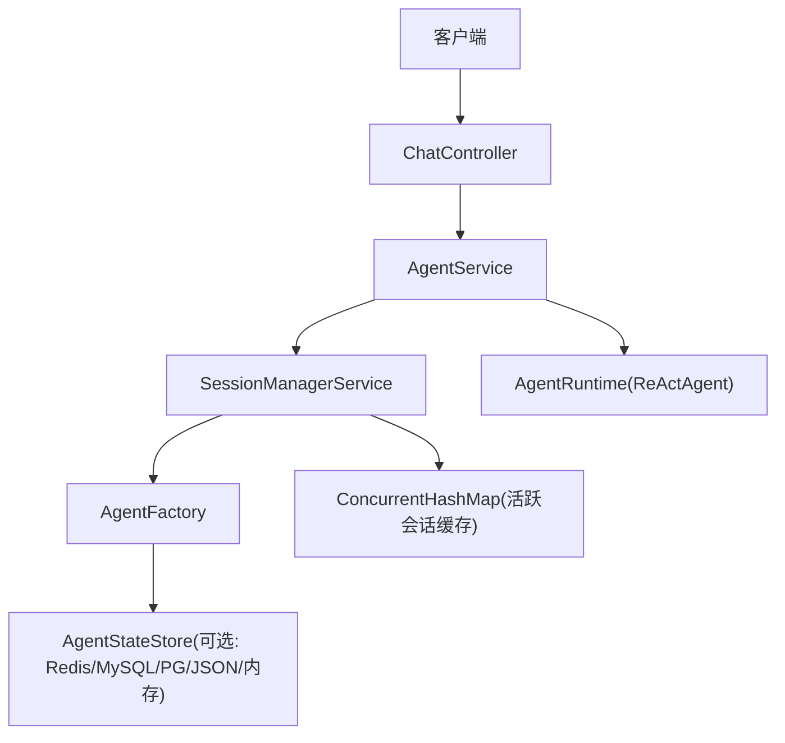
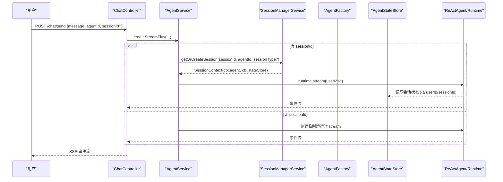
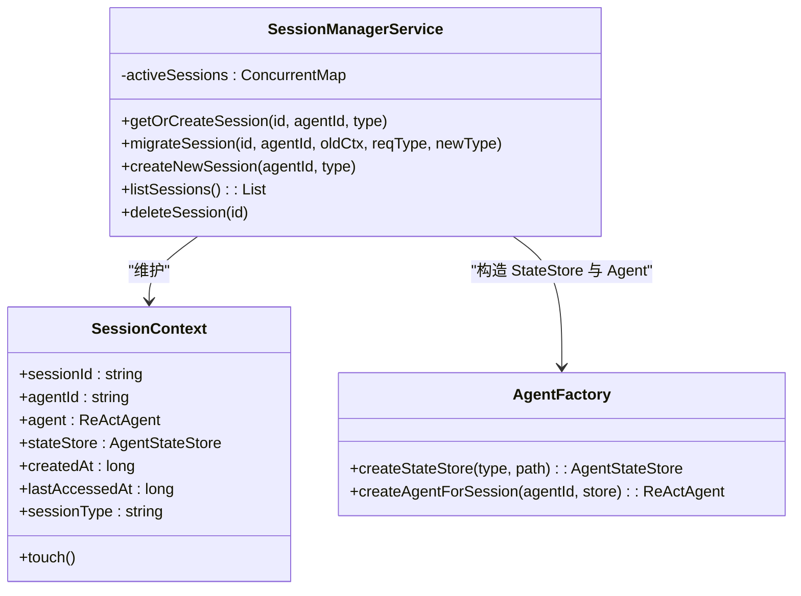
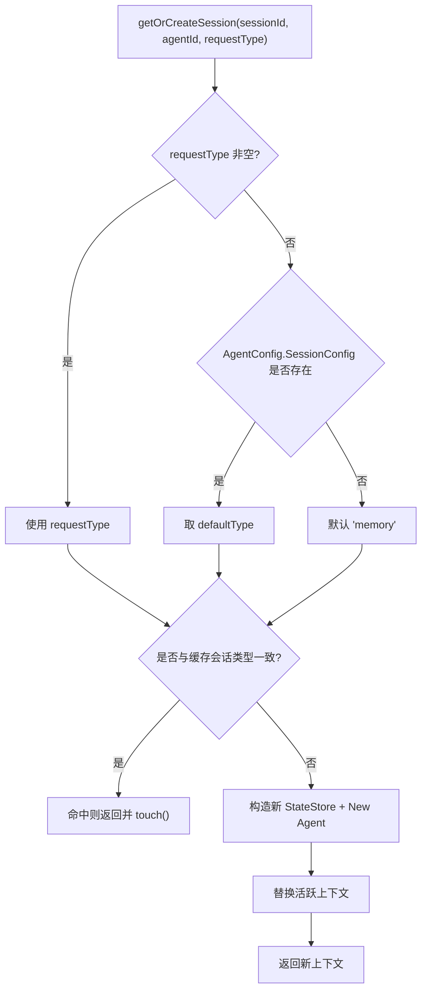

# 会话管理机制

<cite>
**本文引用的文件列表**
- [SessionManagerService.java](file://src/main/java/com/skloda/agentscope/service/SessionManagerService.java)
- [AgentService.java](file://src/main/java/com/skloda/agentscope/service/AgentService.java)
- [ChatController.java](file://src/main/java/com/skloda/agentscope/controller/ChatController.java)
- [DistributedStateStoreConfig.java](file://src/main/java/com/skloda/agentscope/config/DistributedStateStoreConfig.java)
- [AgentFactory.java](file://src/main/java/com/skloda/agentscope/agent/AgentFactory.java)
- [AgentConfig.java](file://src/main/java/com/skloda/agentscope/agent/AgentConfig.java)
- [application.yml](file://src/main/resources/application.yml)
- [application-redis.yml](file://src/main/resources/application-redis.yml)
- [application-mysql.yml](file://src/main/resources/application-mysql.yml)
- [RuntimeContextPropagationTest.java](file://src/test/java/com/skloda/agentscope/blackboard/RuntimeContextPropagationTest.java)
</cite>

## 目录
1. [简介](#简介)
2. [项目结构](#项目结构)
3. [核心组件](#核心组件)
4. [架构总览](#架构总览)
5. [详细组件分析](#详细组件分析)
6. [依赖关系分析](#依赖关系分析)
7. [性能与并发](#性能与并发)
8. [故障排查](#故障排查)
9. [结论](#结论)
10. [附录：API 使用示例](#附录api-使用示例)

## 简介
本章节介绍本仓库中“会话管理”的设计目标与能力边界：提供按会话（session）维度的 Agent 生命周期管理，支持创建、查找、更新访问标记、删除；支持会话类型系统（memory、json、redis、mysql、postgresql）的动态切换与迁移；具备分布式状态存储的能力并通过 Spring Profile 按需启用；基于线程安全的并发内存容器提供活跃会话缓存。

## 项目结构
围绕会话管理的职责划分：
- 控制器层：接收聊天请求，选择是否使用会话（sessionId），并返回事件流响应。
- 服务层：AgentService 串联工作流执行，调用 SessionManagerService 实现会话复用；SessionManagerService 维护活跃会话、创建/查找上下文、处理会话类型变更与迁移。
- 工厂层：AgentFactory 负责构建 ReActAgent 以及为不同 sessionType 创建对应的 AgentStateStore（内存、JSON 文件、Redis、MySQL、PostgreSQL）。
- 配置层：通过 application*.yml 和 @Profile 声明式的切换持久化后端；AgentConfig.SessionConfig 提供 per-agent 默认会话类型与存储路径。
- 模型层：SessionInfo 作为会话列表展示的轻量 DTO。



图表来源
- [ChatController.java:122-152](file://src/main/java/com/skloda/agentscope/controller/ChatController.java#L122-L152)
- [AgentService.java:131-177](file://src/main/java/com/skloda/agentscope/service/AgentService.java#L131-L177)
- [SessionManagerService.java:33-145](file://src/main/java/com/skloda/agentscope/service/SessionManagerService.java#L33-L145)
- [AgentFactory.java:80-99](file://src/main/java/com/skloda/agentscope/agent/AgentFactory.java#L80-L99)
- [DistributedStateStoreConfig.java:43-117](file://src/main/java/com/skloda/agentscope/config/DistributedStateStoreConfig.java#L43-L117)

小节来源
- [ChatController.java:117-152](file://src/main/java/com/skloda/agentscope/controller/ChatController.java#L117-L152)
- [AgentService.java:80-177](file://src/main/java/com/skloda/agentscope/service/AgentService.java#L80-L177)
- [SessionManagerService.java:23-145](file://src/main/java/com/skloda/agentscope/service/SessionManagerService.java#L23-L145)

## 核心组件
本节聚焦与会话相关的关键代码单元及其协作方式：
- SessionManagerService：维护并发 Map 中的会话上下文（activeSessions），提供 getOrCreate/getByAgent/save/list/delete 等操作；内置会话类型解析与迁移逻辑。
- AgentService：编排会话式与非会话式的运行路径；将 sessionId 与 agentId 透传至会话管理器，构造流式响应。
- AgentFactory：根据 sessionType 创建 AgentStateStore（优先注入的分布式 Bean 或按类型回退到 JSON/内存），并按需绑定 ApprovalMiddleware 及权限模式等。
- DistributedStateStoreConfig：在 redis/mysql/postgresql Profile 下注册 AgentStateStore Bean，供 AgentFactory 优先使用。
- AgentConfig.SessionConfig：Per-Agent 的默认会话类型与存储路径。
- ChatController：暴露 /chat/send 接口，决定是否走会话流。

小节来源
- [SessionManagerService.java:33-145](file://src/main/java/com/skloda/agentscope/service/SessionManagerService.java#L33-L145)
- [AgentFactory.java:56-99](file://src/main/java/com/skloda/agentscope/agent/AgentFactory.java#L56-L99)
- [DistributedStateStoreConfig.java:43-117](file://src/main/java/com/skloda/agentscope/config/DistributedStateStoreConfig.java#L43-L117)
- [AgentConfig.java:110-113](file://src/main/java/com/skloda/agentscope/agent/AgentConfig.java#L110-L113)
- [ChatController.java:122-152](file://src/main/java/com/skloda/agentscope/controller/ChatController.java#L122-L152)

## 架构总览
下图展示一次包含会话的消息发送与状态存储流转：



图表来源
- [ChatController.java:122-152](file://src/main/java/com/skloda/agentscope/controller/ChatController.java#L122-L152)
- [AgentService.java:131-177](file://src/main/java/com/skloda/agentscope/service/AgentService.java#L131-L177)
- [SessionManagerService.java:75-145](file://src/main/java/com/skloda/agentscope/service/SessionManagerService.java#L75-L145)
- [AgentFactory.java:80-99](file://src/main/java/com/skloda/agent/AgentFactory.java#L80-L99)

## 详细组件分析

### SessionManagerService：设计要点
- 活跃会话缓存：内部以 ConcurrentHashMap 维护 <sessionId, SessionContext>，保证多线程下的读多写少场景并发安全。
- 会话上下文 SessionContext：封装会话标识、Agent 实例、共享状态存储器、会话类型、创建与最后访问时间等。
- 会话解析优先级：优先使用入参 sessionType，否则读取 AgentConfig.SessionConfig.DefaultType，再回退 memory。
- 自动迁移机制：当检测到会话类型变更时，构造新的 AgentStateStore，并以相同 sessionId 重建 ReActAgent，替换旧上下文，保留原 sessionId。
- 生命周期方法：createNewSession、getOrCreateSession(get/for agent)、saveSession(仅 touch)、listSessions（排序+DTO 转换）、deleteSession。

类关系图（会话上下文与工厂交互）



图表来源
- [SessionManagerService.java:45-145](file://src/main/java/com/skloda/agentscope/service/SessionManagerService.java#L45-L145)
- [AgentFactory.java:80-99](file://src/main/java/com/skloda/agentscope/agent/AgentFactory.java#L80-L99)

小节来源
- [SessionManagerService.java:75-145](file://src/main/java/com/skloda/agentscope/service/SessionManagerService.java#L75-L145)

### 会话上下文 SessionContext：字段与作用
- sessionId：唯一会话键，跨请求识别同一对话。
- agentId：对应代理定义标识，便于定位 Agent 配置与名称。
- agent：ReActAgent 实例，承载该会话下的推理与工具调用。
- stateStore：AgentScope 的状态存储抽象，可对接内存/文件/Redis/数据库；同一 sessionId 下数据隔离。
- createdAt / lastAccessedAt：记录创建时间和最后一次访问时间，用于会话统计和清理策略扩展。
- sessionType：当前会话使用的状态存储类型，决定持久化语义（内存、JSON 文件、远程 Redis/DB）。

小节来源
- [SessionManagerService.java:45-73](file://src/main/java/com/skloda/agentscope/service/SessionManagerService.java#L45-L73)

### 会话类型系统与切换机制
- 类型来源顺序：
  - 请求显式传入 sessionType
  - AgentConfig.SessionConfig.defaultType
  - 默认 memory
- 后端装配：
  - 若存在分布式 profile（redis/mysql/postgresql），AgentFactory.createStateStore 优先返回全局 Bean（即同一进程内所有会话共享该存储）。
  - 否则根据 sessionType：json -> JsonFileAgentStateStore(基于 storagePath)，其他 -> InMemoryAgentStateStore。
- 切换与迁移：
  - 当现有会话的 effectiveType 与缓存不一致时，触发 migrateSession：构造新 stateStore 和新 agent，替换活跃上下文中的 agent/stateStore，但保持 sessionId 不变。
- Profile 配置说明：
  - application.yml 设置 agentscope.session.* 等基础开关。
  - application-redis.yml 激活 redis profile 并在 agentscope.distributed.redis.url/key-prefix 配置后，会注入 RedisAgentStateStore。
  - application-mysql.yml 激活 mysql profile 并在 spring.datasource.* 配置后，会注入 MysqlAgentStateStore。
  - PostgreSQL 同理，通过 postgresql profile 注入 PostgresAgentStateStore。



图表来源
- [SessionManagerService.java:75-145](file://src/main/java/com/skloda/agentscope/service/SessionManagerService.java#L75-L145)
- [AgentFactory.java:80-99](file://src/main/java/com/skloda/agentscope/agent/AgentFactory.java#L80-L99)
- [DistributedStateStoreConfig.java:43-117](file://src/main/java/com/skloda/agentscope/config/DistributedStateStoreConfig.java#L43-L117)
- [application.yml:57-60](file://src/main/resources/application.yml#L57-L60)
- [application-redis.yml:1-16](file://src/main/resources/application-redis.yml#L1-L16)
- [application-mysql.yml:1-17](file://src/main/resources/application-mysql.yml#L1-L17)

小节来源
- [SessionManagerService.java:151-155](file://src/main/java/com/skloda/agentscope/service/SessionManagerService.java#L151-L155)
- [AgentFactory.java:56-99](file://src/main/java/com/skloda/agentscope/agent/AgentFactory.java#L56-L99)
- [DistributedStateStoreConfig.java:43-117](file://src/main/java/com/skloda/agentscope/config/DistributedStateStoreConfig.java#L43-L117)
- [application.yml:57-60](file://src/main/resources/application.yml#L57-L60)
- [application-redis.yml:1-16](file://src/main/resources/application-redis.yml#L1-L16)
- [application-mysql.yml:1-17](file://src/main/resources/application-mysql.yml#L1-L17)

### 会话生命周期与管理操作
- 创建会话：
  - createNewSession(agentId, sessionType)：生成简短 ID，解析有效类型，创建 StateStore 与 Agent，放入 activeSessions。
- 查找/复用：
  - getOrCreateSession(sessionId, agentId, sessionType)：命中则返回并更新 lastAccessedAt；未命中则新建。
  - getOrCreateSessionForAgent(agentId)：按 agentId 查找已有会话，不存在则新建。
- 更新/保活：
  - saveSession(sessionId)：仅做 touch() 更新访问时间，不写入外部存储（由底层 stateStore 控制）。
- 列出与会话信息：
  - listSessions()：按 lastAccessedAt 倒序输出 SessionInfo 列表，填充 agentName、消息数占位等。
- 删除：
  - deleteSession(sessionId)：从 activeSessions 移除。

小节来源
- [SessionManagerService.java:75-197](file://src/main/java/com/skloda/agentscope/service/SessionManagerService.java#L75-L197)

### 并发访问控制与线程安全
- 活跃会话 Map：使用 ConcurrentHashMap，适合读多写少的会话注册/查找场景。
- 原子性保障：get 和 put 分步进行，典型情况下先 get，若无则 create+put；在高并发场景可能产生重复创建的竞争条件，但在本实现中会话 ID 由服务端分配且较短唯一度通常足够，同时后续步骤会覆盖旧值。
- lastAccessedAt 更新：通过 volatile 字段配合简单赋值，满足常见时效性与监控需求；如需精确单调递增时间线可考虑 LongAdder 或原子时间戳方案。
- 会话迁移：在检测到 sessionType 变化时，直接替换 activeSessions 中的上下文，避免脏读导致的使用旧存储的问题。

小节来源
- [SessionManagerService.java:33-34](file://src/main/java/com/skloda/agentscope/service/SessionManagerService.java#L33-L34)
- [SessionManagerService.java:75-108](file://src/main/java/com/skloda/agentscope/service/SessionManagerService.java#L75-L108)

### 会话持久化与后端扩展
- 持久化选择权：
  - 当存在分布式 profile（redis/mysql/postgresql）时，AgentFactory 总是返回该全局 Bean 对应的状态存储，所有会话将共享该后端，适合集群/多实例部署。
  - 无分布式 profile 时：根据 sessionType 决定内存或 JSON 文件；JSON 文件存储受 sessionConfig.storagePath 控制。
- 扩展新后端：
  - 新增一个 Spring Bean 实现 AgentStateStore，并使用 @Profile 限定；AgentFactory 会自动发现并优先使用。
  - 如需 per-session 差异化存储，可在 SessionManagerService 中添加更多路由规则或自定义存储策略。
- 注意事项：
  - 当启用分布式后端时，per-agent storagePath 不再影响实际存储介质（因为全局 Bean 覆盖了本地构造）；如需要精细化控制，可调整 AgentFactory 的路由逻辑。

小节来源
- [AgentFactory.java:56-99](file://src/main/java/com/skloda/agentscope/agent/AgentFactory.java#L56-L99)
- [DistributedStateStoreConfig.java:43-117](file://src/main/java/com/skloda/agentscope/config/DistributedStateStoreConfig.java#L43-L117)

### 高级特性：超时清理与回收
- 现状：SessionContext 记录了 lastAccessedAt，可用于后续扩展定时任务进行惰性清理或主动 TTL 扫描。
- 推荐做法：可结合调度任务（例如每 N 分钟）扫描 activeSessions，移除超过阈值的会话，避免长时间运行的服务内存占用增长。

[本节为通用建议，不引用具体实现]

### Supervisor/Blackboard 与会话的集成（选读）
- 对于 Routing + Shared Blackboard 的 Supervisor 类型，AgentService 也会通过 SessionManagerService 获取/创建会话，并将 userId/sessionId 传递给 SupervisorRuntime，确保对话状态与看板状态按 (userId, sessionId) 隔离恢复。
- 测试用例验证了不同用户/会话之间的隔离以及同一会话跨调用的状态恢复。

小节来源
- [AgentService.java:149-199](file://src/main/java/com/skloda/agentscope/service/AgentService.java#L149-L199)
- [RuntimeContextPropagationTest.java:30-85](file://src/test/java/com/skloda/agentscope/blackboard/RuntimeContextPropagationTest.java#L30-L85)

## 依赖关系分析

```mermaid
graph LR
    ChatController --> AgentService
    AgentService --> SessionManagerService
    SessionManagerService --> AgentFactory
    AgentFactory -->|优先使用| DistributedStateStoreConfig
    AgentFactory -->|备选| InMemory/JsonFile Store
    SessionManagerService -->|写出| AgentStateStore
    AgentService --> AgentRuntime
    AgentRuntime --> ReActAgent
```

图表来源
- [ChatController.java:122-152](file://src/main/java/com/skloda/agentscope/controller/ChatController.java#L122-L152)
- [AgentService.java:131-199](file://src/main/java/com/skloda/agentscope/service/AgentService.java#L131-L199)
- [SessionManagerService.java:33-145](file://src/main/java/com/skloda/agentscope/service/SessionManagerService.java#L33-L145)
- [AgentFactory.java:56-99](file://src/main/java/com/skloda/agentscope/agent/AgentFactory.java#L56-L99)
- [DistributedStateStoreConfig.java:43-117](file://src/main/java/com/skloda/agentscope/config/DistributedStateStoreConfig.java#L43-L117)

小节来源
- [AgentService.java:131-199](file://src/main/java/com/skloda/agentscope/service/AgentService.java#L131-L199)
- [SessionManagerService.java:33-145](file://src/main/java/com/skloda/agentscope/service/SessionManagerService.java#L33-L145)
- [AgentFactory.java:56-99](file://src/main/java/com/skloda/agentscope/agent/AgentFactory.java#L56-L99)
- [DistributedStateStoreConfig.java:43-117](file://src/main/java/com/skloda/agentscope/config/DistributedStateStoreConfig.java#L43-L117)

## 性能与并发
- 活跃会话缓存采用 ConcurrentHashMap，查找 O(1) 平均复杂度，适用于高并发读取。
- 流式 SSE 响应基于 Reactor Flux，无需同步阻塞，减少线程资源消耗。
- 状态存储层（内存/文件/Redis/DB）的性能与可用性取决于后端本身，分布式后端的引入提升吞吐与横向扩展能力。
- 会话迁移在类型变化时会有短暂重建成本，属于低频事件。

[本节为通用指导，不引用具体实现]

## 故障排查
- 现象：会话丢失或无法跨请求恢复
  - 确认是否使用了 sessionId，并在下次请求中传入相同值。
  - 若启用了分布式后端，检查对应 Profile 是否生效以及连接配置是否正确。
- 现象：会话类型不生效
  - 检查 resolveSessionType 优先级：请求参数 > AgentConfig.defaultType > 默认 memory。
  - 当存在分布式 profile 时，AgentFactory 总是返回全局 Bean，per-agent storagePath 不会改变实际存储。
- 现象：Redis/MySQL 无法连接
  - 核对 application-redis.yml 或 application-mysql.yml 的 url/credentials，并确保服务可用。
  - 观察日志级别（io.agentscope.extensions.*）以便定位连接问题。

小节来源
- [SessionManagerService.java:75-108](file://src/main/java/com/skloda/agentscope/service/SessionManagerService.java#L75-L108)
- [AgentFactory.java:80-99](file://src/main/java/com/skloda/agentscope/agent/AgentFactory.java#L80-L99)
- [application-redis.yml:1-16](file://src/main/resources/application-redis.yml#L1-L16)
- [application-mysql.yml:1-17](file://src/main/resources/application-mysql.yml#L1-L17)

## 结论
本项目通过 SessionManagerService 统一维护会话生命周期，利用 AgentFactory 与 @Profile 驱动的分布式状态存储实现了灵活的可插拔持久化策略。通过会话类型解析与自动迁移，能在运行期平滑切换存储后端；基于并发 Map 的活跃会话缓存保证了基本的高并发处理能力。对上层应用而言，只需关注 sessionId 的传递与保存，即可在不同后端间享受一致的多轮对话体验。

[本节总结性陈述，不引用具体实现]

## 附录：API 使用示例
- 建立会话式对话
  - 调用 POST /chat/send，携带 agentId、message，以及首次返回的 sessionId；后续请求带上同一 sessionId 即可复用会话状态。
  - 若希望强制某种存储类型，可通过 sessionType 字段指定（例如 json/redis/mysql）。
  - 若不提供 sessionId，则为无状态对话，不会创建或恢复会话。
- 查看与会话管理
  - listSessions：在服务侧调用 sessionManagerService.listSessions() 可按最后访问时间倒序获取活跃会话清单。
  - 删除会话：调用 deleteSession(sessionId) 移除活跃会话；注意仅在内存映射层面移除，不会删除持久化数据（由底层 stateStore 决定）。

[以上示例基于源码中暴露的 API 进行说明，不涉及具体业务框架约束]

小节来源
- [ChatController.java:122-152](file://src/main/java/com/skloda/agentscope/controller/ChatController.java#L122-L152)
- [AgentService.java:131-177](file://src/main/java/com/skloda/agentscope/service/AgentService.java#L131-L177)
- [SessionManagerService.java:164-197](file://src/main/java/com/skloda/agentscope/service/SessionManagerService.java#L164-L197)