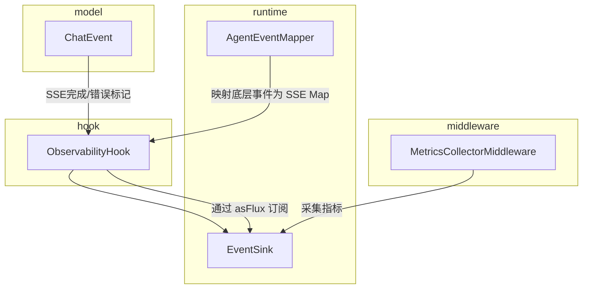
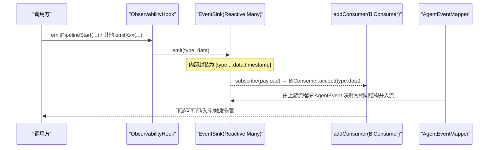
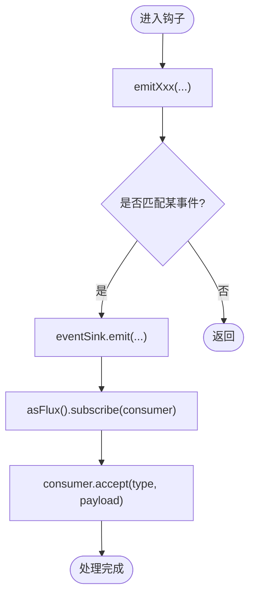
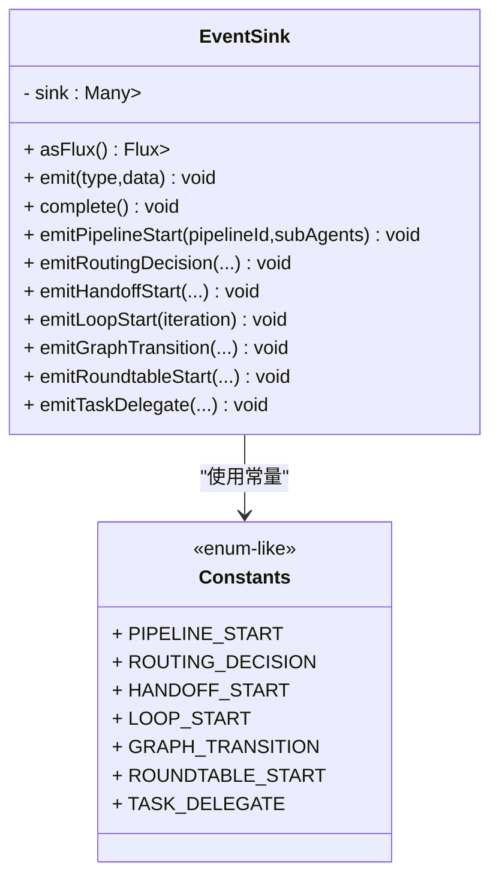
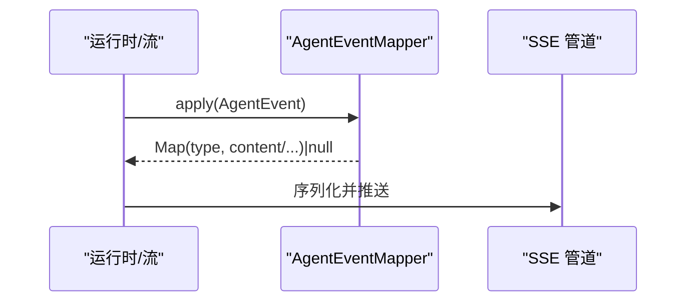
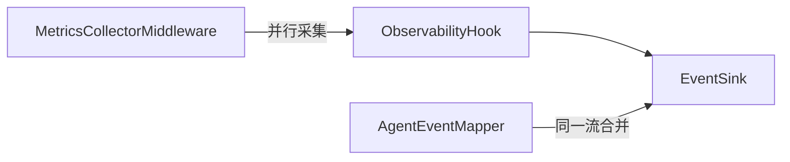

# 可观测性钩子系统

<cite>
**本文引用的文件**
- [ObservabilityHook.java](file://src/main/java/com/skloda/agentscope/hook/ObservabilityHook.java)
- [EventSink.java](file://src/main/java/com/skloda/agentscope/runtime/EventSink.java)
- [AgentEventMapper.java](file://src/main/java/com/skloda/agentscope/runtime/AgentEventMapper.java)
- [ChatEvent.java](file://src/main/java/com/skloda/agentscope/model/ChatEvent.java)
- [ObservabilityHookLifecycleTest.java](file://src/test/java/com/skloda/agentscope/hook/ObservabilityHookLifecycleTest.java)
- [MetricsCollectorMiddleware.java](file://src/main/java/com/skloda/agentscope/middleware/MetricsCollectorMiddleware.java)
</cite>

## 目录
1. [引言](#引言)
2. [项目结构](#项目结构)
3. [核心组件](#核心组件)
4. [架构总览](#架构总览)
5. [详细组件分析](#详细组件分析)
6. [依赖关系分析](#依赖关系分析)
7. [性能与最佳实践](#性能与最佳实践)
8. [故障排查指南](#故障排查指南)
9. [结论](#结论)
10. [附录：事件数据模型](#附录事件数据模型)

## 引言
本文件系统性阐述可观测性钩子系统的的设计模式、实现原理与使用方式。围绕 ObservabilityHook 与 EventSink，解释其基于事件驱动的异步流式总线如何解耦“事件生产者”与“消费者”，覆盖 Pipeline 执行、路由决策、手递交接、循环迭代、状态图转换等多种典型多 Agent 协作场景。文档同时说明如何通过 addConsumer 注册处理器、如何消费并处理 SSE 风格的 Map 化事件载荷，以及如何在业务中接入自定义的指标收集、监控与告警策略，并给出性能优化建议与常见问题排查方法。

## 项目结构
本项目采用分层+领域的代码组织方式。与可观测性钩子直接相关的主要包如下：
- hook: 提供 ObservabilityHook，作为面向上层的可观测性桥接入口
- runtime: 提供 EventSink（轻量级 Reactive EventBus）、AgentEventMapper（将底层 AgentEvent 转换为前端消费用的 SSE Map）
- middleware: 提供 MetricsCollectorMiddleware 等中间件用于聚合性能指标与错误统计
- model: 包含通用 SSE 消息模型如 ChatEvent（done/error）
- test: 提供 ObservabilityHook 的行为测试用例，覆盖各事件类型的产出顺序与字段语义



图表来源
- [ObservabilityHook.java:16-67](file://src/main/java/com/skloda/agentscope/hook/ObservabilityHook.java#L16-L67)
- [EventSink.java:15-152](file://src/main/java/com/skloda/agentscope/runtime/EventSink.java#L15-L152)
- [AgentEventMapper.java:56-105](file://src/main/java/com/skloda/agentscope/runtime/AgentEventMapper.java#L56-L105)
- [MetricsCollectorMiddleware.java:50-162](file://src/main/java/com/skloda/agentscope/middleware/MetricsCollectorMiddleware.java#L50-L162)

章节来源
- [ObservabilityHook.java:16-67](file://src/main/java/com/skloda/agentscope/hook/ObservabilityHook.java#L16-L67)
- [EventSink.java:15-152](file://src/main/java/com/skloda/agentscope/runtime/EventSink.java#L15-L152)
- [AgentEventMapper.java:56-105](file://src/main/java/com/skloda/agentscope/runtime/AgentEventMapper.java#L56-L105)
- [MetricsCollectorMiddleware.java:50-162](file://src/main/java/com/skloda/agentscope/middleware/MetricsCollectorMiddleware.java#L50-L162)
- [ChatEvent.java:9-39](file://src/main/java/com/skloda/agentscope/model/ChatEvent.java#L9-L39)
- [ObservabilityHookLifecycleTest.java:23-115](file://src/test/java/com/skloda/agentscope/hook/ObservabilityHookLifecycleTest.java#L23-L115)

## 核心组件
- ObservabilityHook: 面向上层使用的可观测性桥接器，暴露 addConsumer 及一系列 emitXxx 便捷方法；内部委托至 EventSink 进行事件广播。不再承担自动生命周期事件的处理（改由 AgentScope 2.0 的 agent.streamEvents() + AgentEventMapper 承载）。
- EventSink: 基于 Project Reactor Sinks.Many 的轻量级事件总线，采用 multicast 与 onBackpressureBuffer 策略，对外暴露 Flux<Map<String, Object>>，提供丰富的事件类型常量与类型安全的 emitXxx 方法。
- AgentEventMapper: 将 AgentScope 2.0 的 AgentEvent 转换为前端可读的 SSE Map（含 type、content/toolName/工具调用信息等），供 Controller 或上游合并到统一事件中。
- ChatEvent: 定义通用的 SSE “结束/错误”标志事件（type=“done”“error”），配合事件总线进行端到端提示。
- MetricsCollectorMiddleware: 基于中间件框架收集工具调用耗时、模型调用 Token、错误率与费用估算等全局/按 Agent/工具的指标。

章节来源
- [ObservabilityHook.java:16-67](file://src/main/java/com/skloda/agentscope/hook/ObservabilityHook.java#L16-L67)
- [EventSink.java:15-152](file://src/main/java/com/skloda/agentscope/runtime/EventSink.java#L15-L152)
- [AgentEventMapper.java:56-105](file://src/main/java/com/skloda/agentscope/runtime/AgentEventMapper.java#L56-L105)
- [ChatEvent.java:9-39](file://src/main/java/com/skloda/agentscope/model/ChatEvent.java#L9-L39)
- [MetricsCollectorMiddleware.java:50-162](file://src/main/java/com/skloda/agentscope/middleware/MetricsCollectorMiddleware.java#L50-L162)

## 架构总览
ObservabilityHook 是“适配器层”，将高层语义事件（pipeline/routing/handoff/loop/graph/roundtable/task 等）转成 EventSink 的标准 Map payload。EventSink 基于 Reactive Streams 的多播通道将事件以非阻塞、背压可控的方式推送给所有订阅者。AgentEventMapper 负责从 AgentScope 2.0 原生事件流中提取语义并将其序列化为统一的结构化 Map，再与 EventSink 的事件共同汇聚到最终的 SSE 管道。



图表来源
- [ObservabilityHook.java:30-35](file://src/main/java/com/skloda/agentscope/hook/ObservabilityHook.java#L30-L35)
- [EventSink.java:21-33](file://src/main/java/com/skloda/agentscope/runtime/EventSink.java#L21-L33)
- [AgentEventMapper.java:64-105](file://src/main/java/com/skloda/agentscope/runtime/AgentEventMapper.java#L64-L105)

## 详细组件分析

### ObservabilityHook：桥接与便捷 API
- 职责
  - 暴露 addConsumer(BiConsumer<String, Map<String,Object>>) 以订阅事件流
  - 提供 emitXxx 系列方法简化业务侧发布 pipeline/routing/handoff/loop/graph/roundtable/task 等事件
  - 内部持有 EventSink 实例，转发调用至其对应方法
- 设计要点
  - 与 AgentScope 2.0 生命周期事件的解耦：不再监听 PreCallEvent/PostCallEvent 等，而是专注于“多 Agent 协作阶段”的手动上报
  - 去除了 removeConsumer/reset 的实质逻辑（Flux 订阅无显式取消必要），保持极简



图表来源
- [ObservabilityHook.java:30-35](file://src/main/java/com/skloda/agentscope/hook/ObservabilityHook.java#L30-L35)
- [ObservabilityHook.java:45-67](file://src/main/java/com/skloda/agentscope/hook/ObservabilityHook.java#L45-L67)
- [EventSink.java:25-33](file://src/main/java/com/skloda/agentscope/runtime/EventSink.java#L25-L33)

章节来源
- [ObservabilityHook.java:16-67](file://src/main/java/com/skloda/agentscope/hook/ObservabilityHook.java#L16-L67)

### EventSink：事件总线与数据类型
- 数据结构
  - 每个 payload 为 Map<String, Object>，统一包含 type 字段标识事件类型；emitXxx 方法自动追加 timestamp 等元信息
  - 常量池：PIPELINE_START/STEP_START/STEP_END/END、ROUTING_DECISION/END、HANDOFF_START/COMPLETE、LOOP_START/END/ITERATION_RESULT、GRAPH_TRANSITION/AGENT_CALL、ROUNDTABLE_*、TASK_*
- 背压与可靠性
  - 使用 Sinks.many().multicast().onBackpressureBuffer()，保障高吞吐时不丢失事件
  - tryEmitNext 失败会记录警告日志，避免异常扩散



图表来源
- [EventSink.java:19-61](file://src/main/java/com/skloda/agentscope/runtime/EventSink.java#L19-L61)
- [EventSink.java:65-151](file://src/main/java/com/skloda/agentscope/runtime/EventSink.java#L65-L151)

章节来源
- [EventSink.java:15-152](file://src/main/java/com/skloda/agentscope/runtime/EventSink.java#L15-L152)

### AgentEventMapper：AgentScope 原生事件的标准化
- 作用：将 AgentScope 2.0 的各类 AgentEvent（如模型调用开始/结束、工具调用、文本块增量、用户确认等）映射为统一的 SSE Map，便于与 EventSink 产生的事件在同一管线中传输
- 特点：
  - 对 block boundary 类事件直接丢弃（null 返回），减少无关开销
  - 异常安全：捕获异常并回传 error 事件，保证流不中断



图表来源
- [AgentEventMapper.java:64-105](file://src/main/java/com/skloda/agentscope/runtime/AgentEventMapper.java#L64-L105)
- [AgentEventMapper.java:109-224](file://src/main/java/com/skloda/agentscope/runtime/AgentEventMapper.java#L109-L224)

章节来源
- [AgentEventMapper.java:56-224](file://src/main/java/com/skloda/agentscope/runtime/AgentEventMapper.java#L56-L224)

### MetricsCollectorMiddleware：指标采集示例
- 功能：采集每 Agent/每 Tool 调用耗时、Token 用量、错误次数，估算费用并汇总
- 集成点：通过 MiddlewareBase 拦截 onAgent/onReasoning/onActing/onModelCall 生命周期事件
- 输出：控制台/日志中打印指标摘要，支持 resetMetrics 清理

```mermaid
flowchart TD
  Entry["进入中间件链路"] -> Collect["收集当前Agent上下文"]
  Collect -> OnActing["拦截工具调用起止"]
  Collect -> OnModel["拦截模型调用结束事件"]
  OnActing -> UpdateTool["更新工具指标: 时长/失败数/计数"]
  OnModel -> UpdateGlobal["累加tokens/错误/请求数"]
  UpdateTool -> Merge["合并上下文"]
  UpdateGlobal -> Merge
  Merge -> Done["返回事件流（带副作用统计）"]
```

图表来源
- [MetricsCollectorMiddleware.java:50-162](file://src/main/java/com/skloda/agentscope/middleware/MetricsCollectorMiddleware.java#L50-L162)
- [MetricsCollectorMiddleware.java:187-252](file://src/main/java/com/skloda/agentscope/middleware/MetricsCollectorMiddleware.java#L187-L252)

章节来源
- [MetricsCollectorMiddleware.java:50-162](file://src/main/java/com/skloda/agentscope/middleware/MetricsCollectorMiddleware.java#L50-L162)
- [MetricsCollectorMiddleware.java:187-252](file://src/main/java/com/skloda/agentscope/middleware/MetricsCollectorMiddleware.java#L187-L252)

## 依赖关系分析
- ObservabilityHook 依赖 EventSink 进行事件广播，自身仅做适配和便捷包装
- EventSink 作为基础设施，被多个上层能力复用（如 Pipeline、Routing、Handoff、Loop、Graph 等运行时可能调用）
- AgentEventMapper 独立于 EventSink，但可与 EventSink 在同一 SSE 流中合并后输出
- MetricsCollectorMiddleware 不直接依赖 EventSink，但以同样的原则在 Agent 运行期采集指标



图表来源
- [ObservabilityHook.java:20-35](file://src/main/java/com/skloda/agentscope/hook/ObservabilityHook.java#L20-L35)
- [EventSink.java:21-33](file://src/main/java/com/skloda/agentscope/runtime/EventSink.java#L21-L33)
- [AgentEventMapper.java:64-105](file://src/main/java/com/skloda/agentscope/runtime/AgentEventMapper.java#L64-L105)
- [MetricsCollectorMiddleware.java:50-162](file://src/main/java/com/skloda/agentscope/middleware/MetricsCollectorMiddleware.java#L50-L162)

## 性能与最佳实践
- 事件过滤
  - 在 consumer 中进行基于 type 或字段的前置筛选，降低下游处理压力
- 批处理
  - 若需批量落盘/上报，可在外部对 Flowable/Flux 做 buffer/window（例如按时间或条数窗口），注意窗口关闭时的 flush
- 背压与缓冲
  - EventSink 默认使用 onBackpressureBuffer，适合短时突发流量；若消费极慢建议配置限流/降级策略，避免内存占用过大
- 幂等与重试
  - 对关键事件（如 pipeline_end、routing_decision）建议在下游做幂等写入；重试应考虑 idempotency key
- 资源清理
  - addConsumer 返回订阅句柄或在需要时关闭；虽然钩子内 removeConsumer 为空操作，建议在上层自行管理订阅生命周期
- 异常隔离
  - 单个 consumer 的错误不应影响其他 consumer 与总线稳定，务必在消费者内部 try-catch
- 时间戳与追踪
  - 借助 EventSink 生成的 timestamp 与上游链路 ID（如 pipelineId/routingId），结合分布式追踪系统关联一次完整交互

[本节提供通用指导，不直接引用具体文件]

## 故障排查指南
- 事件未到达
  - 确认 addConsumer 已正确注册；确认 emitXxx 调用路径已命中
  - 检查是否有异常被吞掉（建议 consumer 内打印 or 记录）
- 乱序或重复
  - Flux 多播不保证跨节点的严格时序；如需强一致落地需引入去重键或顺序约束
- 内存增长/背压问题
  - 观察消费者处理速率与缓存策略，必要时限制并发或增加批处理
- 无法区分事件类型
  - 读取 payload.type；可结合 AgentEventMapper 的类型命名规范
- 指标不准确
  - 核对 MetricsCollectorMiddleware 的拦截时机，确保 start/end 配对正确；校验 Token 统计来自正确的 ModelCallEndEvent

章节来源
- [EventSink.java:25-33](file://src/main/java/com/skloda/agentscope/runtime/EventSink.java#L25-L33)
- [ObservabilityHook.java:30-39](file://src/main/java/com/skloda/agentscope/hook/ObservabilityHook.java#L30-L39)
- [ObservabilityHookLifecycleTest.java:33-115](file://src/test/java/com/skloda/agentscope/hook/ObservabilityHookLifecycleTest.java#L33-L115)

## 结论
本系统将“多 Agent 协作过程的可观测性”从业务代码中解耦出来：ObservabilityHook 提供稳定的发布契约，EventSink 以响应式方式高效分发事件，AgentEventMapper 则补齐了单 Agent 生命周期的结构化事件映射。通过上述组件的组合，开发者可以以低侵入方式接入指标、审计、实时可视化与告警等能力，并以背压与异常隔离等手段保证在高吞吐下仍具备稳定性。

[本节总结概念，不涉及具体代码分析]

## 附录：事件数据模型
- 通用结构
  - 每个事件 payload 为 Map，必含 type；部分事件额外包含 timestamp、pipelineId、agentId 等业务字段
- 关键事件类别与用途
  - 流水线事件：pipeline_start/step_start/step_end/end（编排多子 Agent 的执行链路）
  - 路由事件：routing_decision/routing_end（选择目标 Agent 的决策与结果）
  - 手递事件：handoff_start/complete（上下文与任务从一个 Agent 交接到另一个）
  - 循环事件：loop_start/iteration_result/end（评估—反馈—改进的多次尝试）
  - 状态图事件：graph_transition/graph_agent_call（有向状态机中的跳转与节点动作）
  - 圆桌事件：roundtable_start/round_start/message/end/summary（多人协同讨论与共识）
  - 任务委派：task_delegate/start/end/aggregate（任务切分、执行、聚合）
- 序列化
  - 所有事件以 JSON 化的 Map 序列化为 String 推送到前端；ChatEvent.done()/error() 用于标记流结束或错误
- 参考
  - EventSink 的 emitXxx 定义了各类事件的数据字段
  - AgentEventMapper 定义了 AgentScope 原生事件到统一 SSE 结构的映射规则

章节来源
- [EventSink.java:39-151](file://src/main/java/com/skloda/agentscope/runtime/EventSink.java#L39-L151)
- [ChatEvent.java:17-39](file://src/main/java/com/skloda/agentscope/model/ChatEvent.java#L17-L39)
- [AgentEventMapper.java:64-105](file://src/main/java/com/skloda/agentscope/runtime/AgentEventMapper.java#L64-L105)