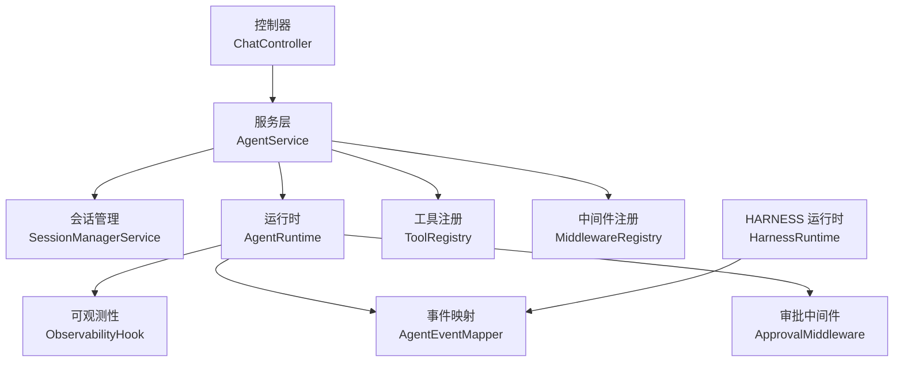
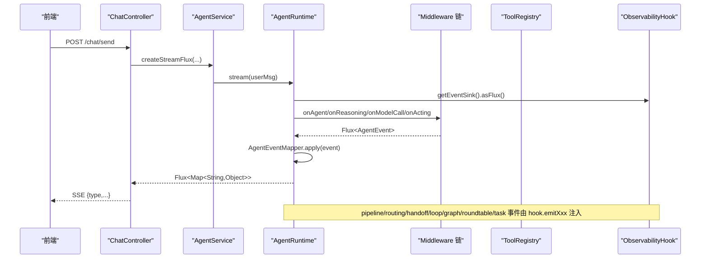
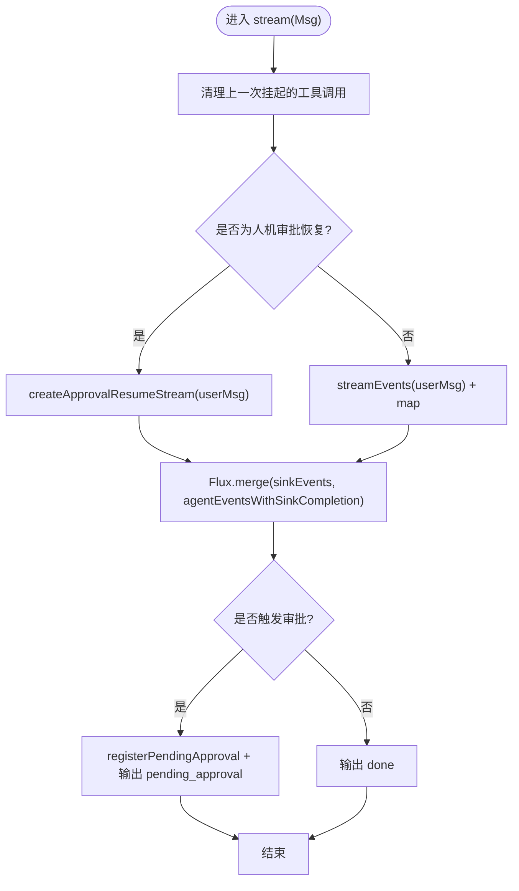
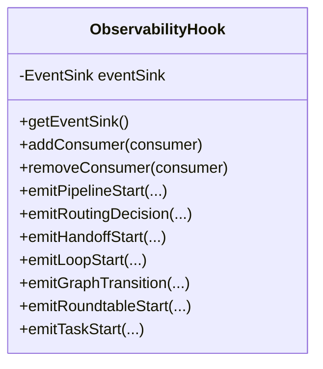
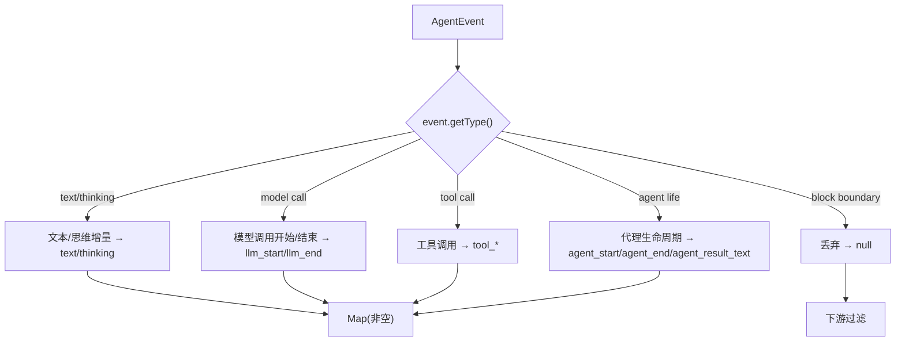
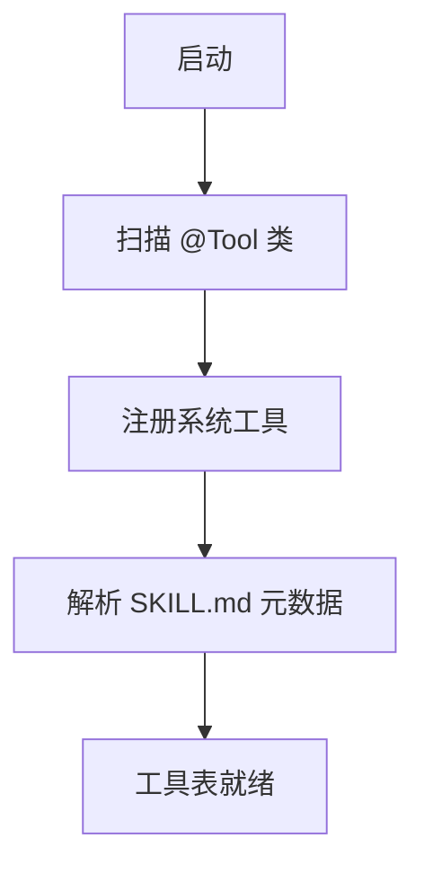
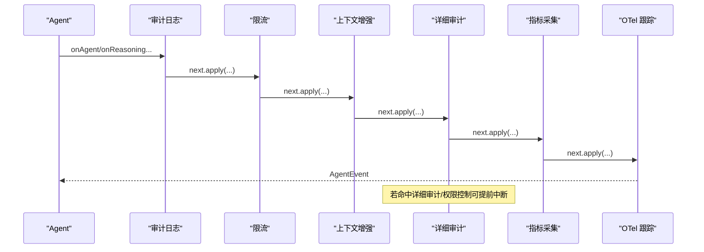
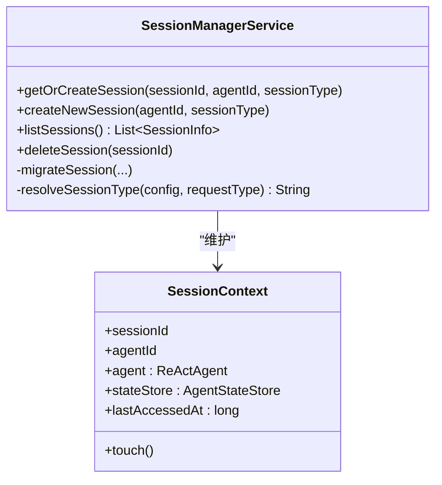
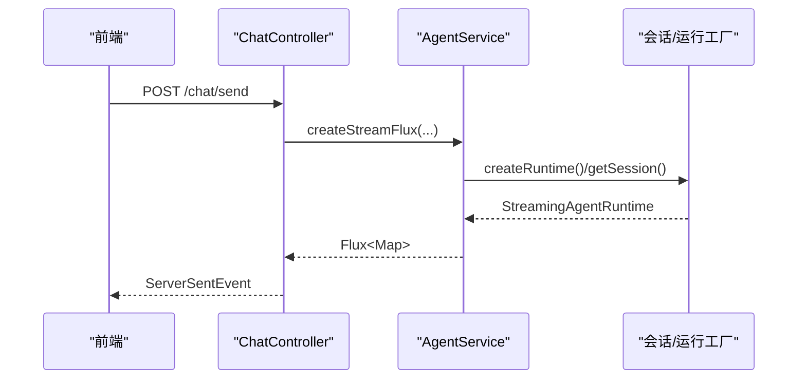
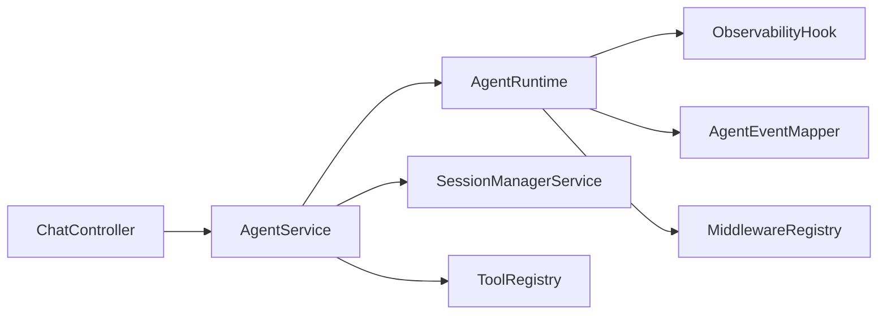

# 生命周期管理

<cite>
**本文件中引用的文件**
- [ObservabilityHook.java](file://src/main/java/com/skloda/agentscope/hook/ObservabilityHook.java)
- [AgentRuntime.java](file://src/main/java/com/skloda/agentscope/runtime/AgentRuntime.java)
- [AgentEventMapper.java](file://src/main/java/com/skloda/agentscope/runtime/AgentEventMapper.java)
- [ToolRegistry.java](file://src/main/java/com/skloda/agentscope/tool/ToolRegistry.java)
- [MiddlewareRegistry.java](file://src/main/java/com/skloda/agentscope/middleware/MiddlewareRegistry.java)
- [ApprovalMiddleware.java](file://src/main/java/com/skloda/agentscope/middleware/ApprovalMiddleware.java)
- [SessionManagerService.java](file://src/main/java/com/skloda/agentscope/service/SessionManagerService.java)
- [AgentService.java](file://src/main/java/com/skloda/agentscope/service/AgentService.java)
- [ChatController.java](file://src/main/java/com/skloda/agentscope/controller/ChatController.java)
- [HarnessRuntime.java](file://src/main/java/com/skloda/agentscope/harness/HarnessRuntime.java)
- [agent.yml](file://src/main/resources/config/agents.yml)
- [ObservabilityHookLifecycleTest.java](file://src/test/java/com/skloda/agentscope/hook/ObservabilityHookLifecycleTest.java)
- [MiddlewareRegistryTest.java](file://src/test/java/com/skloda/agentscope/middleware/MiddlewareRegistryTest.java)
</cite>

## 目录
1. [简介](#简介)
2. [项目结构](#项目结构)
3. [核心组件](#核心组件)
4. [架构总览](#架构总览)
5. [详细组件分析](#详细组件分析)
6. [依赖关系分析](#依赖关系分析)
7. [性能考量](#性能考量)
8. [故障排查指南](#故障排查指南)
9. [结论](#结论)
10. [附录](#附录)

## 简介
本文面向 AgentScope 项目的生命周期管理，系统化说明以下方面：
- Agent 全生命周期：初始化阶段（配置加载、工具注册、中间件装配）、执行阶段（消息处理、工具调用、状态更新）、清理阶段（资源释放、会话清理、统计信息收集）。
- ObservabilityHook 的可观测性设计：事件收集、性能监控、错误追踪，以及与多 Agent 协作事件的桥接。
- SessionManagerService 的会话管理机制：会话创建、共享状态管理、跨请求的状态保持与迁移。
- MiddlewareRegistry 的中间件管线设计：中间件注册、执行顺序、错误传播机制及审批流程。
- 生命周期钩子使用示例与扩展点接入指南。

## 项目结构
生命周期相关的关键代码分布：
- 运行时编排：runtime（AgentRuntime、AgentEventMapper）、harness（HarnessRuntime）
- 可观测与钩子：hook（ObservabilityHook）
- 服务与会话：service（AgentService、SessionManagerService）
- 工具与中间件：tool（ToolRegistry）、middleware（MiddlewareRegistry、ApprovalMiddleware 等）
- 控制器入口：controller（ChatController）
- 配置与协议：resources（agents.yml 描述 Agent、工具与能力）

图表来源
- [ChatController.java:122-152](file://src/main/java/com/skloda/agentscope/controller/ChatController.java#L122-L152)
- [AgentService.java:131-177](file://src/main/java/com/skloda/agentscope/service/AgentService.java#L131-L177)
- [AgentRuntime.java:67-142](file://src/main/java/com/skloda/agentscope/runtime/AgentRuntime.java#L67-L142)
- [ObservabilityHook.java:16-67](file://src/main/java/com/skloda/agentscope/hook/ObservabilityHook.java#L16-L67)
- [AgentEventMapper.java:39-105](file://src/main/java/com/skloda/agentscope/runtime/AgentEventMapper.java#L39-L105)
- [ToolRegistry.java:23-44](file://src/main/java/com/skloda/agentscope/tool/ToolRegistry.java#L23-L44)
- [MiddlewareRegistry.java:12-55](file://src/main/java/com/skloda/agentscope/middleware/MiddlewareRegistry.java#L12-L55)

章节来源
- [ChatController.java:122-186](file://src/main/java/com/skloda/agentscope/controller/ChatController.java#L122-L186)
- [AgentService.java:80-177](file://src/main/java/com/skloda/agentscope/service/AgentService.java#L80-L177)

## 核心组件
- AgentRuntime：封装单次 Agent 交互的流式执行生命周期，合并 Agent 原生事件与多 Agent 协作事件，处理 HITL 批准恢复与收尾。
- ObservabilityHook：桥接 EventSink，提供多 Agent 协作的 Pipeline/Routing/Handoff/Loop/Graph/Roundtable/Task 事件发布。
- AgentEventMapper：将 AgentScope 2.0 的原生 AgentEvent 映射为前端 SSE 所需的事件 Map；丢弃块边界类事件，注入 MCP 溯源信息等。
- ToolRegistry：在启动时扫描并注册工具（含 Skill.md 元数据映射），支撑工具的按需启用与分组。
- MiddlewareRegistry：集中注册中间件（审计、限流、上下文增强、指标、OpenTelemetry 等），统一创建实例。
- ApprovalMiddleware：在工具调用前拦截敏感调用，触发人类审批流程，记录待审批参数并跳过执行。
- SessionManagerService：维护会话上下文、AgentStateStore、Agent 实例，支持按类型/存储策略迁移会话状态。
- AgentService：统一的流式入口，协调会话与运行模式（普通、Supervisor/Harness），构造用户消息并记录工作流。
- ChatController：SSE 输出入口，承载发送消息与 HITL 审批两个端点，保证结束信号与错误兜底。
- HarnessRuntime：针对 HarnessAgent 的流式运行时，复用相同事件映射管线，保证一致的事件可见性。

章节来源
- [AgentRuntime.java:26-142](file://src/main/java/com/skloda/agentscope/runtime/AgentRuntime.java#L26-L142)
- [ObservabilityHook.java:16-67](file://src/main/java/com/skloda/agentscope/hook/ObservabilityHook.java#L16-L67)
- [AgentEventMapper.java:39-105](file://src/main/java/com/skloda/agentscope/runtime/AgentEventMapper.java#L39-L105)
- [ToolRegistry.java:23-44](file://src/main/java/com/skloda/agentscope/tool/ToolRegistry.java#L23-L44)
- [MiddlewareRegistry.java:12-55](file://src/main/java/com/skloda/agentscope/middleware/MiddlewareRegistry.java#L12-L55)
- [ApprovalMiddleware.java:22-123](file://src/main/java/com/skloda/agentscope/middleware/ApprovalMiddleware.java#L22-L123)
- [SessionManagerService.java:23-198](file://src/main/java/com/skloda/agentscope/service/SessionManagerService.java#L23-L198)
- [AgentService.java:80-177](file://src/main/java/com/skloda/agentscope/service/AgentService.java#L80-L177)
- [ChatController.java:117-186](file://src/main/java/com/skloda/agentscope/controller/ChatController.java#L117-L186)
- [HarnessRuntime.java:15-73](file://src/main/java/com/skloda/agentscope/harness/HarnessRuntime.java#L15-L73)

## 架构总览
下图展示了一次完整的聊天请求从 Controller 到 Runtime 的事件流，包括中间件链、工具调用、观察性事件与终止信号的传播。

图表来源
- [ChatController.java:122-152](file://src/main/java/com/skloda/agentscope/controller/ChatController.java#L122-L152)
- [AgentService.java:131-177](file://src/main/java/com/skloda/agentscope/service/AgentService.java#L131-L177)
- [AgentRuntime.java:67-142](file://src/main/java/com/skloda/agentscope/runtime/AgentRuntime.java#L67-L142)
- [AgentEventMapper.java:39-105](file://src/main/java/com/skloda/agentscope/runtime/AgentEventMapper.java#L39-L105)
- [ObservabilityHook.java:16-67](file://src/main/java/com/skloda/agentscope/hook/ObservabilityHook.java#L16-L67)

章节来源
- [ChatController.java:117-186](file://src/main/java/com/skloda/agentscope/controller/ChatController.java#L117-L186)
- [AgentRuntime.java:67-199](file://src/main/java/com/skloda/agentscope/runtime/AgentRuntime.java#L67-L199)

## 详细组件分析

### 组件一：Agent 生命周期管理器（AgentRuntime）
职责
- 流式发起 Agent 调用（streamEvents），合并 EventSink 的多 Agent 事件。
- 预处理“挂起”的工具调用，避免上一请求中断导致的状态污染。
- 完成时将 EventSink 关闭，确保 'done' 事件正确下发。
- 在审批路径上重新唤起流，输出完整生命周期事件。

关键流程
- 清理旧挂起的 ToolUseBlock：防止自动恢复产生的噪声结果。
- 合并 sinkEvents 与 agentEvents：统一输出给前端。
- 完成回调：检查是否需要人类审批，若无则输出 done。
- 取消与异常：统一清理与错误输出。

图表来源
- [AgentRuntime.java:67-142](file://src/main/java/com/skloda/agentscope/runtime/AgentRuntime.java#L67-L142)
- [AgentRuntime.java:156-183](file://src/main/java/com/skloda/agentscope/runtime/AgentRuntime.java#L156-L183)

章节来源
- [AgentRuntime.java:67-199](file://src/main/java/com/skloda/agentscope/runtime/AgentRuntime.java#L67-L199)

### 组件二：可观测性钩子（ObservabilityHook）
职责
- 提供 EventSink 供多 Agent 协作场景（Pipeline/Routing/Handoff/Loop/Graph/Roundtable/Task）主动上报事件。
- 通过 addConsumer 暴露订阅接口，方便外部系统消费所有上报事件。
- reset/remove 无状态或弱状态操作，符合轻量观察者设计。

关键特性
- 自动与手动事件的解耦：自动生命周期事件由 AgentRuntime 处理；手动协作事件由 hook.emitXxx 发射。
- 与 AgentEventMapper 互补：前者覆盖框架事件，后者覆盖业务协作事件，二者最终融合为统一的前端 SSE 语义。

图表来源
- [ObservabilityHook.java:16-67](file://src/main/java/com/skloda/agentscope/hook/ObservabilityHook.java#L16-L67)

章节来源
- [ObservabilityHook.java:16-67](file://src/main/java/com/skloda/agentscope/hook/ObservabilityHook.java#L16-L67)
- [ObservabilityHookLifecycleTest.java:23-116](file://src/test/java/com/skloda/agentscope/hook/ObservabilityHookLifecycleTest.java#L23-L116)

### 组件三：事件映射器（AgentEventMapper）
职责
- 将 30+ AgentEventType 映射为 SSE-friendly Map；丢弃无需渲染的“块边界”事件。
- 对 tool_start 事件注入 MCP 溯源信息（isMcp、mcpName），提升可解释性。
- 统一返回 error 事件，避免异常导致整个流中断。

影响
- 决定前端收到的事件形态，直接影响 UI 的时间轴、调试面板与可视化。
- 是跨不同运行时（AgentRuntime 与 HarnessRuntime）的统一事件规范。

图表来源
- [AgentEventMapper.java:64-105](file://src/main/java/com/skloda/agentscope/runtime/AgentEventMapper.java#L64-L105)
- [AgentRuntime.java:195-200](file://src/main/java/com/skloda/agentscope/runtime/AgentRuntime.java#L195-L200)

章节来源
- [AgentEventMapper.java:39-105](file://src/main/java/com/skloda/agentscope/runtime/AgentEventMapper.java#L39-L105)
- [AgentRuntime.java:195-200](file://src/main/java/com/skloda/agentscope/runtime/AgentRuntime.java#L195-L200)

### 组件四：工具注册（ToolRegistry）
职责
- 启动期扫描 @Tool 注解，自动发现工具类与方法。
- 注册 AgentScope 内置系统工具，提供文件读写、命令行等基础能力。
- 解析 skills/*/SKILL.md 的 frontmatter，建立“技能名→工具集合”的映射，便于上层以“技能”为单位装配工具集。

影响
- 影响 Agent 可使用的工具集，从而改变生命周期中的 ToolUse/ToolResult 事件。
- 使得 Skills 与 Tools 的组合具备动态热插拔能力。

图表来源
- [ToolRegistry.java:23-44](file://src/main/java/com/skloda/agentscope/tool/ToolRegistry.java#L23-L44)
- [ToolRegistry.java:71-107](file://src/main/java/com/skloda/agentscope/tool/ToolRegistry.java#L71-L107)
- [ToolRegistry.java:123-200](file://src/main/java/com/skloda/agentscope/tool/ToolRegistry.java#L123-L200)

章节来源
- [ToolRegistry.java:23-44](file://src/main/java/com/skloda/agentscope/tool/ToolRegistry.java#L23-L44)

### 组件五：中间件注册与执行（MiddlewareRegistry + ApprovalMiddleware）
职责
- 集中管理内置中间件工厂，确保按固定顺序装配（审计、限流、上下文增强、详细审计、指标、OTel 跟踪）。
- 在工具执行前拦截审批需求，跳过实际执行并提示前端等待审批。

执行顺序与错误传播
- 中间件链由框架组装；每个中间件可选择短路返回空流（如审批）或通过 next 继续。
- 上游捕获并透传错误，不会破坏整体 Flux 链路。

图表来源
- [MiddlewareRegistry.java:23-55](file://src/main/java/com/skloda/agentscope/middleware/MiddlewareRegistry.java#L23-L55)
- [ApprovalMiddleware.java:58-77](file://src/main/java/com/skloda/agentscope/middleware/ApprovalMiddleware.java#L58-L77)

章节来源
- [MiddlewareRegistry.java:12-55](file://src/main/java/com/skloda/agentscope/middleware/MiddlewareRegistry.java#L12-L55)
- [ApprovalMiddleware.java:22-123](file://src/main/java/com/skloda/agentscope/middleware/ApprovalMiddleware.java#L22-L123)
- [MiddlewareRegistryTest.java:17-52](file://src/test/java/com/skloda/agentscope/middleware/MiddlewareRegistryTest.java#L17-L52)

### 组件六：会话管理（SessionManagerService）
职责
- 按 sessionId 获取或创建会话上下文，缓存 ReActAgent 与 AgentStateStore。
- 支持会话类型迁移：当配置的 session 类型发生变化时，重建 StateStore 与 Agent 以保持兼容性。
- 维护 lastAccessedAt、列出会话、删除会话等基础管理能力。

跨请求状态保持
- 通过 AgentStateStore 持久化对话与中间状态；SessionContext 保存引用以实现长连接内的上下文连贯。

图表来源
- [SessionManagerService.java:23-198](file://src/main/java/com/skloda/agentscope/service/SessionManagerService.java#L23-L198)

章节来源
- [SessionManagerService.java:75-155](file://src/main/java/com/skloda/agentscope/service/SessionManagerService.java#L75-L155)

### 组件七：控制器与服务编排（ChatController + AgentService）
职责
- ChatController：将 HTTP 请求转换为流式 SSE，并处理审批分支。
- AgentService：路由到普通 Agent、Supervisor/Harness，构造 Msg，记录工作流执行轨迹。

典型时序（发送消息）
- Controller 收到请求后调用 Service.createStreamFlux。
- Service 根据 Agent 类型选择路径（HARNESS/ROUTING/HIGH-FRAGMENT），构造 Msg 并返回 Flux。
- Stream 终止条件：接收到 done 事件或错误。

图表来源
- [ChatController.java:122-152](file://src/main/java/com/skloda/agentscope/controller/ChatController.java#L122-L152)
- [AgentService.java:131-177](file://src/main/java/com/skloda/agentscope/service/AgentService.java#L131-L177)

章节来源
- [ChatController.java:117-186](file://src/main/java/com/skloda/agentscope/controller/ChatController.java#L117-L186)
- [AgentService.java:80-177](file://src/main/java/com/skloda/agentscope/service/AgentService.java#L80-L177)

## 依赖关系分析
- AgentRuntime 依赖 EventSink（来自 ObservabilityHook）用于注入多 Agent 事件；依赖 AgentEventMapper 将事件标准化；依赖 ApprovalMiddleware 处理 HITL。
- AgentService 聚合运行时工厂、会话管理与工作流服务，负责选择具体 Agent 类型与执行模式。
- ToolRegistry 在启动时构建工具集合，影响 AgentRuntime 可用工具集。
- MiddlewareRegistry 被各运行时以默认或定制方式装配入 Agent 的执行管线。

图表来源
- [AgentService.java:26-177](file://src/main/java/com/skloda/agentscope/service/AgentService.java#L26-L177)
- [AgentRuntime.java:26-142](file://src/main/java/com/skloda/agentscope/runtime/AgentRuntime.java#L26-L142)
- [ToolRegistry.java:23-44](file://src/main/java/com/skloda/agentscope/tool/ToolRegistry.java#L23-L44)
- [MiddlewareRegistry.java:12-55](file://src/main/java/com/skloda/agentscope/middleware/MiddlewareRegistry.java#L12-L55)

章节来源
- [AgentService.java:26-177](file://src/main/java/com/skloda/agentscope/service/AgentService.java#L26-L177)

## 性能考量
- 事件流最小化传输：AgentEventMapper 丢弃不必要的块边界事件，降低带宽。
- 流式处理：全程 Flux，避免整条消息内存膨胀，降低延迟。
- 清理挂起调用：在进入新请求前移除残留 ToolUseBlock，减少误报和恢复开销。
- 工具注册一次性扫描：启动期完成，运行期零开销查找。
- 中间件惰性执行：仅在匹配路径执行，短路与优化提升吞吐。

[本节为通用性能讨论，不涉及特定文件分析]

## 故障排查指南
常见问题与定位建议：
- 流无法正常结束：确认 AgentRuntime 在完成时将 EventSink complete，并确保前端已处理 'done' 事件。
  - 参考路径：[AgentRuntime.java:125-142](file://src/main/java/com/skloda/agentscope/runtime/AgentRuntime.java#L125-L142)
- 审批流程阻塞：检查 ApprovalMiddleware 是否被激活，并确认 Pending 的 tool calls 是否正确传递至审批接口。
  - 参考路径：[ApprovalMiddleware.java:58-77](file://src/main/java/com/skloda/agentscope/middleware/ApprovalMiddleware.java#L58-L77)，[ChatController.java:161-186](file://src/main/java/com/skloda/agentscope/controller/ChatController.java#L161-L186)
- 工具未生效：确认 ToolRegistry 是否扫描到对应类与方法，以及 skill frontmatter 是否包含该工具名。
  - 参考路径：[ToolRegistry.java:71-107](file://src/main/java/com/skloda/agentscope/tool/ToolRegistry.java#L71-L107)，[ToolRegistry.java:153-200](file://src/main/java/com/skloda/agentscope/tool/ToolRegistry.java#L153-L200)
- 中间件未执行：确认 MiddlewareRegistry 已注册目标中间件名称，并按预期顺序装配。
  - 参考路径：[MiddlewareRegistry.java:23-55](file://src/main/java/com/skloda/agentscope/middleware/MiddlewareRegistry.java#L23-L55)
- 会话状态不一致：检查 SessionManagerService 的类型解析与迁移逻辑，确保跨请求状态一致性。
  - 参考路径：[SessionManagerService.java:151-155](file://src/main/java/com/skloda/agentscope/service/SessionManagerService.java#L151-L155)

章节来源
- [AgentRuntime.java:125-142](file://src/main/java/com/skloda/agentscope/runtime/AgentRuntime.java#L125-L142)
- [ApprovalMiddleware.java:58-77](file://src/main/java/com/skloda/agentscope/middleware/ApprovalMiddleware.java#L58-L77)
- [ChatController.java:161-186](file://src/main/java/com/skloda/agentscope/controller/ChatController.java#L161-L186)
- [ToolRegistry.java:71-107](file://src/main/java/com/skloda/agentscope/tool/ToolRegistry.java#L71-L107)
- [ToolRegistry.java:153-200](file://src/main/java/com/skloda/agentscope/tool/ToolRegistry.java#L153-L200)
- [MiddlewareRegistry.java:23-55](file://src/main/java/com/skloda/agentscope/middleware/MiddlewareRegistry.java#L23-L55)
- [SessionManagerService.java:151-155](file://src/main/java/com/skloda/agentscope/service/SessionManagerService.java#L151-L155)

## 结论
本项目围绕“事件驱动 + 流式响应”的生命周期管理模式，将 Agent 的初始化、执行与清理过程清晰解耦：
- 初始化阶段：通过 ToolRegistry、MiddlewareRegistry 完成工具与横切关注点的装配；SessionManagerService 准备会话与状态。
- 执行阶段：AgentRuntime 以 streamEvents 为核心，结合 EventSink 与审批中间件，实现端到端的可观测与可控。
- 清理阶段：统一在完成与取消路径中释放资源，确保 SSE 流正常收尾与前端状态一致。

可观测性与中间件体系构成了可测试、可扩展的生命周期骨架，适合在多 Agent、协作与生产环境中部署。

## 附录

### 生命周期钩子使用示例
- 多 Agent 协作事件
  - Pipeline：start/step_start/step_end/end
    - 参考：[ObservabilityHook.java:45-48](file://src/main/java/com/skloda/agentscope/hook/ObservabilityHook.java#L45-L48)
    - 验证：[ObservabilityHookLifecycleTest.java:39-48](file://src/test/java/com/skloda/agentscope/hook/ObservabilityHookLifecycleTest.java#L39-L48)
  - Routing：decision/end
    - 参考：[ObservabilityHook.java:49-50](file://src/main/java/com/skloda/agentscope/hook/ObservabilityHook.java#L49-L50)
    - 验证：[ObservabilityHookLifecycleTest.java:52-57](file://src/test/java/com/skloda/agentscope/hook/ObservabilityHookLifecycleTest.java#L52-L57)
  - Handoff：start/complete
    - 参考：[ObservabilityHook.java:51-52](file://src/main/java/com/skloda/agentscope/hook/ObservabilityHook.java#L51-L52)
    - 验证：[ObservabilityHookLifecycleTest.java:61-66](file://src/test/java/com/skloda/agentscope/hook/ObservabilityHookLifecycleTest.java#L61-L66)
  - Loop：start/iteration_result/end
    - 参考：[ObservabilityHook.java:53-55](file://src/main/java/com/skloda/agentscope/hook/ObservabilityHook.java#L53-L55)
    - 验证：[ObservabilityHookLifecycleTest.java:70-77](file://src/test/java/com/skloda/agentscope/hook/ObservabilityHookLifecycleTest.java#L70-L77)
  - Graph：agent_call/transition
    - 参考：[ObservabilityHook.java:56-57](file://src/main/java/com/skloda/agentscope/hook/ObservabilityHook.java#L56-L57)
    - 验证：[ObservabilityHookLifecycleTest.java:81-86](file://src/test/java/com/skloda/agentscope/hook/ObservabilityHookLifecycleTest.java#L81-L86)
  - Roundtable：start/round_start/round_message/round_end/summary
    - 参考：[ObservabilityHook.java:58-62](file://src/main/java/com/skloda/agentscope/hook/ObservabilityHook.java#L58-L62)
    - 验证：[ObservabilityHookLifecycleTest.java:90-101](file://src/test/java/com/skloda/agentscope/hook/ObservabilityHookLifecycleTest.java#L90-L101)
  - Task：delegate/start/end/aggregate
    - 参考：[ObservabilityHook.java:63-66](file://src/main/java/com/skloda/agentscope/hook/ObservabilityHook.java#L63-L66)
    - 验证：[ObservabilityHookLifecycleTest.java:105-114](file://src/test/java/com/skloda/agentscope/hook/ObservabilityHookLifecycleTest.java#L105-L114)

- 工具调用与审批
  - 启用审批：在 Agent 配置中开启 approvalTools 或设置 agent-level approvalRequired。
    - 参考：[agent.yml:92-169](file://src/main/resources/config/agents.yml#L92-L169)
  - 审批流程：
    - 拦截：[ApprovalMiddleware.java:58-77](file://src/main/java/com/skloda/agentscope/middleware/ApprovalMiddleware.java#L58-L77)
    - 恢复：[ChatController.java:161-186](file://src/main/java/com/skloda/agentscope/controller/ChatController.java#L161-L186)

### 扩展点接入指南
- 新增工具：在工具包下添加 @Tool 注解方法与元数据，或在 SKILL.md frontmatter 增加映射。
  - 参考：[ToolRegistry.java:71-107](file://src/main/java/com/skloda/agentscope/tool/ToolRegistry.java#L71-L107)
- 新增中间件：实现 MiddlewareBase，并在 MiddlewareRegistry.registerBuiltInMiddlewares 中注册。
  - 参考：[MiddlewareRegistry.java:23-55](file://src/main/java/com/skloda/agentscope/middleware/MiddlewareRegistry.java#L23-L55)
- 自定义可观测事件：通过 ObservabilityHook 的 emitXxx 方法推送自定义事件，前端消费统一 Map。
  - 参考：[ObservabilityHook.java:16-67](file://src/main/java/com/skloda/agentscope/hook/ObservabilityHook.java#L16-L67)

章节来源
- [agent.yml:92-169](file://src/main/resources/config/agents.yml#L92-L169)
- [ApprovalMiddleware.java:58-77](file://src/main/java/com/skloda/agentscope/middleware/ApprovalMiddleware.java#L58-L77)
- [ChatController.java:161-186](file://src/main/java/com/skloda/agentscope/controller/ChatController.java#L161-L186)
- [ToolRegistry.java:71-107](file://src/main/java/com/skloda/agentscope/tool/ToolRegistry.java#L71-L107)
- [MiddlewareRegistry.java:23-55](file://src/main/java/com/skloda/agentscope/middleware/MiddlewareRegistry.java#L23-L55)
- [ObservabilityHook.java:16-67](file://src/main/java/com/skloda/agentscope/hook/ObservabilityHook.java#L16-L67)