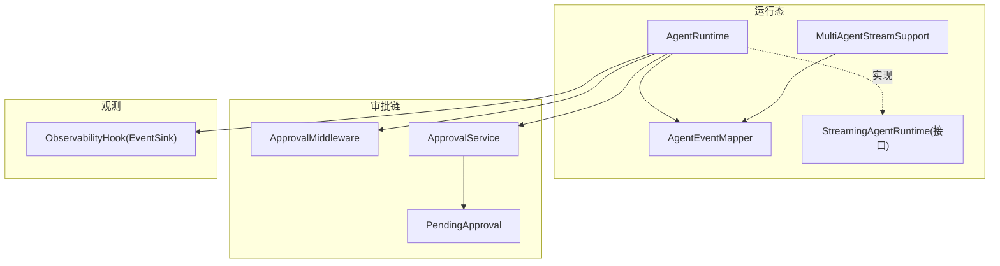
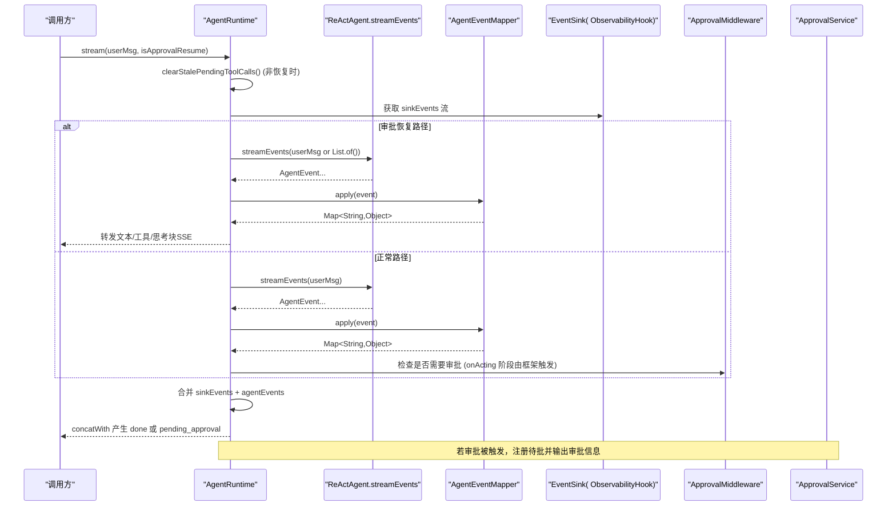
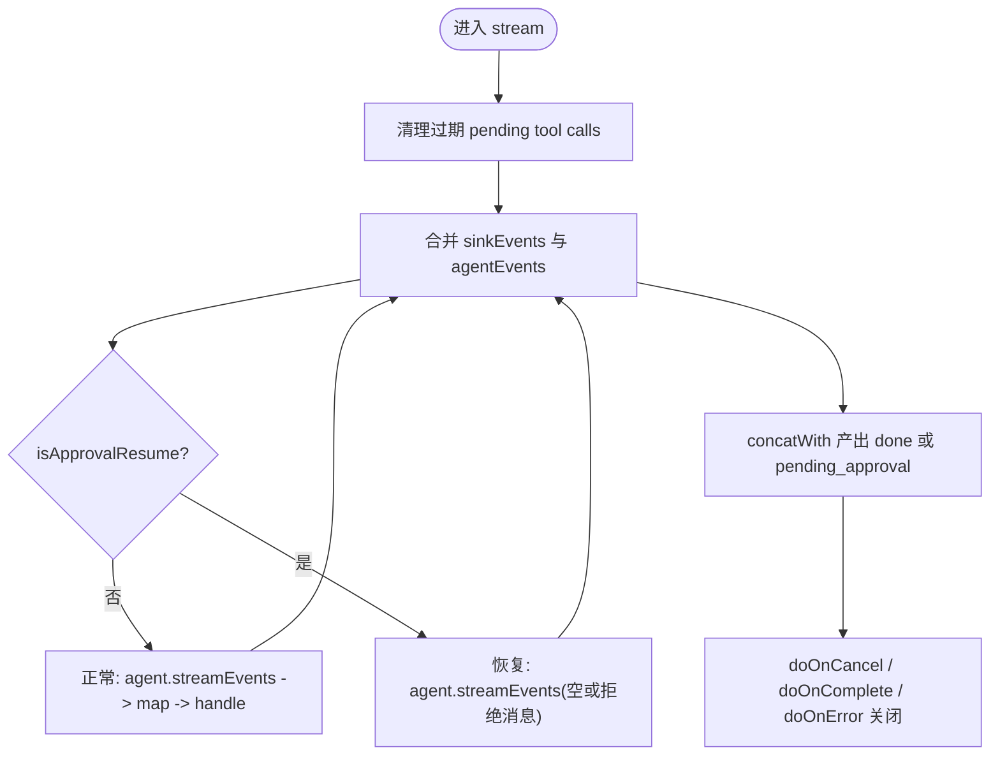
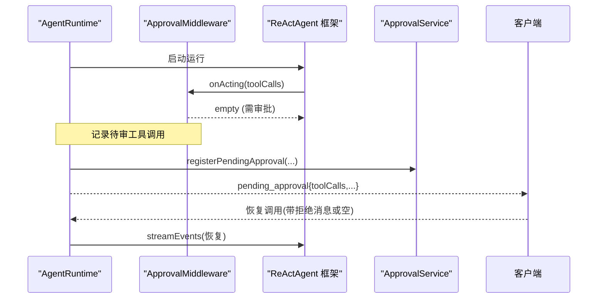
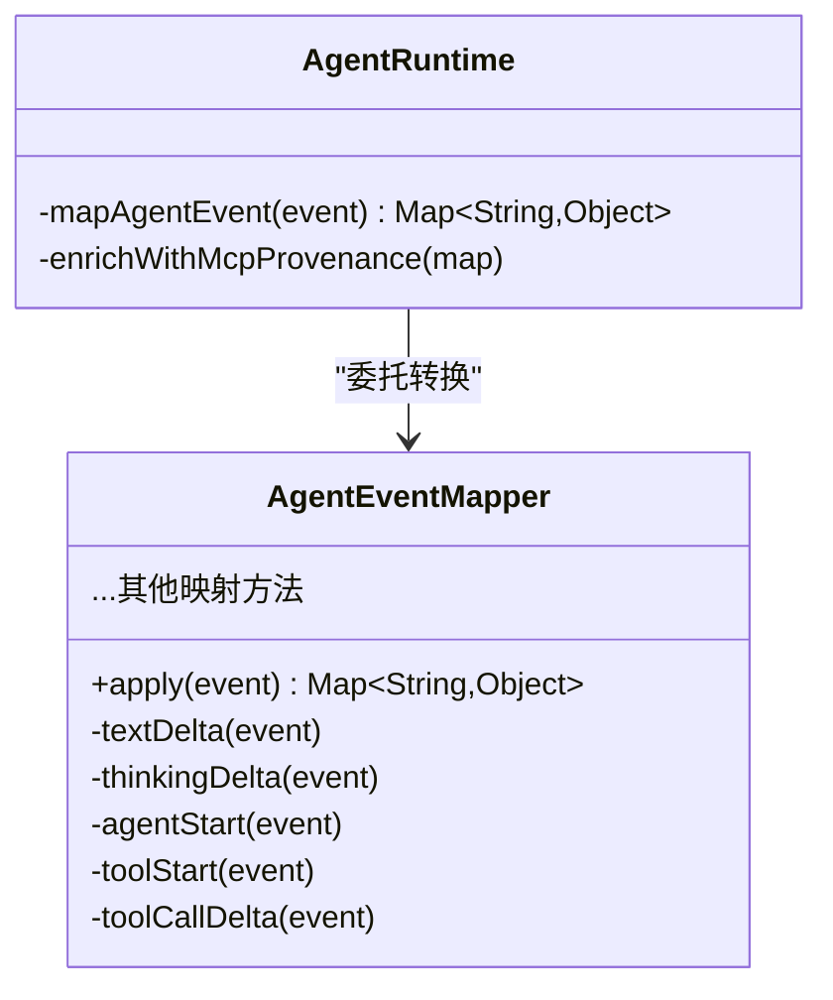
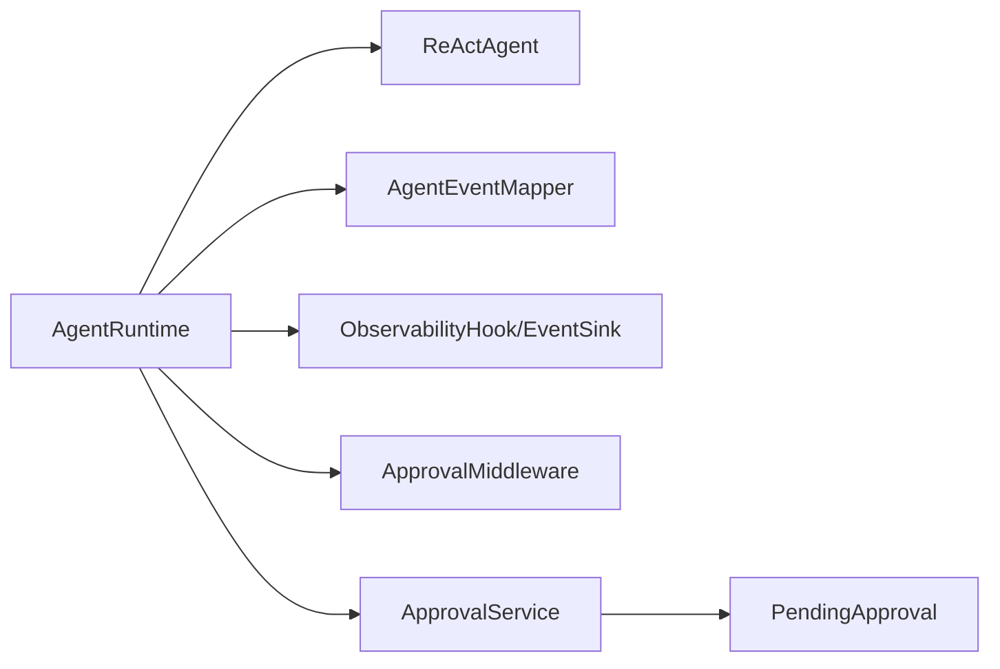

# AgentRuntime核心执行器

<cite>
**本文引用的文件列表**
- [AgentRuntime.java](file://src/main/java/com/skloda/agentscope/runtime/AgentRuntime.java)
- [AgentEventMapper.java](file://src/main/java/com/skloda/agentscope/runtime/AgentEventMapper.java)
- [StreamingAgentRuntime.java](file://src/main/java/com/skloda/agentscope/runtime/StreamingAgentRuntime.java)
- [MultiAgentStreamSupport.java](file://src/main/java/com/skloda/agentscope/runtime/MultiAgentStreamSupport.java)
- [ApprovalMiddleware.java](file://src/main/java/com/skloda/agentscope/middleware/ApprovalMiddleware.java)
- [ObservabilityHook.java](file://src/main/java/com/skloda/agentscope/hook/ObservabilityHook.java)
- [ApprovalService.java](file://src/main/java/com/skloda/agentscope/service/ApprovalService.java)
- [PendingApproval.java](file://src/main/java/com/skloda/agentscope/model/PendingApproval.java)
</cite>

## 目录
1. [引言](#引言)
2. [项目结构](#项目结构)
3. [核心组件](#核心组件)
4. [架构总览](#架构总览)
5. [详细组件分析](#详细组件分析)
6. [依赖关系分析](#依赖关系分析)
7. [性能考量](#性能考量)
8. [故障排查指南](#故障排查指南)
9. [结论](#结论)
10. [附录](#附录)

## 引言
本文件深入解析 AgentRuntime 作为单 Agent 会话容器的设计原理与执行细节。重点包括：
- ReActAgent 的生命周期管理与流式事件处理机制
- 审批中间件的集成点与恢复路径
- stream() 的完整执行流程（清理过期工具调用、合并手动多 Agent 事件与自动生命周期事件、处理审批恢复、生成完成事件）
- AgentScope 内部事件到 SSE 的映射机制与 MCP 溯源注入
- 会话状态清理策略（pending tool call 的回收机制）
- 自定义 Agent 运行时扩展开发指南

## 项目结构
本项目采用模块化分层组织，与 AgentRuntime 相关的代码主要位于 runtime、middleware、hook、service、model 等包中：
- runtime: 提供单一或多智能体的流式运行态与事件映射能力
- middleware: 拦截器（如审批中间件）在 Acting 阶段介入并暂停工具执行
- hook: 将多 Agent 流水线、路由、接力等人工事件以 EventSink 输出
- service: 管理待批处理请求的注册、清理、过期回收等
- model: 封装前端 SSE 事件数据模型及审批挂起状态

图示来源
- [AgentRuntime.java:26-66](file://src/main/java/com/skloda/agentscope/runtime/AgentRuntime.java#L26-L66)
- [AgentEventMapper.java:39-105](file://src/main/java/com/skloda/agentscope/runtime/AgentEventMapper.java#L39-L105)
- [StreamingAgentRuntime.java:9-20](file://src/main/java/com/skloda/agentscope/runtime/StreamingAgentRuntime.java#L9-L20)
- [MultiAgentStreamSupport.java:17-36](file://src/main/java/com/skloda/agentscope/runtime/MultiAgentStreamSupport.java#L17-L36)
- [ApprovalMiddleware.java:22-77](file://src/main/java/com/skloda/agentscope/middleware/ApprovalMiddleware.java#L22-L77)
- [ApprovalService.java:21-75](file://src/main/java/com/skloda/agentscope/service/ApprovalService.java#L21-L75)
- [ObservabilityHook.java:16-67](file://src/main/java/com/skloda/agentscope/hook/ObservabilityHook.java#L16-L67)

章节来源
- [AgentRuntime.java:26-66](file://src/main/java/com/skloda/agentscope/runtime/AgentRuntime.java#L26-L66)
- [StreamingAgentRuntime.java:9-20](file://src/main/java/com/skloda/agentscope/runtime/StreamingAgentRuntime.java#L9-L20)

## 核心组件
- AgentRuntime: 单 Agent 会话容器，封装 ReActAgent 调用、事件流合并、审批恢复、MCP 溯源、会话清理
- AgentEventMapper: 纯函数式转换器，覆盖全部 AgentEventType，将内部事件映射为前端可消费的 Map/SSE payload
- ApprovalMiddleware: 基于 MiddlewareBase 的干预层，在 Acting 阶段按需拦截 tool 调用，产出 pending_approval 事件
- ObservabilityHook + EventSink: 聚合手动多 Agent 事件（流水线/路由/交接/循环等），与 Agent 自动事件统一合并
- ApprovalService + PendingApproval: 暂存审批中的 Agent 实例及待审工具调用，定时清理过期记录

章节来源
- [AgentRuntime.java:67-142](file://src/main/java/com/skloda/agentscope/runtime/AgentRuntime.java#L67-L142)
- [AgentEventMapper.java:64-105](file://src/main/java/com/skloda/agentscope/runtime/AgentEventMapper.java#L64-L105)
- [ApprovalMiddleware.java:58-77](file://src/main/java/com/skloda/agentscope/middleware/ApprovalMiddleware.java#L58-L77)
- [ObservabilityHook.java:26-67](file://src/main/java/com/skloda/agentscope/hook/ObservabilityHook.java#L26-L67)
- [ApprovalService.java:29-75](file://src/main/java/com/skloda/agentscope/service/ApprovalService.java#L29-L75)
- [PendingApproval.java:13-38](file://src/main/java/com/skloda/agentscope/model/PendingApproval.java#L13-L38)

## 架构总览
下图展示了 AgentRuntime.stream() 的主流程以及关键分支与依赖：

图示来源
- [AgentRuntime.java:79-142](file://src/main/java/com/skloda/agentscope/runtime/AgentRuntime.java#L79-L142)
- [AgentEventMapper.java:64-105](file://src/main/java/com/skloda/agentscope/runtime/AgentEventMapper.java#L64-L105)
- [ApprovalMiddleware.java:58-77](file://src/main/java/com/skloda/agentscope/middleware/ApprovalMiddleware.java#L58-L77)
- [ObservabilityHook.java:26-67](file://src/main/java/com/skloda/agentscope/hook/ObservabilityHook.java#L26-L67)

## 详细组件分析

### AgentRuntime 执行流程与流式合并
- 清理过期工具调用
  - 在非审批恢复场景下，优先清理历史上下文中的“悬挂” ToolUseBlock，避免后续 enablePendingToolRecovery 产生污染性的错误结果
- 合并两类事件源
  - 手工事件: ObservabilityHook 的 EventSink 产生的多 Agent 生命周期事件（pipeline/routing/handoff/loop/graph/roundtable/task 等）
  - 自动事件: ReActAgent.streamEvents() 的 AgentEvent 流，经 AgentEventMapper 转换为 SSE 语义的 Map
- 审批恢复路径
  - 当 isApprovalResume=true，使用重新发起 streamEvents() 的方式，保留完整的 thinking/tool/text 等事件序列，保证前端一致性渲染
- 完成事件
  - 当 agent 事件终止后，根据审批中间件是否被触发，输出 pending_approval 或 done；同时确保 EventSink 完成，避免前端挂死
- 资源释放
  - doOnCancel/doOnComplete/doOnError 均调用 close，保障订阅与状态清理

图示来源
- [AgentRuntime.java:79-142](file://src/main/java/com/skloda/agentscope/runtime/AgentRuntime.java#L79-L142)
- [AgentRuntime.java:156-183](file://src/main/java/com/skloda/agentscope/runtime/AgentRuntime.java#L156-L183)

章节来源
- [AgentRuntime.java:79-183](file://src/main/java/com/skloda/agentscope/runtime/AgentRuntime.java#L79-L183)

### 审批中间件集成点与作用机制
- 拦截时机: 基于 MiddlewareBase.onActing，在工具调用前对 toolCalls 进行规则判定
- 审批触发条件: 全局开关 approvalRequired=true，或指定 approvalTools 列表匹配
- 行为:
  - 设置标记 approvalTriggered，缓存待审 ToolUseBlock
  - 返回空流跳过实际工具执行，自然结束当前 run
- AgentRuntime 配合:
  - 流结束时检测是否触发了审批，注册 PendingApproval 并向客户端推送 pending_approval 事件
  - 接收恢复调用时，构造新的 streamEvents 再次运行，保持一致的事件类型

图示来源
- [ApprovalMiddleware.java:58-77](file://src/main/java/com/skloda/agentscope/middleware/ApprovalMiddleware.java#L58-L77)
- [AgentRuntime.java:173-183](file://src/main/java/com/skloda/agentscope/runtime/AgentRuntime.java#L173-L183)
- [ApprovalService.java:29-45](file://src/main/java/com/skloda/agentscope/service/ApprovalService.java#L29-L45)

章节来源
- [ApprovalMiddleware.java:58-124](file://src/main/java/com/skloda/agentscope/middleware/ApprovalMiddleware.java#L58-L124)
- [AgentRuntime.java:173-183](file://src/main/java/com/skloda/agentscope/runtime/AgentRuntime.java#L173-L183)

### 事件映射机制与 MCP 溯源注入
- 事件覆盖范围: AgentEventMapper 覆盖全部 AgentEventType（文本/思考块、模型调用、工具调用、外部执行、用户确认、子代理、提示块、全部拒绝、自定义事件、块边界等），并丢弃不需要渲染的块边界事件
- 错误兜底: 转换异常时被捕获并转为 error 事件，不会中断流
- MCP 溯源增强:
  - 在 AgentRuntime.mapAgentEvent 中，对于 tool_start 事件，通过反向查找工具的元信息进行 isMcp、mcpName 注入，使前端能够识别工具来源于 MCP 及其来源服务器
  - 该增强发生在具备 toolkit 访问能力的上下文中，而 Mapper 本身保持无副作用纯函数特性，便于独立测试与复用

图示来源
- [AgentEventMapper.java:64-105](file://src/main/java/com/skloda/agentscope/runtime/AgentEventMapper.java#L64-L105)
- [AgentRuntime.java:195-200](file://src/main/java/com/skloda/agentscope/runtime/AgentRuntime.java#L195-L200)

章节来源
- [AgentEventMapper.java:64-389](file://src/main/java/com/skloda/agentscope/runtime/AgentEventMapper.java#L64-L389)
- [AgentRuntime.java:195-200](file://src/main/java/com/skloda/agentscope/runtime/AgentRuntime.java#L195-L200)

### 会话状态清理策略（pending tool call 回收）
- 触发时机: 每次新请求开始前（除非是审批恢复路径）
- 目标: 删除上一次的未闭合 assistant 消息中包含的 ToolUseBlock（无匹配的 ToolResultBlock），防止后续启用的 enablePendingToolRecovery 自动生成错误结果造成对话污染
- 好处: 保证会话上下文干净、UI 一致、避免误判工具失败

章节来源
- [AgentRuntime.java:82-92](file://src/main/java/com/skloda/agentscope/runtime/AgentRuntime.java#L82-L92)

### 多 Agent 事件融合与源标签
- ObservabilityHook.EventSink 输出的多 Agent 事件（流水线/路由/接力/循环/Graph/圆桌/任务委派等）与 Agent 自动事件在 Flux.merge 中并行融合
- MultiAgentStreamSupport 为复杂编排提供统一的 runSubAgent 能力，将每个子 Agent 的事件转发至外层 sink，并以 sourceLabel 标注来源，同时收集最终文本用于步骤衔接

章节来源
- [ObservabilityHook.java:45-67](file://src/main/java/com/skloda/agentscope/hook/ObservabilityHook.java#L45-L67)
- [MultiAgentStreamSupport.java:46-118](file://src/main/java/com/skloda/agentscope/runtime/MultiAgentStreamSupport.java#L46-L118)

## 依赖关系分析
- AgentRuntime 依赖:
  - ReActAgent: 原始事件源
  - AgentEventMapper: 事件到 SSE Map 的转换器
  - ObservabilityHook/EventSink: 注入多 Agent 事件
  - ApprovalMiddleware: 拦截并触发审批
  - ApprovalService: 暂存待审批信息与 Agent 引用
- 耦合度与内聚性:
  - Mapper 完全无状态，高内聚低耦合
  - Runtime 整合多个子系统但职责清晰：流程控制、合并、恢复、收尾
  - 审批相关逻辑通过中间件与服务解耦，易于替换与扩展

图示来源
- [AgentRuntime.java:36-66](file://src/main/java/com/skloda/agentscope/runtime/AgentRuntime.java#L36-L66)
- [ApprovalService.java:21-75](file://src/main/java/com/skloda/agentscope/service/ApprovalService.java#L21-L75)

章节来源
- [AgentRuntime.java:36-66](file://src/main/java/com/skloda/agentscope/runtime/AgentRuntime.java#L36-L66)
- [ApprovalService.java:21-75](file://src/main/java/com/skloda/agentscope/service/ApprovalService.java#L21-L75)

## 性能考量
- 事件过滤: 仅对需要渲染的事件下发，块边界直接丢弃，减少不必要的传输
- 使用 handle() 避免空值异常: 相比 map()+filter() 更稳健，降低异常开销
- 流式合并: Flux.merge 将多路事件并行合并，保持事件时序稳定，避免阻塞
- 清理策略前置: 在新请求开始时清理悬挂上下文，避免后续处理额外判断成本
- 定时清理: PendingApproval 定期过期清理，避免长期持有 Agent 与 Hook 引用导致内存泄漏

[本节为通用性能指导，无需特定文件引用]

## 故障排查指南
- 问题: 前端流无法结束、输入框永久禁用
  - 排查: 检查 EventSink 是否在 agent 事件终止后完成，避免 merge 无法完结
  - 参考位置: stream 末尾合并事件与 complete sink 的逻辑
- 问题: 审批后只收到最终文本，缺少过程事件
  - 排查: 恢复路径是否使用 streamEvents 而非 call；确保 createApprovalResumeStream 使用正确参数
- 问题: 历史上下文残留工具调用导致错误提示
  - 排查: 确认清理逻辑在非恢复场景已执行，避免 enablePendingToolRecovery 产生假阳性错误
- 问题: MCP 工具缺少溯源信息
  - 排查: 确认 tool_start 事件进入 enrichWithMcpProvenance 逻辑，工具名能反查到 MCP 源

章节来源
- [AgentRuntime.java:112-142](file://src/main/java/com/skloda/agentscope/runtime/AgentRuntime.java#L112-L142)
- [AgentRuntime.java:156-183](file://src/main/java/com/skloda/agentscope/runtime/AgentRuntime.java#L156-L183)
- [ApprovalMiddleware.java:58-77](file://src/main/java/com/skloda/agentscope/middleware/ApprovalMiddleware.java#L58-L77)

## 结论
AgentRuntime 将 ReActAgent 的自动生命周期事件与多 Agent 的手工事件统一汇聚，并通过严格的事件映射输出稳定的 SSE 语义。其关键优势在于：
- 清晰的审批中断/恢复路径
- 健壮的会话上下文清理
- 对 MCP 溯源的精细注入
- 可扩展的中间件和服务协作模式

这使得上层业务可以专注于 Agent 能力定义，而不必关心底层事件流转与状态管理。

[本节为总结性内容，不直接引用具体文件]

## 附录
### API 与事件概览
- AgentRuntime.stream(Msg): 返回 Flux<Map<String,Object>>，事件类型包括:
  - 文本/思考: text, thinking
  - 模型调用: llm_start, llm_end
  - 工具调用: tool_start, tool_call_delta, tool_end, tool_result_start/end, tool_result_text/data_delta
  - 子代理/外部执行/提示/自定义等
  - 结尾: done 或 pending_approval

### 自定义 Agent 运行时扩展指南
- 目标: 在现有 AgentRuntime 基础上扩展更多编排形态或增强能力
- 建议方式:
  - 继承 StreamingAgentRuntime 接口，组合已有的 AgentEventMapper、ObservabilityHook、ApprovalMiddleware
  - 复用 MultiAgentStreamSupport.runSubAgent 来桥接流式子 Agent 并向前传递事件
  - 新增审批策略: 实现 ApprovalMiddleware 的子类或在中间件链中插入新的拦截器
  - 如需持久化上下文: 使用 AgentStateStore（通过 ReActAgent 配置开启）并结合 AgentRuntime 的请求前清理
  - 事件溯源: 在事件转换后注入领域追踪字段（类似 MCP 溯源），保持无副作用的映射与有状态的增强分离

章节来源
- [StreamingAgentRuntime.java:9-20](file://src/main/java/com/skloda/agentscope/runtime/StreamingAgentRuntime.java#L9-L20)
- [MultiAgentStreamSupport.java:59-118](file://src/main/java/com/skloda/agentscope/runtime/MultiAgentStreamSupport.java#L59-L118)
- [ApprovalMiddleware.java:22-124](file://src/main/java/com/skloda/agentscope/middleware/ApprovalMiddleware.java#L22-L124)