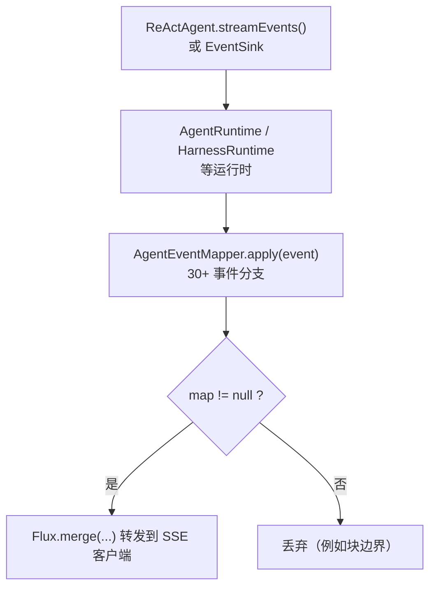
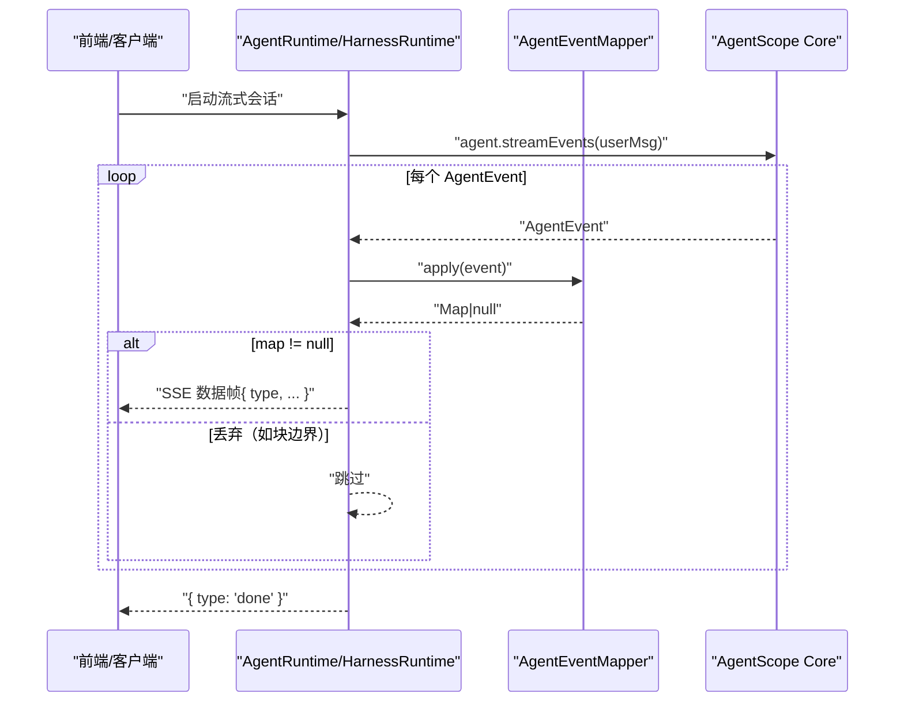
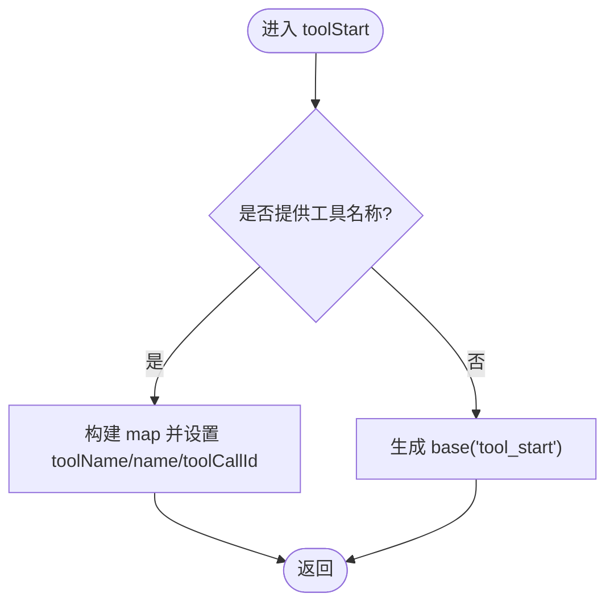
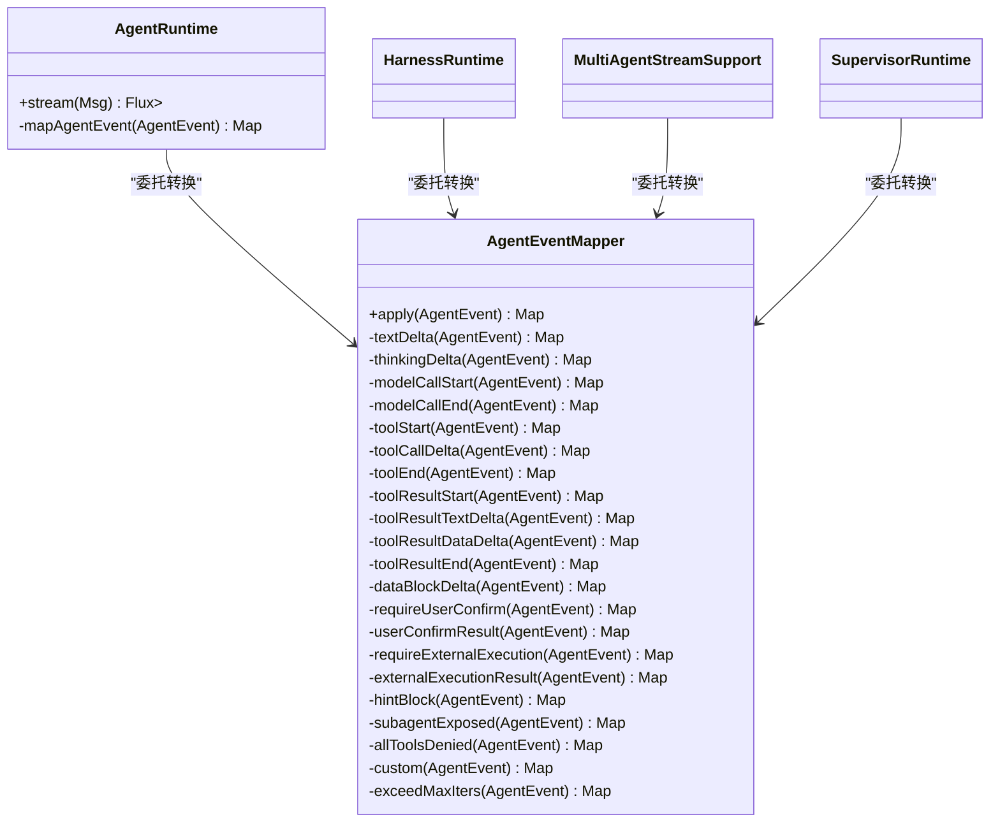

# 事件映射系统

<cite>
**本文引用的文件**
- [AgentEventMapper.java](file://src/main/java/com/skloda/agentscope/runtime/AgentEventMapper.java)
- [AgentRuntime.java](file://src/main/java/com/skloda/agentscope/runtime/AgentRuntime.java)
- [AgentEventMapperTest.java](file://src/test/java/com/skloda/agentscope/runtime/AgentEventMapperTest.java)
- [HarnessRuntime.java](file://src/main/java/com/skloda/agentscope/harness/HarnessRuntime.java)
- [MultiAgentStreamSupport.java](file://src/main/java/com/skloda/agentscope/runtime/MultiAgentStreamSupport.java)
- [SupervisorRuntime.java](file://src/main/java/com/skloda/agentscope/blackboard/SupervisorRuntime.java)
- [StreamingAgentRuntime.java](file://src/main/java/com/skloda/agentscope/runtime/StreamingAgentRuntime.java)
</cite>

## 目录
1. [简介](#简介)
2. [项目结构](#项目结构)
3. [核心组件](#核心组件)
4. [架构总览](#架构总览)
5. [详细组件分析](#详细组件分析)
6. [依赖关系分析](#依赖关系分析)
7. [性能考量](#性能考量)
8. [故障排查指南](#故障排查指南)
9. [结论](#结论)
10. [附录：新增事件类型扩展指南](#附录新增事件类型扩展指南)

## 简介
本文件面向 AgentScope 2.0 事件到 SSE（Server-Sent Events）消息的映射层，聚焦于 AgentEventMapper 的实现与契约。它负责将 AgentScope 内核产生的原生 AgentEvent 转换为前端可消费的 Map 结构（type + payload），并统一处理 30+ 种事件类型：文本/思考增量、模型调用起止、工具调用链、外部执行流程、用户确认流程、子代理暴露、提示块等。文档同时解释事件过滤策略（如丢弃块边界）、错误降级策略，并给出扩展新事件类型的步骤与最佳实践。

## 项目结构
事件映射的核心位于 runtime 包中，被多种运行时（单代理、多代理流水线、监管器等）复用：
- AgentEventMapper：纯函数式转换，按 AgentEventType 分支处理。
- AgentRuntime / HarnessRuntime / SupervisorRuntime / MultiAgentStreamSupport：从各来源收集 AgentEvent 流，调用 mapper.apply() 并过滤空结果后发往下游。
- StreamingAgentRuntime：统一流式接口契约（Flux<Map<String,Object>>）。

图表来源
- [AgentRuntime.java:97-136](file://src/main/java/com/skloda/agentscope/runtime/AgentRuntime.java#L97-L136)
- [AgentEventMapper.java:64-105](file://src/main/java/com/skloda/agentscope/runtime/AgentEventMapper.java#L64-L105)

章节来源
- [StreamingAgentRuntime.java:12-20](file://src/main/java/com/skloda/agentscope/runtime/StreamingAgentRuntime.java#L12-L20)

## 核心组件
- AgentEventMapper：按事件类型分派的具体实现，包含所有受控事件的处理、丢弃规则与兜底 error 类型。
- 各类运行时：通过 handle()/concatWith/doFinally 等 Reactor 操作组合事件流，并在完成时追加 "done" 或其他结束事件；在 tool_start 上还可注入 MCP 溯源信息。

关键职责分离：
- AgentEventMapper 仅做无副作用的“事件→Map”转换。
- 运行时负责事件流编排与额外字段注入（如 timestamp、MCP 信息等），以及与 EventSink 的多路合并。

章节来源
- [AgentEventMapper.java:39-105](file://src/main/java/com/skloda/agentscope/runtime/AgentEventMapper.java#L39-L105)
- [AgentRuntime.java:185-203](file://src/main/java/com/skloda/agentscope/runtime/AgentRuntime.java#L185-L203)

## 架构总览
事件流进入 AgentRuntime/HarnessRuntime 等容器后，交由 AgentEventMapper 进行标准化。Mapper 根据事件类型返回对应的 Map，或以 null 丢弃无关事件；随后由运行时 filter/handle 过滤，并通过 Flux.merge 与其他手动事件合并输出。结束时追加 "done"（或由审批流补充 pending_approval）。

图表来源
- [AgentRuntime.java:97-136](file://src/main/java/com/skloda/agentscope/runtime/AgentRuntime.java#L97-L136)
- [AgentEventMapper.java:64-105](file://src/main/java/com/skloda/agentscope/runtime/AgentEventMapper.java#L64-L105)

## 详细组件分析

### AgentEventMapper 事件分类与处理
以下是主要事件类型的处理摘要（基于测试与实现逻辑归纳），以及它们的典型前端用途。

- 文本与思考增量
  - TEXT_BLOCK_DELTA → type=text，携带 content 增量
  - THINKING_BLOCK_DELTA → type=thinking，携带 reasoning 增量
  - 说明：空 delta 会被丢弃，避免冗余帧

- 代理生命周期
  - AGENT_START → type=agent_start，含 name/role
  - AGENT_END → type=agent_end
  - AGENT_RESULT → 若 result.msg.content 存在文本，则 type=agent_result_text 且附 content

- 模型调用
  - MODEL_CALL_START → type=llm_start
  - MODEL_CALL_END → type=llm_end，附加输入/输出/总 token 数（当使用 ModelCallEndEvent 的 Usage）

- 工具调用链
  - TOOL_CALL_START → type=tool_start，附带 toolName/name/toolCallId
  - TOOL_CALL_DELTA → type=tool_call_delta，增量拼接工具参数或调用上下文
  - TOOL_CALL_END → type=tool_end，附带 toolName/name

- 工具结果流
  - TOOL_RESULT_START → type=tool_result_start
  - TOOL_RESULT_TEXT_DELTA → type=tool_result_delta，文本增量内容
  - TOOL_RESULT_DATA_DELTA → type=tool_result_delta，内容预览（对非文本 ContentBlock 提供字符串化预览，便于调试面板显示）
  - TOOL_RESULT_END → type=tool_result_end，带 state（如 SUCCESS）

- 数据块增量
  - DATA_BLOCK_DELTA → type=data_block_delta，携带 blockId 与 content 片段

- 控制与限制
  - EXCEED_MAX_ITERS → type=exceed_max_iters，附带 maxIters/currentIter

- 人机协同（HITL）占位通路
  - REQUIRE_USER_CONFIRM → type=require_user_confirm，聚合待确认工具清单（用于未来权限系统联动）
  - USER_CONFIRM_RESULT → type=user_confirm_result，包含每项的 confirmed 标记与工具名
  - REQUIRE_EXTERNAL_EXECUTION → type=require_external_execution，聚合外部执行清单
  - EXTERNAL_EXECUTION_RESULT → type=external_execution_result，附带 count

- 提示与子代理
  - HINT_BLOCK → type=hint，附带 hint/source
  - SUBAGENT_EXPOSED → type=subagent_exposed，包含 subagentId/agentId/label 等标识
  - ALL_TOOLS_DENIED → type=all_tools_denied
  - REQUEST_STOP → type=request_stop
  - CUSTOM → type 使用事件 name（fallback 为 custom），value 合入 payload

- 需要丢弃的事件（不产生 UI 可见帧）
  - 文本/思考/数据块起止边界：TEXT_BLOCK_START/END、THINKING_BLOCK_START/END、DATA_BLOCK_START/END → 返回 null 直接丢弃

章节来源
- [AgentEventMapper.java:64-105](file://src/main/java/com/skloda/agentscope/runtime/AgentEventMapper.java#L64-L105)
- [AgentEventMapper.java:107-373](file://src/main/java/com/skloda/agentscope/runtime/AgentEventMapper.java#L107-L373)
- [AgentEventMapperTest.java:61-358](file://src/test/java/com/skloda/agentscope/runtime/AgentEventMapperTest.java#L61-L358)

### 运行时集成与过滤
- AgentRuntime
  - 使用 agent.streamEvents() 获取事件流
  - handle(mapAgentEvent -> sink next) 实现“返回 null 即丢弃”的语义
  - 结束时追加 { type: "done" }；若触发 HITL 审批流，则可能追加 pending_approval
  - 对 tool_start 可注入 MCP 溯源字段（isMcp、mcpName），提升可观测性

- HarnessRuntime / MultiAgentStreamSupport / SupervisorRuntime
  - 同样通过 EVENT_MAPPER.apply() 将 AgentScope 事件统一化
  - 利用 doFinally 确保 EventSink 正确完成，从而使 merge 后的流能正常结束

章节来源
- [AgentRuntime.java:97-203](file://src/main/java/com/skloda/agentscope/runtime/AgentRuntime.java#L97-L203)
- [HarnessRuntime.java:52-56](file://src/main/java/com/skloda/agentscope/harness/HarnessRuntime.java#L52-L56)
- [MultiAgentStreamSupport.java:85](file://src/main/java/com/skloda/agentscope/runtime/MultiAgentStreamSupport.java#L85)
- [SupervisorRuntime.java:536](file://src/main/java/com/skloda/agentscope/blackboard/SupervisorRuntime.java#L536)

### 错误处理与异常降级
- 内部异常保护
  - apply 方法内以 try-catch 包裹 switch 逻辑，发生异常时不抛错，而是回退为一个统一的 error 类型事件，其中 message 包含原始异常信息，保障前端不会崩溃

- 空对象/边界值
  - 对 null 事件直接返回 null（下游丢弃）
  - 针对部分字段为空的情况（如 text/thinking 的 delta 为空），返回 null 丢弃，减少噪声

- 运行时终止契约
  - AgentRuntime 在最终阶段保证发送 { type: "done" }，或在命中审批时发送 pending_approval 作为完成信号，确保前端能可靠关闭流

章节来源
- [AgentEventMapper.java:64-105](file://src/main/java/com/skloda/agentscope/runtime/AgentEventMapper.java#L64-L105)
- [AgentRuntime.java:112-141](file://src/main/java/com/skloda/agentscope/runtime/AgentRuntime.java#L112-L141)

### 事件处理流程图（示例：工具调用链）

图表来源
- [AgentEventMapper.java:174-185](file://src/main/java/com/skloda/agentscope/runtime/AgentEventMapper.java#L174-L185)

章节来源
- [AgentEventMapper.java:174-185](file://src/main/java/com/skloda/agentscope/runtime/AgentEventMapper.java#L174-L185)

## 依赖关系分析

图表来源
- [AgentEventMapper.java:39-105](file://src/main/java/com/skloda/agentscope/runtime/AgentEventMapper.java#L39-L105)
- [AgentRuntime.java:185-203](file://src/main/java/com/skloda/agentscope/runtime/AgentRuntime.java#L185-L203)

章节来源
- [AgentEventMapper.java:39-105](file://src/main/java/com/skloda/agentscope/runtime/AgentEventMapper.java#L39-L105)
- [AgentRuntime.java:185-203](file://src/main/java/com/skloda/agentscope/runtime/AgentRuntime.java#L185-L203)

## 性能考量
- 低开销转换：每个事件只进行简单 field 抽取与 Map 构造，时间复杂度近似 O(1)。
- 丢弃策略减载：大量块边界事件被丢弃，降低网络与渲染压力。
- 零抛出设计：异常被捕获并降级为 error 事件，避免流中断造成额外重试成本。
- 增量传输：文本、思考与工具参数使用 delta 增量推送，降低带宽占用并提升首字延迟。

[本节为通用指导，无需源码引用]

## 故障排查指南
- 现象：某些事件未出现在前端
  - 检查是否为“需丢弃的块边界事件”
  - 对照 AgentEventMapper 的事件分支表确认目标事件是否已有处理路径

- 现象：前端收到 { type: "error" }
  - 检查 apply 内部的异常栈与日志，定位上游事件解析问题

- 现象：流无法结束
  - 确认 AgentRuntime 是否正确追加 "done" 或通过审批流程发出 pending_approval
  - 验证 doFinally 是否正确完成 EventSink

章节来源
- [AgentEventMapper.java:64-105](file://src/main/java/com/skloda/agentscope/runtime/AgentEventMapper.java#L64-L105)
- [AgentRuntime.java:112-141](file://src/main/java/com/skloda/agentscope/runtime/AgentRuntime.java#L112-L141)

## 结论
AgentEventMapper 是连接 AgentScope 原生事件流与前端 SSE 的关键适配层。它以纯函数形式覆盖 30+ 事件类型，提供一致的 type/payload 契约，并通过丢弃冗余事件、异常降级、统一结束信号等手段确保高可用与稳定体验。结合运行时层的流式编排，可在单代理、多代理管线和监管器场景下保持一致的交互语义。

[本节为总结，无需源码引用]

## 附录：新增事件类型扩展指南
如需新增一个或多个 AgentEventType 的映射与行为，请遵循以下步骤：

1. 确定事件归属类别
   - 增量类：考虑以 delta 形式拆分推送，便于增量渲染
   - 生命周期/控制类：一次性事件，承载关键状态变化
   - 结果/统计类：附带用量、状态码、计数等信息
   - HITL/外部执行：保持与现有 require_* / user_confirm_result / external_execution_result 的语义对齐

2. 在 AgentEventMapper 中添加分支
   - 在 main apply 的 switch/case 中加入新的类型匹配
   - 实现独立的处理方法，返回 Map 或 null（丢弃）
   - 对于可选字段（如 name/id/delta）提供空安全默认值

3. 补充单元测试
   - 使用对应的具体事件构造器创建用例
   - 断言 type 与关键字段（如 toolName、content、state、count 等）
   - 覆盖边界场景（null/空字段、异常路径）

4. 在运行时侧验证
   - 确保运行时通过 handle/map/filter 正确处理 null 丢弃
   - 对新增字段的前端消费做最小可用性校验（例如 console.log/Debug 面板）

5. 回归与兼容
   - 保持向后兼容：不要破坏已有 type 的语义
   - 若有必要新增可选字段，避免要求客户端强依赖
   - 更新本表格以便协作者快速定位

建议参考的文件范围
- 添加新分支的位置：AgentEventMapper 主切换逻辑与方法实现
- 使用位置：AgentRuntime / HarnessRuntime / MultiAgentStreamSupport / SupervisorRuntime
- 行为契约与用例：AgentEventMapperTest

章节来源
- [AgentEventMapper.java:64-105](file://src/main/java/com/skloda/agentscope/runtime/AgentEventMapper.java#L64-L105)
- [AgentEventMapperTest.java:39-56](file://src/test/java/com/skloda/agentscope/runtime/AgentEventMapperTest.java#L39-L56)