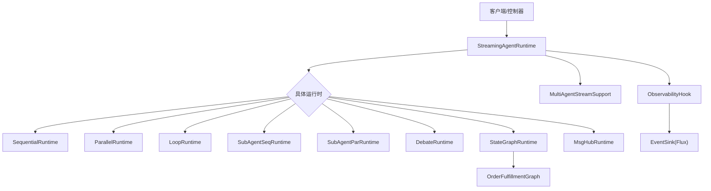
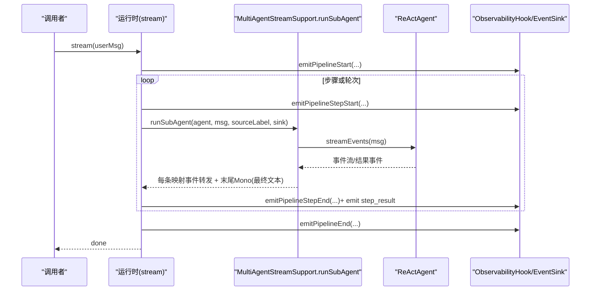
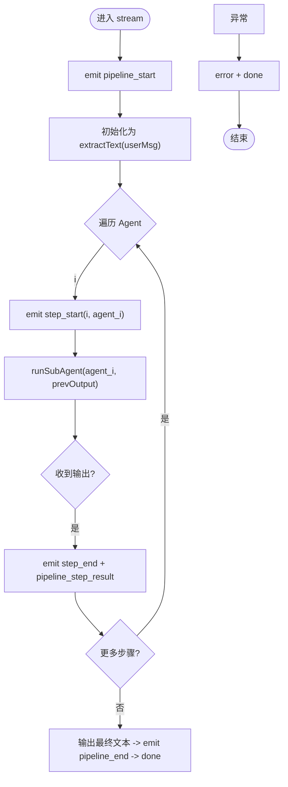
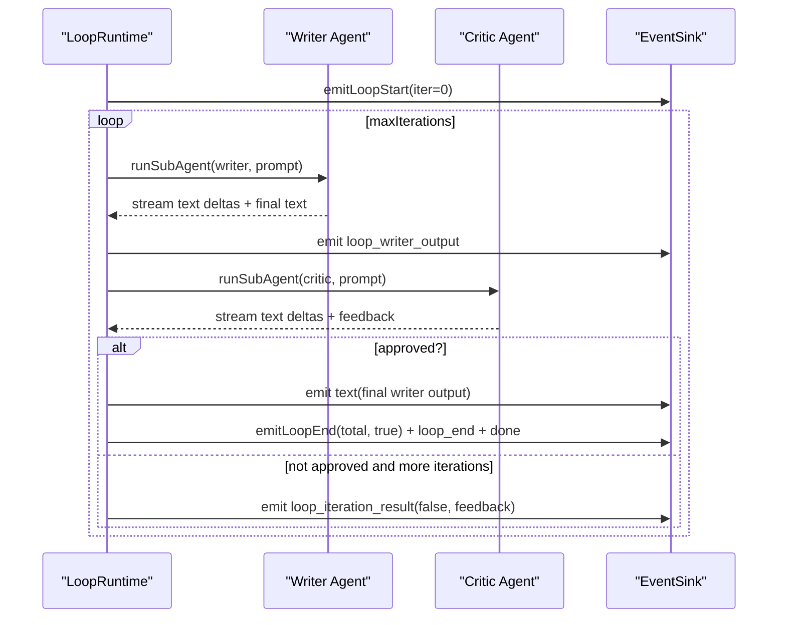
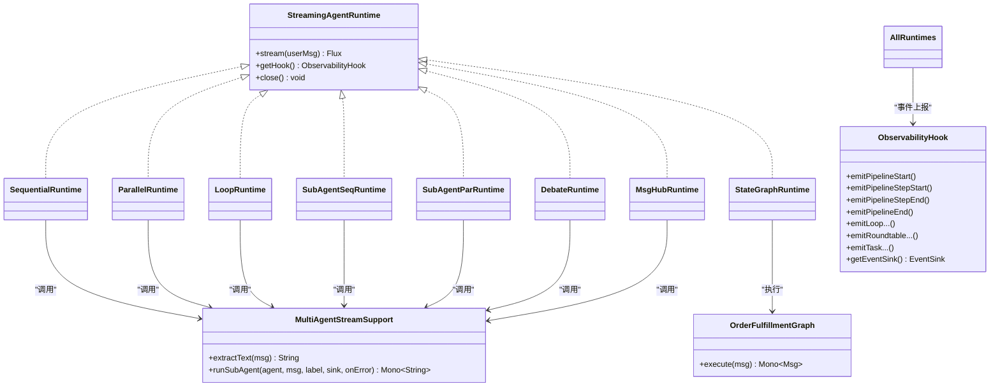

# 复合运行时实现

<cite>
**本文引用的文件**
- [SequentialRuntime.java](file://src/main/java/com/skloda/agentscope/runtime/SequentialRuntime.java)
- [ParallelRuntime.java](file://src/main/java/com/skloda/agentscope/runtime/ParallelRuntime.java)
- [LoopRuntime.java](file://src/main/java/com/skloda/agentscope/runtime/LoopRuntime.java)
- [SubAgentSeqRuntime.java](file://src/main/java/com/skloda/agentscope/runtime/SubAgentSeqRuntime.java)
- [SubAgentParRuntime.java](file://src/main/java/com/skloda/agentscope/runtime/SubAgentParRuntime.java)
- [DebateRuntime.java](file://src/main/java/com/skloda/agentscope/runtime/DebateRuntime.java)
- [StateGraphRuntime.java](file://src/main/java/com/skloda/agentscope/runtime/StateGraphRuntime.java)
- [MsgHubRuntime.java](file://src/main/java/com/skloda/agentscope/runtime/MsgHubRuntime.java)
- [MultiAgentStreamSupport.java](file://src/main/java/com/skloda/agentscope/runtime/MultiAgentStreamSupport.java)
- [StreamingAgentRuntime.java](file://src/main/java/com/skloda/agentscope/runtime/StreamingAgentRuntime.java)
- [ObservabilityHook.java](file://src/main/java/com/skloda/agentscope/hook/ObservabilityHook.java)
- [OrderFulfillmentGraph.java](file://src/main/java/com/skloda/agentscope/composite/graph/OrderFulfillmentGraph.java)
</cite>

## 目录
1. [简介](#简介)
2. [项目结构与运行时代码布局](#项目结构与运行时代码布局)
3. [核心组件与抽象契约](#核心组件与抽象契约)
4. [体系结构总览](#体系结构总览)
5. [详细组件分析](#详细组件分析)
6. [依赖关系与事件流分析](#依赖关系与事件流分析)
7. [性能考量与优化建议](#性能考量与优化建议)
8. [故障排查指南](#故障排查指南)
9. [结论](#结论)
10. [附录：事件与SSE规范速查](#附录：事件与sse规范速查)

## 简介
本文件对 AgentScope Demo 中的“复合运行时”进行深入解析。围绕以下八种复杂协作模式，系统阐述其执行策略、事件处理机制、错误传播与生命周期管理：顺序流水线（SequentialRuntime）、并行处理（ParallelRuntime）、循环执行（LoopRuntime）、顺序子代理（SubAgentSeqRuntime）、并行子代理（SubAgentParRuntime）、辩论模式（DebateRuntime）、状态图执行（StateGraphRuntime）、消息中心（MsgHubRuntime）。重点说明如何利用 MultiAgentStreamSupport 完成子 Agent 的流式编排，并明确 pipeline 相关 SSE 事件（pipeline_start、pipeline_step_start、pipeline_step_result、pipeline_end）的正确发送时机与语义。

## 项目结构与运行时代码布局
所有运行时统一实现 StreamingAgentRuntime 接口，通过 ObservabilityHook 接入统一的 EventSink，向消费者（如前端 SSE）广播多智能体事件；借助 Reactor 的 Flux/Mono 实现非阻塞链式编排，保障实时性与背压安全。状态图运行时则组合外部 OrderFulfillmentGraph 实现有界流程控制。

图示来源
- [StreamingAgentRuntime.java:9-20](file://src/main/java/com/skloda/agentscope/runtime/StreamingAgentRuntime.java#L9-L20)
- [ObservabilityHook.java:16-67](file://src/main/java/com/skloda/agentscope/hook/ObservabilityHook.java#L16-L67)
- [MultiAgentStreamSupport.java:36-119](file://src/main/java/com/skloda/agentscope/runtime/MultiAgentStreamSupport.java#L36-L119)

节源
- [StreamingAgentRuntime.java:9-20](file://src/main/java/com/skloda/agentscope/runtime/StreamingAgentRuntime.java#L9-L20)

## 核心组件与抽象契约
- StreamingAgentRuntime：提供统一的 stream(Msg) 入口、钩子获取和关闭语义，保证各运行时对外一致。
- ObservabilityHook：集中暴露 pipeline/loop/debate/task/graph/roundtable 等事件发射方法，底层委托 EventSink。
- MultiAgentStreamSupport：统一从 ReActAgent 的事件流中转发 SSE，并将最终文本封装为 Mono，供上层编排链 flatMap/then 组合使用。
- StateGraphRuntime：将自定义状态机与运行时合并，支持事件转译与结束信号。

节源
- [StreamingAgentRuntime.java:9-20](file://src/main/java/com/skloda/agentscope/runtime/StreamingAgentRuntime.java#L9-L20)
- [ObservabilityHook.java:16-67](file://src/main/java/com/skloda/agentscope/hook/ObservabilityHook.java#L16-L67)
- [MultiAgentStreamSupport.java:36-119](file://src/main/java/com/skloda/agentscope/runtime/MultiAgentStreamSupport.java#L36-L119)
- [StateGraphRuntime.java:13-74](file://src/main/java/com/skloda/agentscope/runtime/StateGraphRuntime.java#L13-L74)

## 体系结构总览
每个运行时的典型执行路径：
- 初始化与启动：创建或接收 ReActAgent 列表与 ObservabilityHook，必要时准备任务模板/轮数/步数。
- 流式执行：基于 Flux.create/merge，将引擎产生的多智能体事件与业务事件合并，按策略调用 runSubAgent。
- 事件上报：关键节点触发 pipeline_start/step_start/step_result/end 等观测事件，并转发 SSE 到前端。
- 终止与清理：在 onFinalize/onCancel/close 处关闭 EventSink 确保响应完成。

图示来源
- [SequentialRuntime.java:37-89](file://src/main/java/com/skloda/agentscope/runtime/SequentialRuntime.java#L37-L89)
- [ParallelRuntime.java:38-106](file://src/main/java/com/skloda/agentscope/runtime/ParallelRuntime.java#L38-L106)
- [MultiAgentStreamSupport.java:59-119](file://src/main/java/com/skloda/agentscope/runtime/MultiAgentStreamSupport.java#L59-L119)
- [ObservabilityHook.java:45-66](file://src/main/java/com/skloda/agentscope/hook/ObservabilityHook.java#L45-L66)

## 详细组件分析

### 顺序流水线（SequentialRuntime）
- 执行策略：按 Agent 顺序串行执行，上一步的输出作为下一步的用户输入。
- 事件机制：每步开始前 emit pipeline_step_start，结束后 emit pipeline_step_end 并发送 pipeline_step_result 携带截断输出；完成后 emit pipeline_end。
- 错误传播：任意步骤异常记录日志并发送 error/done 事件，最后完整终止。
- 生命周期：doFinally/subscribe 中 ensure close()，释放 EventSink。
- 注意事项：每次仅订阅一个 chain，避免竞态；输出文本长度限制以避免过大事件。

图示来源
- [SequentialRuntime.java:37-99](file://src/main/java/com/skloda/agentscope/runtime/SequentialRuntime.java#L37-L99)

节源
- [SequentialRuntime.java:37-99](file://src/main/java/com/skloda/agentscope/runtime/SequentialRuntime.java#L37-L99)

### 并行处理（ParallelRuntime）
- 执行策略：同时并发调度全部 Agent，收集各自输出进行拼接。
- 事件机制：对所有 Agent 并发 emit pipeline_step_start/step_end，并在聚合时批量发送 pipeline_step_result；结束时 emit pipeline_end 计算整体耗时。
- 错误传播：任一子流异常，collectList 触发 error，统一发送 error/done。
- 生命周期：与顺序一致，在 finally 关闭 EventSink。
- 并发特性：fluxSink 线程安全，共享 sink；使用 Flux.merge 汇总结果。

节源
- [ParallelRuntime.java:38-106](file://src/main/java/com/skloda/agentscope/runtime/ParallelRuntime.java#L38-L106)

### 循环执行（LoopRuntime）
- 执行策略：Writer 创作 → Critic 评审，直至达到最大迭代或包含批准关键字；若到达上限仍无通过，则回退输出上一版 Writer 最佳结果，提升健壮性。
- 事件机制：
  - emitLoopStart/emitLoopIterationResult/emitLoopEnd 贯穿循环。
  - 中间 writer/critic 过程均通过 runSubAgent 转发详细事件。
- 错误传播：外层 subscribe 捕获异常并发送 error/done。
- 生命周期：顶层 doFinally 闭合 EventSink。

图示来源
- [LoopRuntime.java:52-165](file://src/main/java/com/skloda/agentscope/runtime/LoopRuntime.java#L52-L165)

节源
- [LoopRuntime.java:52-165](file://src/main/java/com/skloda/agentscope/runtime/LoopRuntime.java#L52-L165)

### 顺序子代理（SubAgentSeqRuntime）
- 执行策略：以 {input}/{prevOutput} 模板拼接任务内容，依次执行多个子代理，形成“流水线+上下文传递”的模式。
- 事件机制：
  - 每次委派 emitTaskDelegate 并记录 task_start/task_end。
  - 每一步完成后 emit task_result 并保留截断预览，避免前端过载。
- 错误传播：链失败会发出 error/done。
- 适用场景：多阶段信息抽取/格式化/校验等需串联的场景。

节源
- [SubAgentSeqRuntime.java:37-105](file://src/main/java/com/skloda/agentscope/runtime/SubAgentSeqRuntime.java#L37-L105)

### 并行子代理（SubAgentParRuntime）
- 执行策略：根据 {input} 构建多个任务并并发执行，将多个结果聚合成一份输出。
- 事件机制：task 委派与起止事件同上，结束后 aggregate 并批量返回 task_result。
- 错误传播：子任务异常走 catch 分支输出 error/done。
- 适用场景：多角度分析、摘要、评测等可并行的工作单元。

节源
- [SubAgentParRuntime.java:37-104](file://src/main/java/com/skloda/agentscope/runtime/SubAgentParRuntime.java#L37-L104)

### 辩论模式（DebateRuntime）
- 执行策略：多专家轮次讨论（轮数为参数），最后一位裁判 Agent 综合意见给出总结。
- 事件机制：
  - 每轮专家发言以 round_message 形式发出，便于前端可视化进程。
  - 最终由裁判产出 roundtable_summary 并作为最终文本输出。
- 错误传播：捕获异常并发送 error/done。
- 设计要点：通过延迟执行 Mono.defer 与 then 串起有序轮次。

节源
- [DebateRuntime.java:44-140](file://src/main/java/com/skloda/agentscope/runtime/DebateRuntime.java#L44-L140)

### 状态图执行（StateGraphRuntime）
- 执行策略：封装 OrderFulfillmentGraph，按状态机驱动执行，直到终态。
- 事件机制：
  - 构造时注册 graph 事件消费者，将 graph_transition/graph_agent_call 转发至 EventSink。
  - 开始/结束 emit pipeline_start/pipeline_end，最终以 text 或 error 结束。
- 错误传播：try/catch 统一包裹，异常转换为 error/done。
- 适用场景：需要严格有界流程控制的订单履约、审批流等。

节源
- [StateGraphRuntime.java:13-74](file://src/main/java/com/skloda/agentscope/runtime/StateGraphRuntime.java#L13-L74)
- [OrderFulfillmentGraph.java:22-199](file://src/main/java/com/skloda/agentscope/composite/graph/OrderFulfillmentGraph.java#L22-L199)

### 消息中心（MsgHubRuntime）
- 执行策略：多轮专家圆桌讨论（rounds 轮），维护 discussionLog 累积历史，最后一轮主持人进行总结。
- 事件机制：
  - emitRoundtableStart/emitRoundStart/emitRoundEnd/emitRoundMessage/emitRoundtableSummary 完整标注参与方与轮次。
  - 最终合成文本以 text 下发。
- 错误传播：异常捕获后发 error/done。
- 适用场景：多人会议式讨论、长程对话协同。

节源
- [MsgHubRuntime.java:44-153](file://src/main/java/com/skloda/agentscope/runtime/MsgHubRuntime.java#L44-L153)

## 依赖关系与事件流分析

图示来源
- [StreamingAgentRuntime.java:9-20](file://src/main/java/com/skloda/agentscope/runtime/StreamingAgentRuntime.java#L9-L20)
- [MultiAgentStreamSupport.java:36-119](file://src/main/java/com/skloda/agentscope/runtime/MultiAgentStreamSupport.java#L36-L119)
- [ObservabilityHook.java:16-67](file://src/main/java/com/skloda/agentscope/hook/ObservabilityHook.java#L16-L67)
- [OrderFulfillmentGraph.java:22-199](file://src/main/java/com/skloda/agentscope/composite/graph/OrderFulfillmentGraph.java#L22-L199)

节源
- [ObservabilityHook.java:45-66](file://src/main/java/com/skloda/agentscope/hook/ObservabilityHook.java#L45-L66)
- [MultiAgentStreamSupport.java:59-119](file://src/main/java/com/skloda/agentscope/runtime/MultiAgentStreamSupport.java#L59-L119)

## 性能考量与优化建议
- 流式优先：所有运行时使用 agent.streamEvents() + runSubAgent 的 Mono 包装，避免阻塞，保证高吞吐与低延迟。
- 事件大小控制：多处使用 truncate 限制结果字段长度，降低网络与前端渲染压力（例如 pipeline_step_result 输出前 500 字符）。
- 并发控制：并行与子代理并行模式下，注意后端并发度与 LLM 服务限流，可按需引入速率控制或连接池。
- 资源回收：所有运行时在 doFinally/close 中关闭 EventSink，避免悬挂会话导致内存泄漏。
- 错误恢复：runSubAgent 提供 onError 回调与默认 error 事件，便于在编排层决定重试/降级策略。

[本节不直接引用具体行号]

## 故障排查指南
- pipeline 无输出/不结束：检查是否在 finally/close 中调用了 hook.getEventSink().complete()；确认 emitPipelineEnd 是否被执行。
- 事件错乱/未标记来源：确认 runSubAgent 传入的 sourceLabel 正确，且在事件中已附带。
- 死锁/挂起：核查多阶编排是否正确使用 Mono.defer/then/flatMap，避免同步阻塞调用。
- 状态图卡住：查看 Graph 事件 consumer 是否正常注册，确认当前状态是否有出边触发条件匹配。
- 循环不退化：检查批准关键字判定逻辑与最大迭代边界，确认 lastWriterOutput 是否正确传递到终结分支。

节源
- [ObservabilityHook.java:16-67](file://src/main/java/com/skloda/agentscope/hook/ObservabilityHook.java#L16-L67)
- [MultiAgentStreamSupport.java:110-118](file://src/main/java/com/skloda/agentscope/runtime/MultiAgentStreamSupport.java#L110-L118)

## 结论
该运行时代码库通过统一的 StreamingAgentRuntime 契约、ObservabilityHook 观测体系与 MultiAgentStreamSupport 流式桥接，提供了覆盖顺序、并行、循环、子任务编排、多方讨论以及状态机的多模式协作能力。所有模式均以 Reactor 流为核心，保证可扩展性与可观测性。通过严格的错误传播与生命周期管理，配合前端 SSE 消费，可实现端到端的可追踪、可调试的多智能体协作应用。

## 附录：事件与SSE规范速查
- pipeline_start：运行时开始，附带 pipelineId 与子代理名称列表。
- pipeline_step_start/pipeline_step_end：单个步骤的开始/结束，包含 stepIndex/agentId/耗时。
- pipeline_step_result：步骤结果片段，通常含 agentId 与 trunc 后的 output。
- pipeline_end：整条管线结束，包含 totalSteps 与 totalDurationMs。
- loop_*：emitLoopStart、emitLoopIterationResult、emitLoopEnd 描述撰写-审核循环过程。
- roundtable_*：消息中心的轮次与主持人总结事件。
- task_*：子任务委派、开始、结束与聚合。
- graph_*：状态图转换与 Agent 调用事件。

节源
- [ObservabilityHook.java:45-66](file://src/main/java/com/skloda/agentscope/hook/ObservabilityHook.java#L45-L66)
- [SequentialRuntime.java:41-89](file://src/main/java/com/skloda/agentscope/runtime/SequentialRuntime.java#L41-L89)
- [ParallelRuntime.java:42-106](file://src/main/java/com/skloda/agentscope/runtime/ParallelRuntime.java#L42-L106)
- [LoopRuntime.java:56-165](file://src/main/java/com/skloda/agentscope/runtime/LoopRuntime.java#L56-L165)
- [SubAgentSeqRuntime.java:41-91](file://src/main/java/com/skloda/agentscope/runtime/SubAgentSeqRuntime.java#L41-L91)
- [SubAgentParRuntime.java:41-90](file://src/main/java/com/skloda/agentscope/runtime/SubAgentParRuntime.java#L41-L90)
- [DebateRuntime.java:48-140](file://src/main/java/com/skloda/agentscope/runtime/DebateRuntime.java#L48-L140)
- [StateGraphRuntime.java:30-74](file://src/main/java/com/skloda/agentscope/runtime/StateGraphRuntime.java#L30-L74)
- [MsgHubRuntime.java:49-153](file://src/main/java/com/skloda/agentscope/runtime/MsgHubRuntime.java#L49-L153)